cola Report for Consensus Partitioning
==================

**Date**: 2019-12-03 23:43:50 CET, **cola version**: 1.3.2

----------------------------------------------------------------

<style type='text/css'>

body, td, th {
   font-family: Arial,Helvetica,sans-serif;
   background-color: white;
   font-size: 13px;
  max-width: 800px;
  margin: auto;
  margin-left:210px;
  padding: 0px 10px 0px 10px;
  border-left: 1px solid #EEEEEE;
  line-height: 150%;
}

tt, code, pre {
   font-family: 'DejaVu Sans Mono', 'Droid Sans Mono', 'Lucida Console', Consolas, Monaco, 

monospace;
}

h1 {
   font-size:2.2em;
}

h2 {
   font-size:1.8em;
}

h3 {
   font-size:1.4em;
}

h4 {
   font-size:1.0em;
}

h5 {
   font-size:0.9em;
}

h6 {
   font-size:0.8em;
}

a {
  text-decoration: none;
  color: #0366d6;
}

a:hover {
  text-decoration: underline;
}

a:visited {
   color: #0366d6;
}

pre, img {
  max-width: 100%;
}
pre {
  overflow-x: auto;
}
pre code {
   display: block; padding: 0.5em;
}

code {
  font-size: 92%;
  border: 1px solid #ccc;
}

code[class] {
  background-color: #F8F8F8;
}

table, td, th {
  border: 1px solid #ccc;
}

blockquote {
   color:#666666;
   margin:0;
   padding-left: 1em;
   border-left: 0.5em #EEE solid;
}

hr {
   height: 0px;
   border-bottom: none;
   border-top-width: thin;
   border-top-style: dotted;
   border-top-color: #999999;
}

@media print {
   * {
      background: transparent !important;
      color: black !important;
      filter:none !important;
      -ms-filter: none !important;
   }

   body {
      font-size:12pt;
      max-width:100%;
   }

   a, a:visited {
      text-decoration: underline;
   }

   hr {
      visibility: hidden;
      page-break-before: always;
   }

   pre, blockquote {
      padding-right: 1em;
      page-break-inside: avoid;
   }

   tr, img {
      page-break-inside: avoid;
   }

   img {
      max-width: 100% !important;
   }

   @page :left {
      margin: 15mm 20mm 15mm 10mm;
   }

   @page :right {
      margin: 15mm 10mm 15mm 20mm;
   }

   p, h2, h3 {
      orphans: 3; widows: 3;
   }

   h2, h3 {
      page-break-after: avoid;
   }
}
</style>


## Summary


All available functions which can be applied to this `res_list` object:


```r
res_list
```

```
#> A 'ConsensusPartitionList' object with 24 methods.
#>   On a matrix with 21446 rows and 60 columns.
#>   Top rows are extracted by 'SD, CV, MAD, ATC' methods.
#>   Subgroups are detected by 'hclust, kmeans, skmeans, pam, mclust, NMF' method.
#>   Number of partitions are tried for k = 2, 3, 4, 5, 6.
#>   Performed in total 30000 partitions by row resampling.
#> 
#> Following methods can be applied to this 'ConsensusPartitionList' object:
#>  [1] "cola_report"           "collect_classes"       "collect_plots"         "collect_stats"        
#>  [5] "colnames"              "functional_enrichment" "get_anno_col"          "get_anno"             
#>  [9] "get_classes"           "get_matrix"            "get_membership"        "get_stats"            
#> [13] "is_best_k"             "is_stable_k"           "ncol"                  "nrow"                 
#> [17] "rownames"              "show"                  "suggest_best_k"        "test_to_known_factors"
#> [21] "top_rows_heatmap"      "top_rows_overlap"     
#> 
#> You can get result for a single method by, e.g. object["SD", "hclust"] or object["SD:hclust"]
#> or a subset of methods by object[c("SD", "CV")], c("hclust", "kmeans")]
```

The call of `run_all_consensus_partition_methods()` was:


```
#> run_all_consensus_partition_methods(data = mat, mc.cores = 4, anno = anno)
```

Dimension of the input matrix:


```r
mat = get_matrix(res_list)
dim(mat)
```

```
#> [1] 21446    60
```

### Density distribution

The density distribution for each sample is visualized as in one column in the
following heatmap. The clustering is based on the distance which is the
Kolmogorov-Smirnov statistic between two distributions.


```r
library(ComplexHeatmap)
densityHeatmap(mat, top_annotation = HeatmapAnnotation(df = get_anno(res_list), 
    col = get_anno_col(res_list)), ylab = "value", cluster_columns = TRUE, show_column_names = FALSE,
    mc.cores = 4)
```


### Suggest the best k


Folowing table shows the best `k` (number of partitions) for each combination
of top-value methods and partition methods. Clicking on the method name in
the table goes to the section for a single combination of methods.

[The cola vignette](http://bioconductor.org/packages/devel/bioc/vignettes/cola/inst/doc/cola.html#toc_13)
explains the definition of the metrics used for determining the best
number of partitions.


```r
suggest_best_k(res_list)
```


|                            | The best k| 1-PAC| Mean silhouette| Concordance|   |
|:---------------------------|----------:|-----:|---------------:|-----------:|:--|
|[ATC:kmeans](#ATC-kmeans)   |          2| 1.000|           0.995|       0.998|** |
|[ATC:skmeans](#ATC-skmeans) |          2| 1.000|           0.998|       0.999|** |
|[MAD:skmeans](#MAD-skmeans) |          3| 0.951|           0.935|       0.963|** |
|[ATC:mclust](#ATC-mclust)   |          4| 0.885|           0.868|       0.948|   |
|[SD:skmeans](#SD-skmeans)   |          2| 0.865|           0.925|       0.966|   |
|[MAD:NMF](#MAD-NMF)         |          2| 0.854|           0.859|       0.943|   |
|[MAD:mclust](#MAD-mclust)   |          3| 0.832|           0.849|       0.929|   |
|[SD:mclust](#SD-mclust)     |          5| 0.820|           0.801|       0.900|   |
|[MAD:pam](#MAD-pam)         |          4| 0.818|           0.855|       0.927|   |
|[ATC:pam](#ATC-pam)         |          2| 0.784|           0.918|       0.962|   |
|[ATC:NMF](#ATC-NMF)         |          2| 0.774|           0.908|       0.960|   |
|[SD:NMF](#SD-NMF)           |          2| 0.686|           0.858|       0.941|   |
|[CV:NMF](#CV-NMF)           |          2| 0.555|           0.751|       0.896|   |
|[ATC:hclust](#ATC-hclust)   |          2| 0.535|           0.873|       0.930|   |
|[CV:pam](#CV-pam)           |          5| 0.529|           0.420|       0.723|   |
|[CV:skmeans](#CV-skmeans)   |          2| 0.513|           0.780|       0.900|   |
|[CV:mclust](#CV-mclust)     |          4| 0.492|           0.543|       0.744|   |
|[MAD:kmeans](#MAD-kmeans)   |          2| 0.471|           0.886|       0.914|   |
|[CV:kmeans](#CV-kmeans)     |          2| 0.447|           0.743|       0.877|   |
|[SD:kmeans](#SD-kmeans)     |          2| 0.419|           0.847|       0.893|   |
|[SD:pam](#SD-pam)           |          2| 0.409|           0.879|       0.891|   |
|[MAD:hclust](#MAD-hclust)   |          2| 0.326|           0.791|       0.881|   |
|[SD:hclust](#SD-hclust)     |          2| 0.278|           0.802|       0.872|   |
|[CV:hclust](#CV-hclust)     |          2| 0.094|           0.642|       0.797|   |

\*\*: 1-PAC > 0.95, \*: 1-PAC > 0.9


### CDF of consensus matrices

Cumulative distribution function curves of consensus matrix for all methods.


```r
collect_plots(res_list, fun = plot_ecdf)
```


### Consensus heatmap

Consensus heatmaps for all methods. ([What is a consensus heatmap?](http://bioconductor.org/packages/devel/bioc/vignettes/cola/inst/doc/cola.html#toc_9))


<style type='text/css'>


.ui-helper-hidden {
	display: none;
}
.ui-helper-hidden-accessible {
	border: 0;
	clip: rect(0 0 0 0);
	height: 1px;
	margin: -1px;
	overflow: hidden;
	padding: 0;
	position: absolute;
	width: 1px;
}
.ui-helper-reset {
	margin: 0;
	padding: 0;
	border: 0;
	outline: 0;
	line-height: 1.3;
	text-decoration: none;
	font-size: 100%;
	list-style: none;
}
.ui-helper-clearfix:before,
.ui-helper-clearfix:after {
	content: "";
	display: table;
	border-collapse: collapse;
}
.ui-helper-clearfix:after {
	clear: both;
}
.ui-helper-zfix {
	width: 100%;
	height: 100%;
	top: 0;
	left: 0;
	position: absolute;
	opacity: 0;
	filter:Alpha(Opacity=0); 
}

.ui-front {
	z-index: 100;
}


.ui-state-disabled {
	cursor: default !important;
	pointer-events: none;
}


.ui-icon {
	display: inline-block;
	vertical-align: middle;
	margin-top: -.25em;
	position: relative;
	text-indent: -99999px;
	overflow: hidden;
	background-repeat: no-repeat;
}

.ui-widget-icon-block {
	left: 50%;
	margin-left: -8px;
	display: block;
}


.ui-widget-overlay {
	position: fixed;
	top: 0;
	left: 0;
	width: 100%;
	height: 100%;
}
.ui-accordion .ui-accordion-header {
	display: block;
	cursor: pointer;
	position: relative;
	margin: 2px 0 0 0;
	padding: .5em .5em .5em .7em;
	font-size: 100%;
}
.ui-accordion .ui-accordion-content {
	padding: 1em 2.2em;
	border-top: 0;
	overflow: auto;
}
.ui-autocomplete {
	position: absolute;
	top: 0;
	left: 0;
	cursor: default;
}
.ui-menu {
	list-style: none;
	padding: 0;
	margin: 0;
	display: block;
	outline: 0;
}
.ui-menu .ui-menu {
	position: absolute;
}
.ui-menu .ui-menu-item {
	margin: 0;
	cursor: pointer;
	
	list-style-image: url("data:image/gif;base64,R0lGODlhAQABAIAAAAAAAP///yH5BAEAAAAALAAAAAABAAEAAAIBRAA7");
}
.ui-menu .ui-menu-item-wrapper {
	position: relative;
	padding: 3px 1em 3px .4em;
}
.ui-menu .ui-menu-divider {
	margin: 5px 0;
	height: 0;
	font-size: 0;
	line-height: 0;
	border-width: 1px 0 0 0;
}
.ui-menu .ui-state-focus,
.ui-menu .ui-state-active {
	margin: -1px;
}


.ui-menu-icons {
	position: relative;
}
.ui-menu-icons .ui-menu-item-wrapper {
	padding-left: 2em;
}


.ui-menu .ui-icon {
	position: absolute;
	top: 0;
	bottom: 0;
	left: .2em;
	margin: auto 0;
}


.ui-menu .ui-menu-icon {
	left: auto;
	right: 0;
}
.ui-button {
	padding: .4em 1em;
	display: inline-block;
	position: relative;
	line-height: normal;
	margin-right: .1em;
	cursor: pointer;
	vertical-align: middle;
	text-align: center;
	-webkit-user-select: none;
	-moz-user-select: none;
	-ms-user-select: none;
	user-select: none;

	
	overflow: visible;
}

.ui-button,
.ui-button:link,
.ui-button:visited,
.ui-button:hover,
.ui-button:active {
	text-decoration: none;
}


.ui-button-icon-only {
	width: 2em;
	box-sizing: border-box;
	text-indent: -9999px;
	white-space: nowrap;
}


input.ui-button.ui-button-icon-only {
	text-indent: 0;
}


.ui-button-icon-only .ui-icon {
	position: absolute;
	top: 50%;
	left: 50%;
	margin-top: -8px;
	margin-left: -8px;
}

.ui-button.ui-icon-notext .ui-icon {
	padding: 0;
	width: 2.1em;
	height: 2.1em;
	text-indent: -9999px;
	white-space: nowrap;

}

input.ui-button.ui-icon-notext .ui-icon {
	width: auto;
	height: auto;
	text-indent: 0;
	white-space: normal;
	padding: .4em 1em;
}


input.ui-button::-moz-focus-inner,
button.ui-button::-moz-focus-inner {
	border: 0;
	padding: 0;
}
.ui-controlgroup {
	vertical-align: middle;
	display: inline-block;
}
.ui-controlgroup > .ui-controlgroup-item {
	float: left;
	margin-left: 0;
	margin-right: 0;
}
.ui-controlgroup > .ui-controlgroup-item:focus,
.ui-controlgroup > .ui-controlgroup-item.ui-visual-focus {
	z-index: 9999;
}
.ui-controlgroup-vertical > .ui-controlgroup-item {
	display: block;
	float: none;
	width: 100%;
	margin-top: 0;
	margin-bottom: 0;
	text-align: left;
}
.ui-controlgroup-vertical .ui-controlgroup-item {
	box-sizing: border-box;
}
.ui-controlgroup .ui-controlgroup-label {
	padding: .4em 1em;
}
.ui-controlgroup .ui-controlgroup-label span {
	font-size: 80%;
}
.ui-controlgroup-horizontal .ui-controlgroup-label + .ui-controlgroup-item {
	border-left: none;
}
.ui-controlgroup-vertical .ui-controlgroup-label + .ui-controlgroup-item {
	border-top: none;
}
.ui-controlgroup-horizontal .ui-controlgroup-label.ui-widget-content {
	border-right: none;
}
.ui-controlgroup-vertical .ui-controlgroup-label.ui-widget-content {
	border-bottom: none;
}


.ui-controlgroup-vertical .ui-spinner-input {

	
	width: 75%;
	width: calc( 100% - 2.4em );
}
.ui-controlgroup-vertical .ui-spinner .ui-spinner-up {
	border-top-style: solid;
}

.ui-checkboxradio-label .ui-icon-background {
	box-shadow: inset 1px 1px 1px #ccc;
	border-radius: .12em;
	border: none;
}
.ui-checkboxradio-radio-label .ui-icon-background {
	width: 16px;
	height: 16px;
	border-radius: 1em;
	overflow: visible;
	border: none;
}
.ui-checkboxradio-radio-label.ui-checkboxradio-checked .ui-icon,
.ui-checkboxradio-radio-label.ui-checkboxradio-checked:hover .ui-icon {
	background-image: none;
	width: 8px;
	height: 8px;
	border-width: 4px;
	border-style: solid;
}
.ui-checkboxradio-disabled {
	pointer-events: none;
}
.ui-datepicker {
	width: 17em;
	padding: .2em .2em 0;
	display: none;
}
.ui-datepicker .ui-datepicker-header {
	position: relative;
	padding: .2em 0;
}
.ui-datepicker .ui-datepicker-prev,
.ui-datepicker .ui-datepicker-next {
	position: absolute;
	top: 2px;
	width: 1.8em;
	height: 1.8em;
}
.ui-datepicker .ui-datepicker-prev-hover,
.ui-datepicker .ui-datepicker-next-hover {
	top: 1px;
}
.ui-datepicker .ui-datepicker-prev {
	left: 2px;
}
.ui-datepicker .ui-datepicker-next {
	right: 2px;
}
.ui-datepicker .ui-datepicker-prev-hover {
	left: 1px;
}
.ui-datepicker .ui-datepicker-next-hover {
	right: 1px;
}
.ui-datepicker .ui-datepicker-prev span,
.ui-datepicker .ui-datepicker-next span {
	display: block;
	position: absolute;
	left: 50%;
	margin-left: -8px;
	top: 50%;
	margin-top: -8px;
}
.ui-datepicker .ui-datepicker-title {
	margin: 0 2.3em;
	line-height: 1.8em;
	text-align: center;
}
.ui-datepicker .ui-datepicker-title select {
	font-size: 1em;
	margin: 1px 0;
}
.ui-datepicker select.ui-datepicker-month,
.ui-datepicker select.ui-datepicker-year {
	width: 45%;
}
.ui-datepicker table {
	width: 100%;
	font-size: .9em;
	border-collapse: collapse;
	margin: 0 0 .4em;
}
.ui-datepicker th {
	padding: .7em .3em;
	text-align: center;
	font-weight: bold;
	border: 0;
}
.ui-datepicker td {
	border: 0;
	padding: 1px;
}
.ui-datepicker td span,
.ui-datepicker td a {
	display: block;
	padding: .2em;
	text-align: right;
	text-decoration: none;
}
.ui-datepicker .ui-datepicker-buttonpane {
	background-image: none;
	margin: .7em 0 0 0;
	padding: 0 .2em;
	border-left: 0;
	border-right: 0;
	border-bottom: 0;
}
.ui-datepicker .ui-datepicker-buttonpane button {
	float: right;
	margin: .5em .2em .4em;
	cursor: pointer;
	padding: .2em .6em .3em .6em;
	width: auto;
	overflow: visible;
}
.ui-datepicker .ui-datepicker-buttonpane button.ui-datepicker-current {
	float: left;
}


.ui-datepicker.ui-datepicker-multi {
	width: auto;
}
.ui-datepicker-multi .ui-datepicker-group {
	float: left;
}
.ui-datepicker-multi .ui-datepicker-group table {
	width: 95%;
	margin: 0 auto .4em;
}
.ui-datepicker-multi-2 .ui-datepicker-group {
	width: 50%;
}
.ui-datepicker-multi-3 .ui-datepicker-group {
	width: 33.3%;
}
.ui-datepicker-multi-4 .ui-datepicker-group {
	width: 25%;
}
.ui-datepicker-multi .ui-datepicker-group-last .ui-datepicker-header,
.ui-datepicker-multi .ui-datepicker-group-middle .ui-datepicker-header {
	border-left-width: 0;
}
.ui-datepicker-multi .ui-datepicker-buttonpane {
	clear: left;
}
.ui-datepicker-row-break {
	clear: both;
	width: 100%;
	font-size: 0;
}


.ui-datepicker-rtl {
	direction: rtl;
}
.ui-datepicker-rtl .ui-datepicker-prev {
	right: 2px;
	left: auto;
}
.ui-datepicker-rtl .ui-datepicker-next {
	left: 2px;
	right: auto;
}
.ui-datepicker-rtl .ui-datepicker-prev:hover {
	right: 1px;
	left: auto;
}
.ui-datepicker-rtl .ui-datepicker-next:hover {
	left: 1px;
	right: auto;
}
.ui-datepicker-rtl .ui-datepicker-buttonpane {
	clear: right;
}
.ui-datepicker-rtl .ui-datepicker-buttonpane button {
	float: left;
}
.ui-datepicker-rtl .ui-datepicker-buttonpane button.ui-datepicker-current,
.ui-datepicker-rtl .ui-datepicker-group {
	float: right;
}
.ui-datepicker-rtl .ui-datepicker-group-last .ui-datepicker-header,
.ui-datepicker-rtl .ui-datepicker-group-middle .ui-datepicker-header {
	border-right-width: 0;
	border-left-width: 1px;
}


.ui-datepicker .ui-icon {
	display: block;
	text-indent: -99999px;
	overflow: hidden;
	background-repeat: no-repeat;
	left: .5em;
	top: .3em;
}
.ui-dialog {
	position: absolute;
	top: 0;
	left: 0;
	padding: .2em;
	outline: 0;
}
.ui-dialog .ui-dialog-titlebar {
	padding: .4em 1em;
	position: relative;
}
.ui-dialog .ui-dialog-title {
	float: left;
	margin: .1em 0;
	white-space: nowrap;
	width: 90%;
	overflow: hidden;
	text-overflow: ellipsis;
}
.ui-dialog .ui-dialog-titlebar-close {
	position: absolute;
	right: .3em;
	top: 50%;
	width: 20px;
	margin: -10px 0 0 0;
	padding: 1px;
	height: 20px;
}
.ui-dialog .ui-dialog-content {
	position: relative;
	border: 0;
	padding: .5em 1em;
	background: none;
	overflow: auto;
}
.ui-dialog .ui-dialog-buttonpane {
	text-align: left;
	border-width: 1px 0 0 0;
	background-image: none;
	margin-top: .5em;
	padding: .3em 1em .5em .4em;
}
.ui-dialog .ui-dialog-buttonpane .ui-dialog-buttonset {
	float: right;
}
.ui-dialog .ui-dialog-buttonpane button {
	margin: .5em .4em .5em 0;
	cursor: pointer;
}
.ui-dialog .ui-resizable-n {
	height: 2px;
	top: 0;
}
.ui-dialog .ui-resizable-e {
	width: 2px;
	right: 0;
}
.ui-dialog .ui-resizable-s {
	height: 2px;
	bottom: 0;
}
.ui-dialog .ui-resizable-w {
	width: 2px;
	left: 0;
}
.ui-dialog .ui-resizable-se,
.ui-dialog .ui-resizable-sw,
.ui-dialog .ui-resizable-ne,
.ui-dialog .ui-resizable-nw {
	width: 7px;
	height: 7px;
}
.ui-dialog .ui-resizable-se {
	right: 0;
	bottom: 0;
}
.ui-dialog .ui-resizable-sw {
	left: 0;
	bottom: 0;
}
.ui-dialog .ui-resizable-ne {
	right: 0;
	top: 0;
}
.ui-dialog .ui-resizable-nw {
	left: 0;
	top: 0;
}
.ui-draggable .ui-dialog-titlebar {
	cursor: move;
}
.ui-draggable-handle {
	-ms-touch-action: none;
	touch-action: none;
}
.ui-resizable {
	position: relative;
}
.ui-resizable-handle {
	position: absolute;
	font-size: 0.1px;
	display: block;
	-ms-touch-action: none;
	touch-action: none;
}
.ui-resizable-disabled .ui-resizable-handle,
.ui-resizable-autohide .ui-resizable-handle {
	display: none;
}
.ui-resizable-n {
	cursor: n-resize;
	height: 7px;
	width: 100%;
	top: -5px;
	left: 0;
}
.ui-resizable-s {
	cursor: s-resize;
	height: 7px;
	width: 100%;
	bottom: -5px;
	left: 0;
}
.ui-resizable-e {
	cursor: e-resize;
	width: 7px;
	right: -5px;
	top: 0;
	height: 100%;
}
.ui-resizable-w {
	cursor: w-resize;
	width: 7px;
	left: -5px;
	top: 0;
	height: 100%;
}
.ui-resizable-se {
	cursor: se-resize;
	width: 12px;
	height: 12px;
	right: 1px;
	bottom: 1px;
}
.ui-resizable-sw {
	cursor: sw-resize;
	width: 9px;
	height: 9px;
	left: -5px;
	bottom: -5px;
}
.ui-resizable-nw {
	cursor: nw-resize;
	width: 9px;
	height: 9px;
	left: -5px;
	top: -5px;
}
.ui-resizable-ne {
	cursor: ne-resize;
	width: 9px;
	height: 9px;
	right: -5px;
	top: -5px;
}
.ui-progressbar {
	height: 2em;
	text-align: left;
	overflow: hidden;
}
.ui-progressbar .ui-progressbar-value {
	margin: -1px;
	height: 100%;
}
.ui-progressbar .ui-progressbar-overlay {
	background: url("data:image/gif;base64,R0lGODlhKAAoAIABAAAAAP///yH/C05FVFNDQVBFMi4wAwEAAAAh+QQJAQABACwAAAAAKAAoAAACkYwNqXrdC52DS06a7MFZI+4FHBCKoDeWKXqymPqGqxvJrXZbMx7Ttc+w9XgU2FB3lOyQRWET2IFGiU9m1frDVpxZZc6bfHwv4c1YXP6k1Vdy292Fb6UkuvFtXpvWSzA+HycXJHUXiGYIiMg2R6W459gnWGfHNdjIqDWVqemH2ekpObkpOlppWUqZiqr6edqqWQAAIfkECQEAAQAsAAAAACgAKAAAApSMgZnGfaqcg1E2uuzDmmHUBR8Qil95hiPKqWn3aqtLsS18y7G1SzNeowWBENtQd+T1JktP05nzPTdJZlR6vUxNWWjV+vUWhWNkWFwxl9VpZRedYcflIOLafaa28XdsH/ynlcc1uPVDZxQIR0K25+cICCmoqCe5mGhZOfeYSUh5yJcJyrkZWWpaR8doJ2o4NYq62lAAACH5BAkBAAEALAAAAAAoACgAAAKVDI4Yy22ZnINRNqosw0Bv7i1gyHUkFj7oSaWlu3ovC8GxNso5fluz3qLVhBVeT/Lz7ZTHyxL5dDalQWPVOsQWtRnuwXaFTj9jVVh8pma9JjZ4zYSj5ZOyma7uuolffh+IR5aW97cHuBUXKGKXlKjn+DiHWMcYJah4N0lYCMlJOXipGRr5qdgoSTrqWSq6WFl2ypoaUAAAIfkECQEAAQAsAAAAACgAKAAAApaEb6HLgd/iO7FNWtcFWe+ufODGjRfoiJ2akShbueb0wtI50zm02pbvwfWEMWBQ1zKGlLIhskiEPm9R6vRXxV4ZzWT2yHOGpWMyorblKlNp8HmHEb/lCXjcW7bmtXP8Xt229OVWR1fod2eWqNfHuMjXCPkIGNileOiImVmCOEmoSfn3yXlJWmoHGhqp6ilYuWYpmTqKUgAAIfkECQEAAQAsAAAAACgAKAAAApiEH6kb58biQ3FNWtMFWW3eNVcojuFGfqnZqSebuS06w5V80/X02pKe8zFwP6EFWOT1lDFk8rGERh1TTNOocQ61Hm4Xm2VexUHpzjymViHrFbiELsefVrn6XKfnt2Q9G/+Xdie499XHd2g4h7ioOGhXGJboGAnXSBnoBwKYyfioubZJ2Hn0RuRZaflZOil56Zp6iioKSXpUAAAh+QQJAQABACwAAAAAKAAoAAACkoQRqRvnxuI7kU1a1UU5bd5tnSeOZXhmn5lWK3qNTWvRdQxP8qvaC+/yaYQzXO7BMvaUEmJRd3TsiMAgswmNYrSgZdYrTX6tSHGZO73ezuAw2uxuQ+BbeZfMxsexY35+/Qe4J1inV0g4x3WHuMhIl2jXOKT2Q+VU5fgoSUI52VfZyfkJGkha6jmY+aaYdirq+lQAACH5BAkBAAEALAAAAAAoACgAAAKWBIKpYe0L3YNKToqswUlvznigd4wiR4KhZrKt9Upqip61i9E3vMvxRdHlbEFiEXfk9YARYxOZZD6VQ2pUunBmtRXo1Lf8hMVVcNl8JafV38aM2/Fu5V16Bn63r6xt97j09+MXSFi4BniGFae3hzbH9+hYBzkpuUh5aZmHuanZOZgIuvbGiNeomCnaxxap2upaCZsq+1kAACH5BAkBAAEALAAAAAAoACgAAAKXjI8By5zf4kOxTVrXNVlv1X0d8IGZGKLnNpYtm8Lr9cqVeuOSvfOW79D9aDHizNhDJidFZhNydEahOaDH6nomtJjp1tutKoNWkvA6JqfRVLHU/QUfau9l2x7G54d1fl995xcIGAdXqMfBNadoYrhH+Mg2KBlpVpbluCiXmMnZ2Sh4GBqJ+ckIOqqJ6LmKSllZmsoq6wpQAAAh+QQJAQABACwAAAAAKAAoAAAClYx/oLvoxuJDkU1a1YUZbJ59nSd2ZXhWqbRa2/gF8Gu2DY3iqs7yrq+xBYEkYvFSM8aSSObE+ZgRl1BHFZNr7pRCavZ5BW2142hY3AN/zWtsmf12p9XxxFl2lpLn1rseztfXZjdIWIf2s5dItwjYKBgo9yg5pHgzJXTEeGlZuenpyPmpGQoKOWkYmSpaSnqKileI2FAAACH5BAkBAAEALAAAAAAoACgAAAKVjB+gu+jG4kORTVrVhRlsnn2dJ3ZleFaptFrb+CXmO9OozeL5VfP99HvAWhpiUdcwkpBH3825AwYdU8xTqlLGhtCosArKMpvfa1mMRae9VvWZfeB2XfPkeLmm18lUcBj+p5dnN8jXZ3YIGEhYuOUn45aoCDkp16hl5IjYJvjWKcnoGQpqyPlpOhr3aElaqrq56Bq7VAAAOw==");
	height: 100%;
	filter: alpha(opacity=25); 
	opacity: 0.25;
}
.ui-progressbar-indeterminate .ui-progressbar-value {
	background-image: none;
}
.ui-selectable {
	-ms-touch-action: none;
	touch-action: none;
}
.ui-selectable-helper {
	position: absolute;
	z-index: 100;
	border: 1px dotted black;
}
.ui-selectmenu-menu {
	padding: 0;
	margin: 0;
	position: absolute;
	top: 0;
	left: 0;
	display: none;
}
.ui-selectmenu-menu .ui-menu {
	overflow: auto;
	overflow-x: hidden;
	padding-bottom: 1px;
}
.ui-selectmenu-menu .ui-menu .ui-selectmenu-optgroup {
	font-size: 1em;
	font-weight: bold;
	line-height: 1.5;
	padding: 2px 0.4em;
	margin: 0.5em 0 0 0;
	height: auto;
	border: 0;
}
.ui-selectmenu-open {
	display: block;
}
.ui-selectmenu-text {
	display: block;
	margin-right: 20px;
	overflow: hidden;
	text-overflow: ellipsis;
}
.ui-selectmenu-button.ui-button {
	text-align: left;
	white-space: nowrap;
	width: 14em;
}
.ui-selectmenu-icon.ui-icon {
	float: right;
	margin-top: 0;
}
.ui-slider {
	position: relative;
	text-align: left;
}
.ui-slider .ui-slider-handle {
	position: absolute;
	z-index: 2;
	width: 1.2em;
	height: 1.2em;
	cursor: default;
	-ms-touch-action: none;
	touch-action: none;
}
.ui-slider .ui-slider-range {
	position: absolute;
	z-index: 1;
	font-size: .7em;
	display: block;
	border: 0;
	background-position: 0 0;
}


.ui-slider.ui-state-disabled .ui-slider-handle,
.ui-slider.ui-state-disabled .ui-slider-range {
	filter: inherit;
}

.ui-slider-horizontal {
	height: .8em;
}
.ui-slider-horizontal .ui-slider-handle {
	top: -.3em;
	margin-left: -.6em;
}
.ui-slider-horizontal .ui-slider-range {
	top: 0;
	height: 100%;
}
.ui-slider-horizontal .ui-slider-range-min {
	left: 0;
}
.ui-slider-horizontal .ui-slider-range-max {
	right: 0;
}

.ui-slider-vertical {
	width: .8em;
	height: 100px;
}
.ui-slider-vertical .ui-slider-handle {
	left: -.3em;
	margin-left: 0;
	margin-bottom: -.6em;
}
.ui-slider-vertical .ui-slider-range {
	left: 0;
	width: 100%;
}
.ui-slider-vertical .ui-slider-range-min {
	bottom: 0;
}
.ui-slider-vertical .ui-slider-range-max {
	top: 0;
}
.ui-sortable-handle {
	-ms-touch-action: none;
	touch-action: none;
}
.ui-spinner {
	position: relative;
	display: inline-block;
	overflow: hidden;
	padding: 0;
	vertical-align: middle;
}
.ui-spinner-input {
	border: none;
	background: none;
	color: inherit;
	padding: .222em 0;
	margin: .2em 0;
	vertical-align: middle;
	margin-left: .4em;
	margin-right: 2em;
}
.ui-spinner-button {
	width: 1.6em;
	height: 50%;
	font-size: .5em;
	padding: 0;
	margin: 0;
	text-align: center;
	position: absolute;
	cursor: default;
	display: block;
	overflow: hidden;
	right: 0;
}

.ui-spinner a.ui-spinner-button {
	border-top-style: none;
	border-bottom-style: none;
	border-right-style: none;
}
.ui-spinner-up {
	top: 0;
}
.ui-spinner-down {
	bottom: 0;
}
.ui-tabs {
	position: relative;
	padding: .2em;
}
.ui-tabs .ui-tabs-nav {
	margin: 0;
	padding: .2em .2em 0;
}
.ui-tabs .ui-tabs-nav li {
	list-style: none;
	float: left;
	position: relative;
	top: 0;
	margin: 1px .2em 0 0;
	border-bottom-width: 0;
	padding: 0;
	white-space: nowrap;
}
.ui-tabs .ui-tabs-nav .ui-tabs-anchor {
	float: left;
	padding: .5em 1em;
	text-decoration: none;
}
.ui-tabs .ui-tabs-nav li.ui-tabs-active {
	margin-bottom: -1px;
	padding-bottom: 1px;
}
.ui-tabs .ui-tabs-nav li.ui-tabs-active .ui-tabs-anchor,
.ui-tabs .ui-tabs-nav li.ui-state-disabled .ui-tabs-anchor,
.ui-tabs .ui-tabs-nav li.ui-tabs-loading .ui-tabs-anchor {
	cursor: text;
}
.ui-tabs-collapsible .ui-tabs-nav li.ui-tabs-active .ui-tabs-anchor {
	cursor: pointer;
}
.ui-tabs .ui-tabs-panel {
	display: block;
	border-width: 0;
	padding: 1em 1.4em;
	background: none;
}
.ui-tooltip {
	padding: 8px;
	position: absolute;
	z-index: 9999;
	max-width: 300px;
}
body .ui-tooltip {
	border-width: 2px;
}

.ui-widget {
	font-family: Arial,Helvetica,sans-serif;
	font-size: 1em;
}
.ui-widget .ui-widget {
	font-size: 1em;
}
.ui-widget input,
.ui-widget select,
.ui-widget textarea,
.ui-widget button {
	font-family: Arial,Helvetica,sans-serif;
	font-size: 1em;
}
.ui-widget.ui-widget-content {
	border: 1px solid #c5c5c5;
}
.ui-widget-content {
	border: 1px solid #dddddd;
	background: #ffffff;
	color: #333333;
}
.ui-widget-content a {
	color: #333333;
}
.ui-widget-header {
	border: 1px solid #dddddd;
	background: #e9e9e9;
	color: #333333;
	font-weight: bold;
}
.ui-widget-header a {
	color: #333333;
}


.ui-state-default,
.ui-widget-content .ui-state-default,
.ui-widget-header .ui-state-default,
.ui-button,


html .ui-button.ui-state-disabled:hover,
html .ui-button.ui-state-disabled:active {
	border: 1px solid #c5c5c5;
	background: #f6f6f6;
	font-weight: normal;
	color: #454545;
}
.ui-state-default a,
.ui-state-default a:link,
.ui-state-default a:visited,
a.ui-button,
a:link.ui-button,
a:visited.ui-button,
.ui-button {
	color: #454545;
	text-decoration: none;
}
.ui-state-hover,
.ui-widget-content .ui-state-hover,
.ui-widget-header .ui-state-hover,
.ui-state-focus,
.ui-widget-content .ui-state-focus,
.ui-widget-header .ui-state-focus,
.ui-button:hover,
.ui-button:focus {
	border: 1px solid #cccccc;
	background: #ededed;
	font-weight: normal;
	color: #2b2b2b;
}
.ui-state-hover a,
.ui-state-hover a:hover,
.ui-state-hover a:link,
.ui-state-hover a:visited,
.ui-state-focus a,
.ui-state-focus a:hover,
.ui-state-focus a:link,
.ui-state-focus a:visited,
a.ui-button:hover,
a.ui-button:focus {
	color: #2b2b2b;
	text-decoration: none;
}

.ui-visual-focus {
	box-shadow: 0 0 3px 1px rgb(94, 158, 214);
}
.ui-state-active,
.ui-widget-content .ui-state-active,
.ui-widget-header .ui-state-active,
a.ui-button:active,
.ui-button:active,
.ui-button.ui-state-active:hover {
	border: 1px solid #003eff;
	background: #007fff;
	font-weight: normal;
	color: #ffffff;
}
.ui-icon-background,
.ui-state-active .ui-icon-background {
	border: #003eff;
	background-color: #ffffff;
}
.ui-state-active a,
.ui-state-active a:link,
.ui-state-active a:visited {
	color: #ffffff;
	text-decoration: none;
}


.ui-state-highlight,
.ui-widget-content .ui-state-highlight,
.ui-widget-header .ui-state-highlight {
	border: 1px solid #dad55e;
	background: #fffa90;
	color: #777620;
}
.ui-state-checked {
	border: 1px solid #dad55e;
	background: #fffa90;
}
.ui-state-highlight a,
.ui-widget-content .ui-state-highlight a,
.ui-widget-header .ui-state-highlight a {
	color: #777620;
}
.ui-state-error,
.ui-widget-content .ui-state-error,
.ui-widget-header .ui-state-error {
	border: 1px solid #f1a899;
	background: #fddfdf;
	color: #5f3f3f;
}
.ui-state-error a,
.ui-widget-content .ui-state-error a,
.ui-widget-header .ui-state-error a {
	color: #5f3f3f;
}
.ui-state-error-text,
.ui-widget-content .ui-state-error-text,
.ui-widget-header .ui-state-error-text {
	color: #5f3f3f;
}
.ui-priority-primary,
.ui-widget-content .ui-priority-primary,
.ui-widget-header .ui-priority-primary {
	font-weight: bold;
}
.ui-priority-secondary,
.ui-widget-content .ui-priority-secondary,
.ui-widget-header .ui-priority-secondary {
	opacity: .7;
	filter:Alpha(Opacity=70); 
	font-weight: normal;
}
.ui-state-disabled,
.ui-widget-content .ui-state-disabled,
.ui-widget-header .ui-state-disabled {
	opacity: .35;
	filter:Alpha(Opacity=35); 
	background-image: none;
}
.ui-state-disabled .ui-icon {
	filter:Alpha(Opacity=35); 
}


.ui-icon {
	width: 16px;
	height: 16px;
}
.ui-icon,
.ui-widget-content .ui-icon {
	background-image: url("images/ui-icons_444444_256x240.png");
}
.ui-widget-header .ui-icon {
	background-image: url("images/ui-icons_444444_256x240.png");
}
.ui-state-hover .ui-icon,
.ui-state-focus .ui-icon,
.ui-button:hover .ui-icon,
.ui-button:focus .ui-icon {
	background-image: url("images/ui-icons_555555_256x240.png");
}
.ui-state-active .ui-icon,
.ui-button:active .ui-icon {
	background-image: url("images/ui-icons_ffffff_256x240.png");
}
.ui-state-highlight .ui-icon,
.ui-button .ui-state-highlight.ui-icon {
	background-image: url("images/ui-icons_777620_256x240.png");
}
.ui-state-error .ui-icon,
.ui-state-error-text .ui-icon {
	background-image: url("images/ui-icons_cc0000_256x240.png");
}
.ui-button .ui-icon {
	background-image: url("images/ui-icons_777777_256x240.png");
}


.ui-icon-blank { background-position: 16px 16px; }
.ui-icon-caret-1-n { background-position: 0 0; }
.ui-icon-caret-1-ne { background-position: -16px 0; }
.ui-icon-caret-1-e { background-position: -32px 0; }
.ui-icon-caret-1-se { background-position: -48px 0; }
.ui-icon-caret-1-s { background-position: -65px 0; }
.ui-icon-caret-1-sw { background-position: -80px 0; }
.ui-icon-caret-1-w { background-position: -96px 0; }
.ui-icon-caret-1-nw { background-position: -112px 0; }
.ui-icon-caret-2-n-s { background-position: -128px 0; }
.ui-icon-caret-2-e-w { background-position: -144px 0; }
.ui-icon-triangle-1-n { background-position: 0 -16px; }
.ui-icon-triangle-1-ne { background-position: -16px -16px; }
.ui-icon-triangle-1-e { background-position: -32px -16px; }
.ui-icon-triangle-1-se { background-position: -48px -16px; }
.ui-icon-triangle-1-s { background-position: -65px -16px; }
.ui-icon-triangle-1-sw { background-position: -80px -16px; }
.ui-icon-triangle-1-w { background-position: -96px -16px; }
.ui-icon-triangle-1-nw { background-position: -112px -16px; }
.ui-icon-triangle-2-n-s { background-position: -128px -16px; }
.ui-icon-triangle-2-e-w { background-position: -144px -16px; }
.ui-icon-arrow-1-n { background-position: 0 -32px; }
.ui-icon-arrow-1-ne { background-position: -16px -32px; }
.ui-icon-arrow-1-e { background-position: -32px -32px; }
.ui-icon-arrow-1-se { background-position: -48px -32px; }
.ui-icon-arrow-1-s { background-position: -65px -32px; }
.ui-icon-arrow-1-sw { background-position: -80px -32px; }
.ui-icon-arrow-1-w { background-position: -96px -32px; }
.ui-icon-arrow-1-nw { background-position: -112px -32px; }
.ui-icon-arrow-2-n-s { background-position: -128px -32px; }
.ui-icon-arrow-2-ne-sw { background-position: -144px -32px; }
.ui-icon-arrow-2-e-w { background-position: -160px -32px; }
.ui-icon-arrow-2-se-nw { background-position: -176px -32px; }
.ui-icon-arrowstop-1-n { background-position: -192px -32px; }
.ui-icon-arrowstop-1-e { background-position: -208px -32px; }
.ui-icon-arrowstop-1-s { background-position: -224px -32px; }
.ui-icon-arrowstop-1-w { background-position: -240px -32px; }
.ui-icon-arrowthick-1-n { background-position: 1px -48px; }
.ui-icon-arrowthick-1-ne { background-position: -16px -48px; }
.ui-icon-arrowthick-1-e { background-position: -32px -48px; }
.ui-icon-arrowthick-1-se { background-position: -48px -48px; }
.ui-icon-arrowthick-1-s { background-position: -64px -48px; }
.ui-icon-arrowthick-1-sw { background-position: -80px -48px; }
.ui-icon-arrowthick-1-w { background-position: -96px -48px; }
.ui-icon-arrowthick-1-nw { background-position: -112px -48px; }
.ui-icon-arrowthick-2-n-s { background-position: -128px -48px; }
.ui-icon-arrowthick-2-ne-sw { background-position: -144px -48px; }
.ui-icon-arrowthick-2-e-w { background-position: -160px -48px; }
.ui-icon-arrowthick-2-se-nw { background-position: -176px -48px; }
.ui-icon-arrowthickstop-1-n { background-position: -192px -48px; }
.ui-icon-arrowthickstop-1-e { background-position: -208px -48px; }
.ui-icon-arrowthickstop-1-s { background-position: -224px -48px; }
.ui-icon-arrowthickstop-1-w { background-position: -240px -48px; }
.ui-icon-arrowreturnthick-1-w { background-position: 0 -64px; }
.ui-icon-arrowreturnthick-1-n { background-position: -16px -64px; }
.ui-icon-arrowreturnthick-1-e { background-position: -32px -64px; }
.ui-icon-arrowreturnthick-1-s { background-position: -48px -64px; }
.ui-icon-arrowreturn-1-w { background-position: -64px -64px; }
.ui-icon-arrowreturn-1-n { background-position: -80px -64px; }
.ui-icon-arrowreturn-1-e { background-position: -96px -64px; }
.ui-icon-arrowreturn-1-s { background-position: -112px -64px; }
.ui-icon-arrowrefresh-1-w { background-position: -128px -64px; }
.ui-icon-arrowrefresh-1-n { background-position: -144px -64px; }
.ui-icon-arrowrefresh-1-e { background-position: -160px -64px; }
.ui-icon-arrowrefresh-1-s { background-position: -176px -64px; }
.ui-icon-arrow-4 { background-position: 0 -80px; }
.ui-icon-arrow-4-diag { background-position: -16px -80px; }
.ui-icon-extlink { background-position: -32px -80px; }
.ui-icon-newwin { background-position: -48px -80px; }
.ui-icon-refresh { background-position: -64px -80px; }
.ui-icon-shuffle { background-position: -80px -80px; }
.ui-icon-transfer-e-w { background-position: -96px -80px; }
.ui-icon-transferthick-e-w { background-position: -112px -80px; }
.ui-icon-folder-collapsed { background-position: 0 -96px; }
.ui-icon-folder-open { background-position: -16px -96px; }
.ui-icon-document { background-position: -32px -96px; }
.ui-icon-document-b { background-position: -48px -96px; }
.ui-icon-note { background-position: -64px -96px; }
.ui-icon-mail-closed { background-position: -80px -96px; }
.ui-icon-mail-open { background-position: -96px -96px; }
.ui-icon-suitcase { background-position: -112px -96px; }
.ui-icon-comment { background-position: -128px -96px; }
.ui-icon-person { background-position: -144px -96px; }
.ui-icon-print { background-position: -160px -96px; }
.ui-icon-trash { background-position: -176px -96px; }
.ui-icon-locked { background-position: -192px -96px; }
.ui-icon-unlocked { background-position: -208px -96px; }
.ui-icon-bookmark { background-position: -224px -96px; }
.ui-icon-tag { background-position: -240px -96px; }
.ui-icon-home { background-position: 0 -112px; }
.ui-icon-flag { background-position: -16px -112px; }
.ui-icon-calendar { background-position: -32px -112px; }
.ui-icon-cart { background-position: -48px -112px; }
.ui-icon-pencil { background-position: -64px -112px; }
.ui-icon-clock { background-position: -80px -112px; }
.ui-icon-disk { background-position: -96px -112px; }
.ui-icon-calculator { background-position: -112px -112px; }
.ui-icon-zoomin { background-position: -128px -112px; }
.ui-icon-zoomout { background-position: -144px -112px; }
.ui-icon-search { background-position: -160px -112px; }
.ui-icon-wrench { background-position: -176px -112px; }
.ui-icon-gear { background-position: -192px -112px; }
.ui-icon-heart { background-position: -208px -112px; }
.ui-icon-star { background-position: -224px -112px; }
.ui-icon-link { background-position: -240px -112px; }
.ui-icon-cancel { background-position: 0 -128px; }
.ui-icon-plus { background-position: -16px -128px; }
.ui-icon-plusthick { background-position: -32px -128px; }
.ui-icon-minus { background-position: -48px -128px; }
.ui-icon-minusthick { background-position: -64px -128px; }
.ui-icon-close { background-position: -80px -128px; }
.ui-icon-closethick { background-position: -96px -128px; }
.ui-icon-key { background-position: -112px -128px; }
.ui-icon-lightbulb { background-position: -128px -128px; }
.ui-icon-scissors { background-position: -144px -128px; }
.ui-icon-clipboard { background-position: -160px -128px; }
.ui-icon-copy { background-position: -176px -128px; }
.ui-icon-contact { background-position: -192px -128px; }
.ui-icon-image { background-position: -208px -128px; }
.ui-icon-video { background-position: -224px -128px; }
.ui-icon-script { background-position: -240px -128px; }
.ui-icon-alert { background-position: 0 -144px; }
.ui-icon-info { background-position: -16px -144px; }
.ui-icon-notice { background-position: -32px -144px; }
.ui-icon-help { background-position: -48px -144px; }
.ui-icon-check { background-position: -64px -144px; }
.ui-icon-bullet { background-position: -80px -144px; }
.ui-icon-radio-on { background-position: -96px -144px; }
.ui-icon-radio-off { background-position: -112px -144px; }
.ui-icon-pin-w { background-position: -128px -144px; }
.ui-icon-pin-s { background-position: -144px -144px; }
.ui-icon-play { background-position: 0 -160px; }
.ui-icon-pause { background-position: -16px -160px; }
.ui-icon-seek-next { background-position: -32px -160px; }
.ui-icon-seek-prev { background-position: -48px -160px; }
.ui-icon-seek-end { background-position: -64px -160px; }
.ui-icon-seek-start { background-position: -80px -160px; }

.ui-icon-seek-first { background-position: -80px -160px; }
.ui-icon-stop { background-position: -96px -160px; }
.ui-icon-eject { background-position: -112px -160px; }
.ui-icon-volume-off { background-position: -128px -160px; }
.ui-icon-volume-on { background-position: -144px -160px; }
.ui-icon-power { background-position: 0 -176px; }
.ui-icon-signal-diag { background-position: -16px -176px; }
.ui-icon-signal { background-position: -32px -176px; }
.ui-icon-battery-0 { background-position: -48px -176px; }
.ui-icon-battery-1 { background-position: -64px -176px; }
.ui-icon-battery-2 { background-position: -80px -176px; }
.ui-icon-battery-3 { background-position: -96px -176px; }
.ui-icon-circle-plus { background-position: 0 -192px; }
.ui-icon-circle-minus { background-position: -16px -192px; }
.ui-icon-circle-close { background-position: -32px -192px; }
.ui-icon-circle-triangle-e { background-position: -48px -192px; }
.ui-icon-circle-triangle-s { background-position: -64px -192px; }
.ui-icon-circle-triangle-w { background-position: -80px -192px; }
.ui-icon-circle-triangle-n { background-position: -96px -192px; }
.ui-icon-circle-arrow-e { background-position: -112px -192px; }
.ui-icon-circle-arrow-s { background-position: -128px -192px; }
.ui-icon-circle-arrow-w { background-position: -144px -192px; }
.ui-icon-circle-arrow-n { background-position: -160px -192px; }
.ui-icon-circle-zoomin { background-position: -176px -192px; }
.ui-icon-circle-zoomout { background-position: -192px -192px; }
.ui-icon-circle-check { background-position: -208px -192px; }
.ui-icon-circlesmall-plus { background-position: 0 -208px; }
.ui-icon-circlesmall-minus { background-position: -16px -208px; }
.ui-icon-circlesmall-close { background-position: -32px -208px; }
.ui-icon-squaresmall-plus { background-position: -48px -208px; }
.ui-icon-squaresmall-minus { background-position: -64px -208px; }
.ui-icon-squaresmall-close { background-position: -80px -208px; }
.ui-icon-grip-dotted-vertical { background-position: 0 -224px; }
.ui-icon-grip-dotted-horizontal { background-position: -16px -224px; }
.ui-icon-grip-solid-vertical { background-position: -32px -224px; }
.ui-icon-grip-solid-horizontal { background-position: -48px -224px; }
.ui-icon-gripsmall-diagonal-se { background-position: -64px -224px; }
.ui-icon-grip-diagonal-se { background-position: -80px -224px; }


.ui-corner-all,
.ui-corner-top,
.ui-corner-left,
.ui-corner-tl {
	border-top-left-radius: 3px;
}
.ui-corner-all,
.ui-corner-top,
.ui-corner-right,
.ui-corner-tr {
	border-top-right-radius: 3px;
}
.ui-corner-all,
.ui-corner-bottom,
.ui-corner-left,
.ui-corner-bl {
	border-bottom-left-radius: 3px;
}
.ui-corner-all,
.ui-corner-bottom,
.ui-corner-right,
.ui-corner-br {
	border-bottom-right-radius: 3px;
}


.ui-widget-overlay {
	background: #aaaaaa;
	opacity: .3;
	filter: Alpha(Opacity=30); 
}
.ui-widget-shadow {
	-webkit-box-shadow: 0px 0px 5px #666666;
	box-shadow: 0px 0px 5px #666666;
} 
</style>
<script src='js/jquery-1.12.4.js'></script>
<script src='js/jquery-ui.js'></script>

<script>
$( function() {
	$( '#tabs-collect-consensus-heatmap' ).tabs();
} );
</script>
<div id='tabs-collect-consensus-heatmap'>
<ul>
<li><a href='#tab-collect-consensus-heatmap-1'>k = 2</a></li>
<li><a href='#tab-collect-consensus-heatmap-2'>k = 3</a></li>
<li><a href='#tab-collect-consensus-heatmap-3'>k = 4</a></li>
<li><a href='#tab-collect-consensus-heatmap-4'>k = 5</a></li>
<li><a href='#tab-collect-consensus-heatmap-5'>k = 6</a></li>
</ul>
<div id='tab-collect-consensus-heatmap-1'>
<pre><code class="r">collect_plots(res_list, k = 2, fun = consensus_heatmap, mc.cores = 4)
</code></pre>

<p></p>

</div>
<div id='tab-collect-consensus-heatmap-2'>
<pre><code class="r">collect_plots(res_list, k = 3, fun = consensus_heatmap, mc.cores = 4)
</code></pre>

<p></p>

</div>
<div id='tab-collect-consensus-heatmap-3'>
<pre><code class="r">collect_plots(res_list, k = 4, fun = consensus_heatmap, mc.cores = 4)
</code></pre>

<p></p>

</div>
<div id='tab-collect-consensus-heatmap-4'>
<pre><code class="r">collect_plots(res_list, k = 5, fun = consensus_heatmap, mc.cores = 4)
</code></pre>

<p></p>

</div>
<div id='tab-collect-consensus-heatmap-5'>
<pre><code class="r">collect_plots(res_list, k = 6, fun = consensus_heatmap, mc.cores = 4)
</code></pre>

<p></p>

</div>
</div>


### Membership heatmap

Membership heatmaps for all methods. ([What is a membership heatmap?](http://bioconductor.org/packages/devel/bioc/vignettes/cola/inst/doc/cola.html#toc_12))


<script>
$( function() {
	$( '#tabs-collect-membership-heatmap' ).tabs();
} );
</script>
<div id='tabs-collect-membership-heatmap'>
<ul>
<li><a href='#tab-collect-membership-heatmap-1'>k = 2</a></li>
<li><a href='#tab-collect-membership-heatmap-2'>k = 3</a></li>
<li><a href='#tab-collect-membership-heatmap-3'>k = 4</a></li>
<li><a href='#tab-collect-membership-heatmap-4'>k = 5</a></li>
<li><a href='#tab-collect-membership-heatmap-5'>k = 6</a></li>
</ul>
<div id='tab-collect-membership-heatmap-1'>
<pre><code class="r">collect_plots(res_list, k = 2, fun = membership_heatmap, mc.cores = 4)
</code></pre>

<p></p>

</div>
<div id='tab-collect-membership-heatmap-2'>
<pre><code class="r">collect_plots(res_list, k = 3, fun = membership_heatmap, mc.cores = 4)
</code></pre>

<p></p>

</div>
<div id='tab-collect-membership-heatmap-3'>
<pre><code class="r">collect_plots(res_list, k = 4, fun = membership_heatmap, mc.cores = 4)
</code></pre>

<p></p>

</div>
<div id='tab-collect-membership-heatmap-4'>
<pre><code class="r">collect_plots(res_list, k = 5, fun = membership_heatmap, mc.cores = 4)
</code></pre>

<p></p>

</div>
<div id='tab-collect-membership-heatmap-5'>
<pre><code class="r">collect_plots(res_list, k = 6, fun = membership_heatmap, mc.cores = 4)
</code></pre>

<p></p>

</div>
</div>


### Signature heatmap

Signature heatmaps for all methods. ([What is a signature heatmap?](http://bioconductor.org/packages/devel/bioc/vignettes/cola/inst/doc/cola.html#toc_22))


Note in following heatmaps, rows are scaled.


<script>
$( function() {
	$( '#tabs-collect-get-signatures' ).tabs();
} );
</script>
<div id='tabs-collect-get-signatures'>
<ul>
<li><a href='#tab-collect-get-signatures-1'>k = 2</a></li>
<li><a href='#tab-collect-get-signatures-2'>k = 3</a></li>
<li><a href='#tab-collect-get-signatures-3'>k = 4</a></li>
<li><a href='#tab-collect-get-signatures-4'>k = 5</a></li>
<li><a href='#tab-collect-get-signatures-5'>k = 6</a></li>
</ul>
<div id='tab-collect-get-signatures-1'>
<pre><code class="r">collect_plots(res_list, k = 2, fun = get_signatures, mc.cores = 4)
</code></pre>

<p></p>

</div>
<div id='tab-collect-get-signatures-2'>
<pre><code class="r">collect_plots(res_list, k = 3, fun = get_signatures, mc.cores = 4)
</code></pre>

<p></p>

</div>
<div id='tab-collect-get-signatures-3'>
<pre><code class="r">collect_plots(res_list, k = 4, fun = get_signatures, mc.cores = 4)
</code></pre>

<p></p>

</div>
<div id='tab-collect-get-signatures-4'>
<pre><code class="r">collect_plots(res_list, k = 5, fun = get_signatures, mc.cores = 4)
</code></pre>

<p></p>

</div>
<div id='tab-collect-get-signatures-5'>
<pre><code class="r">collect_plots(res_list, k = 6, fun = get_signatures, mc.cores = 4)
</code></pre>

<p></p>

</div>
</div>


### Statistics table

The statistics used for measuring the stability of consensus partitioning.
([How are they
defined?](http://bioconductor.org/packages/devel/bioc/vignettes/cola/inst/doc/cola.html#toc_13))


<script>
$( function() {
	$( '#tabs-get-stats-from-consensus-partition-list' ).tabs();
} );
</script>
<div id='tabs-get-stats-from-consensus-partition-list'>
<ul>
<li><a href='#tab-get-stats-from-consensus-partition-list-1'>k = 2</a></li>
<li><a href='#tab-get-stats-from-consensus-partition-list-2'>k = 3</a></li>
<li><a href='#tab-get-stats-from-consensus-partition-list-3'>k = 4</a></li>
<li><a href='#tab-get-stats-from-consensus-partition-list-4'>k = 5</a></li>
<li><a href='#tab-get-stats-from-consensus-partition-list-5'>k = 6</a></li>
</ul>
<div id='tab-get-stats-from-consensus-partition-list-1'>
<pre><code class="r">get_stats(res_list, k = 2)
</code></pre>

<pre><code>#&gt;             k 1-PAC mean_silhouette concordance area_increased  Rand Jaccard
#&gt; SD:NMF      2 0.686           0.858       0.941          0.507 0.492   0.492
#&gt; CV:NMF      2 0.555           0.751       0.896          0.506 0.492   0.492
#&gt; MAD:NMF     2 0.854           0.859       0.943          0.508 0.492   0.492
#&gt; ATC:NMF     2 0.774           0.908       0.960          0.489 0.501   0.501
#&gt; SD:skmeans  2 0.865           0.925       0.966          0.508 0.494   0.494
#&gt; CV:skmeans  2 0.513           0.780       0.900          0.509 0.492   0.492
#&gt; MAD:skmeans 2 0.898           0.958       0.980          0.507 0.494   0.494
#&gt; ATC:skmeans 2 1.000           0.998       0.999          0.509 0.492   0.492
#&gt; SD:mclust   2 0.545           0.867       0.909          0.342 0.655   0.655
#&gt; CV:mclust   2 0.157           0.424       0.713          0.389 0.501   0.501
#&gt; MAD:mclust  2 0.425           0.788       0.877          0.368 0.636   0.636
#&gt; ATC:mclust  2 0.652           0.839       0.920          0.442 0.573   0.573
#&gt; SD:kmeans   2 0.419           0.847       0.893          0.492 0.494   0.494
#&gt; CV:kmeans   2 0.447           0.743       0.877          0.504 0.492   0.492
#&gt; MAD:kmeans  2 0.471           0.886       0.914          0.494 0.494   0.494
#&gt; ATC:kmeans  2 1.000           0.995       0.998          0.509 0.492   0.492
#&gt; SD:pam      2 0.409           0.879       0.891          0.439 0.501   0.501
#&gt; CV:pam      2 0.187           0.482       0.786          0.431 0.619   0.619
#&gt; MAD:pam     2 0.528           0.880       0.912          0.459 0.501   0.501
#&gt; ATC:pam     2 0.784           0.918       0.962          0.475 0.537   0.537
#&gt; SD:hclust   2 0.278           0.802       0.872          0.463 0.492   0.492
#&gt; CV:hclust   2 0.094           0.642       0.797          0.468 0.492   0.492
#&gt; MAD:hclust  2 0.326           0.791       0.881          0.477 0.492   0.492
#&gt; ATC:hclust  2 0.535           0.873       0.930          0.485 0.492   0.492
</code></pre>

</div>
<div id='tab-get-stats-from-consensus-partition-list-2'>
<pre><code class="r">get_stats(res_list, k = 3)
</code></pre>

<pre><code>#&gt;             k 1-PAC mean_silhouette concordance area_increased  Rand Jaccard
#&gt; SD:NMF      3 0.541           0.694       0.829          0.320 0.753   0.539
#&gt; CV:NMF      3 0.290           0.196       0.608          0.315 0.611   0.354
#&gt; MAD:NMF     3 0.585           0.764       0.858          0.313 0.797   0.608
#&gt; ATC:NMF     3 0.755           0.854       0.916          0.371 0.726   0.502
#&gt; SD:skmeans  3 0.850           0.891       0.943          0.314 0.773   0.572
#&gt; CV:skmeans  3 0.371           0.513       0.763          0.312 0.780   0.584
#&gt; MAD:skmeans 3 0.951           0.935       0.963          0.312 0.773   0.572
#&gt; ATC:skmeans 3 0.647           0.681       0.866          0.254 0.859   0.720
#&gt; SD:mclust   3 0.566           0.799       0.874          0.815 0.558   0.399
#&gt; CV:mclust   3 0.221           0.468       0.714          0.596 0.746   0.547
#&gt; MAD:mclust  3 0.832           0.849       0.929          0.695 0.580   0.413
#&gt; ATC:mclust  3 0.596           0.873       0.888          0.368 0.777   0.626
#&gt; SD:kmeans   3 0.611           0.743       0.839          0.305 0.773   0.572
#&gt; CV:kmeans   3 0.317           0.507       0.742          0.300 0.841   0.686
#&gt; MAD:kmeans  3 0.647           0.806       0.878          0.313 0.773   0.572
#&gt; ATC:kmeans  3 0.747           0.844       0.866          0.293 0.801   0.617
#&gt; SD:pam      3 0.418           0.676       0.770          0.288 0.860   0.728
#&gt; CV:pam      3 0.299           0.353       0.694          0.448 0.485   0.315
#&gt; MAD:pam     3 0.544           0.676       0.825          0.299 0.860   0.728
#&gt; ATC:pam     3 0.684           0.815       0.916          0.396 0.682   0.467
#&gt; SD:hclust   3 0.291           0.521       0.744          0.281 0.950   0.899
#&gt; CV:hclust   3 0.180           0.518       0.757          0.250 0.905   0.809
#&gt; MAD:hclust  3 0.411           0.581       0.798          0.240 0.935   0.868
#&gt; ATC:hclust  3 0.485           0.751       0.828          0.250 0.832   0.669
</code></pre>

</div>
<div id='tab-get-stats-from-consensus-partition-list-3'>
<pre><code class="r">get_stats(res_list, k = 4)
</code></pre>

<pre><code>#&gt;             k 1-PAC mean_silhouette concordance area_increased  Rand Jaccard
#&gt; SD:NMF      4 0.479           0.481       0.676         0.1003 0.804   0.504
#&gt; CV:NMF      4 0.402           0.436       0.706         0.1163 0.759   0.405
#&gt; MAD:NMF     4 0.472           0.520       0.718         0.1095 0.828   0.551
#&gt; ATC:NMF     4 0.637           0.748       0.841         0.1183 0.851   0.586
#&gt; SD:skmeans  4 0.621           0.633       0.795         0.1219 0.868   0.634
#&gt; CV:skmeans  4 0.454           0.427       0.689         0.1244 0.849   0.598
#&gt; MAD:skmeans 4 0.648           0.676       0.832         0.1221 0.899   0.710
#&gt; ATC:skmeans 4 0.702           0.713       0.853         0.1253 0.824   0.569
#&gt; SD:mclust   4 0.652           0.753       0.858         0.1580 0.807   0.546
#&gt; CV:mclust   4 0.492           0.543       0.744         0.1460 0.862   0.645
#&gt; MAD:mclust  4 0.694           0.770       0.845         0.1542 0.802   0.538
#&gt; ATC:mclust  4 0.885           0.868       0.948         0.2209 0.725   0.412
#&gt; SD:kmeans   4 0.607           0.663       0.749         0.1099 0.927   0.789
#&gt; CV:kmeans   4 0.393           0.492       0.681         0.1220 0.831   0.570
#&gt; MAD:kmeans  4 0.630           0.684       0.747         0.1108 0.906   0.727
#&gt; ATC:kmeans  4 0.656           0.712       0.829         0.1305 0.869   0.641
#&gt; SD:pam      4 0.649           0.729       0.877         0.2248 0.792   0.534
#&gt; CV:pam      4 0.531           0.297       0.672         0.1645 0.692   0.363
#&gt; MAD:pam     4 0.818           0.855       0.927         0.1769 0.759   0.484
#&gt; ATC:pam     4 0.890           0.870       0.945         0.1432 0.841   0.570
#&gt; SD:hclust   4 0.424           0.656       0.781         0.1398 0.825   0.625
#&gt; CV:hclust   4 0.248           0.484       0.714         0.0979 0.979   0.949
#&gt; MAD:hclust  4 0.489           0.596       0.811         0.1316 0.883   0.733
#&gt; ATC:hclust  4 0.575           0.571       0.771         0.1793 0.898   0.736
</code></pre>

</div>
<div id='tab-get-stats-from-consensus-partition-list-4'>
<pre><code class="r">get_stats(res_list, k = 5)
</code></pre>

<pre><code>#&gt;             k 1-PAC mean_silhouette concordance area_increased  Rand Jaccard
#&gt; SD:NMF      5 0.617           0.645       0.804         0.0612 0.826   0.479
#&gt; CV:NMF      5 0.487           0.366       0.642         0.0669 0.821   0.431
#&gt; MAD:NMF     5 0.539           0.472       0.685         0.0679 0.864   0.551
#&gt; ATC:NMF     5 0.660           0.621       0.796         0.0567 0.924   0.714
#&gt; SD:skmeans  5 0.659           0.681       0.780         0.0670 0.921   0.703
#&gt; CV:skmeans  5 0.504           0.487       0.674         0.0697 0.881   0.581
#&gt; MAD:skmeans 5 0.662           0.628       0.793         0.0696 0.890   0.613
#&gt; ATC:skmeans 5 0.692           0.698       0.835         0.0664 0.931   0.754
#&gt; SD:mclust   5 0.820           0.801       0.900         0.0714 0.914   0.710
#&gt; CV:mclust   5 0.557           0.492       0.701         0.0909 0.876   0.599
#&gt; MAD:mclust  5 0.710           0.759       0.864         0.0699 0.910   0.703
#&gt; ATC:mclust  5 0.742           0.541       0.809         0.0593 0.945   0.799
#&gt; SD:kmeans   5 0.766           0.791       0.863         0.0795 0.928   0.758
#&gt; CV:kmeans   5 0.496           0.510       0.677         0.0649 0.923   0.716
#&gt; MAD:kmeans  5 0.692           0.708       0.826         0.0703 0.919   0.723
#&gt; ATC:kmeans  5 0.665           0.553       0.734         0.0673 0.956   0.829
#&gt; SD:pam      5 0.657           0.780       0.846         0.1024 0.897   0.681
#&gt; CV:pam      5 0.529           0.420       0.723         0.0606 0.760   0.373
#&gt; MAD:pam     5 0.689           0.718       0.843         0.0919 0.884   0.647
#&gt; ATC:pam     5 0.725           0.530       0.765         0.0609 0.902   0.648
#&gt; SD:hclust   5 0.561           0.627       0.772         0.0841 0.946   0.827
#&gt; CV:hclust   5 0.307           0.448       0.674         0.1048 0.889   0.725
#&gt; MAD:hclust  5 0.534           0.541       0.740         0.0793 0.984   0.952
#&gt; ATC:hclust  5 0.616           0.492       0.709         0.0579 0.944   0.825
</code></pre>

</div>
<div id='tab-get-stats-from-consensus-partition-list-5'>
<pre><code class="r">get_stats(res_list, k = 6)
</code></pre>

<pre><code>#&gt;             k 1-PAC mean_silhouette concordance area_increased  Rand Jaccard
#&gt; SD:NMF      6 0.665           0.549       0.765         0.0505 0.856   0.480
#&gt; CV:NMF      6 0.531           0.375       0.625         0.0455 0.850   0.428
#&gt; MAD:NMF     6 0.650           0.583       0.761         0.0461 0.801   0.318
#&gt; ATC:NMF     6 0.634           0.507       0.730         0.0468 0.907   0.607
#&gt; SD:skmeans  6 0.674           0.564       0.753         0.0424 0.958   0.802
#&gt; CV:skmeans  6 0.559           0.396       0.640         0.0406 0.961   0.809
#&gt; MAD:skmeans 6 0.674           0.530       0.738         0.0423 0.963   0.822
#&gt; ATC:skmeans 6 0.680           0.565       0.765         0.0403 0.949   0.795
#&gt; SD:mclust   6 0.746           0.732       0.829         0.0380 0.972   0.883
#&gt; CV:mclust   6 0.574           0.391       0.654         0.0476 0.893   0.583
#&gt; MAD:mclust  6 0.683           0.680       0.798         0.0361 0.952   0.811
#&gt; ATC:mclust  6 0.717           0.623       0.786         0.0468 0.895   0.587
#&gt; SD:kmeans   6 0.724           0.619       0.782         0.0536 0.919   0.678
#&gt; CV:kmeans   6 0.551           0.423       0.640         0.0468 0.960   0.817
#&gt; MAD:kmeans  6 0.723           0.604       0.792         0.0525 0.959   0.838
#&gt; ATC:kmeans  6 0.701           0.582       0.713         0.0428 0.892   0.553
#&gt; SD:pam      6 0.769           0.771       0.880         0.0562 0.950   0.797
#&gt; CV:pam      6 0.560           0.404       0.688         0.0412 0.944   0.779
#&gt; MAD:pam     6 0.774           0.765       0.878         0.0547 0.951   0.792
#&gt; ATC:pam     6 0.773           0.764       0.842         0.0410 0.881   0.522
#&gt; SD:hclust   6 0.573           0.513       0.686         0.0571 0.927   0.727
#&gt; CV:hclust   6 0.416           0.409       0.620         0.0683 0.922   0.770
#&gt; MAD:hclust  6 0.575           0.506       0.699         0.0755 0.871   0.598
#&gt; ATC:hclust  6 0.613           0.466       0.693         0.0356 0.951   0.839
</code></pre>

</div>
</div>

Following heatmap plots the partition for each combination of methods and the
lightness correspond to the silhouette scores for samples in each method. On
top the consensus subgroup is inferred from all methods by taking the mean
silhouette scores as weight.


<script>
$( function() {
	$( '#tabs-collect-stats-from-consensus-partition-list' ).tabs();
} );
</script>
<div id='tabs-collect-stats-from-consensus-partition-list'>
<ul>
<li><a href='#tab-collect-stats-from-consensus-partition-list-1'>k = 2</a></li>
<li><a href='#tab-collect-stats-from-consensus-partition-list-2'>k = 3</a></li>
<li><a href='#tab-collect-stats-from-consensus-partition-list-3'>k = 4</a></li>
<li><a href='#tab-collect-stats-from-consensus-partition-list-4'>k = 5</a></li>
<li><a href='#tab-collect-stats-from-consensus-partition-list-5'>k = 6</a></li>
</ul>
<div id='tab-collect-stats-from-consensus-partition-list-1'>
<pre><code class="r">collect_stats(res_list, k = 2)
</code></pre>

<p>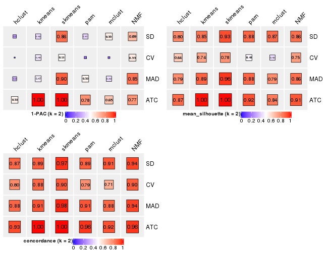</p>

</div>
<div id='tab-collect-stats-from-consensus-partition-list-2'>
<pre><code class="r">collect_stats(res_list, k = 3)
</code></pre>

<p>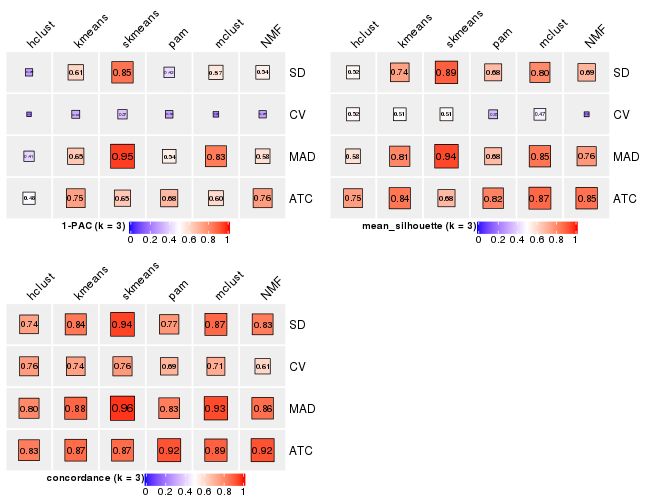</p>

</div>
<div id='tab-collect-stats-from-consensus-partition-list-3'>
<pre><code class="r">collect_stats(res_list, k = 4)
</code></pre>

<p></p>

</div>
<div id='tab-collect-stats-from-consensus-partition-list-4'>
<pre><code class="r">collect_stats(res_list, k = 5)
</code></pre>

<p></p>

</div>
<div id='tab-collect-stats-from-consensus-partition-list-5'>
<pre><code class="r">collect_stats(res_list, k = 6)
</code></pre>

<p></p>

</div>
</div>

### Partition from all methods


Collect partitions from all methods:


<script>
$( function() {
	$( '#tabs-collect-classes-from-consensus-partition-list' ).tabs();
} );
</script>
<div id='tabs-collect-classes-from-consensus-partition-list'>
<ul>
<li><a href='#tab-collect-classes-from-consensus-partition-list-1'>k = 2</a></li>
<li><a href='#tab-collect-classes-from-consensus-partition-list-2'>k = 3</a></li>
<li><a href='#tab-collect-classes-from-consensus-partition-list-3'>k = 4</a></li>
<li><a href='#tab-collect-classes-from-consensus-partition-list-4'>k = 5</a></li>
<li><a href='#tab-collect-classes-from-consensus-partition-list-5'>k = 6</a></li>
</ul>
<div id='tab-collect-classes-from-consensus-partition-list-1'>
<pre><code class="r">collect_classes(res_list, k = 2)
</code></pre>

<p></p>

</div>
<div id='tab-collect-classes-from-consensus-partition-list-2'>
<pre><code class="r">collect_classes(res_list, k = 3)
</code></pre>

<p></p>

</div>
<div id='tab-collect-classes-from-consensus-partition-list-3'>
<pre><code class="r">collect_classes(res_list, k = 4)
</code></pre>

<p></p>

</div>
<div id='tab-collect-classes-from-consensus-partition-list-4'>
<pre><code class="r">collect_classes(res_list, k = 5)
</code></pre>

<p></p>

</div>
<div id='tab-collect-classes-from-consensus-partition-list-5'>
<pre><code class="r">collect_classes(res_list, k = 6)
</code></pre>

<p></p>

</div>
</div>


### Top rows overlap


Overlap of top rows from different top-row methods:


<script>
$( function() {
	$( '#tabs-top-rows-overlap-by-euler' ).tabs();
} );
</script>
<div id='tabs-top-rows-overlap-by-euler'>
<ul>
<li><a href='#tab-top-rows-overlap-by-euler-1'>top_n = 1000</a></li>
<li><a href='#tab-top-rows-overlap-by-euler-2'>top_n = 2000</a></li>
<li><a href='#tab-top-rows-overlap-by-euler-3'>top_n = 3000</a></li>
<li><a href='#tab-top-rows-overlap-by-euler-4'>top_n = 4000</a></li>
<li><a href='#tab-top-rows-overlap-by-euler-5'>top_n = 5000</a></li>
</ul>
<div id='tab-top-rows-overlap-by-euler-1'>
<pre><code class="r">top_rows_overlap(res_list, top_n = 1000, method = &quot;euler&quot;)
</code></pre>

<p></p>

</div>
<div id='tab-top-rows-overlap-by-euler-2'>
<pre><code class="r">top_rows_overlap(res_list, top_n = 2000, method = &quot;euler&quot;)
</code></pre>

<p></p>

</div>
<div id='tab-top-rows-overlap-by-euler-3'>
<pre><code class="r">top_rows_overlap(res_list, top_n = 3000, method = &quot;euler&quot;)
</code></pre>

<p></p>

</div>
<div id='tab-top-rows-overlap-by-euler-4'>
<pre><code class="r">top_rows_overlap(res_list, top_n = 4000, method = &quot;euler&quot;)
</code></pre>

<p></p>

</div>
<div id='tab-top-rows-overlap-by-euler-5'>
<pre><code class="r">top_rows_overlap(res_list, top_n = 5000, method = &quot;euler&quot;)
</code></pre>

<p></p>

</div>
</div>

Also visualize the correspondance of rankings between different top-row methods:


<script>
$( function() {
	$( '#tabs-top-rows-overlap-by-correspondance' ).tabs();
} );
</script>
<div id='tabs-top-rows-overlap-by-correspondance'>
<ul>
<li><a href='#tab-top-rows-overlap-by-correspondance-1'>top_n = 1000</a></li>
<li><a href='#tab-top-rows-overlap-by-correspondance-2'>top_n = 2000</a></li>
<li><a href='#tab-top-rows-overlap-by-correspondance-3'>top_n = 3000</a></li>
<li><a href='#tab-top-rows-overlap-by-correspondance-4'>top_n = 4000</a></li>
<li><a href='#tab-top-rows-overlap-by-correspondance-5'>top_n = 5000</a></li>
</ul>
<div id='tab-top-rows-overlap-by-correspondance-1'>
<pre><code class="r">top_rows_overlap(res_list, top_n = 1000, method = &quot;correspondance&quot;)
</code></pre>

<p></p>

</div>
<div id='tab-top-rows-overlap-by-correspondance-2'>
<pre><code class="r">top_rows_overlap(res_list, top_n = 2000, method = &quot;correspondance&quot;)
</code></pre>

<p></p>

</div>
<div id='tab-top-rows-overlap-by-correspondance-3'>
<pre><code class="r">top_rows_overlap(res_list, top_n = 3000, method = &quot;correspondance&quot;)
</code></pre>

<p></p>

</div>
<div id='tab-top-rows-overlap-by-correspondance-4'>
<pre><code class="r">top_rows_overlap(res_list, top_n = 4000, method = &quot;correspondance&quot;)
</code></pre>

<p></p>

</div>
<div id='tab-top-rows-overlap-by-correspondance-5'>
<pre><code class="r">top_rows_overlap(res_list, top_n = 5000, method = &quot;correspondance&quot;)
</code></pre>

<p>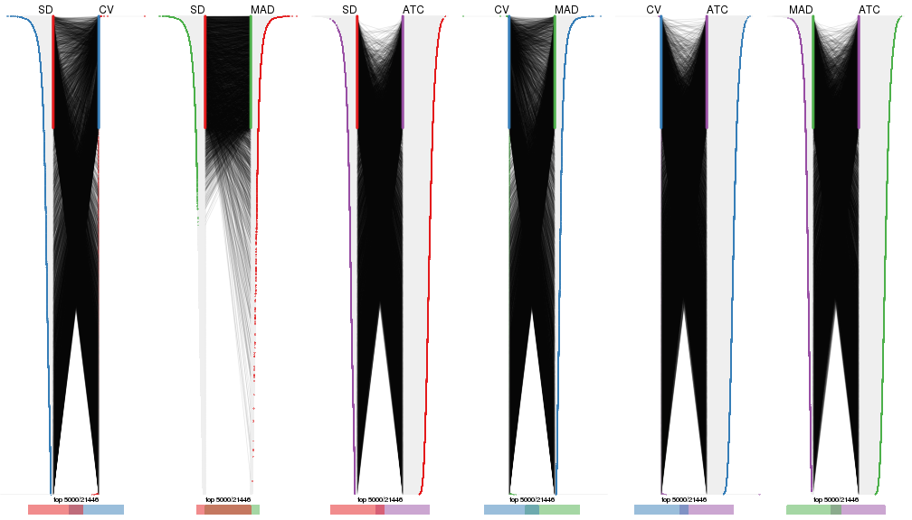</p>

</div>
</div>


Heatmaps of the top rows:


<script>
$( function() {
	$( '#tabs-top-rows-heatmap' ).tabs();
} );
</script>
<div id='tabs-top-rows-heatmap'>
<ul>
<li><a href='#tab-top-rows-heatmap-1'>top_n = 1000</a></li>
<li><a href='#tab-top-rows-heatmap-2'>top_n = 2000</a></li>
<li><a href='#tab-top-rows-heatmap-3'>top_n = 3000</a></li>
<li><a href='#tab-top-rows-heatmap-4'>top_n = 4000</a></li>
<li><a href='#tab-top-rows-heatmap-5'>top_n = 5000</a></li>
</ul>
<div id='tab-top-rows-heatmap-1'>
<pre><code class="r">top_rows_heatmap(res_list, top_n = 1000)
</code></pre>

<p></p>

</div>
<div id='tab-top-rows-heatmap-2'>
<pre><code class="r">top_rows_heatmap(res_list, top_n = 2000)
</code></pre>

<p></p>

</div>
<div id='tab-top-rows-heatmap-3'>
<pre><code class="r">top_rows_heatmap(res_list, top_n = 3000)
</code></pre>

<p></p>

</div>
<div id='tab-top-rows-heatmap-4'>
<pre><code class="r">top_rows_heatmap(res_list, top_n = 4000)
</code></pre>

<p></p>

</div>
<div id='tab-top-rows-heatmap-5'>
<pre><code class="r">top_rows_heatmap(res_list, top_n = 5000)
</code></pre>

<p></p>

</div>
</div>


### Test to known annotations


Test correlation between subgroups and known annotations. If the known
annotation is numeric, one-way ANOVA test is applied, and if the known
annotation is discrete, chi-squared contingency table test is applied.


<script>
$( function() {
	$( '#tabs-test-to-known-factors-from-consensus-partition-list' ).tabs();
} );
</script>
<div id='tabs-test-to-known-factors-from-consensus-partition-list'>
<ul>
<li><a href='#tab-test-to-known-factors-from-consensus-partition-list-1'>k = 2</a></li>
<li><a href='#tab-test-to-known-factors-from-consensus-partition-list-2'>k = 3</a></li>
<li><a href='#tab-test-to-known-factors-from-consensus-partition-list-3'>k = 4</a></li>
<li><a href='#tab-test-to-known-factors-from-consensus-partition-list-4'>k = 5</a></li>
<li><a href='#tab-test-to-known-factors-from-consensus-partition-list-5'>k = 6</a></li>
</ul>
<div id='tab-test-to-known-factors-from-consensus-partition-list-1'>
<pre><code class="r">test_to_known_factors(res_list, k = 2)
</code></pre>

<pre><code>#&gt;              n disease.state(p) k
#&gt; SD:NMF      56           0.5927 2
#&gt; CV:NMF      51           0.3446 2
#&gt; MAD:NMF     54           0.7854 2
#&gt; ATC:NMF     57           0.1874 2
#&gt; SD:skmeans  59           1.0000 2
#&gt; CV:skmeans  54           0.5852 2
#&gt; MAD:skmeans 60           1.0000 2
#&gt; ATC:skmeans 60           0.4376 2
#&gt; SD:mclust   59           1.0000 2
#&gt; CV:mclust   39           0.3165 2
#&gt; MAD:mclust  57           1.0000 2
#&gt; ATC:mclust  58           0.1627 2
#&gt; SD:kmeans   57           1.0000 2
#&gt; CV:kmeans   53           0.6740 2
#&gt; MAD:kmeans  60           1.0000 2
#&gt; ATC:kmeans  60           0.4376 2
#&gt; SD:pam      60           0.0578 2
#&gt; CV:pam      40           1.0000 2
#&gt; MAD:pam     59           0.0759 2
#&gt; ATC:pam     59           0.7996 2
#&gt; SD:hclust   59           0.7006 2
#&gt; CV:hclust   48           0.5911 2
#&gt; MAD:hclust  51           0.4903 2
#&gt; ATC:hclust  56           0.4033 2
</code></pre>

</div>
<div id='tab-test-to-known-factors-from-consensus-partition-list-2'>
<pre><code class="r">test_to_known_factors(res_list, k = 3)
</code></pre>

<pre><code>#&gt;              n disease.state(p) k
#&gt; SD:NMF      53           0.0465 3
#&gt; CV:NMF       9               NA 3
#&gt; MAD:NMF     56           0.1124 3
#&gt; ATC:NMF     57           0.0246 3
#&gt; SD:skmeans  58           0.0963 3
#&gt; CV:skmeans  41           0.0641 3
#&gt; MAD:skmeans 60           0.0886 3
#&gt; ATC:skmeans 47           0.1612 3
#&gt; SD:mclust   55           0.1734 3
#&gt; CV:mclust   40           0.2239 3
#&gt; MAD:mclust  56           0.1789 3
#&gt; ATC:mclust  59           0.2916 3
#&gt; SD:kmeans   50           0.8275 3
#&gt; CV:kmeans   37           0.1953 3
#&gt; MAD:kmeans  56           0.1330 3
#&gt; ATC:kmeans  58           0.0302 3
#&gt; SD:pam      47           0.2089 3
#&gt; CV:pam      20           0.9207 3
#&gt; MAD:pam     43           0.2411 3
#&gt; ATC:pam     53           0.2593 3
#&gt; SD:hclust   40           0.8063 3
#&gt; CV:hclust   39           0.4682 3
#&gt; MAD:hclust  41           0.5564 3
#&gt; ATC:hclust  55           0.0774 3
</code></pre>

</div>
<div id='tab-test-to-known-factors-from-consensus-partition-list-3'>
<pre><code class="r">test_to_known_factors(res_list, k = 4)
</code></pre>

<pre><code>#&gt;              n disease.state(p) k
#&gt; SD:NMF      38           0.6439 4
#&gt; CV:NMF      26           0.2622 4
#&gt; MAD:NMF     40           0.5764 4
#&gt; ATC:NMF     56           0.0496 4
#&gt; SD:skmeans  48           0.4925 4
#&gt; CV:skmeans  24           0.3973 4
#&gt; MAD:skmeans 51           0.1528 4
#&gt; ATC:skmeans 52           0.0328 4
#&gt; SD:mclust   56           0.4982 4
#&gt; CV:mclust   42           0.1252 4
#&gt; MAD:mclust  55           0.5547 4
#&gt; ATC:mclust  55           0.0936 4
#&gt; SD:kmeans   41           0.9944 4
#&gt; CV:kmeans   32           0.2336 4
#&gt; MAD:kmeans  51           0.3677 4
#&gt; ATC:kmeans  49           0.0527 4
#&gt; SD:pam      52           0.7748 4
#&gt; CV:pam      17           1.0000 4
#&gt; MAD:pam     57           0.6328 4
#&gt; ATC:pam     54           0.2374 4
#&gt; SD:hclust   51           0.5158 4
#&gt; CV:hclust   37           0.2749 4
#&gt; MAD:hclust  40           0.1695 4
#&gt; ATC:hclust  42           0.2577 4
</code></pre>

</div>
<div id='tab-test-to-known-factors-from-consensus-partition-list-4'>
<pre><code class="r">test_to_known_factors(res_list, k = 5)
</code></pre>

<pre><code>#&gt;              n disease.state(p) k
#&gt; SD:NMF      50           0.3148 5
#&gt; CV:NMF      20           0.4781 5
#&gt; MAD:NMF     34           0.6137 5
#&gt; ATC:NMF     48           0.0440 5
#&gt; SD:skmeans  52           0.2189 5
#&gt; CV:skmeans  35           0.6741 5
#&gt; MAD:skmeans 46           0.2975 5
#&gt; ATC:skmeans 49           0.1723 5
#&gt; SD:mclust   55           0.2914 5
#&gt; CV:mclust   33           0.7830 5
#&gt; MAD:mclust  53           0.3102 5
#&gt; ATC:mclust  44           0.0329 5
#&gt; SD:kmeans   55           0.3466 5
#&gt; CV:kmeans   37           0.4493 5
#&gt; MAD:kmeans  52           0.5014 5
#&gt; ATC:kmeans  42           0.0803 5
#&gt; SD:pam      56           0.7150 5
#&gt; CV:pam      27           0.9175 5
#&gt; MAD:pam     53           0.7616 5
#&gt; ATC:pam     40           0.2976 5
#&gt; SD:hclust   47           0.6299 5
#&gt; CV:hclust   36           0.9532 5
#&gt; MAD:hclust  39           0.1246 5
#&gt; ATC:hclust  29           0.2739 5
</code></pre>

</div>
<div id='tab-test-to-known-factors-from-consensus-partition-list-5'>
<pre><code class="r">test_to_known_factors(res_list, k = 6)
</code></pre>

<pre><code>#&gt;              n disease.state(p) k
#&gt; SD:NMF      41           0.6863 6
#&gt; CV:NMF      20           0.8314 6
#&gt; MAD:NMF     44           0.6356 6
#&gt; ATC:NMF     38           0.0137 6
#&gt; SD:skmeans  39           0.3047 6
#&gt; CV:skmeans  22           0.4645 6
#&gt; MAD:skmeans 32           0.5385 6
#&gt; ATC:skmeans 37           0.0662 6
#&gt; SD:mclust   52           0.5341 6
#&gt; CV:mclust   26           0.9198 6
#&gt; MAD:mclust  51           0.3101 6
#&gt; ATC:mclust  43           0.4820 6
#&gt; SD:kmeans   39           0.4328 6
#&gt; CV:kmeans   28           0.5513 6
#&gt; MAD:kmeans  41           0.3929 6
#&gt; ATC:kmeans  40           0.4214 6
#&gt; SD:pam      54           0.7414 6
#&gt; CV:pam      28           0.7336 6
#&gt; MAD:pam     55           0.5787 6
#&gt; ATC:pam     57           0.3648 6
#&gt; SD:hclust   37           0.6894 6
#&gt; CV:hclust   29           0.2574 6
#&gt; MAD:hclust  39           0.2354 6
#&gt; ATC:hclust  29           0.9877 6
</code></pre>

</div>
</div>


 
## Results for each method


---------------------------------------------------


### SD:hclust


The object with results only for a single top-value method and a single partition method 
can be extracted as:

```r
res = res_list["SD", "hclust"]
# you can also extract it by
# res = res_list["SD:hclust"]
```

A summary of `res` and all the functions that can be applied to it:

```r
res
```

```
#> A 'ConsensusPartition' object with k = 2, 3, 4, 5, 6.
#>   On a matrix with 21446 rows and 60 columns.
#>   Top rows (1000, 2000, 3000, 4000, 5000) are extracted by 'SD' method.
#>   Subgroups are detected by 'hclust' method.
#>   Performed in total 1250 partitions by row resampling.
#>   Best k for subgroups seems to be 2.
#> 
#> Following methods can be applied to this 'ConsensusPartition' object:
#>  [1] "cola_report"             "collect_classes"         "collect_plots"          
#>  [4] "collect_stats"           "colnames"                "compare_signatures"     
#>  [7] "consensus_heatmap"       "dimension_reduction"     "functional_enrichment"  
#> [10] "get_anno_col"            "get_anno"                "get_classes"            
#> [13] "get_consensus"           "get_matrix"              "get_membership"         
#> [16] "get_param"               "get_signatures"          "get_stats"              
#> [19] "is_best_k"               "is_stable_k"             "membership_heatmap"     
#> [22] "ncol"                    "nrow"                    "plot_ecdf"              
#> [25] "rownames"                "select_partition_number" "show"                   
#> [28] "suggest_best_k"          "test_to_known_factors"
```

`collect_plots()` function collects all the plots made from `res` for all `k` (number of partitions)
into one single page to provide an easy and fast comparison between different `k`.

```r
collect_plots(res)
```


The plots are:

- The first row: a plot of the ECDF (Empirical cumulative distribution
  function) curves of the consensus matrix for each `k` and the heatmap of
  predicted classes for each `k`.
- The second row: heatmaps of the consensus matrix for each `k`.
- The third row: heatmaps of the membership matrix for each `k`.
- The fouth row: heatmaps of the signatures for each `k`.

All the plots in panels can be made by individual functions and they are
plotted later in this section.

`select_partition_number()` produces several plots showing different
statistics for choosing "optimized" `k`. There are following statistics:

- ECDF curves of the consensus matrix for each `k`;
- 1-PAC. [The PAC
  score](https://en.wikipedia.org/wiki/Consensus_clustering#Over-interpretation_potential_of_consensus_clustering)
  measures the proportion of the ambiguous subgrouping.
- Mean silhouette score.
- Concordance. The mean probability of fiting the consensus class ids in all
  partitions.
- Area increased. Denote $A_k$ as the area under the ECDF curve for current
  `k`, the area increased is defined as $A_k - A_{k-1}$.
- Rand index. The percent of pairs of samples that are both in a same cluster
  or both are not in a same cluster in the partition of k and k-1.
- Jaccard index. The ratio of pairs of samples are both in a same cluster in
  the partition of k and k-1 and the pairs of samples are both in a same
  cluster in the partition k or k-1.

The detailed explanations of these statistics can be found in [the cola
vignette](http://bioconductor.org/packages/devel/bioc/vignettes/cola/inst/doc/cola.html#toc_13).

Generally speaking, lower PAC score, higher mean silhouette score or higher
concordance corresponds to better partition. Rand index and Jaccard index
measure how similar the current partition is compared to partition with `k-1`.
If they are too similar, we won't accept `k` is better than `k-1`.

```r
select_partition_number(res)
```


The numeric values for all these statistics can be obtained by `get_stats()`.

```r
get_stats(res)
```

```
#>   k 1-PAC mean_silhouette concordance area_increased  Rand Jaccard
#> 2 2 0.278           0.802       0.872         0.4634 0.492   0.492
#> 3 3 0.291           0.521       0.744         0.2812 0.950   0.899
#> 4 4 0.424           0.656       0.781         0.1398 0.825   0.625
#> 5 5 0.561           0.627       0.772         0.0841 0.946   0.827
#> 6 6 0.573           0.513       0.686         0.0571 0.927   0.727
```

`suggest_best_k()` suggests the best $k$ based on these statistics. The rules are as follows:

- All $k$ with Jaccard index larger than 0.95 are removed because the increase of
  the partition number does not provides enough extra information. If all $k$ are removed,
  the best $k$ is assigned by `NA`.
- For $k$ with 1-PAC larger than 0.9, the maximal $k$ is taken as the "best k". Other $k$ is called "optional k".
- If it does not fit the second rule. The $k$ with the highest vote of highest
  1-PAC, mean silhouette and concordance is taken as the "best k".

```r
suggest_best_k(res)
```

```
#> [1] 2
```


Following shows the table of the partitions (You need to click the **show/hide
code output** link to see it). The membership matrix (columns with name `p*`)
is inferred by
[`clue::cl_consensus()`](https://www.rdocumentation.org/link/cl_consensus?package=clue)
function with the `SE` method. Basically the value in the membership matrix
represents the probability to belong to a certain group. The finall class
label for an item is determined with the group with highest probability it
belongs to.

In `get_classes()` function, the entropy is calculated from the membership
matrix and the silhouette score is calculated from the consensus matrix.


<script>
$( function() {
	$( '#tabs-SD-hclust-get-classes' ).tabs();
} );
</script>
<div id='tabs-SD-hclust-get-classes'>
<ul>
<li><a href='#tab-SD-hclust-get-classes-1'>k = 2</a></li>
<li><a href='#tab-SD-hclust-get-classes-2'>k = 3</a></li>
<li><a href='#tab-SD-hclust-get-classes-3'>k = 4</a></li>
<li><a href='#tab-SD-hclust-get-classes-4'>k = 5</a></li>
<li><a href='#tab-SD-hclust-get-classes-5'>k = 6</a></li>
</ul>

<div id='tab-SD-hclust-get-classes-1'>
<p><a id='tab-SD-hclust-get-classes-1-a' style='color:#0366d6' href='#'>show/hide code output</a></p>
<pre><code class="r">cbind(get_classes(res, k = 2), get_membership(res, k = 2))
</code></pre>

<pre><code>#&gt;          class entropy silhouette    p1    p2
#&gt; GSM22453     1  0.5629      0.855 0.868 0.132
#&gt; GSM22458     2  0.1184      0.896 0.016 0.984
#&gt; GSM22465     1  0.8955      0.701 0.688 0.312
#&gt; GSM22466     1  0.5629      0.855 0.868 0.132
#&gt; GSM22468     2  0.0376      0.891 0.004 0.996
#&gt; GSM22469     2  0.9815      0.105 0.420 0.580
#&gt; GSM22471     2  0.1633      0.897 0.024 0.976
#&gt; GSM22472     2  0.1184      0.896 0.016 0.984
#&gt; GSM22474     2  0.3274      0.889 0.060 0.940
#&gt; GSM22476     2  0.6531      0.804 0.168 0.832
#&gt; GSM22477     2  0.6438      0.780 0.164 0.836
#&gt; GSM22478     2  0.2948      0.892 0.052 0.948
#&gt; GSM22481     2  0.2236      0.893 0.036 0.964
#&gt; GSM22484     1  0.7376      0.823 0.792 0.208
#&gt; GSM22485     1  0.9608      0.569 0.616 0.384
#&gt; GSM22487     1  0.9286      0.648 0.656 0.344
#&gt; GSM22488     1  0.6623      0.844 0.828 0.172
#&gt; GSM22489     1  0.1414      0.806 0.980 0.020
#&gt; GSM22490     2  0.0000      0.889 0.000 1.000
#&gt; GSM22492     2  0.0376      0.891 0.004 0.996
#&gt; GSM22493     1  0.6148      0.853 0.848 0.152
#&gt; GSM22494     1  0.5519      0.855 0.872 0.128
#&gt; GSM22497     1  0.5519      0.855 0.872 0.128
#&gt; GSM22498     1  0.9775      0.504 0.588 0.412
#&gt; GSM22501     2  0.6801      0.790 0.180 0.820
#&gt; GSM22502     2  0.0000      0.889 0.000 1.000
#&gt; GSM22503     2  0.2778      0.895 0.048 0.952
#&gt; GSM22504     2  0.1184      0.896 0.016 0.984
#&gt; GSM22505     1  0.1414      0.814 0.980 0.020
#&gt; GSM22506     1  0.6148      0.853 0.848 0.152
#&gt; GSM22507     2  0.8763      0.517 0.296 0.704
#&gt; GSM22508     2  0.3274      0.885 0.060 0.940
#&gt; GSM22449     1  0.0376      0.802 0.996 0.004
#&gt; GSM22450     1  0.5408      0.855 0.876 0.124
#&gt; GSM22451     1  0.4298      0.846 0.912 0.088
#&gt; GSM22452     1  0.8661      0.725 0.712 0.288
#&gt; GSM22454     1  0.9170      0.661 0.668 0.332
#&gt; GSM22455     1  0.4562      0.803 0.904 0.096
#&gt; GSM22456     2  0.8661      0.547 0.288 0.712
#&gt; GSM22457     2  0.2948      0.892 0.052 0.948
#&gt; GSM22459     2  0.4690      0.864 0.100 0.900
#&gt; GSM22460     1  0.4298      0.847 0.912 0.088
#&gt; GSM22461     2  0.1184      0.896 0.016 0.984
#&gt; GSM22462     1  0.1633      0.816 0.976 0.024
#&gt; GSM22463     1  0.0000      0.799 1.000 0.000
#&gt; GSM22464     2  0.4161      0.877 0.084 0.916
#&gt; GSM22467     1  0.6247      0.851 0.844 0.156
#&gt; GSM22470     1  0.8661      0.638 0.712 0.288
#&gt; GSM22473     2  0.4815      0.861 0.104 0.896
#&gt; GSM22475     2  0.5737      0.835 0.136 0.864
#&gt; GSM22479     2  0.1843      0.893 0.028 0.972
#&gt; GSM22480     1  0.9635      0.562 0.612 0.388
#&gt; GSM22482     2  0.6801      0.790 0.180 0.820
#&gt; GSM22483     2  0.1184      0.896 0.016 0.984
#&gt; GSM22486     1  0.3584      0.808 0.932 0.068
#&gt; GSM22491     1  0.7219      0.827 0.800 0.200
#&gt; GSM22495     2  0.4690      0.864 0.100 0.900
#&gt; GSM22496     1  0.5294      0.855 0.880 0.120
#&gt; GSM22499     2  0.0000      0.889 0.000 1.000
#&gt; GSM22500     2  0.1633      0.897 0.024 0.976
</code></pre>

<script>
$('#tab-SD-hclust-get-classes-1-a').parent().next().next().hide();
$('#tab-SD-hclust-get-classes-1-a').click(function(){
  $('#tab-SD-hclust-get-classes-1-a').parent().next().next().toggle();
  return(false);
});
</script>
</div>

<div id='tab-SD-hclust-get-classes-2'>
<p><a id='tab-SD-hclust-get-classes-2-a' style='color:#0366d6' href='#'>show/hide code output</a></p>
<pre><code class="r">cbind(get_classes(res, k = 3), get_membership(res, k = 3))
</code></pre>

<pre><code>#&gt;          class entropy silhouette    p1    p2    p3
#&gt; GSM22453     1   0.153     0.7112 0.960 0.040 0.000
#&gt; GSM22458     2   0.514     0.6327 0.052 0.828 0.120
#&gt; GSM22465     1   0.507     0.5601 0.772 0.224 0.004
#&gt; GSM22466     1   0.153     0.7112 0.960 0.040 0.000
#&gt; GSM22468     2   0.217     0.6919 0.008 0.944 0.048
#&gt; GSM22469     2   0.668    -0.0952 0.496 0.496 0.008
#&gt; GSM22471     2   0.398     0.6955 0.068 0.884 0.048
#&gt; GSM22472     2   0.514     0.6327 0.052 0.828 0.120
#&gt; GSM22474     2   0.385     0.6810 0.028 0.884 0.088
#&gt; GSM22476     2   0.915    -0.5748 0.144 0.432 0.424
#&gt; GSM22477     2   0.665     0.5346 0.172 0.744 0.084
#&gt; GSM22478     2   0.296     0.6850 0.080 0.912 0.008
#&gt; GSM22481     2   0.281     0.6978 0.040 0.928 0.032
#&gt; GSM22484     1   0.679     0.6219 0.744 0.136 0.120
#&gt; GSM22485     1   0.605     0.4186 0.680 0.312 0.008
#&gt; GSM22487     1   0.544     0.5076 0.736 0.260 0.004
#&gt; GSM22488     1   0.254     0.7045 0.920 0.080 0.000
#&gt; GSM22489     1   0.680     0.4519 0.612 0.020 0.368
#&gt; GSM22490     2   0.259     0.6833 0.004 0.924 0.072
#&gt; GSM22492     2   0.228     0.6903 0.008 0.940 0.052
#&gt; GSM22493     1   0.216     0.7122 0.936 0.064 0.000
#&gt; GSM22494     1   0.153     0.7111 0.960 0.040 0.000
#&gt; GSM22497     1   0.141     0.7107 0.964 0.036 0.000
#&gt; GSM22498     1   0.623     0.3609 0.652 0.340 0.008
#&gt; GSM22501     3   0.934     0.4317 0.164 0.412 0.424
#&gt; GSM22502     2   0.259     0.6833 0.004 0.924 0.072
#&gt; GSM22503     2   0.361     0.6678 0.112 0.880 0.008
#&gt; GSM22504     2   0.514     0.6327 0.052 0.828 0.120
#&gt; GSM22505     1   0.555     0.5539 0.724 0.004 0.272
#&gt; GSM22506     1   0.216     0.7122 0.936 0.064 0.000
#&gt; GSM22507     2   0.632     0.1960 0.356 0.636 0.008
#&gt; GSM22508     2   0.337     0.6851 0.072 0.904 0.024
#&gt; GSM22449     1   0.588     0.4824 0.652 0.000 0.348
#&gt; GSM22450     1   0.165     0.7102 0.960 0.036 0.004
#&gt; GSM22451     1   0.460     0.6571 0.832 0.016 0.152
#&gt; GSM22452     1   0.716     0.4461 0.720 0.140 0.140
#&gt; GSM22454     1   0.533     0.5181 0.748 0.248 0.004
#&gt; GSM22455     1   0.821     0.3887 0.556 0.084 0.360
#&gt; GSM22456     2   0.767     0.3568 0.088 0.652 0.260
#&gt; GSM22457     2   0.296     0.6850 0.080 0.912 0.008
#&gt; GSM22459     2   0.756     0.1555 0.056 0.608 0.336
#&gt; GSM22460     1   0.420     0.6631 0.852 0.012 0.136
#&gt; GSM22461     2   0.456     0.6446 0.036 0.852 0.112
#&gt; GSM22462     1   0.514     0.5679 0.748 0.000 0.252
#&gt; GSM22463     1   0.603     0.4636 0.624 0.000 0.376
#&gt; GSM22464     2   0.369     0.6694 0.100 0.884 0.016
#&gt; GSM22467     1   0.268     0.7065 0.924 0.068 0.008
#&gt; GSM22470     3   0.909    -0.1693 0.396 0.140 0.464
#&gt; GSM22473     2   0.702     0.3508 0.056 0.684 0.260
#&gt; GSM22475     2   0.831    -0.2436 0.080 0.500 0.420
#&gt; GSM22479     2   0.329     0.6761 0.012 0.900 0.088
#&gt; GSM22480     1   0.607     0.4132 0.676 0.316 0.008
#&gt; GSM22482     3   0.937     0.4389 0.168 0.408 0.424
#&gt; GSM22483     2   0.514     0.6327 0.052 0.828 0.120
#&gt; GSM22486     1   0.764     0.4455 0.604 0.060 0.336
#&gt; GSM22491     1   0.327     0.6813 0.884 0.116 0.000
#&gt; GSM22495     2   0.756     0.1555 0.056 0.608 0.336
#&gt; GSM22496     1   0.459     0.6746 0.848 0.032 0.120
#&gt; GSM22499     2   0.240     0.6889 0.004 0.932 0.064
#&gt; GSM22500     2   0.398     0.6955 0.068 0.884 0.048
</code></pre>

<script>
$('#tab-SD-hclust-get-classes-2-a').parent().next().next().hide();
$('#tab-SD-hclust-get-classes-2-a').click(function(){
  $('#tab-SD-hclust-get-classes-2-a').parent().next().next().toggle();
  return(false);
});
</script>
</div>

<div id='tab-SD-hclust-get-classes-3'>
<p><a id='tab-SD-hclust-get-classes-3-a' style='color:#0366d6' href='#'>show/hide code output</a></p>
<pre><code class="r">cbind(get_classes(res, k = 4), get_membership(res, k = 4))
</code></pre>

<pre><code>#&gt;          class entropy silhouette    p1    p2    p3    p4
#&gt; GSM22453     1  0.0188      0.762 0.996 0.004 0.000 0.000
#&gt; GSM22458     2  0.4516      0.675 0.020 0.828 0.072 0.080
#&gt; GSM22465     1  0.3982      0.664 0.776 0.220 0.000 0.004
#&gt; GSM22466     1  0.0336      0.764 0.992 0.008 0.000 0.000
#&gt; GSM22468     2  0.3302      0.756 0.020 0.876 0.008 0.096
#&gt; GSM22469     1  0.5606      0.146 0.500 0.480 0.000 0.020
#&gt; GSM22471     2  0.3474      0.766 0.064 0.868 0.000 0.068
#&gt; GSM22472     2  0.4516      0.675 0.020 0.828 0.072 0.080
#&gt; GSM22474     2  0.4649      0.742 0.036 0.824 0.048 0.092
#&gt; GSM22476     4  0.3123      0.645 0.000 0.156 0.000 0.844
#&gt; GSM22477     2  0.6610      0.611 0.196 0.672 0.024 0.108
#&gt; GSM22478     2  0.2882      0.764 0.064 0.904 0.016 0.016
#&gt; GSM22481     2  0.3015      0.771 0.040 0.904 0.020 0.036
#&gt; GSM22484     1  0.5603      0.680 0.752 0.096 0.136 0.016
#&gt; GSM22485     1  0.5088      0.606 0.700 0.276 0.020 0.004
#&gt; GSM22487     1  0.4283      0.636 0.740 0.256 0.000 0.004
#&gt; GSM22488     1  0.1489      0.767 0.952 0.044 0.004 0.000
#&gt; GSM22489     3  0.4466      0.798 0.156 0.004 0.800 0.040
#&gt; GSM22490     2  0.3891      0.736 0.020 0.828 0.004 0.148
#&gt; GSM22492     2  0.3366      0.754 0.020 0.872 0.008 0.100
#&gt; GSM22493     1  0.1004      0.769 0.972 0.024 0.000 0.004
#&gt; GSM22494     1  0.0188      0.760 0.996 0.000 0.000 0.004
#&gt; GSM22497     1  0.0000      0.761 1.000 0.000 0.000 0.000
#&gt; GSM22498     1  0.5284      0.575 0.668 0.308 0.020 0.004
#&gt; GSM22501     4  0.3335      0.626 0.016 0.128 0.000 0.856
#&gt; GSM22502     2  0.3891      0.736 0.020 0.828 0.004 0.148
#&gt; GSM22503     2  0.3219      0.742 0.112 0.868 0.000 0.020
#&gt; GSM22504     2  0.4516      0.675 0.020 0.828 0.072 0.080
#&gt; GSM22505     3  0.4535      0.757 0.292 0.000 0.704 0.004
#&gt; GSM22506     1  0.1004      0.769 0.972 0.024 0.000 0.004
#&gt; GSM22507     2  0.5598      0.380 0.344 0.628 0.020 0.008
#&gt; GSM22508     2  0.4085      0.759 0.092 0.848 0.020 0.040
#&gt; GSM22449     3  0.4053      0.799 0.228 0.000 0.768 0.004
#&gt; GSM22450     1  0.0524      0.759 0.988 0.000 0.004 0.008
#&gt; GSM22451     1  0.4160      0.646 0.792 0.004 0.192 0.012
#&gt; GSM22452     1  0.5200      0.467 0.700 0.036 0.000 0.264
#&gt; GSM22454     1  0.4571      0.634 0.736 0.252 0.008 0.004
#&gt; GSM22455     3  0.5446      0.698 0.092 0.064 0.784 0.060
#&gt; GSM22456     2  0.7615      0.417 0.048 0.592 0.236 0.124
#&gt; GSM22457     2  0.2882      0.764 0.064 0.904 0.016 0.016
#&gt; GSM22459     4  0.5845      0.400 0.008 0.424 0.020 0.548
#&gt; GSM22460     1  0.3764      0.663 0.816 0.000 0.172 0.012
#&gt; GSM22461     2  0.3611      0.690 0.000 0.860 0.060 0.080
#&gt; GSM22462     3  0.5137      0.494 0.452 0.000 0.544 0.004
#&gt; GSM22463     3  0.3539      0.805 0.176 0.000 0.820 0.004
#&gt; GSM22464     2  0.3583      0.756 0.060 0.876 0.048 0.016
#&gt; GSM22467     1  0.1388      0.767 0.960 0.028 0.000 0.012
#&gt; GSM22470     3  0.8129      0.406 0.104 0.068 0.508 0.320
#&gt; GSM22473     2  0.5892     -0.209 0.008 0.512 0.020 0.460
#&gt; GSM22475     4  0.4957      0.591 0.000 0.300 0.016 0.684
#&gt; GSM22479     2  0.4181      0.733 0.024 0.832 0.020 0.124
#&gt; GSM22480     1  0.5114      0.602 0.696 0.280 0.020 0.004
#&gt; GSM22482     4  0.3447      0.622 0.020 0.128 0.000 0.852
#&gt; GSM22483     2  0.4516      0.675 0.020 0.828 0.072 0.080
#&gt; GSM22486     3  0.5151      0.780 0.148 0.044 0.780 0.028
#&gt; GSM22491     1  0.2011      0.758 0.920 0.080 0.000 0.000
#&gt; GSM22495     4  0.5859      0.379 0.008 0.432 0.020 0.540
#&gt; GSM22496     1  0.3324      0.701 0.852 0.000 0.136 0.012
#&gt; GSM22499     2  0.3069      0.756 0.012 0.888 0.012 0.088
#&gt; GSM22500     2  0.3474      0.766 0.064 0.868 0.000 0.068
</code></pre>

<script>
$('#tab-SD-hclust-get-classes-3-a').parent().next().next().hide();
$('#tab-SD-hclust-get-classes-3-a').click(function(){
  $('#tab-SD-hclust-get-classes-3-a').parent().next().next().toggle();
  return(false);
});
</script>
</div>

<div id='tab-SD-hclust-get-classes-4'>
<p><a id='tab-SD-hclust-get-classes-4-a' style='color:#0366d6' href='#'>show/hide code output</a></p>
<pre><code class="r">cbind(get_classes(res, k = 5), get_membership(res, k = 5))
</code></pre>

<pre><code>#&gt;          class entropy silhouette    p1    p2    p3    p4    p5
#&gt; GSM22453     1  0.0290      0.794 0.992 0.008 0.000 0.000 0.000
#&gt; GSM22458     4  0.4356      0.986 0.012 0.340 0.000 0.648 0.000
#&gt; GSM22465     1  0.4520      0.691 0.764 0.116 0.000 0.116 0.004
#&gt; GSM22466     1  0.0404      0.796 0.988 0.012 0.000 0.000 0.000
#&gt; GSM22468     2  0.1205      0.628 0.000 0.956 0.000 0.040 0.004
#&gt; GSM22469     1  0.6726      0.212 0.484 0.316 0.000 0.188 0.012
#&gt; GSM22471     2  0.4725      0.548 0.060 0.772 0.000 0.128 0.040
#&gt; GSM22472     4  0.4356      0.986 0.012 0.340 0.000 0.648 0.000
#&gt; GSM22474     2  0.2116      0.624 0.008 0.912 0.004 0.076 0.000
#&gt; GSM22476     5  0.0794      0.618 0.000 0.028 0.000 0.000 0.972
#&gt; GSM22477     2  0.5603      0.481 0.176 0.704 0.004 0.072 0.044
#&gt; GSM22478     2  0.4284      0.462 0.040 0.736 0.000 0.224 0.000
#&gt; GSM22481     2  0.3527      0.568 0.024 0.804 0.000 0.172 0.000
#&gt; GSM22484     1  0.5246      0.710 0.720 0.084 0.028 0.168 0.000
#&gt; GSM22485     1  0.5199      0.642 0.692 0.220 0.012 0.076 0.000
#&gt; GSM22487     1  0.5070      0.656 0.724 0.124 0.004 0.144 0.004
#&gt; GSM22488     1  0.1492      0.798 0.948 0.040 0.004 0.008 0.000
#&gt; GSM22489     3  0.1560      0.756 0.020 0.000 0.948 0.004 0.028
#&gt; GSM22490     2  0.2569      0.608 0.000 0.892 0.000 0.040 0.068
#&gt; GSM22492     2  0.1124      0.627 0.000 0.960 0.000 0.036 0.004
#&gt; GSM22493     1  0.0880      0.800 0.968 0.032 0.000 0.000 0.000
#&gt; GSM22494     1  0.0324      0.793 0.992 0.004 0.000 0.000 0.004
#&gt; GSM22497     1  0.0324      0.794 0.992 0.004 0.004 0.000 0.000
#&gt; GSM22498     1  0.5505      0.591 0.656 0.252 0.016 0.076 0.000
#&gt; GSM22501     5  0.0566      0.602 0.012 0.004 0.000 0.000 0.984
#&gt; GSM22502     2  0.2569      0.608 0.000 0.892 0.000 0.040 0.068
#&gt; GSM22503     2  0.5532      0.376 0.100 0.664 0.000 0.224 0.012
#&gt; GSM22504     4  0.4356      0.986 0.012 0.340 0.000 0.648 0.000
#&gt; GSM22505     3  0.3210      0.703 0.212 0.000 0.788 0.000 0.000
#&gt; GSM22506     1  0.0880      0.800 0.968 0.032 0.000 0.000 0.000
#&gt; GSM22507     2  0.6763      0.125 0.332 0.496 0.016 0.152 0.004
#&gt; GSM22508     2  0.4389      0.582 0.084 0.784 0.000 0.120 0.012
#&gt; GSM22449     3  0.2011      0.762 0.088 0.000 0.908 0.004 0.000
#&gt; GSM22450     1  0.0613      0.792 0.984 0.004 0.004 0.000 0.008
#&gt; GSM22451     1  0.4199      0.691 0.772 0.000 0.068 0.160 0.000
#&gt; GSM22452     1  0.3949      0.521 0.696 0.004 0.000 0.000 0.300
#&gt; GSM22454     1  0.5251      0.656 0.720 0.120 0.012 0.144 0.004
#&gt; GSM22455     3  0.4705      0.662 0.000 0.052 0.724 0.216 0.008
#&gt; GSM22456     2  0.5683      0.346 0.004 0.648 0.100 0.240 0.008
#&gt; GSM22457     2  0.4284      0.462 0.040 0.736 0.000 0.224 0.000
#&gt; GSM22459     5  0.5844      0.422 0.000 0.432 0.012 0.064 0.492
#&gt; GSM22460     1  0.3821      0.710 0.800 0.000 0.052 0.148 0.000
#&gt; GSM22461     4  0.4060      0.943 0.000 0.360 0.000 0.640 0.000
#&gt; GSM22462     3  0.4380      0.465 0.376 0.000 0.616 0.008 0.000
#&gt; GSM22463     3  0.0963      0.764 0.036 0.000 0.964 0.000 0.000
#&gt; GSM22464     2  0.5054      0.449 0.032 0.716 0.044 0.208 0.000
#&gt; GSM22467     1  0.1329      0.797 0.956 0.032 0.000 0.004 0.008
#&gt; GSM22470     3  0.6374      0.371 0.012 0.092 0.596 0.024 0.276
#&gt; GSM22473     2  0.5822     -0.333 0.000 0.512 0.012 0.064 0.412
#&gt; GSM22475     5  0.5195      0.577 0.000 0.296 0.008 0.052 0.644
#&gt; GSM22479     2  0.1960      0.618 0.000 0.928 0.004 0.048 0.020
#&gt; GSM22480     1  0.5324      0.633 0.684 0.224 0.016 0.076 0.000
#&gt; GSM22482     5  0.0566      0.597 0.012 0.004 0.000 0.000 0.984
#&gt; GSM22483     4  0.4356      0.986 0.012 0.340 0.000 0.648 0.000
#&gt; GSM22486     3  0.3781      0.733 0.020 0.040 0.828 0.112 0.000
#&gt; GSM22491     1  0.2144      0.787 0.912 0.068 0.000 0.020 0.000
#&gt; GSM22495     5  0.5852      0.393 0.000 0.444 0.012 0.064 0.480
#&gt; GSM22496     1  0.3351      0.738 0.828 0.004 0.020 0.148 0.000
#&gt; GSM22499     2  0.2179      0.598 0.000 0.896 0.000 0.100 0.004
#&gt; GSM22500     2  0.4725      0.548 0.060 0.772 0.000 0.128 0.040
</code></pre>

<script>
$('#tab-SD-hclust-get-classes-4-a').parent().next().next().hide();
$('#tab-SD-hclust-get-classes-4-a').click(function(){
  $('#tab-SD-hclust-get-classes-4-a').parent().next().next().toggle();
  return(false);
});
</script>
</div>

<div id='tab-SD-hclust-get-classes-5'>
<p><a id='tab-SD-hclust-get-classes-5-a' style='color:#0366d6' href='#'>show/hide code output</a></p>
<pre><code class="r">cbind(get_classes(res, k = 6), get_membership(res, k = 6))
</code></pre>

<pre><code>#&gt;          class entropy silhouette    p1    p2    p3    p4    p5    p6
#&gt; GSM22453     1  0.0146     0.7906 0.996 0.000 0.000 0.000 0.000 0.004
#&gt; GSM22458     4  0.4118     0.9866 0.004 0.396 0.000 0.592 0.000 0.008
#&gt; GSM22465     1  0.3357     0.6561 0.764 0.224 0.000 0.004 0.000 0.008
#&gt; GSM22466     1  0.0291     0.7919 0.992 0.004 0.000 0.000 0.000 0.004
#&gt; GSM22468     6  0.3975     0.4776 0.000 0.452 0.000 0.000 0.004 0.544
#&gt; GSM22469     2  0.4465    -0.2198 0.472 0.504 0.000 0.004 0.000 0.020
#&gt; GSM22471     2  0.4656     0.2080 0.052 0.704 0.000 0.004 0.020 0.220
#&gt; GSM22472     4  0.4118     0.9866 0.004 0.396 0.000 0.592 0.000 0.008
#&gt; GSM22474     6  0.4323     0.4333 0.008 0.476 0.000 0.008 0.000 0.508
#&gt; GSM22476     5  0.0820     0.6008 0.000 0.012 0.000 0.000 0.972 0.016
#&gt; GSM22477     6  0.6848     0.0946 0.148 0.380 0.004 0.024 0.028 0.416
#&gt; GSM22478     2  0.2384     0.3131 0.032 0.884 0.000 0.000 0.000 0.084
#&gt; GSM22481     2  0.5020    -0.1751 0.024 0.600 0.000 0.044 0.000 0.332
#&gt; GSM22484     1  0.5809     0.6186 0.620 0.076 0.004 0.228 0.000 0.072
#&gt; GSM22485     1  0.4637     0.5915 0.684 0.224 0.000 0.004 0.000 0.088
#&gt; GSM22487     1  0.3722     0.6184 0.724 0.260 0.004 0.004 0.000 0.008
#&gt; GSM22488     1  0.1320     0.7903 0.948 0.036 0.000 0.000 0.000 0.016
#&gt; GSM22489     3  0.1230     0.7492 0.008 0.000 0.956 0.000 0.028 0.008
#&gt; GSM22490     2  0.4776    -0.3240 0.000 0.496 0.000 0.004 0.040 0.460
#&gt; GSM22492     6  0.4098     0.4878 0.000 0.444 0.000 0.004 0.004 0.548
#&gt; GSM22493     1  0.0820     0.7937 0.972 0.012 0.000 0.000 0.000 0.016
#&gt; GSM22494     1  0.0146     0.7898 0.996 0.000 0.000 0.000 0.004 0.000
#&gt; GSM22497     1  0.0146     0.7907 0.996 0.000 0.004 0.000 0.000 0.000
#&gt; GSM22498     1  0.4886     0.5387 0.648 0.252 0.000 0.004 0.000 0.096
#&gt; GSM22501     5  0.0146     0.5817 0.004 0.000 0.000 0.000 0.996 0.000
#&gt; GSM22502     2  0.4776    -0.3240 0.000 0.496 0.000 0.004 0.040 0.460
#&gt; GSM22503     2  0.2333     0.3446 0.092 0.884 0.000 0.000 0.000 0.024
#&gt; GSM22504     4  0.4118     0.9866 0.004 0.396 0.000 0.592 0.000 0.008
#&gt; GSM22505     3  0.2994     0.6808 0.208 0.000 0.788 0.000 0.000 0.004
#&gt; GSM22506     1  0.0820     0.7937 0.972 0.012 0.000 0.000 0.000 0.016
#&gt; GSM22507     2  0.5021     0.2097 0.324 0.592 0.000 0.004 0.000 0.080
#&gt; GSM22508     2  0.4702     0.0482 0.076 0.660 0.000 0.004 0.000 0.260
#&gt; GSM22449     3  0.1682     0.7534 0.052 0.000 0.928 0.000 0.000 0.020
#&gt; GSM22450     1  0.0405     0.7892 0.988 0.000 0.000 0.000 0.008 0.004
#&gt; GSM22451     1  0.5414     0.5562 0.612 0.008 0.032 0.292 0.000 0.056
#&gt; GSM22452     1  0.3840     0.5225 0.696 0.000 0.000 0.008 0.288 0.008
#&gt; GSM22454     1  0.3818     0.6190 0.720 0.260 0.004 0.004 0.000 0.012
#&gt; GSM22455     3  0.4332     0.6445 0.000 0.000 0.672 0.052 0.000 0.276
#&gt; GSM22456     6  0.5315     0.2651 0.004 0.252 0.048 0.052 0.000 0.644
#&gt; GSM22457     2  0.2384     0.3131 0.032 0.884 0.000 0.000 0.000 0.084
#&gt; GSM22459     5  0.6440     0.5128 0.000 0.132 0.004 0.048 0.480 0.336
#&gt; GSM22460     1  0.4722     0.5849 0.640 0.000 0.008 0.296 0.000 0.056
#&gt; GSM22461     4  0.4584     0.9451 0.000 0.404 0.000 0.556 0.000 0.040
#&gt; GSM22462     3  0.5018     0.4731 0.328 0.000 0.604 0.028 0.000 0.040
#&gt; GSM22463     3  0.0458     0.7543 0.016 0.000 0.984 0.000 0.000 0.000
#&gt; GSM22464     2  0.3225     0.2704 0.024 0.828 0.008 0.004 0.000 0.136
#&gt; GSM22467     1  0.1230     0.7895 0.956 0.028 0.000 0.000 0.008 0.008
#&gt; GSM22470     3  0.6092     0.3886 0.008 0.012 0.592 0.052 0.268 0.068
#&gt; GSM22473     5  0.6725     0.3422 0.000 0.172 0.004 0.048 0.400 0.376
#&gt; GSM22475     5  0.5825     0.6026 0.000 0.124 0.004 0.052 0.628 0.192
#&gt; GSM22479     6  0.5059     0.4726 0.000 0.372 0.000 0.044 0.020 0.564
#&gt; GSM22480     1  0.4707     0.5827 0.676 0.228 0.000 0.004 0.000 0.092
#&gt; GSM22482     5  0.0665     0.5759 0.004 0.000 0.000 0.008 0.980 0.008
#&gt; GSM22483     4  0.4118     0.9866 0.004 0.396 0.000 0.592 0.000 0.008
#&gt; GSM22486     3  0.3873     0.7156 0.012 0.012 0.788 0.032 0.000 0.156
#&gt; GSM22491     1  0.2009     0.7739 0.908 0.068 0.000 0.000 0.000 0.024
#&gt; GSM22495     5  0.6523     0.4926 0.000 0.144 0.004 0.048 0.468 0.336
#&gt; GSM22496     1  0.4146     0.6256 0.680 0.000 0.004 0.288 0.000 0.028
#&gt; GSM22499     2  0.4887    -0.5092 0.000 0.476 0.000 0.048 0.004 0.472
#&gt; GSM22500     2  0.4656     0.2080 0.052 0.704 0.000 0.004 0.020 0.220
</code></pre>

<script>
$('#tab-SD-hclust-get-classes-5-a').parent().next().next().hide();
$('#tab-SD-hclust-get-classes-5-a').click(function(){
  $('#tab-SD-hclust-get-classes-5-a').parent().next().next().toggle();
  return(false);
});
</script>
</div>
</div>

Heatmaps for the consensus matrix. It visualizes the probability of two
samples to be in a same group.


<script>
$( function() {
	$( '#tabs-SD-hclust-consensus-heatmap' ).tabs();
} );
</script>
<div id='tabs-SD-hclust-consensus-heatmap'>
<ul>
<li><a href='#tab-SD-hclust-consensus-heatmap-1'>k = 2</a></li>
<li><a href='#tab-SD-hclust-consensus-heatmap-2'>k = 3</a></li>
<li><a href='#tab-SD-hclust-consensus-heatmap-3'>k = 4</a></li>
<li><a href='#tab-SD-hclust-consensus-heatmap-4'>k = 5</a></li>
<li><a href='#tab-SD-hclust-consensus-heatmap-5'>k = 6</a></li>
</ul>
<div id='tab-SD-hclust-consensus-heatmap-1'>
<pre><code class="r">consensus_heatmap(res, k = 2)
</code></pre>

<p></p>

</div>
<div id='tab-SD-hclust-consensus-heatmap-2'>
<pre><code class="r">consensus_heatmap(res, k = 3)
</code></pre>

<p></p>

</div>
<div id='tab-SD-hclust-consensus-heatmap-3'>
<pre><code class="r">consensus_heatmap(res, k = 4)
</code></pre>

<p>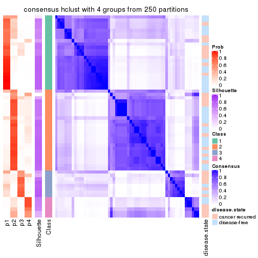</p>

</div>
<div id='tab-SD-hclust-consensus-heatmap-4'>
<pre><code class="r">consensus_heatmap(res, k = 5)
</code></pre>

<p></p>

</div>
<div id='tab-SD-hclust-consensus-heatmap-5'>
<pre><code class="r">consensus_heatmap(res, k = 6)
</code></pre>

<p></p>

</div>
</div>

Heatmaps for the membership of samples in all partitions to see how consistent they are:


<script>
$( function() {
	$( '#tabs-SD-hclust-membership-heatmap' ).tabs();
} );
</script>
<div id='tabs-SD-hclust-membership-heatmap'>
<ul>
<li><a href='#tab-SD-hclust-membership-heatmap-1'>k = 2</a></li>
<li><a href='#tab-SD-hclust-membership-heatmap-2'>k = 3</a></li>
<li><a href='#tab-SD-hclust-membership-heatmap-3'>k = 4</a></li>
<li><a href='#tab-SD-hclust-membership-heatmap-4'>k = 5</a></li>
<li><a href='#tab-SD-hclust-membership-heatmap-5'>k = 6</a></li>
</ul>
<div id='tab-SD-hclust-membership-heatmap-1'>
<pre><code class="r">membership_heatmap(res, k = 2)
</code></pre>

<p></p>

</div>
<div id='tab-SD-hclust-membership-heatmap-2'>
<pre><code class="r">membership_heatmap(res, k = 3)
</code></pre>

<p></p>

</div>
<div id='tab-SD-hclust-membership-heatmap-3'>
<pre><code class="r">membership_heatmap(res, k = 4)
</code></pre>

<p></p>

</div>
<div id='tab-SD-hclust-membership-heatmap-4'>
<pre><code class="r">membership_heatmap(res, k = 5)
</code></pre>

<p></p>

</div>
<div id='tab-SD-hclust-membership-heatmap-5'>
<pre><code class="r">membership_heatmap(res, k = 6)
</code></pre>

<p></p>

</div>
</div>

As soon as we have had the classes for columns, we can look for signatures
which are significantly different between classes which can be candidate marks
for certain classes. Following are the heatmaps for signatures.


Signature heatmaps where rows are scaled:


<script>
$( function() {
	$( '#tabs-SD-hclust-get-signatures' ).tabs();
} );
</script>
<div id='tabs-SD-hclust-get-signatures'>
<ul>
<li><a href='#tab-SD-hclust-get-signatures-1'>k = 2</a></li>
<li><a href='#tab-SD-hclust-get-signatures-2'>k = 3</a></li>
<li><a href='#tab-SD-hclust-get-signatures-3'>k = 4</a></li>
<li><a href='#tab-SD-hclust-get-signatures-4'>k = 5</a></li>
<li><a href='#tab-SD-hclust-get-signatures-5'>k = 6</a></li>
</ul>
<div id='tab-SD-hclust-get-signatures-1'>
<pre><code class="r">get_signatures(res, k = 2)
</code></pre>

<p></p>

</div>
<div id='tab-SD-hclust-get-signatures-2'>
<pre><code class="r">get_signatures(res, k = 3)
</code></pre>

<p></p>

</div>
<div id='tab-SD-hclust-get-signatures-3'>
<pre><code class="r">get_signatures(res, k = 4)
</code></pre>

<p></p>

</div>
<div id='tab-SD-hclust-get-signatures-4'>
<pre><code class="r">get_signatures(res, k = 5)
</code></pre>

<p></p>

</div>
<div id='tab-SD-hclust-get-signatures-5'>
<pre><code class="r">get_signatures(res, k = 6)
</code></pre>

<p></p>

</div>
</div>


Signature heatmaps where rows are not scaled:


<script>
$( function() {
	$( '#tabs-SD-hclust-get-signatures-no-scale' ).tabs();
} );
</script>
<div id='tabs-SD-hclust-get-signatures-no-scale'>
<ul>
<li><a href='#tab-SD-hclust-get-signatures-no-scale-1'>k = 2</a></li>
<li><a href='#tab-SD-hclust-get-signatures-no-scale-2'>k = 3</a></li>
<li><a href='#tab-SD-hclust-get-signatures-no-scale-3'>k = 4</a></li>
<li><a href='#tab-SD-hclust-get-signatures-no-scale-4'>k = 5</a></li>
<li><a href='#tab-SD-hclust-get-signatures-no-scale-5'>k = 6</a></li>
</ul>
<div id='tab-SD-hclust-get-signatures-no-scale-1'>
<pre><code class="r">get_signatures(res, k = 2, scale_rows = FALSE)
</code></pre>

<p></p>

</div>
<div id='tab-SD-hclust-get-signatures-no-scale-2'>
<pre><code class="r">get_signatures(res, k = 3, scale_rows = FALSE)
</code></pre>

<p></p>

</div>
<div id='tab-SD-hclust-get-signatures-no-scale-3'>
<pre><code class="r">get_signatures(res, k = 4, scale_rows = FALSE)
</code></pre>

<p></p>

</div>
<div id='tab-SD-hclust-get-signatures-no-scale-4'>
<pre><code class="r">get_signatures(res, k = 5, scale_rows = FALSE)
</code></pre>

<p></p>

</div>
<div id='tab-SD-hclust-get-signatures-no-scale-5'>
<pre><code class="r">get_signatures(res, k = 6, scale_rows = FALSE)
</code></pre>

<p></p>

</div>
</div>


Compare the overlap of signatures from different k:

```r
compare_signatures(res)
```


`get_signature()` returns a data frame invisibly. TO get the list of signatures, the function
call should be assigned to a variable explicitly. In following code, if `plot` argument is set
to `FALSE`, no heatmap is plotted while only the differential analysis is performed.

```r
# code only for demonstration
tb = get_signature(res, k = ..., plot = FALSE)
```

An example of the output of `tb` is:

```
#>   which_row         fdr    mean_1    mean_2 scaled_mean_1 scaled_mean_2 km
#> 1        38 0.042760348  8.373488  9.131774    -0.5533452     0.5164555  1
#> 2        40 0.018707592  7.106213  8.469186    -0.6173731     0.5762149  1
#> 3        55 0.019134737 10.221463 11.207825    -0.6159697     0.5749050  1
#> 4        59 0.006059896  5.921854  7.869574    -0.6899429     0.6439467  1
#> 5        60 0.018055526  8.928898 10.211722    -0.6204761     0.5791110  1
#> 6        98 0.009384629 15.714769 14.887706     0.6635654    -0.6193277  2
...
```

The columns in `tb` are:

1. `which_row`: row indices corresponding to the input matrix.
2. `fdr`: FDR for the differential test. 
3. `mean_x`: The mean value in group x.
4. `scaled_mean_x`: The mean value in group x after rows are scaled.
5. `km`: Row groups if k-means clustering is applied to rows.


UMAP plot which shows how samples are separated.


<script>
$( function() {
	$( '#tabs-SD-hclust-dimension-reduction' ).tabs();
} );
</script>
<div id='tabs-SD-hclust-dimension-reduction'>
<ul>
<li><a href='#tab-SD-hclust-dimension-reduction-1'>k = 2</a></li>
<li><a href='#tab-SD-hclust-dimension-reduction-2'>k = 3</a></li>
<li><a href='#tab-SD-hclust-dimension-reduction-3'>k = 4</a></li>
<li><a href='#tab-SD-hclust-dimension-reduction-4'>k = 5</a></li>
<li><a href='#tab-SD-hclust-dimension-reduction-5'>k = 6</a></li>
</ul>
<div id='tab-SD-hclust-dimension-reduction-1'>
<pre><code class="r">dimension_reduction(res, k = 2, method = &quot;UMAP&quot;)
</code></pre>

<p></p>

</div>
<div id='tab-SD-hclust-dimension-reduction-2'>
<pre><code class="r">dimension_reduction(res, k = 3, method = &quot;UMAP&quot;)
</code></pre>

<p></p>

</div>
<div id='tab-SD-hclust-dimension-reduction-3'>
<pre><code class="r">dimension_reduction(res, k = 4, method = &quot;UMAP&quot;)
</code></pre>

<p></p>

</div>
<div id='tab-SD-hclust-dimension-reduction-4'>
<pre><code class="r">dimension_reduction(res, k = 5, method = &quot;UMAP&quot;)
</code></pre>

<p></p>

</div>
<div id='tab-SD-hclust-dimension-reduction-5'>
<pre><code class="r">dimension_reduction(res, k = 6, method = &quot;UMAP&quot;)
</code></pre>

<p></p>

</div>
</div>


Following heatmap shows how subgroups are split when increasing `k`:

```r
collect_classes(res)
```


Test correlation between subgroups and known annotations. If the known
annotation is numeric, one-way ANOVA test is applied, and if the known
annotation is discrete, chi-squared contingency table test is applied.

```r
test_to_known_factors(res)
```

```
#>            n disease.state(p) k
#> SD:hclust 59            0.701 2
#> SD:hclust 40            0.806 3
#> SD:hclust 51            0.516 4
#> SD:hclust 47            0.630 5
#> SD:hclust 37            0.689 6
```


If matrix rows can be associated to genes, consider to use `GO_Enrichment(res,
...)` to perform function enrichment for the signature genes.


 

---------------------------------------------------


### SD:kmeans


The object with results only for a single top-value method and a single partition method 
can be extracted as:

```r
res = res_list["SD", "kmeans"]
# you can also extract it by
# res = res_list["SD:kmeans"]
```

A summary of `res` and all the functions that can be applied to it:

```r
res
```

```
#> A 'ConsensusPartition' object with k = 2, 3, 4, 5, 6.
#>   On a matrix with 21446 rows and 60 columns.
#>   Top rows (1000, 2000, 3000, 4000, 5000) are extracted by 'SD' method.
#>   Subgroups are detected by 'kmeans' method.
#>   Performed in total 1250 partitions by row resampling.
#>   Best k for subgroups seems to be 2.
#> 
#> Following methods can be applied to this 'ConsensusPartition' object:
#>  [1] "cola_report"             "collect_classes"         "collect_plots"          
#>  [4] "collect_stats"           "colnames"                "compare_signatures"     
#>  [7] "consensus_heatmap"       "dimension_reduction"     "functional_enrichment"  
#> [10] "get_anno_col"            "get_anno"                "get_classes"            
#> [13] "get_consensus"           "get_matrix"              "get_membership"         
#> [16] "get_param"               "get_signatures"          "get_stats"              
#> [19] "is_best_k"               "is_stable_k"             "membership_heatmap"     
#> [22] "ncol"                    "nrow"                    "plot_ecdf"              
#> [25] "rownames"                "select_partition_number" "show"                   
#> [28] "suggest_best_k"          "test_to_known_factors"
```

`collect_plots()` function collects all the plots made from `res` for all `k` (number of partitions)
into one single page to provide an easy and fast comparison between different `k`.

```r
collect_plots(res)
```


The plots are:

- The first row: a plot of the ECDF (Empirical cumulative distribution
  function) curves of the consensus matrix for each `k` and the heatmap of
  predicted classes for each `k`.
- The second row: heatmaps of the consensus matrix for each `k`.
- The third row: heatmaps of the membership matrix for each `k`.
- The fouth row: heatmaps of the signatures for each `k`.

All the plots in panels can be made by individual functions and they are
plotted later in this section.

`select_partition_number()` produces several plots showing different
statistics for choosing "optimized" `k`. There are following statistics:

- ECDF curves of the consensus matrix for each `k`;
- 1-PAC. [The PAC
  score](https://en.wikipedia.org/wiki/Consensus_clustering#Over-interpretation_potential_of_consensus_clustering)
  measures the proportion of the ambiguous subgrouping.
- Mean silhouette score.
- Concordance. The mean probability of fiting the consensus class ids in all
  partitions.
- Area increased. Denote $A_k$ as the area under the ECDF curve for current
  `k`, the area increased is defined as $A_k - A_{k-1}$.
- Rand index. The percent of pairs of samples that are both in a same cluster
  or both are not in a same cluster in the partition of k and k-1.
- Jaccard index. The ratio of pairs of samples are both in a same cluster in
  the partition of k and k-1 and the pairs of samples are both in a same
  cluster in the partition k or k-1.

The detailed explanations of these statistics can be found in [the cola
vignette](http://bioconductor.org/packages/devel/bioc/vignettes/cola/inst/doc/cola.html#toc_13).

Generally speaking, lower PAC score, higher mean silhouette score or higher
concordance corresponds to better partition. Rand index and Jaccard index
measure how similar the current partition is compared to partition with `k-1`.
If they are too similar, we won't accept `k` is better than `k-1`.

```r
select_partition_number(res)
```


The numeric values for all these statistics can be obtained by `get_stats()`.

```r
get_stats(res)
```

```
#>   k 1-PAC mean_silhouette concordance area_increased  Rand Jaccard
#> 2 2 0.419           0.847       0.893         0.4919 0.494   0.494
#> 3 3 0.611           0.743       0.839         0.3050 0.773   0.572
#> 4 4 0.607           0.663       0.749         0.1099 0.927   0.789
#> 5 5 0.766           0.791       0.863         0.0795 0.928   0.758
#> 6 6 0.724           0.619       0.782         0.0536 0.919   0.678
```

`suggest_best_k()` suggests the best $k$ based on these statistics. The rules are as follows:

- All $k$ with Jaccard index larger than 0.95 are removed because the increase of
  the partition number does not provides enough extra information. If all $k$ are removed,
  the best $k$ is assigned by `NA`.
- For $k$ with 1-PAC larger than 0.9, the maximal $k$ is taken as the "best k". Other $k$ is called "optional k".
- If it does not fit the second rule. The $k$ with the highest vote of highest
  1-PAC, mean silhouette and concordance is taken as the "best k".

```r
suggest_best_k(res)
```

```
#> [1] 2
```


Following shows the table of the partitions (You need to click the **show/hide
code output** link to see it). The membership matrix (columns with name `p*`)
is inferred by
[`clue::cl_consensus()`](https://www.rdocumentation.org/link/cl_consensus?package=clue)
function with the `SE` method. Basically the value in the membership matrix
represents the probability to belong to a certain group. The finall class
label for an item is determined with the group with highest probability it
belongs to.

In `get_classes()` function, the entropy is calculated from the membership
matrix and the silhouette score is calculated from the consensus matrix.


<script>
$( function() {
	$( '#tabs-SD-kmeans-get-classes' ).tabs();
} );
</script>
<div id='tabs-SD-kmeans-get-classes'>
<ul>
<li><a href='#tab-SD-kmeans-get-classes-1'>k = 2</a></li>
<li><a href='#tab-SD-kmeans-get-classes-2'>k = 3</a></li>
<li><a href='#tab-SD-kmeans-get-classes-3'>k = 4</a></li>
<li><a href='#tab-SD-kmeans-get-classes-4'>k = 5</a></li>
<li><a href='#tab-SD-kmeans-get-classes-5'>k = 6</a></li>
</ul>

<div id='tab-SD-kmeans-get-classes-1'>
<p><a id='tab-SD-kmeans-get-classes-1-a' style='color:#0366d6' href='#'>show/hide code output</a></p>
<pre><code class="r">cbind(get_classes(res, k = 2), get_membership(res, k = 2))
</code></pre>

<pre><code>#&gt;          class entropy silhouette    p1    p2
#&gt; GSM22453     1  0.1184      0.927 0.984 0.016
#&gt; GSM22458     2  0.5842      0.888 0.140 0.860
#&gt; GSM22465     1  0.1414      0.926 0.980 0.020
#&gt; GSM22466     1  0.1184      0.927 0.984 0.016
#&gt; GSM22468     2  0.5294      0.894 0.120 0.880
#&gt; GSM22469     1  0.3733      0.877 0.928 0.072
#&gt; GSM22471     2  0.5629      0.892 0.132 0.868
#&gt; GSM22472     2  0.5842      0.888 0.140 0.860
#&gt; GSM22474     2  0.5294      0.894 0.120 0.880
#&gt; GSM22476     2  0.0672      0.839 0.008 0.992
#&gt; GSM22477     2  0.7745      0.828 0.228 0.772
#&gt; GSM22478     2  0.6712      0.869 0.176 0.824
#&gt; GSM22481     2  0.5294      0.894 0.120 0.880
#&gt; GSM22484     1  0.1414      0.926 0.980 0.020
#&gt; GSM22485     1  0.1414      0.926 0.980 0.020
#&gt; GSM22487     1  0.1414      0.926 0.980 0.020
#&gt; GSM22488     1  0.1414      0.926 0.980 0.020
#&gt; GSM22489     2  0.9754      0.245 0.408 0.592
#&gt; GSM22490     2  0.5294      0.894 0.120 0.880
#&gt; GSM22492     2  0.5178      0.893 0.116 0.884
#&gt; GSM22493     1  0.1414      0.926 0.980 0.020
#&gt; GSM22494     1  0.1184      0.927 0.984 0.016
#&gt; GSM22497     1  0.1184      0.927 0.984 0.016
#&gt; GSM22498     1  0.1414      0.926 0.980 0.020
#&gt; GSM22501     2  0.5408      0.764 0.124 0.876
#&gt; GSM22502     2  0.5294      0.894 0.120 0.880
#&gt; GSM22503     2  0.5294      0.894 0.120 0.880
#&gt; GSM22504     2  0.5842      0.888 0.140 0.860
#&gt; GSM22505     1  0.5519      0.856 0.872 0.128
#&gt; GSM22506     1  0.4690      0.872 0.900 0.100
#&gt; GSM22507     1  0.8267      0.580 0.740 0.260
#&gt; GSM22508     2  0.5629      0.892 0.132 0.868
#&gt; GSM22449     1  0.5519      0.856 0.872 0.128
#&gt; GSM22450     1  0.1184      0.927 0.984 0.016
#&gt; GSM22451     1  0.4690      0.872 0.900 0.100
#&gt; GSM22452     1  0.5629      0.869 0.868 0.132
#&gt; GSM22454     1  0.1414      0.926 0.980 0.020
#&gt; GSM22455     2  0.9608      0.320 0.384 0.616
#&gt; GSM22456     2  0.6623      0.872 0.172 0.828
#&gt; GSM22457     2  0.6801      0.869 0.180 0.820
#&gt; GSM22459     2  0.0672      0.839 0.008 0.992
#&gt; GSM22460     1  0.1184      0.925 0.984 0.016
#&gt; GSM22461     2  0.5178      0.893 0.116 0.884
#&gt; GSM22462     1  0.5178      0.861 0.884 0.116
#&gt; GSM22463     1  0.5519      0.856 0.872 0.128
#&gt; GSM22464     2  0.6712      0.869 0.176 0.824
#&gt; GSM22467     1  0.1414      0.926 0.980 0.020
#&gt; GSM22470     2  0.9661      0.294 0.392 0.608
#&gt; GSM22473     2  0.0672      0.839 0.008 0.992
#&gt; GSM22475     2  0.0938      0.839 0.012 0.988
#&gt; GSM22479     2  0.5178      0.893 0.116 0.884
#&gt; GSM22480     1  0.7602      0.672 0.780 0.220
#&gt; GSM22482     2  0.6148      0.734 0.152 0.848
#&gt; GSM22483     2  0.5842      0.888 0.140 0.860
#&gt; GSM22486     1  0.5519      0.856 0.872 0.128
#&gt; GSM22491     1  0.1184      0.927 0.984 0.016
#&gt; GSM22495     2  0.0672      0.839 0.008 0.992
#&gt; GSM22496     1  0.1414      0.926 0.980 0.020
#&gt; GSM22499     2  0.5178      0.894 0.116 0.884
#&gt; GSM22500     2  0.5737      0.891 0.136 0.864
</code></pre>

<script>
$('#tab-SD-kmeans-get-classes-1-a').parent().next().next().hide();
$('#tab-SD-kmeans-get-classes-1-a').click(function(){
  $('#tab-SD-kmeans-get-classes-1-a').parent().next().next().toggle();
  return(false);
});
</script>
</div>

<div id='tab-SD-kmeans-get-classes-2'>
<p><a id='tab-SD-kmeans-get-classes-2-a' style='color:#0366d6' href='#'>show/hide code output</a></p>
<pre><code class="r">cbind(get_classes(res, k = 3), get_membership(res, k = 3))
</code></pre>

<pre><code>#&gt;          class entropy silhouette    p1    p2    p3
#&gt; GSM22453     1  0.0000      0.929 1.000 0.000 0.000
#&gt; GSM22458     2  0.5466      0.722 0.040 0.800 0.160
#&gt; GSM22465     1  0.0747      0.925 0.984 0.000 0.016
#&gt; GSM22466     1  0.0237      0.928 0.996 0.000 0.004
#&gt; GSM22468     2  0.3112      0.807 0.004 0.900 0.096
#&gt; GSM22469     1  0.1781      0.912 0.960 0.020 0.020
#&gt; GSM22471     2  0.1832      0.810 0.008 0.956 0.036
#&gt; GSM22472     2  0.5466      0.722 0.040 0.800 0.160
#&gt; GSM22474     2  0.3644      0.797 0.004 0.872 0.124
#&gt; GSM22476     3  0.6079      0.508 0.000 0.388 0.612
#&gt; GSM22477     2  0.5573      0.675 0.160 0.796 0.044
#&gt; GSM22478     2  0.4413      0.776 0.008 0.832 0.160
#&gt; GSM22481     2  0.2772      0.813 0.004 0.916 0.080
#&gt; GSM22484     1  0.3031      0.894 0.912 0.012 0.076
#&gt; GSM22485     1  0.0829      0.926 0.984 0.004 0.012
#&gt; GSM22487     1  0.1781      0.913 0.960 0.020 0.020
#&gt; GSM22488     1  0.0000      0.929 1.000 0.000 0.000
#&gt; GSM22489     3  0.5085      0.643 0.092 0.072 0.836
#&gt; GSM22490     2  0.1647      0.808 0.004 0.960 0.036
#&gt; GSM22492     2  0.3573      0.796 0.004 0.876 0.120
#&gt; GSM22493     1  0.0983      0.924 0.980 0.004 0.016
#&gt; GSM22494     1  0.0000      0.929 1.000 0.000 0.000
#&gt; GSM22497     1  0.0000      0.929 1.000 0.000 0.000
#&gt; GSM22498     1  0.2846      0.895 0.924 0.020 0.056
#&gt; GSM22501     3  0.6912      0.548 0.028 0.344 0.628
#&gt; GSM22502     2  0.1525      0.810 0.004 0.964 0.032
#&gt; GSM22503     2  0.2860      0.816 0.004 0.912 0.084
#&gt; GSM22504     2  0.5466      0.722 0.040 0.800 0.160
#&gt; GSM22505     3  0.6008      0.409 0.332 0.004 0.664
#&gt; GSM22506     1  0.4733      0.766 0.800 0.004 0.196
#&gt; GSM22507     2  0.8803      0.299 0.320 0.544 0.136
#&gt; GSM22508     2  0.2313      0.810 0.024 0.944 0.032
#&gt; GSM22449     3  0.6189      0.337 0.364 0.004 0.632
#&gt; GSM22450     1  0.0000      0.929 1.000 0.000 0.000
#&gt; GSM22451     1  0.4931      0.746 0.784 0.004 0.212
#&gt; GSM22452     1  0.1643      0.906 0.956 0.000 0.044
#&gt; GSM22454     1  0.1170      0.921 0.976 0.008 0.016
#&gt; GSM22455     3  0.6109      0.620 0.080 0.140 0.780
#&gt; GSM22456     2  0.4808      0.750 0.008 0.804 0.188
#&gt; GSM22457     2  0.4291      0.782 0.008 0.840 0.152
#&gt; GSM22459     3  0.6140      0.481 0.000 0.404 0.596
#&gt; GSM22460     1  0.0747      0.925 0.984 0.000 0.016
#&gt; GSM22461     2  0.3686      0.758 0.000 0.860 0.140
#&gt; GSM22462     1  0.4702      0.734 0.788 0.000 0.212
#&gt; GSM22463     3  0.6008      0.402 0.332 0.004 0.664
#&gt; GSM22464     2  0.4531      0.773 0.008 0.824 0.168
#&gt; GSM22467     1  0.0983      0.923 0.980 0.004 0.016
#&gt; GSM22470     3  0.5004      0.642 0.088 0.072 0.840
#&gt; GSM22473     3  0.6192      0.460 0.000 0.420 0.580
#&gt; GSM22475     3  0.6126      0.489 0.000 0.400 0.600
#&gt; GSM22479     2  0.3573      0.796 0.004 0.876 0.120
#&gt; GSM22480     1  0.8095      0.423 0.648 0.200 0.152
#&gt; GSM22482     3  0.8408      0.549 0.100 0.344 0.556
#&gt; GSM22483     2  0.5466      0.722 0.040 0.800 0.160
#&gt; GSM22486     3  0.5896      0.475 0.292 0.008 0.700
#&gt; GSM22491     1  0.0000      0.929 1.000 0.000 0.000
#&gt; GSM22495     3  0.6180      0.464 0.000 0.416 0.584
#&gt; GSM22496     1  0.0000      0.929 1.000 0.000 0.000
#&gt; GSM22499     2  0.3030      0.809 0.004 0.904 0.092
#&gt; GSM22500     2  0.3267      0.798 0.044 0.912 0.044
</code></pre>

<script>
$('#tab-SD-kmeans-get-classes-2-a').parent().next().next().hide();
$('#tab-SD-kmeans-get-classes-2-a').click(function(){
  $('#tab-SD-kmeans-get-classes-2-a').parent().next().next().toggle();
  return(false);
});
</script>
</div>

<div id='tab-SD-kmeans-get-classes-3'>
<p><a id='tab-SD-kmeans-get-classes-3-a' style='color:#0366d6' href='#'>show/hide code output</a></p>
<pre><code class="r">cbind(get_classes(res, k = 4), get_membership(res, k = 4))
</code></pre>

<pre><code>#&gt;          class entropy silhouette    p1    p2    p3    p4
#&gt; GSM22453     1  0.0000     0.8966 1.000 0.000 0.000 0.000
#&gt; GSM22458     4  0.5247     0.9711 0.032 0.284 0.000 0.684
#&gt; GSM22465     1  0.0000     0.8966 1.000 0.000 0.000 0.000
#&gt; GSM22466     1  0.0000     0.8966 1.000 0.000 0.000 0.000
#&gt; GSM22468     2  0.0188     0.7371 0.000 0.996 0.000 0.004
#&gt; GSM22469     1  0.1109     0.8798 0.968 0.028 0.004 0.000
#&gt; GSM22471     2  0.4228     0.4863 0.000 0.760 0.008 0.232
#&gt; GSM22472     4  0.5247     0.9711 0.032 0.284 0.000 0.684
#&gt; GSM22474     2  0.0921     0.7346 0.000 0.972 0.000 0.028
#&gt; GSM22476     3  0.7301     0.5193 0.000 0.232 0.536 0.232
#&gt; GSM22477     2  0.7597    -0.0543 0.188 0.536 0.012 0.264
#&gt; GSM22478     2  0.2847     0.7107 0.004 0.896 0.016 0.084
#&gt; GSM22481     2  0.0469     0.7361 0.000 0.988 0.000 0.012
#&gt; GSM22484     1  0.3363     0.8331 0.884 0.020 0.024 0.072
#&gt; GSM22485     1  0.1004     0.8891 0.972 0.000 0.004 0.024
#&gt; GSM22487     1  0.2164     0.8443 0.924 0.068 0.004 0.004
#&gt; GSM22488     1  0.0188     0.8962 0.996 0.000 0.000 0.004
#&gt; GSM22489     3  0.0524     0.5123 0.008 0.004 0.988 0.000
#&gt; GSM22490     2  0.4963     0.3641 0.000 0.696 0.020 0.284
#&gt; GSM22492     2  0.1256     0.7252 0.000 0.964 0.008 0.028
#&gt; GSM22493     1  0.1557     0.8700 0.944 0.000 0.000 0.056
#&gt; GSM22494     1  0.0000     0.8966 1.000 0.000 0.000 0.000
#&gt; GSM22497     1  0.0000     0.8966 1.000 0.000 0.000 0.000
#&gt; GSM22498     1  0.5468     0.6831 0.760 0.140 0.016 0.084
#&gt; GSM22501     3  0.7195     0.5332 0.004 0.192 0.572 0.232
#&gt; GSM22502     2  0.4737     0.4392 0.000 0.728 0.020 0.252
#&gt; GSM22503     2  0.0336     0.7366 0.000 0.992 0.000 0.008
#&gt; GSM22504     4  0.5247     0.9711 0.032 0.284 0.000 0.684
#&gt; GSM22505     3  0.6673     0.3367 0.252 0.020 0.640 0.088
#&gt; GSM22506     1  0.6153     0.4613 0.604 0.000 0.328 0.068
#&gt; GSM22507     2  0.6305     0.4498 0.224 0.676 0.016 0.084
#&gt; GSM22508     2  0.3676     0.5867 0.004 0.820 0.004 0.172
#&gt; GSM22449     3  0.6269     0.3029 0.272 0.000 0.632 0.096
#&gt; GSM22450     1  0.0000     0.8966 1.000 0.000 0.000 0.000
#&gt; GSM22451     1  0.6215     0.4573 0.600 0.000 0.328 0.072
#&gt; GSM22452     1  0.2843     0.8231 0.892 0.000 0.088 0.020
#&gt; GSM22454     1  0.0188     0.8956 0.996 0.000 0.004 0.000
#&gt; GSM22455     3  0.7345     0.3472 0.036 0.244 0.604 0.116
#&gt; GSM22456     2  0.3149     0.6953 0.000 0.880 0.032 0.088
#&gt; GSM22457     2  0.2847     0.7107 0.004 0.896 0.016 0.084
#&gt; GSM22459     3  0.7542     0.4855 0.000 0.280 0.488 0.232
#&gt; GSM22460     1  0.0672     0.8935 0.984 0.000 0.008 0.008
#&gt; GSM22461     4  0.4661     0.8743 0.000 0.348 0.000 0.652
#&gt; GSM22462     1  0.5581     0.2543 0.532 0.000 0.448 0.020
#&gt; GSM22463     3  0.5995     0.3369 0.256 0.000 0.660 0.084
#&gt; GSM22464     2  0.2847     0.7107 0.004 0.896 0.016 0.084
#&gt; GSM22467     1  0.0000     0.8966 1.000 0.000 0.000 0.000
#&gt; GSM22470     3  0.1732     0.5180 0.008 0.004 0.948 0.040
#&gt; GSM22473     3  0.7503     0.4760 0.000 0.300 0.488 0.212
#&gt; GSM22475     3  0.7542     0.4855 0.000 0.280 0.488 0.232
#&gt; GSM22479     2  0.0657     0.7346 0.000 0.984 0.004 0.012
#&gt; GSM22480     2  0.6870     0.3294 0.316 0.584 0.016 0.084
#&gt; GSM22482     3  0.7585     0.5233 0.024 0.164 0.568 0.244
#&gt; GSM22483     4  0.5247     0.9711 0.032 0.284 0.000 0.684
#&gt; GSM22486     3  0.7415     0.3850 0.192 0.064 0.632 0.112
#&gt; GSM22491     1  0.0188     0.8962 0.996 0.000 0.000 0.004
#&gt; GSM22495     3  0.7542     0.4626 0.000 0.312 0.476 0.212
#&gt; GSM22496     1  0.0336     0.8955 0.992 0.000 0.000 0.008
#&gt; GSM22499     2  0.0707     0.7339 0.000 0.980 0.000 0.020
#&gt; GSM22500     2  0.5491     0.4918 0.068 0.736 0.008 0.188
</code></pre>

<script>
$('#tab-SD-kmeans-get-classes-3-a').parent().next().next().hide();
$('#tab-SD-kmeans-get-classes-3-a').click(function(){
  $('#tab-SD-kmeans-get-classes-3-a').parent().next().next().toggle();
  return(false);
});
</script>
</div>

<div id='tab-SD-kmeans-get-classes-4'>
<p><a id='tab-SD-kmeans-get-classes-4-a' style='color:#0366d6' href='#'>show/hide code output</a></p>
<pre><code class="r">cbind(get_classes(res, k = 5), get_membership(res, k = 5))
</code></pre>

<pre><code>#&gt;          class entropy silhouette    p1    p2    p3    p4    p5
#&gt; GSM22453     1  0.0000      0.921 1.000 0.000 0.000 0.000 0.000
#&gt; GSM22458     4  0.1618      0.984 0.008 0.040 0.000 0.944 0.008
#&gt; GSM22465     1  0.0162      0.921 0.996 0.000 0.004 0.000 0.000
#&gt; GSM22466     1  0.0324      0.920 0.992 0.000 0.004 0.004 0.000
#&gt; GSM22468     2  0.1579      0.804 0.000 0.944 0.000 0.024 0.032
#&gt; GSM22469     1  0.2142      0.882 0.920 0.028 0.048 0.000 0.004
#&gt; GSM22471     2  0.4974      0.678 0.000 0.720 0.064 0.200 0.016
#&gt; GSM22472     4  0.1618      0.984 0.008 0.040 0.000 0.944 0.008
#&gt; GSM22474     2  0.1243      0.805 0.000 0.960 0.008 0.004 0.028
#&gt; GSM22476     5  0.1716      0.947 0.000 0.016 0.024 0.016 0.944
#&gt; GSM22477     2  0.8880      0.291 0.180 0.424 0.092 0.224 0.080
#&gt; GSM22478     2  0.2704      0.784 0.008 0.888 0.088 0.008 0.008
#&gt; GSM22481     2  0.1954      0.804 0.008 0.932 0.000 0.032 0.028
#&gt; GSM22484     1  0.5234      0.738 0.752 0.040 0.144 0.032 0.032
#&gt; GSM22485     1  0.1843      0.893 0.932 0.008 0.052 0.000 0.008
#&gt; GSM22487     1  0.3285      0.828 0.864 0.076 0.048 0.008 0.004
#&gt; GSM22488     1  0.0451      0.920 0.988 0.000 0.004 0.000 0.008
#&gt; GSM22489     3  0.3607      0.587 0.000 0.000 0.752 0.004 0.244
#&gt; GSM22490     2  0.6846      0.498 0.000 0.560 0.044 0.216 0.180
#&gt; GSM22492     2  0.2570      0.787 0.000 0.888 0.000 0.028 0.084
#&gt; GSM22493     1  0.1770      0.893 0.936 0.008 0.048 0.000 0.008
#&gt; GSM22494     1  0.0000      0.921 1.000 0.000 0.000 0.000 0.000
#&gt; GSM22497     1  0.0000      0.921 1.000 0.000 0.000 0.000 0.000
#&gt; GSM22498     1  0.5510      0.561 0.668 0.204 0.120 0.000 0.008
#&gt; GSM22501     5  0.1612      0.946 0.000 0.012 0.024 0.016 0.948
#&gt; GSM22502     2  0.6797      0.511 0.000 0.568 0.044 0.208 0.180
#&gt; GSM22503     2  0.2434      0.798 0.000 0.908 0.048 0.036 0.008
#&gt; GSM22504     4  0.1618      0.984 0.008 0.040 0.000 0.944 0.008
#&gt; GSM22505     3  0.3367      0.743 0.076 0.004 0.856 0.004 0.060
#&gt; GSM22506     3  0.4522      0.333 0.440 0.008 0.552 0.000 0.000
#&gt; GSM22507     2  0.3523      0.769 0.028 0.848 0.104 0.008 0.012
#&gt; GSM22508     2  0.4727      0.720 0.004 0.764 0.052 0.156 0.024
#&gt; GSM22449     3  0.3105      0.742 0.088 0.000 0.864 0.004 0.044
#&gt; GSM22450     1  0.0162      0.921 0.996 0.000 0.004 0.000 0.000
#&gt; GSM22451     3  0.6074      0.225 0.436 0.020 0.492 0.032 0.020
#&gt; GSM22452     1  0.1883      0.890 0.932 0.000 0.008 0.012 0.048
#&gt; GSM22454     1  0.0451      0.921 0.988 0.000 0.008 0.000 0.004
#&gt; GSM22455     3  0.2729      0.688 0.000 0.060 0.884 0.000 0.056
#&gt; GSM22456     2  0.4526      0.722 0.000 0.772 0.156 0.032 0.040
#&gt; GSM22457     2  0.2704      0.785 0.008 0.888 0.088 0.008 0.008
#&gt; GSM22459     5  0.1408      0.955 0.000 0.044 0.000 0.008 0.948
#&gt; GSM22460     1  0.3182      0.853 0.880 0.008 0.056 0.032 0.024
#&gt; GSM22461     4  0.2248      0.933 0.000 0.088 0.000 0.900 0.012
#&gt; GSM22462     3  0.4470      0.594 0.328 0.000 0.656 0.008 0.008
#&gt; GSM22463     3  0.3338      0.741 0.076 0.000 0.852 0.004 0.068
#&gt; GSM22464     2  0.2871      0.781 0.008 0.876 0.100 0.008 0.008
#&gt; GSM22467     1  0.0404      0.921 0.988 0.000 0.012 0.000 0.000
#&gt; GSM22470     3  0.3966      0.453 0.000 0.000 0.664 0.000 0.336
#&gt; GSM22473     5  0.1270      0.951 0.000 0.052 0.000 0.000 0.948
#&gt; GSM22475     5  0.1251      0.957 0.000 0.036 0.000 0.008 0.956
#&gt; GSM22479     2  0.1893      0.802 0.000 0.928 0.000 0.024 0.048
#&gt; GSM22480     2  0.4690      0.709 0.092 0.768 0.120 0.000 0.020
#&gt; GSM22482     5  0.1918      0.935 0.012 0.012 0.020 0.016 0.940
#&gt; GSM22483     4  0.1618      0.984 0.008 0.040 0.000 0.944 0.008
#&gt; GSM22486     3  0.2745      0.718 0.028 0.024 0.896 0.000 0.052
#&gt; GSM22491     1  0.0451      0.920 0.988 0.000 0.004 0.000 0.008
#&gt; GSM22495     5  0.1831      0.928 0.000 0.076 0.000 0.004 0.920
#&gt; GSM22496     1  0.2647      0.875 0.908 0.008 0.028 0.032 0.024
#&gt; GSM22499     2  0.1836      0.802 0.000 0.932 0.000 0.032 0.036
#&gt; GSM22500     2  0.5905      0.673 0.020 0.688 0.092 0.176 0.024
</code></pre>

<script>
$('#tab-SD-kmeans-get-classes-4-a').parent().next().next().hide();
$('#tab-SD-kmeans-get-classes-4-a').click(function(){
  $('#tab-SD-kmeans-get-classes-4-a').parent().next().next().toggle();
  return(false);
});
</script>
</div>

<div id='tab-SD-kmeans-get-classes-5'>
<p><a id='tab-SD-kmeans-get-classes-5-a' style='color:#0366d6' href='#'>show/hide code output</a></p>
<pre><code class="r">cbind(get_classes(res, k = 6), get_membership(res, k = 6))
</code></pre>

<pre><code>#&gt;          class entropy silhouette    p1    p2    p3    p4    p5    p6
#&gt; GSM22453     1  0.0000     0.8527 1.000 0.000 0.000 0.000 0.000 0.000
#&gt; GSM22458     4  0.0551     0.9573 0.004 0.008 0.000 0.984 0.000 0.004
#&gt; GSM22465     1  0.0603     0.8519 0.980 0.000 0.000 0.000 0.004 0.016
#&gt; GSM22466     1  0.0291     0.8526 0.992 0.000 0.000 0.000 0.004 0.004
#&gt; GSM22468     2  0.4411    -0.4093 0.000 0.504 0.012 0.000 0.008 0.476
#&gt; GSM22469     1  0.3364     0.6964 0.780 0.196 0.000 0.000 0.000 0.024
#&gt; GSM22471     2  0.5071    -0.0796 0.000 0.520 0.000 0.080 0.000 0.400
#&gt; GSM22472     4  0.0551     0.9573 0.004 0.008 0.000 0.984 0.000 0.004
#&gt; GSM22474     2  0.4153    -0.0621 0.000 0.640 0.012 0.000 0.008 0.340
#&gt; GSM22476     5  0.0779     0.9288 0.000 0.008 0.008 0.000 0.976 0.008
#&gt; GSM22477     6  0.6910     0.0712 0.128 0.212 0.028 0.076 0.004 0.552
#&gt; GSM22478     2  0.1863     0.4946 0.000 0.920 0.016 0.000 0.004 0.060
#&gt; GSM22481     6  0.4489     0.3683 0.000 0.456 0.012 0.000 0.012 0.520
#&gt; GSM22484     1  0.6618     0.3880 0.484 0.256 0.056 0.000 0.000 0.204
#&gt; GSM22485     1  0.2772     0.8174 0.884 0.048 0.028 0.000 0.004 0.036
#&gt; GSM22487     1  0.3888     0.5250 0.672 0.312 0.000 0.000 0.000 0.016
#&gt; GSM22488     1  0.1552     0.8433 0.940 0.020 0.000 0.000 0.004 0.036
#&gt; GSM22489     3  0.3449     0.7002 0.000 0.004 0.784 0.004 0.192 0.016
#&gt; GSM22490     6  0.5774     0.4733 0.000 0.128 0.004 0.088 0.124 0.656
#&gt; GSM22492     6  0.4947     0.4398 0.000 0.384 0.004 0.000 0.060 0.552
#&gt; GSM22493     1  0.2637     0.8212 0.892 0.036 0.028 0.000 0.004 0.040
#&gt; GSM22494     1  0.0291     0.8528 0.992 0.000 0.000 0.000 0.004 0.004
#&gt; GSM22497     1  0.0291     0.8529 0.992 0.000 0.000 0.000 0.004 0.004
#&gt; GSM22498     2  0.5484     0.2060 0.336 0.572 0.048 0.000 0.004 0.040
#&gt; GSM22501     5  0.1320     0.9151 0.000 0.000 0.016 0.000 0.948 0.036
#&gt; GSM22502     6  0.5682     0.4775 0.000 0.128 0.004 0.080 0.124 0.664
#&gt; GSM22503     2  0.3699     0.1054 0.000 0.660 0.000 0.004 0.000 0.336
#&gt; GSM22504     4  0.0551     0.9573 0.004 0.008 0.000 0.984 0.000 0.004
#&gt; GSM22505     3  0.1711     0.8134 0.040 0.008 0.936 0.008 0.008 0.000
#&gt; GSM22506     3  0.5528     0.3636 0.348 0.032 0.564 0.004 0.004 0.048
#&gt; GSM22507     2  0.1232     0.5080 0.024 0.956 0.016 0.004 0.000 0.000
#&gt; GSM22508     6  0.5291     0.3148 0.000 0.396 0.012 0.060 0.004 0.528
#&gt; GSM22449     3  0.1937     0.8120 0.040 0.008 0.928 0.004 0.004 0.016
#&gt; GSM22450     1  0.0520     0.8519 0.984 0.000 0.000 0.000 0.008 0.008
#&gt; GSM22451     1  0.6589    -0.0980 0.400 0.028 0.392 0.004 0.004 0.172
#&gt; GSM22452     1  0.2164     0.8297 0.908 0.000 0.008 0.000 0.028 0.056
#&gt; GSM22454     1  0.0806     0.8517 0.972 0.008 0.000 0.000 0.000 0.020
#&gt; GSM22455     3  0.2401     0.7735 0.000 0.072 0.892 0.008 0.000 0.028
#&gt; GSM22456     2  0.4661     0.2627 0.000 0.660 0.056 0.004 0.004 0.276
#&gt; GSM22457     2  0.1686     0.4985 0.000 0.932 0.008 0.004 0.004 0.052
#&gt; GSM22459     5  0.1701     0.9462 0.000 0.008 0.000 0.000 0.920 0.072
#&gt; GSM22460     1  0.3559     0.7518 0.792 0.008 0.024 0.004 0.000 0.172
#&gt; GSM22461     4  0.3073     0.8049 0.000 0.016 0.000 0.824 0.008 0.152
#&gt; GSM22462     3  0.3855     0.6648 0.248 0.000 0.728 0.008 0.004 0.012
#&gt; GSM22463     3  0.1598     0.8131 0.040 0.008 0.940 0.000 0.008 0.004
#&gt; GSM22464     2  0.1204     0.5085 0.000 0.960 0.016 0.004 0.004 0.016
#&gt; GSM22467     1  0.1167     0.8497 0.960 0.012 0.000 0.000 0.008 0.020
#&gt; GSM22470     3  0.3905     0.5976 0.000 0.004 0.704 0.004 0.276 0.012
#&gt; GSM22473     5  0.1701     0.9462 0.000 0.008 0.000 0.000 0.920 0.072
#&gt; GSM22475     5  0.1701     0.9462 0.000 0.008 0.000 0.000 0.920 0.072
#&gt; GSM22479     6  0.4772     0.3838 0.000 0.444 0.012 0.000 0.028 0.516
#&gt; GSM22480     2  0.4423     0.4192 0.104 0.776 0.048 0.000 0.008 0.064
#&gt; GSM22482     5  0.1340     0.9113 0.004 0.000 0.008 0.000 0.948 0.040
#&gt; GSM22483     4  0.0551     0.9573 0.004 0.008 0.000 0.984 0.000 0.004
#&gt; GSM22486     3  0.2132     0.8026 0.020 0.032 0.920 0.008 0.000 0.020
#&gt; GSM22491     1  0.1296     0.8475 0.948 0.004 0.000 0.000 0.004 0.044
#&gt; GSM22495     5  0.1967     0.9367 0.000 0.012 0.000 0.000 0.904 0.084
#&gt; GSM22496     1  0.3444     0.7619 0.800 0.008 0.020 0.000 0.004 0.168
#&gt; GSM22499     6  0.4284     0.4112 0.000 0.440 0.004 0.000 0.012 0.544
#&gt; GSM22500     2  0.4685     0.2413 0.004 0.668 0.000 0.080 0.000 0.248
</code></pre>

<script>
$('#tab-SD-kmeans-get-classes-5-a').parent().next().next().hide();
$('#tab-SD-kmeans-get-classes-5-a').click(function(){
  $('#tab-SD-kmeans-get-classes-5-a').parent().next().next().toggle();
  return(false);
});
</script>
</div>
</div>

Heatmaps for the consensus matrix. It visualizes the probability of two
samples to be in a same group.


<script>
$( function() {
	$( '#tabs-SD-kmeans-consensus-heatmap' ).tabs();
} );
</script>
<div id='tabs-SD-kmeans-consensus-heatmap'>
<ul>
<li><a href='#tab-SD-kmeans-consensus-heatmap-1'>k = 2</a></li>
<li><a href='#tab-SD-kmeans-consensus-heatmap-2'>k = 3</a></li>
<li><a href='#tab-SD-kmeans-consensus-heatmap-3'>k = 4</a></li>
<li><a href='#tab-SD-kmeans-consensus-heatmap-4'>k = 5</a></li>
<li><a href='#tab-SD-kmeans-consensus-heatmap-5'>k = 6</a></li>
</ul>
<div id='tab-SD-kmeans-consensus-heatmap-1'>
<pre><code class="r">consensus_heatmap(res, k = 2)
</code></pre>

<p></p>

</div>
<div id='tab-SD-kmeans-consensus-heatmap-2'>
<pre><code class="r">consensus_heatmap(res, k = 3)
</code></pre>

<p></p>

</div>
<div id='tab-SD-kmeans-consensus-heatmap-3'>
<pre><code class="r">consensus_heatmap(res, k = 4)
</code></pre>

<p></p>

</div>
<div id='tab-SD-kmeans-consensus-heatmap-4'>
<pre><code class="r">consensus_heatmap(res, k = 5)
</code></pre>

<p></p>

</div>
<div id='tab-SD-kmeans-consensus-heatmap-5'>
<pre><code class="r">consensus_heatmap(res, k = 6)
</code></pre>

<p></p>

</div>
</div>

Heatmaps for the membership of samples in all partitions to see how consistent they are:


<script>
$( function() {
	$( '#tabs-SD-kmeans-membership-heatmap' ).tabs();
} );
</script>
<div id='tabs-SD-kmeans-membership-heatmap'>
<ul>
<li><a href='#tab-SD-kmeans-membership-heatmap-1'>k = 2</a></li>
<li><a href='#tab-SD-kmeans-membership-heatmap-2'>k = 3</a></li>
<li><a href='#tab-SD-kmeans-membership-heatmap-3'>k = 4</a></li>
<li><a href='#tab-SD-kmeans-membership-heatmap-4'>k = 5</a></li>
<li><a href='#tab-SD-kmeans-membership-heatmap-5'>k = 6</a></li>
</ul>
<div id='tab-SD-kmeans-membership-heatmap-1'>
<pre><code class="r">membership_heatmap(res, k = 2)
</code></pre>

<p></p>

</div>
<div id='tab-SD-kmeans-membership-heatmap-2'>
<pre><code class="r">membership_heatmap(res, k = 3)
</code></pre>

<p></p>

</div>
<div id='tab-SD-kmeans-membership-heatmap-3'>
<pre><code class="r">membership_heatmap(res, k = 4)
</code></pre>

<p></p>

</div>
<div id='tab-SD-kmeans-membership-heatmap-4'>
<pre><code class="r">membership_heatmap(res, k = 5)
</code></pre>

<p></p>

</div>
<div id='tab-SD-kmeans-membership-heatmap-5'>
<pre><code class="r">membership_heatmap(res, k = 6)
</code></pre>

<p></p>

</div>
</div>

As soon as we have had the classes for columns, we can look for signatures
which are significantly different between classes which can be candidate marks
for certain classes. Following are the heatmaps for signatures.


Signature heatmaps where rows are scaled:


<script>
$( function() {
	$( '#tabs-SD-kmeans-get-signatures' ).tabs();
} );
</script>
<div id='tabs-SD-kmeans-get-signatures'>
<ul>
<li><a href='#tab-SD-kmeans-get-signatures-1'>k = 2</a></li>
<li><a href='#tab-SD-kmeans-get-signatures-2'>k = 3</a></li>
<li><a href='#tab-SD-kmeans-get-signatures-3'>k = 4</a></li>
<li><a href='#tab-SD-kmeans-get-signatures-4'>k = 5</a></li>
<li><a href='#tab-SD-kmeans-get-signatures-5'>k = 6</a></li>
</ul>
<div id='tab-SD-kmeans-get-signatures-1'>
<pre><code class="r">get_signatures(res, k = 2)
</code></pre>

<p></p>

</div>
<div id='tab-SD-kmeans-get-signatures-2'>
<pre><code class="r">get_signatures(res, k = 3)
</code></pre>

<p></p>

</div>
<div id='tab-SD-kmeans-get-signatures-3'>
<pre><code class="r">get_signatures(res, k = 4)
</code></pre>

<p></p>

</div>
<div id='tab-SD-kmeans-get-signatures-4'>
<pre><code class="r">get_signatures(res, k = 5)
</code></pre>

<p></p>

</div>
<div id='tab-SD-kmeans-get-signatures-5'>
<pre><code class="r">get_signatures(res, k = 6)
</code></pre>

<p></p>

</div>
</div>


Signature heatmaps where rows are not scaled:


<script>
$( function() {
	$( '#tabs-SD-kmeans-get-signatures-no-scale' ).tabs();
} );
</script>
<div id='tabs-SD-kmeans-get-signatures-no-scale'>
<ul>
<li><a href='#tab-SD-kmeans-get-signatures-no-scale-1'>k = 2</a></li>
<li><a href='#tab-SD-kmeans-get-signatures-no-scale-2'>k = 3</a></li>
<li><a href='#tab-SD-kmeans-get-signatures-no-scale-3'>k = 4</a></li>
<li><a href='#tab-SD-kmeans-get-signatures-no-scale-4'>k = 5</a></li>
<li><a href='#tab-SD-kmeans-get-signatures-no-scale-5'>k = 6</a></li>
</ul>
<div id='tab-SD-kmeans-get-signatures-no-scale-1'>
<pre><code class="r">get_signatures(res, k = 2, scale_rows = FALSE)
</code></pre>

<p>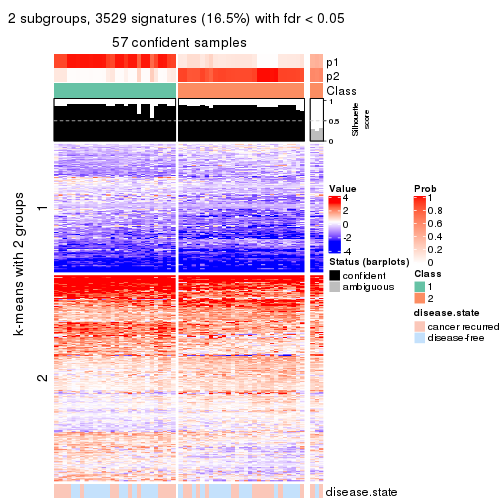</p>

</div>
<div id='tab-SD-kmeans-get-signatures-no-scale-2'>
<pre><code class="r">get_signatures(res, k = 3, scale_rows = FALSE)
</code></pre>

<p></p>

</div>
<div id='tab-SD-kmeans-get-signatures-no-scale-3'>
<pre><code class="r">get_signatures(res, k = 4, scale_rows = FALSE)
</code></pre>

<p></p>

</div>
<div id='tab-SD-kmeans-get-signatures-no-scale-4'>
<pre><code class="r">get_signatures(res, k = 5, scale_rows = FALSE)
</code></pre>

<p></p>

</div>
<div id='tab-SD-kmeans-get-signatures-no-scale-5'>
<pre><code class="r">get_signatures(res, k = 6, scale_rows = FALSE)
</code></pre>

<p></p>

</div>
</div>


Compare the overlap of signatures from different k:

```r
compare_signatures(res)
```


`get_signature()` returns a data frame invisibly. TO get the list of signatures, the function
call should be assigned to a variable explicitly. In following code, if `plot` argument is set
to `FALSE`, no heatmap is plotted while only the differential analysis is performed.

```r
# code only for demonstration
tb = get_signature(res, k = ..., plot = FALSE)
```

An example of the output of `tb` is:

```
#>   which_row         fdr    mean_1    mean_2 scaled_mean_1 scaled_mean_2 km
#> 1        38 0.042760348  8.373488  9.131774    -0.5533452     0.5164555  1
#> 2        40 0.018707592  7.106213  8.469186    -0.6173731     0.5762149  1
#> 3        55 0.019134737 10.221463 11.207825    -0.6159697     0.5749050  1
#> 4        59 0.006059896  5.921854  7.869574    -0.6899429     0.6439467  1
#> 5        60 0.018055526  8.928898 10.211722    -0.6204761     0.5791110  1
#> 6        98 0.009384629 15.714769 14.887706     0.6635654    -0.6193277  2
...
```

The columns in `tb` are:

1. `which_row`: row indices corresponding to the input matrix.
2. `fdr`: FDR for the differential test. 
3. `mean_x`: The mean value in group x.
4. `scaled_mean_x`: The mean value in group x after rows are scaled.
5. `km`: Row groups if k-means clustering is applied to rows.


UMAP plot which shows how samples are separated.


<script>
$( function() {
	$( '#tabs-SD-kmeans-dimension-reduction' ).tabs();
} );
</script>
<div id='tabs-SD-kmeans-dimension-reduction'>
<ul>
<li><a href='#tab-SD-kmeans-dimension-reduction-1'>k = 2</a></li>
<li><a href='#tab-SD-kmeans-dimension-reduction-2'>k = 3</a></li>
<li><a href='#tab-SD-kmeans-dimension-reduction-3'>k = 4</a></li>
<li><a href='#tab-SD-kmeans-dimension-reduction-4'>k = 5</a></li>
<li><a href='#tab-SD-kmeans-dimension-reduction-5'>k = 6</a></li>
</ul>
<div id='tab-SD-kmeans-dimension-reduction-1'>
<pre><code class="r">dimension_reduction(res, k = 2, method = &quot;UMAP&quot;)
</code></pre>

<p></p>

</div>
<div id='tab-SD-kmeans-dimension-reduction-2'>
<pre><code class="r">dimension_reduction(res, k = 3, method = &quot;UMAP&quot;)
</code></pre>

<p></p>

</div>
<div id='tab-SD-kmeans-dimension-reduction-3'>
<pre><code class="r">dimension_reduction(res, k = 4, method = &quot;UMAP&quot;)
</code></pre>

<p></p>

</div>
<div id='tab-SD-kmeans-dimension-reduction-4'>
<pre><code class="r">dimension_reduction(res, k = 5, method = &quot;UMAP&quot;)
</code></pre>

<p></p>

</div>
<div id='tab-SD-kmeans-dimension-reduction-5'>
<pre><code class="r">dimension_reduction(res, k = 6, method = &quot;UMAP&quot;)
</code></pre>

<p></p>

</div>
</div>


Following heatmap shows how subgroups are split when increasing `k`:

```r
collect_classes(res)
```


Test correlation between subgroups and known annotations. If the known
annotation is numeric, one-way ANOVA test is applied, and if the known
annotation is discrete, chi-squared contingency table test is applied.

```r
test_to_known_factors(res)
```

```
#>            n disease.state(p) k
#> SD:kmeans 57            1.000 2
#> SD:kmeans 50            0.827 3
#> SD:kmeans 41            0.994 4
#> SD:kmeans 55            0.347 5
#> SD:kmeans 39            0.433 6
```


If matrix rows can be associated to genes, consider to use `GO_Enrichment(res,
...)` to perform function enrichment for the signature genes.


 

---------------------------------------------------


### SD:skmeans


The object with results only for a single top-value method and a single partition method 
can be extracted as:

```r
res = res_list["SD", "skmeans"]
# you can also extract it by
# res = res_list["SD:skmeans"]
```

A summary of `res` and all the functions that can be applied to it:

```r
res
```

```
#> A 'ConsensusPartition' object with k = 2, 3, 4, 5, 6.
#>   On a matrix with 21446 rows and 60 columns.
#>   Top rows (1000, 2000, 3000, 4000, 5000) are extracted by 'SD' method.
#>   Subgroups are detected by 'skmeans' method.
#>   Performed in total 1250 partitions by row resampling.
#>   Best k for subgroups seems to be 2.
#> 
#> Following methods can be applied to this 'ConsensusPartition' object:
#>  [1] "cola_report"             "collect_classes"         "collect_plots"          
#>  [4] "collect_stats"           "colnames"                "compare_signatures"     
#>  [7] "consensus_heatmap"       "dimension_reduction"     "functional_enrichment"  
#> [10] "get_anno_col"            "get_anno"                "get_classes"            
#> [13] "get_consensus"           "get_matrix"              "get_membership"         
#> [16] "get_param"               "get_signatures"          "get_stats"              
#> [19] "is_best_k"               "is_stable_k"             "membership_heatmap"     
#> [22] "ncol"                    "nrow"                    "plot_ecdf"              
#> [25] "rownames"                "select_partition_number" "show"                   
#> [28] "suggest_best_k"          "test_to_known_factors"
```

`collect_plots()` function collects all the plots made from `res` for all `k` (number of partitions)
into one single page to provide an easy and fast comparison between different `k`.

```r
collect_plots(res)
```


The plots are:

- The first row: a plot of the ECDF (Empirical cumulative distribution
  function) curves of the consensus matrix for each `k` and the heatmap of
  predicted classes for each `k`.
- The second row: heatmaps of the consensus matrix for each `k`.
- The third row: heatmaps of the membership matrix for each `k`.
- The fouth row: heatmaps of the signatures for each `k`.

All the plots in panels can be made by individual functions and they are
plotted later in this section.

`select_partition_number()` produces several plots showing different
statistics for choosing "optimized" `k`. There are following statistics:

- ECDF curves of the consensus matrix for each `k`;
- 1-PAC. [The PAC
  score](https://en.wikipedia.org/wiki/Consensus_clustering#Over-interpretation_potential_of_consensus_clustering)
  measures the proportion of the ambiguous subgrouping.
- Mean silhouette score.
- Concordance. The mean probability of fiting the consensus class ids in all
  partitions.
- Area increased. Denote $A_k$ as the area under the ECDF curve for current
  `k`, the area increased is defined as $A_k - A_{k-1}$.
- Rand index. The percent of pairs of samples that are both in a same cluster
  or both are not in a same cluster in the partition of k and k-1.
- Jaccard index. The ratio of pairs of samples are both in a same cluster in
  the partition of k and k-1 and the pairs of samples are both in a same
  cluster in the partition k or k-1.

The detailed explanations of these statistics can be found in [the cola
vignette](http://bioconductor.org/packages/devel/bioc/vignettes/cola/inst/doc/cola.html#toc_13).

Generally speaking, lower PAC score, higher mean silhouette score or higher
concordance corresponds to better partition. Rand index and Jaccard index
measure how similar the current partition is compared to partition with `k-1`.
If they are too similar, we won't accept `k` is better than `k-1`.

```r
select_partition_number(res)
```


The numeric values for all these statistics can be obtained by `get_stats()`.

```r
get_stats(res)
```

```
#>   k 1-PAC mean_silhouette concordance area_increased  Rand Jaccard
#> 2 2 0.865           0.925       0.966         0.5076 0.494   0.494
#> 3 3 0.850           0.891       0.943         0.3137 0.773   0.572
#> 4 4 0.621           0.633       0.795         0.1219 0.868   0.634
#> 5 5 0.659           0.681       0.780         0.0670 0.921   0.703
#> 6 6 0.674           0.564       0.753         0.0424 0.958   0.802
```

`suggest_best_k()` suggests the best $k$ based on these statistics. The rules are as follows:

- All $k$ with Jaccard index larger than 0.95 are removed because the increase of
  the partition number does not provides enough extra information. If all $k$ are removed,
  the best $k$ is assigned by `NA`.
- For $k$ with 1-PAC larger than 0.9, the maximal $k$ is taken as the "best k". Other $k$ is called "optional k".
- If it does not fit the second rule. The $k$ with the highest vote of highest
  1-PAC, mean silhouette and concordance is taken as the "best k".

```r
suggest_best_k(res)
```

```
#> [1] 2
```


Following shows the table of the partitions (You need to click the **show/hide
code output** link to see it). The membership matrix (columns with name `p*`)
is inferred by
[`clue::cl_consensus()`](https://www.rdocumentation.org/link/cl_consensus?package=clue)
function with the `SE` method. Basically the value in the membership matrix
represents the probability to belong to a certain group. The finall class
label for an item is determined with the group with highest probability it
belongs to.

In `get_classes()` function, the entropy is calculated from the membership
matrix and the silhouette score is calculated from the consensus matrix.


<script>
$( function() {
	$( '#tabs-SD-skmeans-get-classes' ).tabs();
} );
</script>
<div id='tabs-SD-skmeans-get-classes'>
<ul>
<li><a href='#tab-SD-skmeans-get-classes-1'>k = 2</a></li>
<li><a href='#tab-SD-skmeans-get-classes-2'>k = 3</a></li>
<li><a href='#tab-SD-skmeans-get-classes-3'>k = 4</a></li>
<li><a href='#tab-SD-skmeans-get-classes-4'>k = 5</a></li>
<li><a href='#tab-SD-skmeans-get-classes-5'>k = 6</a></li>
</ul>

<div id='tab-SD-skmeans-get-classes-1'>
<p><a id='tab-SD-skmeans-get-classes-1-a' style='color:#0366d6' href='#'>show/hide code output</a></p>
<pre><code class="r">cbind(get_classes(res, k = 2), get_membership(res, k = 2))
</code></pre>

<pre><code>#&gt;          class entropy silhouette    p1    p2
#&gt; GSM22453     1  0.0000      0.979 1.000 0.000
#&gt; GSM22458     2  0.0376      0.949 0.004 0.996
#&gt; GSM22465     1  0.0000      0.979 1.000 0.000
#&gt; GSM22466     1  0.0000      0.979 1.000 0.000
#&gt; GSM22468     2  0.0000      0.951 0.000 1.000
#&gt; GSM22469     1  0.2778      0.934 0.952 0.048
#&gt; GSM22471     2  0.0376      0.949 0.004 0.996
#&gt; GSM22472     2  0.0376      0.949 0.004 0.996
#&gt; GSM22474     2  0.0000      0.951 0.000 1.000
#&gt; GSM22476     2  0.0000      0.951 0.000 1.000
#&gt; GSM22477     2  0.6148      0.817 0.152 0.848
#&gt; GSM22478     2  0.0000      0.951 0.000 1.000
#&gt; GSM22481     2  0.0000      0.951 0.000 1.000
#&gt; GSM22484     1  0.0000      0.979 1.000 0.000
#&gt; GSM22485     1  0.0000      0.979 1.000 0.000
#&gt; GSM22487     1  0.0000      0.979 1.000 0.000
#&gt; GSM22488     1  0.0000      0.979 1.000 0.000
#&gt; GSM22489     2  0.9460      0.489 0.364 0.636
#&gt; GSM22490     2  0.0000      0.951 0.000 1.000
#&gt; GSM22492     2  0.0000      0.951 0.000 1.000
#&gt; GSM22493     1  0.0000      0.979 1.000 0.000
#&gt; GSM22494     1  0.0000      0.979 1.000 0.000
#&gt; GSM22497     1  0.0000      0.979 1.000 0.000
#&gt; GSM22498     1  0.0000      0.979 1.000 0.000
#&gt; GSM22501     2  0.3584      0.899 0.068 0.932
#&gt; GSM22502     2  0.0000      0.951 0.000 1.000
#&gt; GSM22503     2  0.0000      0.951 0.000 1.000
#&gt; GSM22504     2  0.0376      0.949 0.004 0.996
#&gt; GSM22505     1  0.0376      0.976 0.996 0.004
#&gt; GSM22506     1  0.0000      0.979 1.000 0.000
#&gt; GSM22507     1  0.8443      0.627 0.728 0.272
#&gt; GSM22508     2  0.0376      0.949 0.004 0.996
#&gt; GSM22449     1  0.0376      0.976 0.996 0.004
#&gt; GSM22450     1  0.0000      0.979 1.000 0.000
#&gt; GSM22451     1  0.0000      0.979 1.000 0.000
#&gt; GSM22452     1  0.0000      0.979 1.000 0.000
#&gt; GSM22454     1  0.0000      0.979 1.000 0.000
#&gt; GSM22455     2  0.9286      0.530 0.344 0.656
#&gt; GSM22456     2  0.0000      0.951 0.000 1.000
#&gt; GSM22457     2  0.0000      0.951 0.000 1.000
#&gt; GSM22459     2  0.0000      0.951 0.000 1.000
#&gt; GSM22460     1  0.0000      0.979 1.000 0.000
#&gt; GSM22461     2  0.0000      0.951 0.000 1.000
#&gt; GSM22462     1  0.0000      0.979 1.000 0.000
#&gt; GSM22463     1  0.0376      0.976 0.996 0.004
#&gt; GSM22464     2  0.0000      0.951 0.000 1.000
#&gt; GSM22467     1  0.0000      0.979 1.000 0.000
#&gt; GSM22470     2  0.9393      0.506 0.356 0.644
#&gt; GSM22473     2  0.0000      0.951 0.000 1.000
#&gt; GSM22475     2  0.0000      0.951 0.000 1.000
#&gt; GSM22479     2  0.0000      0.951 0.000 1.000
#&gt; GSM22480     1  0.7219      0.750 0.800 0.200
#&gt; GSM22482     2  0.6623      0.796 0.172 0.828
#&gt; GSM22483     2  0.0376      0.949 0.004 0.996
#&gt; GSM22486     1  0.0376      0.976 0.996 0.004
#&gt; GSM22491     1  0.0000      0.979 1.000 0.000
#&gt; GSM22495     2  0.0000      0.951 0.000 1.000
#&gt; GSM22496     1  0.0000      0.979 1.000 0.000
#&gt; GSM22499     2  0.0000      0.951 0.000 1.000
#&gt; GSM22500     2  0.0376      0.949 0.004 0.996
</code></pre>

<script>
$('#tab-SD-skmeans-get-classes-1-a').parent().next().next().hide();
$('#tab-SD-skmeans-get-classes-1-a').click(function(){
  $('#tab-SD-skmeans-get-classes-1-a').parent().next().next().toggle();
  return(false);
});
</script>
</div>

<div id='tab-SD-skmeans-get-classes-2'>
<p><a id='tab-SD-skmeans-get-classes-2-a' style='color:#0366d6' href='#'>show/hide code output</a></p>
<pre><code class="r">cbind(get_classes(res, k = 3), get_membership(res, k = 3))
</code></pre>

<pre><code>#&gt;          class entropy silhouette    p1    p2    p3
#&gt; GSM22453     1  0.0000      0.932 1.000 0.000 0.000
#&gt; GSM22458     2  0.0983      0.941 0.016 0.980 0.004
#&gt; GSM22465     1  0.0000      0.932 1.000 0.000 0.000
#&gt; GSM22466     1  0.0000      0.932 1.000 0.000 0.000
#&gt; GSM22468     2  0.0000      0.944 0.000 1.000 0.000
#&gt; GSM22469     1  0.0592      0.927 0.988 0.012 0.000
#&gt; GSM22471     2  0.0237      0.944 0.004 0.996 0.000
#&gt; GSM22472     2  0.0983      0.941 0.016 0.980 0.004
#&gt; GSM22474     2  0.0747      0.941 0.000 0.984 0.016
#&gt; GSM22476     3  0.2261      0.934 0.000 0.068 0.932
#&gt; GSM22477     2  0.5847      0.754 0.172 0.780 0.048
#&gt; GSM22478     2  0.1643      0.922 0.000 0.956 0.044
#&gt; GSM22481     2  0.0000      0.944 0.000 1.000 0.000
#&gt; GSM22484     1  0.0892      0.926 0.980 0.000 0.020
#&gt; GSM22485     1  0.0592      0.930 0.988 0.000 0.012
#&gt; GSM22487     1  0.1643      0.902 0.956 0.044 0.000
#&gt; GSM22488     1  0.0592      0.929 0.988 0.000 0.012
#&gt; GSM22489     3  0.0000      0.941 0.000 0.000 1.000
#&gt; GSM22490     2  0.0592      0.942 0.000 0.988 0.012
#&gt; GSM22492     2  0.0747      0.942 0.000 0.984 0.016
#&gt; GSM22493     1  0.0424      0.931 0.992 0.000 0.008
#&gt; GSM22494     1  0.0000      0.932 1.000 0.000 0.000
#&gt; GSM22497     1  0.0000      0.932 1.000 0.000 0.000
#&gt; GSM22498     1  0.1525      0.918 0.964 0.004 0.032
#&gt; GSM22501     3  0.1529      0.940 0.000 0.040 0.960
#&gt; GSM22502     2  0.0592      0.942 0.000 0.988 0.012
#&gt; GSM22503     2  0.0000      0.944 0.000 1.000 0.000
#&gt; GSM22504     2  0.0983      0.941 0.016 0.980 0.004
#&gt; GSM22505     3  0.0892      0.934 0.020 0.000 0.980
#&gt; GSM22506     1  0.4346      0.797 0.816 0.000 0.184
#&gt; GSM22507     2  0.6899      0.402 0.364 0.612 0.024
#&gt; GSM22508     2  0.0424      0.943 0.008 0.992 0.000
#&gt; GSM22449     3  0.1964      0.906 0.056 0.000 0.944
#&gt; GSM22450     1  0.0000      0.932 1.000 0.000 0.000
#&gt; GSM22451     1  0.6235      0.325 0.564 0.000 0.436
#&gt; GSM22452     1  0.5327      0.665 0.728 0.000 0.272
#&gt; GSM22454     1  0.0000      0.932 1.000 0.000 0.000
#&gt; GSM22455     3  0.0237      0.941 0.000 0.004 0.996
#&gt; GSM22456     2  0.5058      0.699 0.000 0.756 0.244
#&gt; GSM22457     2  0.1289      0.932 0.000 0.968 0.032
#&gt; GSM22459     3  0.2959      0.913 0.000 0.100 0.900
#&gt; GSM22460     1  0.0424      0.930 0.992 0.000 0.008
#&gt; GSM22461     2  0.0237      0.943 0.000 0.996 0.004
#&gt; GSM22462     1  0.5621      0.609 0.692 0.000 0.308
#&gt; GSM22463     3  0.0892      0.934 0.020 0.000 0.980
#&gt; GSM22464     2  0.2590      0.903 0.004 0.924 0.072
#&gt; GSM22467     1  0.0000      0.932 1.000 0.000 0.000
#&gt; GSM22470     3  0.0000      0.941 0.000 0.000 1.000
#&gt; GSM22473     3  0.3412      0.891 0.000 0.124 0.876
#&gt; GSM22475     3  0.2165      0.936 0.000 0.064 0.936
#&gt; GSM22479     2  0.0592      0.942 0.000 0.988 0.012
#&gt; GSM22480     1  0.4357      0.843 0.868 0.080 0.052
#&gt; GSM22482     3  0.2492      0.936 0.016 0.048 0.936
#&gt; GSM22483     2  0.0983      0.941 0.016 0.980 0.004
#&gt; GSM22486     3  0.0475      0.940 0.004 0.004 0.992
#&gt; GSM22491     1  0.0237      0.931 0.996 0.000 0.004
#&gt; GSM22495     3  0.4346      0.817 0.000 0.184 0.816
#&gt; GSM22496     1  0.0000      0.932 1.000 0.000 0.000
#&gt; GSM22499     2  0.0424      0.943 0.000 0.992 0.008
#&gt; GSM22500     2  0.1031      0.937 0.024 0.976 0.000
</code></pre>

<script>
$('#tab-SD-skmeans-get-classes-2-a').parent().next().next().hide();
$('#tab-SD-skmeans-get-classes-2-a').click(function(){
  $('#tab-SD-skmeans-get-classes-2-a').parent().next().next().toggle();
  return(false);
});
</script>
</div>

<div id='tab-SD-skmeans-get-classes-3'>
<p><a id='tab-SD-skmeans-get-classes-3-a' style='color:#0366d6' href='#'>show/hide code output</a></p>
<pre><code class="r">cbind(get_classes(res, k = 4), get_membership(res, k = 4))
</code></pre>

<pre><code>#&gt;          class entropy silhouette    p1    p2    p3    p4
#&gt; GSM22453     1  0.0000     0.8837 1.000 0.000 0.000 0.000
#&gt; GSM22458     4  0.0000     0.8347 0.000 0.000 0.000 1.000
#&gt; GSM22465     1  0.0000     0.8837 1.000 0.000 0.000 0.000
#&gt; GSM22466     1  0.0000     0.8837 1.000 0.000 0.000 0.000
#&gt; GSM22468     2  0.4697     0.5775 0.000 0.644 0.000 0.356
#&gt; GSM22469     1  0.2761     0.8285 0.904 0.048 0.000 0.048
#&gt; GSM22471     4  0.2408     0.7718 0.000 0.104 0.000 0.896
#&gt; GSM22472     4  0.0000     0.8347 0.000 0.000 0.000 1.000
#&gt; GSM22474     2  0.4304     0.6391 0.000 0.716 0.000 0.284
#&gt; GSM22476     3  0.5619     0.5422 0.000 0.248 0.688 0.064
#&gt; GSM22477     4  0.4329     0.7252 0.036 0.064 0.056 0.844
#&gt; GSM22478     2  0.3402     0.6733 0.000 0.832 0.004 0.164
#&gt; GSM22481     2  0.4998     0.2837 0.000 0.512 0.000 0.488
#&gt; GSM22484     1  0.6521     0.6622 0.712 0.136 0.068 0.084
#&gt; GSM22485     1  0.2644     0.8387 0.908 0.060 0.032 0.000
#&gt; GSM22487     1  0.4636     0.7243 0.792 0.068 0.000 0.140
#&gt; GSM22488     1  0.0336     0.8811 0.992 0.000 0.008 0.000
#&gt; GSM22489     3  0.0336     0.6477 0.000 0.008 0.992 0.000
#&gt; GSM22490     4  0.3105     0.7501 0.000 0.140 0.004 0.856
#&gt; GSM22492     2  0.5403     0.5479 0.000 0.628 0.024 0.348
#&gt; GSM22493     1  0.1661     0.8598 0.944 0.052 0.004 0.000
#&gt; GSM22494     1  0.0000     0.8837 1.000 0.000 0.000 0.000
#&gt; GSM22497     1  0.0000     0.8837 1.000 0.000 0.000 0.000
#&gt; GSM22498     1  0.6577     0.3719 0.540 0.384 0.072 0.004
#&gt; GSM22501     3  0.4257     0.6144 0.000 0.140 0.812 0.048
#&gt; GSM22502     4  0.3942     0.6153 0.000 0.236 0.000 0.764
#&gt; GSM22503     2  0.5151     0.3653 0.000 0.532 0.004 0.464
#&gt; GSM22504     4  0.0000     0.8347 0.000 0.000 0.000 1.000
#&gt; GSM22505     3  0.3813     0.6238 0.024 0.148 0.828 0.000
#&gt; GSM22506     3  0.7362     0.0485 0.396 0.160 0.444 0.000
#&gt; GSM22507     2  0.6531     0.5248 0.184 0.668 0.012 0.136
#&gt; GSM22508     4  0.1474     0.8217 0.000 0.052 0.000 0.948
#&gt; GSM22449     3  0.5434     0.5774 0.084 0.188 0.728 0.000
#&gt; GSM22450     1  0.0000     0.8837 1.000 0.000 0.000 0.000
#&gt; GSM22451     3  0.6855     0.1359 0.388 0.092 0.516 0.004
#&gt; GSM22452     1  0.4690     0.5578 0.712 0.012 0.276 0.000
#&gt; GSM22454     1  0.0000     0.8837 1.000 0.000 0.000 0.000
#&gt; GSM22455     3  0.4431     0.5340 0.000 0.304 0.696 0.000
#&gt; GSM22456     2  0.4364     0.5215 0.000 0.808 0.136 0.056
#&gt; GSM22457     2  0.3831     0.6719 0.000 0.792 0.004 0.204
#&gt; GSM22459     3  0.6171     0.4414 0.000 0.348 0.588 0.064
#&gt; GSM22460     1  0.1543     0.8660 0.956 0.008 0.032 0.004
#&gt; GSM22461     4  0.0921     0.8306 0.000 0.028 0.000 0.972
#&gt; GSM22462     1  0.5858     0.0598 0.500 0.032 0.468 0.000
#&gt; GSM22463     3  0.3427     0.6337 0.028 0.112 0.860 0.000
#&gt; GSM22464     2  0.3994     0.6488 0.004 0.828 0.028 0.140
#&gt; GSM22467     1  0.0188     0.8826 0.996 0.004 0.000 0.000
#&gt; GSM22470     3  0.0817     0.6470 0.000 0.024 0.976 0.000
#&gt; GSM22473     3  0.6108     0.3286 0.000 0.424 0.528 0.048
#&gt; GSM22475     3  0.6071     0.4730 0.000 0.324 0.612 0.064
#&gt; GSM22479     2  0.4770     0.6190 0.000 0.700 0.012 0.288
#&gt; GSM22480     2  0.6019     0.4195 0.224 0.696 0.060 0.020
#&gt; GSM22482     3  0.5727     0.5992 0.036 0.104 0.760 0.100
#&gt; GSM22483     4  0.0000     0.8347 0.000 0.000 0.000 1.000
#&gt; GSM22486     3  0.4228     0.5838 0.008 0.232 0.760 0.000
#&gt; GSM22491     1  0.0000     0.8837 1.000 0.000 0.000 0.000
#&gt; GSM22495     3  0.5938     0.2278 0.000 0.476 0.488 0.036
#&gt; GSM22496     1  0.0376     0.8815 0.992 0.004 0.000 0.004
#&gt; GSM22499     4  0.5281    -0.2608 0.000 0.464 0.008 0.528
#&gt; GSM22500     4  0.2760     0.7439 0.000 0.128 0.000 0.872
</code></pre>

<script>
$('#tab-SD-skmeans-get-classes-3-a').parent().next().next().hide();
$('#tab-SD-skmeans-get-classes-3-a').click(function(){
  $('#tab-SD-skmeans-get-classes-3-a').parent().next().next().toggle();
  return(false);
});
</script>
</div>

<div id='tab-SD-skmeans-get-classes-4'>
<p><a id='tab-SD-skmeans-get-classes-4-a' style='color:#0366d6' href='#'>show/hide code output</a></p>
<pre><code class="r">cbind(get_classes(res, k = 5), get_membership(res, k = 5))
</code></pre>

<pre><code>#&gt;          class entropy silhouette    p1    p2    p3    p4    p5
#&gt; GSM22453     1  0.0771     0.8592 0.976 0.004 0.020 0.000 0.000
#&gt; GSM22458     4  0.0162     0.8215 0.000 0.004 0.000 0.996 0.000
#&gt; GSM22465     1  0.0162     0.8585 0.996 0.004 0.000 0.000 0.000
#&gt; GSM22466     1  0.0486     0.8595 0.988 0.004 0.004 0.000 0.004
#&gt; GSM22468     2  0.5282     0.6564 0.000 0.700 0.008 0.148 0.144
#&gt; GSM22469     1  0.4026     0.7415 0.804 0.148 0.020 0.024 0.004
#&gt; GSM22471     4  0.3412     0.7164 0.000 0.172 0.008 0.812 0.008
#&gt; GSM22472     4  0.0162     0.8215 0.000 0.004 0.000 0.996 0.000
#&gt; GSM22474     2  0.5452     0.6734 0.000 0.704 0.036 0.080 0.180
#&gt; GSM22476     5  0.1757     0.8959 0.000 0.012 0.048 0.004 0.936
#&gt; GSM22477     4  0.5603     0.6817 0.060 0.056 0.056 0.752 0.076
#&gt; GSM22478     2  0.2002     0.6836 0.000 0.932 0.020 0.020 0.028
#&gt; GSM22481     2  0.6104     0.4929 0.004 0.596 0.024 0.296 0.080
#&gt; GSM22484     1  0.8356     0.2768 0.440 0.164 0.248 0.128 0.020
#&gt; GSM22485     1  0.5711     0.6033 0.660 0.120 0.204 0.000 0.016
#&gt; GSM22487     1  0.5584     0.6368 0.700 0.120 0.016 0.156 0.008
#&gt; GSM22488     1  0.2770     0.8329 0.888 0.020 0.076 0.000 0.016
#&gt; GSM22489     3  0.4150     0.3823 0.000 0.000 0.612 0.000 0.388
#&gt; GSM22490     4  0.5163     0.5950 0.000 0.088 0.004 0.684 0.224
#&gt; GSM22492     2  0.6259     0.5194 0.000 0.532 0.008 0.132 0.328
#&gt; GSM22493     1  0.4255     0.7578 0.788 0.060 0.140 0.000 0.012
#&gt; GSM22494     1  0.0290     0.8588 0.992 0.000 0.008 0.000 0.000
#&gt; GSM22497     1  0.0404     0.8587 0.988 0.000 0.012 0.000 0.000
#&gt; GSM22498     3  0.7138    -0.0111 0.316 0.316 0.356 0.000 0.012
#&gt; GSM22501     5  0.2179     0.8353 0.000 0.000 0.112 0.000 0.888
#&gt; GSM22502     4  0.6257     0.3692 0.000 0.172 0.004 0.552 0.272
#&gt; GSM22503     2  0.5949     0.5301 0.000 0.620 0.012 0.236 0.132
#&gt; GSM22504     4  0.0162     0.8215 0.000 0.004 0.000 0.996 0.000
#&gt; GSM22505     3  0.3395     0.6936 0.028 0.016 0.848 0.000 0.108
#&gt; GSM22506     3  0.2877     0.6712 0.144 0.004 0.848 0.000 0.004
#&gt; GSM22507     2  0.4655     0.6192 0.064 0.800 0.076 0.048 0.012
#&gt; GSM22508     4  0.2747     0.7792 0.000 0.088 0.016 0.884 0.012
#&gt; GSM22449     3  0.2756     0.7038 0.036 0.012 0.892 0.000 0.060
#&gt; GSM22450     1  0.0162     0.8585 0.996 0.000 0.004 0.000 0.000
#&gt; GSM22451     3  0.5087     0.5204 0.288 0.016 0.664 0.004 0.028
#&gt; GSM22452     1  0.4972     0.6023 0.724 0.008 0.172 0.000 0.096
#&gt; GSM22454     1  0.1016     0.8574 0.972 0.008 0.012 0.004 0.004
#&gt; GSM22455     3  0.3471     0.6605 0.000 0.092 0.836 0.000 0.072
#&gt; GSM22456     2  0.5384     0.5334 0.000 0.660 0.260 0.016 0.064
#&gt; GSM22457     2  0.3436     0.6805 0.004 0.864 0.024 0.056 0.052
#&gt; GSM22459     5  0.1124     0.8957 0.000 0.036 0.000 0.004 0.960
#&gt; GSM22460     1  0.2928     0.8159 0.876 0.012 0.096 0.008 0.008
#&gt; GSM22461     4  0.1041     0.8163 0.000 0.032 0.000 0.964 0.004
#&gt; GSM22462     3  0.4571     0.5314 0.312 0.004 0.664 0.000 0.020
#&gt; GSM22463     3  0.2864     0.6817 0.012 0.000 0.852 0.000 0.136
#&gt; GSM22464     2  0.3353     0.6557 0.000 0.852 0.104 0.020 0.024
#&gt; GSM22467     1  0.0968     0.8552 0.972 0.012 0.012 0.000 0.004
#&gt; GSM22470     3  0.4300     0.1687 0.000 0.000 0.524 0.000 0.476
#&gt; GSM22473     5  0.1502     0.8864 0.000 0.056 0.004 0.000 0.940
#&gt; GSM22475     5  0.1372     0.9047 0.000 0.016 0.024 0.004 0.956
#&gt; GSM22479     2  0.5607     0.5787 0.000 0.612 0.008 0.080 0.300
#&gt; GSM22480     2  0.6481     0.4005 0.096 0.604 0.248 0.004 0.048
#&gt; GSM22482     5  0.3282     0.8308 0.024 0.000 0.092 0.024 0.860
#&gt; GSM22483     4  0.0000     0.8198 0.000 0.000 0.000 1.000 0.000
#&gt; GSM22486     3  0.2670     0.6926 0.004 0.028 0.888 0.000 0.080
#&gt; GSM22491     1  0.1883     0.8495 0.932 0.008 0.048 0.000 0.012
#&gt; GSM22495     5  0.2020     0.8329 0.000 0.100 0.000 0.000 0.900
#&gt; GSM22496     1  0.2051     0.8463 0.932 0.012 0.036 0.012 0.008
#&gt; GSM22499     2  0.6741     0.3009 0.000 0.444 0.020 0.392 0.144
#&gt; GSM22500     4  0.3851     0.6711 0.000 0.212 0.016 0.768 0.004
</code></pre>

<script>
$('#tab-SD-skmeans-get-classes-4-a').parent().next().next().hide();
$('#tab-SD-skmeans-get-classes-4-a').click(function(){
  $('#tab-SD-skmeans-get-classes-4-a').parent().next().next().toggle();
  return(false);
});
</script>
</div>

<div id='tab-SD-skmeans-get-classes-5'>
<p><a id='tab-SD-skmeans-get-classes-5-a' style='color:#0366d6' href='#'>show/hide code output</a></p>
<pre><code class="r">cbind(get_classes(res, k = 6), get_membership(res, k = 6))
</code></pre>

<pre><code>#&gt;          class entropy silhouette    p1    p2    p3    p4    p5    p6
#&gt; GSM22453     1  0.1265     0.7520 0.948 0.000 0.008 0.000 0.000 0.044
#&gt; GSM22458     4  0.0000     0.7469 0.000 0.000 0.000 1.000 0.000 0.000
#&gt; GSM22465     1  0.0777     0.7494 0.972 0.000 0.004 0.000 0.000 0.024
#&gt; GSM22466     1  0.1049     0.7529 0.960 0.000 0.008 0.000 0.000 0.032
#&gt; GSM22468     2  0.4802     0.5339 0.000 0.736 0.000 0.080 0.116 0.068
#&gt; GSM22469     1  0.5050     0.4738 0.664 0.092 0.000 0.020 0.000 0.224
#&gt; GSM22471     4  0.5178     0.5127 0.004 0.244 0.000 0.644 0.012 0.096
#&gt; GSM22472     4  0.0000     0.7469 0.000 0.000 0.000 1.000 0.000 0.000
#&gt; GSM22474     2  0.4960     0.5013 0.000 0.728 0.008 0.040 0.116 0.108
#&gt; GSM22476     5  0.1003     0.9260 0.000 0.004 0.028 0.000 0.964 0.004
#&gt; GSM22477     4  0.7340     0.4683 0.048 0.056 0.040 0.560 0.108 0.188
#&gt; GSM22478     2  0.3627     0.3704 0.000 0.752 0.020 0.000 0.004 0.224
#&gt; GSM22481     2  0.5599     0.4767 0.000 0.644 0.000 0.200 0.076 0.080
#&gt; GSM22484     6  0.6571     0.2361 0.276 0.016 0.080 0.092 0.000 0.536
#&gt; GSM22485     1  0.5977     0.1835 0.508 0.024 0.136 0.000 0.000 0.332
#&gt; GSM22487     1  0.6001     0.3890 0.612 0.100 0.000 0.100 0.000 0.188
#&gt; GSM22488     1  0.4203     0.6266 0.736 0.004 0.056 0.000 0.004 0.200
#&gt; GSM22489     3  0.4105     0.4586 0.000 0.000 0.632 0.000 0.348 0.020
#&gt; GSM22490     4  0.6317     0.2777 0.000 0.260 0.000 0.516 0.184 0.040
#&gt; GSM22492     2  0.5018     0.5069 0.000 0.656 0.000 0.088 0.240 0.016
#&gt; GSM22493     1  0.4854     0.5122 0.652 0.008 0.080 0.000 0.000 0.260
#&gt; GSM22494     1  0.1151     0.7530 0.956 0.000 0.012 0.000 0.000 0.032
#&gt; GSM22497     1  0.1333     0.7531 0.944 0.000 0.008 0.000 0.000 0.048
#&gt; GSM22498     6  0.7279     0.4653 0.228 0.144 0.204 0.000 0.000 0.424
#&gt; GSM22501     5  0.1528     0.9096 0.000 0.000 0.048 0.000 0.936 0.016
#&gt; GSM22502     2  0.6837     0.0313 0.000 0.376 0.000 0.328 0.248 0.048
#&gt; GSM22503     2  0.5518     0.4357 0.000 0.644 0.000 0.096 0.052 0.208
#&gt; GSM22504     4  0.0000     0.7469 0.000 0.000 0.000 1.000 0.000 0.000
#&gt; GSM22505     3  0.1381     0.7242 0.020 0.004 0.952 0.000 0.020 0.004
#&gt; GSM22506     3  0.3748     0.6046 0.108 0.000 0.784 0.000 0.000 0.108
#&gt; GSM22507     2  0.6012     0.0237 0.032 0.472 0.040 0.036 0.000 0.420
#&gt; GSM22508     4  0.4901     0.5842 0.000 0.188 0.004 0.700 0.020 0.088
#&gt; GSM22449     3  0.0972     0.7225 0.028 0.000 0.964 0.000 0.008 0.000
#&gt; GSM22450     1  0.0717     0.7529 0.976 0.000 0.016 0.000 0.000 0.008
#&gt; GSM22451     3  0.5772     0.3679 0.184 0.000 0.568 0.004 0.008 0.236
#&gt; GSM22452     1  0.5322     0.5326 0.684 0.000 0.156 0.000 0.084 0.076
#&gt; GSM22454     1  0.2162     0.7316 0.896 0.004 0.000 0.012 0.000 0.088
#&gt; GSM22455     3  0.2964     0.6523 0.000 0.024 0.856 0.000 0.020 0.100
#&gt; GSM22456     6  0.6363     0.0727 0.000 0.384 0.144 0.016 0.016 0.440
#&gt; GSM22457     2  0.4418     0.3424 0.000 0.684 0.016 0.024 0.004 0.272
#&gt; GSM22459     5  0.0632     0.9256 0.000 0.024 0.000 0.000 0.976 0.000
#&gt; GSM22460     1  0.4636     0.5368 0.668 0.000 0.040 0.020 0.000 0.272
#&gt; GSM22461     4  0.1820     0.7238 0.000 0.056 0.000 0.924 0.012 0.008
#&gt; GSM22462     3  0.3753     0.5707 0.220 0.000 0.748 0.000 0.004 0.028
#&gt; GSM22463     3  0.1806     0.7243 0.020 0.000 0.928 0.000 0.044 0.008
#&gt; GSM22464     2  0.5417     0.1636 0.000 0.568 0.084 0.012 0.004 0.332
#&gt; GSM22467     1  0.2454     0.7167 0.876 0.016 0.004 0.000 0.000 0.104
#&gt; GSM22470     3  0.4175     0.1930 0.000 0.000 0.524 0.000 0.464 0.012
#&gt; GSM22473     5  0.1411     0.9060 0.000 0.060 0.000 0.000 0.936 0.004
#&gt; GSM22475     5  0.0551     0.9296 0.000 0.008 0.004 0.000 0.984 0.004
#&gt; GSM22479     2  0.3875     0.5281 0.000 0.760 0.000 0.028 0.196 0.016
#&gt; GSM22480     6  0.7039     0.4476 0.136 0.212 0.096 0.004 0.020 0.532
#&gt; GSM22482     5  0.2771     0.8737 0.024 0.000 0.048 0.016 0.888 0.024
#&gt; GSM22483     4  0.0000     0.7469 0.000 0.000 0.000 1.000 0.000 0.000
#&gt; GSM22486     3  0.1483     0.7014 0.000 0.008 0.944 0.000 0.012 0.036
#&gt; GSM22491     1  0.3543     0.6659 0.768 0.000 0.032 0.000 0.000 0.200
#&gt; GSM22495     5  0.1556     0.8874 0.000 0.080 0.000 0.000 0.920 0.000
#&gt; GSM22496     1  0.3915     0.6040 0.732 0.000 0.016 0.016 0.000 0.236
#&gt; GSM22499     2  0.6184     0.2324 0.000 0.492 0.016 0.368 0.096 0.028
#&gt; GSM22500     4  0.6244     0.3752 0.008 0.256 0.008 0.528 0.008 0.192
</code></pre>

<script>
$('#tab-SD-skmeans-get-classes-5-a').parent().next().next().hide();
$('#tab-SD-skmeans-get-classes-5-a').click(function(){
  $('#tab-SD-skmeans-get-classes-5-a').parent().next().next().toggle();
  return(false);
});
</script>
</div>
</div>

Heatmaps for the consensus matrix. It visualizes the probability of two
samples to be in a same group.


<script>
$( function() {
	$( '#tabs-SD-skmeans-consensus-heatmap' ).tabs();
} );
</script>
<div id='tabs-SD-skmeans-consensus-heatmap'>
<ul>
<li><a href='#tab-SD-skmeans-consensus-heatmap-1'>k = 2</a></li>
<li><a href='#tab-SD-skmeans-consensus-heatmap-2'>k = 3</a></li>
<li><a href='#tab-SD-skmeans-consensus-heatmap-3'>k = 4</a></li>
<li><a href='#tab-SD-skmeans-consensus-heatmap-4'>k = 5</a></li>
<li><a href='#tab-SD-skmeans-consensus-heatmap-5'>k = 6</a></li>
</ul>
<div id='tab-SD-skmeans-consensus-heatmap-1'>
<pre><code class="r">consensus_heatmap(res, k = 2)
</code></pre>

<p></p>

</div>
<div id='tab-SD-skmeans-consensus-heatmap-2'>
<pre><code class="r">consensus_heatmap(res, k = 3)
</code></pre>

<p>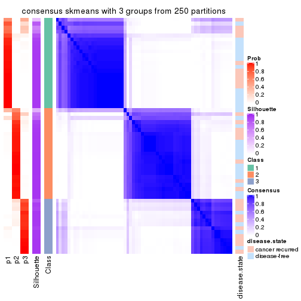</p>

</div>
<div id='tab-SD-skmeans-consensus-heatmap-3'>
<pre><code class="r">consensus_heatmap(res, k = 4)
</code></pre>

<p></p>

</div>
<div id='tab-SD-skmeans-consensus-heatmap-4'>
<pre><code class="r">consensus_heatmap(res, k = 5)
</code></pre>

<p></p>

</div>
<div id='tab-SD-skmeans-consensus-heatmap-5'>
<pre><code class="r">consensus_heatmap(res, k = 6)
</code></pre>

<p></p>

</div>
</div>

Heatmaps for the membership of samples in all partitions to see how consistent they are:


<script>
$( function() {
	$( '#tabs-SD-skmeans-membership-heatmap' ).tabs();
} );
</script>
<div id='tabs-SD-skmeans-membership-heatmap'>
<ul>
<li><a href='#tab-SD-skmeans-membership-heatmap-1'>k = 2</a></li>
<li><a href='#tab-SD-skmeans-membership-heatmap-2'>k = 3</a></li>
<li><a href='#tab-SD-skmeans-membership-heatmap-3'>k = 4</a></li>
<li><a href='#tab-SD-skmeans-membership-heatmap-4'>k = 5</a></li>
<li><a href='#tab-SD-skmeans-membership-heatmap-5'>k = 6</a></li>
</ul>
<div id='tab-SD-skmeans-membership-heatmap-1'>
<pre><code class="r">membership_heatmap(res, k = 2)
</code></pre>

<p></p>

</div>
<div id='tab-SD-skmeans-membership-heatmap-2'>
<pre><code class="r">membership_heatmap(res, k = 3)
</code></pre>

<p></p>

</div>
<div id='tab-SD-skmeans-membership-heatmap-3'>
<pre><code class="r">membership_heatmap(res, k = 4)
</code></pre>

<p></p>

</div>
<div id='tab-SD-skmeans-membership-heatmap-4'>
<pre><code class="r">membership_heatmap(res, k = 5)
</code></pre>

<p></p>

</div>
<div id='tab-SD-skmeans-membership-heatmap-5'>
<pre><code class="r">membership_heatmap(res, k = 6)
</code></pre>

<p></p>

</div>
</div>

As soon as we have had the classes for columns, we can look for signatures
which are significantly different between classes which can be candidate marks
for certain classes. Following are the heatmaps for signatures.


Signature heatmaps where rows are scaled:


<script>
$( function() {
	$( '#tabs-SD-skmeans-get-signatures' ).tabs();
} );
</script>
<div id='tabs-SD-skmeans-get-signatures'>
<ul>
<li><a href='#tab-SD-skmeans-get-signatures-1'>k = 2</a></li>
<li><a href='#tab-SD-skmeans-get-signatures-2'>k = 3</a></li>
<li><a href='#tab-SD-skmeans-get-signatures-3'>k = 4</a></li>
<li><a href='#tab-SD-skmeans-get-signatures-4'>k = 5</a></li>
<li><a href='#tab-SD-skmeans-get-signatures-5'>k = 6</a></li>
</ul>
<div id='tab-SD-skmeans-get-signatures-1'>
<pre><code class="r">get_signatures(res, k = 2)
</code></pre>

<p></p>

</div>
<div id='tab-SD-skmeans-get-signatures-2'>
<pre><code class="r">get_signatures(res, k = 3)
</code></pre>

<p></p>

</div>
<div id='tab-SD-skmeans-get-signatures-3'>
<pre><code class="r">get_signatures(res, k = 4)
</code></pre>

<p></p>

</div>
<div id='tab-SD-skmeans-get-signatures-4'>
<pre><code class="r">get_signatures(res, k = 5)
</code></pre>

<p></p>

</div>
<div id='tab-SD-skmeans-get-signatures-5'>
<pre><code class="r">get_signatures(res, k = 6)
</code></pre>

<p></p>

</div>
</div>


Signature heatmaps where rows are not scaled:


<script>
$( function() {
	$( '#tabs-SD-skmeans-get-signatures-no-scale' ).tabs();
} );
</script>
<div id='tabs-SD-skmeans-get-signatures-no-scale'>
<ul>
<li><a href='#tab-SD-skmeans-get-signatures-no-scale-1'>k = 2</a></li>
<li><a href='#tab-SD-skmeans-get-signatures-no-scale-2'>k = 3</a></li>
<li><a href='#tab-SD-skmeans-get-signatures-no-scale-3'>k = 4</a></li>
<li><a href='#tab-SD-skmeans-get-signatures-no-scale-4'>k = 5</a></li>
<li><a href='#tab-SD-skmeans-get-signatures-no-scale-5'>k = 6</a></li>
</ul>
<div id='tab-SD-skmeans-get-signatures-no-scale-1'>
<pre><code class="r">get_signatures(res, k = 2, scale_rows = FALSE)
</code></pre>

<p></p>

</div>
<div id='tab-SD-skmeans-get-signatures-no-scale-2'>
<pre><code class="r">get_signatures(res, k = 3, scale_rows = FALSE)
</code></pre>

<p></p>

</div>
<div id='tab-SD-skmeans-get-signatures-no-scale-3'>
<pre><code class="r">get_signatures(res, k = 4, scale_rows = FALSE)
</code></pre>

<p></p>

</div>
<div id='tab-SD-skmeans-get-signatures-no-scale-4'>
<pre><code class="r">get_signatures(res, k = 5, scale_rows = FALSE)
</code></pre>

<p></p>

</div>
<div id='tab-SD-skmeans-get-signatures-no-scale-5'>
<pre><code class="r">get_signatures(res, k = 6, scale_rows = FALSE)
</code></pre>

<p></p>

</div>
</div>


Compare the overlap of signatures from different k:

```r
compare_signatures(res)
```


`get_signature()` returns a data frame invisibly. TO get the list of signatures, the function
call should be assigned to a variable explicitly. In following code, if `plot` argument is set
to `FALSE`, no heatmap is plotted while only the differential analysis is performed.

```r
# code only for demonstration
tb = get_signature(res, k = ..., plot = FALSE)
```

An example of the output of `tb` is:

```
#>   which_row         fdr    mean_1    mean_2 scaled_mean_1 scaled_mean_2 km
#> 1        38 0.042760348  8.373488  9.131774    -0.5533452     0.5164555  1
#> 2        40 0.018707592  7.106213  8.469186    -0.6173731     0.5762149  1
#> 3        55 0.019134737 10.221463 11.207825    -0.6159697     0.5749050  1
#> 4        59 0.006059896  5.921854  7.869574    -0.6899429     0.6439467  1
#> 5        60 0.018055526  8.928898 10.211722    -0.6204761     0.5791110  1
#> 6        98 0.009384629 15.714769 14.887706     0.6635654    -0.6193277  2
...
```

The columns in `tb` are:

1. `which_row`: row indices corresponding to the input matrix.
2. `fdr`: FDR for the differential test. 
3. `mean_x`: The mean value in group x.
4. `scaled_mean_x`: The mean value in group x after rows are scaled.
5. `km`: Row groups if k-means clustering is applied to rows.


UMAP plot which shows how samples are separated.


<script>
$( function() {
	$( '#tabs-SD-skmeans-dimension-reduction' ).tabs();
} );
</script>
<div id='tabs-SD-skmeans-dimension-reduction'>
<ul>
<li><a href='#tab-SD-skmeans-dimension-reduction-1'>k = 2</a></li>
<li><a href='#tab-SD-skmeans-dimension-reduction-2'>k = 3</a></li>
<li><a href='#tab-SD-skmeans-dimension-reduction-3'>k = 4</a></li>
<li><a href='#tab-SD-skmeans-dimension-reduction-4'>k = 5</a></li>
<li><a href='#tab-SD-skmeans-dimension-reduction-5'>k = 6</a></li>
</ul>
<div id='tab-SD-skmeans-dimension-reduction-1'>
<pre><code class="r">dimension_reduction(res, k = 2, method = &quot;UMAP&quot;)
</code></pre>

<p></p>

</div>
<div id='tab-SD-skmeans-dimension-reduction-2'>
<pre><code class="r">dimension_reduction(res, k = 3, method = &quot;UMAP&quot;)
</code></pre>

<p></p>

</div>
<div id='tab-SD-skmeans-dimension-reduction-3'>
<pre><code class="r">dimension_reduction(res, k = 4, method = &quot;UMAP&quot;)
</code></pre>

<p></p>

</div>
<div id='tab-SD-skmeans-dimension-reduction-4'>
<pre><code class="r">dimension_reduction(res, k = 5, method = &quot;UMAP&quot;)
</code></pre>

<p></p>

</div>
<div id='tab-SD-skmeans-dimension-reduction-5'>
<pre><code class="r">dimension_reduction(res, k = 6, method = &quot;UMAP&quot;)
</code></pre>

<p></p>

</div>
</div>


Following heatmap shows how subgroups are split when increasing `k`:

```r
collect_classes(res)
```


Test correlation between subgroups and known annotations. If the known
annotation is numeric, one-way ANOVA test is applied, and if the known
annotation is discrete, chi-squared contingency table test is applied.

```r
test_to_known_factors(res)
```

```
#>             n disease.state(p) k
#> SD:skmeans 59           1.0000 2
#> SD:skmeans 58           0.0963 3
#> SD:skmeans 48           0.4925 4
#> SD:skmeans 52           0.2189 5
#> SD:skmeans 39           0.3047 6
```


If matrix rows can be associated to genes, consider to use `GO_Enrichment(res,
...)` to perform function enrichment for the signature genes.


 

---------------------------------------------------


### SD:pam


The object with results only for a single top-value method and a single partition method 
can be extracted as:

```r
res = res_list["SD", "pam"]
# you can also extract it by
# res = res_list["SD:pam"]
```

A summary of `res` and all the functions that can be applied to it:

```r
res
```

```
#> A 'ConsensusPartition' object with k = 2, 3, 4, 5, 6.
#>   On a matrix with 21446 rows and 60 columns.
#>   Top rows (1000, 2000, 3000, 4000, 5000) are extracted by 'SD' method.
#>   Subgroups are detected by 'pam' method.
#>   Performed in total 1250 partitions by row resampling.
#>   Best k for subgroups seems to be 2.
#> 
#> Following methods can be applied to this 'ConsensusPartition' object:
#>  [1] "cola_report"             "collect_classes"         "collect_plots"          
#>  [4] "collect_stats"           "colnames"                "compare_signatures"     
#>  [7] "consensus_heatmap"       "dimension_reduction"     "functional_enrichment"  
#> [10] "get_anno_col"            "get_anno"                "get_classes"            
#> [13] "get_consensus"           "get_matrix"              "get_membership"         
#> [16] "get_param"               "get_signatures"          "get_stats"              
#> [19] "is_best_k"               "is_stable_k"             "membership_heatmap"     
#> [22] "ncol"                    "nrow"                    "plot_ecdf"              
#> [25] "rownames"                "select_partition_number" "show"                   
#> [28] "suggest_best_k"          "test_to_known_factors"
```

`collect_plots()` function collects all the plots made from `res` for all `k` (number of partitions)
into one single page to provide an easy and fast comparison between different `k`.

```r
collect_plots(res)
```


The plots are:

- The first row: a plot of the ECDF (Empirical cumulative distribution
  function) curves of the consensus matrix for each `k` and the heatmap of
  predicted classes for each `k`.
- The second row: heatmaps of the consensus matrix for each `k`.
- The third row: heatmaps of the membership matrix for each `k`.
- The fouth row: heatmaps of the signatures for each `k`.

All the plots in panels can be made by individual functions and they are
plotted later in this section.

`select_partition_number()` produces several plots showing different
statistics for choosing "optimized" `k`. There are following statistics:

- ECDF curves of the consensus matrix for each `k`;
- 1-PAC. [The PAC
  score](https://en.wikipedia.org/wiki/Consensus_clustering#Over-interpretation_potential_of_consensus_clustering)
  measures the proportion of the ambiguous subgrouping.
- Mean silhouette score.
- Concordance. The mean probability of fiting the consensus class ids in all
  partitions.
- Area increased. Denote $A_k$ as the area under the ECDF curve for current
  `k`, the area increased is defined as $A_k - A_{k-1}$.
- Rand index. The percent of pairs of samples that are both in a same cluster
  or both are not in a same cluster in the partition of k and k-1.
- Jaccard index. The ratio of pairs of samples are both in a same cluster in
  the partition of k and k-1 and the pairs of samples are both in a same
  cluster in the partition k or k-1.

The detailed explanations of these statistics can be found in [the cola
vignette](http://bioconductor.org/packages/devel/bioc/vignettes/cola/inst/doc/cola.html#toc_13).

Generally speaking, lower PAC score, higher mean silhouette score or higher
concordance corresponds to better partition. Rand index and Jaccard index
measure how similar the current partition is compared to partition with `k-1`.
If they are too similar, we won't accept `k` is better than `k-1`.

```r
select_partition_number(res)
```


The numeric values for all these statistics can be obtained by `get_stats()`.

```r
get_stats(res)
```

```
#>   k 1-PAC mean_silhouette concordance area_increased  Rand Jaccard
#> 2 2 0.409           0.879       0.891         0.4391 0.501   0.501
#> 3 3 0.418           0.676       0.770         0.2883 0.860   0.728
#> 4 4 0.649           0.729       0.877         0.2248 0.792   0.534
#> 5 5 0.657           0.780       0.846         0.1024 0.897   0.681
#> 6 6 0.769           0.771       0.880         0.0562 0.950   0.797
```

`suggest_best_k()` suggests the best $k$ based on these statistics. The rules are as follows:

- All $k$ with Jaccard index larger than 0.95 are removed because the increase of
  the partition number does not provides enough extra information. If all $k$ are removed,
  the best $k$ is assigned by `NA`.
- For $k$ with 1-PAC larger than 0.9, the maximal $k$ is taken as the "best k". Other $k$ is called "optional k".
- If it does not fit the second rule. The $k$ with the highest vote of highest
  1-PAC, mean silhouette and concordance is taken as the "best k".

```r
suggest_best_k(res)
```

```
#> [1] 2
```


Following shows the table of the partitions (You need to click the **show/hide
code output** link to see it). The membership matrix (columns with name `p*`)
is inferred by
[`clue::cl_consensus()`](https://www.rdocumentation.org/link/cl_consensus?package=clue)
function with the `SE` method. Basically the value in the membership matrix
represents the probability to belong to a certain group. The finall class
label for an item is determined with the group with highest probability it
belongs to.

In `get_classes()` function, the entropy is calculated from the membership
matrix and the silhouette score is calculated from the consensus matrix.


<script>
$( function() {
	$( '#tabs-SD-pam-get-classes' ).tabs();
} );
</script>
<div id='tabs-SD-pam-get-classes'>
<ul>
<li><a href='#tab-SD-pam-get-classes-1'>k = 2</a></li>
<li><a href='#tab-SD-pam-get-classes-2'>k = 3</a></li>
<li><a href='#tab-SD-pam-get-classes-3'>k = 4</a></li>
<li><a href='#tab-SD-pam-get-classes-4'>k = 5</a></li>
<li><a href='#tab-SD-pam-get-classes-5'>k = 6</a></li>
</ul>

<div id='tab-SD-pam-get-classes-1'>
<p><a id='tab-SD-pam-get-classes-1-a' style='color:#0366d6' href='#'>show/hide code output</a></p>
<pre><code class="r">cbind(get_classes(res, k = 2), get_membership(res, k = 2))
</code></pre>

<pre><code>#&gt;          class entropy silhouette    p1    p2
#&gt; GSM22453     1  0.0938      0.950 0.988 0.012
#&gt; GSM22458     2  0.0000      0.763 0.000 1.000
#&gt; GSM22465     2  0.8813      0.850 0.300 0.700
#&gt; GSM22466     2  0.8861      0.848 0.304 0.696
#&gt; GSM22468     1  0.1843      0.939 0.972 0.028
#&gt; GSM22469     2  0.8813      0.850 0.300 0.700
#&gt; GSM22471     2  0.4161      0.810 0.084 0.916
#&gt; GSM22472     2  0.1843      0.777 0.028 0.972
#&gt; GSM22474     2  0.8608      0.846 0.284 0.716
#&gt; GSM22476     1  0.5737      0.833 0.864 0.136
#&gt; GSM22477     1  0.1184      0.948 0.984 0.016
#&gt; GSM22478     2  0.8909      0.845 0.308 0.692
#&gt; GSM22481     2  0.8081      0.851 0.248 0.752
#&gt; GSM22484     1  0.5629      0.793 0.868 0.132
#&gt; GSM22485     1  0.2043      0.932 0.968 0.032
#&gt; GSM22487     2  0.8813      0.850 0.300 0.700
#&gt; GSM22488     1  0.0000      0.954 1.000 0.000
#&gt; GSM22489     1  0.0000      0.954 1.000 0.000
#&gt; GSM22490     2  0.0000      0.763 0.000 1.000
#&gt; GSM22492     2  0.9087      0.780 0.324 0.676
#&gt; GSM22493     1  0.0000      0.954 1.000 0.000
#&gt; GSM22494     1  0.0000      0.954 1.000 0.000
#&gt; GSM22497     1  0.1633      0.941 0.976 0.024
#&gt; GSM22498     2  0.8955      0.843 0.312 0.688
#&gt; GSM22501     1  0.0000      0.954 1.000 0.000
#&gt; GSM22502     2  0.4431      0.814 0.092 0.908
#&gt; GSM22503     2  0.6343      0.833 0.160 0.840
#&gt; GSM22504     2  0.1843      0.777 0.028 0.972
#&gt; GSM22505     1  0.0000      0.954 1.000 0.000
#&gt; GSM22506     1  0.0000      0.954 1.000 0.000
#&gt; GSM22507     2  0.9000      0.840 0.316 0.684
#&gt; GSM22508     2  0.8555      0.852 0.280 0.720
#&gt; GSM22449     1  0.0000      0.954 1.000 0.000
#&gt; GSM22450     1  0.0376      0.953 0.996 0.004
#&gt; GSM22451     1  0.0000      0.954 1.000 0.000
#&gt; GSM22452     2  0.9044      0.834 0.320 0.680
#&gt; GSM22454     2  0.8813      0.850 0.300 0.700
#&gt; GSM22455     1  0.0000      0.954 1.000 0.000
#&gt; GSM22456     1  0.0376      0.953 0.996 0.004
#&gt; GSM22457     2  0.8909      0.845 0.308 0.692
#&gt; GSM22459     1  0.5408      0.849 0.876 0.124
#&gt; GSM22460     1  0.0938      0.949 0.988 0.012
#&gt; GSM22461     2  0.0376      0.764 0.004 0.996
#&gt; GSM22462     1  0.0376      0.953 0.996 0.004
#&gt; GSM22463     1  0.0000      0.954 1.000 0.000
#&gt; GSM22464     1  0.0000      0.954 1.000 0.000
#&gt; GSM22467     2  0.8909      0.846 0.308 0.692
#&gt; GSM22470     1  0.0000      0.954 1.000 0.000
#&gt; GSM22473     1  0.5408      0.849 0.876 0.124
#&gt; GSM22475     1  0.3733      0.897 0.928 0.072
#&gt; GSM22479     2  0.7453      0.844 0.212 0.788
#&gt; GSM22480     1  0.0000      0.954 1.000 0.000
#&gt; GSM22482     1  0.5408      0.850 0.876 0.124
#&gt; GSM22483     2  0.2043      0.778 0.032 0.968
#&gt; GSM22486     1  0.0000      0.954 1.000 0.000
#&gt; GSM22491     1  0.0000      0.954 1.000 0.000
#&gt; GSM22495     1  0.3274      0.913 0.940 0.060
#&gt; GSM22496     1  0.2948      0.910 0.948 0.052
#&gt; GSM22499     1  0.7602      0.652 0.780 0.220
#&gt; GSM22500     2  0.7056      0.841 0.192 0.808
</code></pre>

<script>
$('#tab-SD-pam-get-classes-1-a').parent().next().next().hide();
$('#tab-SD-pam-get-classes-1-a').click(function(){
  $('#tab-SD-pam-get-classes-1-a').parent().next().next().toggle();
  return(false);
});
</script>
</div>

<div id='tab-SD-pam-get-classes-2'>
<p><a id='tab-SD-pam-get-classes-2-a' style='color:#0366d6' href='#'>show/hide code output</a></p>
<pre><code class="r">cbind(get_classes(res, k = 3), get_membership(res, k = 3))
</code></pre>

<pre><code>#&gt;          class entropy silhouette    p1    p2    p3
#&gt; GSM22453     1  0.0829     0.9120 0.984 0.012 0.004
#&gt; GSM22458     2  0.0000     0.3880 0.000 1.000 0.000
#&gt; GSM22465     2  0.9802     0.6541 0.260 0.428 0.312
#&gt; GSM22466     2  0.9836     0.6504 0.268 0.420 0.312
#&gt; GSM22468     1  0.6192     0.0403 0.580 0.000 0.420
#&gt; GSM22469     2  0.9802     0.6541 0.260 0.428 0.312
#&gt; GSM22471     2  0.7583     0.3548 0.040 0.492 0.468
#&gt; GSM22472     2  0.0000     0.3880 0.000 1.000 0.000
#&gt; GSM22474     3  0.3500     0.5838 0.116 0.004 0.880
#&gt; GSM22476     1  0.5560     0.5188 0.700 0.000 0.300
#&gt; GSM22477     1  0.1765     0.8911 0.956 0.040 0.004
#&gt; GSM22478     3  0.9578    -0.4228 0.248 0.272 0.480
#&gt; GSM22481     3  0.4413     0.5531 0.124 0.024 0.852
#&gt; GSM22484     1  0.3715     0.7735 0.868 0.128 0.004
#&gt; GSM22485     1  0.1267     0.9008 0.972 0.024 0.004
#&gt; GSM22487     2  0.9802     0.6541 0.260 0.428 0.312
#&gt; GSM22488     1  0.0237     0.9158 0.996 0.000 0.004
#&gt; GSM22489     1  0.3116     0.8189 0.892 0.000 0.108
#&gt; GSM22490     2  0.5926     0.0510 0.000 0.644 0.356
#&gt; GSM22492     3  0.3454     0.6041 0.104 0.008 0.888
#&gt; GSM22493     1  0.0000     0.9162 1.000 0.000 0.000
#&gt; GSM22494     1  0.0237     0.9158 0.996 0.000 0.004
#&gt; GSM22497     1  0.0983     0.9090 0.980 0.016 0.004
#&gt; GSM22498     2  0.9867     0.6445 0.276 0.412 0.312
#&gt; GSM22501     1  0.3482     0.7985 0.872 0.000 0.128
#&gt; GSM22502     3  0.1163     0.5442 0.000 0.028 0.972
#&gt; GSM22503     3  0.4174     0.5665 0.092 0.036 0.872
#&gt; GSM22504     2  0.0000     0.3880 0.000 1.000 0.000
#&gt; GSM22505     1  0.0000     0.9162 1.000 0.000 0.000
#&gt; GSM22506     1  0.0000     0.9162 1.000 0.000 0.000
#&gt; GSM22507     2  0.9867     0.6445 0.276 0.412 0.312
#&gt; GSM22508     2  0.9820     0.6488 0.264 0.424 0.312
#&gt; GSM22449     1  0.0000     0.9162 1.000 0.000 0.000
#&gt; GSM22450     1  0.0475     0.9150 0.992 0.004 0.004
#&gt; GSM22451     1  0.0000     0.9162 1.000 0.000 0.000
#&gt; GSM22452     2  0.9860     0.6405 0.280 0.416 0.304
#&gt; GSM22454     2  0.9802     0.6541 0.260 0.428 0.312
#&gt; GSM22455     1  0.0000     0.9162 1.000 0.000 0.000
#&gt; GSM22456     1  0.0237     0.9148 0.996 0.000 0.004
#&gt; GSM22457     2  0.9895     0.6342 0.284 0.404 0.312
#&gt; GSM22459     3  0.5621     0.4867 0.308 0.000 0.692
#&gt; GSM22460     1  0.0747     0.9098 0.984 0.016 0.000
#&gt; GSM22461     2  0.1031     0.3673 0.000 0.976 0.024
#&gt; GSM22462     1  0.0237     0.9155 0.996 0.004 0.000
#&gt; GSM22463     1  0.0000     0.9162 1.000 0.000 0.000
#&gt; GSM22464     1  0.0237     0.9158 0.996 0.000 0.004
#&gt; GSM22467     2  0.9820     0.6527 0.264 0.424 0.312
#&gt; GSM22470     1  0.0237     0.9151 0.996 0.000 0.004
#&gt; GSM22473     3  0.5621     0.4867 0.308 0.000 0.692
#&gt; GSM22475     1  0.4002     0.7638 0.840 0.000 0.160
#&gt; GSM22479     3  0.3038     0.5930 0.104 0.000 0.896
#&gt; GSM22480     1  0.0237     0.9158 0.996 0.000 0.004
#&gt; GSM22482     1  0.3983     0.7876 0.852 0.004 0.144
#&gt; GSM22483     2  0.0000     0.3880 0.000 1.000 0.000
#&gt; GSM22486     1  0.0000     0.9162 1.000 0.000 0.000
#&gt; GSM22491     1  0.0237     0.9158 0.996 0.000 0.004
#&gt; GSM22495     3  0.5621     0.4867 0.308 0.000 0.692
#&gt; GSM22496     1  0.1878     0.8811 0.952 0.044 0.004
#&gt; GSM22499     1  0.7724     0.4775 0.680 0.156 0.164
#&gt; GSM22500     2  0.9802     0.6541 0.260 0.428 0.312
</code></pre>

<script>
$('#tab-SD-pam-get-classes-2-a').parent().next().next().hide();
$('#tab-SD-pam-get-classes-2-a').click(function(){
  $('#tab-SD-pam-get-classes-2-a').parent().next().next().toggle();
  return(false);
});
</script>
</div>

<div id='tab-SD-pam-get-classes-3'>
<p><a id='tab-SD-pam-get-classes-3-a' style='color:#0366d6' href='#'>show/hide code output</a></p>
<pre><code class="r">cbind(get_classes(res, k = 4), get_membership(res, k = 4))
</code></pre>

<pre><code>#&gt;          class entropy silhouette    p1    p2    p3    p4
#&gt; GSM22453     3  0.3402    0.73558 0.164 0.004 0.832 0.000
#&gt; GSM22458     4  0.0000    0.85918 0.000 0.000 0.000 1.000
#&gt; GSM22465     1  0.0376    0.74421 0.992 0.004 0.004 0.000
#&gt; GSM22466     1  0.1004    0.74579 0.972 0.004 0.024 0.000
#&gt; GSM22468     2  0.3401    0.81092 0.008 0.840 0.152 0.000
#&gt; GSM22469     1  0.0376    0.74421 0.992 0.004 0.004 0.000
#&gt; GSM22471     1  0.0921    0.72402 0.972 0.028 0.000 0.000
#&gt; GSM22472     4  0.0000    0.85918 0.000 0.000 0.000 1.000
#&gt; GSM22474     2  0.3107    0.87529 0.036 0.884 0.080 0.000
#&gt; GSM22476     3  0.4482    0.66459 0.008 0.264 0.728 0.000
#&gt; GSM22477     3  0.1474    0.84020 0.052 0.000 0.948 0.000
#&gt; GSM22478     2  0.5188    0.75696 0.148 0.756 0.096 0.000
#&gt; GSM22481     2  0.3392    0.87550 0.056 0.872 0.072 0.000
#&gt; GSM22484     3  0.4072    0.61377 0.252 0.000 0.748 0.000
#&gt; GSM22485     3  0.3105    0.76285 0.140 0.004 0.856 0.000
#&gt; GSM22487     1  0.0376    0.74421 0.992 0.004 0.004 0.000
#&gt; GSM22488     3  0.1004    0.85248 0.024 0.004 0.972 0.000
#&gt; GSM22489     3  0.2342    0.81284 0.008 0.080 0.912 0.000
#&gt; GSM22490     4  0.5936    0.48017 0.056 0.324 0.000 0.620
#&gt; GSM22492     2  0.1297    0.88505 0.020 0.964 0.016 0.000
#&gt; GSM22493     3  0.0336    0.85701 0.008 0.000 0.992 0.000
#&gt; GSM22494     1  0.5088    0.44511 0.572 0.004 0.424 0.000
#&gt; GSM22497     1  0.4741    0.58834 0.668 0.004 0.328 0.000
#&gt; GSM22498     3  0.4837    0.43459 0.348 0.004 0.648 0.000
#&gt; GSM22501     3  0.2197    0.81219 0.004 0.080 0.916 0.000
#&gt; GSM22502     2  0.1940    0.87403 0.076 0.924 0.000 0.000
#&gt; GSM22503     2  0.2944    0.85153 0.128 0.868 0.004 0.000
#&gt; GSM22504     4  0.0000    0.85918 0.000 0.000 0.000 1.000
#&gt; GSM22505     3  0.0000    0.85802 0.000 0.000 1.000 0.000
#&gt; GSM22506     3  0.0000    0.85802 0.000 0.000 1.000 0.000
#&gt; GSM22507     1  0.5158    0.00162 0.524 0.004 0.472 0.000
#&gt; GSM22508     4  0.6592    0.34072 0.368 0.004 0.076 0.552
#&gt; GSM22449     3  0.0000    0.85802 0.000 0.000 1.000 0.000
#&gt; GSM22450     1  0.4978    0.49696 0.612 0.004 0.384 0.000
#&gt; GSM22451     3  0.0000    0.85802 0.000 0.000 1.000 0.000
#&gt; GSM22452     1  0.2334    0.72091 0.908 0.004 0.088 0.000
#&gt; GSM22454     1  0.0376    0.74421 0.992 0.004 0.004 0.000
#&gt; GSM22455     3  0.0000    0.85802 0.000 0.000 1.000 0.000
#&gt; GSM22456     3  0.0336    0.85701 0.008 0.000 0.992 0.000
#&gt; GSM22457     3  0.5165    0.03074 0.484 0.004 0.512 0.000
#&gt; GSM22459     2  0.0336    0.87245 0.008 0.992 0.000 0.000
#&gt; GSM22460     3  0.4961   -0.02808 0.448 0.000 0.552 0.000
#&gt; GSM22461     4  0.0000    0.85918 0.000 0.000 0.000 1.000
#&gt; GSM22462     3  0.2345    0.79823 0.100 0.000 0.900 0.000
#&gt; GSM22463     3  0.0000    0.85802 0.000 0.000 1.000 0.000
#&gt; GSM22464     3  0.0779    0.85498 0.016 0.004 0.980 0.000
#&gt; GSM22467     1  0.1109    0.74528 0.968 0.004 0.028 0.000
#&gt; GSM22470     3  0.0000    0.85802 0.000 0.000 1.000 0.000
#&gt; GSM22473     2  0.0188    0.87361 0.004 0.996 0.000 0.000
#&gt; GSM22475     3  0.3088    0.78145 0.008 0.128 0.864 0.000
#&gt; GSM22479     2  0.2198    0.88237 0.008 0.920 0.072 0.000
#&gt; GSM22480     3  0.1004    0.85248 0.024 0.004 0.972 0.000
#&gt; GSM22482     1  0.6501    0.50575 0.588 0.096 0.316 0.000
#&gt; GSM22483     4  0.0000    0.85918 0.000 0.000 0.000 1.000
#&gt; GSM22486     3  0.0000    0.85802 0.000 0.000 1.000 0.000
#&gt; GSM22491     3  0.1004    0.85248 0.024 0.004 0.972 0.000
#&gt; GSM22495     2  0.0336    0.87245 0.008 0.992 0.000 0.000
#&gt; GSM22496     1  0.4509    0.63571 0.708 0.004 0.288 0.000
#&gt; GSM22499     3  0.5985    0.58652 0.140 0.168 0.692 0.000
#&gt; GSM22500     1  0.0376    0.74421 0.992 0.004 0.004 0.000
</code></pre>

<script>
$('#tab-SD-pam-get-classes-3-a').parent().next().next().hide();
$('#tab-SD-pam-get-classes-3-a').click(function(){
  $('#tab-SD-pam-get-classes-3-a').parent().next().next().toggle();
  return(false);
});
</script>
</div>

<div id='tab-SD-pam-get-classes-4'>
<p><a id='tab-SD-pam-get-classes-4-a' style='color:#0366d6' href='#'>show/hide code output</a></p>
<pre><code class="r">cbind(get_classes(res, k = 5), get_membership(res, k = 5))
</code></pre>

<pre><code>#&gt;          class entropy silhouette    p1    p2    p3    p4    p5
#&gt; GSM22453     3  0.3003      0.811 0.044 0.092 0.864 0.000 0.000
#&gt; GSM22458     4  0.0000      0.922 0.000 0.000 0.000 1.000 0.000
#&gt; GSM22465     2  0.0000      0.882 0.000 1.000 0.000 0.000 0.000
#&gt; GSM22466     1  0.4029      0.685 0.680 0.316 0.004 0.000 0.000
#&gt; GSM22468     5  0.4074      0.679 0.036 0.004 0.188 0.000 0.772
#&gt; GSM22469     2  0.1792      0.811 0.084 0.916 0.000 0.000 0.000
#&gt; GSM22471     2  0.0162      0.879 0.000 0.996 0.000 0.000 0.004
#&gt; GSM22472     4  0.0000      0.922 0.000 0.000 0.000 1.000 0.000
#&gt; GSM22474     5  0.2707      0.823 0.024 0.100 0.000 0.000 0.876
#&gt; GSM22476     3  0.6200      0.465 0.196 0.000 0.548 0.000 0.256
#&gt; GSM22477     3  0.1626      0.843 0.016 0.044 0.940 0.000 0.000
#&gt; GSM22478     2  0.5755      0.473 0.036 0.624 0.052 0.000 0.288
#&gt; GSM22481     5  0.3741      0.628 0.264 0.004 0.000 0.000 0.732
#&gt; GSM22484     3  0.5200      0.651 0.152 0.160 0.688 0.000 0.000
#&gt; GSM22485     3  0.4276      0.655 0.256 0.028 0.716 0.000 0.000
#&gt; GSM22487     2  0.0000      0.882 0.000 1.000 0.000 0.000 0.000
#&gt; GSM22488     3  0.3010      0.772 0.172 0.004 0.824 0.000 0.000
#&gt; GSM22489     3  0.2806      0.797 0.152 0.000 0.844 0.000 0.004
#&gt; GSM22490     4  0.6959      0.445 0.108 0.096 0.000 0.572 0.224
#&gt; GSM22492     5  0.0740      0.848 0.004 0.008 0.008 0.000 0.980
#&gt; GSM22493     3  0.1124      0.843 0.036 0.004 0.960 0.000 0.000
#&gt; GSM22494     1  0.3562      0.798 0.788 0.016 0.196 0.000 0.000
#&gt; GSM22497     1  0.4104      0.832 0.788 0.088 0.124 0.000 0.000
#&gt; GSM22498     2  0.2491      0.834 0.036 0.896 0.068 0.000 0.000
#&gt; GSM22501     3  0.3359      0.770 0.164 0.000 0.816 0.000 0.020
#&gt; GSM22502     5  0.1732      0.838 0.000 0.080 0.000 0.000 0.920
#&gt; GSM22503     5  0.2605      0.797 0.000 0.148 0.000 0.000 0.852
#&gt; GSM22504     4  0.0000      0.922 0.000 0.000 0.000 1.000 0.000
#&gt; GSM22505     3  0.0000      0.847 0.000 0.000 1.000 0.000 0.000
#&gt; GSM22506     3  0.0703      0.845 0.024 0.000 0.976 0.000 0.000
#&gt; GSM22507     1  0.4678      0.738 0.712 0.224 0.064 0.000 0.000
#&gt; GSM22508     2  0.3916      0.774 0.116 0.816 0.056 0.012 0.000
#&gt; GSM22449     3  0.0000      0.847 0.000 0.000 1.000 0.000 0.000
#&gt; GSM22450     1  0.3992      0.823 0.796 0.080 0.124 0.000 0.000
#&gt; GSM22451     3  0.4138      0.239 0.384 0.000 0.616 0.000 0.000
#&gt; GSM22452     1  0.3667      0.802 0.812 0.140 0.048 0.000 0.000
#&gt; GSM22454     2  0.0000      0.882 0.000 1.000 0.000 0.000 0.000
#&gt; GSM22455     3  0.0290      0.847 0.008 0.000 0.992 0.000 0.000
#&gt; GSM22456     3  0.1124      0.843 0.036 0.004 0.960 0.000 0.000
#&gt; GSM22457     2  0.2554      0.832 0.036 0.892 0.072 0.000 0.000
#&gt; GSM22459     5  0.2966      0.743 0.184 0.000 0.000 0.000 0.816
#&gt; GSM22460     3  0.2653      0.813 0.024 0.096 0.880 0.000 0.000
#&gt; GSM22461     4  0.0000      0.922 0.000 0.000 0.000 1.000 0.000
#&gt; GSM22462     3  0.1197      0.831 0.000 0.048 0.952 0.000 0.000
#&gt; GSM22463     3  0.0000      0.847 0.000 0.000 1.000 0.000 0.000
#&gt; GSM22464     3  0.1571      0.838 0.060 0.004 0.936 0.000 0.000
#&gt; GSM22467     1  0.3707      0.722 0.716 0.284 0.000 0.000 0.000
#&gt; GSM22470     3  0.0000      0.847 0.000 0.000 1.000 0.000 0.000
#&gt; GSM22473     5  0.0162      0.843 0.004 0.000 0.000 0.000 0.996
#&gt; GSM22475     3  0.5519      0.626 0.204 0.000 0.648 0.000 0.148
#&gt; GSM22479     5  0.0510      0.847 0.016 0.000 0.000 0.000 0.984
#&gt; GSM22480     3  0.3048      0.769 0.176 0.004 0.820 0.000 0.000
#&gt; GSM22482     1  0.1211      0.713 0.960 0.024 0.000 0.000 0.016
#&gt; GSM22483     4  0.0000      0.922 0.000 0.000 0.000 1.000 0.000
#&gt; GSM22486     3  0.0703      0.845 0.024 0.000 0.976 0.000 0.000
#&gt; GSM22491     1  0.3123      0.799 0.812 0.004 0.184 0.000 0.000
#&gt; GSM22495     5  0.2179      0.796 0.112 0.000 0.000 0.000 0.888
#&gt; GSM22496     1  0.3814      0.832 0.808 0.068 0.124 0.000 0.000
#&gt; GSM22499     3  0.6362      0.511 0.016 0.196 0.584 0.000 0.204
#&gt; GSM22500     2  0.0000      0.882 0.000 1.000 0.000 0.000 0.000
</code></pre>

<script>
$('#tab-SD-pam-get-classes-4-a').parent().next().next().hide();
$('#tab-SD-pam-get-classes-4-a').click(function(){
  $('#tab-SD-pam-get-classes-4-a').parent().next().next().toggle();
  return(false);
});
</script>
</div>

<div id='tab-SD-pam-get-classes-5'>
<p><a id='tab-SD-pam-get-classes-5-a' style='color:#0366d6' href='#'>show/hide code output</a></p>
<pre><code class="r">cbind(get_classes(res, k = 6), get_membership(res, k = 6))
</code></pre>

<pre><code>#&gt;          class entropy silhouette    p1    p2    p3    p4    p5    p6
#&gt; GSM22453     3  0.2119      0.827 0.036 0.000 0.904 0.000 0.000 0.060
#&gt; GSM22458     4  0.0000      0.905 0.000 0.000 0.000 1.000 0.000 0.000
#&gt; GSM22465     6  0.0000      0.878 0.000 0.000 0.000 0.000 0.000 1.000
#&gt; GSM22466     1  0.3198      0.710 0.740 0.000 0.000 0.000 0.000 0.260
#&gt; GSM22468     2  0.2679      0.746 0.096 0.864 0.040 0.000 0.000 0.000
#&gt; GSM22469     6  0.1610      0.825 0.084 0.000 0.000 0.000 0.000 0.916
#&gt; GSM22471     6  0.0000      0.878 0.000 0.000 0.000 0.000 0.000 1.000
#&gt; GSM22472     4  0.0000      0.905 0.000 0.000 0.000 1.000 0.000 0.000
#&gt; GSM22474     2  0.1218      0.850 0.004 0.956 0.000 0.000 0.012 0.028
#&gt; GSM22476     5  0.0000      0.705 0.000 0.000 0.000 0.000 1.000 0.000
#&gt; GSM22477     3  0.1418      0.840 0.024 0.000 0.944 0.000 0.000 0.032
#&gt; GSM22478     6  0.5042      0.441 0.092 0.332 0.000 0.000 0.000 0.576
#&gt; GSM22481     2  0.3023      0.648 0.232 0.768 0.000 0.000 0.000 0.000
#&gt; GSM22484     3  0.4892      0.660 0.248 0.000 0.640 0.000 0.000 0.112
#&gt; GSM22485     3  0.3706      0.604 0.380 0.000 0.620 0.000 0.000 0.000
#&gt; GSM22487     6  0.0000      0.878 0.000 0.000 0.000 0.000 0.000 1.000
#&gt; GSM22488     3  0.3409      0.709 0.300 0.000 0.700 0.000 0.000 0.000
#&gt; GSM22489     3  0.2823      0.700 0.000 0.000 0.796 0.000 0.204 0.000
#&gt; GSM22490     4  0.6488      0.315 0.000 0.148 0.000 0.512 0.272 0.068
#&gt; GSM22492     2  0.0458      0.851 0.000 0.984 0.000 0.000 0.016 0.000
#&gt; GSM22493     3  0.1765      0.832 0.096 0.000 0.904 0.000 0.000 0.000
#&gt; GSM22494     1  0.0603      0.881 0.980 0.000 0.016 0.000 0.000 0.004
#&gt; GSM22497     1  0.0858      0.888 0.968 0.000 0.004 0.000 0.000 0.028
#&gt; GSM22498     6  0.1814      0.838 0.100 0.000 0.000 0.000 0.000 0.900
#&gt; GSM22501     5  0.3076      0.601 0.000 0.000 0.240 0.000 0.760 0.000
#&gt; GSM22502     2  0.1092      0.851 0.000 0.960 0.000 0.000 0.020 0.020
#&gt; GSM22503     2  0.1610      0.829 0.000 0.916 0.000 0.000 0.000 0.084
#&gt; GSM22504     4  0.0000      0.905 0.000 0.000 0.000 1.000 0.000 0.000
#&gt; GSM22505     3  0.0000      0.834 0.000 0.000 1.000 0.000 0.000 0.000
#&gt; GSM22506     3  0.1075      0.840 0.048 0.000 0.952 0.000 0.000 0.000
#&gt; GSM22507     1  0.2597      0.785 0.824 0.000 0.000 0.000 0.000 0.176
#&gt; GSM22508     6  0.2964      0.744 0.204 0.000 0.000 0.004 0.000 0.792
#&gt; GSM22449     3  0.0000      0.834 0.000 0.000 1.000 0.000 0.000 0.000
#&gt; GSM22450     1  0.0713      0.888 0.972 0.000 0.000 0.000 0.000 0.028
#&gt; GSM22451     3  0.3797      0.302 0.420 0.000 0.580 0.000 0.000 0.000
#&gt; GSM22452     1  0.0146      0.888 0.996 0.000 0.000 0.000 0.000 0.004
#&gt; GSM22454     6  0.0000      0.878 0.000 0.000 0.000 0.000 0.000 1.000
#&gt; GSM22455     3  0.1176      0.836 0.020 0.024 0.956 0.000 0.000 0.000
#&gt; GSM22456     3  0.1765      0.832 0.096 0.000 0.904 0.000 0.000 0.000
#&gt; GSM22457     6  0.2839      0.823 0.100 0.032 0.008 0.000 0.000 0.860
#&gt; GSM22459     5  0.3175      0.446 0.000 0.256 0.000 0.000 0.744 0.000
#&gt; GSM22460     3  0.2265      0.826 0.052 0.000 0.896 0.000 0.000 0.052
#&gt; GSM22461     4  0.0000      0.905 0.000 0.000 0.000 1.000 0.000 0.000
#&gt; GSM22462     3  0.0000      0.834 0.000 0.000 1.000 0.000 0.000 0.000
#&gt; GSM22463     3  0.0000      0.834 0.000 0.000 1.000 0.000 0.000 0.000
#&gt; GSM22464     3  0.2527      0.826 0.108 0.024 0.868 0.000 0.000 0.000
#&gt; GSM22467     1  0.2562      0.804 0.828 0.000 0.000 0.000 0.000 0.172
#&gt; GSM22470     3  0.0000      0.834 0.000 0.000 1.000 0.000 0.000 0.000
#&gt; GSM22473     2  0.1663      0.841 0.000 0.912 0.000 0.000 0.088 0.000
#&gt; GSM22475     5  0.1327      0.721 0.000 0.000 0.064 0.000 0.936 0.000
#&gt; GSM22479     2  0.1267      0.850 0.000 0.940 0.000 0.000 0.060 0.000
#&gt; GSM22480     3  0.3409      0.709 0.300 0.000 0.700 0.000 0.000 0.000
#&gt; GSM22482     5  0.3309      0.532 0.280 0.000 0.000 0.000 0.720 0.000
#&gt; GSM22483     4  0.0000      0.905 0.000 0.000 0.000 1.000 0.000 0.000
#&gt; GSM22486     3  0.1075      0.840 0.048 0.000 0.952 0.000 0.000 0.000
#&gt; GSM22491     1  0.0000      0.885 1.000 0.000 0.000 0.000 0.000 0.000
#&gt; GSM22495     2  0.3706      0.452 0.000 0.620 0.000 0.000 0.380 0.000
#&gt; GSM22496     1  0.0146      0.887 0.996 0.000 0.000 0.000 0.000 0.004
#&gt; GSM22499     3  0.5700      0.477 0.012 0.216 0.576 0.000 0.000 0.196
#&gt; GSM22500     6  0.0000      0.878 0.000 0.000 0.000 0.000 0.000 1.000
</code></pre>

<script>
$('#tab-SD-pam-get-classes-5-a').parent().next().next().hide();
$('#tab-SD-pam-get-classes-5-a').click(function(){
  $('#tab-SD-pam-get-classes-5-a').parent().next().next().toggle();
  return(false);
});
</script>
</div>
</div>

Heatmaps for the consensus matrix. It visualizes the probability of two
samples to be in a same group.


<script>
$( function() {
	$( '#tabs-SD-pam-consensus-heatmap' ).tabs();
} );
</script>
<div id='tabs-SD-pam-consensus-heatmap'>
<ul>
<li><a href='#tab-SD-pam-consensus-heatmap-1'>k = 2</a></li>
<li><a href='#tab-SD-pam-consensus-heatmap-2'>k = 3</a></li>
<li><a href='#tab-SD-pam-consensus-heatmap-3'>k = 4</a></li>
<li><a href='#tab-SD-pam-consensus-heatmap-4'>k = 5</a></li>
<li><a href='#tab-SD-pam-consensus-heatmap-5'>k = 6</a></li>
</ul>
<div id='tab-SD-pam-consensus-heatmap-1'>
<pre><code class="r">consensus_heatmap(res, k = 2)
</code></pre>

<p></p>

</div>
<div id='tab-SD-pam-consensus-heatmap-2'>
<pre><code class="r">consensus_heatmap(res, k = 3)
</code></pre>

<p></p>

</div>
<div id='tab-SD-pam-consensus-heatmap-3'>
<pre><code class="r">consensus_heatmap(res, k = 4)
</code></pre>

<p></p>

</div>
<div id='tab-SD-pam-consensus-heatmap-4'>
<pre><code class="r">consensus_heatmap(res, k = 5)
</code></pre>

<p></p>

</div>
<div id='tab-SD-pam-consensus-heatmap-5'>
<pre><code class="r">consensus_heatmap(res, k = 6)
</code></pre>

<p></p>

</div>
</div>

Heatmaps for the membership of samples in all partitions to see how consistent they are:


<script>
$( function() {
	$( '#tabs-SD-pam-membership-heatmap' ).tabs();
} );
</script>
<div id='tabs-SD-pam-membership-heatmap'>
<ul>
<li><a href='#tab-SD-pam-membership-heatmap-1'>k = 2</a></li>
<li><a href='#tab-SD-pam-membership-heatmap-2'>k = 3</a></li>
<li><a href='#tab-SD-pam-membership-heatmap-3'>k = 4</a></li>
<li><a href='#tab-SD-pam-membership-heatmap-4'>k = 5</a></li>
<li><a href='#tab-SD-pam-membership-heatmap-5'>k = 6</a></li>
</ul>
<div id='tab-SD-pam-membership-heatmap-1'>
<pre><code class="r">membership_heatmap(res, k = 2)
</code></pre>

<p></p>

</div>
<div id='tab-SD-pam-membership-heatmap-2'>
<pre><code class="r">membership_heatmap(res, k = 3)
</code></pre>

<p></p>

</div>
<div id='tab-SD-pam-membership-heatmap-3'>
<pre><code class="r">membership_heatmap(res, k = 4)
</code></pre>

<p></p>

</div>
<div id='tab-SD-pam-membership-heatmap-4'>
<pre><code class="r">membership_heatmap(res, k = 5)
</code></pre>

<p></p>

</div>
<div id='tab-SD-pam-membership-heatmap-5'>
<pre><code class="r">membership_heatmap(res, k = 6)
</code></pre>

<p></p>

</div>
</div>

As soon as we have had the classes for columns, we can look for signatures
which are significantly different between classes which can be candidate marks
for certain classes. Following are the heatmaps for signatures.


Signature heatmaps where rows are scaled:


<script>
$( function() {
	$( '#tabs-SD-pam-get-signatures' ).tabs();
} );
</script>
<div id='tabs-SD-pam-get-signatures'>
<ul>
<li><a href='#tab-SD-pam-get-signatures-1'>k = 2</a></li>
<li><a href='#tab-SD-pam-get-signatures-2'>k = 3</a></li>
<li><a href='#tab-SD-pam-get-signatures-3'>k = 4</a></li>
<li><a href='#tab-SD-pam-get-signatures-4'>k = 5</a></li>
<li><a href='#tab-SD-pam-get-signatures-5'>k = 6</a></li>
</ul>
<div id='tab-SD-pam-get-signatures-1'>
<pre><code class="r">get_signatures(res, k = 2)
</code></pre>

<p></p>

</div>
<div id='tab-SD-pam-get-signatures-2'>
<pre><code class="r">get_signatures(res, k = 3)
</code></pre>

<p></p>

</div>
<div id='tab-SD-pam-get-signatures-3'>
<pre><code class="r">get_signatures(res, k = 4)
</code></pre>

<p></p>

</div>
<div id='tab-SD-pam-get-signatures-4'>
<pre><code class="r">get_signatures(res, k = 5)
</code></pre>

<p>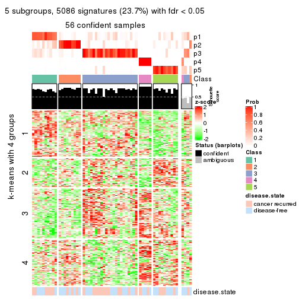</p>

</div>
<div id='tab-SD-pam-get-signatures-5'>
<pre><code class="r">get_signatures(res, k = 6)
</code></pre>

<p></p>

</div>
</div>


Signature heatmaps where rows are not scaled:


<script>
$( function() {
	$( '#tabs-SD-pam-get-signatures-no-scale' ).tabs();
} );
</script>
<div id='tabs-SD-pam-get-signatures-no-scale'>
<ul>
<li><a href='#tab-SD-pam-get-signatures-no-scale-1'>k = 2</a></li>
<li><a href='#tab-SD-pam-get-signatures-no-scale-2'>k = 3</a></li>
<li><a href='#tab-SD-pam-get-signatures-no-scale-3'>k = 4</a></li>
<li><a href='#tab-SD-pam-get-signatures-no-scale-4'>k = 5</a></li>
<li><a href='#tab-SD-pam-get-signatures-no-scale-5'>k = 6</a></li>
</ul>
<div id='tab-SD-pam-get-signatures-no-scale-1'>
<pre><code class="r">get_signatures(res, k = 2, scale_rows = FALSE)
</code></pre>

<p></p>

</div>
<div id='tab-SD-pam-get-signatures-no-scale-2'>
<pre><code class="r">get_signatures(res, k = 3, scale_rows = FALSE)
</code></pre>

<p>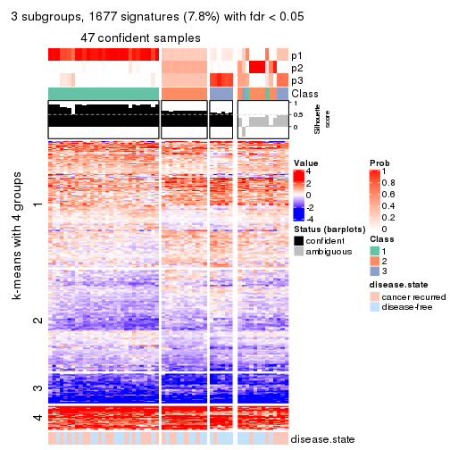</p>

</div>
<div id='tab-SD-pam-get-signatures-no-scale-3'>
<pre><code class="r">get_signatures(res, k = 4, scale_rows = FALSE)
</code></pre>

<p>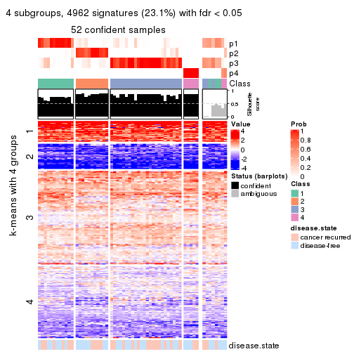</p>

</div>
<div id='tab-SD-pam-get-signatures-no-scale-4'>
<pre><code class="r">get_signatures(res, k = 5, scale_rows = FALSE)
</code></pre>

<p></p>

</div>
<div id='tab-SD-pam-get-signatures-no-scale-5'>
<pre><code class="r">get_signatures(res, k = 6, scale_rows = FALSE)
</code></pre>

<p></p>

</div>
</div>


Compare the overlap of signatures from different k:

```r
compare_signatures(res)
```


`get_signature()` returns a data frame invisibly. TO get the list of signatures, the function
call should be assigned to a variable explicitly. In following code, if `plot` argument is set
to `FALSE`, no heatmap is plotted while only the differential analysis is performed.

```r
# code only for demonstration
tb = get_signature(res, k = ..., plot = FALSE)
```

An example of the output of `tb` is:

```
#>   which_row         fdr    mean_1    mean_2 scaled_mean_1 scaled_mean_2 km
#> 1        38 0.042760348  8.373488  9.131774    -0.5533452     0.5164555  1
#> 2        40 0.018707592  7.106213  8.469186    -0.6173731     0.5762149  1
#> 3        55 0.019134737 10.221463 11.207825    -0.6159697     0.5749050  1
#> 4        59 0.006059896  5.921854  7.869574    -0.6899429     0.6439467  1
#> 5        60 0.018055526  8.928898 10.211722    -0.6204761     0.5791110  1
#> 6        98 0.009384629 15.714769 14.887706     0.6635654    -0.6193277  2
...
```

The columns in `tb` are:

1. `which_row`: row indices corresponding to the input matrix.
2. `fdr`: FDR for the differential test. 
3. `mean_x`: The mean value in group x.
4. `scaled_mean_x`: The mean value in group x after rows are scaled.
5. `km`: Row groups if k-means clustering is applied to rows.


UMAP plot which shows how samples are separated.


<script>
$( function() {
	$( '#tabs-SD-pam-dimension-reduction' ).tabs();
} );
</script>
<div id='tabs-SD-pam-dimension-reduction'>
<ul>
<li><a href='#tab-SD-pam-dimension-reduction-1'>k = 2</a></li>
<li><a href='#tab-SD-pam-dimension-reduction-2'>k = 3</a></li>
<li><a href='#tab-SD-pam-dimension-reduction-3'>k = 4</a></li>
<li><a href='#tab-SD-pam-dimension-reduction-4'>k = 5</a></li>
<li><a href='#tab-SD-pam-dimension-reduction-5'>k = 6</a></li>
</ul>
<div id='tab-SD-pam-dimension-reduction-1'>
<pre><code class="r">dimension_reduction(res, k = 2, method = &quot;UMAP&quot;)
</code></pre>

<p></p>

</div>
<div id='tab-SD-pam-dimension-reduction-2'>
<pre><code class="r">dimension_reduction(res, k = 3, method = &quot;UMAP&quot;)
</code></pre>

<p></p>

</div>
<div id='tab-SD-pam-dimension-reduction-3'>
<pre><code class="r">dimension_reduction(res, k = 4, method = &quot;UMAP&quot;)
</code></pre>

<p></p>

</div>
<div id='tab-SD-pam-dimension-reduction-4'>
<pre><code class="r">dimension_reduction(res, k = 5, method = &quot;UMAP&quot;)
</code></pre>

<p></p>

</div>
<div id='tab-SD-pam-dimension-reduction-5'>
<pre><code class="r">dimension_reduction(res, k = 6, method = &quot;UMAP&quot;)
</code></pre>

<p></p>

</div>
</div>


Following heatmap shows how subgroups are split when increasing `k`:

```r
collect_classes(res)
```


Test correlation between subgroups and known annotations. If the known
annotation is numeric, one-way ANOVA test is applied, and if the known
annotation is discrete, chi-squared contingency table test is applied.

```r
test_to_known_factors(res)
```

```
#>         n disease.state(p) k
#> SD:pam 60           0.0578 2
#> SD:pam 47           0.2089 3
#> SD:pam 52           0.7748 4
#> SD:pam 56           0.7150 5
#> SD:pam 54           0.7414 6
```


If matrix rows can be associated to genes, consider to use `GO_Enrichment(res,
...)` to perform function enrichment for the signature genes.


 

---------------------------------------------------


### SD:mclust


The object with results only for a single top-value method and a single partition method 
can be extracted as:

```r
res = res_list["SD", "mclust"]
# you can also extract it by
# res = res_list["SD:mclust"]
```

A summary of `res` and all the functions that can be applied to it:

```r
res
```

```
#> A 'ConsensusPartition' object with k = 2, 3, 4, 5, 6.
#>   On a matrix with 21446 rows and 60 columns.
#>   Top rows (1000, 2000, 3000, 4000, 5000) are extracted by 'SD' method.
#>   Subgroups are detected by 'mclust' method.
#>   Performed in total 1250 partitions by row resampling.
#>   Best k for subgroups seems to be 5.
#> 
#> Following methods can be applied to this 'ConsensusPartition' object:
#>  [1] "cola_report"             "collect_classes"         "collect_plots"          
#>  [4] "collect_stats"           "colnames"                "compare_signatures"     
#>  [7] "consensus_heatmap"       "dimension_reduction"     "functional_enrichment"  
#> [10] "get_anno_col"            "get_anno"                "get_classes"            
#> [13] "get_consensus"           "get_matrix"              "get_membership"         
#> [16] "get_param"               "get_signatures"          "get_stats"              
#> [19] "is_best_k"               "is_stable_k"             "membership_heatmap"     
#> [22] "ncol"                    "nrow"                    "plot_ecdf"              
#> [25] "rownames"                "select_partition_number" "show"                   
#> [28] "suggest_best_k"          "test_to_known_factors"
```

`collect_plots()` function collects all the plots made from `res` for all `k` (number of partitions)
into one single page to provide an easy and fast comparison between different `k`.

```r
collect_plots(res)
```


The plots are:

- The first row: a plot of the ECDF (Empirical cumulative distribution
  function) curves of the consensus matrix for each `k` and the heatmap of
  predicted classes for each `k`.
- The second row: heatmaps of the consensus matrix for each `k`.
- The third row: heatmaps of the membership matrix for each `k`.
- The fouth row: heatmaps of the signatures for each `k`.

All the plots in panels can be made by individual functions and they are
plotted later in this section.

`select_partition_number()` produces several plots showing different
statistics for choosing "optimized" `k`. There are following statistics:

- ECDF curves of the consensus matrix for each `k`;
- 1-PAC. [The PAC
  score](https://en.wikipedia.org/wiki/Consensus_clustering#Over-interpretation_potential_of_consensus_clustering)
  measures the proportion of the ambiguous subgrouping.
- Mean silhouette score.
- Concordance. The mean probability of fiting the consensus class ids in all
  partitions.
- Area increased. Denote $A_k$ as the area under the ECDF curve for current
  `k`, the area increased is defined as $A_k - A_{k-1}$.
- Rand index. The percent of pairs of samples that are both in a same cluster
  or both are not in a same cluster in the partition of k and k-1.
- Jaccard index. The ratio of pairs of samples are both in a same cluster in
  the partition of k and k-1 and the pairs of samples are both in a same
  cluster in the partition k or k-1.

The detailed explanations of these statistics can be found in [the cola
vignette](http://bioconductor.org/packages/devel/bioc/vignettes/cola/inst/doc/cola.html#toc_13).

Generally speaking, lower PAC score, higher mean silhouette score or higher
concordance corresponds to better partition. Rand index and Jaccard index
measure how similar the current partition is compared to partition with `k-1`.
If they are too similar, we won't accept `k` is better than `k-1`.

```r
select_partition_number(res)
```


The numeric values for all these statistics can be obtained by `get_stats()`.

```r
get_stats(res)
```

```
#>   k 1-PAC mean_silhouette concordance area_increased  Rand Jaccard
#> 2 2 0.545           0.867       0.909         0.3422 0.655   0.655
#> 3 3 0.566           0.799       0.874         0.8151 0.558   0.399
#> 4 4 0.652           0.753       0.858         0.1580 0.807   0.546
#> 5 5 0.820           0.801       0.900         0.0714 0.914   0.710
#> 6 6 0.746           0.732       0.829         0.0380 0.972   0.883
```

`suggest_best_k()` suggests the best $k$ based on these statistics. The rules are as follows:

- All $k$ with Jaccard index larger than 0.95 are removed because the increase of
  the partition number does not provides enough extra information. If all $k$ are removed,
  the best $k$ is assigned by `NA`.
- For $k$ with 1-PAC larger than 0.9, the maximal $k$ is taken as the "best k". Other $k$ is called "optional k".
- If it does not fit the second rule. The $k$ with the highest vote of highest
  1-PAC, mean silhouette and concordance is taken as the "best k".

```r
suggest_best_k(res)
```

```
#> [1] 5
```


Following shows the table of the partitions (You need to click the **show/hide
code output** link to see it). The membership matrix (columns with name `p*`)
is inferred by
[`clue::cl_consensus()`](https://www.rdocumentation.org/link/cl_consensus?package=clue)
function with the `SE` method. Basically the value in the membership matrix
represents the probability to belong to a certain group. The finall class
label for an item is determined with the group with highest probability it
belongs to.

In `get_classes()` function, the entropy is calculated from the membership
matrix and the silhouette score is calculated from the consensus matrix.


<script>
$( function() {
	$( '#tabs-SD-mclust-get-classes' ).tabs();
} );
</script>
<div id='tabs-SD-mclust-get-classes'>
<ul>
<li><a href='#tab-SD-mclust-get-classes-1'>k = 2</a></li>
<li><a href='#tab-SD-mclust-get-classes-2'>k = 3</a></li>
<li><a href='#tab-SD-mclust-get-classes-3'>k = 4</a></li>
<li><a href='#tab-SD-mclust-get-classes-4'>k = 5</a></li>
<li><a href='#tab-SD-mclust-get-classes-5'>k = 6</a></li>
</ul>

<div id='tab-SD-mclust-get-classes-1'>
<p><a id='tab-SD-mclust-get-classes-1-a' style='color:#0366d6' href='#'>show/hide code output</a></p>
<pre><code class="r">cbind(get_classes(res, k = 2), get_membership(res, k = 2))
</code></pre>

<pre><code>#&gt;          class entropy silhouette    p1    p2
#&gt; GSM22453     1  0.4939      0.895 0.892 0.108
#&gt; GSM22458     2  0.4298      0.880 0.088 0.912
#&gt; GSM22465     1  0.4939      0.895 0.892 0.108
#&gt; GSM22466     1  0.4939      0.895 0.892 0.108
#&gt; GSM22468     2  0.3114      0.907 0.056 0.944
#&gt; GSM22469     2  0.2603      0.911 0.044 0.956
#&gt; GSM22471     2  0.4298      0.880 0.088 0.912
#&gt; GSM22472     2  0.4431      0.883 0.092 0.908
#&gt; GSM22474     2  0.0672      0.925 0.008 0.992
#&gt; GSM22476     2  0.1184      0.924 0.016 0.984
#&gt; GSM22477     2  0.1414      0.925 0.020 0.980
#&gt; GSM22478     2  0.0376      0.924 0.004 0.996
#&gt; GSM22481     2  0.2043      0.918 0.032 0.968
#&gt; GSM22484     2  0.7745      0.665 0.228 0.772
#&gt; GSM22485     2  0.7376      0.704 0.208 0.792
#&gt; GSM22487     2  0.7950      0.634 0.240 0.760
#&gt; GSM22488     1  0.8861      0.732 0.696 0.304
#&gt; GSM22489     2  0.3274      0.909 0.060 0.940
#&gt; GSM22490     2  0.2948      0.908 0.052 0.948
#&gt; GSM22492     2  0.3114      0.907 0.056 0.944
#&gt; GSM22493     1  0.9754      0.548 0.592 0.408
#&gt; GSM22494     1  0.4939      0.895 0.892 0.108
#&gt; GSM22497     1  0.4939      0.895 0.892 0.108
#&gt; GSM22498     2  0.2948      0.907 0.052 0.948
#&gt; GSM22501     2  0.1184      0.924 0.016 0.984
#&gt; GSM22502     2  0.2948      0.908 0.052 0.948
#&gt; GSM22503     2  0.3274      0.904 0.060 0.940
#&gt; GSM22504     2  0.4298      0.880 0.088 0.912
#&gt; GSM22505     2  0.3114      0.910 0.056 0.944
#&gt; GSM22506     2  0.2778      0.909 0.048 0.952
#&gt; GSM22507     2  0.2423      0.913 0.040 0.960
#&gt; GSM22508     2  0.2778      0.910 0.048 0.952
#&gt; GSM22449     2  0.3114      0.910 0.056 0.944
#&gt; GSM22450     1  0.4939      0.895 0.892 0.108
#&gt; GSM22451     2  0.3274      0.908 0.060 0.940
#&gt; GSM22452     2  0.7883      0.664 0.236 0.764
#&gt; GSM22454     1  0.4939      0.895 0.892 0.108
#&gt; GSM22455     2  0.1633      0.923 0.024 0.976
#&gt; GSM22456     2  0.0000      0.924 0.000 1.000
#&gt; GSM22457     2  0.0376      0.925 0.004 0.996
#&gt; GSM22459     2  0.1184      0.924 0.016 0.984
#&gt; GSM22460     1  0.4939      0.895 0.892 0.108
#&gt; GSM22461     2  0.2948      0.908 0.052 0.948
#&gt; GSM22462     2  0.9129      0.430 0.328 0.672
#&gt; GSM22463     2  0.3274      0.909 0.060 0.940
#&gt; GSM22464     2  0.0376      0.925 0.004 0.996
#&gt; GSM22467     1  0.9323      0.668 0.652 0.348
#&gt; GSM22470     2  0.2423      0.919 0.040 0.960
#&gt; GSM22473     2  0.1184      0.924 0.016 0.984
#&gt; GSM22475     2  0.1184      0.924 0.016 0.984
#&gt; GSM22479     2  0.3114      0.907 0.056 0.944
#&gt; GSM22480     2  0.2778      0.909 0.048 0.952
#&gt; GSM22482     2  0.1843      0.923 0.028 0.972
#&gt; GSM22483     2  0.0938      0.925 0.012 0.988
#&gt; GSM22486     2  0.3114      0.910 0.056 0.944
#&gt; GSM22491     1  0.4939      0.895 0.892 0.108
#&gt; GSM22495     2  0.1184      0.924 0.016 0.984
#&gt; GSM22496     1  0.9580      0.610 0.620 0.380
#&gt; GSM22499     2  0.1633      0.921 0.024 0.976
#&gt; GSM22500     2  0.2778      0.910 0.048 0.952
</code></pre>

<script>
$('#tab-SD-mclust-get-classes-1-a').parent().next().next().hide();
$('#tab-SD-mclust-get-classes-1-a').click(function(){
  $('#tab-SD-mclust-get-classes-1-a').parent().next().next().toggle();
  return(false);
});
</script>
</div>

<div id='tab-SD-mclust-get-classes-2'>
<p><a id='tab-SD-mclust-get-classes-2-a' style='color:#0366d6' href='#'>show/hide code output</a></p>
<pre><code class="r">cbind(get_classes(res, k = 3), get_membership(res, k = 3))
</code></pre>

<pre><code>#&gt;          class entropy silhouette    p1    p2    p3
#&gt; GSM22453     1  0.0000     0.8681 1.000 0.000 0.000
#&gt; GSM22458     2  0.5826     0.7913 0.032 0.764 0.204
#&gt; GSM22465     1  0.0000     0.8681 1.000 0.000 0.000
#&gt; GSM22466     1  0.0000     0.8681 1.000 0.000 0.000
#&gt; GSM22468     2  0.0000     0.8225 0.000 1.000 0.000
#&gt; GSM22469     2  0.7756     0.4313 0.380 0.564 0.056
#&gt; GSM22471     2  0.5778     0.7924 0.032 0.768 0.200
#&gt; GSM22472     2  0.5826     0.7913 0.032 0.764 0.204
#&gt; GSM22474     2  0.0000     0.8225 0.000 1.000 0.000
#&gt; GSM22476     3  0.1964     0.9752 0.000 0.056 0.944
#&gt; GSM22477     2  0.5500     0.8028 0.084 0.816 0.100
#&gt; GSM22478     2  0.2527     0.8288 0.020 0.936 0.044
#&gt; GSM22481     2  0.0237     0.8241 0.000 0.996 0.004
#&gt; GSM22484     1  0.5815     0.4731 0.692 0.304 0.004
#&gt; GSM22485     1  0.2680     0.8474 0.924 0.068 0.008
#&gt; GSM22487     2  0.6520     0.2118 0.488 0.508 0.004
#&gt; GSM22488     1  0.0237     0.8683 0.996 0.004 0.000
#&gt; GSM22489     3  0.2486     0.9653 0.008 0.060 0.932
#&gt; GSM22490     2  0.4692     0.8027 0.012 0.820 0.168
#&gt; GSM22492     2  0.0747     0.8267 0.000 0.984 0.016
#&gt; GSM22493     1  0.1411     0.8572 0.964 0.036 0.000
#&gt; GSM22494     1  0.0000     0.8681 1.000 0.000 0.000
#&gt; GSM22497     1  0.0000     0.8681 1.000 0.000 0.000
#&gt; GSM22498     2  0.7995     0.0879 0.460 0.480 0.060
#&gt; GSM22501     3  0.2448     0.9777 0.000 0.076 0.924
#&gt; GSM22502     2  0.4539     0.8118 0.016 0.836 0.148
#&gt; GSM22503     2  0.0000     0.8225 0.000 1.000 0.000
#&gt; GSM22504     2  0.5826     0.7913 0.032 0.764 0.204
#&gt; GSM22505     1  0.6351     0.7794 0.760 0.072 0.168
#&gt; GSM22506     1  0.6181     0.7878 0.772 0.072 0.156
#&gt; GSM22507     2  0.1453     0.8254 0.024 0.968 0.008
#&gt; GSM22508     2  0.4519     0.8137 0.032 0.852 0.116
#&gt; GSM22449     1  0.6351     0.7794 0.760 0.072 0.168
#&gt; GSM22450     1  0.0000     0.8681 1.000 0.000 0.000
#&gt; GSM22451     1  0.6239     0.7847 0.768 0.072 0.160
#&gt; GSM22452     1  0.5467     0.7890 0.792 0.032 0.176
#&gt; GSM22454     1  0.0237     0.8671 0.996 0.004 0.000
#&gt; GSM22455     1  0.8868     0.5332 0.576 0.196 0.228
#&gt; GSM22456     2  0.2050     0.8247 0.020 0.952 0.028
#&gt; GSM22457     2  0.0747     0.8239 0.016 0.984 0.000
#&gt; GSM22459     3  0.1964     0.9752 0.000 0.056 0.944
#&gt; GSM22460     1  0.0000     0.8681 1.000 0.000 0.000
#&gt; GSM22461     2  0.4897     0.7985 0.016 0.812 0.172
#&gt; GSM22462     1  0.4921     0.7994 0.816 0.020 0.164
#&gt; GSM22463     1  0.6596     0.7054 0.704 0.040 0.256
#&gt; GSM22464     2  0.0747     0.8238 0.016 0.984 0.000
#&gt; GSM22467     1  0.0237     0.8683 0.996 0.004 0.000
#&gt; GSM22470     3  0.2681     0.9501 0.028 0.040 0.932
#&gt; GSM22473     3  0.2860     0.9737 0.004 0.084 0.912
#&gt; GSM22475     3  0.2448     0.9777 0.000 0.076 0.924
#&gt; GSM22479     2  0.0237     0.8241 0.000 0.996 0.004
#&gt; GSM22480     2  0.6422     0.4286 0.324 0.660 0.016
#&gt; GSM22482     3  0.2550     0.9717 0.012 0.056 0.932
#&gt; GSM22483     2  0.5467     0.7972 0.032 0.792 0.176
#&gt; GSM22486     1  0.6351     0.7794 0.760 0.072 0.168
#&gt; GSM22491     1  0.0000     0.8681 1.000 0.000 0.000
#&gt; GSM22495     3  0.2682     0.9774 0.004 0.076 0.920
#&gt; GSM22496     1  0.0592     0.8656 0.988 0.012 0.000
#&gt; GSM22499     2  0.0000     0.8225 0.000 1.000 0.000
#&gt; GSM22500     2  0.4931     0.8041 0.032 0.828 0.140
</code></pre>

<script>
$('#tab-SD-mclust-get-classes-2-a').parent().next().next().hide();
$('#tab-SD-mclust-get-classes-2-a').click(function(){
  $('#tab-SD-mclust-get-classes-2-a').parent().next().next().toggle();
  return(false);
});
</script>
</div>

<div id='tab-SD-mclust-get-classes-3'>
<p><a id='tab-SD-mclust-get-classes-3-a' style='color:#0366d6' href='#'>show/hide code output</a></p>
<pre><code class="r">cbind(get_classes(res, k = 4), get_membership(res, k = 4))
</code></pre>

<pre><code>#&gt;          class entropy silhouette    p1    p2    p3    p4
#&gt; GSM22453     1  0.0188     0.8320 0.996 0.000 0.000 0.004
#&gt; GSM22458     4  0.2589     0.8785 0.000 0.116 0.000 0.884
#&gt; GSM22465     1  0.0376     0.8322 0.992 0.004 0.000 0.004
#&gt; GSM22466     1  0.1867     0.8138 0.928 0.000 0.000 0.072
#&gt; GSM22468     2  0.0592     0.8526 0.000 0.984 0.000 0.016
#&gt; GSM22469     1  0.2918     0.7803 0.876 0.116 0.000 0.008
#&gt; GSM22471     4  0.3764     0.8773 0.000 0.216 0.000 0.784
#&gt; GSM22472     4  0.2647     0.8805 0.000 0.120 0.000 0.880
#&gt; GSM22474     2  0.0188     0.8533 0.000 0.996 0.000 0.004
#&gt; GSM22476     3  0.1489     0.8606 0.000 0.044 0.952 0.004
#&gt; GSM22477     2  0.6720     0.5254 0.200 0.672 0.040 0.088
#&gt; GSM22478     2  0.2778     0.7937 0.080 0.900 0.004 0.016
#&gt; GSM22481     2  0.1004     0.8506 0.004 0.972 0.000 0.024
#&gt; GSM22484     1  0.3528     0.7163 0.808 0.192 0.000 0.000
#&gt; GSM22485     1  0.0336     0.8320 0.992 0.008 0.000 0.000
#&gt; GSM22487     1  0.2402     0.8050 0.912 0.076 0.000 0.012
#&gt; GSM22488     1  0.0188     0.8321 0.996 0.004 0.000 0.000
#&gt; GSM22489     3  0.0000     0.8509 0.000 0.000 1.000 0.000
#&gt; GSM22490     4  0.5312     0.8440 0.000 0.236 0.052 0.712
#&gt; GSM22492     2  0.3239     0.7896 0.000 0.880 0.052 0.068
#&gt; GSM22493     1  0.0188     0.8321 0.996 0.004 0.000 0.000
#&gt; GSM22494     1  0.0000     0.8319 1.000 0.000 0.000 0.000
#&gt; GSM22497     1  0.0000     0.8319 1.000 0.000 0.000 0.000
#&gt; GSM22498     1  0.5158     0.0757 0.524 0.472 0.004 0.000
#&gt; GSM22501     3  0.0657     0.8563 0.000 0.012 0.984 0.004
#&gt; GSM22502     4  0.5312     0.8440 0.000 0.236 0.052 0.712
#&gt; GSM22503     2  0.4103     0.5023 0.000 0.744 0.000 0.256
#&gt; GSM22504     4  0.2589     0.8785 0.000 0.116 0.000 0.884
#&gt; GSM22505     1  0.5544     0.5520 0.640 0.008 0.332 0.020
#&gt; GSM22506     1  0.4458     0.7148 0.780 0.008 0.196 0.016
#&gt; GSM22507     2  0.1022     0.8441 0.032 0.968 0.000 0.000
#&gt; GSM22508     2  0.2281     0.7935 0.000 0.904 0.000 0.096
#&gt; GSM22449     1  0.5421     0.5663 0.648 0.008 0.328 0.016
#&gt; GSM22450     1  0.1305     0.8253 0.960 0.000 0.036 0.004
#&gt; GSM22451     1  0.5055     0.6569 0.720 0.008 0.252 0.020
#&gt; GSM22452     1  0.6350     0.5763 0.612 0.000 0.296 0.092
#&gt; GSM22454     1  0.1767     0.8226 0.944 0.044 0.000 0.012
#&gt; GSM22455     2  0.7409     0.2213 0.088 0.532 0.348 0.032
#&gt; GSM22456     2  0.1807     0.8329 0.008 0.940 0.052 0.000
#&gt; GSM22457     2  0.0804     0.8539 0.008 0.980 0.000 0.012
#&gt; GSM22459     3  0.1576     0.8595 0.000 0.048 0.948 0.004
#&gt; GSM22460     1  0.0188     0.8321 0.996 0.000 0.000 0.004
#&gt; GSM22461     4  0.3975     0.8661 0.000 0.240 0.000 0.760
#&gt; GSM22462     1  0.6371     0.5702 0.608 0.000 0.300 0.092
#&gt; GSM22463     1  0.5760     0.3983 0.544 0.008 0.432 0.016
#&gt; GSM22464     2  0.0469     0.8513 0.012 0.988 0.000 0.000
#&gt; GSM22467     1  0.2081     0.8117 0.916 0.000 0.000 0.084
#&gt; GSM22470     3  0.0188     0.8505 0.000 0.000 0.996 0.004
#&gt; GSM22473     3  0.2831     0.8016 0.000 0.120 0.876 0.004
#&gt; GSM22475     3  0.2053     0.8471 0.000 0.072 0.924 0.004
#&gt; GSM22479     2  0.1284     0.8489 0.000 0.964 0.012 0.024
#&gt; GSM22480     2  0.2805     0.7781 0.100 0.888 0.000 0.012
#&gt; GSM22482     3  0.2334     0.8197 0.000 0.004 0.908 0.088
#&gt; GSM22483     4  0.2647     0.8805 0.000 0.120 0.000 0.880
#&gt; GSM22486     3  0.8453    -0.0581 0.340 0.292 0.348 0.020
#&gt; GSM22491     1  0.1978     0.8165 0.928 0.004 0.000 0.068
#&gt; GSM22495     3  0.2530     0.8217 0.000 0.100 0.896 0.004
#&gt; GSM22496     1  0.2081     0.8117 0.916 0.000 0.000 0.084
#&gt; GSM22499     2  0.0469     0.8522 0.000 0.988 0.000 0.012
#&gt; GSM22500     4  0.5311     0.7325 0.024 0.328 0.000 0.648
</code></pre>

<script>
$('#tab-SD-mclust-get-classes-3-a').parent().next().next().hide();
$('#tab-SD-mclust-get-classes-3-a').click(function(){
  $('#tab-SD-mclust-get-classes-3-a').parent().next().next().toggle();
  return(false);
});
</script>
</div>

<div id='tab-SD-mclust-get-classes-4'>
<p><a id='tab-SD-mclust-get-classes-4-a' style='color:#0366d6' href='#'>show/hide code output</a></p>
<pre><code class="r">cbind(get_classes(res, k = 5), get_membership(res, k = 5))
</code></pre>

<pre><code>#&gt;          class entropy silhouette    p1    p2    p3    p4    p5
#&gt; GSM22453     1  0.0000     0.9165 1.000 0.000 0.000 0.000 0.000
#&gt; GSM22458     4  0.0162     0.8427 0.000 0.004 0.000 0.996 0.000
#&gt; GSM22465     1  0.0000     0.9165 1.000 0.000 0.000 0.000 0.000
#&gt; GSM22466     1  0.0000     0.9165 1.000 0.000 0.000 0.000 0.000
#&gt; GSM22468     2  0.0000     0.8988 0.000 1.000 0.000 0.000 0.000
#&gt; GSM22469     1  0.1124     0.8990 0.960 0.036 0.000 0.004 0.000
#&gt; GSM22471     4  0.2736     0.8395 0.000 0.016 0.068 0.892 0.024
#&gt; GSM22472     4  0.0162     0.8427 0.000 0.004 0.000 0.996 0.000
#&gt; GSM22474     2  0.0290     0.8986 0.000 0.992 0.000 0.000 0.008
#&gt; GSM22476     5  0.0000     0.9032 0.000 0.000 0.000 0.000 1.000
#&gt; GSM22477     2  0.3968     0.6743 0.204 0.768 0.000 0.024 0.004
#&gt; GSM22478     2  0.0162     0.8983 0.000 0.996 0.000 0.004 0.000
#&gt; GSM22481     2  0.1251     0.8870 0.000 0.956 0.036 0.000 0.008
#&gt; GSM22484     1  0.4064     0.5845 0.716 0.272 0.008 0.004 0.000
#&gt; GSM22485     1  0.0510     0.9151 0.984 0.000 0.016 0.000 0.000
#&gt; GSM22487     1  0.1124     0.8990 0.960 0.036 0.000 0.004 0.000
#&gt; GSM22488     1  0.0510     0.9151 0.984 0.000 0.016 0.000 0.000
#&gt; GSM22489     5  0.2732     0.7676 0.000 0.000 0.160 0.000 0.840
#&gt; GSM22490     4  0.4888     0.7935 0.000 0.068 0.080 0.772 0.080
#&gt; GSM22492     2  0.3110     0.8109 0.000 0.860 0.000 0.060 0.080
#&gt; GSM22493     1  0.0510     0.9151 0.984 0.000 0.016 0.000 0.000
#&gt; GSM22494     1  0.0000     0.9165 1.000 0.000 0.000 0.000 0.000
#&gt; GSM22497     1  0.0000     0.9165 1.000 0.000 0.000 0.000 0.000
#&gt; GSM22498     2  0.4481     0.3007 0.416 0.576 0.008 0.000 0.000
#&gt; GSM22501     5  0.0510     0.8960 0.000 0.000 0.016 0.000 0.984
#&gt; GSM22502     4  0.5006     0.7886 0.000 0.076 0.080 0.764 0.080
#&gt; GSM22503     2  0.3039     0.7107 0.000 0.808 0.000 0.192 0.000
#&gt; GSM22504     4  0.0162     0.8427 0.000 0.004 0.000 0.996 0.000
#&gt; GSM22505     3  0.1851     0.7817 0.000 0.000 0.912 0.000 0.088
#&gt; GSM22506     3  0.5542     0.2126 0.396 0.000 0.532 0.000 0.072
#&gt; GSM22507     2  0.0162     0.8983 0.000 0.996 0.000 0.004 0.000
#&gt; GSM22508     2  0.2124     0.8689 0.000 0.924 0.044 0.012 0.020
#&gt; GSM22449     3  0.2179     0.7841 0.000 0.000 0.888 0.000 0.112
#&gt; GSM22450     1  0.0703     0.9067 0.976 0.000 0.000 0.000 0.024
#&gt; GSM22451     1  0.5325     0.3948 0.616 0.000 0.308 0.000 0.076
#&gt; GSM22452     1  0.4394     0.6632 0.764 0.000 0.136 0.000 0.100
#&gt; GSM22454     1  0.0703     0.9072 0.976 0.024 0.000 0.000 0.000
#&gt; GSM22455     3  0.5172     0.6520 0.004 0.116 0.712 0.004 0.164
#&gt; GSM22456     2  0.1638     0.8631 0.004 0.932 0.000 0.000 0.064
#&gt; GSM22457     2  0.0000     0.8988 0.000 1.000 0.000 0.000 0.000
#&gt; GSM22459     5  0.0162     0.9037 0.000 0.000 0.004 0.000 0.996
#&gt; GSM22460     1  0.0510     0.9151 0.984 0.000 0.016 0.000 0.000
#&gt; GSM22461     4  0.3472     0.8340 0.000 0.036 0.076 0.856 0.032
#&gt; GSM22462     1  0.4478     0.6501 0.756 0.000 0.144 0.000 0.100
#&gt; GSM22463     3  0.2813     0.7454 0.000 0.000 0.832 0.000 0.168
#&gt; GSM22464     2  0.0000     0.8988 0.000 1.000 0.000 0.000 0.000
#&gt; GSM22467     1  0.0486     0.9146 0.988 0.004 0.000 0.004 0.004
#&gt; GSM22470     5  0.4126     0.3396 0.000 0.000 0.380 0.000 0.620
#&gt; GSM22473     5  0.1502     0.8526 0.000 0.056 0.004 0.000 0.940
#&gt; GSM22475     5  0.0566     0.8984 0.000 0.012 0.004 0.000 0.984
#&gt; GSM22479     2  0.1012     0.8917 0.000 0.968 0.000 0.012 0.020
#&gt; GSM22480     2  0.0613     0.8960 0.004 0.984 0.008 0.004 0.000
#&gt; GSM22482     5  0.0000     0.9032 0.000 0.000 0.000 0.000 1.000
#&gt; GSM22483     4  0.0290     0.8419 0.000 0.008 0.000 0.992 0.000
#&gt; GSM22486     3  0.2233     0.7864 0.004 0.000 0.892 0.000 0.104
#&gt; GSM22491     1  0.0510     0.9151 0.984 0.000 0.016 0.000 0.000
#&gt; GSM22495     5  0.0162     0.9037 0.000 0.000 0.004 0.000 0.996
#&gt; GSM22496     1  0.0162     0.9159 0.996 0.000 0.000 0.004 0.000
#&gt; GSM22499     2  0.0671     0.8963 0.000 0.980 0.004 0.000 0.016
#&gt; GSM22500     4  0.6392     0.0454 0.092 0.440 0.004 0.448 0.016
</code></pre>

<script>
$('#tab-SD-mclust-get-classes-4-a').parent().next().next().hide();
$('#tab-SD-mclust-get-classes-4-a').click(function(){
  $('#tab-SD-mclust-get-classes-4-a').parent().next().next().toggle();
  return(false);
});
</script>
</div>

<div id='tab-SD-mclust-get-classes-5'>
<p><a id='tab-SD-mclust-get-classes-5-a' style='color:#0366d6' href='#'>show/hide code output</a></p>
<pre><code class="r">cbind(get_classes(res, k = 6), get_membership(res, k = 6))
</code></pre>

<pre><code>#&gt;          class entropy silhouette    p1    p2    p3    p4    p5 p6
#&gt; GSM22453     1  0.0551     0.8415 0.984 0.008 0.004 0.000 0.000 NA
#&gt; GSM22458     4  0.0146     0.8829 0.000 0.004 0.000 0.996 0.000 NA
#&gt; GSM22465     1  0.0291     0.8395 0.992 0.000 0.004 0.000 0.000 NA
#&gt; GSM22466     1  0.1167     0.8414 0.960 0.008 0.012 0.000 0.000 NA
#&gt; GSM22468     2  0.1245     0.8122 0.000 0.952 0.000 0.016 0.000 NA
#&gt; GSM22469     1  0.4800     0.6595 0.716 0.148 0.004 0.016 0.000 NA
#&gt; GSM22471     4  0.2911     0.8757 0.000 0.024 0.000 0.832 0.000 NA
#&gt; GSM22472     4  0.0260     0.8817 0.000 0.008 0.000 0.992 0.000 NA
#&gt; GSM22474     2  0.3018     0.7807 0.004 0.816 0.000 0.012 0.000 NA
#&gt; GSM22476     5  0.1910     0.8487 0.000 0.000 0.000 0.000 0.892 NA
#&gt; GSM22477     2  0.4398     0.6406 0.200 0.732 0.000 0.044 0.004 NA
#&gt; GSM22478     2  0.2730     0.8090 0.004 0.856 0.004 0.012 0.000 NA
#&gt; GSM22481     2  0.2122     0.7960 0.000 0.900 0.000 0.024 0.000 NA
#&gt; GSM22484     1  0.5545     0.0425 0.460 0.420 0.004 0.000 0.000 NA
#&gt; GSM22485     1  0.3321     0.7751 0.832 0.008 0.072 0.000 0.000 NA
#&gt; GSM22487     1  0.5157     0.6029 0.672 0.188 0.004 0.016 0.000 NA
#&gt; GSM22488     1  0.2085     0.8179 0.912 0.008 0.056 0.000 0.000 NA
#&gt; GSM22489     5  0.4710     0.6831 0.000 0.000 0.208 0.004 0.684 NA
#&gt; GSM22490     4  0.3833     0.8456 0.000 0.016 0.000 0.708 0.004 NA
#&gt; GSM22492     2  0.4962     0.6734 0.004 0.672 0.000 0.100 0.008 NA
#&gt; GSM22493     1  0.3211     0.7889 0.848 0.020 0.076 0.000 0.000 NA
#&gt; GSM22494     1  0.0291     0.8407 0.992 0.000 0.004 0.000 0.000 NA
#&gt; GSM22497     1  0.0551     0.8415 0.984 0.008 0.004 0.000 0.000 NA
#&gt; GSM22498     2  0.6663     0.2507 0.304 0.464 0.064 0.000 0.000 NA
#&gt; GSM22501     5  0.2889     0.8457 0.000 0.000 0.044 0.000 0.848 NA
#&gt; GSM22502     4  0.3950     0.8458 0.000 0.024 0.000 0.708 0.004 NA
#&gt; GSM22503     2  0.2768     0.7364 0.000 0.832 0.000 0.156 0.000 NA
#&gt; GSM22504     4  0.0146     0.8829 0.000 0.004 0.000 0.996 0.000 NA
#&gt; GSM22505     3  0.1297     0.7421 0.040 0.000 0.948 0.000 0.012 NA
#&gt; GSM22506     3  0.3081     0.6532 0.220 0.000 0.776 0.000 0.000 NA
#&gt; GSM22507     2  0.2212     0.7957 0.008 0.880 0.000 0.000 0.000 NA
#&gt; GSM22508     2  0.2301     0.7913 0.000 0.884 0.000 0.020 0.000 NA
#&gt; GSM22449     3  0.0964     0.7340 0.016 0.000 0.968 0.000 0.012 NA
#&gt; GSM22450     1  0.0865     0.8318 0.964 0.000 0.036 0.000 0.000 NA
#&gt; GSM22451     3  0.4080     0.1475 0.456 0.000 0.536 0.000 0.000 NA
#&gt; GSM22452     1  0.4274     0.4116 0.676 0.000 0.288 0.000 0.024 NA
#&gt; GSM22454     1  0.1405     0.8351 0.948 0.024 0.004 0.000 0.000 NA
#&gt; GSM22455     3  0.6570     0.4060 0.008 0.056 0.480 0.000 0.124 NA
#&gt; GSM22456     2  0.3946     0.7109 0.004 0.680 0.004 0.000 0.008 NA
#&gt; GSM22457     2  0.0603     0.8110 0.004 0.980 0.000 0.000 0.000 NA
#&gt; GSM22459     5  0.0000     0.8531 0.000 0.000 0.000 0.000 1.000 NA
#&gt; GSM22460     1  0.1148     0.8402 0.960 0.020 0.016 0.000 0.000 NA
#&gt; GSM22461     4  0.3921     0.8539 0.000 0.036 0.000 0.736 0.004 NA
#&gt; GSM22462     1  0.4450     0.3529 0.652 0.000 0.308 0.000 0.024 NA
#&gt; GSM22463     3  0.3158     0.6554 0.008 0.000 0.848 0.004 0.092 NA
#&gt; GSM22464     2  0.1806     0.8116 0.004 0.908 0.000 0.000 0.000 NA
#&gt; GSM22467     1  0.0260     0.8420 0.992 0.008 0.000 0.000 0.000 NA
#&gt; GSM22470     5  0.5388     0.3813 0.000 0.000 0.372 0.004 0.520 NA
#&gt; GSM22473     5  0.1297     0.8360 0.000 0.040 0.000 0.000 0.948 NA
#&gt; GSM22475     5  0.0777     0.8513 0.000 0.024 0.004 0.000 0.972 NA
#&gt; GSM22479     2  0.3351     0.7747 0.004 0.800 0.000 0.028 0.000 NA
#&gt; GSM22480     2  0.3443     0.7696 0.040 0.832 0.032 0.000 0.000 NA
#&gt; GSM22482     5  0.2867     0.8463 0.000 0.000 0.040 0.000 0.848 NA
#&gt; GSM22483     4  0.0458     0.8760 0.000 0.016 0.000 0.984 0.000 NA
#&gt; GSM22486     3  0.1442     0.7413 0.040 0.000 0.944 0.000 0.012 NA
#&gt; GSM22491     1  0.0993     0.8392 0.964 0.012 0.024 0.000 0.000 NA
#&gt; GSM22495     5  0.0000     0.8531 0.000 0.000 0.000 0.000 1.000 NA
#&gt; GSM22496     1  0.0405     0.8426 0.988 0.008 0.004 0.000 0.000 NA
#&gt; GSM22499     2  0.1010     0.8139 0.004 0.960 0.000 0.000 0.000 NA
#&gt; GSM22500     2  0.5803     0.4416 0.108 0.568 0.000 0.288 0.000 NA
</code></pre>

<script>
$('#tab-SD-mclust-get-classes-5-a').parent().next().next().hide();
$('#tab-SD-mclust-get-classes-5-a').click(function(){
  $('#tab-SD-mclust-get-classes-5-a').parent().next().next().toggle();
  return(false);
});
</script>
</div>
</div>

Heatmaps for the consensus matrix. It visualizes the probability of two
samples to be in a same group.


<script>
$( function() {
	$( '#tabs-SD-mclust-consensus-heatmap' ).tabs();
} );
</script>
<div id='tabs-SD-mclust-consensus-heatmap'>
<ul>
<li><a href='#tab-SD-mclust-consensus-heatmap-1'>k = 2</a></li>
<li><a href='#tab-SD-mclust-consensus-heatmap-2'>k = 3</a></li>
<li><a href='#tab-SD-mclust-consensus-heatmap-3'>k = 4</a></li>
<li><a href='#tab-SD-mclust-consensus-heatmap-4'>k = 5</a></li>
<li><a href='#tab-SD-mclust-consensus-heatmap-5'>k = 6</a></li>
</ul>
<div id='tab-SD-mclust-consensus-heatmap-1'>
<pre><code class="r">consensus_heatmap(res, k = 2)
</code></pre>

<p>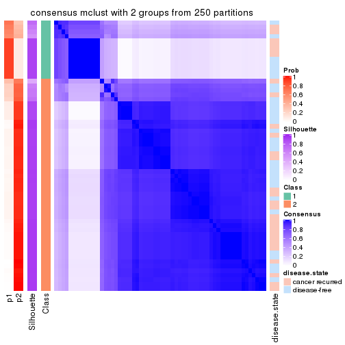</p>

</div>
<div id='tab-SD-mclust-consensus-heatmap-2'>
<pre><code class="r">consensus_heatmap(res, k = 3)
</code></pre>

<p></p>

</div>
<div id='tab-SD-mclust-consensus-heatmap-3'>
<pre><code class="r">consensus_heatmap(res, k = 4)
</code></pre>

<p></p>

</div>
<div id='tab-SD-mclust-consensus-heatmap-4'>
<pre><code class="r">consensus_heatmap(res, k = 5)
</code></pre>

<p></p>

</div>
<div id='tab-SD-mclust-consensus-heatmap-5'>
<pre><code class="r">consensus_heatmap(res, k = 6)
</code></pre>

<p>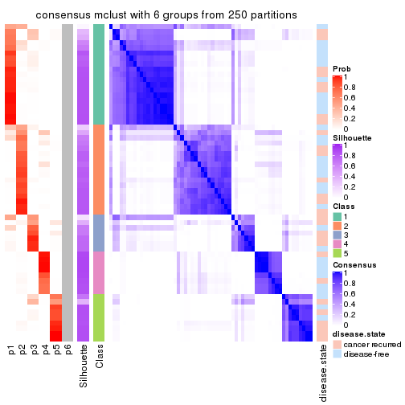</p>

</div>
</div>

Heatmaps for the membership of samples in all partitions to see how consistent they are:


<script>
$( function() {
	$( '#tabs-SD-mclust-membership-heatmap' ).tabs();
} );
</script>
<div id='tabs-SD-mclust-membership-heatmap'>
<ul>
<li><a href='#tab-SD-mclust-membership-heatmap-1'>k = 2</a></li>
<li><a href='#tab-SD-mclust-membership-heatmap-2'>k = 3</a></li>
<li><a href='#tab-SD-mclust-membership-heatmap-3'>k = 4</a></li>
<li><a href='#tab-SD-mclust-membership-heatmap-4'>k = 5</a></li>
<li><a href='#tab-SD-mclust-membership-heatmap-5'>k = 6</a></li>
</ul>
<div id='tab-SD-mclust-membership-heatmap-1'>
<pre><code class="r">membership_heatmap(res, k = 2)
</code></pre>

<p></p>

</div>
<div id='tab-SD-mclust-membership-heatmap-2'>
<pre><code class="r">membership_heatmap(res, k = 3)
</code></pre>

<p></p>

</div>
<div id='tab-SD-mclust-membership-heatmap-3'>
<pre><code class="r">membership_heatmap(res, k = 4)
</code></pre>

<p></p>

</div>
<div id='tab-SD-mclust-membership-heatmap-4'>
<pre><code class="r">membership_heatmap(res, k = 5)
</code></pre>

<p></p>

</div>
<div id='tab-SD-mclust-membership-heatmap-5'>
<pre><code class="r">membership_heatmap(res, k = 6)
</code></pre>

<p></p>

</div>
</div>

As soon as we have had the classes for columns, we can look for signatures
which are significantly different between classes which can be candidate marks
for certain classes. Following are the heatmaps for signatures.


Signature heatmaps where rows are scaled:


<script>
$( function() {
	$( '#tabs-SD-mclust-get-signatures' ).tabs();
} );
</script>
<div id='tabs-SD-mclust-get-signatures'>
<ul>
<li><a href='#tab-SD-mclust-get-signatures-1'>k = 2</a></li>
<li><a href='#tab-SD-mclust-get-signatures-2'>k = 3</a></li>
<li><a href='#tab-SD-mclust-get-signatures-3'>k = 4</a></li>
<li><a href='#tab-SD-mclust-get-signatures-4'>k = 5</a></li>
<li><a href='#tab-SD-mclust-get-signatures-5'>k = 6</a></li>
</ul>
<div id='tab-SD-mclust-get-signatures-1'>
<pre><code class="r">get_signatures(res, k = 2)
</code></pre>

<p></p>

</div>
<div id='tab-SD-mclust-get-signatures-2'>
<pre><code class="r">get_signatures(res, k = 3)
</code></pre>

<p></p>

</div>
<div id='tab-SD-mclust-get-signatures-3'>
<pre><code class="r">get_signatures(res, k = 4)
</code></pre>

<p></p>

</div>
<div id='tab-SD-mclust-get-signatures-4'>
<pre><code class="r">get_signatures(res, k = 5)
</code></pre>

<p></p>

</div>
<div id='tab-SD-mclust-get-signatures-5'>
<pre><code class="r">get_signatures(res, k = 6)
</code></pre>

<p></p>

</div>
</div>


Signature heatmaps where rows are not scaled:


<script>
$( function() {
	$( '#tabs-SD-mclust-get-signatures-no-scale' ).tabs();
} );
</script>
<div id='tabs-SD-mclust-get-signatures-no-scale'>
<ul>
<li><a href='#tab-SD-mclust-get-signatures-no-scale-1'>k = 2</a></li>
<li><a href='#tab-SD-mclust-get-signatures-no-scale-2'>k = 3</a></li>
<li><a href='#tab-SD-mclust-get-signatures-no-scale-3'>k = 4</a></li>
<li><a href='#tab-SD-mclust-get-signatures-no-scale-4'>k = 5</a></li>
<li><a href='#tab-SD-mclust-get-signatures-no-scale-5'>k = 6</a></li>
</ul>
<div id='tab-SD-mclust-get-signatures-no-scale-1'>
<pre><code class="r">get_signatures(res, k = 2, scale_rows = FALSE)
</code></pre>

<p></p>

</div>
<div id='tab-SD-mclust-get-signatures-no-scale-2'>
<pre><code class="r">get_signatures(res, k = 3, scale_rows = FALSE)
</code></pre>

<p></p>

</div>
<div id='tab-SD-mclust-get-signatures-no-scale-3'>
<pre><code class="r">get_signatures(res, k = 4, scale_rows = FALSE)
</code></pre>

<p></p>

</div>
<div id='tab-SD-mclust-get-signatures-no-scale-4'>
<pre><code class="r">get_signatures(res, k = 5, scale_rows = FALSE)
</code></pre>

<p></p>

</div>
<div id='tab-SD-mclust-get-signatures-no-scale-5'>
<pre><code class="r">get_signatures(res, k = 6, scale_rows = FALSE)
</code></pre>

<p></p>

</div>
</div>


Compare the overlap of signatures from different k:

```r
compare_signatures(res)
```


`get_signature()` returns a data frame invisibly. TO get the list of signatures, the function
call should be assigned to a variable explicitly. In following code, if `plot` argument is set
to `FALSE`, no heatmap is plotted while only the differential analysis is performed.

```r
# code only for demonstration
tb = get_signature(res, k = ..., plot = FALSE)
```

An example of the output of `tb` is:

```
#>   which_row         fdr    mean_1    mean_2 scaled_mean_1 scaled_mean_2 km
#> 1        38 0.042760348  8.373488  9.131774    -0.5533452     0.5164555  1
#> 2        40 0.018707592  7.106213  8.469186    -0.6173731     0.5762149  1
#> 3        55 0.019134737 10.221463 11.207825    -0.6159697     0.5749050  1
#> 4        59 0.006059896  5.921854  7.869574    -0.6899429     0.6439467  1
#> 5        60 0.018055526  8.928898 10.211722    -0.6204761     0.5791110  1
#> 6        98 0.009384629 15.714769 14.887706     0.6635654    -0.6193277  2
...
```

The columns in `tb` are:

1. `which_row`: row indices corresponding to the input matrix.
2. `fdr`: FDR for the differential test. 
3. `mean_x`: The mean value in group x.
4. `scaled_mean_x`: The mean value in group x after rows are scaled.
5. `km`: Row groups if k-means clustering is applied to rows.


UMAP plot which shows how samples are separated.


<script>
$( function() {
	$( '#tabs-SD-mclust-dimension-reduction' ).tabs();
} );
</script>
<div id='tabs-SD-mclust-dimension-reduction'>
<ul>
<li><a href='#tab-SD-mclust-dimension-reduction-1'>k = 2</a></li>
<li><a href='#tab-SD-mclust-dimension-reduction-2'>k = 3</a></li>
<li><a href='#tab-SD-mclust-dimension-reduction-3'>k = 4</a></li>
<li><a href='#tab-SD-mclust-dimension-reduction-4'>k = 5</a></li>
<li><a href='#tab-SD-mclust-dimension-reduction-5'>k = 6</a></li>
</ul>
<div id='tab-SD-mclust-dimension-reduction-1'>
<pre><code class="r">dimension_reduction(res, k = 2, method = &quot;UMAP&quot;)
</code></pre>

<p></p>

</div>
<div id='tab-SD-mclust-dimension-reduction-2'>
<pre><code class="r">dimension_reduction(res, k = 3, method = &quot;UMAP&quot;)
</code></pre>

<p></p>

</div>
<div id='tab-SD-mclust-dimension-reduction-3'>
<pre><code class="r">dimension_reduction(res, k = 4, method = &quot;UMAP&quot;)
</code></pre>

<p></p>

</div>
<div id='tab-SD-mclust-dimension-reduction-4'>
<pre><code class="r">dimension_reduction(res, k = 5, method = &quot;UMAP&quot;)
</code></pre>

<p></p>

</div>
<div id='tab-SD-mclust-dimension-reduction-5'>
<pre><code class="r">dimension_reduction(res, k = 6, method = &quot;UMAP&quot;)
</code></pre>

<p></p>

</div>
</div>


Following heatmap shows how subgroups are split when increasing `k`:

```r
collect_classes(res)
```


Test correlation between subgroups and known annotations. If the known
annotation is numeric, one-way ANOVA test is applied, and if the known
annotation is discrete, chi-squared contingency table test is applied.

```r
test_to_known_factors(res)
```

```
#>            n disease.state(p) k
#> SD:mclust 59            1.000 2
#> SD:mclust 55            0.173 3
#> SD:mclust 56            0.498 4
#> SD:mclust 55            0.291 5
#> SD:mclust 52            0.534 6
```


If matrix rows can be associated to genes, consider to use `GO_Enrichment(res,
...)` to perform function enrichment for the signature genes.


 

---------------------------------------------------


### SD:NMF


The object with results only for a single top-value method and a single partition method 
can be extracted as:

```r
res = res_list["SD", "NMF"]
# you can also extract it by
# res = res_list["SD:NMF"]
```

A summary of `res` and all the functions that can be applied to it:

```r
res
```

```
#> A 'ConsensusPartition' object with k = 2, 3, 4, 5, 6.
#>   On a matrix with 21446 rows and 60 columns.
#>   Top rows (1000, 2000, 3000, 4000, 5000) are extracted by 'SD' method.
#>   Subgroups are detected by 'NMF' method.
#>   Performed in total 1250 partitions by row resampling.
#>   Best k for subgroups seems to be 2.
#> 
#> Following methods can be applied to this 'ConsensusPartition' object:
#>  [1] "cola_report"             "collect_classes"         "collect_plots"          
#>  [4] "collect_stats"           "colnames"                "compare_signatures"     
#>  [7] "consensus_heatmap"       "dimension_reduction"     "functional_enrichment"  
#> [10] "get_anno_col"            "get_anno"                "get_classes"            
#> [13] "get_consensus"           "get_matrix"              "get_membership"         
#> [16] "get_param"               "get_signatures"          "get_stats"              
#> [19] "is_best_k"               "is_stable_k"             "membership_heatmap"     
#> [22] "ncol"                    "nrow"                    "plot_ecdf"              
#> [25] "rownames"                "select_partition_number" "show"                   
#> [28] "suggest_best_k"          "test_to_known_factors"
```

`collect_plots()` function collects all the plots made from `res` for all `k` (number of partitions)
into one single page to provide an easy and fast comparison between different `k`.

```r
collect_plots(res)
```


The plots are:

- The first row: a plot of the ECDF (Empirical cumulative distribution
  function) curves of the consensus matrix for each `k` and the heatmap of
  predicted classes for each `k`.
- The second row: heatmaps of the consensus matrix for each `k`.
- The third row: heatmaps of the membership matrix for each `k`.
- The fouth row: heatmaps of the signatures for each `k`.

All the plots in panels can be made by individual functions and they are
plotted later in this section.

`select_partition_number()` produces several plots showing different
statistics for choosing "optimized" `k`. There are following statistics:

- ECDF curves of the consensus matrix for each `k`;
- 1-PAC. [The PAC
  score](https://en.wikipedia.org/wiki/Consensus_clustering#Over-interpretation_potential_of_consensus_clustering)
  measures the proportion of the ambiguous subgrouping.
- Mean silhouette score.
- Concordance. The mean probability of fiting the consensus class ids in all
  partitions.
- Area increased. Denote $A_k$ as the area under the ECDF curve for current
  `k`, the area increased is defined as $A_k - A_{k-1}$.
- Rand index. The percent of pairs of samples that are both in a same cluster
  or both are not in a same cluster in the partition of k and k-1.
- Jaccard index. The ratio of pairs of samples are both in a same cluster in
  the partition of k and k-1 and the pairs of samples are both in a same
  cluster in the partition k or k-1.

The detailed explanations of these statistics can be found in [the cola
vignette](http://bioconductor.org/packages/devel/bioc/vignettes/cola/inst/doc/cola.html#toc_13).

Generally speaking, lower PAC score, higher mean silhouette score or higher
concordance corresponds to better partition. Rand index and Jaccard index
measure how similar the current partition is compared to partition with `k-1`.
If they are too similar, we won't accept `k` is better than `k-1`.

```r
select_partition_number(res)
```


The numeric values for all these statistics can be obtained by `get_stats()`.

```r
get_stats(res)
```

```
#>   k 1-PAC mean_silhouette concordance area_increased  Rand Jaccard
#> 2 2 0.686           0.858       0.941         0.5065 0.492   0.492
#> 3 3 0.541           0.694       0.829         0.3203 0.753   0.539
#> 4 4 0.479           0.481       0.676         0.1003 0.804   0.504
#> 5 5 0.617           0.645       0.804         0.0612 0.826   0.479
#> 6 6 0.665           0.549       0.765         0.0505 0.856   0.480
```

`suggest_best_k()` suggests the best $k$ based on these statistics. The rules are as follows:

- All $k$ with Jaccard index larger than 0.95 are removed because the increase of
  the partition number does not provides enough extra information. If all $k$ are removed,
  the best $k$ is assigned by `NA`.
- For $k$ with 1-PAC larger than 0.9, the maximal $k$ is taken as the "best k". Other $k$ is called "optional k".
- If it does not fit the second rule. The $k$ with the highest vote of highest
  1-PAC, mean silhouette and concordance is taken as the "best k".

```r
suggest_best_k(res)
```

```
#> [1] 2
```


Following shows the table of the partitions (You need to click the **show/hide
code output** link to see it). The membership matrix (columns with name `p*`)
is inferred by
[`clue::cl_consensus()`](https://www.rdocumentation.org/link/cl_consensus?package=clue)
function with the `SE` method. Basically the value in the membership matrix
represents the probability to belong to a certain group. The finall class
label for an item is determined with the group with highest probability it
belongs to.

In `get_classes()` function, the entropy is calculated from the membership
matrix and the silhouette score is calculated from the consensus matrix.


<script>
$( function() {
	$( '#tabs-SD-NMF-get-classes' ).tabs();
} );
</script>
<div id='tabs-SD-NMF-get-classes'>
<ul>
<li><a href='#tab-SD-NMF-get-classes-1'>k = 2</a></li>
<li><a href='#tab-SD-NMF-get-classes-2'>k = 3</a></li>
<li><a href='#tab-SD-NMF-get-classes-3'>k = 4</a></li>
<li><a href='#tab-SD-NMF-get-classes-4'>k = 5</a></li>
<li><a href='#tab-SD-NMF-get-classes-5'>k = 6</a></li>
</ul>

<div id='tab-SD-NMF-get-classes-1'>
<p><a id='tab-SD-NMF-get-classes-1-a' style='color:#0366d6' href='#'>show/hide code output</a></p>
<pre><code class="r">cbind(get_classes(res, k = 2), get_membership(res, k = 2))
</code></pre>

<pre><code>#&gt;          class entropy silhouette    p1    p2
#&gt; GSM22453     1  0.0000     0.9176 1.000 0.000
#&gt; GSM22458     2  0.0000     0.9473 0.000 1.000
#&gt; GSM22465     1  0.5946     0.8177 0.856 0.144
#&gt; GSM22466     1  0.0000     0.9176 1.000 0.000
#&gt; GSM22468     2  0.0000     0.9473 0.000 1.000
#&gt; GSM22469     2  0.9944     0.0791 0.456 0.544
#&gt; GSM22471     2  0.0000     0.9473 0.000 1.000
#&gt; GSM22472     2  0.0000     0.9473 0.000 1.000
#&gt; GSM22474     2  0.0000     0.9473 0.000 1.000
#&gt; GSM22476     2  0.3733     0.8896 0.072 0.928
#&gt; GSM22477     2  0.0000     0.9473 0.000 1.000
#&gt; GSM22478     2  0.0000     0.9473 0.000 1.000
#&gt; GSM22481     2  0.0000     0.9473 0.000 1.000
#&gt; GSM22484     1  0.4939     0.8494 0.892 0.108
#&gt; GSM22485     1  0.0000     0.9176 1.000 0.000
#&gt; GSM22487     1  0.9988     0.1158 0.520 0.480
#&gt; GSM22488     1  0.0000     0.9176 1.000 0.000
#&gt; GSM22489     1  0.0000     0.9176 1.000 0.000
#&gt; GSM22490     2  0.0000     0.9473 0.000 1.000
#&gt; GSM22492     2  0.0000     0.9473 0.000 1.000
#&gt; GSM22493     1  0.0000     0.9176 1.000 0.000
#&gt; GSM22494     1  0.0000     0.9176 1.000 0.000
#&gt; GSM22497     1  0.0000     0.9176 1.000 0.000
#&gt; GSM22498     1  0.0000     0.9176 1.000 0.000
#&gt; GSM22501     1  0.9393     0.4447 0.644 0.356
#&gt; GSM22502     2  0.0000     0.9473 0.000 1.000
#&gt; GSM22503     2  0.0000     0.9473 0.000 1.000
#&gt; GSM22504     2  0.0000     0.9473 0.000 1.000
#&gt; GSM22505     1  0.0000     0.9176 1.000 0.000
#&gt; GSM22506     1  0.0000     0.9176 1.000 0.000
#&gt; GSM22507     2  0.9635     0.3020 0.388 0.612
#&gt; GSM22508     2  0.0000     0.9473 0.000 1.000
#&gt; GSM22449     1  0.0000     0.9176 1.000 0.000
#&gt; GSM22450     1  0.0000     0.9176 1.000 0.000
#&gt; GSM22451     1  0.0000     0.9176 1.000 0.000
#&gt; GSM22452     1  0.0000     0.9176 1.000 0.000
#&gt; GSM22454     1  0.6247     0.8056 0.844 0.156
#&gt; GSM22455     1  0.8327     0.6326 0.736 0.264
#&gt; GSM22456     2  0.4562     0.8650 0.096 0.904
#&gt; GSM22457     2  0.0000     0.9473 0.000 1.000
#&gt; GSM22459     2  0.0672     0.9419 0.008 0.992
#&gt; GSM22460     1  0.0000     0.9176 1.000 0.000
#&gt; GSM22461     2  0.0000     0.9473 0.000 1.000
#&gt; GSM22462     1  0.0000     0.9176 1.000 0.000
#&gt; GSM22463     1  0.0000     0.9176 1.000 0.000
#&gt; GSM22464     2  0.5178     0.8411 0.116 0.884
#&gt; GSM22467     1  0.7219     0.7561 0.800 0.200
#&gt; GSM22470     1  0.8016     0.6651 0.756 0.244
#&gt; GSM22473     2  0.0000     0.9473 0.000 1.000
#&gt; GSM22475     2  0.6623     0.7696 0.172 0.828
#&gt; GSM22479     2  0.0000     0.9473 0.000 1.000
#&gt; GSM22480     1  0.7815     0.7148 0.768 0.232
#&gt; GSM22482     1  0.0000     0.9176 1.000 0.000
#&gt; GSM22483     2  0.0000     0.9473 0.000 1.000
#&gt; GSM22486     1  0.0000     0.9176 1.000 0.000
#&gt; GSM22491     1  0.0000     0.9176 1.000 0.000
#&gt; GSM22495     2  0.0376     0.9446 0.004 0.996
#&gt; GSM22496     1  0.3431     0.8806 0.936 0.064
#&gt; GSM22499     2  0.0000     0.9473 0.000 1.000
#&gt; GSM22500     2  0.0000     0.9473 0.000 1.000
</code></pre>

<script>
$('#tab-SD-NMF-get-classes-1-a').parent().next().next().hide();
$('#tab-SD-NMF-get-classes-1-a').click(function(){
  $('#tab-SD-NMF-get-classes-1-a').parent().next().next().toggle();
  return(false);
});
</script>
</div>

<div id='tab-SD-NMF-get-classes-2'>
<p><a id='tab-SD-NMF-get-classes-2-a' style='color:#0366d6' href='#'>show/hide code output</a></p>
<pre><code class="r">cbind(get_classes(res, k = 3), get_membership(res, k = 3))
</code></pre>

<pre><code>#&gt;          class entropy silhouette    p1    p2    p3
#&gt; GSM22453     1  0.3619     0.8204 0.864 0.136 0.000
#&gt; GSM22458     2  0.0592     0.7605 0.012 0.988 0.000
#&gt; GSM22465     1  0.4796     0.7817 0.780 0.220 0.000
#&gt; GSM22466     1  0.2625     0.8303 0.916 0.084 0.000
#&gt; GSM22468     2  0.4750     0.7697 0.000 0.784 0.216
#&gt; GSM22469     1  0.6267     0.4368 0.548 0.452 0.000
#&gt; GSM22471     2  0.0000     0.7649 0.000 1.000 0.000
#&gt; GSM22472     2  0.1289     0.7500 0.032 0.968 0.000
#&gt; GSM22474     3  0.6045    -0.0599 0.000 0.380 0.620
#&gt; GSM22476     3  0.1289     0.7325 0.000 0.032 0.968
#&gt; GSM22477     2  0.2313     0.7612 0.032 0.944 0.024
#&gt; GSM22478     2  0.5591     0.7039 0.000 0.696 0.304
#&gt; GSM22481     2  0.4575     0.7785 0.004 0.812 0.184
#&gt; GSM22484     1  0.4605     0.7937 0.796 0.204 0.000
#&gt; GSM22485     1  0.0747     0.8064 0.984 0.000 0.016
#&gt; GSM22487     1  0.6140     0.5329 0.596 0.404 0.000
#&gt; GSM22488     1  0.0000     0.8150 1.000 0.000 0.000
#&gt; GSM22489     3  0.4931     0.7333 0.232 0.000 0.768
#&gt; GSM22490     2  0.4654     0.7733 0.000 0.792 0.208
#&gt; GSM22492     2  0.6111     0.5839 0.000 0.604 0.396
#&gt; GSM22493     1  0.0000     0.8150 1.000 0.000 0.000
#&gt; GSM22494     1  0.2796     0.8295 0.908 0.092 0.000
#&gt; GSM22497     1  0.3482     0.8227 0.872 0.128 0.000
#&gt; GSM22498     1  0.0424     0.8177 0.992 0.008 0.000
#&gt; GSM22501     3  0.2959     0.7637 0.100 0.000 0.900
#&gt; GSM22502     2  0.4702     0.7722 0.000 0.788 0.212
#&gt; GSM22503     2  0.4605     0.7741 0.000 0.796 0.204
#&gt; GSM22504     2  0.1031     0.7546 0.024 0.976 0.000
#&gt; GSM22505     3  0.5650     0.6609 0.312 0.000 0.688
#&gt; GSM22506     1  0.4654     0.5887 0.792 0.000 0.208
#&gt; GSM22507     2  0.7993    -0.1801 0.456 0.484 0.060
#&gt; GSM22508     2  0.1163     0.7716 0.000 0.972 0.028
#&gt; GSM22449     3  0.5785     0.6330 0.332 0.000 0.668
#&gt; GSM22450     1  0.2448     0.8304 0.924 0.076 0.000
#&gt; GSM22451     1  0.5216     0.4883 0.740 0.000 0.260
#&gt; GSM22452     1  0.1163     0.7996 0.972 0.000 0.028
#&gt; GSM22454     1  0.4750     0.7856 0.784 0.216 0.000
#&gt; GSM22455     3  0.4504     0.7540 0.196 0.000 0.804
#&gt; GSM22456     3  0.1643     0.7280 0.000 0.044 0.956
#&gt; GSM22457     2  0.5115     0.7649 0.004 0.768 0.228
#&gt; GSM22459     3  0.1964     0.7205 0.000 0.056 0.944
#&gt; GSM22460     1  0.2356     0.8304 0.928 0.072 0.000
#&gt; GSM22461     2  0.3192     0.7808 0.000 0.888 0.112
#&gt; GSM22462     1  0.2625     0.7552 0.916 0.000 0.084
#&gt; GSM22463     3  0.5810     0.6251 0.336 0.000 0.664
#&gt; GSM22464     2  0.7708     0.5000 0.048 0.528 0.424
#&gt; GSM22467     1  0.4702     0.7888 0.788 0.212 0.000
#&gt; GSM22470     3  0.4399     0.7575 0.188 0.000 0.812
#&gt; GSM22473     3  0.1860     0.7235 0.000 0.052 0.948
#&gt; GSM22475     3  0.2711     0.6831 0.000 0.088 0.912
#&gt; GSM22479     2  0.6260     0.4884 0.000 0.552 0.448
#&gt; GSM22480     1  0.6912     0.2005 0.540 0.016 0.444
#&gt; GSM22482     1  0.1860     0.7849 0.948 0.000 0.052
#&gt; GSM22483     2  0.3752     0.6313 0.144 0.856 0.000
#&gt; GSM22486     3  0.5291     0.7064 0.268 0.000 0.732
#&gt; GSM22491     1  0.0000     0.8150 1.000 0.000 0.000
#&gt; GSM22495     3  0.1964     0.7202 0.000 0.056 0.944
#&gt; GSM22496     1  0.4504     0.7980 0.804 0.196 0.000
#&gt; GSM22499     2  0.5254     0.7398 0.000 0.736 0.264
#&gt; GSM22500     2  0.1643     0.7425 0.044 0.956 0.000
</code></pre>

<script>
$('#tab-SD-NMF-get-classes-2-a').parent().next().next().hide();
$('#tab-SD-NMF-get-classes-2-a').click(function(){
  $('#tab-SD-NMF-get-classes-2-a').parent().next().next().toggle();
  return(false);
});
</script>
</div>

<div id='tab-SD-NMF-get-classes-3'>
<p><a id='tab-SD-NMF-get-classes-3-a' style='color:#0366d6' href='#'>show/hide code output</a></p>
<pre><code class="r">cbind(get_classes(res, k = 4), get_membership(res, k = 4))
</code></pre>

<pre><code>#&gt;          class entropy silhouette    p1    p2    p3    p4
#&gt; GSM22453     1  0.2973     0.7274 0.856 0.000 0.144 0.000
#&gt; GSM22458     2  0.4722     0.5592 0.300 0.692 0.000 0.008
#&gt; GSM22465     1  0.0707     0.6948 0.980 0.020 0.000 0.000
#&gt; GSM22466     1  0.4072     0.6777 0.748 0.000 0.252 0.000
#&gt; GSM22468     2  0.4342     0.5735 0.008 0.784 0.196 0.012
#&gt; GSM22469     1  0.3625     0.5643 0.828 0.160 0.012 0.000
#&gt; GSM22471     2  0.4655     0.5516 0.312 0.684 0.000 0.004
#&gt; GSM22472     2  0.5182     0.5002 0.356 0.632 0.004 0.008
#&gt; GSM22474     3  0.5366    -0.0401 0.000 0.440 0.548 0.012
#&gt; GSM22476     4  0.2021     0.6606 0.000 0.024 0.040 0.936
#&gt; GSM22477     2  0.5948     0.5435 0.320 0.628 0.048 0.004
#&gt; GSM22478     3  0.5152     0.2940 0.020 0.316 0.664 0.000
#&gt; GSM22481     2  0.3681     0.6128 0.024 0.848 0.124 0.004
#&gt; GSM22484     1  0.5695     0.6008 0.624 0.040 0.336 0.000
#&gt; GSM22485     1  0.4981     0.3884 0.536 0.000 0.464 0.000
#&gt; GSM22487     1  0.3088     0.6131 0.864 0.128 0.008 0.000
#&gt; GSM22488     1  0.4973     0.5760 0.644 0.000 0.348 0.008
#&gt; GSM22489     4  0.4049     0.5838 0.008 0.000 0.212 0.780
#&gt; GSM22490     2  0.2494     0.6068 0.000 0.916 0.048 0.036
#&gt; GSM22492     2  0.5137     0.5200 0.000 0.716 0.244 0.040
#&gt; GSM22493     1  0.4855     0.5144 0.600 0.000 0.400 0.000
#&gt; GSM22494     1  0.3074     0.7253 0.848 0.000 0.152 0.000
#&gt; GSM22497     1  0.1867     0.7244 0.928 0.000 0.072 0.000
#&gt; GSM22498     3  0.4746     0.0326 0.368 0.000 0.632 0.000
#&gt; GSM22501     4  0.0657     0.6591 0.000 0.004 0.012 0.984
#&gt; GSM22502     2  0.3709     0.6021 0.004 0.856 0.100 0.040
#&gt; GSM22503     2  0.3790     0.6102 0.024 0.840 0.132 0.004
#&gt; GSM22504     2  0.5093     0.5248 0.336 0.652 0.004 0.008
#&gt; GSM22505     3  0.5067     0.5101 0.116 0.000 0.768 0.116
#&gt; GSM22506     3  0.5947     0.2148 0.312 0.000 0.628 0.060
#&gt; GSM22507     3  0.7679    -0.0276 0.356 0.220 0.424 0.000
#&gt; GSM22508     2  0.3289     0.6107 0.140 0.852 0.004 0.004
#&gt; GSM22449     3  0.5410     0.4687 0.080 0.000 0.728 0.192
#&gt; GSM22450     1  0.2859     0.7285 0.880 0.000 0.112 0.008
#&gt; GSM22451     3  0.6845     0.1990 0.308 0.000 0.564 0.128
#&gt; GSM22452     4  0.4897     0.2682 0.332 0.000 0.008 0.660
#&gt; GSM22454     1  0.1209     0.6939 0.964 0.032 0.004 0.000
#&gt; GSM22455     3  0.4642     0.4474 0.008 0.068 0.808 0.116
#&gt; GSM22456     3  0.4606     0.3213 0.000 0.264 0.724 0.012
#&gt; GSM22457     2  0.3895     0.5837 0.012 0.804 0.184 0.000
#&gt; GSM22459     4  0.7166     0.4223 0.000 0.280 0.176 0.544
#&gt; GSM22460     1  0.4220     0.6871 0.748 0.000 0.248 0.004
#&gt; GSM22461     2  0.3545     0.5988 0.164 0.828 0.000 0.008
#&gt; GSM22462     1  0.6926     0.2754 0.496 0.000 0.112 0.392
#&gt; GSM22463     3  0.6694     0.1503 0.092 0.000 0.516 0.392
#&gt; GSM22464     3  0.5716     0.3931 0.060 0.272 0.668 0.000
#&gt; GSM22467     1  0.2483     0.6621 0.916 0.032 0.000 0.052
#&gt; GSM22470     4  0.4770     0.5220 0.000 0.012 0.288 0.700
#&gt; GSM22473     2  0.7827    -0.0816 0.000 0.412 0.300 0.288
#&gt; GSM22475     4  0.7166     0.3964 0.000 0.280 0.176 0.544
#&gt; GSM22479     2  0.5322     0.4457 0.000 0.660 0.312 0.028
#&gt; GSM22480     3  0.5280     0.5124 0.128 0.120 0.752 0.000
#&gt; GSM22482     4  0.2076     0.6381 0.056 0.008 0.004 0.932
#&gt; GSM22483     2  0.5454     0.2977 0.468 0.520 0.004 0.008
#&gt; GSM22486     3  0.4541     0.4951 0.060 0.000 0.796 0.144
#&gt; GSM22491     1  0.4632     0.6308 0.688 0.000 0.308 0.004
#&gt; GSM22495     2  0.7846    -0.1133 0.000 0.404 0.296 0.300
#&gt; GSM22496     1  0.2744     0.6700 0.908 0.064 0.020 0.008
#&gt; GSM22499     2  0.4360     0.5333 0.000 0.744 0.248 0.008
#&gt; GSM22500     2  0.5786     0.4970 0.380 0.588 0.028 0.004
</code></pre>

<script>
$('#tab-SD-NMF-get-classes-3-a').parent().next().next().hide();
$('#tab-SD-NMF-get-classes-3-a').click(function(){
  $('#tab-SD-NMF-get-classes-3-a').parent().next().next().toggle();
  return(false);
});
</script>
</div>

<div id='tab-SD-NMF-get-classes-4'>
<p><a id='tab-SD-NMF-get-classes-4-a' style='color:#0366d6' href='#'>show/hide code output</a></p>
<pre><code class="r">cbind(get_classes(res, k = 5), get_membership(res, k = 5))
</code></pre>

<pre><code>#&gt;          class entropy silhouette    p1    p2    p3    p4    p5
#&gt; GSM22453     1  0.1018     0.7768 0.968 0.000 0.016 0.016 0.000
#&gt; GSM22458     4  0.1197     0.9126 0.000 0.048 0.000 0.952 0.000
#&gt; GSM22465     1  0.0510     0.7841 0.984 0.016 0.000 0.000 0.000
#&gt; GSM22466     1  0.2233     0.7683 0.892 0.104 0.004 0.000 0.000
#&gt; GSM22468     2  0.2263     0.7144 0.020 0.920 0.024 0.036 0.000
#&gt; GSM22469     1  0.3266     0.7213 0.796 0.200 0.000 0.004 0.000
#&gt; GSM22471     2  0.5697     0.1719 0.084 0.512 0.000 0.404 0.000
#&gt; GSM22472     4  0.0794     0.9101 0.000 0.028 0.000 0.972 0.000
#&gt; GSM22474     2  0.3280     0.6741 0.004 0.808 0.184 0.004 0.000
#&gt; GSM22476     5  0.1732     0.6446 0.000 0.080 0.000 0.000 0.920
#&gt; GSM22477     4  0.4238     0.6613 0.184 0.032 0.004 0.772 0.008
#&gt; GSM22478     2  0.3812     0.6385 0.092 0.812 0.096 0.000 0.000
#&gt; GSM22481     2  0.2104     0.6932 0.060 0.916 0.000 0.024 0.000
#&gt; GSM22484     1  0.6652     0.4230 0.540 0.032 0.132 0.296 0.000
#&gt; GSM22485     1  0.3644     0.7621 0.824 0.096 0.080 0.000 0.000
#&gt; GSM22487     1  0.3355     0.7284 0.804 0.184 0.000 0.012 0.000
#&gt; GSM22488     1  0.1314     0.7840 0.960 0.016 0.012 0.000 0.012
#&gt; GSM22489     3  0.3837     0.5375 0.000 0.000 0.692 0.000 0.308
#&gt; GSM22490     2  0.4655     0.5774 0.000 0.700 0.000 0.248 0.052
#&gt; GSM22492     2  0.3245     0.7055 0.000 0.872 0.048 0.044 0.036
#&gt; GSM22493     1  0.3159     0.7694 0.856 0.056 0.088 0.000 0.000
#&gt; GSM22494     1  0.0798     0.7853 0.976 0.016 0.008 0.000 0.000
#&gt; GSM22497     1  0.1507     0.7696 0.952 0.000 0.012 0.024 0.012
#&gt; GSM22498     1  0.5413     0.6450 0.664 0.164 0.172 0.000 0.000
#&gt; GSM22501     5  0.0880     0.6716 0.000 0.032 0.000 0.000 0.968
#&gt; GSM22502     2  0.3823     0.6865 0.000 0.820 0.008 0.112 0.060
#&gt; GSM22503     2  0.1701     0.6954 0.048 0.936 0.000 0.016 0.000
#&gt; GSM22504     4  0.1043     0.9130 0.000 0.040 0.000 0.960 0.000
#&gt; GSM22505     3  0.2364     0.7463 0.064 0.020 0.908 0.000 0.008
#&gt; GSM22506     3  0.3402     0.6406 0.184 0.000 0.804 0.008 0.004
#&gt; GSM22507     1  0.4779     0.5438 0.628 0.340 0.032 0.000 0.000
#&gt; GSM22508     4  0.2462     0.8712 0.008 0.112 0.000 0.880 0.000
#&gt; GSM22449     3  0.1372     0.7620 0.016 0.004 0.956 0.000 0.024
#&gt; GSM22450     1  0.0671     0.7797 0.980 0.004 0.000 0.000 0.016
#&gt; GSM22451     3  0.4924     0.5951 0.176 0.000 0.740 0.052 0.032
#&gt; GSM22452     5  0.4270     0.4751 0.336 0.004 0.004 0.000 0.656
#&gt; GSM22454     1  0.2321     0.7785 0.916 0.024 0.016 0.044 0.000
#&gt; GSM22455     3  0.0703     0.7574 0.000 0.024 0.976 0.000 0.000
#&gt; GSM22456     3  0.1732     0.7346 0.000 0.080 0.920 0.000 0.000
#&gt; GSM22457     2  0.3031     0.6413 0.128 0.852 0.016 0.004 0.000
#&gt; GSM22459     2  0.5557     0.2476 0.000 0.468 0.068 0.000 0.464
#&gt; GSM22460     1  0.5085     0.6091 0.724 0.000 0.112 0.152 0.012
#&gt; GSM22461     4  0.1544     0.9040 0.000 0.068 0.000 0.932 0.000
#&gt; GSM22462     5  0.7196     0.2089 0.348 0.000 0.224 0.024 0.404
#&gt; GSM22463     3  0.2959     0.7339 0.036 0.000 0.864 0.000 0.100
#&gt; GSM22464     3  0.6101     0.0472 0.124 0.432 0.444 0.000 0.000
#&gt; GSM22467     1  0.3022     0.7552 0.848 0.136 0.000 0.004 0.012
#&gt; GSM22470     3  0.3949     0.5455 0.000 0.004 0.696 0.000 0.300
#&gt; GSM22473     2  0.4666     0.6330 0.000 0.732 0.088 0.000 0.180
#&gt; GSM22475     2  0.5386     0.3934 0.000 0.544 0.060 0.000 0.396
#&gt; GSM22479     2  0.0609     0.7099 0.000 0.980 0.020 0.000 0.000
#&gt; GSM22480     1  0.6374     0.2692 0.468 0.360 0.172 0.000 0.000
#&gt; GSM22482     5  0.0404     0.6743 0.012 0.000 0.000 0.000 0.988
#&gt; GSM22483     4  0.0566     0.8853 0.012 0.004 0.000 0.984 0.000
#&gt; GSM22486     3  0.0693     0.7617 0.008 0.012 0.980 0.000 0.000
#&gt; GSM22491     1  0.3328     0.7314 0.860 0.000 0.084 0.036 0.020
#&gt; GSM22495     2  0.4914     0.6127 0.000 0.704 0.092 0.000 0.204
#&gt; GSM22496     1  0.4834     0.5053 0.656 0.000 0.008 0.308 0.028
#&gt; GSM22499     2  0.5778     0.4906 0.000 0.592 0.128 0.280 0.000
#&gt; GSM22500     2  0.6706     0.1031 0.328 0.416 0.000 0.256 0.000
</code></pre>

<script>
$('#tab-SD-NMF-get-classes-4-a').parent().next().next().hide();
$('#tab-SD-NMF-get-classes-4-a').click(function(){
  $('#tab-SD-NMF-get-classes-4-a').parent().next().next().toggle();
  return(false);
});
</script>
</div>

<div id='tab-SD-NMF-get-classes-5'>
<p><a id='tab-SD-NMF-get-classes-5-a' style='color:#0366d6' href='#'>show/hide code output</a></p>
<pre><code class="r">cbind(get_classes(res, k = 6), get_membership(res, k = 6))
</code></pre>

<pre><code>#&gt;          class entropy silhouette    p1    p2    p3    p4    p5    p6
#&gt; GSM22453     1  0.0972     0.6950 0.964 0.000 0.000 0.000 0.008 0.028
#&gt; GSM22458     4  0.0146     0.8885 0.000 0.000 0.000 0.996 0.000 0.004
#&gt; GSM22465     1  0.3190     0.5582 0.772 0.000 0.000 0.000 0.008 0.220
#&gt; GSM22466     6  0.4111     0.1641 0.456 0.004 0.004 0.000 0.000 0.536
#&gt; GSM22468     2  0.1644     0.6932 0.012 0.932 0.000 0.000 0.004 0.052
#&gt; GSM22469     6  0.3878     0.4383 0.320 0.008 0.000 0.000 0.004 0.668
#&gt; GSM22471     6  0.5493    -0.0662 0.004 0.096 0.000 0.404 0.004 0.492
#&gt; GSM22472     4  0.0146     0.8885 0.000 0.000 0.000 0.996 0.000 0.004
#&gt; GSM22474     2  0.2471     0.6968 0.000 0.888 0.056 0.000 0.004 0.052
#&gt; GSM22476     5  0.1155     0.7465 0.000 0.036 0.004 0.000 0.956 0.004
#&gt; GSM22477     1  0.7848    -0.1684 0.300 0.264 0.004 0.140 0.008 0.284
#&gt; GSM22478     2  0.5741    -0.0380 0.016 0.452 0.092 0.000 0.004 0.436
#&gt; GSM22481     2  0.4227     0.3289 0.020 0.632 0.000 0.004 0.000 0.344
#&gt; GSM22484     1  0.4880     0.5518 0.732 0.016 0.048 0.020 0.012 0.172
#&gt; GSM22485     1  0.5297    -0.0170 0.500 0.036 0.036 0.000 0.000 0.428
#&gt; GSM22487     6  0.3789     0.2830 0.416 0.000 0.000 0.000 0.000 0.584
#&gt; GSM22488     1  0.2632     0.6462 0.832 0.000 0.004 0.000 0.000 0.164
#&gt; GSM22489     3  0.2738     0.7568 0.000 0.000 0.820 0.000 0.176 0.004
#&gt; GSM22490     2  0.4744     0.5811 0.000 0.668 0.000 0.040 0.028 0.264
#&gt; GSM22492     2  0.1370     0.7021 0.000 0.948 0.012 0.004 0.000 0.036
#&gt; GSM22493     1  0.3364     0.6488 0.820 0.012 0.024 0.000 0.004 0.140
#&gt; GSM22494     1  0.2668     0.6410 0.828 0.004 0.000 0.000 0.000 0.168
#&gt; GSM22497     1  0.1007     0.6950 0.956 0.000 0.000 0.000 0.000 0.044
#&gt; GSM22498     6  0.6140     0.3628 0.288 0.020 0.192 0.000 0.000 0.500
#&gt; GSM22501     5  0.0692     0.7564 0.000 0.020 0.004 0.000 0.976 0.000
#&gt; GSM22502     2  0.3911     0.6138 0.000 0.720 0.000 0.008 0.020 0.252
#&gt; GSM22503     6  0.3429     0.3481 0.004 0.252 0.000 0.004 0.000 0.740
#&gt; GSM22504     4  0.0000     0.8888 0.000 0.000 0.000 1.000 0.000 0.000
#&gt; GSM22505     3  0.1894     0.8304 0.012 0.016 0.928 0.000 0.004 0.040
#&gt; GSM22506     3  0.4210     0.4384 0.332 0.000 0.644 0.000 0.008 0.016
#&gt; GSM22507     6  0.4426     0.5718 0.132 0.116 0.012 0.000 0.000 0.740
#&gt; GSM22508     4  0.1745     0.8443 0.000 0.012 0.000 0.920 0.000 0.068
#&gt; GSM22449     3  0.0692     0.8444 0.004 0.000 0.976 0.000 0.020 0.000
#&gt; GSM22450     1  0.3168     0.6285 0.804 0.000 0.000 0.000 0.024 0.172
#&gt; GSM22451     1  0.4853     0.3290 0.624 0.000 0.312 0.000 0.016 0.048
#&gt; GSM22452     5  0.3735     0.6290 0.124 0.000 0.000 0.000 0.784 0.092
#&gt; GSM22454     1  0.1588     0.6953 0.924 0.000 0.004 0.000 0.000 0.072
#&gt; GSM22455     3  0.0862     0.8411 0.004 0.016 0.972 0.000 0.000 0.008
#&gt; GSM22456     3  0.4427     0.6984 0.020 0.108 0.764 0.000 0.008 0.100
#&gt; GSM22457     6  0.4124     0.3348 0.024 0.332 0.000 0.000 0.000 0.644
#&gt; GSM22459     2  0.3521     0.5577 0.000 0.724 0.004 0.000 0.268 0.004
#&gt; GSM22460     1  0.2158     0.6675 0.912 0.000 0.016 0.004 0.012 0.056
#&gt; GSM22461     4  0.0260     0.8860 0.000 0.000 0.000 0.992 0.000 0.008
#&gt; GSM22462     5  0.6456     0.1050 0.312 0.000 0.292 0.000 0.380 0.016
#&gt; GSM22463     3  0.1194     0.8438 0.004 0.000 0.956 0.000 0.032 0.008
#&gt; GSM22464     6  0.4972     0.3618 0.020 0.044 0.340 0.000 0.000 0.596
#&gt; GSM22467     1  0.4394    -0.1964 0.492 0.004 0.000 0.000 0.016 0.488
#&gt; GSM22470     3  0.2955     0.7534 0.000 0.008 0.816 0.000 0.172 0.004
#&gt; GSM22473     2  0.2013     0.6990 0.000 0.908 0.008 0.000 0.076 0.008
#&gt; GSM22475     2  0.5510     0.4914 0.000 0.604 0.012 0.000 0.220 0.164
#&gt; GSM22479     2  0.2442     0.6485 0.000 0.852 0.004 0.000 0.000 0.144
#&gt; GSM22480     2  0.7033    -0.0569 0.240 0.408 0.052 0.000 0.008 0.292
#&gt; GSM22482     5  0.0717     0.7595 0.016 0.008 0.000 0.000 0.976 0.000
#&gt; GSM22483     4  0.0000     0.8888 0.000 0.000 0.000 1.000 0.000 0.000
#&gt; GSM22486     3  0.0146     0.8431 0.004 0.000 0.996 0.000 0.000 0.000
#&gt; GSM22491     1  0.1074     0.6958 0.960 0.000 0.012 0.000 0.000 0.028
#&gt; GSM22495     2  0.2546     0.6930 0.000 0.888 0.040 0.000 0.060 0.012
#&gt; GSM22496     1  0.2133     0.6654 0.912 0.000 0.000 0.016 0.020 0.052
#&gt; GSM22499     4  0.5709     0.1365 0.000 0.408 0.076 0.484 0.000 0.032
#&gt; GSM22500     6  0.3900     0.5036 0.072 0.072 0.000 0.040 0.004 0.812
</code></pre>

<script>
$('#tab-SD-NMF-get-classes-5-a').parent().next().next().hide();
$('#tab-SD-NMF-get-classes-5-a').click(function(){
  $('#tab-SD-NMF-get-classes-5-a').parent().next().next().toggle();
  return(false);
});
</script>
</div>
</div>

Heatmaps for the consensus matrix. It visualizes the probability of two
samples to be in a same group.


<script>
$( function() {
	$( '#tabs-SD-NMF-consensus-heatmap' ).tabs();
} );
</script>
<div id='tabs-SD-NMF-consensus-heatmap'>
<ul>
<li><a href='#tab-SD-NMF-consensus-heatmap-1'>k = 2</a></li>
<li><a href='#tab-SD-NMF-consensus-heatmap-2'>k = 3</a></li>
<li><a href='#tab-SD-NMF-consensus-heatmap-3'>k = 4</a></li>
<li><a href='#tab-SD-NMF-consensus-heatmap-4'>k = 5</a></li>
<li><a href='#tab-SD-NMF-consensus-heatmap-5'>k = 6</a></li>
</ul>
<div id='tab-SD-NMF-consensus-heatmap-1'>
<pre><code class="r">consensus_heatmap(res, k = 2)
</code></pre>

<p></p>

</div>
<div id='tab-SD-NMF-consensus-heatmap-2'>
<pre><code class="r">consensus_heatmap(res, k = 3)
</code></pre>

<p></p>

</div>
<div id='tab-SD-NMF-consensus-heatmap-3'>
<pre><code class="r">consensus_heatmap(res, k = 4)
</code></pre>

<p></p>

</div>
<div id='tab-SD-NMF-consensus-heatmap-4'>
<pre><code class="r">consensus_heatmap(res, k = 5)
</code></pre>

<p></p>

</div>
<div id='tab-SD-NMF-consensus-heatmap-5'>
<pre><code class="r">consensus_heatmap(res, k = 6)
</code></pre>

<p></p>

</div>
</div>

Heatmaps for the membership of samples in all partitions to see how consistent they are:


<script>
$( function() {
	$( '#tabs-SD-NMF-membership-heatmap' ).tabs();
} );
</script>
<div id='tabs-SD-NMF-membership-heatmap'>
<ul>
<li><a href='#tab-SD-NMF-membership-heatmap-1'>k = 2</a></li>
<li><a href='#tab-SD-NMF-membership-heatmap-2'>k = 3</a></li>
<li><a href='#tab-SD-NMF-membership-heatmap-3'>k = 4</a></li>
<li><a href='#tab-SD-NMF-membership-heatmap-4'>k = 5</a></li>
<li><a href='#tab-SD-NMF-membership-heatmap-5'>k = 6</a></li>
</ul>
<div id='tab-SD-NMF-membership-heatmap-1'>
<pre><code class="r">membership_heatmap(res, k = 2)
</code></pre>

<p></p>

</div>
<div id='tab-SD-NMF-membership-heatmap-2'>
<pre><code class="r">membership_heatmap(res, k = 3)
</code></pre>

<p></p>

</div>
<div id='tab-SD-NMF-membership-heatmap-3'>
<pre><code class="r">membership_heatmap(res, k = 4)
</code></pre>

<p></p>

</div>
<div id='tab-SD-NMF-membership-heatmap-4'>
<pre><code class="r">membership_heatmap(res, k = 5)
</code></pre>

<p></p>

</div>
<div id='tab-SD-NMF-membership-heatmap-5'>
<pre><code class="r">membership_heatmap(res, k = 6)
</code></pre>

<p></p>

</div>
</div>

As soon as we have had the classes for columns, we can look for signatures
which are significantly different between classes which can be candidate marks
for certain classes. Following are the heatmaps for signatures.


Signature heatmaps where rows are scaled:


<script>
$( function() {
	$( '#tabs-SD-NMF-get-signatures' ).tabs();
} );
</script>
<div id='tabs-SD-NMF-get-signatures'>
<ul>
<li><a href='#tab-SD-NMF-get-signatures-1'>k = 2</a></li>
<li><a href='#tab-SD-NMF-get-signatures-2'>k = 3</a></li>
<li><a href='#tab-SD-NMF-get-signatures-3'>k = 4</a></li>
<li><a href='#tab-SD-NMF-get-signatures-4'>k = 5</a></li>
<li><a href='#tab-SD-NMF-get-signatures-5'>k = 6</a></li>
</ul>
<div id='tab-SD-NMF-get-signatures-1'>
<pre><code class="r">get_signatures(res, k = 2)
</code></pre>

<p></p>

</div>
<div id='tab-SD-NMF-get-signatures-2'>
<pre><code class="r">get_signatures(res, k = 3)
</code></pre>

<p></p>

</div>
<div id='tab-SD-NMF-get-signatures-3'>
<pre><code class="r">get_signatures(res, k = 4)
</code></pre>

<p></p>

</div>
<div id='tab-SD-NMF-get-signatures-4'>
<pre><code class="r">get_signatures(res, k = 5)
</code></pre>

<p></p>

</div>
<div id='tab-SD-NMF-get-signatures-5'>
<pre><code class="r">get_signatures(res, k = 6)
</code></pre>

<p></p>

</div>
</div>


Signature heatmaps where rows are not scaled:


<script>
$( function() {
	$( '#tabs-SD-NMF-get-signatures-no-scale' ).tabs();
} );
</script>
<div id='tabs-SD-NMF-get-signatures-no-scale'>
<ul>
<li><a href='#tab-SD-NMF-get-signatures-no-scale-1'>k = 2</a></li>
<li><a href='#tab-SD-NMF-get-signatures-no-scale-2'>k = 3</a></li>
<li><a href='#tab-SD-NMF-get-signatures-no-scale-3'>k = 4</a></li>
<li><a href='#tab-SD-NMF-get-signatures-no-scale-4'>k = 5</a></li>
<li><a href='#tab-SD-NMF-get-signatures-no-scale-5'>k = 6</a></li>
</ul>
<div id='tab-SD-NMF-get-signatures-no-scale-1'>
<pre><code class="r">get_signatures(res, k = 2, scale_rows = FALSE)
</code></pre>

<p></p>

</div>
<div id='tab-SD-NMF-get-signatures-no-scale-2'>
<pre><code class="r">get_signatures(res, k = 3, scale_rows = FALSE)
</code></pre>

<p></p>

</div>
<div id='tab-SD-NMF-get-signatures-no-scale-3'>
<pre><code class="r">get_signatures(res, k = 4, scale_rows = FALSE)
</code></pre>

<p></p>

</div>
<div id='tab-SD-NMF-get-signatures-no-scale-4'>
<pre><code class="r">get_signatures(res, k = 5, scale_rows = FALSE)
</code></pre>

<p></p>

</div>
<div id='tab-SD-NMF-get-signatures-no-scale-5'>
<pre><code class="r">get_signatures(res, k = 6, scale_rows = FALSE)
</code></pre>

<p></p>

</div>
</div>


Compare the overlap of signatures from different k:

```r
compare_signatures(res)
```


`get_signature()` returns a data frame invisibly. TO get the list of signatures, the function
call should be assigned to a variable explicitly. In following code, if `plot` argument is set
to `FALSE`, no heatmap is plotted while only the differential analysis is performed.

```r
# code only for demonstration
tb = get_signature(res, k = ..., plot = FALSE)
```

An example of the output of `tb` is:

```
#>   which_row         fdr    mean_1    mean_2 scaled_mean_1 scaled_mean_2 km
#> 1        38 0.042760348  8.373488  9.131774    -0.5533452     0.5164555  1
#> 2        40 0.018707592  7.106213  8.469186    -0.6173731     0.5762149  1
#> 3        55 0.019134737 10.221463 11.207825    -0.6159697     0.5749050  1
#> 4        59 0.006059896  5.921854  7.869574    -0.6899429     0.6439467  1
#> 5        60 0.018055526  8.928898 10.211722    -0.6204761     0.5791110  1
#> 6        98 0.009384629 15.714769 14.887706     0.6635654    -0.6193277  2
...
```

The columns in `tb` are:

1. `which_row`: row indices corresponding to the input matrix.
2. `fdr`: FDR for the differential test. 
3. `mean_x`: The mean value in group x.
4. `scaled_mean_x`: The mean value in group x after rows are scaled.
5. `km`: Row groups if k-means clustering is applied to rows.


UMAP plot which shows how samples are separated.


<script>
$( function() {
	$( '#tabs-SD-NMF-dimension-reduction' ).tabs();
} );
</script>
<div id='tabs-SD-NMF-dimension-reduction'>
<ul>
<li><a href='#tab-SD-NMF-dimension-reduction-1'>k = 2</a></li>
<li><a href='#tab-SD-NMF-dimension-reduction-2'>k = 3</a></li>
<li><a href='#tab-SD-NMF-dimension-reduction-3'>k = 4</a></li>
<li><a href='#tab-SD-NMF-dimension-reduction-4'>k = 5</a></li>
<li><a href='#tab-SD-NMF-dimension-reduction-5'>k = 6</a></li>
</ul>
<div id='tab-SD-NMF-dimension-reduction-1'>
<pre><code class="r">dimension_reduction(res, k = 2, method = &quot;UMAP&quot;)
</code></pre>

<p></p>

</div>
<div id='tab-SD-NMF-dimension-reduction-2'>
<pre><code class="r">dimension_reduction(res, k = 3, method = &quot;UMAP&quot;)
</code></pre>

<p></p>

</div>
<div id='tab-SD-NMF-dimension-reduction-3'>
<pre><code class="r">dimension_reduction(res, k = 4, method = &quot;UMAP&quot;)
</code></pre>

<p></p>

</div>
<div id='tab-SD-NMF-dimension-reduction-4'>
<pre><code class="r">dimension_reduction(res, k = 5, method = &quot;UMAP&quot;)
</code></pre>

<p></p>

</div>
<div id='tab-SD-NMF-dimension-reduction-5'>
<pre><code class="r">dimension_reduction(res, k = 6, method = &quot;UMAP&quot;)
</code></pre>

<p></p>

</div>
</div>


Following heatmap shows how subgroups are split when increasing `k`:

```r
collect_classes(res)
```


Test correlation between subgroups and known annotations. If the known
annotation is numeric, one-way ANOVA test is applied, and if the known
annotation is discrete, chi-squared contingency table test is applied.

```r
test_to_known_factors(res)
```

```
#>         n disease.state(p) k
#> SD:NMF 56           0.5927 2
#> SD:NMF 53           0.0465 3
#> SD:NMF 38           0.6439 4
#> SD:NMF 50           0.3148 5
#> SD:NMF 41           0.6863 6
```


If matrix rows can be associated to genes, consider to use `GO_Enrichment(res,
...)` to perform function enrichment for the signature genes.


 

---------------------------------------------------


### CV:hclust


The object with results only for a single top-value method and a single partition method 
can be extracted as:

```r
res = res_list["CV", "hclust"]
# you can also extract it by
# res = res_list["CV:hclust"]
```

A summary of `res` and all the functions that can be applied to it:

```r
res
```

```
#> A 'ConsensusPartition' object with k = 2, 3, 4, 5, 6.
#>   On a matrix with 21446 rows and 60 columns.
#>   Top rows (1000, 2000, 3000, 4000, 5000) are extracted by 'CV' method.
#>   Subgroups are detected by 'hclust' method.
#>   Performed in total 1250 partitions by row resampling.
#>   Best k for subgroups seems to be 2.
#> 
#> Following methods can be applied to this 'ConsensusPartition' object:
#>  [1] "cola_report"             "collect_classes"         "collect_plots"          
#>  [4] "collect_stats"           "colnames"                "compare_signatures"     
#>  [7] "consensus_heatmap"       "dimension_reduction"     "functional_enrichment"  
#> [10] "get_anno_col"            "get_anno"                "get_classes"            
#> [13] "get_consensus"           "get_matrix"              "get_membership"         
#> [16] "get_param"               "get_signatures"          "get_stats"              
#> [19] "is_best_k"               "is_stable_k"             "membership_heatmap"     
#> [22] "ncol"                    "nrow"                    "plot_ecdf"              
#> [25] "rownames"                "select_partition_number" "show"                   
#> [28] "suggest_best_k"          "test_to_known_factors"
```

`collect_plots()` function collects all the plots made from `res` for all `k` (number of partitions)
into one single page to provide an easy and fast comparison between different `k`.

```r
collect_plots(res)
```


The plots are:

- The first row: a plot of the ECDF (Empirical cumulative distribution
  function) curves of the consensus matrix for each `k` and the heatmap of
  predicted classes for each `k`.
- The second row: heatmaps of the consensus matrix for each `k`.
- The third row: heatmaps of the membership matrix for each `k`.
- The fouth row: heatmaps of the signatures for each `k`.

All the plots in panels can be made by individual functions and they are
plotted later in this section.

`select_partition_number()` produces several plots showing different
statistics for choosing "optimized" `k`. There are following statistics:

- ECDF curves of the consensus matrix for each `k`;
- 1-PAC. [The PAC
  score](https://en.wikipedia.org/wiki/Consensus_clustering#Over-interpretation_potential_of_consensus_clustering)
  measures the proportion of the ambiguous subgrouping.
- Mean silhouette score.
- Concordance. The mean probability of fiting the consensus class ids in all
  partitions.
- Area increased. Denote $A_k$ as the area under the ECDF curve for current
  `k`, the area increased is defined as $A_k - A_{k-1}$.
- Rand index. The percent of pairs of samples that are both in a same cluster
  or both are not in a same cluster in the partition of k and k-1.
- Jaccard index. The ratio of pairs of samples are both in a same cluster in
  the partition of k and k-1 and the pairs of samples are both in a same
  cluster in the partition k or k-1.

The detailed explanations of these statistics can be found in [the cola
vignette](http://bioconductor.org/packages/devel/bioc/vignettes/cola/inst/doc/cola.html#toc_13).

Generally speaking, lower PAC score, higher mean silhouette score or higher
concordance corresponds to better partition. Rand index and Jaccard index
measure how similar the current partition is compared to partition with `k-1`.
If they are too similar, we won't accept `k` is better than `k-1`.

```r
select_partition_number(res)
```


The numeric values for all these statistics can be obtained by `get_stats()`.

```r
get_stats(res)
```

```
#>   k 1-PAC mean_silhouette concordance area_increased  Rand Jaccard
#> 2 2 0.094           0.642       0.797         0.4676 0.492   0.492
#> 3 3 0.180           0.518       0.757         0.2504 0.905   0.809
#> 4 4 0.248           0.484       0.714         0.0979 0.979   0.949
#> 5 5 0.307           0.448       0.674         0.1048 0.889   0.725
#> 6 6 0.416           0.409       0.620         0.0683 0.922   0.770
```

`suggest_best_k()` suggests the best $k$ based on these statistics. The rules are as follows:

- All $k$ with Jaccard index larger than 0.95 are removed because the increase of
  the partition number does not provides enough extra information. If all $k$ are removed,
  the best $k$ is assigned by `NA`.
- For $k$ with 1-PAC larger than 0.9, the maximal $k$ is taken as the "best k". Other $k$ is called "optional k".
- If it does not fit the second rule. The $k$ with the highest vote of highest
  1-PAC, mean silhouette and concordance is taken as the "best k".

```r
suggest_best_k(res)
```

```
#> [1] 2
```


Following shows the table of the partitions (You need to click the **show/hide
code output** link to see it). The membership matrix (columns with name `p*`)
is inferred by
[`clue::cl_consensus()`](https://www.rdocumentation.org/link/cl_consensus?package=clue)
function with the `SE` method. Basically the value in the membership matrix
represents the probability to belong to a certain group. The finall class
label for an item is determined with the group with highest probability it
belongs to.

In `get_classes()` function, the entropy is calculated from the membership
matrix and the silhouette score is calculated from the consensus matrix.


<script>
$( function() {
	$( '#tabs-CV-hclust-get-classes' ).tabs();
} );
</script>
<div id='tabs-CV-hclust-get-classes'>
<ul>
<li><a href='#tab-CV-hclust-get-classes-1'>k = 2</a></li>
<li><a href='#tab-CV-hclust-get-classes-2'>k = 3</a></li>
<li><a href='#tab-CV-hclust-get-classes-3'>k = 4</a></li>
<li><a href='#tab-CV-hclust-get-classes-4'>k = 5</a></li>
<li><a href='#tab-CV-hclust-get-classes-5'>k = 6</a></li>
</ul>

<div id='tab-CV-hclust-get-classes-1'>
<p><a id='tab-CV-hclust-get-classes-1-a' style='color:#0366d6' href='#'>show/hide code output</a></p>
<pre><code class="r">cbind(get_classes(res, k = 2), get_membership(res, k = 2))
</code></pre>

<pre><code>#&gt;          class entropy silhouette    p1    p2
#&gt; GSM22453     1   0.327     0.7709 0.940 0.060
#&gt; GSM22458     2   0.518     0.7592 0.116 0.884
#&gt; GSM22465     1   0.653     0.7505 0.832 0.168
#&gt; GSM22466     1   0.204     0.7646 0.968 0.032
#&gt; GSM22468     2   0.327     0.7635 0.060 0.940
#&gt; GSM22469     1   0.680     0.7358 0.820 0.180
#&gt; GSM22471     1   0.978     0.3863 0.588 0.412
#&gt; GSM22472     2   0.443     0.7679 0.092 0.908
#&gt; GSM22474     2   0.584     0.7630 0.140 0.860
#&gt; GSM22476     1   0.775     0.6958 0.772 0.228
#&gt; GSM22477     2   0.662     0.7646 0.172 0.828
#&gt; GSM22478     2   0.541     0.7714 0.124 0.876
#&gt; GSM22481     1   0.932     0.5140 0.652 0.348
#&gt; GSM22484     2   0.595     0.7682 0.144 0.856
#&gt; GSM22485     2   0.952     0.5777 0.372 0.628
#&gt; GSM22487     2   0.605     0.7583 0.148 0.852
#&gt; GSM22488     2   0.955     0.5725 0.376 0.624
#&gt; GSM22489     1   0.917     0.3044 0.668 0.332
#&gt; GSM22490     2   0.260     0.7569 0.044 0.956
#&gt; GSM22492     1   0.987     0.3340 0.568 0.432
#&gt; GSM22493     2   0.917     0.6230 0.332 0.668
#&gt; GSM22494     1   0.443     0.7459 0.908 0.092
#&gt; GSM22497     1   0.204     0.7647 0.968 0.032
#&gt; GSM22498     1   0.552     0.7664 0.872 0.128
#&gt; GSM22501     1   0.662     0.7339 0.828 0.172
#&gt; GSM22502     2   0.311     0.7616 0.056 0.944
#&gt; GSM22503     2   0.909     0.4838 0.324 0.676
#&gt; GSM22504     2   0.443     0.7679 0.092 0.908
#&gt; GSM22505     1   0.141     0.7590 0.980 0.020
#&gt; GSM22506     2   0.861     0.6754 0.284 0.716
#&gt; GSM22507     1   0.730     0.7218 0.796 0.204
#&gt; GSM22508     2   0.506     0.7735 0.112 0.888
#&gt; GSM22449     2   0.881     0.5360 0.300 0.700
#&gt; GSM22450     1   0.204     0.7647 0.968 0.032
#&gt; GSM22451     1   0.402     0.7713 0.920 0.080
#&gt; GSM22452     1   0.992    -0.1540 0.552 0.448
#&gt; GSM22454     1   0.738     0.7282 0.792 0.208
#&gt; GSM22455     2   0.671     0.7456 0.176 0.824
#&gt; GSM22456     2   0.615     0.7536 0.152 0.848
#&gt; GSM22457     2   0.917     0.4758 0.332 0.668
#&gt; GSM22459     2   0.998     0.0899 0.476 0.524
#&gt; GSM22460     2   0.987     0.4181 0.432 0.568
#&gt; GSM22461     2   0.443     0.7679 0.092 0.908
#&gt; GSM22462     1   0.163     0.7575 0.976 0.024
#&gt; GSM22463     1   0.871     0.3814 0.708 0.292
#&gt; GSM22464     2   0.625     0.7603 0.156 0.844
#&gt; GSM22467     1   0.204     0.7647 0.968 0.032
#&gt; GSM22470     1   0.833     0.5557 0.736 0.264
#&gt; GSM22473     2   0.936     0.4560 0.352 0.648
#&gt; GSM22475     1   0.680     0.7294 0.820 0.180
#&gt; GSM22479     2   0.866     0.5463 0.288 0.712
#&gt; GSM22480     2   0.850     0.6879 0.276 0.724
#&gt; GSM22482     1   0.662     0.7339 0.828 0.172
#&gt; GSM22483     1   0.981     0.3724 0.580 0.420
#&gt; GSM22486     1   0.443     0.7709 0.908 0.092
#&gt; GSM22491     1   0.204     0.7647 0.968 0.032
#&gt; GSM22495     2   0.900     0.5763 0.316 0.684
#&gt; GSM22496     1   0.402     0.7713 0.920 0.080
#&gt; GSM22499     1   0.978     0.3839 0.588 0.412
#&gt; GSM22500     2   0.574     0.7574 0.136 0.864
</code></pre>

<script>
$('#tab-CV-hclust-get-classes-1-a').parent().next().next().hide();
$('#tab-CV-hclust-get-classes-1-a').click(function(){
  $('#tab-CV-hclust-get-classes-1-a').parent().next().next().toggle();
  return(false);
});
</script>
</div>

<div id='tab-CV-hclust-get-classes-2'>
<p><a id='tab-CV-hclust-get-classes-2-a' style='color:#0366d6' href='#'>show/hide code output</a></p>
<pre><code class="r">cbind(get_classes(res, k = 3), get_membership(res, k = 3))
</code></pre>

<pre><code>#&gt;          class entropy silhouette    p1    p2    p3
#&gt; GSM22453     1  0.1525     0.6676 0.964 0.032 0.004
#&gt; GSM22458     2  0.3325     0.6888 0.076 0.904 0.020
#&gt; GSM22465     1  0.5136     0.6582 0.824 0.132 0.044
#&gt; GSM22466     1  0.0424     0.6547 0.992 0.000 0.008
#&gt; GSM22468     2  0.1453     0.7004 0.008 0.968 0.024
#&gt; GSM22469     1  0.4589     0.6661 0.820 0.172 0.008
#&gt; GSM22471     1  0.7248     0.3192 0.536 0.436 0.028
#&gt; GSM22472     2  0.1751     0.6986 0.012 0.960 0.028
#&gt; GSM22474     2  0.5085     0.6819 0.092 0.836 0.072
#&gt; GSM22476     1  0.7653     0.5655 0.684 0.176 0.140
#&gt; GSM22477     2  0.5020     0.6519 0.056 0.836 0.108
#&gt; GSM22478     2  0.3148     0.7021 0.036 0.916 0.048
#&gt; GSM22481     1  0.6081     0.5120 0.652 0.344 0.004
#&gt; GSM22484     2  0.4609     0.6651 0.052 0.856 0.092
#&gt; GSM22485     3  0.9669     0.5137 0.380 0.212 0.408
#&gt; GSM22487     2  0.4121     0.6848 0.108 0.868 0.024
#&gt; GSM22488     3  0.9648     0.5144 0.384 0.208 0.408
#&gt; GSM22489     3  0.8194     0.4477 0.340 0.088 0.572
#&gt; GSM22490     2  0.0892     0.6957 0.000 0.980 0.020
#&gt; GSM22492     1  0.7178     0.2497 0.512 0.464 0.024
#&gt; GSM22493     2  0.9998    -0.3977 0.324 0.340 0.336
#&gt; GSM22494     1  0.3028     0.6119 0.920 0.032 0.048
#&gt; GSM22497     1  0.0237     0.6531 0.996 0.000 0.004
#&gt; GSM22498     1  0.3690     0.6697 0.884 0.100 0.016
#&gt; GSM22501     1  0.6880     0.6222 0.736 0.156 0.108
#&gt; GSM22502     2  0.1482     0.7000 0.012 0.968 0.020
#&gt; GSM22503     2  0.5864     0.4900 0.288 0.704 0.008
#&gt; GSM22504     2  0.1751     0.6986 0.012 0.960 0.028
#&gt; GSM22505     1  0.1163     0.6557 0.972 0.000 0.028
#&gt; GSM22506     2  0.6722     0.4753 0.220 0.720 0.060
#&gt; GSM22507     1  0.5268     0.6465 0.776 0.212 0.012
#&gt; GSM22508     2  0.3802     0.6907 0.032 0.888 0.080
#&gt; GSM22449     3  0.4609     0.4777 0.028 0.128 0.844
#&gt; GSM22450     1  0.0000     0.6544 1.000 0.000 0.000
#&gt; GSM22451     1  0.6847     0.4509 0.708 0.060 0.232
#&gt; GSM22452     1  0.7685    -0.3206 0.564 0.052 0.384
#&gt; GSM22454     1  0.4963     0.6578 0.792 0.200 0.008
#&gt; GSM22455     2  0.6337     0.5509 0.044 0.736 0.220
#&gt; GSM22456     2  0.5940     0.5697 0.036 0.760 0.204
#&gt; GSM22457     2  0.6294     0.4840 0.288 0.692 0.020
#&gt; GSM22459     2  0.9606     0.1073 0.340 0.448 0.212
#&gt; GSM22460     3  0.9364     0.2439 0.172 0.372 0.456
#&gt; GSM22461     2  0.1877     0.6980 0.012 0.956 0.032
#&gt; GSM22462     1  0.1529     0.6565 0.960 0.000 0.040
#&gt; GSM22463     3  0.7517     0.4133 0.364 0.048 0.588
#&gt; GSM22464     2  0.8887     0.0327 0.124 0.488 0.388
#&gt; GSM22467     1  0.0000     0.6544 1.000 0.000 0.000
#&gt; GSM22470     1  0.8442     0.1971 0.548 0.100 0.352
#&gt; GSM22473     2  0.8879     0.3169 0.212 0.576 0.212
#&gt; GSM22475     1  0.6710     0.6274 0.732 0.196 0.072
#&gt; GSM22479     2  0.5977     0.5309 0.252 0.728 0.020
#&gt; GSM22480     2  0.6854     0.4946 0.216 0.716 0.068
#&gt; GSM22482     1  0.6880     0.6222 0.736 0.156 0.108
#&gt; GSM22483     1  0.7262     0.3040 0.528 0.444 0.028
#&gt; GSM22486     1  0.5093     0.6676 0.836 0.076 0.088
#&gt; GSM22491     1  0.0237     0.6531 0.996 0.000 0.004
#&gt; GSM22495     2  0.8587     0.4084 0.220 0.604 0.176
#&gt; GSM22496     1  0.6847     0.4509 0.708 0.060 0.232
#&gt; GSM22499     1  0.7145     0.3093 0.536 0.440 0.024
#&gt; GSM22500     2  0.3752     0.6881 0.096 0.884 0.020
</code></pre>

<script>
$('#tab-CV-hclust-get-classes-2-a').parent().next().next().hide();
$('#tab-CV-hclust-get-classes-2-a').click(function(){
  $('#tab-CV-hclust-get-classes-2-a').parent().next().next().toggle();
  return(false);
});
</script>
</div>

<div id='tab-CV-hclust-get-classes-3'>
<p><a id='tab-CV-hclust-get-classes-3-a' style='color:#0366d6' href='#'>show/hide code output</a></p>
<pre><code class="r">cbind(get_classes(res, k = 4), get_membership(res, k = 4))
</code></pre>

<pre><code>#&gt;          class entropy silhouette    p1    p2    p3    p4
#&gt; GSM22453     1  0.1590     0.6410 0.956 0.028 0.008 0.008
#&gt; GSM22458     2  0.2670     0.6760 0.024 0.904 0.072 0.000
#&gt; GSM22465     1  0.5046     0.6013 0.792 0.132 0.032 0.044
#&gt; GSM22466     1  0.0469     0.6312 0.988 0.000 0.012 0.000
#&gt; GSM22468     2  0.1362     0.7011 0.004 0.964 0.020 0.012
#&gt; GSM22469     1  0.3946     0.6205 0.812 0.168 0.020 0.000
#&gt; GSM22471     1  0.6634     0.3121 0.512 0.412 0.072 0.004
#&gt; GSM22472     2  0.2342     0.6951 0.008 0.912 0.080 0.000
#&gt; GSM22474     2  0.4839     0.6625 0.036 0.816 0.076 0.072
#&gt; GSM22476     1  0.7348     0.3398 0.592 0.064 0.280 0.064
#&gt; GSM22477     2  0.5520     0.6488 0.052 0.768 0.136 0.044
#&gt; GSM22478     2  0.3694     0.6928 0.028 0.864 0.092 0.016
#&gt; GSM22481     1  0.5343     0.4773 0.640 0.340 0.016 0.004
#&gt; GSM22484     2  0.4904     0.6635 0.044 0.812 0.092 0.052
#&gt; GSM22485     4  0.8770     0.5753 0.324 0.184 0.064 0.428
#&gt; GSM22487     2  0.3408     0.6801 0.088 0.876 0.024 0.012
#&gt; GSM22488     4  0.8722     0.5733 0.328 0.184 0.060 0.428
#&gt; GSM22489     3  0.8891     0.4999 0.244 0.052 0.364 0.340
#&gt; GSM22490     2  0.0921     0.6960 0.000 0.972 0.028 0.000
#&gt; GSM22492     1  0.6769     0.2396 0.480 0.436 0.080 0.004
#&gt; GSM22493     4  0.9133     0.4601 0.268 0.308 0.068 0.356
#&gt; GSM22494     1  0.3401     0.5743 0.888 0.032 0.032 0.048
#&gt; GSM22497     1  0.0524     0.6291 0.988 0.000 0.008 0.004
#&gt; GSM22498     1  0.4191     0.6274 0.844 0.088 0.048 0.020
#&gt; GSM22501     1  0.6368     0.4224 0.640 0.056 0.284 0.020
#&gt; GSM22502     2  0.1388     0.6983 0.012 0.960 0.028 0.000
#&gt; GSM22503     2  0.5532     0.5061 0.228 0.704 0.068 0.000
#&gt; GSM22504     2  0.2342     0.6951 0.008 0.912 0.080 0.000
#&gt; GSM22505     1  0.1209     0.6313 0.964 0.000 0.032 0.004
#&gt; GSM22506     2  0.6655     0.4516 0.216 0.664 0.092 0.028
#&gt; GSM22507     1  0.4662     0.6018 0.768 0.204 0.016 0.012
#&gt; GSM22508     2  0.3515     0.6859 0.012 0.876 0.072 0.040
#&gt; GSM22449     4  0.1109    -0.0884 0.004 0.000 0.028 0.968
#&gt; GSM22450     1  0.0707     0.6286 0.980 0.000 0.020 0.000
#&gt; GSM22451     1  0.5870     0.4270 0.688 0.024 0.252 0.036
#&gt; GSM22452     1  0.7082    -0.4186 0.508 0.032 0.056 0.404
#&gt; GSM22454     1  0.5061     0.5974 0.752 0.196 0.048 0.004
#&gt; GSM22455     2  0.7029     0.5164 0.024 0.640 0.168 0.168
#&gt; GSM22456     2  0.6864     0.5296 0.024 0.656 0.172 0.148
#&gt; GSM22457     2  0.6115     0.4980 0.232 0.684 0.068 0.016
#&gt; GSM22459     2  0.8584    -0.0614 0.276 0.352 0.344 0.028
#&gt; GSM22460     3  0.7291     0.1541 0.172 0.128 0.644 0.056
#&gt; GSM22461     2  0.2412     0.6940 0.008 0.908 0.084 0.000
#&gt; GSM22462     1  0.2032     0.6267 0.936 0.000 0.036 0.028
#&gt; GSM22463     3  0.8121     0.5193 0.268 0.008 0.384 0.340
#&gt; GSM22464     2  0.7748    -0.1787 0.068 0.460 0.060 0.412
#&gt; GSM22467     1  0.0707     0.6286 0.980 0.000 0.020 0.000
#&gt; GSM22470     1  0.7151    -0.1239 0.468 0.020 0.436 0.076
#&gt; GSM22473     2  0.7987     0.1960 0.156 0.484 0.332 0.028
#&gt; GSM22475     1  0.5928     0.5498 0.692 0.088 0.216 0.004
#&gt; GSM22479     2  0.5346     0.5410 0.192 0.732 0.076 0.000
#&gt; GSM22480     2  0.6678     0.4688 0.208 0.668 0.092 0.032
#&gt; GSM22482     1  0.6368     0.4224 0.640 0.056 0.284 0.020
#&gt; GSM22483     1  0.6534     0.2979 0.508 0.424 0.064 0.004
#&gt; GSM22486     1  0.5159     0.6155 0.800 0.048 0.068 0.084
#&gt; GSM22491     1  0.0524     0.6291 0.988 0.000 0.008 0.004
#&gt; GSM22495     2  0.7476     0.3720 0.132 0.548 0.300 0.020
#&gt; GSM22496     1  0.5870     0.4270 0.688 0.024 0.252 0.036
#&gt; GSM22499     1  0.6582     0.3012 0.512 0.416 0.068 0.004
#&gt; GSM22500     2  0.3095     0.6837 0.076 0.892 0.020 0.012
</code></pre>

<script>
$('#tab-CV-hclust-get-classes-3-a').parent().next().next().hide();
$('#tab-CV-hclust-get-classes-3-a').click(function(){
  $('#tab-CV-hclust-get-classes-3-a').parent().next().next().toggle();
  return(false);
});
</script>
</div>

<div id='tab-CV-hclust-get-classes-4'>
<p><a id='tab-CV-hclust-get-classes-4-a' style='color:#0366d6' href='#'>show/hide code output</a></p>
<pre><code class="r">cbind(get_classes(res, k = 5), get_membership(res, k = 5))
</code></pre>

<pre><code>#&gt;          class entropy silhouette    p1    p2    p3    p4    p5
#&gt; GSM22453     1   0.153     0.6295 0.952 0.028 0.004 0.008 0.008
#&gt; GSM22458     2   0.362     0.6933 0.016 0.860 0.024 0.040 0.060
#&gt; GSM22465     1   0.433     0.5701 0.780 0.112 0.000 0.004 0.104
#&gt; GSM22466     1   0.317     0.5791 0.868 0.000 0.080 0.036 0.016
#&gt; GSM22468     2   0.288     0.7223 0.004 0.880 0.000 0.064 0.052
#&gt; GSM22469     1   0.352     0.6172 0.812 0.168 0.004 0.012 0.004
#&gt; GSM22471     1   0.664     0.3340 0.464 0.388 0.008 0.132 0.008
#&gt; GSM22472     2   0.261     0.7116 0.000 0.868 0.000 0.124 0.008
#&gt; GSM22474     2   0.512     0.6839 0.024 0.772 0.036 0.092 0.076
#&gt; GSM22476     5   0.790    -0.1355 0.204 0.052 0.308 0.016 0.420
#&gt; GSM22477     2   0.506     0.6568 0.020 0.712 0.020 0.228 0.020
#&gt; GSM22478     2   0.347     0.7118 0.024 0.844 0.004 0.116 0.012
#&gt; GSM22481     1   0.566     0.4816 0.612 0.324 0.016 0.028 0.020
#&gt; GSM22484     2   0.518     0.6795 0.036 0.752 0.052 0.144 0.016
#&gt; GSM22485     5   0.665     0.3317 0.304 0.148 0.004 0.016 0.528
#&gt; GSM22487     2   0.387     0.6883 0.068 0.844 0.012 0.024 0.052
#&gt; GSM22488     5   0.649     0.3328 0.312 0.148 0.004 0.008 0.528
#&gt; GSM22489     3   0.665     0.3156 0.052 0.052 0.668 0.100 0.128
#&gt; GSM22490     2   0.258     0.7152 0.000 0.900 0.008 0.056 0.036
#&gt; GSM22492     1   0.770     0.2365 0.392 0.364 0.008 0.184 0.052
#&gt; GSM22493     5   0.761     0.2838 0.248 0.272 0.012 0.032 0.436
#&gt; GSM22494     1   0.275     0.5417 0.872 0.008 0.000 0.008 0.112
#&gt; GSM22497     1   0.165     0.6047 0.944 0.000 0.032 0.004 0.020
#&gt; GSM22498     1   0.549     0.5851 0.756 0.076 0.052 0.080 0.036
#&gt; GSM22501     5   0.784    -0.0794 0.240 0.036 0.328 0.016 0.380
#&gt; GSM22502     2   0.293     0.7160 0.008 0.888 0.008 0.060 0.036
#&gt; GSM22503     2   0.620     0.5174 0.160 0.688 0.032 0.064 0.056
#&gt; GSM22504     2   0.261     0.7116 0.000 0.868 0.000 0.124 0.008
#&gt; GSM22505     1   0.386     0.5603 0.820 0.000 0.124 0.032 0.024
#&gt; GSM22506     2   0.628     0.5228 0.196 0.640 0.012 0.128 0.024
#&gt; GSM22507     1   0.537     0.5896 0.696 0.196 0.020 0.088 0.000
#&gt; GSM22508     2   0.384     0.7052 0.012 0.844 0.036 0.080 0.028
#&gt; GSM22449     5   0.570    -0.2112 0.000 0.000 0.404 0.084 0.512
#&gt; GSM22450     1   0.207     0.6122 0.924 0.000 0.028 0.044 0.004
#&gt; GSM22451     1   0.556     0.3637 0.580 0.008 0.036 0.364 0.012
#&gt; GSM22452     5   0.495     0.2345 0.484 0.012 0.004 0.004 0.496
#&gt; GSM22454     1   0.535     0.5716 0.720 0.192 0.028 0.020 0.040
#&gt; GSM22455     2   0.660     0.5172 0.008 0.588 0.100 0.264 0.040
#&gt; GSM22456     2   0.642     0.5212 0.004 0.588 0.088 0.280 0.040
#&gt; GSM22457     2   0.637     0.5157 0.164 0.676 0.036 0.068 0.056
#&gt; GSM22459     3   0.969     0.1838 0.108 0.268 0.268 0.164 0.192
#&gt; GSM22460     4   0.619     0.0000 0.124 0.028 0.208 0.636 0.004
#&gt; GSM22461     2   0.254     0.7122 0.000 0.868 0.000 0.128 0.004
#&gt; GSM22462     1   0.320     0.6087 0.864 0.000 0.076 0.052 0.008
#&gt; GSM22463     3   0.627     0.3004 0.072 0.000 0.656 0.140 0.132
#&gt; GSM22464     5   0.599     0.0126 0.056 0.432 0.008 0.012 0.492
#&gt; GSM22467     1   0.207     0.6122 0.924 0.000 0.028 0.044 0.004
#&gt; GSM22470     3   0.835     0.2269 0.180 0.004 0.404 0.176 0.236
#&gt; GSM22473     2   0.817    -0.1150 0.004 0.412 0.260 0.116 0.208
#&gt; GSM22475     1   0.713     0.3032 0.496 0.028 0.008 0.168 0.300
#&gt; GSM22479     2   0.672     0.5528 0.124 0.660 0.032 0.092 0.092
#&gt; GSM22480     2   0.640     0.5287 0.196 0.636 0.012 0.124 0.032
#&gt; GSM22482     5   0.784    -0.0794 0.240 0.036 0.328 0.016 0.380
#&gt; GSM22483     1   0.661     0.3189 0.460 0.396 0.008 0.128 0.008
#&gt; GSM22486     1   0.517     0.6066 0.740 0.036 0.100 0.124 0.000
#&gt; GSM22491     1   0.165     0.6047 0.944 0.000 0.032 0.004 0.020
#&gt; GSM22495     2   0.841     0.1881 0.052 0.472 0.164 0.088 0.224
#&gt; GSM22496     1   0.556     0.3637 0.580 0.008 0.036 0.364 0.012
#&gt; GSM22499     1   0.684     0.2946 0.428 0.396 0.008 0.160 0.008
#&gt; GSM22500     2   0.360     0.6923 0.056 0.860 0.012 0.024 0.048
</code></pre>

<script>
$('#tab-CV-hclust-get-classes-4-a').parent().next().next().hide();
$('#tab-CV-hclust-get-classes-4-a').click(function(){
  $('#tab-CV-hclust-get-classes-4-a').parent().next().next().toggle();
  return(false);
});
</script>
</div>

<div id='tab-CV-hclust-get-classes-5'>
<p><a id='tab-CV-hclust-get-classes-5-a' style='color:#0366d6' href='#'>show/hide code output</a></p>
<pre><code class="r">cbind(get_classes(res, k = 6), get_membership(res, k = 6))
</code></pre>

<pre><code>#&gt;          class entropy silhouette    p1    p2    p3 p4    p5    p6
#&gt; GSM22453     1   0.237     0.6401 0.912 0.036 0.016 NA 0.020 0.008
#&gt; GSM22458     2   0.415     0.6064 0.016 0.792 0.032 NA 0.040 0.000
#&gt; GSM22465     1   0.483     0.5651 0.720 0.112 0.144 NA 0.016 0.000
#&gt; GSM22466     1   0.299     0.5823 0.852 0.000 0.000 NA 0.060 0.004
#&gt; GSM22468     2   0.376     0.6251 0.000 0.756 0.024 NA 0.004 0.004
#&gt; GSM22469     1   0.380     0.6262 0.788 0.160 0.004 NA 0.020 0.000
#&gt; GSM22471     1   0.713     0.2942 0.384 0.360 0.004 NA 0.140 0.000
#&gt; GSM22472     2   0.329     0.6288 0.000 0.840 0.000 NA 0.060 0.016
#&gt; GSM22474     2   0.563     0.5800 0.012 0.628 0.052 NA 0.044 0.004
#&gt; GSM22476     5   0.463     0.2636 0.032 0.044 0.164 NA 0.744 0.000
#&gt; GSM22477     2   0.579     0.5779 0.000 0.636 0.008 NA 0.068 0.080
#&gt; GSM22478     2   0.344     0.6406 0.004 0.852 0.024 NA 0.068 0.016
#&gt; GSM22481     1   0.600     0.4794 0.564 0.304 0.012 NA 0.052 0.000
#&gt; GSM22484     2   0.520     0.5937 0.004 0.684 0.016 NA 0.012 0.084
#&gt; GSM22485     3   0.607     0.4340 0.244 0.084 0.596 NA 0.004 0.004
#&gt; GSM22487     2   0.377     0.6135 0.036 0.824 0.056 NA 0.008 0.000
#&gt; GSM22488     3   0.593     0.4345 0.252 0.084 0.596 NA 0.004 0.000
#&gt; GSM22489     3   0.739    -0.1050 0.004 0.044 0.460 NA 0.224 0.224
#&gt; GSM22490     2   0.338     0.6252 0.000 0.760 0.004 NA 0.008 0.000
#&gt; GSM22492     1   0.752     0.1370 0.304 0.300 0.000 NA 0.140 0.000
#&gt; GSM22493     3   0.693     0.3715 0.180 0.212 0.512 NA 0.000 0.012
#&gt; GSM22494     1   0.354     0.5323 0.808 0.004 0.152 NA 0.020 0.004
#&gt; GSM22497     1   0.234     0.6183 0.904 0.004 0.016 NA 0.056 0.000
#&gt; GSM22498     1   0.559     0.5954 0.720 0.084 0.036 NA 0.068 0.012
#&gt; GSM22501     5   0.609     0.2787 0.076 0.024 0.080 NA 0.664 0.012
#&gt; GSM22502     2   0.355     0.6258 0.004 0.752 0.004 NA 0.008 0.000
#&gt; GSM22503     2   0.585     0.4575 0.108 0.668 0.032 NA 0.052 0.000
#&gt; GSM22504     2   0.329     0.6288 0.000 0.840 0.000 NA 0.060 0.016
#&gt; GSM22505     1   0.414     0.5612 0.796 0.000 0.012 NA 0.068 0.028
#&gt; GSM22506     2   0.671     0.4615 0.180 0.612 0.032 NA 0.060 0.028
#&gt; GSM22507     1   0.556     0.5760 0.652 0.196 0.008 NA 0.036 0.000
#&gt; GSM22508     2   0.432     0.6172 0.000 0.728 0.012 NA 0.020 0.020
#&gt; GSM22449     3   0.405    -0.0923 0.000 0.000 0.708 NA 0.004 0.032
#&gt; GSM22450     1   0.239     0.6160 0.892 0.000 0.000 NA 0.064 0.004
#&gt; GSM22451     1   0.745     0.1577 0.396 0.008 0.008 NA 0.196 0.308
#&gt; GSM22452     3   0.467     0.3059 0.408 0.000 0.556 NA 0.028 0.004
#&gt; GSM22454     1   0.563     0.5878 0.676 0.188 0.028 NA 0.056 0.004
#&gt; GSM22455     2   0.729     0.4335 0.000 0.508 0.096 NA 0.064 0.092
#&gt; GSM22456     2   0.721     0.4280 0.000 0.500 0.076 NA 0.048 0.120
#&gt; GSM22457     2   0.611     0.4663 0.108 0.648 0.040 NA 0.056 0.000
#&gt; GSM22459     5   0.802     0.1939 0.048 0.168 0.048 NA 0.460 0.052
#&gt; GSM22460     6   0.205     0.0000 0.036 0.032 0.008 NA 0.000 0.920
#&gt; GSM22461     2   0.377     0.6366 0.000 0.800 0.000 NA 0.064 0.016
#&gt; GSM22462     1   0.376     0.6113 0.828 0.000 0.032 NA 0.076 0.016
#&gt; GSM22463     3   0.694    -0.1186 0.016 0.004 0.472 NA 0.228 0.244
#&gt; GSM22464     3   0.495     0.1758 0.000 0.384 0.552 NA 0.004 0.000
#&gt; GSM22467     1   0.239     0.6160 0.892 0.000 0.000 NA 0.064 0.004
#&gt; GSM22470     5   0.661     0.0873 0.088 0.008 0.084 NA 0.600 0.192
#&gt; GSM22473     5   0.771     0.0644 0.000 0.296 0.056 NA 0.364 0.052
#&gt; GSM22475     5   0.599    -0.0684 0.332 0.008 0.000 NA 0.472 0.000
#&gt; GSM22479     2   0.622     0.4676 0.080 0.592 0.032 NA 0.048 0.000
#&gt; GSM22480     2   0.685     0.4687 0.172 0.608 0.048 NA 0.060 0.028
#&gt; GSM22482     5   0.609     0.2787 0.076 0.024 0.080 NA 0.664 0.012
#&gt; GSM22483     1   0.701     0.2718 0.384 0.364 0.000 NA 0.140 0.000
#&gt; GSM22486     1   0.591     0.5988 0.696 0.036 0.072 NA 0.104 0.016
#&gt; GSM22491     1   0.234     0.6183 0.904 0.004 0.016 NA 0.056 0.000
#&gt; GSM22495     2   0.833     0.0709 0.036 0.364 0.056 NA 0.248 0.052
#&gt; GSM22496     1   0.745     0.1577 0.396 0.008 0.008 NA 0.196 0.308
#&gt; GSM22499     2   0.739    -0.2562 0.332 0.364 0.004 NA 0.140 0.000
#&gt; GSM22500     2   0.343     0.6151 0.024 0.840 0.056 NA 0.004 0.000
</code></pre>

<script>
$('#tab-CV-hclust-get-classes-5-a').parent().next().next().hide();
$('#tab-CV-hclust-get-classes-5-a').click(function(){
  $('#tab-CV-hclust-get-classes-5-a').parent().next().next().toggle();
  return(false);
});
</script>
</div>
</div>

Heatmaps for the consensus matrix. It visualizes the probability of two
samples to be in a same group.


<script>
$( function() {
	$( '#tabs-CV-hclust-consensus-heatmap' ).tabs();
} );
</script>
<div id='tabs-CV-hclust-consensus-heatmap'>
<ul>
<li><a href='#tab-CV-hclust-consensus-heatmap-1'>k = 2</a></li>
<li><a href='#tab-CV-hclust-consensus-heatmap-2'>k = 3</a></li>
<li><a href='#tab-CV-hclust-consensus-heatmap-3'>k = 4</a></li>
<li><a href='#tab-CV-hclust-consensus-heatmap-4'>k = 5</a></li>
<li><a href='#tab-CV-hclust-consensus-heatmap-5'>k = 6</a></li>
</ul>
<div id='tab-CV-hclust-consensus-heatmap-1'>
<pre><code class="r">consensus_heatmap(res, k = 2)
</code></pre>

<p></p>

</div>
<div id='tab-CV-hclust-consensus-heatmap-2'>
<pre><code class="r">consensus_heatmap(res, k = 3)
</code></pre>

<p></p>

</div>
<div id='tab-CV-hclust-consensus-heatmap-3'>
<pre><code class="r">consensus_heatmap(res, k = 4)
</code></pre>

<p></p>

</div>
<div id='tab-CV-hclust-consensus-heatmap-4'>
<pre><code class="r">consensus_heatmap(res, k = 5)
</code></pre>

<p></p>

</div>
<div id='tab-CV-hclust-consensus-heatmap-5'>
<pre><code class="r">consensus_heatmap(res, k = 6)
</code></pre>

<p></p>

</div>
</div>

Heatmaps for the membership of samples in all partitions to see how consistent they are:


<script>
$( function() {
	$( '#tabs-CV-hclust-membership-heatmap' ).tabs();
} );
</script>
<div id='tabs-CV-hclust-membership-heatmap'>
<ul>
<li><a href='#tab-CV-hclust-membership-heatmap-1'>k = 2</a></li>
<li><a href='#tab-CV-hclust-membership-heatmap-2'>k = 3</a></li>
<li><a href='#tab-CV-hclust-membership-heatmap-3'>k = 4</a></li>
<li><a href='#tab-CV-hclust-membership-heatmap-4'>k = 5</a></li>
<li><a href='#tab-CV-hclust-membership-heatmap-5'>k = 6</a></li>
</ul>
<div id='tab-CV-hclust-membership-heatmap-1'>
<pre><code class="r">membership_heatmap(res, k = 2)
</code></pre>

<p></p>

</div>
<div id='tab-CV-hclust-membership-heatmap-2'>
<pre><code class="r">membership_heatmap(res, k = 3)
</code></pre>

<p>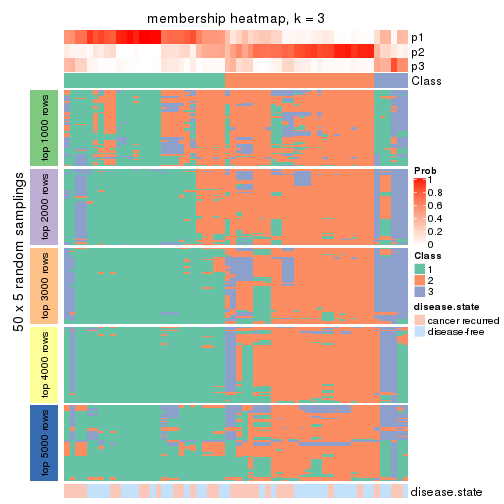</p>

</div>
<div id='tab-CV-hclust-membership-heatmap-3'>
<pre><code class="r">membership_heatmap(res, k = 4)
</code></pre>

<p></p>

</div>
<div id='tab-CV-hclust-membership-heatmap-4'>
<pre><code class="r">membership_heatmap(res, k = 5)
</code></pre>

<p></p>

</div>
<div id='tab-CV-hclust-membership-heatmap-5'>
<pre><code class="r">membership_heatmap(res, k = 6)
</code></pre>

<p>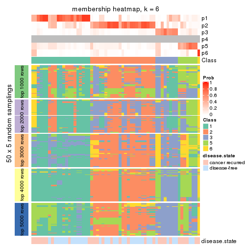</p>

</div>
</div>

As soon as we have had the classes for columns, we can look for signatures
which are significantly different between classes which can be candidate marks
for certain classes. Following are the heatmaps for signatures.


Signature heatmaps where rows are scaled:


<script>
$( function() {
	$( '#tabs-CV-hclust-get-signatures' ).tabs();
} );
</script>
<div id='tabs-CV-hclust-get-signatures'>
<ul>
<li><a href='#tab-CV-hclust-get-signatures-1'>k = 2</a></li>
<li><a href='#tab-CV-hclust-get-signatures-2'>k = 3</a></li>
<li><a href='#tab-CV-hclust-get-signatures-3'>k = 4</a></li>
<li><a href='#tab-CV-hclust-get-signatures-4'>k = 5</a></li>
<li><a href='#tab-CV-hclust-get-signatures-5'>k = 6</a></li>
</ul>
<div id='tab-CV-hclust-get-signatures-1'>
<pre><code class="r">get_signatures(res, k = 2)
</code></pre>

<p></p>

</div>
<div id='tab-CV-hclust-get-signatures-2'>
<pre><code class="r">get_signatures(res, k = 3)
</code></pre>

<p></p>

</div>
<div id='tab-CV-hclust-get-signatures-3'>
<pre><code class="r">get_signatures(res, k = 4)
</code></pre>

<p></p>

</div>
<div id='tab-CV-hclust-get-signatures-4'>
<pre><code class="r">get_signatures(res, k = 5)
</code></pre>

<p></p>

</div>
<div id='tab-CV-hclust-get-signatures-5'>
<pre><code class="r">get_signatures(res, k = 6)
</code></pre>

<p></p>

</div>
</div>


Signature heatmaps where rows are not scaled:


<script>
$( function() {
	$( '#tabs-CV-hclust-get-signatures-no-scale' ).tabs();
} );
</script>
<div id='tabs-CV-hclust-get-signatures-no-scale'>
<ul>
<li><a href='#tab-CV-hclust-get-signatures-no-scale-1'>k = 2</a></li>
<li><a href='#tab-CV-hclust-get-signatures-no-scale-2'>k = 3</a></li>
<li><a href='#tab-CV-hclust-get-signatures-no-scale-3'>k = 4</a></li>
<li><a href='#tab-CV-hclust-get-signatures-no-scale-4'>k = 5</a></li>
<li><a href='#tab-CV-hclust-get-signatures-no-scale-5'>k = 6</a></li>
</ul>
<div id='tab-CV-hclust-get-signatures-no-scale-1'>
<pre><code class="r">get_signatures(res, k = 2, scale_rows = FALSE)
</code></pre>

<p></p>

</div>
<div id='tab-CV-hclust-get-signatures-no-scale-2'>
<pre><code class="r">get_signatures(res, k = 3, scale_rows = FALSE)
</code></pre>

<p></p>

</div>
<div id='tab-CV-hclust-get-signatures-no-scale-3'>
<pre><code class="r">get_signatures(res, k = 4, scale_rows = FALSE)
</code></pre>

<p></p>

</div>
<div id='tab-CV-hclust-get-signatures-no-scale-4'>
<pre><code class="r">get_signatures(res, k = 5, scale_rows = FALSE)
</code></pre>

<p></p>

</div>
<div id='tab-CV-hclust-get-signatures-no-scale-5'>
<pre><code class="r">get_signatures(res, k = 6, scale_rows = FALSE)
</code></pre>

<p></p>

</div>
</div>


Compare the overlap of signatures from different k:

```r
compare_signatures(res)
```


`get_signature()` returns a data frame invisibly. TO get the list of signatures, the function
call should be assigned to a variable explicitly. In following code, if `plot` argument is set
to `FALSE`, no heatmap is plotted while only the differential analysis is performed.

```r
# code only for demonstration
tb = get_signature(res, k = ..., plot = FALSE)
```

An example of the output of `tb` is:

```
#>   which_row         fdr    mean_1    mean_2 scaled_mean_1 scaled_mean_2 km
#> 1        38 0.042760348  8.373488  9.131774    -0.5533452     0.5164555  1
#> 2        40 0.018707592  7.106213  8.469186    -0.6173731     0.5762149  1
#> 3        55 0.019134737 10.221463 11.207825    -0.6159697     0.5749050  1
#> 4        59 0.006059896  5.921854  7.869574    -0.6899429     0.6439467  1
#> 5        60 0.018055526  8.928898 10.211722    -0.6204761     0.5791110  1
#> 6        98 0.009384629 15.714769 14.887706     0.6635654    -0.6193277  2
...
```

The columns in `tb` are:

1. `which_row`: row indices corresponding to the input matrix.
2. `fdr`: FDR for the differential test. 
3. `mean_x`: The mean value in group x.
4. `scaled_mean_x`: The mean value in group x after rows are scaled.
5. `km`: Row groups if k-means clustering is applied to rows.


UMAP plot which shows how samples are separated.


<script>
$( function() {
	$( '#tabs-CV-hclust-dimension-reduction' ).tabs();
} );
</script>
<div id='tabs-CV-hclust-dimension-reduction'>
<ul>
<li><a href='#tab-CV-hclust-dimension-reduction-1'>k = 2</a></li>
<li><a href='#tab-CV-hclust-dimension-reduction-2'>k = 3</a></li>
<li><a href='#tab-CV-hclust-dimension-reduction-3'>k = 4</a></li>
<li><a href='#tab-CV-hclust-dimension-reduction-4'>k = 5</a></li>
<li><a href='#tab-CV-hclust-dimension-reduction-5'>k = 6</a></li>
</ul>
<div id='tab-CV-hclust-dimension-reduction-1'>
<pre><code class="r">dimension_reduction(res, k = 2, method = &quot;UMAP&quot;)
</code></pre>

<p></p>

</div>
<div id='tab-CV-hclust-dimension-reduction-2'>
<pre><code class="r">dimension_reduction(res, k = 3, method = &quot;UMAP&quot;)
</code></pre>

<p></p>

</div>
<div id='tab-CV-hclust-dimension-reduction-3'>
<pre><code class="r">dimension_reduction(res, k = 4, method = &quot;UMAP&quot;)
</code></pre>

<p></p>

</div>
<div id='tab-CV-hclust-dimension-reduction-4'>
<pre><code class="r">dimension_reduction(res, k = 5, method = &quot;UMAP&quot;)
</code></pre>

<p></p>

</div>
<div id='tab-CV-hclust-dimension-reduction-5'>
<pre><code class="r">dimension_reduction(res, k = 6, method = &quot;UMAP&quot;)
</code></pre>

<p></p>

</div>
</div>


Following heatmap shows how subgroups are split when increasing `k`:

```r
collect_classes(res)
```


Test correlation between subgroups and known annotations. If the known
annotation is numeric, one-way ANOVA test is applied, and if the known
annotation is discrete, chi-squared contingency table test is applied.

```r
test_to_known_factors(res)
```

```
#>            n disease.state(p) k
#> CV:hclust 48            0.591 2
#> CV:hclust 39            0.468 3
#> CV:hclust 37            0.275 4
#> CV:hclust 36            0.953 5
#> CV:hclust 29            0.257 6
```


If matrix rows can be associated to genes, consider to use `GO_Enrichment(res,
...)` to perform function enrichment for the signature genes.


 

---------------------------------------------------


### CV:kmeans


The object with results only for a single top-value method and a single partition method 
can be extracted as:

```r
res = res_list["CV", "kmeans"]
# you can also extract it by
# res = res_list["CV:kmeans"]
```

A summary of `res` and all the functions that can be applied to it:

```r
res
```

```
#> A 'ConsensusPartition' object with k = 2, 3, 4, 5, 6.
#>   On a matrix with 21446 rows and 60 columns.
#>   Top rows (1000, 2000, 3000, 4000, 5000) are extracted by 'CV' method.
#>   Subgroups are detected by 'kmeans' method.
#>   Performed in total 1250 partitions by row resampling.
#>   Best k for subgroups seems to be 2.
#> 
#> Following methods can be applied to this 'ConsensusPartition' object:
#>  [1] "cola_report"             "collect_classes"         "collect_plots"          
#>  [4] "collect_stats"           "colnames"                "compare_signatures"     
#>  [7] "consensus_heatmap"       "dimension_reduction"     "functional_enrichment"  
#> [10] "get_anno_col"            "get_anno"                "get_classes"            
#> [13] "get_consensus"           "get_matrix"              "get_membership"         
#> [16] "get_param"               "get_signatures"          "get_stats"              
#> [19] "is_best_k"               "is_stable_k"             "membership_heatmap"     
#> [22] "ncol"                    "nrow"                    "plot_ecdf"              
#> [25] "rownames"                "select_partition_number" "show"                   
#> [28] "suggest_best_k"          "test_to_known_factors"
```

`collect_plots()` function collects all the plots made from `res` for all `k` (number of partitions)
into one single page to provide an easy and fast comparison between different `k`.

```r
collect_plots(res)
```


The plots are:

- The first row: a plot of the ECDF (Empirical cumulative distribution
  function) curves of the consensus matrix for each `k` and the heatmap of
  predicted classes for each `k`.
- The second row: heatmaps of the consensus matrix for each `k`.
- The third row: heatmaps of the membership matrix for each `k`.
- The fouth row: heatmaps of the signatures for each `k`.

All the plots in panels can be made by individual functions and they are
plotted later in this section.

`select_partition_number()` produces several plots showing different
statistics for choosing "optimized" `k`. There are following statistics:

- ECDF curves of the consensus matrix for each `k`;
- 1-PAC. [The PAC
  score](https://en.wikipedia.org/wiki/Consensus_clustering#Over-interpretation_potential_of_consensus_clustering)
  measures the proportion of the ambiguous subgrouping.
- Mean silhouette score.
- Concordance. The mean probability of fiting the consensus class ids in all
  partitions.
- Area increased. Denote $A_k$ as the area under the ECDF curve for current
  `k`, the area increased is defined as $A_k - A_{k-1}$.
- Rand index. The percent of pairs of samples that are both in a same cluster
  or both are not in a same cluster in the partition of k and k-1.
- Jaccard index. The ratio of pairs of samples are both in a same cluster in
  the partition of k and k-1 and the pairs of samples are both in a same
  cluster in the partition k or k-1.

The detailed explanations of these statistics can be found in [the cola
vignette](http://bioconductor.org/packages/devel/bioc/vignettes/cola/inst/doc/cola.html#toc_13).

Generally speaking, lower PAC score, higher mean silhouette score or higher
concordance corresponds to better partition. Rand index and Jaccard index
measure how similar the current partition is compared to partition with `k-1`.
If they are too similar, we won't accept `k` is better than `k-1`.

```r
select_partition_number(res)
```


The numeric values for all these statistics can be obtained by `get_stats()`.

```r
get_stats(res)
```

```
#>   k 1-PAC mean_silhouette concordance area_increased  Rand Jaccard
#> 2 2 0.447           0.743       0.877         0.5038 0.492   0.492
#> 3 3 0.317           0.507       0.742         0.3001 0.841   0.686
#> 4 4 0.393           0.492       0.681         0.1220 0.831   0.570
#> 5 5 0.496           0.510       0.677         0.0649 0.923   0.716
#> 6 6 0.551           0.423       0.640         0.0468 0.960   0.817
```

`suggest_best_k()` suggests the best $k$ based on these statistics. The rules are as follows:

- All $k$ with Jaccard index larger than 0.95 are removed because the increase of
  the partition number does not provides enough extra information. If all $k$ are removed,
  the best $k$ is assigned by `NA`.
- For $k$ with 1-PAC larger than 0.9, the maximal $k$ is taken as the "best k". Other $k$ is called "optional k".
- If it does not fit the second rule. The $k$ with the highest vote of highest
  1-PAC, mean silhouette and concordance is taken as the "best k".

```r
suggest_best_k(res)
```

```
#> [1] 2
```


Following shows the table of the partitions (You need to click the **show/hide
code output** link to see it). The membership matrix (columns with name `p*`)
is inferred by
[`clue::cl_consensus()`](https://www.rdocumentation.org/link/cl_consensus?package=clue)
function with the `SE` method. Basically the value in the membership matrix
represents the probability to belong to a certain group. The finall class
label for an item is determined with the group with highest probability it
belongs to.

In `get_classes()` function, the entropy is calculated from the membership
matrix and the silhouette score is calculated from the consensus matrix.


<script>
$( function() {
	$( '#tabs-CV-kmeans-get-classes' ).tabs();
} );
</script>
<div id='tabs-CV-kmeans-get-classes'>
<ul>
<li><a href='#tab-CV-kmeans-get-classes-1'>k = 2</a></li>
<li><a href='#tab-CV-kmeans-get-classes-2'>k = 3</a></li>
<li><a href='#tab-CV-kmeans-get-classes-3'>k = 4</a></li>
<li><a href='#tab-CV-kmeans-get-classes-4'>k = 5</a></li>
<li><a href='#tab-CV-kmeans-get-classes-5'>k = 6</a></li>
</ul>

<div id='tab-CV-kmeans-get-classes-1'>
<p><a id='tab-CV-kmeans-get-classes-1-a' style='color:#0366d6' href='#'>show/hide code output</a></p>
<pre><code class="r">cbind(get_classes(res, k = 2), get_membership(res, k = 2))
</code></pre>

<pre><code>#&gt;          class entropy silhouette    p1    p2
#&gt; GSM22453     1  0.1414      0.866 0.980 0.020
#&gt; GSM22458     2  0.0376      0.832 0.004 0.996
#&gt; GSM22465     1  0.1633      0.866 0.976 0.024
#&gt; GSM22466     1  0.2043      0.864 0.968 0.032
#&gt; GSM22468     2  0.0938      0.832 0.012 0.988
#&gt; GSM22469     1  0.3584      0.850 0.932 0.068
#&gt; GSM22471     1  0.9775      0.389 0.588 0.412
#&gt; GSM22472     2  0.2043      0.829 0.032 0.968
#&gt; GSM22474     2  0.0000      0.831 0.000 1.000
#&gt; GSM22476     1  0.7139      0.760 0.804 0.196
#&gt; GSM22477     2  0.2043      0.829 0.032 0.968
#&gt; GSM22478     2  0.6048      0.761 0.148 0.852
#&gt; GSM22481     1  0.9460      0.510 0.636 0.364
#&gt; GSM22484     2  0.5294      0.784 0.120 0.880
#&gt; GSM22485     2  0.8267      0.652 0.260 0.740
#&gt; GSM22487     2  0.2778      0.826 0.048 0.952
#&gt; GSM22488     2  0.8267      0.652 0.260 0.740
#&gt; GSM22489     2  0.9775      0.410 0.412 0.588
#&gt; GSM22490     2  0.0376      0.832 0.004 0.996
#&gt; GSM22492     2  0.9427      0.352 0.360 0.640
#&gt; GSM22493     2  0.8327      0.652 0.264 0.736
#&gt; GSM22494     1  0.1633      0.866 0.976 0.024
#&gt; GSM22497     1  0.1843      0.865 0.972 0.028
#&gt; GSM22498     1  0.5294      0.803 0.880 0.120
#&gt; GSM22501     1  0.4161      0.832 0.916 0.084
#&gt; GSM22502     2  0.0672      0.832 0.008 0.992
#&gt; GSM22503     2  0.9775      0.176 0.412 0.588
#&gt; GSM22504     2  0.2043      0.829 0.032 0.968
#&gt; GSM22505     1  0.1843      0.864 0.972 0.028
#&gt; GSM22506     1  0.4298      0.792 0.912 0.088
#&gt; GSM22507     1  0.8267      0.656 0.740 0.260
#&gt; GSM22508     2  0.0376      0.832 0.004 0.996
#&gt; GSM22449     2  0.8327      0.650 0.264 0.736
#&gt; GSM22450     1  0.0000      0.865 1.000 0.000
#&gt; GSM22451     1  0.0000      0.865 1.000 0.000
#&gt; GSM22452     1  0.1633      0.864 0.976 0.024
#&gt; GSM22454     1  0.1843      0.865 0.972 0.028
#&gt; GSM22455     2  0.3431      0.823 0.064 0.936
#&gt; GSM22456     2  0.0938      0.832 0.012 0.988
#&gt; GSM22457     1  0.9833      0.383 0.576 0.424
#&gt; GSM22459     2  0.4562      0.800 0.096 0.904
#&gt; GSM22460     2  0.9833      0.409 0.424 0.576
#&gt; GSM22461     2  0.2043      0.829 0.032 0.968
#&gt; GSM22462     1  0.0000      0.865 1.000 0.000
#&gt; GSM22463     1  0.0376      0.864 0.996 0.004
#&gt; GSM22464     2  0.0376      0.832 0.004 0.996
#&gt; GSM22467     1  0.0376      0.865 0.996 0.004
#&gt; GSM22470     1  0.0376      0.864 0.996 0.004
#&gt; GSM22473     2  0.0376      0.831 0.004 0.996
#&gt; GSM22475     1  0.8267      0.647 0.740 0.260
#&gt; GSM22479     2  0.8327      0.549 0.264 0.736
#&gt; GSM22480     2  0.8207      0.701 0.256 0.744
#&gt; GSM22482     1  0.4161      0.832 0.916 0.084
#&gt; GSM22483     1  0.8327      0.638 0.736 0.264
#&gt; GSM22486     1  0.0376      0.864 0.996 0.004
#&gt; GSM22491     1  0.0000      0.865 1.000 0.000
#&gt; GSM22495     2  0.8443      0.539 0.272 0.728
#&gt; GSM22496     1  0.0376      0.865 0.996 0.004
#&gt; GSM22499     1  0.9661      0.401 0.608 0.392
#&gt; GSM22500     2  0.0672      0.832 0.008 0.992
</code></pre>

<script>
$('#tab-CV-kmeans-get-classes-1-a').parent().next().next().hide();
$('#tab-CV-kmeans-get-classes-1-a').click(function(){
  $('#tab-CV-kmeans-get-classes-1-a').parent().next().next().toggle();
  return(false);
});
</script>
</div>

<div id='tab-CV-kmeans-get-classes-2'>
<p><a id='tab-CV-kmeans-get-classes-2-a' style='color:#0366d6' href='#'>show/hide code output</a></p>
<pre><code class="r">cbind(get_classes(res, k = 3), get_membership(res, k = 3))
</code></pre>

<pre><code>#&gt;          class entropy silhouette    p1    p2    p3
#&gt; GSM22453     1  0.0000     0.7384 1.000 0.000 0.000
#&gt; GSM22458     2  0.4136     0.6308 0.020 0.864 0.116
#&gt; GSM22465     1  0.1015     0.7404 0.980 0.012 0.008
#&gt; GSM22466     1  0.0892     0.7351 0.980 0.000 0.020
#&gt; GSM22468     2  0.1860     0.6583 0.000 0.948 0.052
#&gt; GSM22469     1  0.2031     0.7285 0.952 0.032 0.016
#&gt; GSM22471     1  0.9641    -0.1521 0.432 0.356 0.212
#&gt; GSM22472     2  0.3619     0.6348 0.000 0.864 0.136
#&gt; GSM22474     2  0.4136     0.6398 0.020 0.864 0.116
#&gt; GSM22476     3  0.7633     0.5910 0.200 0.120 0.680
#&gt; GSM22477     2  0.3816     0.6297 0.000 0.852 0.148
#&gt; GSM22478     2  0.6252     0.5185 0.024 0.708 0.268
#&gt; GSM22481     1  0.6488     0.4694 0.744 0.192 0.064
#&gt; GSM22484     2  0.5965     0.5959 0.100 0.792 0.108
#&gt; GSM22485     2  0.8445     0.3794 0.304 0.580 0.116
#&gt; GSM22487     2  0.4642     0.6345 0.060 0.856 0.084
#&gt; GSM22488     2  0.8445     0.3794 0.304 0.580 0.116
#&gt; GSM22489     3  0.7596     0.4210 0.100 0.228 0.672
#&gt; GSM22490     2  0.2066     0.6566 0.000 0.940 0.060
#&gt; GSM22492     2  0.9177     0.0272 0.148 0.452 0.400
#&gt; GSM22493     2  0.8567     0.3809 0.296 0.576 0.128
#&gt; GSM22494     1  0.3120     0.7253 0.908 0.012 0.080
#&gt; GSM22497     1  0.1031     0.7350 0.976 0.000 0.024
#&gt; GSM22498     1  0.2297     0.7257 0.944 0.020 0.036
#&gt; GSM22501     3  0.7624     0.4485 0.392 0.048 0.560
#&gt; GSM22502     2  0.3412     0.6395 0.000 0.876 0.124
#&gt; GSM22503     2  0.9713    -0.0637 0.316 0.444 0.240
#&gt; GSM22504     2  0.3752     0.6305 0.000 0.856 0.144
#&gt; GSM22505     1  0.1163     0.7335 0.972 0.000 0.028
#&gt; GSM22506     1  0.7778     0.3943 0.644 0.092 0.264
#&gt; GSM22507     1  0.6336     0.4825 0.756 0.180 0.064
#&gt; GSM22508     2  0.2590     0.6523 0.004 0.924 0.072
#&gt; GSM22449     2  0.8314     0.3231 0.092 0.556 0.352
#&gt; GSM22450     1  0.2625     0.7229 0.916 0.000 0.084
#&gt; GSM22451     1  0.6451     0.3137 0.608 0.008 0.384
#&gt; GSM22452     1  0.3116     0.6774 0.892 0.000 0.108
#&gt; GSM22454     1  0.1711     0.7350 0.960 0.032 0.008
#&gt; GSM22455     2  0.5926     0.5141 0.000 0.644 0.356
#&gt; GSM22456     2  0.4062     0.6293 0.000 0.836 0.164
#&gt; GSM22457     1  0.9767    -0.1608 0.428 0.328 0.244
#&gt; GSM22459     3  0.4345     0.5055 0.016 0.136 0.848
#&gt; GSM22460     2  0.9991     0.0645 0.332 0.352 0.316
#&gt; GSM22461     2  0.3816     0.6319 0.000 0.852 0.148
#&gt; GSM22462     1  0.3267     0.7007 0.884 0.000 0.116
#&gt; GSM22463     3  0.5406     0.5280 0.224 0.012 0.764
#&gt; GSM22464     2  0.3941     0.6413 0.000 0.844 0.156
#&gt; GSM22467     1  0.2066     0.7325 0.940 0.000 0.060
#&gt; GSM22470     3  0.5623     0.4902 0.280 0.004 0.716
#&gt; GSM22473     2  0.6410     0.3375 0.004 0.576 0.420
#&gt; GSM22475     3  0.6375     0.5252 0.244 0.036 0.720
#&gt; GSM22479     2  0.8464     0.2879 0.132 0.596 0.272
#&gt; GSM22480     2  0.9565     0.3014 0.228 0.476 0.296
#&gt; GSM22482     3  0.7671     0.4241 0.408 0.048 0.544
#&gt; GSM22483     3  0.9968     0.2342 0.300 0.332 0.368
#&gt; GSM22486     1  0.5431     0.5038 0.716 0.000 0.284
#&gt; GSM22491     1  0.2796     0.7194 0.908 0.000 0.092
#&gt; GSM22495     3  0.7124     0.4641 0.088 0.204 0.708
#&gt; GSM22496     1  0.5578     0.5548 0.748 0.012 0.240
#&gt; GSM22499     3  0.9858     0.2109 0.256 0.348 0.396
#&gt; GSM22500     2  0.2860     0.6448 0.004 0.912 0.084
</code></pre>

<script>
$('#tab-CV-kmeans-get-classes-2-a').parent().next().next().hide();
$('#tab-CV-kmeans-get-classes-2-a').click(function(){
  $('#tab-CV-kmeans-get-classes-2-a').parent().next().next().toggle();
  return(false);
});
</script>
</div>

<div id='tab-CV-kmeans-get-classes-3'>
<p><a id='tab-CV-kmeans-get-classes-3-a' style='color:#0366d6' href='#'>show/hide code output</a></p>
<pre><code class="r">cbind(get_classes(res, k = 4), get_membership(res, k = 4))
</code></pre>

<pre><code>#&gt;          class entropy silhouette    p1    p2    p3    p4
#&gt; GSM22453     1  0.0188     0.8006 0.996 0.000 0.000 0.004
#&gt; GSM22458     4  0.5954     0.3928 0.016 0.312 0.032 0.640
#&gt; GSM22465     1  0.1798     0.7962 0.944 0.040 0.000 0.016
#&gt; GSM22466     1  0.1297     0.7976 0.964 0.000 0.016 0.020
#&gt; GSM22468     2  0.5506    -0.0217 0.000 0.512 0.016 0.472
#&gt; GSM22469     1  0.1452     0.7962 0.956 0.000 0.008 0.036
#&gt; GSM22471     4  0.7523     0.3531 0.236 0.048 0.116 0.600
#&gt; GSM22472     4  0.6621     0.2272 0.000 0.408 0.084 0.508
#&gt; GSM22474     4  0.5407     0.3612 0.016 0.268 0.020 0.696
#&gt; GSM22476     3  0.6586     0.6734 0.080 0.036 0.676 0.208
#&gt; GSM22477     4  0.6727     0.1972 0.000 0.412 0.092 0.496
#&gt; GSM22478     4  0.7002     0.1889 0.000 0.268 0.164 0.568
#&gt; GSM22481     1  0.5543     0.5196 0.688 0.036 0.008 0.268
#&gt; GSM22484     2  0.5728     0.5530 0.116 0.752 0.024 0.108
#&gt; GSM22485     2  0.5751     0.5490 0.224 0.712 0.032 0.032
#&gt; GSM22487     4  0.6527     0.2838 0.076 0.348 0.004 0.572
#&gt; GSM22488     2  0.5816     0.5443 0.232 0.704 0.032 0.032
#&gt; GSM22489     3  0.5356     0.5882 0.000 0.200 0.728 0.072
#&gt; GSM22490     2  0.5636    -0.1372 0.000 0.552 0.024 0.424
#&gt; GSM22492     4  0.6184     0.4158 0.060 0.056 0.160 0.724
#&gt; GSM22493     2  0.5700     0.5548 0.208 0.724 0.032 0.036
#&gt; GSM22494     1  0.2125     0.7917 0.932 0.052 0.004 0.012
#&gt; GSM22497     1  0.0779     0.7995 0.980 0.000 0.016 0.004
#&gt; GSM22498     1  0.4540     0.7182 0.816 0.072 0.008 0.104
#&gt; GSM22501     3  0.7033     0.6604 0.132 0.028 0.640 0.200
#&gt; GSM22502     4  0.5313     0.3418 0.000 0.376 0.016 0.608
#&gt; GSM22503     4  0.6892     0.4067 0.164 0.044 0.120 0.672
#&gt; GSM22504     4  0.6627     0.2222 0.000 0.412 0.084 0.504
#&gt; GSM22505     1  0.3869     0.7495 0.856 0.020 0.096 0.028
#&gt; GSM22506     1  0.8815     0.1323 0.480 0.264 0.160 0.096
#&gt; GSM22507     1  0.6028     0.5172 0.668 0.056 0.012 0.264
#&gt; GSM22508     4  0.5828     0.3754 0.016 0.344 0.020 0.620
#&gt; GSM22449     2  0.5461     0.5090 0.028 0.756 0.168 0.048
#&gt; GSM22450     1  0.2125     0.7914 0.920 0.000 0.076 0.004
#&gt; GSM22451     1  0.7377     0.4232 0.560 0.076 0.320 0.044
#&gt; GSM22452     1  0.3931     0.7474 0.856 0.064 0.068 0.012
#&gt; GSM22454     1  0.0707     0.7998 0.980 0.000 0.000 0.020
#&gt; GSM22455     2  0.6742     0.4320 0.000 0.608 0.160 0.232
#&gt; GSM22456     2  0.5132     0.4885 0.000 0.748 0.068 0.184
#&gt; GSM22457     4  0.7963     0.3208 0.208 0.076 0.132 0.584
#&gt; GSM22459     3  0.5548     0.6049 0.004 0.112 0.740 0.144
#&gt; GSM22460     2  0.8901     0.3521 0.248 0.448 0.232 0.072
#&gt; GSM22461     4  0.6709     0.2230 0.000 0.400 0.092 0.508
#&gt; GSM22462     1  0.3105     0.7611 0.856 0.000 0.140 0.004
#&gt; GSM22463     3  0.5165     0.6218 0.064 0.112 0.792 0.032
#&gt; GSM22464     2  0.4888     0.4554 0.000 0.740 0.036 0.224
#&gt; GSM22467     1  0.2125     0.7933 0.920 0.000 0.076 0.004
#&gt; GSM22470     3  0.3583     0.6720 0.092 0.040 0.864 0.004
#&gt; GSM22473     2  0.7717     0.0134 0.000 0.424 0.344 0.232
#&gt; GSM22475     3  0.6096     0.6224 0.120 0.024 0.724 0.132
#&gt; GSM22479     4  0.6664     0.4319 0.092 0.108 0.092 0.708
#&gt; GSM22480     2  0.8342     0.4314 0.080 0.532 0.136 0.252
#&gt; GSM22482     3  0.7294     0.6342 0.184 0.020 0.604 0.192
#&gt; GSM22483     4  0.9687     0.1315 0.240 0.140 0.292 0.328
#&gt; GSM22486     1  0.6795     0.5388 0.612 0.056 0.296 0.036
#&gt; GSM22491     1  0.2234     0.7912 0.924 0.008 0.064 0.004
#&gt; GSM22495     3  0.7513     0.5769 0.056 0.092 0.592 0.260
#&gt; GSM22496     1  0.5818     0.6109 0.708 0.024 0.224 0.044
#&gt; GSM22499     4  0.8207     0.2540 0.152 0.048 0.296 0.504
#&gt; GSM22500     4  0.5391     0.3386 0.012 0.380 0.004 0.604
</code></pre>

<script>
$('#tab-CV-kmeans-get-classes-3-a').parent().next().next().hide();
$('#tab-CV-kmeans-get-classes-3-a').click(function(){
  $('#tab-CV-kmeans-get-classes-3-a').parent().next().next().toggle();
  return(false);
});
</script>
</div>

<div id='tab-CV-kmeans-get-classes-4'>
<p><a id='tab-CV-kmeans-get-classes-4-a' style='color:#0366d6' href='#'>show/hide code output</a></p>
<pre><code class="r">cbind(get_classes(res, k = 5), get_membership(res, k = 5))
</code></pre>

<pre><code>#&gt;          class entropy silhouette    p1    p2    p3    p4    p5
#&gt; GSM22453     1  0.1331      0.743 0.952 0.040 0.008 0.000 0.000
#&gt; GSM22458     4  0.5953      0.398 0.000 0.216 0.040 0.652 0.092
#&gt; GSM22465     1  0.2302      0.722 0.904 0.008 0.080 0.008 0.000
#&gt; GSM22466     1  0.2673      0.738 0.892 0.076 0.016 0.000 0.016
#&gt; GSM22468     4  0.6550      0.239 0.000 0.236 0.252 0.508 0.004
#&gt; GSM22469     1  0.2332      0.741 0.904 0.076 0.016 0.004 0.000
#&gt; GSM22471     2  0.5853      0.573 0.128 0.692 0.008 0.140 0.032
#&gt; GSM22472     4  0.0898      0.632 0.000 0.020 0.008 0.972 0.000
#&gt; GSM22474     2  0.6782      0.341 0.000 0.580 0.084 0.240 0.096
#&gt; GSM22476     5  0.3612      0.611 0.000 0.228 0.000 0.008 0.764
#&gt; GSM22477     4  0.1764      0.587 0.000 0.008 0.064 0.928 0.000
#&gt; GSM22478     2  0.7702      0.267 0.032 0.468 0.128 0.324 0.048
#&gt; GSM22481     1  0.5176      0.218 0.560 0.400 0.004 0.036 0.000
#&gt; GSM22484     3  0.6164      0.562 0.084 0.020 0.648 0.224 0.024
#&gt; GSM22485     3  0.5834      0.621 0.192 0.020 0.656 0.132 0.000
#&gt; GSM22487     2  0.7562      0.255 0.048 0.400 0.236 0.316 0.000
#&gt; GSM22488     3  0.5824      0.620 0.196 0.020 0.656 0.128 0.000
#&gt; GSM22489     5  0.5263      0.567 0.000 0.052 0.208 0.036 0.704
#&gt; GSM22490     4  0.5799      0.504 0.000 0.144 0.184 0.656 0.016
#&gt; GSM22492     2  0.4772      0.597 0.016 0.760 0.008 0.160 0.056
#&gt; GSM22493     3  0.5803      0.621 0.188 0.020 0.660 0.132 0.000
#&gt; GSM22494     1  0.2361      0.713 0.892 0.000 0.096 0.012 0.000
#&gt; GSM22497     1  0.2313      0.741 0.916 0.040 0.012 0.000 0.032
#&gt; GSM22498     1  0.5359      0.468 0.616 0.304 0.080 0.000 0.000
#&gt; GSM22501     5  0.4190      0.599 0.016 0.220 0.008 0.004 0.752
#&gt; GSM22502     4  0.5352      0.459 0.000 0.220 0.096 0.676 0.008
#&gt; GSM22503     2  0.3961      0.620 0.052 0.808 0.004 0.132 0.004
#&gt; GSM22504     4  0.0898      0.632 0.000 0.020 0.008 0.972 0.000
#&gt; GSM22505     1  0.4953      0.685 0.760 0.092 0.108 0.000 0.040
#&gt; GSM22506     1  0.7870     -0.069 0.448 0.012 0.240 0.240 0.060
#&gt; GSM22507     1  0.5688      0.153 0.496 0.448 0.036 0.016 0.004
#&gt; GSM22508     4  0.6543      0.317 0.000 0.288 0.052 0.568 0.092
#&gt; GSM22449     3  0.4474      0.506 0.008 0.056 0.808 0.048 0.080
#&gt; GSM22450     1  0.0854      0.743 0.976 0.004 0.012 0.000 0.008
#&gt; GSM22451     1  0.8770      0.232 0.460 0.076 0.156 0.120 0.188
#&gt; GSM22452     1  0.5076      0.621 0.744 0.032 0.132 0.000 0.092
#&gt; GSM22454     1  0.2605      0.741 0.896 0.056 0.044 0.004 0.000
#&gt; GSM22455     3  0.6787      0.402 0.000 0.080 0.500 0.356 0.064
#&gt; GSM22456     3  0.6470      0.470 0.000 0.084 0.596 0.256 0.064
#&gt; GSM22457     2  0.4731      0.610 0.080 0.796 0.032 0.072 0.020
#&gt; GSM22459     5  0.6878      0.572 0.016 0.140 0.064 0.160 0.620
#&gt; GSM22460     3  0.8553      0.405 0.200 0.012 0.396 0.224 0.168
#&gt; GSM22461     4  0.1059      0.631 0.000 0.020 0.008 0.968 0.004
#&gt; GSM22462     1  0.3270      0.704 0.864 0.020 0.036 0.000 0.080
#&gt; GSM22463     5  0.7097      0.529 0.056 0.060 0.208 0.068 0.608
#&gt; GSM22464     3  0.5555      0.405 0.000 0.260 0.640 0.092 0.008
#&gt; GSM22467     1  0.1095      0.744 0.968 0.008 0.012 0.000 0.012
#&gt; GSM22470     5  0.6834      0.583 0.060 0.116 0.136 0.040 0.648
#&gt; GSM22473     5  0.8023      0.190 0.000 0.200 0.272 0.116 0.412
#&gt; GSM22475     5  0.6941      0.520 0.108 0.272 0.024 0.032 0.564
#&gt; GSM22479     2  0.4269      0.577 0.004 0.804 0.020 0.116 0.056
#&gt; GSM22480     3  0.8375      0.472 0.128 0.112 0.412 0.316 0.032
#&gt; GSM22482     5  0.4423      0.596 0.028 0.216 0.008 0.004 0.744
#&gt; GSM22483     4  0.8106      0.027 0.264 0.140 0.016 0.460 0.120
#&gt; GSM22486     1  0.7334      0.439 0.544 0.156 0.188 0.000 0.112
#&gt; GSM22491     1  0.1251      0.738 0.956 0.000 0.036 0.000 0.008
#&gt; GSM22495     5  0.5380      0.428 0.000 0.464 0.044 0.004 0.488
#&gt; GSM22496     1  0.6676      0.514 0.664 0.032 0.080 0.112 0.112
#&gt; GSM22499     2  0.7190      0.489 0.144 0.600 0.016 0.140 0.100
#&gt; GSM22500     2  0.6788      0.237 0.004 0.420 0.232 0.344 0.000
</code></pre>

<script>
$('#tab-CV-kmeans-get-classes-4-a').parent().next().next().hide();
$('#tab-CV-kmeans-get-classes-4-a').click(function(){
  $('#tab-CV-kmeans-get-classes-4-a').parent().next().next().toggle();
  return(false);
});
</script>
</div>

<div id='tab-CV-kmeans-get-classes-5'>
<p><a id='tab-CV-kmeans-get-classes-5-a' style='color:#0366d6' href='#'>show/hide code output</a></p>
<pre><code class="r">cbind(get_classes(res, k = 6), get_membership(res, k = 6))
</code></pre>

<pre><code>#&gt;          class entropy silhouette    p1    p2    p3    p4    p5    p6
#&gt; GSM22453     1  0.0777    0.71811 0.972 0.024 0.004 0.000 0.000 0.000
#&gt; GSM22458     4  0.5445    0.49124 0.000 0.200 0.036 0.656 0.004 0.104
#&gt; GSM22465     1  0.2122    0.70328 0.900 0.008 0.084 0.000 0.000 0.008
#&gt; GSM22466     1  0.2948    0.70849 0.868 0.056 0.004 0.012 0.000 0.060
#&gt; GSM22468     4  0.7604    0.00576 0.000 0.208 0.328 0.360 0.036 0.068
#&gt; GSM22469     1  0.2964    0.70005 0.852 0.108 0.004 0.000 0.004 0.032
#&gt; GSM22471     2  0.4446    0.62019 0.088 0.784 0.000 0.068 0.036 0.024
#&gt; GSM22472     4  0.1232    0.61560 0.000 0.016 0.024 0.956 0.004 0.000
#&gt; GSM22474     2  0.6478    0.36362 0.000 0.604 0.096 0.112 0.024 0.164
#&gt; GSM22476     5  0.5670   -0.81120 0.004 0.136 0.000 0.000 0.468 0.392
#&gt; GSM22477     4  0.3691    0.54815 0.000 0.008 0.096 0.820 0.016 0.060
#&gt; GSM22478     2  0.7475    0.36583 0.020 0.536 0.072 0.204 0.100 0.068
#&gt; GSM22481     1  0.5138   -0.05199 0.496 0.452 0.012 0.004 0.008 0.028
#&gt; GSM22484     3  0.7398    0.43962 0.044 0.040 0.548 0.140 0.048 0.180
#&gt; GSM22485     3  0.3316    0.58405 0.164 0.004 0.804 0.028 0.000 0.000
#&gt; GSM22487     2  0.7250    0.40735 0.056 0.516 0.184 0.192 0.004 0.048
#&gt; GSM22488     3  0.3601    0.58334 0.168 0.004 0.792 0.028 0.000 0.008
#&gt; GSM22489     5  0.5063    0.17243 0.000 0.008 0.092 0.004 0.648 0.248
#&gt; GSM22490     4  0.6841    0.50431 0.000 0.140 0.188 0.564 0.044 0.064
#&gt; GSM22492     2  0.4263    0.58580 0.004 0.788 0.004 0.048 0.108 0.048
#&gt; GSM22493     3  0.3456    0.58462 0.164 0.004 0.800 0.028 0.000 0.004
#&gt; GSM22494     1  0.2454    0.69670 0.876 0.004 0.104 0.000 0.000 0.016
#&gt; GSM22497     1  0.2144    0.71505 0.908 0.008 0.012 0.004 0.000 0.068
#&gt; GSM22498     1  0.5891    0.11915 0.492 0.392 0.084 0.012 0.000 0.020
#&gt; GSM22501     6  0.6133    0.96337 0.028 0.104 0.008 0.000 0.408 0.452
#&gt; GSM22502     4  0.6517    0.48728 0.000 0.212 0.088 0.592 0.048 0.060
#&gt; GSM22503     2  0.2663    0.64203 0.048 0.892 0.000 0.032 0.016 0.012
#&gt; GSM22504     4  0.1218    0.61390 0.000 0.012 0.028 0.956 0.004 0.000
#&gt; GSM22505     1  0.4968    0.65028 0.732 0.056 0.064 0.012 0.000 0.136
#&gt; GSM22506     1  0.8011   -0.14510 0.392 0.008 0.260 0.196 0.108 0.036
#&gt; GSM22507     2  0.5984    0.12445 0.384 0.508 0.028 0.012 0.008 0.060
#&gt; GSM22508     4  0.6415    0.38368 0.000 0.292 0.044 0.508 0.004 0.152
#&gt; GSM22449     3  0.4364    0.44056 0.000 0.008 0.732 0.004 0.064 0.192
#&gt; GSM22450     1  0.2776    0.71155 0.884 0.012 0.004 0.004 0.052 0.044
#&gt; GSM22451     5  0.8550    0.08065 0.276 0.024 0.100 0.076 0.364 0.160
#&gt; GSM22452     1  0.5263    0.52698 0.664 0.004 0.196 0.004 0.012 0.120
#&gt; GSM22454     1  0.3601    0.69517 0.824 0.072 0.016 0.000 0.004 0.084
#&gt; GSM22455     3  0.7347    0.38156 0.000 0.036 0.472 0.264 0.092 0.136
#&gt; GSM22456     3  0.7076    0.45639 0.000 0.044 0.556 0.148 0.136 0.116
#&gt; GSM22457     2  0.3038    0.63446 0.044 0.880 0.028 0.008 0.024 0.016
#&gt; GSM22459     5  0.4619    0.19980 0.016 0.072 0.004 0.128 0.760 0.020
#&gt; GSM22460     3  0.8475    0.17255 0.104 0.004 0.316 0.104 0.304 0.168
#&gt; GSM22461     4  0.1425    0.61193 0.000 0.012 0.020 0.952 0.008 0.008
#&gt; GSM22462     1  0.4665    0.64639 0.756 0.012 0.012 0.012 0.128 0.080
#&gt; GSM22463     5  0.5100    0.28526 0.020 0.000 0.088 0.016 0.700 0.176
#&gt; GSM22464     3  0.4574    0.43991 0.000 0.236 0.700 0.020 0.004 0.040
#&gt; GSM22467     1  0.2635    0.71322 0.888 0.012 0.000 0.004 0.048 0.048
#&gt; GSM22470     5  0.4517    0.27651 0.016 0.028 0.044 0.008 0.772 0.132
#&gt; GSM22473     5  0.8280   -0.03876 0.000 0.188 0.240 0.076 0.368 0.128
#&gt; GSM22475     5  0.6413    0.04255 0.040 0.216 0.000 0.020 0.568 0.156
#&gt; GSM22479     2  0.3732    0.59144 0.016 0.836 0.008 0.024 0.040 0.076
#&gt; GSM22480     3  0.8722    0.39596 0.092 0.128 0.416 0.212 0.096 0.056
#&gt; GSM22482     6  0.6139    0.96356 0.040 0.096 0.004 0.000 0.404 0.456
#&gt; GSM22483     4  0.7936    0.04447 0.148 0.152 0.000 0.432 0.212 0.056
#&gt; GSM22486     1  0.8769    0.17535 0.380 0.160 0.120 0.016 0.160 0.164
#&gt; GSM22491     1  0.2537    0.71217 0.900 0.008 0.028 0.004 0.048 0.012
#&gt; GSM22495     5  0.4572   -0.05065 0.004 0.420 0.008 0.000 0.552 0.016
#&gt; GSM22496     1  0.7761    0.30871 0.496 0.016 0.076 0.068 0.208 0.136
#&gt; GSM22499     2  0.5874    0.49176 0.040 0.660 0.012 0.040 0.200 0.048
#&gt; GSM22500     2  0.6837    0.39581 0.024 0.532 0.184 0.212 0.004 0.044
</code></pre>

<script>
$('#tab-CV-kmeans-get-classes-5-a').parent().next().next().hide();
$('#tab-CV-kmeans-get-classes-5-a').click(function(){
  $('#tab-CV-kmeans-get-classes-5-a').parent().next().next().toggle();
  return(false);
});
</script>
</div>
</div>

Heatmaps for the consensus matrix. It visualizes the probability of two
samples to be in a same group.


<script>
$( function() {
	$( '#tabs-CV-kmeans-consensus-heatmap' ).tabs();
} );
</script>
<div id='tabs-CV-kmeans-consensus-heatmap'>
<ul>
<li><a href='#tab-CV-kmeans-consensus-heatmap-1'>k = 2</a></li>
<li><a href='#tab-CV-kmeans-consensus-heatmap-2'>k = 3</a></li>
<li><a href='#tab-CV-kmeans-consensus-heatmap-3'>k = 4</a></li>
<li><a href='#tab-CV-kmeans-consensus-heatmap-4'>k = 5</a></li>
<li><a href='#tab-CV-kmeans-consensus-heatmap-5'>k = 6</a></li>
</ul>
<div id='tab-CV-kmeans-consensus-heatmap-1'>
<pre><code class="r">consensus_heatmap(res, k = 2)
</code></pre>

<p></p>

</div>
<div id='tab-CV-kmeans-consensus-heatmap-2'>
<pre><code class="r">consensus_heatmap(res, k = 3)
</code></pre>

<p></p>

</div>
<div id='tab-CV-kmeans-consensus-heatmap-3'>
<pre><code class="r">consensus_heatmap(res, k = 4)
</code></pre>

<p></p>

</div>
<div id='tab-CV-kmeans-consensus-heatmap-4'>
<pre><code class="r">consensus_heatmap(res, k = 5)
</code></pre>

<p></p>

</div>
<div id='tab-CV-kmeans-consensus-heatmap-5'>
<pre><code class="r">consensus_heatmap(res, k = 6)
</code></pre>

<p></p>

</div>
</div>

Heatmaps for the membership of samples in all partitions to see how consistent they are:


<script>
$( function() {
	$( '#tabs-CV-kmeans-membership-heatmap' ).tabs();
} );
</script>
<div id='tabs-CV-kmeans-membership-heatmap'>
<ul>
<li><a href='#tab-CV-kmeans-membership-heatmap-1'>k = 2</a></li>
<li><a href='#tab-CV-kmeans-membership-heatmap-2'>k = 3</a></li>
<li><a href='#tab-CV-kmeans-membership-heatmap-3'>k = 4</a></li>
<li><a href='#tab-CV-kmeans-membership-heatmap-4'>k = 5</a></li>
<li><a href='#tab-CV-kmeans-membership-heatmap-5'>k = 6</a></li>
</ul>
<div id='tab-CV-kmeans-membership-heatmap-1'>
<pre><code class="r">membership_heatmap(res, k = 2)
</code></pre>

<p></p>

</div>
<div id='tab-CV-kmeans-membership-heatmap-2'>
<pre><code class="r">membership_heatmap(res, k = 3)
</code></pre>

<p></p>

</div>
<div id='tab-CV-kmeans-membership-heatmap-3'>
<pre><code class="r">membership_heatmap(res, k = 4)
</code></pre>

<p></p>

</div>
<div id='tab-CV-kmeans-membership-heatmap-4'>
<pre><code class="r">membership_heatmap(res, k = 5)
</code></pre>

<p></p>

</div>
<div id='tab-CV-kmeans-membership-heatmap-5'>
<pre><code class="r">membership_heatmap(res, k = 6)
</code></pre>

<p></p>

</div>
</div>

As soon as we have had the classes for columns, we can look for signatures
which are significantly different between classes which can be candidate marks
for certain classes. Following are the heatmaps for signatures.


Signature heatmaps where rows are scaled:


<script>
$( function() {
	$( '#tabs-CV-kmeans-get-signatures' ).tabs();
} );
</script>
<div id='tabs-CV-kmeans-get-signatures'>
<ul>
<li><a href='#tab-CV-kmeans-get-signatures-1'>k = 2</a></li>
<li><a href='#tab-CV-kmeans-get-signatures-2'>k = 3</a></li>
<li><a href='#tab-CV-kmeans-get-signatures-3'>k = 4</a></li>
<li><a href='#tab-CV-kmeans-get-signatures-4'>k = 5</a></li>
<li><a href='#tab-CV-kmeans-get-signatures-5'>k = 6</a></li>
</ul>
<div id='tab-CV-kmeans-get-signatures-1'>
<pre><code class="r">get_signatures(res, k = 2)
</code></pre>

<p></p>

</div>
<div id='tab-CV-kmeans-get-signatures-2'>
<pre><code class="r">get_signatures(res, k = 3)
</code></pre>

<p></p>

</div>
<div id='tab-CV-kmeans-get-signatures-3'>
<pre><code class="r">get_signatures(res, k = 4)
</code></pre>

<p></p>

</div>
<div id='tab-CV-kmeans-get-signatures-4'>
<pre><code class="r">get_signatures(res, k = 5)
</code></pre>

<p></p>

</div>
<div id='tab-CV-kmeans-get-signatures-5'>
<pre><code class="r">get_signatures(res, k = 6)
</code></pre>

<p></p>

</div>
</div>


Signature heatmaps where rows are not scaled:


<script>
$( function() {
	$( '#tabs-CV-kmeans-get-signatures-no-scale' ).tabs();
} );
</script>
<div id='tabs-CV-kmeans-get-signatures-no-scale'>
<ul>
<li><a href='#tab-CV-kmeans-get-signatures-no-scale-1'>k = 2</a></li>
<li><a href='#tab-CV-kmeans-get-signatures-no-scale-2'>k = 3</a></li>
<li><a href='#tab-CV-kmeans-get-signatures-no-scale-3'>k = 4</a></li>
<li><a href='#tab-CV-kmeans-get-signatures-no-scale-4'>k = 5</a></li>
<li><a href='#tab-CV-kmeans-get-signatures-no-scale-5'>k = 6</a></li>
</ul>
<div id='tab-CV-kmeans-get-signatures-no-scale-1'>
<pre><code class="r">get_signatures(res, k = 2, scale_rows = FALSE)
</code></pre>

<p></p>

</div>
<div id='tab-CV-kmeans-get-signatures-no-scale-2'>
<pre><code class="r">get_signatures(res, k = 3, scale_rows = FALSE)
</code></pre>

<p></p>

</div>
<div id='tab-CV-kmeans-get-signatures-no-scale-3'>
<pre><code class="r">get_signatures(res, k = 4, scale_rows = FALSE)
</code></pre>

<p></p>

</div>
<div id='tab-CV-kmeans-get-signatures-no-scale-4'>
<pre><code class="r">get_signatures(res, k = 5, scale_rows = FALSE)
</code></pre>

<p>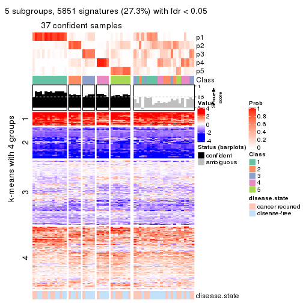</p>

</div>
<div id='tab-CV-kmeans-get-signatures-no-scale-5'>
<pre><code class="r">get_signatures(res, k = 6, scale_rows = FALSE)
</code></pre>

<p></p>

</div>
</div>


Compare the overlap of signatures from different k:

```r
compare_signatures(res)
```


`get_signature()` returns a data frame invisibly. TO get the list of signatures, the function
call should be assigned to a variable explicitly. In following code, if `plot` argument is set
to `FALSE`, no heatmap is plotted while only the differential analysis is performed.

```r
# code only for demonstration
tb = get_signature(res, k = ..., plot = FALSE)
```

An example of the output of `tb` is:

```
#>   which_row         fdr    mean_1    mean_2 scaled_mean_1 scaled_mean_2 km
#> 1        38 0.042760348  8.373488  9.131774    -0.5533452     0.5164555  1
#> 2        40 0.018707592  7.106213  8.469186    -0.6173731     0.5762149  1
#> 3        55 0.019134737 10.221463 11.207825    -0.6159697     0.5749050  1
#> 4        59 0.006059896  5.921854  7.869574    -0.6899429     0.6439467  1
#> 5        60 0.018055526  8.928898 10.211722    -0.6204761     0.5791110  1
#> 6        98 0.009384629 15.714769 14.887706     0.6635654    -0.6193277  2
...
```

The columns in `tb` are:

1. `which_row`: row indices corresponding to the input matrix.
2. `fdr`: FDR for the differential test. 
3. `mean_x`: The mean value in group x.
4. `scaled_mean_x`: The mean value in group x after rows are scaled.
5. `km`: Row groups if k-means clustering is applied to rows.


UMAP plot which shows how samples are separated.


<script>
$( function() {
	$( '#tabs-CV-kmeans-dimension-reduction' ).tabs();
} );
</script>
<div id='tabs-CV-kmeans-dimension-reduction'>
<ul>
<li><a href='#tab-CV-kmeans-dimension-reduction-1'>k = 2</a></li>
<li><a href='#tab-CV-kmeans-dimension-reduction-2'>k = 3</a></li>
<li><a href='#tab-CV-kmeans-dimension-reduction-3'>k = 4</a></li>
<li><a href='#tab-CV-kmeans-dimension-reduction-4'>k = 5</a></li>
<li><a href='#tab-CV-kmeans-dimension-reduction-5'>k = 6</a></li>
</ul>
<div id='tab-CV-kmeans-dimension-reduction-1'>
<pre><code class="r">dimension_reduction(res, k = 2, method = &quot;UMAP&quot;)
</code></pre>

<p></p>

</div>
<div id='tab-CV-kmeans-dimension-reduction-2'>
<pre><code class="r">dimension_reduction(res, k = 3, method = &quot;UMAP&quot;)
</code></pre>

<p></p>

</div>
<div id='tab-CV-kmeans-dimension-reduction-3'>
<pre><code class="r">dimension_reduction(res, k = 4, method = &quot;UMAP&quot;)
</code></pre>

<p></p>

</div>
<div id='tab-CV-kmeans-dimension-reduction-4'>
<pre><code class="r">dimension_reduction(res, k = 5, method = &quot;UMAP&quot;)
</code></pre>

<p></p>

</div>
<div id='tab-CV-kmeans-dimension-reduction-5'>
<pre><code class="r">dimension_reduction(res, k = 6, method = &quot;UMAP&quot;)
</code></pre>

<p></p>

</div>
</div>


Following heatmap shows how subgroups are split when increasing `k`:

```r
collect_classes(res)
```


Test correlation between subgroups and known annotations. If the known
annotation is numeric, one-way ANOVA test is applied, and if the known
annotation is discrete, chi-squared contingency table test is applied.

```r
test_to_known_factors(res)
```

```
#>            n disease.state(p) k
#> CV:kmeans 53            0.674 2
#> CV:kmeans 37            0.195 3
#> CV:kmeans 32            0.234 4
#> CV:kmeans 37            0.449 5
#> CV:kmeans 28            0.551 6
```


If matrix rows can be associated to genes, consider to use `GO_Enrichment(res,
...)` to perform function enrichment for the signature genes.


 

---------------------------------------------------


### CV:skmeans


The object with results only for a single top-value method and a single partition method 
can be extracted as:

```r
res = res_list["CV", "skmeans"]
# you can also extract it by
# res = res_list["CV:skmeans"]
```

A summary of `res` and all the functions that can be applied to it:

```r
res
```

```
#> A 'ConsensusPartition' object with k = 2, 3, 4, 5, 6.
#>   On a matrix with 21446 rows and 60 columns.
#>   Top rows (1000, 2000, 3000, 4000, 5000) are extracted by 'CV' method.
#>   Subgroups are detected by 'skmeans' method.
#>   Performed in total 1250 partitions by row resampling.
#>   Best k for subgroups seems to be 2.
#> 
#> Following methods can be applied to this 'ConsensusPartition' object:
#>  [1] "cola_report"             "collect_classes"         "collect_plots"          
#>  [4] "collect_stats"           "colnames"                "compare_signatures"     
#>  [7] "consensus_heatmap"       "dimension_reduction"     "functional_enrichment"  
#> [10] "get_anno_col"            "get_anno"                "get_classes"            
#> [13] "get_consensus"           "get_matrix"              "get_membership"         
#> [16] "get_param"               "get_signatures"          "get_stats"              
#> [19] "is_best_k"               "is_stable_k"             "membership_heatmap"     
#> [22] "ncol"                    "nrow"                    "plot_ecdf"              
#> [25] "rownames"                "select_partition_number" "show"                   
#> [28] "suggest_best_k"          "test_to_known_factors"
```

`collect_plots()` function collects all the plots made from `res` for all `k` (number of partitions)
into one single page to provide an easy and fast comparison between different `k`.

```r
collect_plots(res)
```


The plots are:

- The first row: a plot of the ECDF (Empirical cumulative distribution
  function) curves of the consensus matrix for each `k` and the heatmap of
  predicted classes for each `k`.
- The second row: heatmaps of the consensus matrix for each `k`.
- The third row: heatmaps of the membership matrix for each `k`.
- The fouth row: heatmaps of the signatures for each `k`.

All the plots in panels can be made by individual functions and they are
plotted later in this section.

`select_partition_number()` produces several plots showing different
statistics for choosing "optimized" `k`. There are following statistics:

- ECDF curves of the consensus matrix for each `k`;
- 1-PAC. [The PAC
  score](https://en.wikipedia.org/wiki/Consensus_clustering#Over-interpretation_potential_of_consensus_clustering)
  measures the proportion of the ambiguous subgrouping.
- Mean silhouette score.
- Concordance. The mean probability of fiting the consensus class ids in all
  partitions.
- Area increased. Denote $A_k$ as the area under the ECDF curve for current
  `k`, the area increased is defined as $A_k - A_{k-1}$.
- Rand index. The percent of pairs of samples that are both in a same cluster
  or both are not in a same cluster in the partition of k and k-1.
- Jaccard index. The ratio of pairs of samples are both in a same cluster in
  the partition of k and k-1 and the pairs of samples are both in a same
  cluster in the partition k or k-1.

The detailed explanations of these statistics can be found in [the cola
vignette](http://bioconductor.org/packages/devel/bioc/vignettes/cola/inst/doc/cola.html#toc_13).

Generally speaking, lower PAC score, higher mean silhouette score or higher
concordance corresponds to better partition. Rand index and Jaccard index
measure how similar the current partition is compared to partition with `k-1`.
If they are too similar, we won't accept `k` is better than `k-1`.

```r
select_partition_number(res)
```


The numeric values for all these statistics can be obtained by `get_stats()`.

```r
get_stats(res)
```

```
#>   k 1-PAC mean_silhouette concordance area_increased  Rand Jaccard
#> 2 2 0.513           0.780       0.900         0.5087 0.492   0.492
#> 3 3 0.371           0.513       0.763         0.3123 0.780   0.584
#> 4 4 0.454           0.427       0.689         0.1244 0.849   0.598
#> 5 5 0.504           0.487       0.674         0.0697 0.881   0.581
#> 6 6 0.559           0.396       0.640         0.0406 0.961   0.809
```

`suggest_best_k()` suggests the best $k$ based on these statistics. The rules are as follows:

- All $k$ with Jaccard index larger than 0.95 are removed because the increase of
  the partition number does not provides enough extra information. If all $k$ are removed,
  the best $k$ is assigned by `NA`.
- For $k$ with 1-PAC larger than 0.9, the maximal $k$ is taken as the "best k". Other $k$ is called "optional k".
- If it does not fit the second rule. The $k$ with the highest vote of highest
  1-PAC, mean silhouette and concordance is taken as the "best k".

```r
suggest_best_k(res)
```

```
#> [1] 2
```


Following shows the table of the partitions (You need to click the **show/hide
code output** link to see it). The membership matrix (columns with name `p*`)
is inferred by
[`clue::cl_consensus()`](https://www.rdocumentation.org/link/cl_consensus?package=clue)
function with the `SE` method. Basically the value in the membership matrix
represents the probability to belong to a certain group. The finall class
label for an item is determined with the group with highest probability it
belongs to.

In `get_classes()` function, the entropy is calculated from the membership
matrix and the silhouette score is calculated from the consensus matrix.


<script>
$( function() {
	$( '#tabs-CV-skmeans-get-classes' ).tabs();
} );
</script>
<div id='tabs-CV-skmeans-get-classes'>
<ul>
<li><a href='#tab-CV-skmeans-get-classes-1'>k = 2</a></li>
<li><a href='#tab-CV-skmeans-get-classes-2'>k = 3</a></li>
<li><a href='#tab-CV-skmeans-get-classes-3'>k = 4</a></li>
<li><a href='#tab-CV-skmeans-get-classes-4'>k = 5</a></li>
<li><a href='#tab-CV-skmeans-get-classes-5'>k = 6</a></li>
</ul>

<div id='tab-CV-skmeans-get-classes-1'>
<p><a id='tab-CV-skmeans-get-classes-1-a' style='color:#0366d6' href='#'>show/hide code output</a></p>
<pre><code class="r">cbind(get_classes(res, k = 2), get_membership(res, k = 2))
</code></pre>

<pre><code>#&gt;          class entropy silhouette    p1    p2
#&gt; GSM22453     1  0.0000      0.879 1.000 0.000
#&gt; GSM22458     2  0.0000      0.875 0.000 1.000
#&gt; GSM22465     1  0.0000      0.879 1.000 0.000
#&gt; GSM22466     1  0.0000      0.879 1.000 0.000
#&gt; GSM22468     2  0.0000      0.875 0.000 1.000
#&gt; GSM22469     1  0.1184      0.871 0.984 0.016
#&gt; GSM22471     1  0.9686      0.449 0.604 0.396
#&gt; GSM22472     2  0.0000      0.875 0.000 1.000
#&gt; GSM22474     2  0.0000      0.875 0.000 1.000
#&gt; GSM22476     1  0.9248      0.555 0.660 0.340
#&gt; GSM22477     2  0.0000      0.875 0.000 1.000
#&gt; GSM22478     2  0.6148      0.731 0.152 0.848
#&gt; GSM22481     1  0.8267      0.672 0.740 0.260
#&gt; GSM22484     2  0.6623      0.760 0.172 0.828
#&gt; GSM22485     2  0.8499      0.654 0.276 0.724
#&gt; GSM22487     2  0.3431      0.843 0.064 0.936
#&gt; GSM22488     2  0.8499      0.654 0.276 0.724
#&gt; GSM22489     2  0.9710      0.435 0.400 0.600
#&gt; GSM22490     2  0.0000      0.875 0.000 1.000
#&gt; GSM22492     2  0.1184      0.867 0.016 0.984
#&gt; GSM22493     2  0.8443      0.659 0.272 0.728
#&gt; GSM22494     1  0.0000      0.879 1.000 0.000
#&gt; GSM22497     1  0.0000      0.879 1.000 0.000
#&gt; GSM22498     1  0.0376      0.877 0.996 0.004
#&gt; GSM22501     1  0.6148      0.738 0.848 0.152
#&gt; GSM22502     2  0.0000      0.875 0.000 1.000
#&gt; GSM22503     2  0.9710      0.194 0.400 0.600
#&gt; GSM22504     2  0.0000      0.875 0.000 1.000
#&gt; GSM22505     1  0.0000      0.879 1.000 0.000
#&gt; GSM22506     1  0.3879      0.820 0.924 0.076
#&gt; GSM22507     1  0.7602      0.713 0.780 0.220
#&gt; GSM22508     2  0.0000      0.875 0.000 1.000
#&gt; GSM22449     2  0.8081      0.686 0.248 0.752
#&gt; GSM22450     1  0.0000      0.879 1.000 0.000
#&gt; GSM22451     1  0.0000      0.879 1.000 0.000
#&gt; GSM22452     1  0.0000      0.879 1.000 0.000
#&gt; GSM22454     1  0.0000      0.879 1.000 0.000
#&gt; GSM22455     2  0.0938      0.871 0.012 0.988
#&gt; GSM22456     2  0.0000      0.875 0.000 1.000
#&gt; GSM22457     1  0.9710      0.441 0.600 0.400
#&gt; GSM22459     2  0.0000      0.875 0.000 1.000
#&gt; GSM22460     2  0.9710      0.435 0.400 0.600
#&gt; GSM22461     2  0.0000      0.875 0.000 1.000
#&gt; GSM22462     1  0.0000      0.879 1.000 0.000
#&gt; GSM22463     1  0.0000      0.879 1.000 0.000
#&gt; GSM22464     2  0.0000      0.875 0.000 1.000
#&gt; GSM22467     1  0.0000      0.879 1.000 0.000
#&gt; GSM22470     1  0.0000      0.879 1.000 0.000
#&gt; GSM22473     2  0.0000      0.875 0.000 1.000
#&gt; GSM22475     1  0.8386      0.661 0.732 0.268
#&gt; GSM22479     2  0.0938      0.870 0.012 0.988
#&gt; GSM22480     2  0.9000      0.596 0.316 0.684
#&gt; GSM22482     1  0.6148      0.738 0.848 0.152
#&gt; GSM22483     1  0.8499      0.650 0.724 0.276
#&gt; GSM22486     1  0.0000      0.879 1.000 0.000
#&gt; GSM22491     1  0.0000      0.879 1.000 0.000
#&gt; GSM22495     2  0.1184      0.867 0.016 0.984
#&gt; GSM22496     1  0.0000      0.879 1.000 0.000
#&gt; GSM22499     1  0.9710      0.441 0.600 0.400
#&gt; GSM22500     2  0.0000      0.875 0.000 1.000
</code></pre>

<script>
$('#tab-CV-skmeans-get-classes-1-a').parent().next().next().hide();
$('#tab-CV-skmeans-get-classes-1-a').click(function(){
  $('#tab-CV-skmeans-get-classes-1-a').parent().next().next().toggle();
  return(false);
});
</script>
</div>

<div id='tab-CV-skmeans-get-classes-2'>
<p><a id='tab-CV-skmeans-get-classes-2-a' style='color:#0366d6' href='#'>show/hide code output</a></p>
<pre><code class="r">cbind(get_classes(res, k = 3), get_membership(res, k = 3))
</code></pre>

<pre><code>#&gt;          class entropy silhouette    p1    p2    p3
#&gt; GSM22453     1  0.0000      0.839 1.000 0.000 0.000
#&gt; GSM22458     2  0.3715      0.570 0.004 0.868 0.128
#&gt; GSM22465     1  0.0000      0.839 1.000 0.000 0.000
#&gt; GSM22466     1  0.0237      0.838 0.996 0.000 0.004
#&gt; GSM22468     2  0.0747      0.618 0.000 0.984 0.016
#&gt; GSM22469     1  0.1751      0.825 0.960 0.028 0.012
#&gt; GSM22471     2  0.9955     -0.233 0.316 0.380 0.304
#&gt; GSM22472     2  0.3619      0.579 0.000 0.864 0.136
#&gt; GSM22474     2  0.3816      0.571 0.000 0.852 0.148
#&gt; GSM22476     3  0.6239      0.520 0.072 0.160 0.768
#&gt; GSM22477     2  0.3879      0.573 0.000 0.848 0.152
#&gt; GSM22478     2  0.5115      0.524 0.004 0.768 0.228
#&gt; GSM22481     1  0.5406      0.587 0.780 0.200 0.020
#&gt; GSM22484     2  0.5730      0.557 0.144 0.796 0.060
#&gt; GSM22485     2  0.7357      0.396 0.332 0.620 0.048
#&gt; GSM22487     2  0.4749      0.597 0.072 0.852 0.076
#&gt; GSM22488     2  0.7306      0.391 0.340 0.616 0.044
#&gt; GSM22489     3  0.5812      0.411 0.012 0.264 0.724
#&gt; GSM22490     2  0.1031      0.617 0.000 0.976 0.024
#&gt; GSM22492     3  0.7634      0.012 0.044 0.432 0.524
#&gt; GSM22493     2  0.7284      0.396 0.336 0.620 0.044
#&gt; GSM22494     1  0.1529      0.835 0.960 0.000 0.040
#&gt; GSM22497     1  0.0237      0.839 0.996 0.000 0.004
#&gt; GSM22498     1  0.1399      0.831 0.968 0.004 0.028
#&gt; GSM22501     3  0.6758      0.557 0.200 0.072 0.728
#&gt; GSM22502     2  0.2711      0.602 0.000 0.912 0.088
#&gt; GSM22503     2  0.9773     -0.153 0.236 0.412 0.352
#&gt; GSM22504     2  0.3686      0.576 0.000 0.860 0.140
#&gt; GSM22505     1  0.3116      0.762 0.892 0.000 0.108
#&gt; GSM22506     1  0.8437      0.362 0.596 0.128 0.276
#&gt; GSM22507     1  0.5741      0.583 0.776 0.188 0.036
#&gt; GSM22508     2  0.3116      0.587 0.000 0.892 0.108
#&gt; GSM22449     2  0.6540      0.212 0.008 0.584 0.408
#&gt; GSM22450     1  0.1753      0.833 0.952 0.000 0.048
#&gt; GSM22451     3  0.6451      0.197 0.384 0.008 0.608
#&gt; GSM22452     1  0.3816      0.709 0.852 0.000 0.148
#&gt; GSM22454     1  0.0829      0.836 0.984 0.012 0.004
#&gt; GSM22455     2  0.6079      0.396 0.000 0.612 0.388
#&gt; GSM22456     2  0.4702      0.514 0.000 0.788 0.212
#&gt; GSM22457     3  0.9823      0.154 0.244 0.364 0.392
#&gt; GSM22459     3  0.3116      0.521 0.000 0.108 0.892
#&gt; GSM22460     2  0.9857      0.180 0.368 0.380 0.252
#&gt; GSM22461     2  0.3752      0.576 0.000 0.856 0.144
#&gt; GSM22462     1  0.2448      0.817 0.924 0.000 0.076
#&gt; GSM22463     3  0.5677      0.545 0.160 0.048 0.792
#&gt; GSM22464     2  0.2165      0.617 0.000 0.936 0.064
#&gt; GSM22467     1  0.1529      0.836 0.960 0.000 0.040
#&gt; GSM22470     3  0.4121      0.555 0.168 0.000 0.832
#&gt; GSM22473     2  0.6291      0.155 0.000 0.532 0.468
#&gt; GSM22475     3  0.4999      0.577 0.152 0.028 0.820
#&gt; GSM22479     2  0.7847      0.132 0.068 0.588 0.344
#&gt; GSM22480     2  0.9621      0.308 0.276 0.472 0.252
#&gt; GSM22482     3  0.7032      0.506 0.272 0.052 0.676
#&gt; GSM22483     3  0.9836      0.321 0.280 0.296 0.424
#&gt; GSM22486     1  0.6244      0.139 0.560 0.000 0.440
#&gt; GSM22491     1  0.1643      0.833 0.956 0.000 0.044
#&gt; GSM22495     3  0.5526      0.504 0.036 0.172 0.792
#&gt; GSM22496     1  0.5202      0.633 0.772 0.008 0.220
#&gt; GSM22499     3  0.9908      0.167 0.268 0.360 0.372
#&gt; GSM22500     2  0.2448      0.604 0.000 0.924 0.076
</code></pre>

<script>
$('#tab-CV-skmeans-get-classes-2-a').parent().next().next().hide();
$('#tab-CV-skmeans-get-classes-2-a').click(function(){
  $('#tab-CV-skmeans-get-classes-2-a').parent().next().next().toggle();
  return(false);
});
</script>
</div>

<div id='tab-CV-skmeans-get-classes-3'>
<p><a id='tab-CV-skmeans-get-classes-3-a' style='color:#0366d6' href='#'>show/hide code output</a></p>
<pre><code class="r">cbind(get_classes(res, k = 4), get_membership(res, k = 4))
</code></pre>

<pre><code>#&gt;          class entropy silhouette    p1    p2    p3    p4
#&gt; GSM22453     1  0.0376     0.8313 0.992 0.004 0.004 0.000
#&gt; GSM22458     4  0.5313    -0.2189 0.000 0.376 0.016 0.608
#&gt; GSM22465     1  0.2629     0.8003 0.912 0.024 0.004 0.060
#&gt; GSM22466     1  0.1004     0.8308 0.972 0.024 0.000 0.004
#&gt; GSM22468     4  0.4307     0.3554 0.000 0.192 0.024 0.784
#&gt; GSM22469     1  0.2722     0.8162 0.904 0.064 0.000 0.032
#&gt; GSM22471     2  0.8594     0.4562 0.180 0.432 0.052 0.336
#&gt; GSM22472     4  0.3881     0.3249 0.000 0.016 0.172 0.812
#&gt; GSM22474     2  0.5615     0.2548 0.004 0.556 0.016 0.424
#&gt; GSM22476     3  0.5108     0.4609 0.000 0.308 0.672 0.020
#&gt; GSM22477     4  0.5361     0.3137 0.000 0.060 0.224 0.716
#&gt; GSM22478     2  0.7730    -0.0482 0.000 0.444 0.264 0.292
#&gt; GSM22481     1  0.5421     0.6180 0.724 0.200 0.000 0.076
#&gt; GSM22484     4  0.5822     0.4440 0.028 0.304 0.016 0.652
#&gt; GSM22485     4  0.7913     0.3878 0.196 0.276 0.020 0.508
#&gt; GSM22487     4  0.5656     0.1174 0.056 0.248 0.004 0.692
#&gt; GSM22488     4  0.7853     0.3859 0.204 0.272 0.016 0.508
#&gt; GSM22489     3  0.4791     0.5171 0.004 0.156 0.784 0.056
#&gt; GSM22490     4  0.2466     0.3615 0.000 0.096 0.004 0.900
#&gt; GSM22492     2  0.6674     0.5286 0.016 0.616 0.080 0.288
#&gt; GSM22493     4  0.7910     0.3939 0.176 0.288 0.024 0.512
#&gt; GSM22494     1  0.3748     0.7667 0.860 0.044 0.008 0.088
#&gt; GSM22497     1  0.0707     0.8314 0.980 0.020 0.000 0.000
#&gt; GSM22498     1  0.3780     0.7881 0.832 0.148 0.016 0.004
#&gt; GSM22501     3  0.5900     0.4644 0.040 0.292 0.656 0.012
#&gt; GSM22502     4  0.4122     0.1714 0.000 0.236 0.004 0.760
#&gt; GSM22503     2  0.6885     0.5328 0.072 0.604 0.028 0.296
#&gt; GSM22504     4  0.3937     0.3201 0.000 0.012 0.188 0.800
#&gt; GSM22505     1  0.3978     0.7736 0.836 0.056 0.108 0.000
#&gt; GSM22506     3  0.9468    -0.0143 0.272 0.260 0.360 0.108
#&gt; GSM22507     1  0.5654     0.5782 0.680 0.272 0.008 0.040
#&gt; GSM22508     4  0.4891    -0.0513 0.000 0.308 0.012 0.680
#&gt; GSM22449     4  0.7721     0.3689 0.008 0.324 0.188 0.480
#&gt; GSM22450     1  0.0707     0.8314 0.980 0.000 0.020 0.000
#&gt; GSM22451     3  0.5292     0.4077 0.252 0.036 0.708 0.004
#&gt; GSM22452     1  0.5428     0.6481 0.736 0.028 0.208 0.028
#&gt; GSM22454     1  0.2099     0.8286 0.936 0.020 0.004 0.040
#&gt; GSM22455     4  0.7904     0.2905 0.000 0.308 0.324 0.368
#&gt; GSM22456     4  0.7028     0.3934 0.000 0.380 0.124 0.496
#&gt; GSM22457     2  0.7099     0.5128 0.060 0.660 0.104 0.176
#&gt; GSM22459     3  0.2908     0.5057 0.000 0.064 0.896 0.040
#&gt; GSM22460     3  0.9852    -0.2198 0.176 0.248 0.316 0.260
#&gt; GSM22461     4  0.4951     0.2882 0.000 0.044 0.212 0.744
#&gt; GSM22462     1  0.2593     0.8067 0.892 0.004 0.104 0.000
#&gt; GSM22463     3  0.1724     0.5311 0.032 0.020 0.948 0.000
#&gt; GSM22464     4  0.5451     0.3701 0.004 0.464 0.008 0.524
#&gt; GSM22467     1  0.0707     0.8314 0.980 0.000 0.020 0.000
#&gt; GSM22470     3  0.1929     0.5331 0.036 0.024 0.940 0.000
#&gt; GSM22473     3  0.7857     0.1454 0.000 0.348 0.380 0.272
#&gt; GSM22475     3  0.5693     0.4679 0.080 0.176 0.732 0.012
#&gt; GSM22479     2  0.5817     0.5091 0.012 0.660 0.036 0.292
#&gt; GSM22480     2  0.9114    -0.3633 0.068 0.368 0.264 0.300
#&gt; GSM22482     3  0.6531     0.4626 0.104 0.248 0.640 0.008
#&gt; GSM22483     3  0.9025    -0.1279 0.220 0.068 0.364 0.348
#&gt; GSM22486     1  0.7024     0.2897 0.512 0.128 0.360 0.000
#&gt; GSM22491     1  0.1724     0.8276 0.948 0.020 0.032 0.000
#&gt; GSM22495     3  0.5773     0.3728 0.004 0.408 0.564 0.024
#&gt; GSM22496     1  0.6477     0.4899 0.640 0.032 0.280 0.048
#&gt; GSM22499     2  0.9646     0.3754 0.156 0.376 0.240 0.228
#&gt; GSM22500     4  0.4462     0.1398 0.004 0.256 0.004 0.736
</code></pre>

<script>
$('#tab-CV-skmeans-get-classes-3-a').parent().next().next().hide();
$('#tab-CV-skmeans-get-classes-3-a').click(function(){
  $('#tab-CV-skmeans-get-classes-3-a').parent().next().next().toggle();
  return(false);
});
</script>
</div>

<div id='tab-CV-skmeans-get-classes-4'>
<p><a id='tab-CV-skmeans-get-classes-4-a' style='color:#0366d6' href='#'>show/hide code output</a></p>
<pre><code class="r">cbind(get_classes(res, k = 5), get_membership(res, k = 5))
</code></pre>

<pre><code>#&gt;          class entropy silhouette    p1    p2    p3    p4    p5
#&gt; GSM22453     1   0.171     0.7512 0.940 0.040 0.016 0.000 0.004
#&gt; GSM22458     4   0.597     0.4510 0.004 0.180 0.032 0.668 0.116
#&gt; GSM22465     1   0.348     0.6919 0.816 0.020 0.160 0.004 0.000
#&gt; GSM22466     1   0.224     0.7434 0.904 0.084 0.008 0.004 0.000
#&gt; GSM22468     4   0.657     0.1412 0.000 0.176 0.380 0.440 0.004
#&gt; GSM22469     1   0.384     0.6947 0.792 0.176 0.008 0.024 0.000
#&gt; GSM22471     2   0.581     0.4834 0.116 0.660 0.000 0.200 0.024
#&gt; GSM22472     4   0.165     0.6099 0.000 0.008 0.036 0.944 0.012
#&gt; GSM22474     2   0.784    -0.0385 0.004 0.444 0.124 0.304 0.124
#&gt; GSM22476     5   0.435     0.6257 0.012 0.168 0.028 0.012 0.780
#&gt; GSM22477     4   0.262     0.5454 0.000 0.008 0.080 0.892 0.020
#&gt; GSM22478     2   0.805     0.0749 0.004 0.420 0.184 0.284 0.108
#&gt; GSM22481     1   0.603     0.2918 0.548 0.372 0.016 0.052 0.012
#&gt; GSM22484     3   0.557     0.3636 0.008 0.028 0.648 0.280 0.036
#&gt; GSM22485     3   0.361     0.5857 0.156 0.000 0.812 0.028 0.004
#&gt; GSM22487     2   0.783    -0.0404 0.052 0.344 0.340 0.260 0.004
#&gt; GSM22488     3   0.381     0.5823 0.168 0.004 0.796 0.032 0.000
#&gt; GSM22489     5   0.461     0.6367 0.004 0.048 0.104 0.052 0.792
#&gt; GSM22490     4   0.565     0.5350 0.000 0.100 0.228 0.656 0.016
#&gt; GSM22492     2   0.504     0.5101 0.004 0.732 0.016 0.176 0.072
#&gt; GSM22493     3   0.372     0.5888 0.144 0.000 0.812 0.040 0.004
#&gt; GSM22494     1   0.355     0.6434 0.776 0.004 0.216 0.004 0.000
#&gt; GSM22497     1   0.205     0.7527 0.932 0.028 0.012 0.004 0.024
#&gt; GSM22498     1   0.636     0.4202 0.544 0.332 0.104 0.012 0.008
#&gt; GSM22501     5   0.443     0.6219 0.040 0.172 0.020 0.000 0.768
#&gt; GSM22502     4   0.618     0.4672 0.000 0.208 0.180 0.600 0.012
#&gt; GSM22503     2   0.353     0.5608 0.032 0.848 0.004 0.100 0.016
#&gt; GSM22504     4   0.157     0.6010 0.000 0.004 0.044 0.944 0.008
#&gt; GSM22505     1   0.551     0.6748 0.724 0.144 0.068 0.004 0.060
#&gt; GSM22506     3   0.797     0.4167 0.208 0.004 0.432 0.264 0.092
#&gt; GSM22507     2   0.500     0.0392 0.380 0.592 0.008 0.016 0.004
#&gt; GSM22508     4   0.636     0.4828 0.004 0.152 0.072 0.656 0.116
#&gt; GSM22449     3   0.549     0.5310 0.004 0.048 0.720 0.072 0.156
#&gt; GSM22450     1   0.112     0.7512 0.964 0.016 0.000 0.000 0.020
#&gt; GSM22451     5   0.833     0.2510 0.272 0.028 0.116 0.140 0.444
#&gt; GSM22452     1   0.583     0.5053 0.640 0.012 0.136 0.000 0.212
#&gt; GSM22454     1   0.407     0.7275 0.812 0.100 0.072 0.016 0.000
#&gt; GSM22455     3   0.702     0.4336 0.000 0.060 0.524 0.288 0.128
#&gt; GSM22456     3   0.615     0.4477 0.000 0.060 0.620 0.256 0.064
#&gt; GSM22457     2   0.361     0.5634 0.036 0.864 0.020 0.036 0.044
#&gt; GSM22459     5   0.464     0.6095 0.012 0.028 0.032 0.152 0.776
#&gt; GSM22460     3   0.853     0.3824 0.160 0.016 0.404 0.252 0.168
#&gt; GSM22461     4   0.234     0.5946 0.000 0.036 0.032 0.916 0.016
#&gt; GSM22462     1   0.437     0.6972 0.804 0.036 0.036 0.008 0.116
#&gt; GSM22463     5   0.455     0.6074 0.056 0.004 0.056 0.084 0.800
#&gt; GSM22464     3   0.575     0.4280 0.000 0.252 0.640 0.088 0.020
#&gt; GSM22467     1   0.148     0.7532 0.952 0.028 0.008 0.000 0.012
#&gt; GSM22470     5   0.420     0.6348 0.064 0.036 0.024 0.044 0.832
#&gt; GSM22473     5   0.758     0.1766 0.000 0.116 0.296 0.120 0.468
#&gt; GSM22475     5   0.636     0.4589 0.088 0.264 0.016 0.024 0.608
#&gt; GSM22479     2   0.443     0.5128 0.012 0.808 0.028 0.092 0.060
#&gt; GSM22480     3   0.719     0.5394 0.068 0.048 0.600 0.208 0.076
#&gt; GSM22482     5   0.552     0.5899 0.120 0.152 0.020 0.004 0.704
#&gt; GSM22483     4   0.748     0.1325 0.132 0.128 0.004 0.540 0.196
#&gt; GSM22486     1   0.805     0.2288 0.432 0.228 0.088 0.008 0.244
#&gt; GSM22491     1   0.274     0.7416 0.896 0.008 0.056 0.004 0.036
#&gt; GSM22495     5   0.516     0.5218 0.000 0.320 0.032 0.016 0.632
#&gt; GSM22496     1   0.764     0.4050 0.560 0.032 0.088 0.132 0.188
#&gt; GSM22499     2   0.691     0.4707 0.076 0.616 0.012 0.152 0.144
#&gt; GSM22500     4   0.709     0.0256 0.004 0.328 0.316 0.348 0.004
</code></pre>

<script>
$('#tab-CV-skmeans-get-classes-4-a').parent().next().next().hide();
$('#tab-CV-skmeans-get-classes-4-a').click(function(){
  $('#tab-CV-skmeans-get-classes-4-a').parent().next().next().toggle();
  return(false);
});
</script>
</div>

<div id='tab-CV-skmeans-get-classes-5'>
<p><a id='tab-CV-skmeans-get-classes-5-a' style='color:#0366d6' href='#'>show/hide code output</a></p>
<pre><code class="r">cbind(get_classes(res, k = 6), get_membership(res, k = 6))
</code></pre>

<pre><code>#&gt;          class entropy silhouette    p1    p2    p3    p4    p5    p6
#&gt; GSM22453     1  0.1586    0.67229 0.940 0.004 0.004 0.000 0.012 0.040
#&gt; GSM22458     4  0.5638    0.49125 0.004 0.136 0.012 0.644 0.188 0.016
#&gt; GSM22465     1  0.4164    0.58012 0.728 0.012 0.220 0.000 0.000 0.040
#&gt; GSM22466     1  0.1918    0.67343 0.932 0.016 0.020 0.004 0.004 0.024
#&gt; GSM22468     4  0.7528    0.10982 0.000 0.180 0.296 0.408 0.028 0.088
#&gt; GSM22469     1  0.4167    0.62579 0.784 0.124 0.024 0.008 0.000 0.060
#&gt; GSM22471     2  0.6989    0.41781 0.096 0.588 0.016 0.176 0.052 0.072
#&gt; GSM22472     4  0.0767    0.64427 0.000 0.000 0.012 0.976 0.004 0.008
#&gt; GSM22474     2  0.8150    0.17561 0.000 0.392 0.096 0.136 0.264 0.112
#&gt; GSM22476     5  0.2257    0.54626 0.012 0.076 0.000 0.008 0.900 0.004
#&gt; GSM22477     4  0.2631    0.59678 0.000 0.004 0.008 0.860 0.004 0.124
#&gt; GSM22478     2  0.7908    0.01883 0.008 0.388 0.160 0.172 0.016 0.256
#&gt; GSM22481     1  0.7033    0.33963 0.528 0.272 0.048 0.016 0.044 0.092
#&gt; GSM22484     3  0.7921    0.28057 0.016 0.032 0.412 0.220 0.080 0.240
#&gt; GSM22485     3  0.2163    0.53204 0.096 0.000 0.892 0.008 0.000 0.004
#&gt; GSM22487     2  0.7934    0.16754 0.068 0.336 0.324 0.204 0.000 0.068
#&gt; GSM22488     3  0.2400    0.52267 0.116 0.000 0.872 0.004 0.000 0.008
#&gt; GSM22489     5  0.5571    0.33452 0.000 0.024 0.060 0.032 0.640 0.244
#&gt; GSM22490     4  0.6230    0.53785 0.000 0.112 0.132 0.640 0.084 0.032
#&gt; GSM22492     2  0.5059    0.47744 0.004 0.744 0.016 0.092 0.076 0.068
#&gt; GSM22493     3  0.2945    0.53441 0.064 0.004 0.868 0.012 0.000 0.052
#&gt; GSM22494     1  0.4985    0.45748 0.628 0.012 0.288 0.000 0.000 0.072
#&gt; GSM22497     1  0.3062    0.66500 0.872 0.004 0.036 0.004 0.048 0.036
#&gt; GSM22498     1  0.6990    0.40650 0.524 0.220 0.140 0.004 0.012 0.100
#&gt; GSM22501     5  0.3059    0.52320 0.076 0.040 0.012 0.004 0.864 0.004
#&gt; GSM22502     4  0.6484    0.41930 0.000 0.228 0.116 0.576 0.044 0.036
#&gt; GSM22503     2  0.3722    0.51877 0.032 0.836 0.008 0.028 0.080 0.016
#&gt; GSM22504     4  0.0725    0.64279 0.000 0.000 0.012 0.976 0.000 0.012
#&gt; GSM22505     1  0.5680    0.57861 0.704 0.052 0.076 0.004 0.052 0.112
#&gt; GSM22506     3  0.8138    0.06571 0.136 0.004 0.376 0.224 0.040 0.220
#&gt; GSM22507     2  0.5521   -0.04029 0.404 0.504 0.016 0.004 0.000 0.072
#&gt; GSM22508     4  0.6166    0.52017 0.000 0.092 0.032 0.624 0.196 0.056
#&gt; GSM22449     3  0.6090    0.47017 0.012 0.008 0.624 0.036 0.148 0.172
#&gt; GSM22450     1  0.2854    0.64842 0.860 0.012 0.016 0.000 0.004 0.108
#&gt; GSM22451     6  0.5614    0.36660 0.104 0.008 0.016 0.036 0.152 0.684
#&gt; GSM22452     1  0.5922    0.43833 0.608 0.012 0.184 0.004 0.176 0.016
#&gt; GSM22454     1  0.4914    0.60188 0.736 0.064 0.044 0.016 0.000 0.140
#&gt; GSM22455     3  0.7956    0.32743 0.000 0.048 0.372 0.212 0.100 0.268
#&gt; GSM22456     3  0.7750    0.42803 0.000 0.052 0.448 0.136 0.128 0.236
#&gt; GSM22457     2  0.3917    0.49260 0.032 0.820 0.012 0.004 0.084 0.048
#&gt; GSM22459     5  0.5769    0.35584 0.000 0.028 0.000 0.132 0.580 0.260
#&gt; GSM22460     6  0.7431    0.00398 0.092 0.008 0.256 0.128 0.032 0.484
#&gt; GSM22461     4  0.2107    0.63744 0.000 0.024 0.012 0.920 0.008 0.036
#&gt; GSM22462     1  0.5393    0.46045 0.640 0.028 0.040 0.000 0.028 0.264
#&gt; GSM22463     6  0.6253   -0.21759 0.032 0.008 0.068 0.016 0.424 0.452
#&gt; GSM22464     3  0.6900    0.37179 0.000 0.252 0.536 0.052 0.096 0.064
#&gt; GSM22467     1  0.2239    0.66389 0.900 0.020 0.008 0.000 0.000 0.072
#&gt; GSM22470     5  0.5470    0.20248 0.008 0.032 0.020 0.012 0.540 0.388
#&gt; GSM22473     5  0.7457    0.06957 0.000 0.072 0.232 0.092 0.496 0.108
#&gt; GSM22475     5  0.6510    0.26718 0.016 0.240 0.000 0.012 0.472 0.260
#&gt; GSM22479     2  0.4809    0.48625 0.016 0.748 0.020 0.028 0.156 0.032
#&gt; GSM22480     3  0.6707    0.43258 0.028 0.052 0.580 0.188 0.008 0.144
#&gt; GSM22482     5  0.3502    0.48381 0.132 0.028 0.012 0.004 0.820 0.004
#&gt; GSM22483     4  0.7023    0.14519 0.076 0.088 0.004 0.500 0.036 0.296
#&gt; GSM22486     1  0.7927    0.06224 0.388 0.116 0.080 0.004 0.088 0.324
#&gt; GSM22491     1  0.4534    0.59829 0.740 0.004 0.076 0.004 0.012 0.164
#&gt; GSM22495     5  0.5366    0.40465 0.000 0.304 0.004 0.012 0.592 0.088
#&gt; GSM22496     6  0.5815    0.07474 0.380 0.024 0.004 0.048 0.020 0.524
#&gt; GSM22499     2  0.7231    0.37239 0.060 0.552 0.028 0.100 0.044 0.216
#&gt; GSM22500     2  0.7318    0.07428 0.016 0.356 0.292 0.280 0.000 0.056
</code></pre>

<script>
$('#tab-CV-skmeans-get-classes-5-a').parent().next().next().hide();
$('#tab-CV-skmeans-get-classes-5-a').click(function(){
  $('#tab-CV-skmeans-get-classes-5-a').parent().next().next().toggle();
  return(false);
});
</script>
</div>
</div>

Heatmaps for the consensus matrix. It visualizes the probability of two
samples to be in a same group.


<script>
$( function() {
	$( '#tabs-CV-skmeans-consensus-heatmap' ).tabs();
} );
</script>
<div id='tabs-CV-skmeans-consensus-heatmap'>
<ul>
<li><a href='#tab-CV-skmeans-consensus-heatmap-1'>k = 2</a></li>
<li><a href='#tab-CV-skmeans-consensus-heatmap-2'>k = 3</a></li>
<li><a href='#tab-CV-skmeans-consensus-heatmap-3'>k = 4</a></li>
<li><a href='#tab-CV-skmeans-consensus-heatmap-4'>k = 5</a></li>
<li><a href='#tab-CV-skmeans-consensus-heatmap-5'>k = 6</a></li>
</ul>
<div id='tab-CV-skmeans-consensus-heatmap-1'>
<pre><code class="r">consensus_heatmap(res, k = 2)
</code></pre>

<p></p>

</div>
<div id='tab-CV-skmeans-consensus-heatmap-2'>
<pre><code class="r">consensus_heatmap(res, k = 3)
</code></pre>

<p></p>

</div>
<div id='tab-CV-skmeans-consensus-heatmap-3'>
<pre><code class="r">consensus_heatmap(res, k = 4)
</code></pre>

<p></p>

</div>
<div id='tab-CV-skmeans-consensus-heatmap-4'>
<pre><code class="r">consensus_heatmap(res, k = 5)
</code></pre>

<p></p>

</div>
<div id='tab-CV-skmeans-consensus-heatmap-5'>
<pre><code class="r">consensus_heatmap(res, k = 6)
</code></pre>

<p></p>

</div>
</div>

Heatmaps for the membership of samples in all partitions to see how consistent they are:


<script>
$( function() {
	$( '#tabs-CV-skmeans-membership-heatmap' ).tabs();
} );
</script>
<div id='tabs-CV-skmeans-membership-heatmap'>
<ul>
<li><a href='#tab-CV-skmeans-membership-heatmap-1'>k = 2</a></li>
<li><a href='#tab-CV-skmeans-membership-heatmap-2'>k = 3</a></li>
<li><a href='#tab-CV-skmeans-membership-heatmap-3'>k = 4</a></li>
<li><a href='#tab-CV-skmeans-membership-heatmap-4'>k = 5</a></li>
<li><a href='#tab-CV-skmeans-membership-heatmap-5'>k = 6</a></li>
</ul>
<div id='tab-CV-skmeans-membership-heatmap-1'>
<pre><code class="r">membership_heatmap(res, k = 2)
</code></pre>

<p></p>

</div>
<div id='tab-CV-skmeans-membership-heatmap-2'>
<pre><code class="r">membership_heatmap(res, k = 3)
</code></pre>

<p></p>

</div>
<div id='tab-CV-skmeans-membership-heatmap-3'>
<pre><code class="r">membership_heatmap(res, k = 4)
</code></pre>

<p></p>

</div>
<div id='tab-CV-skmeans-membership-heatmap-4'>
<pre><code class="r">membership_heatmap(res, k = 5)
</code></pre>

<p></p>

</div>
<div id='tab-CV-skmeans-membership-heatmap-5'>
<pre><code class="r">membership_heatmap(res, k = 6)
</code></pre>

<p></p>

</div>
</div>

As soon as we have had the classes for columns, we can look for signatures
which are significantly different between classes which can be candidate marks
for certain classes. Following are the heatmaps for signatures.


Signature heatmaps where rows are scaled:


<script>
$( function() {
	$( '#tabs-CV-skmeans-get-signatures' ).tabs();
} );
</script>
<div id='tabs-CV-skmeans-get-signatures'>
<ul>
<li><a href='#tab-CV-skmeans-get-signatures-1'>k = 2</a></li>
<li><a href='#tab-CV-skmeans-get-signatures-2'>k = 3</a></li>
<li><a href='#tab-CV-skmeans-get-signatures-3'>k = 4</a></li>
<li><a href='#tab-CV-skmeans-get-signatures-4'>k = 5</a></li>
<li><a href='#tab-CV-skmeans-get-signatures-5'>k = 6</a></li>
</ul>
<div id='tab-CV-skmeans-get-signatures-1'>
<pre><code class="r">get_signatures(res, k = 2)
</code></pre>

<p></p>

</div>
<div id='tab-CV-skmeans-get-signatures-2'>
<pre><code class="r">get_signatures(res, k = 3)
</code></pre>

<p></p>

</div>
<div id='tab-CV-skmeans-get-signatures-3'>
<pre><code class="r">get_signatures(res, k = 4)
</code></pre>

<p></p>

</div>
<div id='tab-CV-skmeans-get-signatures-4'>
<pre><code class="r">get_signatures(res, k = 5)
</code></pre>

<p></p>

</div>
<div id='tab-CV-skmeans-get-signatures-5'>
<pre><code class="r">get_signatures(res, k = 6)
</code></pre>

<p></p>

</div>
</div>


Signature heatmaps where rows are not scaled:


<script>
$( function() {
	$( '#tabs-CV-skmeans-get-signatures-no-scale' ).tabs();
} );
</script>
<div id='tabs-CV-skmeans-get-signatures-no-scale'>
<ul>
<li><a href='#tab-CV-skmeans-get-signatures-no-scale-1'>k = 2</a></li>
<li><a href='#tab-CV-skmeans-get-signatures-no-scale-2'>k = 3</a></li>
<li><a href='#tab-CV-skmeans-get-signatures-no-scale-3'>k = 4</a></li>
<li><a href='#tab-CV-skmeans-get-signatures-no-scale-4'>k = 5</a></li>
<li><a href='#tab-CV-skmeans-get-signatures-no-scale-5'>k = 6</a></li>
</ul>
<div id='tab-CV-skmeans-get-signatures-no-scale-1'>
<pre><code class="r">get_signatures(res, k = 2, scale_rows = FALSE)
</code></pre>

<p></p>

</div>
<div id='tab-CV-skmeans-get-signatures-no-scale-2'>
<pre><code class="r">get_signatures(res, k = 3, scale_rows = FALSE)
</code></pre>

<p></p>

</div>
<div id='tab-CV-skmeans-get-signatures-no-scale-3'>
<pre><code class="r">get_signatures(res, k = 4, scale_rows = FALSE)
</code></pre>

<p></p>

</div>
<div id='tab-CV-skmeans-get-signatures-no-scale-4'>
<pre><code class="r">get_signatures(res, k = 5, scale_rows = FALSE)
</code></pre>

<p>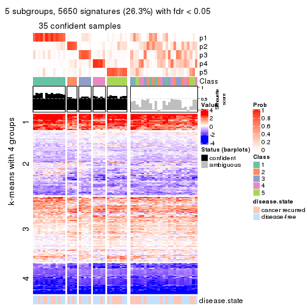</p>

</div>
<div id='tab-CV-skmeans-get-signatures-no-scale-5'>
<pre><code class="r">get_signatures(res, k = 6, scale_rows = FALSE)
</code></pre>

<p></p>

</div>
</div>


Compare the overlap of signatures from different k:

```r
compare_signatures(res)
```


`get_signature()` returns a data frame invisibly. TO get the list of signatures, the function
call should be assigned to a variable explicitly. In following code, if `plot` argument is set
to `FALSE`, no heatmap is plotted while only the differential analysis is performed.

```r
# code only for demonstration
tb = get_signature(res, k = ..., plot = FALSE)
```

An example of the output of `tb` is:

```
#>   which_row         fdr    mean_1    mean_2 scaled_mean_1 scaled_mean_2 km
#> 1        38 0.042760348  8.373488  9.131774    -0.5533452     0.5164555  1
#> 2        40 0.018707592  7.106213  8.469186    -0.6173731     0.5762149  1
#> 3        55 0.019134737 10.221463 11.207825    -0.6159697     0.5749050  1
#> 4        59 0.006059896  5.921854  7.869574    -0.6899429     0.6439467  1
#> 5        60 0.018055526  8.928898 10.211722    -0.6204761     0.5791110  1
#> 6        98 0.009384629 15.714769 14.887706     0.6635654    -0.6193277  2
...
```

The columns in `tb` are:

1. `which_row`: row indices corresponding to the input matrix.
2. `fdr`: FDR for the differential test. 
3. `mean_x`: The mean value in group x.
4. `scaled_mean_x`: The mean value in group x after rows are scaled.
5. `km`: Row groups if k-means clustering is applied to rows.


UMAP plot which shows how samples are separated.


<script>
$( function() {
	$( '#tabs-CV-skmeans-dimension-reduction' ).tabs();
} );
</script>
<div id='tabs-CV-skmeans-dimension-reduction'>
<ul>
<li><a href='#tab-CV-skmeans-dimension-reduction-1'>k = 2</a></li>
<li><a href='#tab-CV-skmeans-dimension-reduction-2'>k = 3</a></li>
<li><a href='#tab-CV-skmeans-dimension-reduction-3'>k = 4</a></li>
<li><a href='#tab-CV-skmeans-dimension-reduction-4'>k = 5</a></li>
<li><a href='#tab-CV-skmeans-dimension-reduction-5'>k = 6</a></li>
</ul>
<div id='tab-CV-skmeans-dimension-reduction-1'>
<pre><code class="r">dimension_reduction(res, k = 2, method = &quot;UMAP&quot;)
</code></pre>

<p></p>

</div>
<div id='tab-CV-skmeans-dimension-reduction-2'>
<pre><code class="r">dimension_reduction(res, k = 3, method = &quot;UMAP&quot;)
</code></pre>

<p></p>

</div>
<div id='tab-CV-skmeans-dimension-reduction-3'>
<pre><code class="r">dimension_reduction(res, k = 4, method = &quot;UMAP&quot;)
</code></pre>

<p>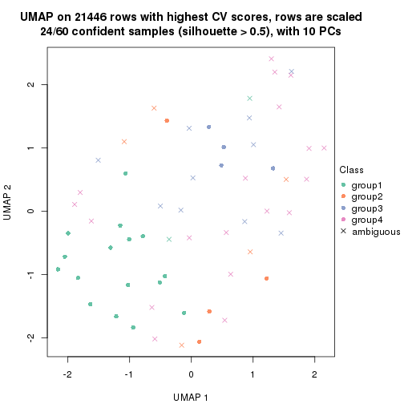</p>

</div>
<div id='tab-CV-skmeans-dimension-reduction-4'>
<pre><code class="r">dimension_reduction(res, k = 5, method = &quot;UMAP&quot;)
</code></pre>

<p></p>

</div>
<div id='tab-CV-skmeans-dimension-reduction-5'>
<pre><code class="r">dimension_reduction(res, k = 6, method = &quot;UMAP&quot;)
</code></pre>

<p></p>

</div>
</div>


Following heatmap shows how subgroups are split when increasing `k`:

```r
collect_classes(res)
```


Test correlation between subgroups and known annotations. If the known
annotation is numeric, one-way ANOVA test is applied, and if the known
annotation is discrete, chi-squared contingency table test is applied.

```r
test_to_known_factors(res)
```

```
#>             n disease.state(p) k
#> CV:skmeans 54           0.5852 2
#> CV:skmeans 41           0.0641 3
#> CV:skmeans 24           0.3973 4
#> CV:skmeans 35           0.6741 5
#> CV:skmeans 22           0.4645 6
```


If matrix rows can be associated to genes, consider to use `GO_Enrichment(res,
...)` to perform function enrichment for the signature genes.


 

---------------------------------------------------


### CV:pam


The object with results only for a single top-value method and a single partition method 
can be extracted as:

```r
res = res_list["CV", "pam"]
# you can also extract it by
# res = res_list["CV:pam"]
```

A summary of `res` and all the functions that can be applied to it:

```r
res
```

```
#> A 'ConsensusPartition' object with k = 2, 3, 4, 5, 6.
#>   On a matrix with 21446 rows and 60 columns.
#>   Top rows (1000, 2000, 3000, 4000, 5000) are extracted by 'CV' method.
#>   Subgroups are detected by 'pam' method.
#>   Performed in total 1250 partitions by row resampling.
#>   Best k for subgroups seems to be 5.
#> 
#> Following methods can be applied to this 'ConsensusPartition' object:
#>  [1] "cola_report"             "collect_classes"         "collect_plots"          
#>  [4] "collect_stats"           "colnames"                "compare_signatures"     
#>  [7] "consensus_heatmap"       "dimension_reduction"     "functional_enrichment"  
#> [10] "get_anno_col"            "get_anno"                "get_classes"            
#> [13] "get_consensus"           "get_matrix"              "get_membership"         
#> [16] "get_param"               "get_signatures"          "get_stats"              
#> [19] "is_best_k"               "is_stable_k"             "membership_heatmap"     
#> [22] "ncol"                    "nrow"                    "plot_ecdf"              
#> [25] "rownames"                "select_partition_number" "show"                   
#> [28] "suggest_best_k"          "test_to_known_factors"
```

`collect_plots()` function collects all the plots made from `res` for all `k` (number of partitions)
into one single page to provide an easy and fast comparison between different `k`.

```r
collect_plots(res)
```


The plots are:

- The first row: a plot of the ECDF (Empirical cumulative distribution
  function) curves of the consensus matrix for each `k` and the heatmap of
  predicted classes for each `k`.
- The second row: heatmaps of the consensus matrix for each `k`.
- The third row: heatmaps of the membership matrix for each `k`.
- The fouth row: heatmaps of the signatures for each `k`.

All the plots in panels can be made by individual functions and they are
plotted later in this section.

`select_partition_number()` produces several plots showing different
statistics for choosing "optimized" `k`. There are following statistics:

- ECDF curves of the consensus matrix for each `k`;
- 1-PAC. [The PAC
  score](https://en.wikipedia.org/wiki/Consensus_clustering#Over-interpretation_potential_of_consensus_clustering)
  measures the proportion of the ambiguous subgrouping.
- Mean silhouette score.
- Concordance. The mean probability of fiting the consensus class ids in all
  partitions.
- Area increased. Denote $A_k$ as the area under the ECDF curve for current
  `k`, the area increased is defined as $A_k - A_{k-1}$.
- Rand index. The percent of pairs of samples that are both in a same cluster
  or both are not in a same cluster in the partition of k and k-1.
- Jaccard index. The ratio of pairs of samples are both in a same cluster in
  the partition of k and k-1 and the pairs of samples are both in a same
  cluster in the partition k or k-1.

The detailed explanations of these statistics can be found in [the cola
vignette](http://bioconductor.org/packages/devel/bioc/vignettes/cola/inst/doc/cola.html#toc_13).

Generally speaking, lower PAC score, higher mean silhouette score or higher
concordance corresponds to better partition. Rand index and Jaccard index
measure how similar the current partition is compared to partition with `k-1`.
If they are too similar, we won't accept `k` is better than `k-1`.

```r
select_partition_number(res)
```


The numeric values for all these statistics can be obtained by `get_stats()`.

```r
get_stats(res)
```

```
#>   k 1-PAC mean_silhouette concordance area_increased  Rand Jaccard
#> 2 2 0.187           0.482       0.786         0.4313 0.619   0.619
#> 3 3 0.299           0.353       0.694         0.4476 0.485   0.315
#> 4 4 0.531           0.297       0.672         0.1645 0.692   0.363
#> 5 5 0.529           0.420       0.723         0.0606 0.760   0.373
#> 6 6 0.560           0.404       0.688         0.0412 0.944   0.779
```

`suggest_best_k()` suggests the best $k$ based on these statistics. The rules are as follows:

- All $k$ with Jaccard index larger than 0.95 are removed because the increase of
  the partition number does not provides enough extra information. If all $k$ are removed,
  the best $k$ is assigned by `NA`.
- For $k$ with 1-PAC larger than 0.9, the maximal $k$ is taken as the "best k". Other $k$ is called "optional k".
- If it does not fit the second rule. The $k$ with the highest vote of highest
  1-PAC, mean silhouette and concordance is taken as the "best k".

```r
suggest_best_k(res)
```

```
#> [1] 5
```


Following shows the table of the partitions (You need to click the **show/hide
code output** link to see it). The membership matrix (columns with name `p*`)
is inferred by
[`clue::cl_consensus()`](https://www.rdocumentation.org/link/cl_consensus?package=clue)
function with the `SE` method. Basically the value in the membership matrix
represents the probability to belong to a certain group. The finall class
label for an item is determined with the group with highest probability it
belongs to.

In `get_classes()` function, the entropy is calculated from the membership
matrix and the silhouette score is calculated from the consensus matrix.


<script>
$( function() {
	$( '#tabs-CV-pam-get-classes' ).tabs();
} );
</script>
<div id='tabs-CV-pam-get-classes'>
<ul>
<li><a href='#tab-CV-pam-get-classes-1'>k = 2</a></li>
<li><a href='#tab-CV-pam-get-classes-2'>k = 3</a></li>
<li><a href='#tab-CV-pam-get-classes-3'>k = 4</a></li>
<li><a href='#tab-CV-pam-get-classes-4'>k = 5</a></li>
<li><a href='#tab-CV-pam-get-classes-5'>k = 6</a></li>
</ul>

<div id='tab-CV-pam-get-classes-1'>
<p><a id='tab-CV-pam-get-classes-1-a' style='color:#0366d6' href='#'>show/hide code output</a></p>
<pre><code class="r">cbind(get_classes(res, k = 2), get_membership(res, k = 2))
</code></pre>

<pre><code>#&gt;          class entropy silhouette    p1    p2
#&gt; GSM22453     1  0.7219     0.6067 0.800 0.200
#&gt; GSM22458     2  0.0938     0.5698 0.012 0.988
#&gt; GSM22465     1  0.8327     0.5568 0.736 0.264
#&gt; GSM22466     2  0.9358     0.3979 0.352 0.648
#&gt; GSM22468     1  0.7219     0.4970 0.800 0.200
#&gt; GSM22469     1  0.8499     0.5442 0.724 0.276
#&gt; GSM22471     2  0.2236     0.5688 0.036 0.964
#&gt; GSM22472     1  0.9795     0.3729 0.584 0.416
#&gt; GSM22474     2  0.9323     0.5790 0.348 0.652
#&gt; GSM22476     1  0.0376     0.6830 0.996 0.004
#&gt; GSM22477     1  0.4815     0.6306 0.896 0.104
#&gt; GSM22478     1  0.7299     0.4938 0.796 0.204
#&gt; GSM22481     2  0.9552     0.3702 0.376 0.624
#&gt; GSM22484     1  0.1184     0.6811 0.984 0.016
#&gt; GSM22485     1  0.7219     0.4970 0.800 0.200
#&gt; GSM22487     1  0.8443     0.5507 0.728 0.272
#&gt; GSM22488     1  0.5059     0.6071 0.888 0.112
#&gt; GSM22489     1  0.0000     0.6827 1.000 0.000
#&gt; GSM22490     1  0.9944     0.0866 0.544 0.456
#&gt; GSM22492     2  0.9850     0.4960 0.428 0.572
#&gt; GSM22493     1  0.1184     0.6796 0.984 0.016
#&gt; GSM22494     1  0.7219     0.6067 0.800 0.200
#&gt; GSM22497     1  0.7219     0.6067 0.800 0.200
#&gt; GSM22498     1  0.9954    -0.3642 0.540 0.460
#&gt; GSM22501     1  0.9393    -0.1527 0.644 0.356
#&gt; GSM22502     1  0.9983     0.0813 0.524 0.476
#&gt; GSM22503     2  0.4298     0.6036 0.088 0.912
#&gt; GSM22504     2  0.9710    -0.1229 0.400 0.600
#&gt; GSM22505     1  0.9460    -0.1775 0.636 0.364
#&gt; GSM22506     1  0.0000     0.6827 1.000 0.000
#&gt; GSM22507     2  0.9850     0.2934 0.428 0.572
#&gt; GSM22508     2  0.6801     0.5697 0.180 0.820
#&gt; GSM22449     1  0.2603     0.6653 0.956 0.044
#&gt; GSM22450     1  0.7219     0.6067 0.800 0.200
#&gt; GSM22451     1  0.0000     0.6827 1.000 0.000
#&gt; GSM22452     1  0.7219     0.6067 0.800 0.200
#&gt; GSM22454     1  0.8386     0.5533 0.732 0.268
#&gt; GSM22455     1  0.1184     0.6796 0.984 0.016
#&gt; GSM22456     1  0.7219     0.4970 0.800 0.200
#&gt; GSM22457     1  0.9732    -0.2621 0.596 0.404
#&gt; GSM22459     1  0.7376     0.4900 0.792 0.208
#&gt; GSM22460     1  0.2423     0.6830 0.960 0.040
#&gt; GSM22461     1  0.9833     0.1857 0.576 0.424
#&gt; GSM22462     1  0.7139     0.6086 0.804 0.196
#&gt; GSM22463     1  0.0000     0.6827 1.000 0.000
#&gt; GSM22464     2  0.9795     0.5272 0.416 0.584
#&gt; GSM22467     1  0.7219     0.6067 0.800 0.200
#&gt; GSM22470     1  0.0000     0.6827 1.000 0.000
#&gt; GSM22473     2  0.9795     0.5272 0.416 0.584
#&gt; GSM22475     1  0.0672     0.6829 0.992 0.008
#&gt; GSM22479     2  0.9323     0.5790 0.348 0.652
#&gt; GSM22480     1  0.1184     0.6796 0.984 0.016
#&gt; GSM22482     1  0.9944     0.0364 0.544 0.456
#&gt; GSM22483     1  0.9754     0.3747 0.592 0.408
#&gt; GSM22486     1  0.0000     0.6827 1.000 0.000
#&gt; GSM22491     1  0.0000     0.6827 1.000 0.000
#&gt; GSM22495     2  0.9795     0.5272 0.416 0.584
#&gt; GSM22496     1  0.6887     0.6154 0.816 0.184
#&gt; GSM22499     1  0.2948     0.6647 0.948 0.052
#&gt; GSM22500     2  0.5178     0.6021 0.116 0.884
</code></pre>

<script>
$('#tab-CV-pam-get-classes-1-a').parent().next().next().hide();
$('#tab-CV-pam-get-classes-1-a').click(function(){
  $('#tab-CV-pam-get-classes-1-a').parent().next().next().toggle();
  return(false);
});
</script>
</div>

<div id='tab-CV-pam-get-classes-2'>
<p><a id='tab-CV-pam-get-classes-2-a' style='color:#0366d6' href='#'>show/hide code output</a></p>
<pre><code class="r">cbind(get_classes(res, k = 3), get_membership(res, k = 3))
</code></pre>

<pre><code>#&gt;          class entropy silhouette    p1    p2    p3
#&gt; GSM22453     1  0.1529     0.6121 0.960 0.000 0.040
#&gt; GSM22458     2  0.5785     0.3308 0.000 0.668 0.332
#&gt; GSM22465     1  0.5733     0.4560 0.676 0.324 0.000
#&gt; GSM22466     1  0.5733     0.4983 0.676 0.000 0.324
#&gt; GSM22468     2  0.6140     0.1408 0.000 0.596 0.404
#&gt; GSM22469     1  0.0747     0.6193 0.984 0.000 0.016
#&gt; GSM22471     1  0.6008     0.4914 0.664 0.004 0.332
#&gt; GSM22472     2  0.9880    -0.0220 0.324 0.404 0.272
#&gt; GSM22474     3  0.6452     0.0597 0.032 0.264 0.704
#&gt; GSM22476     3  0.5810     0.5743 0.336 0.000 0.664
#&gt; GSM22477     3  0.8496     0.4716 0.324 0.112 0.564
#&gt; GSM22478     3  0.9865     0.3382 0.324 0.268 0.408
#&gt; GSM22481     1  0.6111     0.4799 0.604 0.000 0.396
#&gt; GSM22484     3  0.7748     0.2054 0.064 0.340 0.596
#&gt; GSM22485     2  0.6345     0.1450 0.004 0.596 0.400
#&gt; GSM22487     1  0.6129     0.4534 0.668 0.324 0.008
#&gt; GSM22488     2  0.6825    -0.0327 0.012 0.500 0.488
#&gt; GSM22489     3  0.5982     0.5753 0.328 0.004 0.668
#&gt; GSM22490     2  0.0237     0.3919 0.000 0.996 0.004
#&gt; GSM22492     3  0.5835     0.1420 0.052 0.164 0.784
#&gt; GSM22493     3  0.5785     0.2391 0.000 0.332 0.668
#&gt; GSM22494     1  0.8967     0.3865 0.528 0.324 0.148
#&gt; GSM22497     1  0.2066     0.5978 0.940 0.000 0.060
#&gt; GSM22498     3  0.5650     0.0986 0.312 0.000 0.688
#&gt; GSM22501     3  0.1267     0.3766 0.024 0.004 0.972
#&gt; GSM22502     2  0.5777     0.4093 0.160 0.788 0.052
#&gt; GSM22503     1  0.8222     0.4145 0.576 0.092 0.332
#&gt; GSM22504     2  0.7820     0.2448 0.324 0.604 0.072
#&gt; GSM22505     3  0.2959     0.3607 0.100 0.000 0.900
#&gt; GSM22506     3  0.5982     0.5753 0.328 0.004 0.668
#&gt; GSM22507     3  0.6309    -0.4323 0.496 0.000 0.504
#&gt; GSM22508     2  0.5760     0.3329 0.000 0.672 0.328
#&gt; GSM22449     3  0.5988     0.1938 0.000 0.368 0.632
#&gt; GSM22450     1  0.1163     0.6161 0.972 0.000 0.028
#&gt; GSM22451     3  0.5982     0.5753 0.328 0.004 0.668
#&gt; GSM22452     1  0.2569     0.6204 0.936 0.032 0.032
#&gt; GSM22454     1  0.4702     0.5496 0.788 0.212 0.000
#&gt; GSM22455     3  0.6282     0.5734 0.324 0.012 0.664
#&gt; GSM22456     3  0.9886     0.3350 0.320 0.276 0.404
#&gt; GSM22457     3  0.5115     0.2142 0.228 0.004 0.768
#&gt; GSM22459     3  0.9865     0.3382 0.324 0.268 0.408
#&gt; GSM22460     3  0.6664     0.4403 0.464 0.008 0.528
#&gt; GSM22461     2  0.5956     0.2946 0.324 0.672 0.004
#&gt; GSM22462     1  0.3482     0.4952 0.872 0.000 0.128
#&gt; GSM22463     3  0.5982     0.5753 0.328 0.004 0.668
#&gt; GSM22464     2  0.6140     0.1414 0.000 0.596 0.404
#&gt; GSM22467     1  0.1163     0.6161 0.972 0.000 0.028
#&gt; GSM22470     3  0.5982     0.5753 0.328 0.004 0.668
#&gt; GSM22473     3  0.5327     0.0902 0.000 0.272 0.728
#&gt; GSM22475     3  0.5760     0.5751 0.328 0.000 0.672
#&gt; GSM22479     3  0.6373     0.0563 0.028 0.268 0.704
#&gt; GSM22480     3  0.6129     0.5737 0.324 0.008 0.668
#&gt; GSM22482     1  0.5678     0.5513 0.684 0.000 0.316
#&gt; GSM22483     1  0.8466    -0.0276 0.508 0.400 0.092
#&gt; GSM22486     3  0.5760     0.5751 0.328 0.000 0.672
#&gt; GSM22491     3  0.6140     0.5428 0.404 0.000 0.596
#&gt; GSM22495     3  0.5291     0.0905 0.000 0.268 0.732
#&gt; GSM22496     1  0.5733     0.0649 0.676 0.000 0.324
#&gt; GSM22499     3  0.5882     0.5659 0.348 0.000 0.652
#&gt; GSM22500     2  0.6476    -0.1840 0.448 0.548 0.004
</code></pre>

<script>
$('#tab-CV-pam-get-classes-2-a').parent().next().next().hide();
$('#tab-CV-pam-get-classes-2-a').click(function(){
  $('#tab-CV-pam-get-classes-2-a').parent().next().next().toggle();
  return(false);
});
</script>
</div>

<div id='tab-CV-pam-get-classes-3'>
<p><a id='tab-CV-pam-get-classes-3-a' style='color:#0366d6' href='#'>show/hide code output</a></p>
<pre><code class="r">cbind(get_classes(res, k = 4), get_membership(res, k = 4))
</code></pre>

<pre><code>#&gt;          class entropy silhouette    p1    p2    p3    p4
#&gt; GSM22453     1  0.4855     0.7074 0.600 0.000 0.400 0.000
#&gt; GSM22458     2  0.4916     0.2805 0.000 0.576 0.000 0.424
#&gt; GSM22465     1  0.1022     0.5645 0.968 0.000 0.032 0.000
#&gt; GSM22466     1  0.4776     0.7207 0.624 0.000 0.376 0.000
#&gt; GSM22468     1  0.9649    -0.2710 0.376 0.172 0.260 0.192
#&gt; GSM22469     1  0.4776     0.7207 0.624 0.000 0.376 0.000
#&gt; GSM22471     1  0.4994     0.1095 0.520 0.480 0.000 0.000
#&gt; GSM22472     4  0.3610     0.3805 0.000 0.000 0.200 0.800
#&gt; GSM22474     2  0.2699     0.6588 0.000 0.904 0.028 0.068
#&gt; GSM22476     3  0.5610     0.2696 0.000 0.104 0.720 0.176
#&gt; GSM22477     3  0.4998     0.1511 0.000 0.000 0.512 0.488
#&gt; GSM22478     4  0.6804     0.0737 0.000 0.376 0.104 0.520
#&gt; GSM22481     3  0.7828    -0.5201 0.296 0.292 0.412 0.000
#&gt; GSM22484     3  0.6782     0.2643 0.392 0.012 0.528 0.068
#&gt; GSM22485     3  0.7995     0.1606 0.380 0.012 0.408 0.200
#&gt; GSM22487     1  0.0336     0.5359 0.992 0.000 0.008 0.000
#&gt; GSM22488     3  0.7629     0.2084 0.388 0.012 0.456 0.144
#&gt; GSM22489     3  0.5313     0.3251 0.000 0.016 0.608 0.376
#&gt; GSM22490     4  0.5085     0.0945 0.376 0.008 0.000 0.616
#&gt; GSM22492     2  0.1042     0.6687 0.000 0.972 0.020 0.008
#&gt; GSM22493     3  0.6554     0.2675 0.376 0.012 0.556 0.056
#&gt; GSM22494     1  0.1557     0.4965 0.944 0.000 0.056 0.000
#&gt; GSM22497     1  0.4843     0.7114 0.604 0.000 0.396 0.000
#&gt; GSM22498     3  0.3975    -0.0673 0.240 0.000 0.760 0.000
#&gt; GSM22501     3  0.5548     0.1349 0.000 0.388 0.588 0.024
#&gt; GSM22502     2  0.7323     0.1914 0.164 0.484 0.000 0.352
#&gt; GSM22503     2  0.1118     0.6623 0.036 0.964 0.000 0.000
#&gt; GSM22504     4  0.1635     0.4724 0.000 0.008 0.044 0.948
#&gt; GSM22505     3  0.1118     0.3113 0.036 0.000 0.964 0.000
#&gt; GSM22506     3  0.4776     0.3351 0.000 0.000 0.624 0.376
#&gt; GSM22507     3  0.5915    -0.5140 0.400 0.040 0.560 0.000
#&gt; GSM22508     4  0.5097    -0.3129 0.000 0.428 0.004 0.568
#&gt; GSM22449     3  0.6803     0.2615 0.376 0.012 0.540 0.072
#&gt; GSM22450     1  0.4776     0.7207 0.624 0.000 0.376 0.000
#&gt; GSM22451     3  0.5085     0.3352 0.008 0.000 0.616 0.376
#&gt; GSM22452     1  0.5730     0.6978 0.616 0.000 0.344 0.040
#&gt; GSM22454     1  0.4776     0.7207 0.624 0.000 0.376 0.000
#&gt; GSM22455     3  0.4776     0.3351 0.000 0.000 0.624 0.376
#&gt; GSM22456     4  0.5689    -0.2018 0.004 0.020 0.412 0.564
#&gt; GSM22457     2  0.5582     0.1418 0.024 0.576 0.400 0.000
#&gt; GSM22459     2  0.6147    -0.1326 0.000 0.488 0.048 0.464
#&gt; GSM22460     4  0.7678    -0.2231 0.148 0.012 0.412 0.428
#&gt; GSM22461     4  0.0336     0.4550 0.000 0.008 0.000 0.992
#&gt; GSM22462     3  0.4989    -0.5796 0.472 0.000 0.528 0.000
#&gt; GSM22463     3  0.4776     0.3351 0.000 0.000 0.624 0.376
#&gt; GSM22464     3  0.8138     0.1645 0.376 0.020 0.412 0.192
#&gt; GSM22467     1  0.4776     0.7207 0.624 0.000 0.376 0.000
#&gt; GSM22470     3  0.5085     0.3323 0.000 0.008 0.616 0.376
#&gt; GSM22473     2  0.3443     0.6199 0.000 0.848 0.016 0.136
#&gt; GSM22475     3  0.6894     0.2329 0.000 0.112 0.512 0.376
#&gt; GSM22479     2  0.1004     0.6716 0.004 0.972 0.024 0.000
#&gt; GSM22480     3  0.4776     0.3351 0.000 0.000 0.624 0.376
#&gt; GSM22482     1  0.6319     0.6498 0.504 0.060 0.436 0.000
#&gt; GSM22483     4  0.5236     0.4143 0.092 0.080 0.036 0.792
#&gt; GSM22486     3  0.5259     0.3329 0.004 0.008 0.612 0.376
#&gt; GSM22491     3  0.1118     0.3113 0.036 0.000 0.964 0.000
#&gt; GSM22495     2  0.1211     0.6711 0.000 0.960 0.000 0.040
#&gt; GSM22496     3  0.7540     0.0125 0.328 0.000 0.468 0.204
#&gt; GSM22499     3  0.5377     0.3310 0.004 0.012 0.608 0.376
#&gt; GSM22500     1  0.4083     0.3826 0.832 0.100 0.000 0.068
</code></pre>

<script>
$('#tab-CV-pam-get-classes-3-a').parent().next().next().hide();
$('#tab-CV-pam-get-classes-3-a').click(function(){
  $('#tab-CV-pam-get-classes-3-a').parent().next().next().toggle();
  return(false);
});
</script>
</div>

<div id='tab-CV-pam-get-classes-4'>
<p><a id='tab-CV-pam-get-classes-4-a' style='color:#0366d6' href='#'>show/hide code output</a></p>
<pre><code class="r">cbind(get_classes(res, k = 5), get_membership(res, k = 5))
</code></pre>

<pre><code>#&gt;          class entropy silhouette    p1    p2    p3    p4    p5
#&gt; GSM22453     1  0.0963    0.67255 0.964 0.000 0.036 0.000 0.000
#&gt; GSM22458     4  0.4235    0.14726 0.000 0.424 0.000 0.576 0.000
#&gt; GSM22465     1  0.4924    0.45806 0.608 0.004 0.360 0.000 0.028
#&gt; GSM22466     1  0.0703    0.67010 0.976 0.000 0.000 0.000 0.024
#&gt; GSM22468     3  0.5880    0.25151 0.000 0.128 0.568 0.000 0.304
#&gt; GSM22469     1  0.0162    0.67084 0.996 0.000 0.000 0.000 0.004
#&gt; GSM22471     1  0.4961    0.13124 0.524 0.448 0.000 0.000 0.028
#&gt; GSM22472     4  0.0000    0.50293 0.000 0.000 0.000 1.000 0.000
#&gt; GSM22474     2  0.0794    0.67475 0.000 0.972 0.000 0.000 0.028
#&gt; GSM22476     5  0.7396    0.40854 0.196 0.032 0.032 0.196 0.544
#&gt; GSM22477     4  0.4338   -0.08055 0.000 0.000 0.280 0.696 0.024
#&gt; GSM22478     2  0.6182    0.20964 0.000 0.448 0.104 0.008 0.440
#&gt; GSM22481     1  0.5318    0.49992 0.676 0.232 0.084 0.004 0.004
#&gt; GSM22484     3  0.0290    0.56193 0.000 0.000 0.992 0.000 0.008
#&gt; GSM22485     3  0.0000    0.56282 0.000 0.000 1.000 0.000 0.000
#&gt; GSM22487     1  0.5049    0.40120 0.560 0.004 0.408 0.000 0.028
#&gt; GSM22488     3  0.0671    0.55137 0.016 0.000 0.980 0.000 0.004
#&gt; GSM22489     3  0.8108    0.00531 0.096 0.000 0.336 0.304 0.264
#&gt; GSM22490     4  0.5342    0.49241 0.000 0.000 0.076 0.612 0.312
#&gt; GSM22492     2  0.0000    0.67963 0.000 1.000 0.000 0.000 0.000
#&gt; GSM22493     3  0.0000    0.56282 0.000 0.000 1.000 0.000 0.000
#&gt; GSM22494     1  0.4452    0.31623 0.500 0.000 0.496 0.000 0.004
#&gt; GSM22497     1  0.1671    0.66973 0.924 0.000 0.076 0.000 0.000
#&gt; GSM22498     1  0.4800    0.30176 0.604 0.000 0.368 0.000 0.028
#&gt; GSM22501     5  0.7306    0.10545 0.000 0.372 0.148 0.056 0.424
#&gt; GSM22502     2  0.7759    0.03154 0.000 0.392 0.076 0.196 0.336
#&gt; GSM22503     2  0.0000    0.67963 0.000 1.000 0.000 0.000 0.000
#&gt; GSM22504     4  0.0794    0.52285 0.000 0.000 0.000 0.972 0.028
#&gt; GSM22505     1  0.5495    0.16196 0.552 0.000 0.396 0.028 0.024
#&gt; GSM22506     3  0.4503    0.50206 0.000 0.000 0.664 0.312 0.024
#&gt; GSM22507     1  0.3621    0.60078 0.788 0.020 0.192 0.000 0.000
#&gt; GSM22508     4  0.5678    0.47082 0.000 0.128 0.000 0.612 0.260
#&gt; GSM22449     3  0.0000    0.56282 0.000 0.000 1.000 0.000 0.000
#&gt; GSM22450     1  0.0162    0.67038 0.996 0.000 0.000 0.000 0.004
#&gt; GSM22451     3  0.7774    0.33607 0.116 0.000 0.432 0.312 0.140
#&gt; GSM22452     1  0.1682    0.66085 0.940 0.000 0.012 0.044 0.004
#&gt; GSM22454     1  0.0794    0.66961 0.972 0.000 0.000 0.000 0.028
#&gt; GSM22455     3  0.6166    0.41396 0.000 0.000 0.548 0.272 0.180
#&gt; GSM22456     3  0.3876    0.40653 0.000 0.000 0.684 0.000 0.316
#&gt; GSM22457     2  0.4321    0.10245 0.000 0.600 0.396 0.000 0.004
#&gt; GSM22459     5  0.2193    0.18448 0.000 0.092 0.000 0.008 0.900
#&gt; GSM22460     3  0.7790    0.27573 0.148 0.000 0.456 0.272 0.124
#&gt; GSM22461     4  0.3816    0.52582 0.000 0.000 0.000 0.696 0.304
#&gt; GSM22462     1  0.2233    0.65126 0.892 0.000 0.104 0.000 0.004
#&gt; GSM22463     3  0.6233    0.37184 0.000 0.000 0.520 0.312 0.168
#&gt; GSM22464     3  0.0000    0.56282 0.000 0.000 1.000 0.000 0.000
#&gt; GSM22467     1  0.0162    0.67038 0.996 0.000 0.000 0.000 0.004
#&gt; GSM22470     5  0.6791   -0.08513 0.000 0.000 0.304 0.312 0.384
#&gt; GSM22473     2  0.3456    0.62291 0.000 0.800 0.016 0.000 0.184
#&gt; GSM22475     5  0.6314    0.43331 0.000 0.036 0.096 0.284 0.584
#&gt; GSM22479     2  0.0000    0.67963 0.000 1.000 0.000 0.000 0.000
#&gt; GSM22480     3  0.4419    0.50396 0.000 0.000 0.668 0.312 0.020
#&gt; GSM22482     1  0.5318    0.14541 0.560 0.024 0.012 0.004 0.400
#&gt; GSM22483     4  0.3165    0.41967 0.000 0.036 0.000 0.848 0.116
#&gt; GSM22486     3  0.7415    0.28568 0.264 0.004 0.396 0.312 0.024
#&gt; GSM22491     1  0.5427    0.21937 0.580 0.000 0.368 0.028 0.024
#&gt; GSM22495     2  0.3689    0.50630 0.000 0.740 0.004 0.000 0.256
#&gt; GSM22496     1  0.6832    0.41646 0.608 0.000 0.120 0.132 0.140
#&gt; GSM22499     3  0.7711    0.27468 0.264 0.008 0.380 0.312 0.036
#&gt; GSM22500     1  0.7207    0.29949 0.496 0.068 0.132 0.000 0.304
</code></pre>

<script>
$('#tab-CV-pam-get-classes-4-a').parent().next().next().hide();
$('#tab-CV-pam-get-classes-4-a').click(function(){
  $('#tab-CV-pam-get-classes-4-a').parent().next().next().toggle();
  return(false);
});
</script>
</div>

<div id='tab-CV-pam-get-classes-5'>
<p><a id='tab-CV-pam-get-classes-5-a' style='color:#0366d6' href='#'>show/hide code output</a></p>
<pre><code class="r">cbind(get_classes(res, k = 6), get_membership(res, k = 6))
</code></pre>

<pre><code>#&gt;          class entropy silhouette    p1    p2    p3    p4    p5    p6
#&gt; GSM22453     1  0.0865    0.65679 0.964 0.000 0.000 0.000 0.000 0.036
#&gt; GSM22458     4  0.3620    0.37730 0.000 0.352 0.000 0.648 0.000 0.000
#&gt; GSM22465     1  0.6357    0.43940 0.608 0.000 0.028 0.180 0.060 0.124
#&gt; GSM22466     1  0.0603    0.65402 0.980 0.000 0.016 0.000 0.004 0.000
#&gt; GSM22468     6  0.4999    0.25197 0.000 0.128 0.240 0.000 0.000 0.632
#&gt; GSM22469     1  0.0000    0.65466 1.000 0.000 0.000 0.000 0.000 0.000
#&gt; GSM22471     1  0.4662    0.14136 0.540 0.424 0.028 0.000 0.008 0.000
#&gt; GSM22472     4  0.3052    0.62623 0.000 0.000 0.004 0.780 0.000 0.216
#&gt; GSM22474     2  0.0632    0.70610 0.000 0.976 0.024 0.000 0.000 0.000
#&gt; GSM22476     5  0.1668    0.59994 0.060 0.000 0.008 0.000 0.928 0.004
#&gt; GSM22477     6  0.5683   -0.06145 0.000 0.000 0.168 0.348 0.000 0.484
#&gt; GSM22478     3  0.5066    0.18418 0.000 0.276 0.608 0.000 0.000 0.116
#&gt; GSM22481     1  0.5073    0.48457 0.668 0.212 0.012 0.000 0.004 0.104
#&gt; GSM22484     6  0.3586    0.51467 0.000 0.000 0.000 0.216 0.028 0.756
#&gt; GSM22485     6  0.2912    0.51612 0.000 0.000 0.000 0.216 0.000 0.784
#&gt; GSM22487     1  0.6664    0.39087 0.560 0.000 0.028 0.220 0.060 0.132
#&gt; GSM22488     6  0.4027    0.50578 0.024 0.000 0.020 0.216 0.000 0.740
#&gt; GSM22489     5  0.6180    0.44974 0.052 0.000 0.232 0.000 0.560 0.156
#&gt; GSM22490     4  0.5454    0.56673 0.000 0.004 0.284 0.600 0.016 0.096
#&gt; GSM22492     2  0.0146    0.71792 0.000 0.996 0.000 0.000 0.004 0.000
#&gt; GSM22493     6  0.2912    0.51612 0.000 0.000 0.000 0.216 0.000 0.784
#&gt; GSM22494     1  0.6051    0.25518 0.476 0.000 0.008 0.216 0.000 0.300
#&gt; GSM22497     1  0.1556    0.65397 0.920 0.000 0.000 0.000 0.000 0.080
#&gt; GSM22498     1  0.4290    0.31983 0.612 0.000 0.020 0.000 0.004 0.364
#&gt; GSM22501     5  0.4241    0.59488 0.000 0.072 0.024 0.000 0.764 0.140
#&gt; GSM22502     2  0.7845   -0.17127 0.004 0.340 0.308 0.240 0.068 0.040
#&gt; GSM22503     2  0.0146    0.71792 0.000 0.996 0.000 0.000 0.004 0.000
#&gt; GSM22504     4  0.3052    0.62623 0.000 0.000 0.004 0.780 0.000 0.216
#&gt; GSM22505     1  0.5799   -0.05143 0.448 0.000 0.184 0.000 0.000 0.368
#&gt; GSM22506     6  0.2631    0.36634 0.000 0.000 0.180 0.000 0.000 0.820
#&gt; GSM22507     1  0.3502    0.59223 0.788 0.012 0.012 0.000 0.004 0.184
#&gt; GSM22508     4  0.5174    0.61258 0.000 0.140 0.184 0.660 0.016 0.000
#&gt; GSM22449     6  0.5064    0.40095 0.000 0.000 0.152 0.216 0.000 0.632
#&gt; GSM22450     1  0.0260    0.65408 0.992 0.000 0.008 0.000 0.000 0.000
#&gt; GSM22451     6  0.4144    0.06379 0.020 0.000 0.360 0.000 0.000 0.620
#&gt; GSM22452     1  0.1398    0.64752 0.940 0.000 0.008 0.000 0.000 0.052
#&gt; GSM22454     1  0.0692    0.65346 0.976 0.000 0.020 0.000 0.004 0.000
#&gt; GSM22455     6  0.3817    0.03069 0.000 0.000 0.432 0.000 0.000 0.568
#&gt; GSM22456     6  0.3767    0.37899 0.000 0.004 0.260 0.000 0.016 0.720
#&gt; GSM22457     2  0.4636    0.21894 0.004 0.596 0.032 0.000 0.004 0.364
#&gt; GSM22459     3  0.4534   -0.28033 0.000 0.032 0.492 0.000 0.476 0.000
#&gt; GSM22460     6  0.5275    0.06635 0.152 0.000 0.184 0.000 0.016 0.648
#&gt; GSM22461     4  0.3023    0.64041 0.000 0.000 0.232 0.768 0.000 0.000
#&gt; GSM22462     1  0.2147    0.63607 0.896 0.000 0.020 0.000 0.000 0.084
#&gt; GSM22463     3  0.4205    0.19919 0.000 0.000 0.564 0.000 0.016 0.420
#&gt; GSM22464     6  0.3586    0.50435 0.000 0.000 0.028 0.216 0.000 0.756
#&gt; GSM22467     1  0.0260    0.65408 0.992 0.000 0.008 0.000 0.000 0.000
#&gt; GSM22470     3  0.4957    0.24934 0.000 0.000 0.544 0.000 0.072 0.384
#&gt; GSM22473     2  0.4429    0.61242 0.000 0.716 0.140 0.000 0.144 0.000
#&gt; GSM22475     5  0.5662    0.27029 0.000 0.024 0.132 0.000 0.592 0.252
#&gt; GSM22479     2  0.0146    0.71792 0.000 0.996 0.000 0.000 0.004 0.000
#&gt; GSM22480     6  0.2527    0.37273 0.000 0.000 0.168 0.000 0.000 0.832
#&gt; GSM22482     5  0.3568    0.57793 0.212 0.000 0.008 0.000 0.764 0.016
#&gt; GSM22483     4  0.5966    0.43275 0.000 0.024 0.180 0.576 0.004 0.216
#&gt; GSM22486     6  0.5840    0.12827 0.160 0.024 0.244 0.000 0.000 0.572
#&gt; GSM22491     1  0.5686    0.00572 0.472 0.000 0.164 0.000 0.000 0.364
#&gt; GSM22495     2  0.4819    0.48156 0.000 0.628 0.088 0.000 0.284 0.000
#&gt; GSM22496     1  0.5896    0.05830 0.444 0.000 0.344 0.000 0.000 0.212
#&gt; GSM22499     6  0.6550    0.16872 0.144 0.028 0.184 0.000 0.060 0.584
#&gt; GSM22500     1  0.7273    0.31059 0.508 0.052 0.244 0.004 0.064 0.128
</code></pre>

<script>
$('#tab-CV-pam-get-classes-5-a').parent().next().next().hide();
$('#tab-CV-pam-get-classes-5-a').click(function(){
  $('#tab-CV-pam-get-classes-5-a').parent().next().next().toggle();
  return(false);
});
</script>
</div>
</div>

Heatmaps for the consensus matrix. It visualizes the probability of two
samples to be in a same group.


<script>
$( function() {
	$( '#tabs-CV-pam-consensus-heatmap' ).tabs();
} );
</script>
<div id='tabs-CV-pam-consensus-heatmap'>
<ul>
<li><a href='#tab-CV-pam-consensus-heatmap-1'>k = 2</a></li>
<li><a href='#tab-CV-pam-consensus-heatmap-2'>k = 3</a></li>
<li><a href='#tab-CV-pam-consensus-heatmap-3'>k = 4</a></li>
<li><a href='#tab-CV-pam-consensus-heatmap-4'>k = 5</a></li>
<li><a href='#tab-CV-pam-consensus-heatmap-5'>k = 6</a></li>
</ul>
<div id='tab-CV-pam-consensus-heatmap-1'>
<pre><code class="r">consensus_heatmap(res, k = 2)
</code></pre>

<p></p>

</div>
<div id='tab-CV-pam-consensus-heatmap-2'>
<pre><code class="r">consensus_heatmap(res, k = 3)
</code></pre>

<p></p>

</div>
<div id='tab-CV-pam-consensus-heatmap-3'>
<pre><code class="r">consensus_heatmap(res, k = 4)
</code></pre>

<p></p>

</div>
<div id='tab-CV-pam-consensus-heatmap-4'>
<pre><code class="r">consensus_heatmap(res, k = 5)
</code></pre>

<p></p>

</div>
<div id='tab-CV-pam-consensus-heatmap-5'>
<pre><code class="r">consensus_heatmap(res, k = 6)
</code></pre>

<p></p>

</div>
</div>

Heatmaps for the membership of samples in all partitions to see how consistent they are:


<script>
$( function() {
	$( '#tabs-CV-pam-membership-heatmap' ).tabs();
} );
</script>
<div id='tabs-CV-pam-membership-heatmap'>
<ul>
<li><a href='#tab-CV-pam-membership-heatmap-1'>k = 2</a></li>
<li><a href='#tab-CV-pam-membership-heatmap-2'>k = 3</a></li>
<li><a href='#tab-CV-pam-membership-heatmap-3'>k = 4</a></li>
<li><a href='#tab-CV-pam-membership-heatmap-4'>k = 5</a></li>
<li><a href='#tab-CV-pam-membership-heatmap-5'>k = 6</a></li>
</ul>
<div id='tab-CV-pam-membership-heatmap-1'>
<pre><code class="r">membership_heatmap(res, k = 2)
</code></pre>

<p></p>

</div>
<div id='tab-CV-pam-membership-heatmap-2'>
<pre><code class="r">membership_heatmap(res, k = 3)
</code></pre>

<p></p>

</div>
<div id='tab-CV-pam-membership-heatmap-3'>
<pre><code class="r">membership_heatmap(res, k = 4)
</code></pre>

<p></p>

</div>
<div id='tab-CV-pam-membership-heatmap-4'>
<pre><code class="r">membership_heatmap(res, k = 5)
</code></pre>

<p></p>

</div>
<div id='tab-CV-pam-membership-heatmap-5'>
<pre><code class="r">membership_heatmap(res, k = 6)
</code></pre>

<p></p>

</div>
</div>

As soon as we have had the classes for columns, we can look for signatures
which are significantly different between classes which can be candidate marks
for certain classes. Following are the heatmaps for signatures.


Signature heatmaps where rows are scaled:


<script>
$( function() {
	$( '#tabs-CV-pam-get-signatures' ).tabs();
} );
</script>
<div id='tabs-CV-pam-get-signatures'>
<ul>
<li><a href='#tab-CV-pam-get-signatures-1'>k = 2</a></li>
<li><a href='#tab-CV-pam-get-signatures-2'>k = 3</a></li>
<li><a href='#tab-CV-pam-get-signatures-3'>k = 4</a></li>
<li><a href='#tab-CV-pam-get-signatures-4'>k = 5</a></li>
<li><a href='#tab-CV-pam-get-signatures-5'>k = 6</a></li>
</ul>
<div id='tab-CV-pam-get-signatures-1'>
<pre><code class="r">get_signatures(res, k = 2)
</code></pre>

<p></p>

</div>
<div id='tab-CV-pam-get-signatures-2'>
<pre><code class="r">get_signatures(res, k = 3)
</code></pre>

<p></p>

</div>
<div id='tab-CV-pam-get-signatures-3'>
<pre><code class="r">get_signatures(res, k = 4)
</code></pre>

<p></p>

</div>
<div id='tab-CV-pam-get-signatures-4'>
<pre><code class="r">get_signatures(res, k = 5)
</code></pre>

<p></p>

</div>
<div id='tab-CV-pam-get-signatures-5'>
<pre><code class="r">get_signatures(res, k = 6)
</code></pre>

<p></p>

</div>
</div>


Signature heatmaps where rows are not scaled:


<script>
$( function() {
	$( '#tabs-CV-pam-get-signatures-no-scale' ).tabs();
} );
</script>
<div id='tabs-CV-pam-get-signatures-no-scale'>
<ul>
<li><a href='#tab-CV-pam-get-signatures-no-scale-1'>k = 2</a></li>
<li><a href='#tab-CV-pam-get-signatures-no-scale-2'>k = 3</a></li>
<li><a href='#tab-CV-pam-get-signatures-no-scale-3'>k = 4</a></li>
<li><a href='#tab-CV-pam-get-signatures-no-scale-4'>k = 5</a></li>
<li><a href='#tab-CV-pam-get-signatures-no-scale-5'>k = 6</a></li>
</ul>
<div id='tab-CV-pam-get-signatures-no-scale-1'>
<pre><code class="r">get_signatures(res, k = 2, scale_rows = FALSE)
</code></pre>

<p></p>

</div>
<div id='tab-CV-pam-get-signatures-no-scale-2'>
<pre><code class="r">get_signatures(res, k = 3, scale_rows = FALSE)
</code></pre>

<p></p>

</div>
<div id='tab-CV-pam-get-signatures-no-scale-3'>
<pre><code class="r">get_signatures(res, k = 4, scale_rows = FALSE)
</code></pre>

<p></p>

</div>
<div id='tab-CV-pam-get-signatures-no-scale-4'>
<pre><code class="r">get_signatures(res, k = 5, scale_rows = FALSE)
</code></pre>

<p></p>

</div>
<div id='tab-CV-pam-get-signatures-no-scale-5'>
<pre><code class="r">get_signatures(res, k = 6, scale_rows = FALSE)
</code></pre>

<p></p>

</div>
</div>


Compare the overlap of signatures from different k:

```r
compare_signatures(res)
```


`get_signature()` returns a data frame invisibly. TO get the list of signatures, the function
call should be assigned to a variable explicitly. In following code, if `plot` argument is set
to `FALSE`, no heatmap is plotted while only the differential analysis is performed.

```r
# code only for demonstration
tb = get_signature(res, k = ..., plot = FALSE)
```

An example of the output of `tb` is:

```
#>   which_row         fdr    mean_1    mean_2 scaled_mean_1 scaled_mean_2 km
#> 1        38 0.042760348  8.373488  9.131774    -0.5533452     0.5164555  1
#> 2        40 0.018707592  7.106213  8.469186    -0.6173731     0.5762149  1
#> 3        55 0.019134737 10.221463 11.207825    -0.6159697     0.5749050  1
#> 4        59 0.006059896  5.921854  7.869574    -0.6899429     0.6439467  1
#> 5        60 0.018055526  8.928898 10.211722    -0.6204761     0.5791110  1
#> 6        98 0.009384629 15.714769 14.887706     0.6635654    -0.6193277  2
...
```

The columns in `tb` are:

1. `which_row`: row indices corresponding to the input matrix.
2. `fdr`: FDR for the differential test. 
3. `mean_x`: The mean value in group x.
4. `scaled_mean_x`: The mean value in group x after rows are scaled.
5. `km`: Row groups if k-means clustering is applied to rows.


UMAP plot which shows how samples are separated.


<script>
$( function() {
	$( '#tabs-CV-pam-dimension-reduction' ).tabs();
} );
</script>
<div id='tabs-CV-pam-dimension-reduction'>
<ul>
<li><a href='#tab-CV-pam-dimension-reduction-1'>k = 2</a></li>
<li><a href='#tab-CV-pam-dimension-reduction-2'>k = 3</a></li>
<li><a href='#tab-CV-pam-dimension-reduction-3'>k = 4</a></li>
<li><a href='#tab-CV-pam-dimension-reduction-4'>k = 5</a></li>
<li><a href='#tab-CV-pam-dimension-reduction-5'>k = 6</a></li>
</ul>
<div id='tab-CV-pam-dimension-reduction-1'>
<pre><code class="r">dimension_reduction(res, k = 2, method = &quot;UMAP&quot;)
</code></pre>

<p></p>

</div>
<div id='tab-CV-pam-dimension-reduction-2'>
<pre><code class="r">dimension_reduction(res, k = 3, method = &quot;UMAP&quot;)
</code></pre>

<p>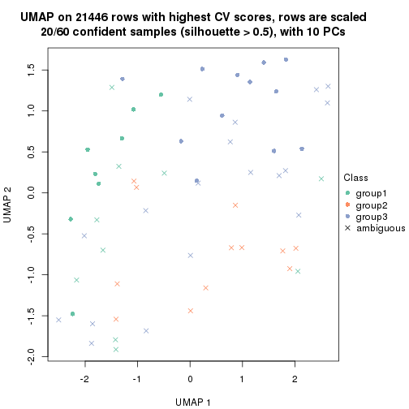</p>

</div>
<div id='tab-CV-pam-dimension-reduction-3'>
<pre><code class="r">dimension_reduction(res, k = 4, method = &quot;UMAP&quot;)
</code></pre>

<p></p>

</div>
<div id='tab-CV-pam-dimension-reduction-4'>
<pre><code class="r">dimension_reduction(res, k = 5, method = &quot;UMAP&quot;)
</code></pre>

<p></p>

</div>
<div id='tab-CV-pam-dimension-reduction-5'>
<pre><code class="r">dimension_reduction(res, k = 6, method = &quot;UMAP&quot;)
</code></pre>

<p></p>

</div>
</div>


Following heatmap shows how subgroups are split when increasing `k`:

```r
collect_classes(res)
```


Test correlation between subgroups and known annotations. If the known
annotation is numeric, one-way ANOVA test is applied, and if the known
annotation is discrete, chi-squared contingency table test is applied.

```r
test_to_known_factors(res)
```

```
#>         n disease.state(p) k
#> CV:pam 40            1.000 2
#> CV:pam 20            0.921 3
#> CV:pam 17            1.000 4
#> CV:pam 27            0.918 5
#> CV:pam 28            0.734 6
```


If matrix rows can be associated to genes, consider to use `GO_Enrichment(res,
...)` to perform function enrichment for the signature genes.


 

---------------------------------------------------


### CV:mclust


The object with results only for a single top-value method and a single partition method 
can be extracted as:

```r
res = res_list["CV", "mclust"]
# you can also extract it by
# res = res_list["CV:mclust"]
```

A summary of `res` and all the functions that can be applied to it:

```r
res
```

```
#> A 'ConsensusPartition' object with k = 2, 3, 4, 5, 6.
#>   On a matrix with 21446 rows and 60 columns.
#>   Top rows (1000, 2000, 3000, 4000, 5000) are extracted by 'CV' method.
#>   Subgroups are detected by 'mclust' method.
#>   Performed in total 1250 partitions by row resampling.
#>   Best k for subgroups seems to be 4.
#> 
#> Following methods can be applied to this 'ConsensusPartition' object:
#>  [1] "cola_report"             "collect_classes"         "collect_plots"          
#>  [4] "collect_stats"           "colnames"                "compare_signatures"     
#>  [7] "consensus_heatmap"       "dimension_reduction"     "functional_enrichment"  
#> [10] "get_anno_col"            "get_anno"                "get_classes"            
#> [13] "get_consensus"           "get_matrix"              "get_membership"         
#> [16] "get_param"               "get_signatures"          "get_stats"              
#> [19] "is_best_k"               "is_stable_k"             "membership_heatmap"     
#> [22] "ncol"                    "nrow"                    "plot_ecdf"              
#> [25] "rownames"                "select_partition_number" "show"                   
#> [28] "suggest_best_k"          "test_to_known_factors"
```

`collect_plots()` function collects all the plots made from `res` for all `k` (number of partitions)
into one single page to provide an easy and fast comparison between different `k`.

```r
collect_plots(res)
```


The plots are:

- The first row: a plot of the ECDF (Empirical cumulative distribution
  function) curves of the consensus matrix for each `k` and the heatmap of
  predicted classes for each `k`.
- The second row: heatmaps of the consensus matrix for each `k`.
- The third row: heatmaps of the membership matrix for each `k`.
- The fouth row: heatmaps of the signatures for each `k`.

All the plots in panels can be made by individual functions and they are
plotted later in this section.

`select_partition_number()` produces several plots showing different
statistics for choosing "optimized" `k`. There are following statistics:

- ECDF curves of the consensus matrix for each `k`;
- 1-PAC. [The PAC
  score](https://en.wikipedia.org/wiki/Consensus_clustering#Over-interpretation_potential_of_consensus_clustering)
  measures the proportion of the ambiguous subgrouping.
- Mean silhouette score.
- Concordance. The mean probability of fiting the consensus class ids in all
  partitions.
- Area increased. Denote $A_k$ as the area under the ECDF curve for current
  `k`, the area increased is defined as $A_k - A_{k-1}$.
- Rand index. The percent of pairs of samples that are both in a same cluster
  or both are not in a same cluster in the partition of k and k-1.
- Jaccard index. The ratio of pairs of samples are both in a same cluster in
  the partition of k and k-1 and the pairs of samples are both in a same
  cluster in the partition k or k-1.

The detailed explanations of these statistics can be found in [the cola
vignette](http://bioconductor.org/packages/devel/bioc/vignettes/cola/inst/doc/cola.html#toc_13).

Generally speaking, lower PAC score, higher mean silhouette score or higher
concordance corresponds to better partition. Rand index and Jaccard index
measure how similar the current partition is compared to partition with `k-1`.
If they are too similar, we won't accept `k` is better than `k-1`.

```r
select_partition_number(res)
```


The numeric values for all these statistics can be obtained by `get_stats()`.

```r
get_stats(res)
```

```
#>   k 1-PAC mean_silhouette concordance area_increased  Rand Jaccard
#> 2 2 0.157           0.424       0.713         0.3888 0.501   0.501
#> 3 3 0.221           0.468       0.714         0.5958 0.746   0.547
#> 4 4 0.492           0.543       0.744         0.1460 0.862   0.645
#> 5 5 0.557           0.492       0.701         0.0909 0.876   0.599
#> 6 6 0.574           0.391       0.654         0.0476 0.893   0.583
```

`suggest_best_k()` suggests the best $k$ based on these statistics. The rules are as follows:

- All $k$ with Jaccard index larger than 0.95 are removed because the increase of
  the partition number does not provides enough extra information. If all $k$ are removed,
  the best $k$ is assigned by `NA`.
- For $k$ with 1-PAC larger than 0.9, the maximal $k$ is taken as the "best k". Other $k$ is called "optional k".
- If it does not fit the second rule. The $k$ with the highest vote of highest
  1-PAC, mean silhouette and concordance is taken as the "best k".

```r
suggest_best_k(res)
```

```
#> [1] 4
```


Following shows the table of the partitions (You need to click the **show/hide
code output** link to see it). The membership matrix (columns with name `p*`)
is inferred by
[`clue::cl_consensus()`](https://www.rdocumentation.org/link/cl_consensus?package=clue)
function with the `SE` method. Basically the value in the membership matrix
represents the probability to belong to a certain group. The finall class
label for an item is determined with the group with highest probability it
belongs to.

In `get_classes()` function, the entropy is calculated from the membership
matrix and the silhouette score is calculated from the consensus matrix.


<script>
$( function() {
	$( '#tabs-CV-mclust-get-classes' ).tabs();
} );
</script>
<div id='tabs-CV-mclust-get-classes'>
<ul>
<li><a href='#tab-CV-mclust-get-classes-1'>k = 2</a></li>
<li><a href='#tab-CV-mclust-get-classes-2'>k = 3</a></li>
<li><a href='#tab-CV-mclust-get-classes-3'>k = 4</a></li>
<li><a href='#tab-CV-mclust-get-classes-4'>k = 5</a></li>
<li><a href='#tab-CV-mclust-get-classes-5'>k = 6</a></li>
</ul>

<div id='tab-CV-mclust-get-classes-1'>
<p><a id='tab-CV-mclust-get-classes-1-a' style='color:#0366d6' href='#'>show/hide code output</a></p>
<pre><code class="r">cbind(get_classes(res, k = 2), get_membership(res, k = 2))
</code></pre>

<pre><code>#&gt;          class entropy silhouette    p1    p2
#&gt; GSM22453     1  0.9580      0.639 0.620 0.380
#&gt; GSM22458     2  0.0672      0.631 0.008 0.992
#&gt; GSM22465     1  0.9686      0.635 0.604 0.396
#&gt; GSM22466     1  0.9635      0.638 0.612 0.388
#&gt; GSM22468     2  0.1184      0.628 0.016 0.984
#&gt; GSM22469     1  0.9866      0.604 0.568 0.432
#&gt; GSM22471     2  0.9909     -0.293 0.444 0.556
#&gt; GSM22472     2  0.1633      0.621 0.024 0.976
#&gt; GSM22474     2  0.1184      0.636 0.016 0.984
#&gt; GSM22476     1  0.8813      0.217 0.700 0.300
#&gt; GSM22477     2  0.3879      0.623 0.076 0.924
#&gt; GSM22478     2  0.6247      0.541 0.156 0.844
#&gt; GSM22481     2  0.9970     -0.370 0.468 0.532
#&gt; GSM22484     2  0.6048      0.575 0.148 0.852
#&gt; GSM22485     2  0.8207      0.512 0.256 0.744
#&gt; GSM22487     2  0.7376      0.507 0.208 0.792
#&gt; GSM22488     2  0.8207      0.512 0.256 0.744
#&gt; GSM22489     1  0.9996     -0.197 0.512 0.488
#&gt; GSM22490     2  0.0000      0.634 0.000 1.000
#&gt; GSM22492     2  0.8661      0.142 0.288 0.712
#&gt; GSM22493     2  0.7815      0.529 0.232 0.768
#&gt; GSM22494     1  0.9580      0.639 0.620 0.380
#&gt; GSM22497     1  0.9580      0.639 0.620 0.380
#&gt; GSM22498     1  0.9881      0.599 0.564 0.436
#&gt; GSM22501     1  0.5842      0.430 0.860 0.140
#&gt; GSM22502     2  0.0000      0.634 0.000 1.000
#&gt; GSM22503     2  0.9608     -0.156 0.384 0.616
#&gt; GSM22504     2  0.1633      0.621 0.024 0.976
#&gt; GSM22505     1  0.9732      0.630 0.596 0.404
#&gt; GSM22506     1  1.0000      0.444 0.504 0.496
#&gt; GSM22507     2  0.9954     -0.345 0.460 0.540
#&gt; GSM22508     2  0.0000      0.634 0.000 1.000
#&gt; GSM22449     2  0.8499      0.490 0.276 0.724
#&gt; GSM22450     1  0.9580      0.639 0.620 0.380
#&gt; GSM22451     1  0.9833      0.613 0.576 0.424
#&gt; GSM22452     1  0.9323      0.616 0.652 0.348
#&gt; GSM22454     1  0.9850      0.610 0.572 0.428
#&gt; GSM22455     2  0.6343      0.588 0.160 0.840
#&gt; GSM22456     2  0.6343      0.592 0.160 0.840
#&gt; GSM22457     2  0.9933     -0.324 0.452 0.548
#&gt; GSM22459     1  0.9998     -0.179 0.508 0.492
#&gt; GSM22460     2  0.7219      0.526 0.200 0.800
#&gt; GSM22461     2  0.0672      0.631 0.008 0.992
#&gt; GSM22462     1  0.9580      0.639 0.620 0.380
#&gt; GSM22463     1  0.5294      0.441 0.880 0.120
#&gt; GSM22464     2  0.2423      0.635 0.040 0.960
#&gt; GSM22467     1  0.9580      0.639 0.620 0.380
#&gt; GSM22470     1  0.5294      0.441 0.880 0.120
#&gt; GSM22473     2  0.9909      0.202 0.444 0.556
#&gt; GSM22475     1  0.6531      0.411 0.832 0.168
#&gt; GSM22479     2  0.4939      0.561 0.108 0.892
#&gt; GSM22480     2  0.8555      0.378 0.280 0.720
#&gt; GSM22482     1  0.7056      0.379 0.808 0.192
#&gt; GSM22483     2  0.9922     -0.330 0.448 0.552
#&gt; GSM22486     1  0.9850      0.610 0.572 0.428
#&gt; GSM22491     1  0.9608      0.638 0.616 0.384
#&gt; GSM22495     2  0.9522      0.339 0.372 0.628
#&gt; GSM22496     1  0.9850      0.610 0.572 0.428
#&gt; GSM22499     2  0.9896     -0.297 0.440 0.560
#&gt; GSM22500     2  0.0938      0.629 0.012 0.988
</code></pre>

<script>
$('#tab-CV-mclust-get-classes-1-a').parent().next().next().hide();
$('#tab-CV-mclust-get-classes-1-a').click(function(){
  $('#tab-CV-mclust-get-classes-1-a').parent().next().next().toggle();
  return(false);
});
</script>
</div>

<div id='tab-CV-mclust-get-classes-2'>
<p><a id='tab-CV-mclust-get-classes-2-a' style='color:#0366d6' href='#'>show/hide code output</a></p>
<pre><code class="r">cbind(get_classes(res, k = 3), get_membership(res, k = 3))
</code></pre>

<pre><code>#&gt;          class entropy silhouette    p1    p2    p3
#&gt; GSM22453     1  0.2187     0.6796 0.948 0.028 0.024
#&gt; GSM22458     2  0.6027     0.5214 0.016 0.712 0.272
#&gt; GSM22465     1  0.1399     0.6759 0.968 0.028 0.004
#&gt; GSM22466     1  0.3623     0.6759 0.896 0.032 0.072
#&gt; GSM22468     2  0.1620     0.5787 0.024 0.964 0.012
#&gt; GSM22469     1  0.7227     0.5760 0.704 0.096 0.200
#&gt; GSM22471     2  0.9589     0.1309 0.376 0.424 0.200
#&gt; GSM22472     2  0.0747     0.5691 0.000 0.984 0.016
#&gt; GSM22474     2  0.5956     0.5219 0.016 0.720 0.264
#&gt; GSM22476     3  0.4966     0.5808 0.100 0.060 0.840
#&gt; GSM22477     2  0.2414     0.5626 0.020 0.940 0.040
#&gt; GSM22478     2  0.4636     0.5481 0.116 0.848 0.036
#&gt; GSM22481     1  0.8868     0.3770 0.576 0.228 0.196
#&gt; GSM22484     2  0.4121     0.5249 0.108 0.868 0.024
#&gt; GSM22485     1  0.8059    -0.0958 0.492 0.444 0.064
#&gt; GSM22487     1  0.8050    -0.0380 0.500 0.436 0.064
#&gt; GSM22488     1  0.8045    -0.0608 0.504 0.432 0.064
#&gt; GSM22489     3  0.6553     0.5392 0.008 0.412 0.580
#&gt; GSM22490     2  0.4810     0.5783 0.028 0.832 0.140
#&gt; GSM22492     2  0.8109     0.4737 0.108 0.620 0.272
#&gt; GSM22493     2  0.8206     0.1300 0.448 0.480 0.072
#&gt; GSM22494     1  0.1774     0.6662 0.960 0.024 0.016
#&gt; GSM22497     1  0.1525     0.6758 0.964 0.004 0.032
#&gt; GSM22498     1  0.6710     0.5996 0.732 0.072 0.196
#&gt; GSM22501     3  0.5180     0.5766 0.156 0.032 0.812
#&gt; GSM22502     2  0.3610     0.5794 0.016 0.888 0.096
#&gt; GSM22503     2  0.8889     0.4348 0.164 0.560 0.276
#&gt; GSM22504     2  0.2050     0.5708 0.020 0.952 0.028
#&gt; GSM22505     1  0.5940     0.6063 0.760 0.036 0.204
#&gt; GSM22506     1  0.7303     0.5514 0.680 0.244 0.076
#&gt; GSM22507     1  0.8911     0.3781 0.572 0.224 0.204
#&gt; GSM22508     2  0.5506     0.5446 0.016 0.764 0.220
#&gt; GSM22449     2  0.9792     0.0232 0.372 0.392 0.236
#&gt; GSM22450     1  0.4174     0.6607 0.872 0.092 0.036
#&gt; GSM22451     1  0.8845     0.4091 0.576 0.240 0.184
#&gt; GSM22452     1  0.2173     0.6574 0.944 0.008 0.048
#&gt; GSM22454     1  0.3832     0.6744 0.888 0.076 0.036
#&gt; GSM22455     2  0.4586     0.4782 0.048 0.856 0.096
#&gt; GSM22456     2  0.3797     0.5225 0.052 0.892 0.056
#&gt; GSM22457     2  0.9804     0.1885 0.336 0.416 0.248
#&gt; GSM22459     3  0.6969     0.5614 0.024 0.380 0.596
#&gt; GSM22460     2  0.7742     0.0905 0.356 0.584 0.060
#&gt; GSM22461     2  0.1031     0.5656 0.000 0.976 0.024
#&gt; GSM22462     1  0.6247     0.5921 0.744 0.212 0.044
#&gt; GSM22463     3  0.8340     0.5828 0.144 0.236 0.620
#&gt; GSM22464     2  0.6007     0.5596 0.044 0.764 0.192
#&gt; GSM22467     1  0.5726     0.6067 0.760 0.216 0.024
#&gt; GSM22470     3  0.8080     0.5929 0.128 0.232 0.640
#&gt; GSM22473     3  0.6717     0.3592 0.020 0.352 0.628
#&gt; GSM22475     3  0.8668     0.5663 0.132 0.304 0.564
#&gt; GSM22479     2  0.7983     0.4778 0.104 0.632 0.264
#&gt; GSM22480     2  0.6452     0.3867 0.252 0.712 0.036
#&gt; GSM22482     3  0.5348     0.5591 0.176 0.028 0.796
#&gt; GSM22483     2  0.7864     0.1526 0.332 0.596 0.072
#&gt; GSM22486     1  0.6807     0.6286 0.736 0.092 0.172
#&gt; GSM22491     1  0.2434     0.6610 0.940 0.024 0.036
#&gt; GSM22495     3  0.8091     0.1483 0.080 0.348 0.572
#&gt; GSM22496     1  0.7531     0.5425 0.672 0.236 0.092
#&gt; GSM22499     2  0.7741     0.0424 0.376 0.568 0.056
#&gt; GSM22500     2  0.6758     0.5574 0.072 0.728 0.200
</code></pre>

<script>
$('#tab-CV-mclust-get-classes-2-a').parent().next().next().hide();
$('#tab-CV-mclust-get-classes-2-a').click(function(){
  $('#tab-CV-mclust-get-classes-2-a').parent().next().next().toggle();
  return(false);
});
</script>
</div>

<div id='tab-CV-mclust-get-classes-3'>
<p><a id='tab-CV-mclust-get-classes-3-a' style='color:#0366d6' href='#'>show/hide code output</a></p>
<pre><code class="r">cbind(get_classes(res, k = 4), get_membership(res, k = 4))
</code></pre>

<pre><code>#&gt;          class entropy silhouette    p1    p2    p3    p4
#&gt; GSM22453     1  0.0376     0.8734 0.992 0.004 0.000 0.004
#&gt; GSM22458     2  0.4595     0.6421 0.000 0.776 0.184 0.040
#&gt; GSM22465     1  0.0524     0.8732 0.988 0.008 0.000 0.004
#&gt; GSM22466     1  0.0672     0.8739 0.984 0.008 0.000 0.008
#&gt; GSM22468     2  0.2796     0.5990 0.000 0.892 0.016 0.092
#&gt; GSM22469     1  0.1004     0.8690 0.972 0.024 0.000 0.004
#&gt; GSM22471     2  0.7105     0.3686 0.336 0.556 0.088 0.020
#&gt; GSM22472     2  0.4382     0.5721 0.000 0.704 0.000 0.296
#&gt; GSM22474     2  0.4418     0.6441 0.000 0.784 0.184 0.032
#&gt; GSM22476     3  0.4733     0.5901 0.044 0.172 0.780 0.004
#&gt; GSM22477     2  0.4713     0.5116 0.000 0.640 0.000 0.360
#&gt; GSM22478     2  0.5446     0.5444 0.044 0.680 0.000 0.276
#&gt; GSM22481     1  0.4375     0.6675 0.788 0.180 0.000 0.032
#&gt; GSM22484     2  0.6306     0.0411 0.020 0.548 0.028 0.404
#&gt; GSM22485     4  0.9463     0.4615 0.172 0.188 0.216 0.424
#&gt; GSM22487     2  0.4462     0.3782 0.256 0.736 0.004 0.004
#&gt; GSM22488     4  0.9488     0.4601 0.176 0.188 0.216 0.420
#&gt; GSM22489     3  0.6925     0.5182 0.000 0.128 0.544 0.328
#&gt; GSM22490     2  0.1733     0.6119 0.000 0.948 0.028 0.024
#&gt; GSM22492     2  0.5083     0.6411 0.040 0.760 0.188 0.012
#&gt; GSM22493     4  0.9289     0.4618 0.148 0.188 0.216 0.448
#&gt; GSM22494     1  0.0469     0.8743 0.988 0.000 0.000 0.012
#&gt; GSM22497     1  0.0376     0.8743 0.992 0.004 0.000 0.004
#&gt; GSM22498     1  0.2198     0.8486 0.920 0.008 0.000 0.072
#&gt; GSM22501     3  0.4733     0.5490 0.172 0.044 0.780 0.004
#&gt; GSM22502     2  0.3224     0.6632 0.000 0.864 0.120 0.016
#&gt; GSM22503     2  0.5586     0.6240 0.076 0.732 0.184 0.008
#&gt; GSM22504     2  0.4477     0.5584 0.000 0.688 0.000 0.312
#&gt; GSM22505     1  0.1854     0.8657 0.940 0.012 0.000 0.048
#&gt; GSM22506     1  0.5147     0.1498 0.536 0.004 0.000 0.460
#&gt; GSM22507     1  0.4375     0.6673 0.788 0.180 0.000 0.032
#&gt; GSM22508     2  0.4466     0.6441 0.000 0.784 0.180 0.036
#&gt; GSM22449     4  0.7895     0.3730 0.020 0.184 0.292 0.504
#&gt; GSM22450     1  0.0817     0.8718 0.976 0.000 0.000 0.024
#&gt; GSM22451     4  0.6253     0.0503 0.396 0.000 0.060 0.544
#&gt; GSM22452     1  0.2207     0.8390 0.928 0.004 0.056 0.012
#&gt; GSM22454     1  0.0804     0.8739 0.980 0.008 0.000 0.012
#&gt; GSM22455     4  0.6564    -0.1404 0.000 0.380 0.084 0.536
#&gt; GSM22456     2  0.6506    -0.1126 0.000 0.472 0.072 0.456
#&gt; GSM22457     2  0.7957     0.4443 0.236 0.544 0.184 0.036
#&gt; GSM22459     3  0.7295     0.5799 0.036 0.100 0.596 0.268
#&gt; GSM22460     4  0.3841     0.2740 0.144 0.004 0.020 0.832
#&gt; GSM22461     2  0.4406     0.5638 0.000 0.700 0.000 0.300
#&gt; GSM22462     1  0.1118     0.8700 0.964 0.000 0.000 0.036
#&gt; GSM22463     3  0.6214     0.5169 0.056 0.000 0.536 0.408
#&gt; GSM22464     2  0.1970     0.5998 0.000 0.932 0.008 0.060
#&gt; GSM22467     1  0.0592     0.8735 0.984 0.000 0.000 0.016
#&gt; GSM22470     3  0.6111     0.5327 0.052 0.000 0.556 0.392
#&gt; GSM22473     3  0.4799     0.5011 0.004 0.284 0.704 0.008
#&gt; GSM22475     3  0.7132     0.5479 0.072 0.032 0.564 0.332
#&gt; GSM22479     2  0.5139     0.6437 0.024 0.760 0.188 0.028
#&gt; GSM22480     4  0.6985     0.0983 0.140 0.312 0.000 0.548
#&gt; GSM22482     3  0.5022     0.5324 0.192 0.048 0.756 0.004
#&gt; GSM22483     4  0.7772    -0.1390 0.240 0.368 0.000 0.392
#&gt; GSM22486     1  0.2452     0.8459 0.908 0.004 0.004 0.084
#&gt; GSM22491     1  0.1302     0.8675 0.956 0.000 0.000 0.044
#&gt; GSM22495     3  0.5887     0.3199 0.040 0.340 0.616 0.004
#&gt; GSM22496     1  0.4955     0.2020 0.556 0.000 0.000 0.444
#&gt; GSM22499     2  0.7920    -0.0332 0.316 0.344 0.000 0.340
#&gt; GSM22500     2  0.2302     0.6517 0.008 0.924 0.060 0.008
</code></pre>

<script>
$('#tab-CV-mclust-get-classes-3-a').parent().next().next().hide();
$('#tab-CV-mclust-get-classes-3-a').click(function(){
  $('#tab-CV-mclust-get-classes-3-a').parent().next().next().toggle();
  return(false);
});
</script>
</div>

<div id='tab-CV-mclust-get-classes-4'>
<p><a id='tab-CV-mclust-get-classes-4-a' style='color:#0366d6' href='#'>show/hide code output</a></p>
<pre><code class="r">cbind(get_classes(res, k = 5), get_membership(res, k = 5))
</code></pre>

<pre><code>#&gt;          class entropy silhouette    p1    p2    p3    p4    p5
#&gt; GSM22453     1  0.3216    0.77013 0.848 0.044 0.108 0.000 0.000
#&gt; GSM22458     2  0.3796    0.37416 0.000 0.700 0.000 0.300 0.000
#&gt; GSM22465     1  0.3532    0.76850 0.840 0.044 0.108 0.004 0.004
#&gt; GSM22466     1  0.3216    0.76994 0.848 0.044 0.108 0.000 0.000
#&gt; GSM22468     4  0.3452    0.56961 0.000 0.244 0.000 0.756 0.000
#&gt; GSM22469     1  0.4587    0.73906 0.780 0.092 0.104 0.024 0.000
#&gt; GSM22471     2  0.2792    0.65224 0.040 0.884 0.000 0.072 0.004
#&gt; GSM22472     4  0.3177    0.59176 0.000 0.208 0.000 0.792 0.000
#&gt; GSM22474     2  0.4238    0.31305 0.000 0.628 0.004 0.368 0.000
#&gt; GSM22476     5  0.4470    0.30831 0.004 0.396 0.004 0.000 0.596
#&gt; GSM22477     4  0.4815    0.59245 0.004 0.164 0.016 0.752 0.064
#&gt; GSM22478     4  0.6928    0.00655 0.004 0.356 0.000 0.356 0.284
#&gt; GSM22481     1  0.6470    0.28319 0.488 0.392 0.088 0.032 0.000
#&gt; GSM22484     4  0.4374    0.47315 0.016 0.032 0.176 0.772 0.004
#&gt; GSM22485     3  0.4652    0.89037 0.144 0.008 0.756 0.092 0.000
#&gt; GSM22487     2  0.7086    0.35186 0.228 0.556 0.128 0.088 0.000
#&gt; GSM22488     3  0.4693    0.88888 0.148 0.008 0.752 0.092 0.000
#&gt; GSM22489     5  0.5930    0.05594 0.004 0.000 0.092 0.404 0.500
#&gt; GSM22490     4  0.6058    0.57405 0.000 0.232 0.040 0.636 0.092
#&gt; GSM22492     2  0.2210    0.65810 0.004 0.916 0.008 0.064 0.008
#&gt; GSM22493     3  0.4750    0.87966 0.120 0.016 0.760 0.104 0.000
#&gt; GSM22494     1  0.0404    0.78485 0.988 0.012 0.000 0.000 0.000
#&gt; GSM22497     1  0.0451    0.78380 0.988 0.008 0.000 0.000 0.004
#&gt; GSM22498     1  0.4531    0.74989 0.780 0.068 0.128 0.024 0.000
#&gt; GSM22501     5  0.4585    0.30846 0.004 0.396 0.008 0.000 0.592
#&gt; GSM22502     4  0.4507    0.52485 0.000 0.340 0.012 0.644 0.004
#&gt; GSM22503     2  0.1124    0.66253 0.004 0.960 0.000 0.036 0.000
#&gt; GSM22504     4  0.3300    0.59290 0.000 0.204 0.000 0.792 0.004
#&gt; GSM22505     1  0.1518    0.77381 0.944 0.004 0.048 0.000 0.004
#&gt; GSM22506     1  0.7385    0.01026 0.408 0.004 0.112 0.072 0.404
#&gt; GSM22507     1  0.6142    0.58442 0.632 0.232 0.088 0.048 0.000
#&gt; GSM22508     4  0.4446    0.08347 0.000 0.476 0.004 0.520 0.000
#&gt; GSM22449     3  0.5287    0.68794 0.020 0.000 0.716 0.144 0.120
#&gt; GSM22450     1  0.0404    0.78141 0.988 0.000 0.000 0.000 0.012
#&gt; GSM22451     5  0.7203    0.04689 0.284 0.000 0.096 0.104 0.516
#&gt; GSM22452     1  0.1894    0.73282 0.920 0.000 0.008 0.000 0.072
#&gt; GSM22454     1  0.3497    0.76954 0.840 0.044 0.108 0.008 0.000
#&gt; GSM22455     4  0.4587    0.50063 0.008 0.028 0.044 0.784 0.136
#&gt; GSM22456     4  0.4498    0.49909 0.008 0.028 0.044 0.792 0.128
#&gt; GSM22457     2  0.4017    0.63202 0.072 0.816 0.000 0.096 0.016
#&gt; GSM22459     5  0.2770    0.46594 0.004 0.000 0.008 0.124 0.864
#&gt; GSM22460     5  0.8027   -0.22375 0.072 0.008 0.312 0.220 0.388
#&gt; GSM22461     4  0.4295    0.58873 0.000 0.236 0.004 0.732 0.028
#&gt; GSM22462     1  0.1907    0.76347 0.928 0.000 0.028 0.000 0.044
#&gt; GSM22463     5  0.2597    0.44436 0.004 0.000 0.120 0.004 0.872
#&gt; GSM22464     4  0.4867    0.46227 0.000 0.308 0.036 0.652 0.004
#&gt; GSM22467     1  0.0727    0.78235 0.980 0.000 0.004 0.004 0.012
#&gt; GSM22470     5  0.2170    0.46170 0.004 0.000 0.088 0.004 0.904
#&gt; GSM22473     4  0.5914    0.15811 0.000 0.080 0.008 0.504 0.408
#&gt; GSM22475     5  0.1121    0.47154 0.004 0.004 0.016 0.008 0.968
#&gt; GSM22479     2  0.2339    0.65659 0.004 0.908 0.008 0.072 0.008
#&gt; GSM22480     4  0.8464    0.00103 0.080 0.048 0.148 0.400 0.324
#&gt; GSM22482     5  0.5271    0.30304 0.036 0.392 0.008 0.000 0.564
#&gt; GSM22483     5  0.7195   -0.19466 0.068 0.388 0.000 0.112 0.432
#&gt; GSM22486     1  0.2806    0.75204 0.888 0.004 0.076 0.024 0.008
#&gt; GSM22491     1  0.1282    0.78140 0.952 0.004 0.044 0.000 0.000
#&gt; GSM22495     5  0.6845    0.07637 0.004 0.400 0.008 0.180 0.408
#&gt; GSM22496     1  0.6400    0.13592 0.492 0.000 0.048 0.060 0.400
#&gt; GSM22499     2  0.7362    0.13026 0.092 0.432 0.012 0.068 0.396
#&gt; GSM22500     2  0.4635    0.46109 0.048 0.716 0.000 0.232 0.004
</code></pre>

<script>
$('#tab-CV-mclust-get-classes-4-a').parent().next().next().hide();
$('#tab-CV-mclust-get-classes-4-a').click(function(){
  $('#tab-CV-mclust-get-classes-4-a').parent().next().next().toggle();
  return(false);
});
</script>
</div>

<div id='tab-CV-mclust-get-classes-5'>
<p><a id='tab-CV-mclust-get-classes-5-a' style='color:#0366d6' href='#'>show/hide code output</a></p>
<pre><code class="r">cbind(get_classes(res, k = 6), get_membership(res, k = 6))
</code></pre>

<pre><code>#&gt;          class entropy silhouette    p1    p2    p3    p4    p5    p6
#&gt; GSM22453     1  0.0717   0.650278 0.976 0.000 0.016 0.000 0.000 0.008
#&gt; GSM22458     2  0.4691   0.200800 0.000 0.600 0.016 0.356 0.028 0.000
#&gt; GSM22465     1  0.0603   0.642895 0.980 0.004 0.000 0.000 0.000 0.016
#&gt; GSM22466     1  0.0291   0.647563 0.992 0.000 0.000 0.000 0.004 0.004
#&gt; GSM22468     4  0.3155   0.556013 0.000 0.132 0.004 0.828 0.036 0.000
#&gt; GSM22469     1  0.3789   0.569825 0.836 0.064 0.008 0.036 0.040 0.016
#&gt; GSM22471     2  0.4469   0.507739 0.004 0.724 0.008 0.072 0.192 0.000
#&gt; GSM22472     4  0.1501   0.590362 0.000 0.076 0.000 0.924 0.000 0.000
#&gt; GSM22474     2  0.4492  -0.119889 0.000 0.496 0.008 0.480 0.016 0.000
#&gt; GSM22476     5  0.3192   0.554346 0.000 0.216 0.004 0.000 0.776 0.004
#&gt; GSM22477     4  0.2944   0.601187 0.012 0.028 0.060 0.876 0.000 0.024
#&gt; GSM22478     4  0.5029   0.447458 0.004 0.128 0.200 0.664 0.004 0.000
#&gt; GSM22481     1  0.6340   0.189877 0.540 0.280 0.008 0.052 0.120 0.000
#&gt; GSM22484     4  0.6279   0.451496 0.024 0.052 0.016 0.592 0.052 0.264
#&gt; GSM22485     6  0.2250   0.744577 0.092 0.000 0.020 0.000 0.000 0.888
#&gt; GSM22487     1  0.7101   0.015016 0.500 0.260 0.008 0.064 0.148 0.020
#&gt; GSM22488     6  0.2250   0.744577 0.092 0.000 0.020 0.000 0.000 0.888
#&gt; GSM22489     4  0.6153  -0.189329 0.000 0.004 0.252 0.404 0.340 0.000
#&gt; GSM22490     4  0.6804   0.350822 0.000 0.292 0.124 0.500 0.064 0.020
#&gt; GSM22492     2  0.4718   0.486935 0.000 0.712 0.036 0.044 0.204 0.004
#&gt; GSM22493     6  0.2462   0.741768 0.076 0.008 0.016 0.008 0.000 0.892
#&gt; GSM22494     1  0.3230   0.622664 0.776 0.000 0.212 0.000 0.000 0.012
#&gt; GSM22497     1  0.3245   0.611098 0.764 0.000 0.228 0.000 0.000 0.008
#&gt; GSM22498     1  0.2705   0.619969 0.888 0.024 0.008 0.012 0.004 0.064
#&gt; GSM22501     5  0.3647   0.557904 0.004 0.216 0.012 0.000 0.760 0.008
#&gt; GSM22502     2  0.5358   0.115571 0.000 0.596 0.036 0.316 0.048 0.004
#&gt; GSM22503     2  0.3168   0.513272 0.000 0.804 0.000 0.024 0.172 0.000
#&gt; GSM22504     4  0.1701   0.592365 0.000 0.072 0.008 0.920 0.000 0.000
#&gt; GSM22505     1  0.4576   0.586490 0.692 0.000 0.228 0.000 0.008 0.072
#&gt; GSM22506     3  0.7432   0.182805 0.216 0.000 0.420 0.204 0.004 0.156
#&gt; GSM22507     1  0.6516   0.277700 0.548 0.240 0.008 0.072 0.132 0.000
#&gt; GSM22508     4  0.4769   0.228180 0.000 0.364 0.000 0.576 0.060 0.000
#&gt; GSM22449     6  0.3989   0.628014 0.012 0.000 0.144 0.016 0.040 0.788
#&gt; GSM22450     1  0.5467   0.426355 0.556 0.000 0.320 0.000 0.116 0.008
#&gt; GSM22451     3  0.4536   0.315293 0.036 0.000 0.756 0.012 0.048 0.148
#&gt; GSM22452     1  0.3820   0.568576 0.700 0.000 0.284 0.000 0.008 0.008
#&gt; GSM22454     1  0.0858   0.639030 0.968 0.004 0.000 0.000 0.000 0.028
#&gt; GSM22455     4  0.5923   0.495086 0.004 0.008 0.168 0.648 0.072 0.100
#&gt; GSM22456     4  0.6199   0.511912 0.004 0.020 0.164 0.636 0.076 0.100
#&gt; GSM22457     2  0.5895   0.474006 0.072 0.640 0.012 0.088 0.188 0.000
#&gt; GSM22459     5  0.6058   0.194264 0.000 0.000 0.304 0.240 0.452 0.004
#&gt; GSM22460     6  0.7120   0.151339 0.056 0.000 0.292 0.256 0.008 0.388
#&gt; GSM22461     4  0.2798   0.585855 0.000 0.112 0.036 0.852 0.000 0.000
#&gt; GSM22462     3  0.5799  -0.209586 0.408 0.000 0.460 0.000 0.116 0.016
#&gt; GSM22463     3  0.4062  -0.079479 0.000 0.004 0.652 0.008 0.332 0.004
#&gt; GSM22464     4  0.5518   0.306388 0.000 0.332 0.000 0.564 0.072 0.032
#&gt; GSM22467     1  0.5609   0.433282 0.556 0.000 0.312 0.008 0.120 0.004
#&gt; GSM22470     3  0.3850  -0.091310 0.000 0.004 0.652 0.004 0.340 0.000
#&gt; GSM22473     5  0.7382   0.209548 0.000 0.196 0.140 0.212 0.444 0.008
#&gt; GSM22475     5  0.3972   0.223111 0.000 0.016 0.300 0.000 0.680 0.004
#&gt; GSM22479     2  0.4142   0.491099 0.000 0.744 0.028 0.028 0.200 0.000
#&gt; GSM22480     4  0.7498   0.192665 0.068 0.048 0.180 0.452 0.000 0.252
#&gt; GSM22482     5  0.4444   0.540067 0.040 0.212 0.016 0.000 0.724 0.008
#&gt; GSM22483     3  0.6679   0.037965 0.076 0.312 0.480 0.128 0.004 0.000
#&gt; GSM22486     1  0.6278   0.469162 0.552 0.000 0.284 0.012 0.056 0.096
#&gt; GSM22491     1  0.4110   0.601800 0.712 0.000 0.236 0.000 0.000 0.052
#&gt; GSM22495     5  0.6433   0.490664 0.000 0.216 0.144 0.076 0.560 0.004
#&gt; GSM22496     3  0.5000   0.266273 0.272 0.000 0.644 0.024 0.000 0.060
#&gt; GSM22499     2  0.6914  -0.000632 0.124 0.412 0.384 0.060 0.020 0.000
#&gt; GSM22500     2  0.6474   0.273089 0.172 0.552 0.004 0.204 0.068 0.000
</code></pre>

<script>
$('#tab-CV-mclust-get-classes-5-a').parent().next().next().hide();
$('#tab-CV-mclust-get-classes-5-a').click(function(){
  $('#tab-CV-mclust-get-classes-5-a').parent().next().next().toggle();
  return(false);
});
</script>
</div>
</div>

Heatmaps for the consensus matrix. It visualizes the probability of two
samples to be in a same group.


<script>
$( function() {
	$( '#tabs-CV-mclust-consensus-heatmap' ).tabs();
} );
</script>
<div id='tabs-CV-mclust-consensus-heatmap'>
<ul>
<li><a href='#tab-CV-mclust-consensus-heatmap-1'>k = 2</a></li>
<li><a href='#tab-CV-mclust-consensus-heatmap-2'>k = 3</a></li>
<li><a href='#tab-CV-mclust-consensus-heatmap-3'>k = 4</a></li>
<li><a href='#tab-CV-mclust-consensus-heatmap-4'>k = 5</a></li>
<li><a href='#tab-CV-mclust-consensus-heatmap-5'>k = 6</a></li>
</ul>
<div id='tab-CV-mclust-consensus-heatmap-1'>
<pre><code class="r">consensus_heatmap(res, k = 2)
</code></pre>

<p></p>

</div>
<div id='tab-CV-mclust-consensus-heatmap-2'>
<pre><code class="r">consensus_heatmap(res, k = 3)
</code></pre>

<p></p>

</div>
<div id='tab-CV-mclust-consensus-heatmap-3'>
<pre><code class="r">consensus_heatmap(res, k = 4)
</code></pre>

<p></p>

</div>
<div id='tab-CV-mclust-consensus-heatmap-4'>
<pre><code class="r">consensus_heatmap(res, k = 5)
</code></pre>

<p></p>

</div>
<div id='tab-CV-mclust-consensus-heatmap-5'>
<pre><code class="r">consensus_heatmap(res, k = 6)
</code></pre>

<p></p>

</div>
</div>

Heatmaps for the membership of samples in all partitions to see how consistent they are:


<script>
$( function() {
	$( '#tabs-CV-mclust-membership-heatmap' ).tabs();
} );
</script>
<div id='tabs-CV-mclust-membership-heatmap'>
<ul>
<li><a href='#tab-CV-mclust-membership-heatmap-1'>k = 2</a></li>
<li><a href='#tab-CV-mclust-membership-heatmap-2'>k = 3</a></li>
<li><a href='#tab-CV-mclust-membership-heatmap-3'>k = 4</a></li>
<li><a href='#tab-CV-mclust-membership-heatmap-4'>k = 5</a></li>
<li><a href='#tab-CV-mclust-membership-heatmap-5'>k = 6</a></li>
</ul>
<div id='tab-CV-mclust-membership-heatmap-1'>
<pre><code class="r">membership_heatmap(res, k = 2)
</code></pre>

<p></p>

</div>
<div id='tab-CV-mclust-membership-heatmap-2'>
<pre><code class="r">membership_heatmap(res, k = 3)
</code></pre>

<p></p>

</div>
<div id='tab-CV-mclust-membership-heatmap-3'>
<pre><code class="r">membership_heatmap(res, k = 4)
</code></pre>

<p></p>

</div>
<div id='tab-CV-mclust-membership-heatmap-4'>
<pre><code class="r">membership_heatmap(res, k = 5)
</code></pre>

<p></p>

</div>
<div id='tab-CV-mclust-membership-heatmap-5'>
<pre><code class="r">membership_heatmap(res, k = 6)
</code></pre>

<p></p>

</div>
</div>

As soon as we have had the classes for columns, we can look for signatures
which are significantly different between classes which can be candidate marks
for certain classes. Following are the heatmaps for signatures.


Signature heatmaps where rows are scaled:


<script>
$( function() {
	$( '#tabs-CV-mclust-get-signatures' ).tabs();
} );
</script>
<div id='tabs-CV-mclust-get-signatures'>
<ul>
<li><a href='#tab-CV-mclust-get-signatures-1'>k = 2</a></li>
<li><a href='#tab-CV-mclust-get-signatures-2'>k = 3</a></li>
<li><a href='#tab-CV-mclust-get-signatures-3'>k = 4</a></li>
<li><a href='#tab-CV-mclust-get-signatures-4'>k = 5</a></li>
<li><a href='#tab-CV-mclust-get-signatures-5'>k = 6</a></li>
</ul>
<div id='tab-CV-mclust-get-signatures-1'>
<pre><code class="r">get_signatures(res, k = 2)
</code></pre>

<p></p>

</div>
<div id='tab-CV-mclust-get-signatures-2'>
<pre><code class="r">get_signatures(res, k = 3)
</code></pre>

<p></p>

</div>
<div id='tab-CV-mclust-get-signatures-3'>
<pre><code class="r">get_signatures(res, k = 4)
</code></pre>

<p></p>

</div>
<div id='tab-CV-mclust-get-signatures-4'>
<pre><code class="r">get_signatures(res, k = 5)
</code></pre>

<p></p>

</div>
<div id='tab-CV-mclust-get-signatures-5'>
<pre><code class="r">get_signatures(res, k = 6)
</code></pre>

<p></p>

</div>
</div>


Signature heatmaps where rows are not scaled:


<script>
$( function() {
	$( '#tabs-CV-mclust-get-signatures-no-scale' ).tabs();
} );
</script>
<div id='tabs-CV-mclust-get-signatures-no-scale'>
<ul>
<li><a href='#tab-CV-mclust-get-signatures-no-scale-1'>k = 2</a></li>
<li><a href='#tab-CV-mclust-get-signatures-no-scale-2'>k = 3</a></li>
<li><a href='#tab-CV-mclust-get-signatures-no-scale-3'>k = 4</a></li>
<li><a href='#tab-CV-mclust-get-signatures-no-scale-4'>k = 5</a></li>
<li><a href='#tab-CV-mclust-get-signatures-no-scale-5'>k = 6</a></li>
</ul>
<div id='tab-CV-mclust-get-signatures-no-scale-1'>
<pre><code class="r">get_signatures(res, k = 2, scale_rows = FALSE)
</code></pre>

<p></p>

</div>
<div id='tab-CV-mclust-get-signatures-no-scale-2'>
<pre><code class="r">get_signatures(res, k = 3, scale_rows = FALSE)
</code></pre>

<p></p>

</div>
<div id='tab-CV-mclust-get-signatures-no-scale-3'>
<pre><code class="r">get_signatures(res, k = 4, scale_rows = FALSE)
</code></pre>

<p></p>

</div>
<div id='tab-CV-mclust-get-signatures-no-scale-4'>
<pre><code class="r">get_signatures(res, k = 5, scale_rows = FALSE)
</code></pre>

<p></p>

</div>
<div id='tab-CV-mclust-get-signatures-no-scale-5'>
<pre><code class="r">get_signatures(res, k = 6, scale_rows = FALSE)
</code></pre>

<p>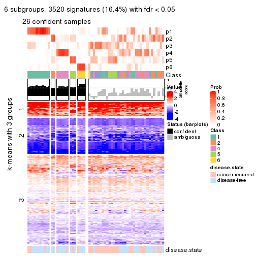</p>

</div>
</div>


Compare the overlap of signatures from different k:

```r
compare_signatures(res)
```


`get_signature()` returns a data frame invisibly. TO get the list of signatures, the function
call should be assigned to a variable explicitly. In following code, if `plot` argument is set
to `FALSE`, no heatmap is plotted while only the differential analysis is performed.

```r
# code only for demonstration
tb = get_signature(res, k = ..., plot = FALSE)
```

An example of the output of `tb` is:

```
#>   which_row         fdr    mean_1    mean_2 scaled_mean_1 scaled_mean_2 km
#> 1        38 0.042760348  8.373488  9.131774    -0.5533452     0.5164555  1
#> 2        40 0.018707592  7.106213  8.469186    -0.6173731     0.5762149  1
#> 3        55 0.019134737 10.221463 11.207825    -0.6159697     0.5749050  1
#> 4        59 0.006059896  5.921854  7.869574    -0.6899429     0.6439467  1
#> 5        60 0.018055526  8.928898 10.211722    -0.6204761     0.5791110  1
#> 6        98 0.009384629 15.714769 14.887706     0.6635654    -0.6193277  2
...
```

The columns in `tb` are:

1. `which_row`: row indices corresponding to the input matrix.
2. `fdr`: FDR for the differential test. 
3. `mean_x`: The mean value in group x.
4. `scaled_mean_x`: The mean value in group x after rows are scaled.
5. `km`: Row groups if k-means clustering is applied to rows.


UMAP plot which shows how samples are separated.


<script>
$( function() {
	$( '#tabs-CV-mclust-dimension-reduction' ).tabs();
} );
</script>
<div id='tabs-CV-mclust-dimension-reduction'>
<ul>
<li><a href='#tab-CV-mclust-dimension-reduction-1'>k = 2</a></li>
<li><a href='#tab-CV-mclust-dimension-reduction-2'>k = 3</a></li>
<li><a href='#tab-CV-mclust-dimension-reduction-3'>k = 4</a></li>
<li><a href='#tab-CV-mclust-dimension-reduction-4'>k = 5</a></li>
<li><a href='#tab-CV-mclust-dimension-reduction-5'>k = 6</a></li>
</ul>
<div id='tab-CV-mclust-dimension-reduction-1'>
<pre><code class="r">dimension_reduction(res, k = 2, method = &quot;UMAP&quot;)
</code></pre>

<p></p>

</div>
<div id='tab-CV-mclust-dimension-reduction-2'>
<pre><code class="r">dimension_reduction(res, k = 3, method = &quot;UMAP&quot;)
</code></pre>

<p></p>

</div>
<div id='tab-CV-mclust-dimension-reduction-3'>
<pre><code class="r">dimension_reduction(res, k = 4, method = &quot;UMAP&quot;)
</code></pre>

<p></p>

</div>
<div id='tab-CV-mclust-dimension-reduction-4'>
<pre><code class="r">dimension_reduction(res, k = 5, method = &quot;UMAP&quot;)
</code></pre>

<p></p>

</div>
<div id='tab-CV-mclust-dimension-reduction-5'>
<pre><code class="r">dimension_reduction(res, k = 6, method = &quot;UMAP&quot;)
</code></pre>

<p></p>

</div>
</div>


Following heatmap shows how subgroups are split when increasing `k`:

```r
collect_classes(res)
```


Test correlation between subgroups and known annotations. If the known
annotation is numeric, one-way ANOVA test is applied, and if the known
annotation is discrete, chi-squared contingency table test is applied.

```r
test_to_known_factors(res)
```

```
#>            n disease.state(p) k
#> CV:mclust 39            0.317 2
#> CV:mclust 40            0.224 3
#> CV:mclust 42            0.125 4
#> CV:mclust 33            0.783 5
#> CV:mclust 26            0.920 6
```


If matrix rows can be associated to genes, consider to use `GO_Enrichment(res,
...)` to perform function enrichment for the signature genes.


 

---------------------------------------------------


### CV:NMF


The object with results only for a single top-value method and a single partition method 
can be extracted as:

```r
res = res_list["CV", "NMF"]
# you can also extract it by
# res = res_list["CV:NMF"]
```

A summary of `res` and all the functions that can be applied to it:

```r
res
```

```
#> A 'ConsensusPartition' object with k = 2, 3, 4, 5, 6.
#>   On a matrix with 21446 rows and 60 columns.
#>   Top rows (1000, 2000, 3000, 4000, 5000) are extracted by 'CV' method.
#>   Subgroups are detected by 'NMF' method.
#>   Performed in total 1250 partitions by row resampling.
#>   Best k for subgroups seems to be 2.
#> 
#> Following methods can be applied to this 'ConsensusPartition' object:
#>  [1] "cola_report"             "collect_classes"         "collect_plots"          
#>  [4] "collect_stats"           "colnames"                "compare_signatures"     
#>  [7] "consensus_heatmap"       "dimension_reduction"     "functional_enrichment"  
#> [10] "get_anno_col"            "get_anno"                "get_classes"            
#> [13] "get_consensus"           "get_matrix"              "get_membership"         
#> [16] "get_param"               "get_signatures"          "get_stats"              
#> [19] "is_best_k"               "is_stable_k"             "membership_heatmap"     
#> [22] "ncol"                    "nrow"                    "plot_ecdf"              
#> [25] "rownames"                "select_partition_number" "show"                   
#> [28] "suggest_best_k"          "test_to_known_factors"
```

`collect_plots()` function collects all the plots made from `res` for all `k` (number of partitions)
into one single page to provide an easy and fast comparison between different `k`.

```r
collect_plots(res)
```


The plots are:

- The first row: a plot of the ECDF (Empirical cumulative distribution
  function) curves of the consensus matrix for each `k` and the heatmap of
  predicted classes for each `k`.
- The second row: heatmaps of the consensus matrix for each `k`.
- The third row: heatmaps of the membership matrix for each `k`.
- The fouth row: heatmaps of the signatures for each `k`.

All the plots in panels can be made by individual functions and they are
plotted later in this section.

`select_partition_number()` produces several plots showing different
statistics for choosing "optimized" `k`. There are following statistics:

- ECDF curves of the consensus matrix for each `k`;
- 1-PAC. [The PAC
  score](https://en.wikipedia.org/wiki/Consensus_clustering#Over-interpretation_potential_of_consensus_clustering)
  measures the proportion of the ambiguous subgrouping.
- Mean silhouette score.
- Concordance. The mean probability of fiting the consensus class ids in all
  partitions.
- Area increased. Denote $A_k$ as the area under the ECDF curve for current
  `k`, the area increased is defined as $A_k - A_{k-1}$.
- Rand index. The percent of pairs of samples that are both in a same cluster
  or both are not in a same cluster in the partition of k and k-1.
- Jaccard index. The ratio of pairs of samples are both in a same cluster in
  the partition of k and k-1 and the pairs of samples are both in a same
  cluster in the partition k or k-1.

The detailed explanations of these statistics can be found in [the cola
vignette](http://bioconductor.org/packages/devel/bioc/vignettes/cola/inst/doc/cola.html#toc_13).

Generally speaking, lower PAC score, higher mean silhouette score or higher
concordance corresponds to better partition. Rand index and Jaccard index
measure how similar the current partition is compared to partition with `k-1`.
If they are too similar, we won't accept `k` is better than `k-1`.

```r
select_partition_number(res)
```


The numeric values for all these statistics can be obtained by `get_stats()`.

```r
get_stats(res)
```

```
#>   k 1-PAC mean_silhouette concordance area_increased  Rand Jaccard
#> 2 2 0.555           0.751       0.896         0.5060 0.492   0.492
#> 3 3 0.290           0.196       0.608         0.3146 0.611   0.354
#> 4 4 0.402           0.436       0.706         0.1163 0.759   0.405
#> 5 5 0.487           0.366       0.642         0.0669 0.821   0.431
#> 6 6 0.531           0.375       0.625         0.0455 0.850   0.428
```

`suggest_best_k()` suggests the best $k$ based on these statistics. The rules are as follows:

- All $k$ with Jaccard index larger than 0.95 are removed because the increase of
  the partition number does not provides enough extra information. If all $k$ are removed,
  the best $k$ is assigned by `NA`.
- For $k$ with 1-PAC larger than 0.9, the maximal $k$ is taken as the "best k". Other $k$ is called "optional k".
- If it does not fit the second rule. The $k$ with the highest vote of highest
  1-PAC, mean silhouette and concordance is taken as the "best k".

```r
suggest_best_k(res)
```

```
#> [1] 2
```


Following shows the table of the partitions (You need to click the **show/hide
code output** link to see it). The membership matrix (columns with name `p*`)
is inferred by
[`clue::cl_consensus()`](https://www.rdocumentation.org/link/cl_consensus?package=clue)
function with the `SE` method. Basically the value in the membership matrix
represents the probability to belong to a certain group. The finall class
label for an item is determined with the group with highest probability it
belongs to.

In `get_classes()` function, the entropy is calculated from the membership
matrix and the silhouette score is calculated from the consensus matrix.


<script>
$( function() {
	$( '#tabs-CV-NMF-get-classes' ).tabs();
} );
</script>
<div id='tabs-CV-NMF-get-classes'>
<ul>
<li><a href='#tab-CV-NMF-get-classes-1'>k = 2</a></li>
<li><a href='#tab-CV-NMF-get-classes-2'>k = 3</a></li>
<li><a href='#tab-CV-NMF-get-classes-3'>k = 4</a></li>
<li><a href='#tab-CV-NMF-get-classes-4'>k = 5</a></li>
<li><a href='#tab-CV-NMF-get-classes-5'>k = 6</a></li>
</ul>

<div id='tab-CV-NMF-get-classes-1'>
<p><a id='tab-CV-NMF-get-classes-1-a' style='color:#0366d6' href='#'>show/hide code output</a></p>
<pre><code class="r">cbind(get_classes(res, k = 2), get_membership(res, k = 2))
</code></pre>

<pre><code>#&gt;          class entropy silhouette    p1    p2
#&gt; GSM22453     1  0.0376     0.8586 0.996 0.004
#&gt; GSM22458     2  0.0000     0.8843 0.000 1.000
#&gt; GSM22465     1  0.0672     0.8579 0.992 0.008
#&gt; GSM22466     1  0.0672     0.8579 0.992 0.008
#&gt; GSM22468     2  0.0000     0.8843 0.000 1.000
#&gt; GSM22469     1  0.4815     0.8001 0.896 0.104
#&gt; GSM22471     1  0.9754     0.3945 0.592 0.408
#&gt; GSM22472     2  0.0672     0.8813 0.008 0.992
#&gt; GSM22474     2  0.0000     0.8843 0.000 1.000
#&gt; GSM22476     2  0.9996     0.0126 0.488 0.512
#&gt; GSM22477     2  0.0672     0.8813 0.008 0.992
#&gt; GSM22478     2  0.4562     0.8110 0.096 0.904
#&gt; GSM22481     1  0.9248     0.5464 0.660 0.340
#&gt; GSM22484     2  0.0376     0.8829 0.004 0.996
#&gt; GSM22485     2  0.8267     0.6355 0.260 0.740
#&gt; GSM22487     2  0.0000     0.8843 0.000 1.000
#&gt; GSM22488     2  0.8813     0.5708 0.300 0.700
#&gt; GSM22489     2  0.9754     0.3534 0.408 0.592
#&gt; GSM22490     2  0.0000     0.8843 0.000 1.000
#&gt; GSM22492     2  0.0376     0.8830 0.004 0.996
#&gt; GSM22493     2  0.7883     0.6724 0.236 0.764
#&gt; GSM22494     1  0.0000     0.8589 1.000 0.000
#&gt; GSM22497     1  0.0672     0.8579 0.992 0.008
#&gt; GSM22498     1  0.4431     0.8068 0.908 0.092
#&gt; GSM22501     1  0.8955     0.4892 0.688 0.312
#&gt; GSM22502     2  0.0000     0.8843 0.000 1.000
#&gt; GSM22503     2  0.0000     0.8843 0.000 1.000
#&gt; GSM22504     2  0.0672     0.8813 0.008 0.992
#&gt; GSM22505     1  0.0672     0.8579 0.992 0.008
#&gt; GSM22506     1  0.0376     0.8579 0.996 0.004
#&gt; GSM22507     1  0.8016     0.6695 0.756 0.244
#&gt; GSM22508     2  0.0000     0.8843 0.000 1.000
#&gt; GSM22449     2  0.7299     0.7055 0.204 0.796
#&gt; GSM22450     1  0.0000     0.8589 1.000 0.000
#&gt; GSM22451     1  0.0000     0.8589 1.000 0.000
#&gt; GSM22452     1  0.0672     0.8579 0.992 0.008
#&gt; GSM22454     1  0.0672     0.8579 0.992 0.008
#&gt; GSM22455     2  0.2603     0.8624 0.044 0.956
#&gt; GSM22456     2  0.0000     0.8843 0.000 1.000
#&gt; GSM22457     2  0.9323     0.3201 0.348 0.652
#&gt; GSM22459     2  0.4161     0.8232 0.084 0.916
#&gt; GSM22460     1  0.9775     0.1720 0.588 0.412
#&gt; GSM22461     2  0.0672     0.8813 0.008 0.992
#&gt; GSM22462     1  0.0000     0.8589 1.000 0.000
#&gt; GSM22463     1  0.0000     0.8589 1.000 0.000
#&gt; GSM22464     2  0.0000     0.8843 0.000 1.000
#&gt; GSM22467     1  0.0000     0.8589 1.000 0.000
#&gt; GSM22470     1  0.0000     0.8589 1.000 0.000
#&gt; GSM22473     2  0.0000     0.8843 0.000 1.000
#&gt; GSM22475     1  0.8016     0.6622 0.756 0.244
#&gt; GSM22479     2  0.0000     0.8843 0.000 1.000
#&gt; GSM22480     2  0.9635     0.4086 0.388 0.612
#&gt; GSM22482     1  0.9427     0.3762 0.640 0.360
#&gt; GSM22483     1  0.9286     0.5142 0.656 0.344
#&gt; GSM22486     1  0.0000     0.8589 1.000 0.000
#&gt; GSM22491     1  0.0000     0.8589 1.000 0.000
#&gt; GSM22495     2  0.0000     0.8843 0.000 1.000
#&gt; GSM22496     1  0.0000     0.8589 1.000 0.000
#&gt; GSM22499     1  0.9866     0.3218 0.568 0.432
#&gt; GSM22500     2  0.0000     0.8843 0.000 1.000
</code></pre>

<script>
$('#tab-CV-NMF-get-classes-1-a').parent().next().next().hide();
$('#tab-CV-NMF-get-classes-1-a').click(function(){
  $('#tab-CV-NMF-get-classes-1-a').parent().next().next().toggle();
  return(false);
});
</script>
</div>

<div id='tab-CV-NMF-get-classes-2'>
<p><a id='tab-CV-NMF-get-classes-2-a' style='color:#0366d6' href='#'>show/hide code output</a></p>
<pre><code class="r">cbind(get_classes(res, k = 3), get_membership(res, k = 3))
</code></pre>

<pre><code>#&gt;          class entropy silhouette    p1    p2    p3
#&gt; GSM22453     1   0.982    0.21257 0.400 0.244 0.356
#&gt; GSM22458     2   0.550   -0.15837 0.000 0.708 0.292
#&gt; GSM22465     3   0.998   -0.46792 0.312 0.328 0.360
#&gt; GSM22466     2   0.930    0.01893 0.168 0.472 0.360
#&gt; GSM22468     3   0.618    0.51878 0.000 0.416 0.584
#&gt; GSM22469     2   0.979   -0.08114 0.240 0.408 0.352
#&gt; GSM22471     2   0.493    0.25523 0.232 0.768 0.000
#&gt; GSM22472     3   0.673    0.51911 0.012 0.424 0.564
#&gt; GSM22474     2   0.593   -0.17304 0.004 0.676 0.320
#&gt; GSM22476     1   0.882    0.20148 0.556 0.296 0.148
#&gt; GSM22477     3   0.749    0.52792 0.040 0.408 0.552
#&gt; GSM22478     3   0.832    0.51153 0.084 0.392 0.524
#&gt; GSM22481     2   0.738    0.19088 0.068 0.660 0.272
#&gt; GSM22484     3   0.573    0.51712 0.000 0.324 0.676
#&gt; GSM22485     3   0.341    0.24087 0.020 0.080 0.900
#&gt; GSM22487     2   0.629    0.22292 0.000 0.536 0.464
#&gt; GSM22488     3   0.569   -0.00733 0.020 0.224 0.756
#&gt; GSM22489     1   0.651   -0.12161 0.524 0.004 0.472
#&gt; GSM22490     3   0.625    0.50130 0.000 0.444 0.556
#&gt; GSM22492     2   0.695   -0.48867 0.016 0.496 0.488
#&gt; GSM22493     3   0.192    0.30070 0.020 0.024 0.956
#&gt; GSM22494     1   0.934    0.29860 0.468 0.172 0.360
#&gt; GSM22497     2   0.972   -0.03923 0.224 0.416 0.360
#&gt; GSM22498     2   0.853    0.08089 0.104 0.536 0.360
#&gt; GSM22501     1   0.713    0.26244 0.580 0.392 0.028
#&gt; GSM22502     3   0.631    0.45992 0.000 0.488 0.512
#&gt; GSM22503     2   0.319    0.14245 0.004 0.896 0.100
#&gt; GSM22504     3   0.720    0.52189 0.028 0.416 0.556
#&gt; GSM22505     2   0.986   -0.10811 0.296 0.416 0.288
#&gt; GSM22506     1   0.668    0.46303 0.676 0.032 0.292
#&gt; GSM22507     2   0.950   -0.03359 0.308 0.480 0.212
#&gt; GSM22508     2   0.601   -0.29514 0.000 0.628 0.372
#&gt; GSM22449     3   0.987    0.16421 0.364 0.256 0.380
#&gt; GSM22450     1   0.879    0.35476 0.540 0.132 0.328
#&gt; GSM22451     1   0.103    0.49278 0.976 0.000 0.024
#&gt; GSM22452     1   0.950    0.19016 0.436 0.376 0.188
#&gt; GSM22454     2   0.980   -0.05968 0.240 0.400 0.360
#&gt; GSM22455     3   0.866    0.44525 0.256 0.156 0.588
#&gt; GSM22456     3   0.744    0.53184 0.056 0.316 0.628
#&gt; GSM22457     2   0.212    0.23810 0.040 0.948 0.012
#&gt; GSM22459     1   0.854   -0.17022 0.496 0.096 0.408
#&gt; GSM22460     3   0.518   -0.07615 0.256 0.000 0.744
#&gt; GSM22461     3   0.741    0.52496 0.036 0.416 0.548
#&gt; GSM22462     1   0.714    0.45298 0.704 0.084 0.212
#&gt; GSM22463     1   0.236    0.48490 0.928 0.000 0.072
#&gt; GSM22464     2   0.608   -0.20398 0.004 0.652 0.344
#&gt; GSM22467     1   0.894    0.32521 0.512 0.136 0.352
#&gt; GSM22470     1   0.207    0.48790 0.940 0.000 0.060
#&gt; GSM22473     3   0.911    0.44229 0.212 0.240 0.548
#&gt; GSM22475     1   0.626    0.22136 0.668 0.320 0.012
#&gt; GSM22479     2   0.429    0.04821 0.004 0.832 0.164
#&gt; GSM22480     3   0.778    0.20888 0.220 0.116 0.664
#&gt; GSM22482     1   0.725    0.26389 0.572 0.396 0.032
#&gt; GSM22483     2   0.748    0.01609 0.452 0.512 0.036
#&gt; GSM22486     1   0.465    0.49917 0.856 0.064 0.080
#&gt; GSM22491     1   0.807    0.38365 0.564 0.076 0.360
#&gt; GSM22495     3   0.912    0.42585 0.152 0.352 0.496
#&gt; GSM22496     1   0.615    0.48601 0.776 0.076 0.148
#&gt; GSM22499     2   0.957   -0.04810 0.364 0.436 0.200
#&gt; GSM22500     2   0.631   -0.38516 0.000 0.512 0.488
</code></pre>

<script>
$('#tab-CV-NMF-get-classes-2-a').parent().next().next().hide();
$('#tab-CV-NMF-get-classes-2-a').click(function(){
  $('#tab-CV-NMF-get-classes-2-a').parent().next().next().toggle();
  return(false);
});
</script>
</div>

<div id='tab-CV-NMF-get-classes-3'>
<p><a id='tab-CV-NMF-get-classes-3-a' style='color:#0366d6' href='#'>show/hide code output</a></p>
<pre><code class="r">cbind(get_classes(res, k = 4), get_membership(res, k = 4))
</code></pre>

<pre><code>#&gt;          class entropy silhouette    p1    p2    p3    p4
#&gt; GSM22453     1  0.0336    0.76020 0.992 0.000 0.008 0.000
#&gt; GSM22458     4  0.2101    0.55597 0.000 0.060 0.012 0.928
#&gt; GSM22465     1  0.0707    0.76360 0.980 0.000 0.000 0.020
#&gt; GSM22466     1  0.2124    0.75982 0.924 0.000 0.008 0.068
#&gt; GSM22468     2  0.4776    0.08320 0.000 0.624 0.000 0.376
#&gt; GSM22469     1  0.3224    0.73839 0.864 0.000 0.016 0.120
#&gt; GSM22471     4  0.4346    0.55089 0.096 0.004 0.076 0.824
#&gt; GSM22472     4  0.5353    0.08948 0.000 0.432 0.012 0.556
#&gt; GSM22474     4  0.5060    0.39244 0.004 0.288 0.016 0.692
#&gt; GSM22476     3  0.3625    0.55923 0.000 0.012 0.828 0.160
#&gt; GSM22477     2  0.5277    0.06275 0.000 0.532 0.008 0.460
#&gt; GSM22478     2  0.5019    0.30491 0.004 0.728 0.028 0.240
#&gt; GSM22481     1  0.4739    0.63837 0.740 0.012 0.008 0.240
#&gt; GSM22484     2  0.3485    0.50517 0.028 0.856 0.000 0.116
#&gt; GSM22485     2  0.4822    0.48812 0.240 0.736 0.004 0.020
#&gt; GSM22487     1  0.7446    0.32899 0.552 0.232 0.008 0.208
#&gt; GSM22488     2  0.5672    0.44816 0.288 0.668 0.008 0.036
#&gt; GSM22489     3  0.5435    0.42506 0.000 0.420 0.564 0.016
#&gt; GSM22490     2  0.4961    0.01322 0.000 0.552 0.000 0.448
#&gt; GSM22492     4  0.6650    0.48855 0.000 0.176 0.200 0.624
#&gt; GSM22493     2  0.4228    0.49568 0.232 0.760 0.000 0.008
#&gt; GSM22494     1  0.1151    0.75701 0.968 0.024 0.008 0.000
#&gt; GSM22497     1  0.4501    0.67141 0.764 0.000 0.024 0.212
#&gt; GSM22498     1  0.4404    0.70726 0.800 0.016 0.016 0.168
#&gt; GSM22501     3  0.4567    0.47987 0.008 0.000 0.716 0.276
#&gt; GSM22502     4  0.5700    0.24575 0.000 0.412 0.028 0.560
#&gt; GSM22503     4  0.3656    0.57578 0.040 0.080 0.012 0.868
#&gt; GSM22504     2  0.5294    0.00785 0.000 0.508 0.008 0.484
#&gt; GSM22505     1  0.6018    0.61894 0.696 0.068 0.016 0.220
#&gt; GSM22506     2  0.6037    0.24989 0.304 0.628 0.068 0.000
#&gt; GSM22507     1  0.6776    0.46236 0.608 0.044 0.044 0.304
#&gt; GSM22508     4  0.4059    0.44803 0.000 0.200 0.012 0.788
#&gt; GSM22449     2  0.6350    0.19962 0.000 0.612 0.092 0.296
#&gt; GSM22450     1  0.1209    0.75676 0.964 0.000 0.032 0.004
#&gt; GSM22451     3  0.6293    0.56563 0.096 0.276 0.628 0.000
#&gt; GSM22452     1  0.8137    0.19456 0.500 0.076 0.332 0.092
#&gt; GSM22454     1  0.1940    0.76262 0.924 0.000 0.000 0.076
#&gt; GSM22455     2  0.0524    0.51041 0.000 0.988 0.008 0.004
#&gt; GSM22456     2  0.0524    0.51006 0.000 0.988 0.008 0.004
#&gt; GSM22457     4  0.3656    0.56533 0.040 0.080 0.012 0.868
#&gt; GSM22459     3  0.4322    0.54326 0.000 0.152 0.804 0.044
#&gt; GSM22460     2  0.7685    0.26451 0.180 0.576 0.212 0.032
#&gt; GSM22461     2  0.5396    0.05114 0.000 0.524 0.012 0.464
#&gt; GSM22462     1  0.4720    0.42111 0.672 0.000 0.324 0.004
#&gt; GSM22463     3  0.6264    0.47164 0.064 0.376 0.560 0.000
#&gt; GSM22464     2  0.5906    0.09992 0.016 0.572 0.016 0.396
#&gt; GSM22467     1  0.3760    0.70398 0.836 0.000 0.136 0.028
#&gt; GSM22470     3  0.3758    0.62409 0.048 0.104 0.848 0.000
#&gt; GSM22473     2  0.5010    0.30143 0.000 0.700 0.024 0.276
#&gt; GSM22475     3  0.6039    0.38910 0.016 0.080 0.704 0.200
#&gt; GSM22479     4  0.3375    0.56542 0.016 0.092 0.016 0.876
#&gt; GSM22480     2  0.3335    0.51462 0.120 0.860 0.000 0.020
#&gt; GSM22482     3  0.5040    0.39263 0.008 0.000 0.628 0.364
#&gt; GSM22483     4  0.7371    0.37379 0.104 0.032 0.288 0.576
#&gt; GSM22486     3  0.7088    0.42790 0.288 0.144 0.564 0.004
#&gt; GSM22491     1  0.2385    0.74134 0.920 0.028 0.052 0.000
#&gt; GSM22495     4  0.7851    0.24136 0.000 0.312 0.288 0.400
#&gt; GSM22496     3  0.6745   -0.01485 0.428 0.000 0.480 0.092
#&gt; GSM22499     4  0.9617    0.19364 0.264 0.136 0.240 0.360
#&gt; GSM22500     4  0.6141    0.13577 0.044 0.392 0.004 0.560
</code></pre>

<script>
$('#tab-CV-NMF-get-classes-3-a').parent().next().next().hide();
$('#tab-CV-NMF-get-classes-3-a').click(function(){
  $('#tab-CV-NMF-get-classes-3-a').parent().next().next().toggle();
  return(false);
});
</script>
</div>

<div id='tab-CV-NMF-get-classes-4'>
<p><a id='tab-CV-NMF-get-classes-4-a' style='color:#0366d6' href='#'>show/hide code output</a></p>
<pre><code class="r">cbind(get_classes(res, k = 5), get_membership(res, k = 5))
</code></pre>

<pre><code>#&gt;          class entropy silhouette    p1    p2    p3    p4    p5
#&gt; GSM22453     1  0.0324    0.76300 0.992 0.004 0.000 0.000 0.004
#&gt; GSM22458     4  0.6548    0.11967 0.004 0.208 0.252 0.532 0.004
#&gt; GSM22465     1  0.1153    0.76556 0.964 0.004 0.000 0.024 0.008
#&gt; GSM22466     1  0.1907    0.76061 0.928 0.044 0.028 0.000 0.000
#&gt; GSM22468     4  0.5215    0.26264 0.000 0.256 0.088 0.656 0.000
#&gt; GSM22469     1  0.3325    0.74436 0.852 0.104 0.000 0.032 0.012
#&gt; GSM22471     2  0.5001    0.47793 0.016 0.704 0.004 0.236 0.040
#&gt; GSM22472     4  0.3010    0.43710 0.004 0.172 0.000 0.824 0.000
#&gt; GSM22474     3  0.6521   -0.23249 0.004 0.400 0.448 0.144 0.004
#&gt; GSM22476     5  0.3242    0.56038 0.000 0.040 0.116 0.000 0.844
#&gt; GSM22477     4  0.2450    0.45700 0.000 0.028 0.076 0.896 0.000
#&gt; GSM22478     2  0.6662    0.13931 0.008 0.484 0.160 0.344 0.004
#&gt; GSM22481     1  0.4244    0.64307 0.760 0.204 0.004 0.024 0.008
#&gt; GSM22484     4  0.4444   -0.00906 0.012 0.000 0.364 0.624 0.000
#&gt; GSM22485     4  0.7198   -0.23677 0.248 0.020 0.344 0.388 0.000
#&gt; GSM22487     1  0.7089    0.33085 0.516 0.084 0.100 0.300 0.000
#&gt; GSM22488     3  0.7298    0.14600 0.324 0.020 0.332 0.324 0.000
#&gt; GSM22489     3  0.4448    0.01271 0.000 0.000 0.516 0.004 0.480
#&gt; GSM22490     4  0.4155    0.42650 0.000 0.144 0.076 0.780 0.000
#&gt; GSM22492     2  0.3396    0.56692 0.000 0.832 0.004 0.136 0.028
#&gt; GSM22493     3  0.6707    0.18363 0.244 0.000 0.388 0.368 0.000
#&gt; GSM22494     1  0.1235    0.76146 0.964 0.004 0.012 0.016 0.004
#&gt; GSM22497     1  0.4965    0.64810 0.728 0.064 0.192 0.004 0.012
#&gt; GSM22498     1  0.4478    0.69103 0.756 0.144 0.100 0.000 0.000
#&gt; GSM22501     5  0.4901    0.52764 0.000 0.096 0.196 0.000 0.708
#&gt; GSM22502     2  0.4126    0.33236 0.000 0.620 0.000 0.380 0.000
#&gt; GSM22503     2  0.4127    0.56641 0.008 0.808 0.076 0.104 0.004
#&gt; GSM22504     4  0.2295    0.49024 0.004 0.088 0.008 0.900 0.000
#&gt; GSM22505     1  0.5673    0.62151 0.668 0.128 0.188 0.000 0.016
#&gt; GSM22506     3  0.6778    0.31971 0.244 0.000 0.496 0.248 0.012
#&gt; GSM22507     2  0.4575    0.43281 0.268 0.700 0.004 0.004 0.024
#&gt; GSM22508     4  0.5968    0.20647 0.000 0.156 0.268 0.576 0.000
#&gt; GSM22449     3  0.3567    0.36069 0.004 0.024 0.840 0.116 0.016
#&gt; GSM22450     1  0.1357    0.76253 0.948 0.004 0.000 0.000 0.048
#&gt; GSM22451     3  0.6621    0.07117 0.060 0.004 0.460 0.052 0.424
#&gt; GSM22452     1  0.7531    0.01172 0.412 0.044 0.172 0.008 0.364
#&gt; GSM22454     1  0.2077    0.75368 0.908 0.008 0.000 0.084 0.000
#&gt; GSM22455     3  0.5075    0.32898 0.004 0.020 0.620 0.344 0.012
#&gt; GSM22456     3  0.4931    0.30752 0.000 0.012 0.600 0.372 0.016
#&gt; GSM22457     2  0.4316    0.56496 0.020 0.800 0.120 0.056 0.004
#&gt; GSM22459     5  0.5396    0.31526 0.000 0.236 0.036 0.048 0.680
#&gt; GSM22460     3  0.7903    0.35477 0.104 0.004 0.444 0.284 0.164
#&gt; GSM22461     4  0.4191    0.45262 0.000 0.156 0.060 0.780 0.004
#&gt; GSM22462     1  0.4265    0.59081 0.712 0.012 0.008 0.000 0.268
#&gt; GSM22463     3  0.4743    0.07336 0.000 0.000 0.512 0.016 0.472
#&gt; GSM22464     3  0.6862    0.03394 0.020 0.332 0.472 0.176 0.000
#&gt; GSM22467     1  0.3145    0.75383 0.868 0.060 0.000 0.008 0.064
#&gt; GSM22470     5  0.3266    0.40145 0.000 0.004 0.200 0.000 0.796
#&gt; GSM22473     3  0.6823    0.19878 0.000 0.208 0.536 0.228 0.028
#&gt; GSM22475     2  0.4446    0.07879 0.000 0.520 0.004 0.000 0.476
#&gt; GSM22479     2  0.5566    0.42998 0.004 0.652 0.240 0.100 0.004
#&gt; GSM22480     4  0.7097   -0.26888 0.180 0.028 0.388 0.404 0.000
#&gt; GSM22482     5  0.6177    0.40612 0.000 0.140 0.316 0.004 0.540
#&gt; GSM22483     4  0.6738   -0.03422 0.044 0.364 0.000 0.492 0.100
#&gt; GSM22486     5  0.7131    0.16670 0.212 0.036 0.260 0.000 0.492
#&gt; GSM22491     1  0.2359    0.75277 0.912 0.000 0.036 0.008 0.044
#&gt; GSM22495     2  0.7928    0.29859 0.000 0.456 0.224 0.136 0.184
#&gt; GSM22496     1  0.8695    0.13696 0.384 0.200 0.016 0.200 0.200
#&gt; GSM22499     2  0.5365    0.54333 0.084 0.736 0.000 0.108 0.072
#&gt; GSM22500     4  0.6485    0.21944 0.080 0.248 0.072 0.600 0.000
</code></pre>

<script>
$('#tab-CV-NMF-get-classes-4-a').parent().next().next().hide();
$('#tab-CV-NMF-get-classes-4-a').click(function(){
  $('#tab-CV-NMF-get-classes-4-a').parent().next().next().toggle();
  return(false);
});
</script>
</div>

<div id='tab-CV-NMF-get-classes-5'>
<p><a id='tab-CV-NMF-get-classes-5-a' style='color:#0366d6' href='#'>show/hide code output</a></p>
<pre><code class="r">cbind(get_classes(res, k = 6), get_membership(res, k = 6))
</code></pre>

<pre><code>#&gt;          class entropy silhouette    p1    p2    p3    p4    p5    p6
#&gt; GSM22453     1  0.0291     0.7346 0.992 0.004 0.000 0.000 0.000 0.004
#&gt; GSM22458     4  0.6456     0.3865 0.000 0.180 0.000 0.536 0.216 0.068
#&gt; GSM22465     1  0.1036     0.7349 0.964 0.008 0.000 0.004 0.000 0.024
#&gt; GSM22466     1  0.3472     0.6971 0.836 0.104 0.004 0.008 0.016 0.032
#&gt; GSM22468     6  0.6751    -0.0242 0.004 0.204 0.052 0.272 0.000 0.468
#&gt; GSM22469     1  0.3522     0.6834 0.804 0.148 0.004 0.040 0.000 0.004
#&gt; GSM22471     2  0.4772     0.1475 0.004 0.520 0.016 0.444 0.000 0.016
#&gt; GSM22472     4  0.2890     0.5499 0.008 0.004 0.000 0.852 0.016 0.120
#&gt; GSM22474     2  0.6796     0.2663 0.000 0.532 0.104 0.008 0.144 0.212
#&gt; GSM22476     5  0.3134     0.5661 0.000 0.004 0.208 0.004 0.784 0.000
#&gt; GSM22477     4  0.4174     0.4971 0.004 0.008 0.052 0.760 0.004 0.172
#&gt; GSM22478     2  0.6952     0.1557 0.000 0.488 0.136 0.160 0.000 0.216
#&gt; GSM22481     1  0.6042     0.4913 0.632 0.140 0.004 0.164 0.012 0.048
#&gt; GSM22484     6  0.6995    -0.0171 0.044 0.004 0.308 0.240 0.004 0.400
#&gt; GSM22485     6  0.5175     0.4065 0.172 0.000 0.012 0.036 0.080 0.700
#&gt; GSM22487     6  0.8273     0.0771 0.292 0.172 0.008 0.196 0.028 0.304
#&gt; GSM22488     6  0.4987     0.3966 0.264 0.004 0.012 0.016 0.040 0.664
#&gt; GSM22489     3  0.3936     0.4893 0.000 0.000 0.780 0.008 0.124 0.088
#&gt; GSM22490     4  0.6214     0.2979 0.004 0.108 0.000 0.472 0.040 0.376
#&gt; GSM22492     2  0.4579     0.4556 0.000 0.684 0.020 0.260 0.004 0.032
#&gt; GSM22493     6  0.5964     0.3446 0.284 0.000 0.100 0.044 0.004 0.568
#&gt; GSM22494     1  0.1010     0.7316 0.960 0.000 0.000 0.000 0.004 0.036
#&gt; GSM22497     1  0.4362     0.5344 0.688 0.036 0.000 0.000 0.264 0.012
#&gt; GSM22498     2  0.6762    -0.0560 0.352 0.460 0.076 0.008 0.004 0.100
#&gt; GSM22501     5  0.2214     0.6597 0.000 0.016 0.096 0.000 0.888 0.000
#&gt; GSM22502     4  0.5757     0.1304 0.000 0.348 0.008 0.500 0.000 0.144
#&gt; GSM22503     2  0.2870     0.5427 0.012 0.884 0.004 0.052 0.016 0.032
#&gt; GSM22504     4  0.3037     0.5490 0.008 0.012 0.008 0.840 0.000 0.132
#&gt; GSM22505     1  0.7807     0.3112 0.460 0.236 0.112 0.008 0.136 0.048
#&gt; GSM22506     1  0.7067    -0.1050 0.392 0.000 0.304 0.080 0.000 0.224
#&gt; GSM22507     2  0.5009     0.4867 0.136 0.724 0.012 0.092 0.000 0.036
#&gt; GSM22508     4  0.6511     0.4180 0.000 0.144 0.008 0.556 0.220 0.072
#&gt; GSM22449     3  0.6500     0.1295 0.000 0.024 0.412 0.000 0.248 0.316
#&gt; GSM22450     1  0.0696     0.7356 0.980 0.000 0.004 0.004 0.004 0.008
#&gt; GSM22451     3  0.4712     0.4371 0.088 0.000 0.728 0.012 0.012 0.160
#&gt; GSM22452     5  0.5203     0.2919 0.328 0.000 0.000 0.004 0.572 0.096
#&gt; GSM22454     1  0.3498     0.7120 0.840 0.076 0.008 0.028 0.000 0.048
#&gt; GSM22455     3  0.5352     0.2495 0.000 0.028 0.548 0.056 0.000 0.368
#&gt; GSM22456     3  0.5061     0.1776 0.000 0.008 0.472 0.044 0.004 0.472
#&gt; GSM22457     2  0.1564     0.5523 0.004 0.948 0.016 0.012 0.016 0.004
#&gt; GSM22459     3  0.8407    -0.0364 0.000 0.228 0.312 0.108 0.264 0.088
#&gt; GSM22460     3  0.6811     0.2193 0.160 0.000 0.488 0.080 0.004 0.268
#&gt; GSM22461     4  0.4431     0.5063 0.000 0.048 0.056 0.756 0.000 0.140
#&gt; GSM22462     1  0.5461     0.4643 0.604 0.000 0.304 0.016 0.048 0.028
#&gt; GSM22463     3  0.3689     0.4910 0.004 0.000 0.792 0.000 0.068 0.136
#&gt; GSM22464     6  0.6432     0.0273 0.024 0.416 0.076 0.012 0.024 0.448
#&gt; GSM22467     1  0.3449     0.7015 0.840 0.016 0.008 0.104 0.012 0.020
#&gt; GSM22470     3  0.3921     0.2228 0.000 0.004 0.676 0.012 0.308 0.000
#&gt; GSM22473     6  0.7354     0.1058 0.000 0.220 0.156 0.020 0.128 0.476
#&gt; GSM22475     2  0.7794     0.2060 0.000 0.404 0.292 0.140 0.116 0.048
#&gt; GSM22479     2  0.2527     0.5375 0.000 0.884 0.004 0.000 0.064 0.048
#&gt; GSM22480     6  0.7949     0.1787 0.144 0.064 0.200 0.132 0.004 0.456
#&gt; GSM22482     5  0.1821     0.6423 0.000 0.024 0.000 0.008 0.928 0.040
#&gt; GSM22483     4  0.2510     0.5199 0.024 0.060 0.024 0.892 0.000 0.000
#&gt; GSM22486     3  0.6404     0.3204 0.092 0.108 0.652 0.020 0.100 0.028
#&gt; GSM22491     1  0.2882     0.6978 0.860 0.000 0.076 0.004 0.000 0.060
#&gt; GSM22495     2  0.5590     0.3977 0.000 0.644 0.152 0.004 0.032 0.168
#&gt; GSM22496     4  0.7366    -0.0316 0.364 0.012 0.104 0.408 0.020 0.092
#&gt; GSM22499     2  0.6956     0.3466 0.052 0.496 0.076 0.320 0.008 0.048
#&gt; GSM22500     4  0.7505     0.1541 0.040 0.212 0.012 0.376 0.028 0.332
</code></pre>

<script>
$('#tab-CV-NMF-get-classes-5-a').parent().next().next().hide();
$('#tab-CV-NMF-get-classes-5-a').click(function(){
  $('#tab-CV-NMF-get-classes-5-a').parent().next().next().toggle();
  return(false);
});
</script>
</div>
</div>

Heatmaps for the consensus matrix. It visualizes the probability of two
samples to be in a same group.


<script>
$( function() {
	$( '#tabs-CV-NMF-consensus-heatmap' ).tabs();
} );
</script>
<div id='tabs-CV-NMF-consensus-heatmap'>
<ul>
<li><a href='#tab-CV-NMF-consensus-heatmap-1'>k = 2</a></li>
<li><a href='#tab-CV-NMF-consensus-heatmap-2'>k = 3</a></li>
<li><a href='#tab-CV-NMF-consensus-heatmap-3'>k = 4</a></li>
<li><a href='#tab-CV-NMF-consensus-heatmap-4'>k = 5</a></li>
<li><a href='#tab-CV-NMF-consensus-heatmap-5'>k = 6</a></li>
</ul>
<div id='tab-CV-NMF-consensus-heatmap-1'>
<pre><code class="r">consensus_heatmap(res, k = 2)
</code></pre>

<p></p>

</div>
<div id='tab-CV-NMF-consensus-heatmap-2'>
<pre><code class="r">consensus_heatmap(res, k = 3)
</code></pre>

<p></p>

</div>
<div id='tab-CV-NMF-consensus-heatmap-3'>
<pre><code class="r">consensus_heatmap(res, k = 4)
</code></pre>

<p></p>

</div>
<div id='tab-CV-NMF-consensus-heatmap-4'>
<pre><code class="r">consensus_heatmap(res, k = 5)
</code></pre>

<p></p>

</div>
<div id='tab-CV-NMF-consensus-heatmap-5'>
<pre><code class="r">consensus_heatmap(res, k = 6)
</code></pre>

<p></p>

</div>
</div>

Heatmaps for the membership of samples in all partitions to see how consistent they are:


<script>
$( function() {
	$( '#tabs-CV-NMF-membership-heatmap' ).tabs();
} );
</script>
<div id='tabs-CV-NMF-membership-heatmap'>
<ul>
<li><a href='#tab-CV-NMF-membership-heatmap-1'>k = 2</a></li>
<li><a href='#tab-CV-NMF-membership-heatmap-2'>k = 3</a></li>
<li><a href='#tab-CV-NMF-membership-heatmap-3'>k = 4</a></li>
<li><a href='#tab-CV-NMF-membership-heatmap-4'>k = 5</a></li>
<li><a href='#tab-CV-NMF-membership-heatmap-5'>k = 6</a></li>
</ul>
<div id='tab-CV-NMF-membership-heatmap-1'>
<pre><code class="r">membership_heatmap(res, k = 2)
</code></pre>

<p></p>

</div>
<div id='tab-CV-NMF-membership-heatmap-2'>
<pre><code class="r">membership_heatmap(res, k = 3)
</code></pre>

<p></p>

</div>
<div id='tab-CV-NMF-membership-heatmap-3'>
<pre><code class="r">membership_heatmap(res, k = 4)
</code></pre>

<p></p>

</div>
<div id='tab-CV-NMF-membership-heatmap-4'>
<pre><code class="r">membership_heatmap(res, k = 5)
</code></pre>

<p></p>

</div>
<div id='tab-CV-NMF-membership-heatmap-5'>
<pre><code class="r">membership_heatmap(res, k = 6)
</code></pre>

<p></p>

</div>
</div>

As soon as we have had the classes for columns, we can look for signatures
which are significantly different between classes which can be candidate marks
for certain classes. Following are the heatmaps for signatures.


Signature heatmaps where rows are scaled:


<script>
$( function() {
	$( '#tabs-CV-NMF-get-signatures' ).tabs();
} );
</script>
<div id='tabs-CV-NMF-get-signatures'>
<ul>
<li><a href='#tab-CV-NMF-get-signatures-1'>k = 2</a></li>
<li><a href='#tab-CV-NMF-get-signatures-2'>k = 3</a></li>
<li><a href='#tab-CV-NMF-get-signatures-3'>k = 4</a></li>
<li><a href='#tab-CV-NMF-get-signatures-4'>k = 5</a></li>
<li><a href='#tab-CV-NMF-get-signatures-5'>k = 6</a></li>
</ul>
<div id='tab-CV-NMF-get-signatures-1'>
<pre><code class="r">get_signatures(res, k = 2)
</code></pre>

<p></p>

</div>
<div id='tab-CV-NMF-get-signatures-2'>
<pre><code class="r">get_signatures(res, k = 3)
</code></pre>

<p></p>

</div>
<div id='tab-CV-NMF-get-signatures-3'>
<pre><code class="r">get_signatures(res, k = 4)
</code></pre>

<p></p>

</div>
<div id='tab-CV-NMF-get-signatures-4'>
<pre><code class="r">get_signatures(res, k = 5)
</code></pre>

<p></p>

</div>
<div id='tab-CV-NMF-get-signatures-5'>
<pre><code class="r">get_signatures(res, k = 6)
</code></pre>

<p></p>

</div>
</div>


Signature heatmaps where rows are not scaled:


<script>
$( function() {
	$( '#tabs-CV-NMF-get-signatures-no-scale' ).tabs();
} );
</script>
<div id='tabs-CV-NMF-get-signatures-no-scale'>
<ul>
<li><a href='#tab-CV-NMF-get-signatures-no-scale-1'>k = 2</a></li>
<li><a href='#tab-CV-NMF-get-signatures-no-scale-2'>k = 3</a></li>
<li><a href='#tab-CV-NMF-get-signatures-no-scale-3'>k = 4</a></li>
<li><a href='#tab-CV-NMF-get-signatures-no-scale-4'>k = 5</a></li>
<li><a href='#tab-CV-NMF-get-signatures-no-scale-5'>k = 6</a></li>
</ul>
<div id='tab-CV-NMF-get-signatures-no-scale-1'>
<pre><code class="r">get_signatures(res, k = 2, scale_rows = FALSE)
</code></pre>

<p></p>

</div>
<div id='tab-CV-NMF-get-signatures-no-scale-2'>
<pre><code class="r">get_signatures(res, k = 3, scale_rows = FALSE)
</code></pre>

<p></p>

</div>
<div id='tab-CV-NMF-get-signatures-no-scale-3'>
<pre><code class="r">get_signatures(res, k = 4, scale_rows = FALSE)
</code></pre>

<p></p>

</div>
<div id='tab-CV-NMF-get-signatures-no-scale-4'>
<pre><code class="r">get_signatures(res, k = 5, scale_rows = FALSE)
</code></pre>

<p></p>

</div>
<div id='tab-CV-NMF-get-signatures-no-scale-5'>
<pre><code class="r">get_signatures(res, k = 6, scale_rows = FALSE)
</code></pre>

<p></p>

</div>
</div>


Compare the overlap of signatures from different k:

```r
compare_signatures(res)
```


`get_signature()` returns a data frame invisibly. TO get the list of signatures, the function
call should be assigned to a variable explicitly. In following code, if `plot` argument is set
to `FALSE`, no heatmap is plotted while only the differential analysis is performed.

```r
# code only for demonstration
tb = get_signature(res, k = ..., plot = FALSE)
```

An example of the output of `tb` is:

```
#>   which_row         fdr    mean_1    mean_2 scaled_mean_1 scaled_mean_2 km
#> 1        38 0.042760348  8.373488  9.131774    -0.5533452     0.5164555  1
#> 2        40 0.018707592  7.106213  8.469186    -0.6173731     0.5762149  1
#> 3        55 0.019134737 10.221463 11.207825    -0.6159697     0.5749050  1
#> 4        59 0.006059896  5.921854  7.869574    -0.6899429     0.6439467  1
#> 5        60 0.018055526  8.928898 10.211722    -0.6204761     0.5791110  1
#> 6        98 0.009384629 15.714769 14.887706     0.6635654    -0.6193277  2
...
```

The columns in `tb` are:

1. `which_row`: row indices corresponding to the input matrix.
2. `fdr`: FDR for the differential test. 
3. `mean_x`: The mean value in group x.
4. `scaled_mean_x`: The mean value in group x after rows are scaled.
5. `km`: Row groups if k-means clustering is applied to rows.


UMAP plot which shows how samples are separated.


<script>
$( function() {
	$( '#tabs-CV-NMF-dimension-reduction' ).tabs();
} );
</script>
<div id='tabs-CV-NMF-dimension-reduction'>
<ul>
<li><a href='#tab-CV-NMF-dimension-reduction-1'>k = 2</a></li>
<li><a href='#tab-CV-NMF-dimension-reduction-2'>k = 3</a></li>
<li><a href='#tab-CV-NMF-dimension-reduction-3'>k = 4</a></li>
<li><a href='#tab-CV-NMF-dimension-reduction-4'>k = 5</a></li>
<li><a href='#tab-CV-NMF-dimension-reduction-5'>k = 6</a></li>
</ul>
<div id='tab-CV-NMF-dimension-reduction-1'>
<pre><code class="r">dimension_reduction(res, k = 2, method = &quot;UMAP&quot;)
</code></pre>

<p></p>

</div>
<div id='tab-CV-NMF-dimension-reduction-2'>
<pre><code class="r">dimension_reduction(res, k = 3, method = &quot;UMAP&quot;)
</code></pre>

<p></p>

</div>
<div id='tab-CV-NMF-dimension-reduction-3'>
<pre><code class="r">dimension_reduction(res, k = 4, method = &quot;UMAP&quot;)
</code></pre>

<p></p>

</div>
<div id='tab-CV-NMF-dimension-reduction-4'>
<pre><code class="r">dimension_reduction(res, k = 5, method = &quot;UMAP&quot;)
</code></pre>

<p></p>

</div>
<div id='tab-CV-NMF-dimension-reduction-5'>
<pre><code class="r">dimension_reduction(res, k = 6, method = &quot;UMAP&quot;)
</code></pre>

<p></p>

</div>
</div>


Following heatmap shows how subgroups are split when increasing `k`:

```r
collect_classes(res)
```


Test correlation between subgroups and known annotations. If the known
annotation is numeric, one-way ANOVA test is applied, and if the known
annotation is discrete, chi-squared contingency table test is applied.

```r
test_to_known_factors(res)
```

```
#>         n disease.state(p) k
#> CV:NMF 51            0.345 2
#> CV:NMF  9               NA 3
#> CV:NMF 26            0.262 4
#> CV:NMF 20            0.478 5
#> CV:NMF 20            0.831 6
```


If matrix rows can be associated to genes, consider to use `GO_Enrichment(res,
...)` to perform function enrichment for the signature genes.


 

---------------------------------------------------


### MAD:hclust


The object with results only for a single top-value method and a single partition method 
can be extracted as:

```r
res = res_list["MAD", "hclust"]
# you can also extract it by
# res = res_list["MAD:hclust"]
```

A summary of `res` and all the functions that can be applied to it:

```r
res
```

```
#> A 'ConsensusPartition' object with k = 2, 3, 4, 5, 6.
#>   On a matrix with 21446 rows and 60 columns.
#>   Top rows (1000, 2000, 3000, 4000, 5000) are extracted by 'MAD' method.
#>   Subgroups are detected by 'hclust' method.
#>   Performed in total 1250 partitions by row resampling.
#>   Best k for subgroups seems to be 2.
#> 
#> Following methods can be applied to this 'ConsensusPartition' object:
#>  [1] "cola_report"             "collect_classes"         "collect_plots"          
#>  [4] "collect_stats"           "colnames"                "compare_signatures"     
#>  [7] "consensus_heatmap"       "dimension_reduction"     "functional_enrichment"  
#> [10] "get_anno_col"            "get_anno"                "get_classes"            
#> [13] "get_consensus"           "get_matrix"              "get_membership"         
#> [16] "get_param"               "get_signatures"          "get_stats"              
#> [19] "is_best_k"               "is_stable_k"             "membership_heatmap"     
#> [22] "ncol"                    "nrow"                    "plot_ecdf"              
#> [25] "rownames"                "select_partition_number" "show"                   
#> [28] "suggest_best_k"          "test_to_known_factors"
```

`collect_plots()` function collects all the plots made from `res` for all `k` (number of partitions)
into one single page to provide an easy and fast comparison between different `k`.

```r
collect_plots(res)
```


The plots are:

- The first row: a plot of the ECDF (Empirical cumulative distribution
  function) curves of the consensus matrix for each `k` and the heatmap of
  predicted classes for each `k`.
- The second row: heatmaps of the consensus matrix for each `k`.
- The third row: heatmaps of the membership matrix for each `k`.
- The fouth row: heatmaps of the signatures for each `k`.

All the plots in panels can be made by individual functions and they are
plotted later in this section.

`select_partition_number()` produces several plots showing different
statistics for choosing "optimized" `k`. There are following statistics:

- ECDF curves of the consensus matrix for each `k`;
- 1-PAC. [The PAC
  score](https://en.wikipedia.org/wiki/Consensus_clustering#Over-interpretation_potential_of_consensus_clustering)
  measures the proportion of the ambiguous subgrouping.
- Mean silhouette score.
- Concordance. The mean probability of fiting the consensus class ids in all
  partitions.
- Area increased. Denote $A_k$ as the area under the ECDF curve for current
  `k`, the area increased is defined as $A_k - A_{k-1}$.
- Rand index. The percent of pairs of samples that are both in a same cluster
  or both are not in a same cluster in the partition of k and k-1.
- Jaccard index. The ratio of pairs of samples are both in a same cluster in
  the partition of k and k-1 and the pairs of samples are both in a same
  cluster in the partition k or k-1.

The detailed explanations of these statistics can be found in [the cola
vignette](http://bioconductor.org/packages/devel/bioc/vignettes/cola/inst/doc/cola.html#toc_13).

Generally speaking, lower PAC score, higher mean silhouette score or higher
concordance corresponds to better partition. Rand index and Jaccard index
measure how similar the current partition is compared to partition with `k-1`.
If they are too similar, we won't accept `k` is better than `k-1`.

```r
select_partition_number(res)
```


The numeric values for all these statistics can be obtained by `get_stats()`.

```r
get_stats(res)
```

```
#>   k 1-PAC mean_silhouette concordance area_increased  Rand Jaccard
#> 2 2 0.326           0.791       0.881         0.4769 0.492   0.492
#> 3 3 0.411           0.581       0.798         0.2397 0.935   0.868
#> 4 4 0.489           0.596       0.811         0.1316 0.883   0.733
#> 5 5 0.534           0.541       0.740         0.0793 0.984   0.952
#> 6 6 0.575           0.506       0.699         0.0755 0.871   0.598
```

`suggest_best_k()` suggests the best $k$ based on these statistics. The rules are as follows:

- All $k$ with Jaccard index larger than 0.95 are removed because the increase of
  the partition number does not provides enough extra information. If all $k$ are removed,
  the best $k$ is assigned by `NA`.
- For $k$ with 1-PAC larger than 0.9, the maximal $k$ is taken as the "best k". Other $k$ is called "optional k".
- If it does not fit the second rule. The $k$ with the highest vote of highest
  1-PAC, mean silhouette and concordance is taken as the "best k".

```r
suggest_best_k(res)
```

```
#> [1] 2
```


Following shows the table of the partitions (You need to click the **show/hide
code output** link to see it). The membership matrix (columns with name `p*`)
is inferred by
[`clue::cl_consensus()`](https://www.rdocumentation.org/link/cl_consensus?package=clue)
function with the `SE` method. Basically the value in the membership matrix
represents the probability to belong to a certain group. The finall class
label for an item is determined with the group with highest probability it
belongs to.

In `get_classes()` function, the entropy is calculated from the membership
matrix and the silhouette score is calculated from the consensus matrix.


<script>
$( function() {
	$( '#tabs-MAD-hclust-get-classes' ).tabs();
} );
</script>
<div id='tabs-MAD-hclust-get-classes'>
<ul>
<li><a href='#tab-MAD-hclust-get-classes-1'>k = 2</a></li>
<li><a href='#tab-MAD-hclust-get-classes-2'>k = 3</a></li>
<li><a href='#tab-MAD-hclust-get-classes-3'>k = 4</a></li>
<li><a href='#tab-MAD-hclust-get-classes-4'>k = 5</a></li>
<li><a href='#tab-MAD-hclust-get-classes-5'>k = 6</a></li>
</ul>

<div id='tab-MAD-hclust-get-classes-1'>
<p><a id='tab-MAD-hclust-get-classes-1-a' style='color:#0366d6' href='#'>show/hide code output</a></p>
<pre><code class="r">cbind(get_classes(res, k = 2), get_membership(res, k = 2))
</code></pre>

<pre><code>#&gt;          class entropy silhouette    p1    p2
#&gt; GSM22453     1  0.5059      0.844 0.888 0.112
#&gt; GSM22458     2  0.0000      0.916 0.000 1.000
#&gt; GSM22465     1  0.9795      0.466 0.584 0.416
#&gt; GSM22466     1  0.5178      0.843 0.884 0.116
#&gt; GSM22468     2  0.0672      0.916 0.008 0.992
#&gt; GSM22469     2  0.8763      0.467 0.296 0.704
#&gt; GSM22471     2  0.0000      0.916 0.000 1.000
#&gt; GSM22472     2  0.0000      0.916 0.000 1.000
#&gt; GSM22474     2  0.3879      0.880 0.076 0.924
#&gt; GSM22476     2  0.5519      0.821 0.128 0.872
#&gt; GSM22477     2  0.9087      0.412 0.324 0.676
#&gt; GSM22478     2  0.2423      0.903 0.040 0.960
#&gt; GSM22481     2  0.2603      0.902 0.044 0.956
#&gt; GSM22484     1  0.4815      0.830 0.896 0.104
#&gt; GSM22485     1  0.9896      0.410 0.560 0.440
#&gt; GSM22487     1  0.9993      0.293 0.516 0.484
#&gt; GSM22488     1  0.5178      0.844 0.884 0.116
#&gt; GSM22489     1  0.0938      0.804 0.988 0.012
#&gt; GSM22490     2  0.0000      0.916 0.000 1.000
#&gt; GSM22492     2  0.0376      0.916 0.004 0.996
#&gt; GSM22493     1  0.6048      0.833 0.852 0.148
#&gt; GSM22494     1  0.5178      0.843 0.884 0.116
#&gt; GSM22497     1  0.4815      0.843 0.896 0.104
#&gt; GSM22498     1  0.9881      0.420 0.564 0.436
#&gt; GSM22501     2  0.6438      0.773 0.164 0.836
#&gt; GSM22502     2  0.0000      0.916 0.000 1.000
#&gt; GSM22503     2  0.0672      0.915 0.008 0.992
#&gt; GSM22504     2  0.0000      0.916 0.000 1.000
#&gt; GSM22505     1  0.4690      0.842 0.900 0.100
#&gt; GSM22506     1  0.6048      0.833 0.852 0.148
#&gt; GSM22507     2  0.6438      0.758 0.164 0.836
#&gt; GSM22508     2  0.2603      0.902 0.044 0.956
#&gt; GSM22449     1  0.3114      0.831 0.944 0.056
#&gt; GSM22450     1  0.5178      0.843 0.884 0.116
#&gt; GSM22451     1  0.2043      0.818 0.968 0.032
#&gt; GSM22452     1  0.7299      0.793 0.796 0.204
#&gt; GSM22454     1  0.9988      0.306 0.520 0.480
#&gt; GSM22455     1  0.7139      0.744 0.804 0.196
#&gt; GSM22456     2  0.9087      0.499 0.324 0.676
#&gt; GSM22457     2  0.2423      0.903 0.040 0.960
#&gt; GSM22459     2  0.2043      0.908 0.032 0.968
#&gt; GSM22460     1  0.2043      0.818 0.968 0.032
#&gt; GSM22461     2  0.0000      0.916 0.000 1.000
#&gt; GSM22462     1  0.4690      0.842 0.900 0.100
#&gt; GSM22463     1  0.0000      0.802 1.000 0.000
#&gt; GSM22464     2  0.3733      0.878 0.072 0.928
#&gt; GSM22467     1  0.6531      0.825 0.832 0.168
#&gt; GSM22470     1  0.7453      0.701 0.788 0.212
#&gt; GSM22473     2  0.2043      0.908 0.032 0.968
#&gt; GSM22475     2  0.2043      0.908 0.032 0.968
#&gt; GSM22479     2  0.0376      0.916 0.004 0.996
#&gt; GSM22480     1  0.9909      0.400 0.556 0.444
#&gt; GSM22482     2  0.6438      0.773 0.164 0.836
#&gt; GSM22483     2  0.0000      0.916 0.000 1.000
#&gt; GSM22486     1  0.4298      0.812 0.912 0.088
#&gt; GSM22491     1  0.5178      0.844 0.884 0.116
#&gt; GSM22495     2  0.2043      0.908 0.032 0.968
#&gt; GSM22496     1  0.2043      0.818 0.968 0.032
#&gt; GSM22499     2  0.0376      0.916 0.004 0.996
#&gt; GSM22500     2  0.0000      0.916 0.000 1.000
</code></pre>

<script>
$('#tab-MAD-hclust-get-classes-1-a').parent().next().next().hide();
$('#tab-MAD-hclust-get-classes-1-a').click(function(){
  $('#tab-MAD-hclust-get-classes-1-a').parent().next().next().toggle();
  return(false);
});
</script>
</div>

<div id='tab-MAD-hclust-get-classes-2'>
<p><a id='tab-MAD-hclust-get-classes-2-a' style='color:#0366d6' href='#'>show/hide code output</a></p>
<pre><code class="r">cbind(get_classes(res, k = 3), get_membership(res, k = 3))
</code></pre>

<pre><code>#&gt;          class entropy silhouette    p1    p2    p3
#&gt; GSM22453     1  0.1643     0.7120 0.956 0.044 0.000
#&gt; GSM22458     2  0.0424     0.7959 0.000 0.992 0.008
#&gt; GSM22465     1  0.6126     0.2757 0.600 0.400 0.000
#&gt; GSM22466     1  0.2050     0.7085 0.952 0.028 0.020
#&gt; GSM22468     2  0.1878     0.7943 0.004 0.952 0.044
#&gt; GSM22469     2  0.6047     0.3332 0.312 0.680 0.008
#&gt; GSM22471     2  0.2200     0.7795 0.004 0.940 0.056
#&gt; GSM22472     2  0.0424     0.7959 0.000 0.992 0.008
#&gt; GSM22474     2  0.3933     0.7457 0.028 0.880 0.092
#&gt; GSM22476     3  0.7570     0.5000 0.044 0.404 0.552
#&gt; GSM22477     2  0.7140     0.2481 0.328 0.632 0.040
#&gt; GSM22478     2  0.2926     0.7744 0.036 0.924 0.040
#&gt; GSM22481     2  0.2564     0.7824 0.028 0.936 0.036
#&gt; GSM22484     1  0.5961     0.6479 0.788 0.076 0.136
#&gt; GSM22485     1  0.7388     0.3416 0.600 0.356 0.044
#&gt; GSM22487     1  0.6291     0.1731 0.532 0.468 0.000
#&gt; GSM22488     1  0.1753     0.7124 0.952 0.048 0.000
#&gt; GSM22489     1  0.6434     0.4933 0.612 0.008 0.380
#&gt; GSM22490     2  0.2590     0.7741 0.004 0.924 0.072
#&gt; GSM22492     2  0.1643     0.7932 0.000 0.956 0.044
#&gt; GSM22493     1  0.2796     0.7005 0.908 0.092 0.000
#&gt; GSM22494     1  0.2050     0.7085 0.952 0.028 0.020
#&gt; GSM22497     1  0.1411     0.7112 0.964 0.036 0.000
#&gt; GSM22498     1  0.7368     0.3495 0.604 0.352 0.044
#&gt; GSM22501     3  0.8395     0.6076 0.096 0.356 0.548
#&gt; GSM22502     2  0.2590     0.7741 0.004 0.924 0.072
#&gt; GSM22503     2  0.1015     0.7955 0.012 0.980 0.008
#&gt; GSM22504     2  0.0424     0.7959 0.000 0.992 0.008
#&gt; GSM22505     1  0.5060     0.6737 0.816 0.028 0.156
#&gt; GSM22506     1  0.2796     0.7005 0.908 0.092 0.000
#&gt; GSM22507     2  0.5235     0.6135 0.152 0.812 0.036
#&gt; GSM22508     2  0.2564     0.7829 0.036 0.936 0.028
#&gt; GSM22449     1  0.5810     0.5322 0.664 0.000 0.336
#&gt; GSM22450     1  0.2050     0.7085 0.952 0.028 0.020
#&gt; GSM22451     1  0.4293     0.6527 0.832 0.004 0.164
#&gt; GSM22452     1  0.4960     0.6507 0.832 0.040 0.128
#&gt; GSM22454     1  0.6286     0.1820 0.536 0.464 0.000
#&gt; GSM22455     1  0.9032     0.3792 0.512 0.148 0.340
#&gt; GSM22456     2  0.8079     0.3228 0.108 0.624 0.268
#&gt; GSM22457     2  0.2926     0.7744 0.036 0.924 0.040
#&gt; GSM22459     2  0.6373     0.0702 0.004 0.588 0.408
#&gt; GSM22460     1  0.4293     0.6527 0.832 0.004 0.164
#&gt; GSM22461     2  0.0424     0.7959 0.000 0.992 0.008
#&gt; GSM22462     1  0.4810     0.6776 0.832 0.028 0.140
#&gt; GSM22463     1  0.6062     0.4976 0.616 0.000 0.384
#&gt; GSM22464     2  0.3780     0.7480 0.064 0.892 0.044
#&gt; GSM22467     1  0.3461     0.7037 0.900 0.076 0.024
#&gt; GSM22470     3  0.7309    -0.2958 0.416 0.032 0.552
#&gt; GSM22473     2  0.5588     0.4644 0.004 0.720 0.276
#&gt; GSM22475     2  0.6421     0.0100 0.004 0.572 0.424
#&gt; GSM22479     2  0.2537     0.7805 0.000 0.920 0.080
#&gt; GSM22480     1  0.7459     0.3196 0.584 0.372 0.044
#&gt; GSM22482     3  0.8395     0.6076 0.096 0.356 0.548
#&gt; GSM22483     2  0.0424     0.7959 0.000 0.992 0.008
#&gt; GSM22486     1  0.7624     0.4491 0.560 0.048 0.392
#&gt; GSM22491     1  0.2492     0.7128 0.936 0.048 0.016
#&gt; GSM22495     2  0.6373     0.0702 0.004 0.588 0.408
#&gt; GSM22496     1  0.4293     0.6527 0.832 0.004 0.164
#&gt; GSM22499     2  0.1529     0.7937 0.000 0.960 0.040
#&gt; GSM22500     2  0.2200     0.7795 0.004 0.940 0.056
</code></pre>

<script>
$('#tab-MAD-hclust-get-classes-2-a').parent().next().next().hide();
$('#tab-MAD-hclust-get-classes-2-a').click(function(){
  $('#tab-MAD-hclust-get-classes-2-a').parent().next().next().toggle();
  return(false);
});
</script>
</div>

<div id='tab-MAD-hclust-get-classes-3'>
<p><a id='tab-MAD-hclust-get-classes-3-a' style='color:#0366d6' href='#'>show/hide code output</a></p>
<pre><code class="r">cbind(get_classes(res, k = 4), get_membership(res, k = 4))
</code></pre>

<pre><code>#&gt;          class entropy silhouette    p1    p2    p3    p4
#&gt; GSM22453     1  0.0592     0.6645 0.984 0.016 0.000 0.000
#&gt; GSM22458     2  0.0672     0.8315 0.000 0.984 0.008 0.008
#&gt; GSM22465     1  0.4855     0.3010 0.600 0.400 0.000 0.000
#&gt; GSM22466     1  0.0707     0.6570 0.980 0.000 0.020 0.000
#&gt; GSM22468     2  0.2007     0.8289 0.004 0.940 0.036 0.020
#&gt; GSM22469     2  0.4832     0.4398 0.312 0.680 0.004 0.004
#&gt; GSM22471     2  0.1978     0.8100 0.004 0.928 0.000 0.068
#&gt; GSM22472     2  0.0672     0.8315 0.000 0.984 0.008 0.008
#&gt; GSM22474     2  0.3564     0.7891 0.016 0.860 0.112 0.012
#&gt; GSM22476     4  0.2976     0.5647 0.008 0.120 0.000 0.872
#&gt; GSM22477     2  0.7327     0.2862 0.296 0.580 0.044 0.080
#&gt; GSM22478     2  0.2891     0.8139 0.020 0.896 0.080 0.004
#&gt; GSM22481     2  0.2214     0.8240 0.028 0.928 0.044 0.000
#&gt; GSM22484     1  0.6920     0.4959 0.680 0.076 0.160 0.084
#&gt; GSM22485     1  0.6221     0.3851 0.608 0.316 0.076 0.000
#&gt; GSM22487     1  0.4985     0.1419 0.532 0.468 0.000 0.000
#&gt; GSM22488     1  0.0707     0.6655 0.980 0.020 0.000 0.000
#&gt; GSM22489     3  0.3774     0.7851 0.168 0.004 0.820 0.008
#&gt; GSM22490     2  0.2999     0.7418 0.000 0.864 0.004 0.132
#&gt; GSM22492     2  0.1820     0.8277 0.000 0.944 0.036 0.020
#&gt; GSM22493     1  0.1716     0.6629 0.936 0.064 0.000 0.000
#&gt; GSM22494     1  0.0707     0.6570 0.980 0.000 0.020 0.000
#&gt; GSM22497     1  0.0336     0.6615 0.992 0.008 0.000 0.000
#&gt; GSM22498     1  0.6242     0.3891 0.612 0.308 0.080 0.000
#&gt; GSM22501     4  0.2813     0.4792 0.080 0.024 0.000 0.896
#&gt; GSM22502     2  0.2999     0.7418 0.000 0.864 0.004 0.132
#&gt; GSM22503     2  0.1271     0.8312 0.012 0.968 0.012 0.008
#&gt; GSM22504     2  0.0672     0.8315 0.000 0.984 0.008 0.008
#&gt; GSM22505     1  0.5168    -0.2630 0.504 0.000 0.492 0.004
#&gt; GSM22506     1  0.1716     0.6629 0.936 0.064 0.000 0.000
#&gt; GSM22507     2  0.4786     0.6869 0.132 0.792 0.072 0.004
#&gt; GSM22508     2  0.2227     0.8232 0.036 0.928 0.036 0.000
#&gt; GSM22449     3  0.4483     0.6419 0.284 0.000 0.712 0.004
#&gt; GSM22450     1  0.0707     0.6570 0.980 0.000 0.020 0.000
#&gt; GSM22451     1  0.5793     0.4766 0.712 0.004 0.188 0.096
#&gt; GSM22452     1  0.3818     0.5769 0.844 0.000 0.048 0.108
#&gt; GSM22454     1  0.5151     0.1519 0.532 0.464 0.004 0.000
#&gt; GSM22455     3  0.6058     0.5585 0.048 0.128 0.740 0.084
#&gt; GSM22456     2  0.7245     0.4023 0.040 0.604 0.264 0.092
#&gt; GSM22457     2  0.2891     0.8139 0.020 0.896 0.080 0.004
#&gt; GSM22459     4  0.5353     0.4892 0.000 0.432 0.012 0.556
#&gt; GSM22460     1  0.5754     0.4816 0.716 0.004 0.184 0.096
#&gt; GSM22461     2  0.0672     0.8315 0.000 0.984 0.008 0.008
#&gt; GSM22462     1  0.4991     0.0261 0.608 0.000 0.388 0.004
#&gt; GSM22463     3  0.3494     0.7816 0.172 0.000 0.824 0.004
#&gt; GSM22464     2  0.3462     0.7945 0.020 0.860 0.116 0.004
#&gt; GSM22467     1  0.2275     0.6623 0.928 0.048 0.020 0.004
#&gt; GSM22470     3  0.6954     0.6468 0.136 0.020 0.636 0.208
#&gt; GSM22473     2  0.5300    -0.0711 0.000 0.580 0.012 0.408
#&gt; GSM22475     4  0.5320     0.5110 0.000 0.416 0.012 0.572
#&gt; GSM22479     2  0.2739     0.8096 0.000 0.904 0.036 0.060
#&gt; GSM22480     1  0.6292     0.3764 0.592 0.332 0.076 0.000
#&gt; GSM22482     4  0.2813     0.4792 0.080 0.024 0.000 0.896
#&gt; GSM22483     2  0.0672     0.8315 0.000 0.984 0.008 0.008
#&gt; GSM22486     3  0.3100     0.7476 0.080 0.028 0.888 0.004
#&gt; GSM22491     1  0.1297     0.6611 0.964 0.016 0.020 0.000
#&gt; GSM22495     4  0.5366     0.4714 0.000 0.440 0.012 0.548
#&gt; GSM22496     1  0.5754     0.4816 0.716 0.004 0.184 0.096
#&gt; GSM22499     2  0.1724     0.8282 0.000 0.948 0.032 0.020
#&gt; GSM22500     2  0.1978     0.8100 0.004 0.928 0.000 0.068
</code></pre>

<script>
$('#tab-MAD-hclust-get-classes-3-a').parent().next().next().hide();
$('#tab-MAD-hclust-get-classes-3-a').click(function(){
  $('#tab-MAD-hclust-get-classes-3-a').parent().next().next().toggle();
  return(false);
});
</script>
</div>

<div id='tab-MAD-hclust-get-classes-4'>
<p><a id='tab-MAD-hclust-get-classes-4-a' style='color:#0366d6' href='#'>show/hide code output</a></p>
<pre><code class="r">cbind(get_classes(res, k = 5), get_membership(res, k = 5))
</code></pre>

<pre><code>#&gt;          class entropy silhouette    p1    p2    p3 p4    p5
#&gt; GSM22453     1  0.0324      0.683 0.992 0.004 0.000 NA 0.000
#&gt; GSM22458     2  0.3635      0.672 0.004 0.748 0.000 NA 0.000
#&gt; GSM22465     1  0.5094      0.260 0.600 0.352 0.000 NA 0.000
#&gt; GSM22466     1  0.0912      0.678 0.972 0.000 0.016 NA 0.000
#&gt; GSM22468     2  0.3001      0.669 0.004 0.844 0.008 NA 0.000
#&gt; GSM22469     2  0.6183      0.385 0.316 0.552 0.004 NA 0.004
#&gt; GSM22471     2  0.3994      0.677 0.004 0.800 0.004 NA 0.044
#&gt; GSM22472     2  0.3635      0.672 0.004 0.748 0.000 NA 0.000
#&gt; GSM22474     2  0.3996      0.621 0.016 0.776 0.004 NA 0.008
#&gt; GSM22476     5  0.1965      0.560 0.000 0.096 0.000 NA 0.904
#&gt; GSM22477     2  0.7310      0.254 0.244 0.544 0.008 NA 0.084
#&gt; GSM22478     2  0.4067      0.684 0.020 0.748 0.004 NA 0.000
#&gt; GSM22481     2  0.2899      0.690 0.036 0.880 0.008 NA 0.000
#&gt; GSM22484     1  0.5396      0.464 0.560 0.064 0.000 NA 0.000
#&gt; GSM22485     1  0.5963      0.428 0.612 0.252 0.012 NA 0.000
#&gt; GSM22487     1  0.5188      0.123 0.540 0.416 0.000 NA 0.000
#&gt; GSM22488     1  0.0451      0.683 0.988 0.004 0.000 NA 0.000
#&gt; GSM22489     3  0.1484      0.737 0.048 0.000 0.944 NA 0.008
#&gt; GSM22490     2  0.4496      0.558 0.000 0.772 0.008 NA 0.116
#&gt; GSM22492     2  0.2707      0.663 0.000 0.860 0.008 NA 0.000
#&gt; GSM22493     1  0.1484      0.682 0.944 0.048 0.000 NA 0.000
#&gt; GSM22494     1  0.0912      0.678 0.972 0.000 0.016 NA 0.000
#&gt; GSM22497     1  0.0000      0.681 1.000 0.000 0.000 NA 0.000
#&gt; GSM22498     1  0.5958      0.432 0.616 0.244 0.012 NA 0.000
#&gt; GSM22501     5  0.1410      0.476 0.060 0.000 0.000 NA 0.940
#&gt; GSM22502     2  0.4496      0.558 0.000 0.772 0.008 NA 0.116
#&gt; GSM22503     2  0.3618      0.695 0.016 0.808 0.004 NA 0.004
#&gt; GSM22504     2  0.3635      0.672 0.004 0.748 0.000 NA 0.000
#&gt; GSM22505     3  0.4504      0.288 0.428 0.000 0.564 NA 0.000
#&gt; GSM22506     1  0.1484      0.682 0.944 0.048 0.000 NA 0.000
#&gt; GSM22507     2  0.5526      0.603 0.136 0.680 0.012 NA 0.000
#&gt; GSM22508     2  0.2740      0.690 0.044 0.888 0.004 NA 0.000
#&gt; GSM22449     3  0.2970      0.691 0.168 0.000 0.828 NA 0.000
#&gt; GSM22450     1  0.0912      0.678 0.972 0.000 0.016 NA 0.000
#&gt; GSM22451     1  0.4621      0.439 0.576 0.000 0.008 NA 0.004
#&gt; GSM22452     1  0.3608      0.598 0.836 0.000 0.044 NA 0.108
#&gt; GSM22454     1  0.5243      0.132 0.540 0.412 0.000 NA 0.000
#&gt; GSM22455     3  0.6864      0.506 0.008 0.096 0.552 NA 0.052
#&gt; GSM22456     2  0.6906      0.200 0.016 0.496 0.064 NA 0.052
#&gt; GSM22457     2  0.4067      0.684 0.020 0.748 0.004 NA 0.000
#&gt; GSM22459     5  0.5560      0.458 0.000 0.412 0.004 NA 0.524
#&gt; GSM22460     1  0.4359      0.448 0.584 0.000 0.000 NA 0.004
#&gt; GSM22461     2  0.3635      0.672 0.004 0.748 0.000 NA 0.000
#&gt; GSM22462     1  0.4648     -0.160 0.524 0.000 0.464 NA 0.000
#&gt; GSM22463     3  0.1270      0.738 0.052 0.000 0.948 NA 0.000
#&gt; GSM22464     2  0.4615      0.677 0.020 0.736 0.032 NA 0.000
#&gt; GSM22467     1  0.2029      0.681 0.932 0.036 0.016 NA 0.004
#&gt; GSM22470     3  0.5253      0.579 0.032 0.020 0.736 NA 0.172
#&gt; GSM22473     2  0.5745     -0.166 0.000 0.540 0.004 NA 0.376
#&gt; GSM22475     5  0.5533      0.474 0.000 0.396 0.004 NA 0.540
#&gt; GSM22479     2  0.3297      0.647 0.000 0.840 0.008 NA 0.020
#&gt; GSM22480     1  0.6047      0.421 0.596 0.268 0.012 NA 0.000
#&gt; GSM22482     5  0.1410      0.476 0.060 0.000 0.000 NA 0.940
#&gt; GSM22483     2  0.3635      0.672 0.004 0.748 0.000 NA 0.000
#&gt; GSM22486     3  0.3825      0.692 0.016 0.028 0.828 NA 0.008
#&gt; GSM22491     1  0.0912      0.680 0.972 0.012 0.000 NA 0.000
#&gt; GSM22495     5  0.5576      0.431 0.000 0.424 0.004 NA 0.512
#&gt; GSM22496     1  0.4359      0.448 0.584 0.000 0.000 NA 0.004
#&gt; GSM22499     2  0.2672      0.671 0.004 0.872 0.008 NA 0.000
#&gt; GSM22500     2  0.3994      0.677 0.004 0.800 0.004 NA 0.044
</code></pre>

<script>
$('#tab-MAD-hclust-get-classes-4-a').parent().next().next().hide();
$('#tab-MAD-hclust-get-classes-4-a').click(function(){
  $('#tab-MAD-hclust-get-classes-4-a').parent().next().next().toggle();
  return(false);
});
</script>
</div>

<div id='tab-MAD-hclust-get-classes-5'>
<p><a id='tab-MAD-hclust-get-classes-5-a' style='color:#0366d6' href='#'>show/hide code output</a></p>
<pre><code class="r">cbind(get_classes(res, k = 6), get_membership(res, k = 6))
</code></pre>

<pre><code>#&gt;          class entropy silhouette    p1    p2    p3    p4    p5    p6
#&gt; GSM22453     1  0.0146      0.565 0.996 0.000 0.000 0.000 0.000 0.004
#&gt; GSM22458     4  0.0260      0.636 0.000 0.008 0.000 0.992 0.000 0.000
#&gt; GSM22465     1  0.4131      0.106 0.600 0.000 0.000 0.384 0.000 0.016
#&gt; GSM22466     1  0.0914      0.554 0.968 0.000 0.016 0.000 0.000 0.016
#&gt; GSM22468     2  0.3848      0.626 0.004 0.692 0.000 0.292 0.000 0.012
#&gt; GSM22469     4  0.6173      0.318 0.316 0.020 0.000 0.480 0.000 0.184
#&gt; GSM22471     4  0.5980      0.220 0.004 0.324 0.000 0.536 0.036 0.100
#&gt; GSM22472     4  0.0260      0.636 0.000 0.008 0.000 0.992 0.000 0.000
#&gt; GSM22474     2  0.4852      0.575 0.012 0.688 0.000 0.212 0.004 0.084
#&gt; GSM22476     5  0.2197      0.617 0.000 0.044 0.000 0.056 0.900 0.000
#&gt; GSM22477     2  0.8362      0.271 0.228 0.356 0.000 0.188 0.072 0.156
#&gt; GSM22478     4  0.5496      0.569 0.024 0.180 0.000 0.632 0.000 0.164
#&gt; GSM22481     2  0.5973      0.495 0.032 0.520 0.000 0.328 0.000 0.120
#&gt; GSM22484     6  0.5069      0.835 0.472 0.028 0.000 0.020 0.004 0.476
#&gt; GSM22485     1  0.6134      0.359 0.612 0.148 0.004 0.060 0.004 0.172
#&gt; GSM22487     1  0.4660      0.115 0.540 0.000 0.000 0.416 0.000 0.044
#&gt; GSM22488     1  0.0260      0.567 0.992 0.000 0.000 0.000 0.000 0.008
#&gt; GSM22489     3  0.0891      0.728 0.024 0.000 0.968 0.000 0.008 0.000
#&gt; GSM22490     2  0.6131      0.555 0.000 0.588 0.000 0.216 0.100 0.096
#&gt; GSM22492     2  0.3650      0.630 0.000 0.708 0.000 0.280 0.000 0.012
#&gt; GSM22493     1  0.1476      0.550 0.948 0.028 0.000 0.012 0.004 0.008
#&gt; GSM22494     1  0.0914      0.554 0.968 0.000 0.016 0.000 0.000 0.016
#&gt; GSM22497     1  0.0146      0.561 0.996 0.000 0.000 0.000 0.000 0.004
#&gt; GSM22498     1  0.6077      0.361 0.616 0.144 0.004 0.056 0.004 0.176
#&gt; GSM22501     5  0.0914      0.560 0.016 0.000 0.000 0.000 0.968 0.016
#&gt; GSM22502     2  0.6131      0.555 0.000 0.588 0.000 0.216 0.100 0.096
#&gt; GSM22503     4  0.5130      0.572 0.016 0.120 0.000 0.660 0.000 0.204
#&gt; GSM22504     4  0.0260      0.636 0.000 0.008 0.000 0.992 0.000 0.000
#&gt; GSM22505     3  0.4093      0.298 0.404 0.000 0.584 0.000 0.000 0.012
#&gt; GSM22506     1  0.1476      0.550 0.948 0.028 0.000 0.012 0.004 0.008
#&gt; GSM22507     4  0.6563      0.474 0.140 0.116 0.004 0.564 0.000 0.176
#&gt; GSM22508     2  0.6267      0.463 0.036 0.484 0.000 0.328 0.000 0.152
#&gt; GSM22449     3  0.2553      0.677 0.144 0.000 0.848 0.000 0.000 0.008
#&gt; GSM22450     1  0.1003      0.555 0.964 0.000 0.016 0.000 0.000 0.020
#&gt; GSM22451     6  0.4080      0.936 0.456 0.000 0.008 0.000 0.000 0.536
#&gt; GSM22452     1  0.3417      0.447 0.828 0.000 0.044 0.000 0.108 0.020
#&gt; GSM22454     1  0.4709      0.113 0.540 0.000 0.000 0.412 0.000 0.048
#&gt; GSM22455     3  0.5928      0.502 0.008 0.328 0.528 0.000 0.016 0.120
#&gt; GSM22456     2  0.4574      0.298 0.012 0.764 0.044 0.020 0.016 0.144
#&gt; GSM22457     4  0.5496      0.569 0.024 0.180 0.000 0.632 0.000 0.164
#&gt; GSM22459     5  0.6503      0.459 0.000 0.280 0.000 0.140 0.508 0.072
#&gt; GSM22460     6  0.3854      0.943 0.464 0.000 0.000 0.000 0.000 0.536
#&gt; GSM22461     4  0.0260      0.636 0.000 0.008 0.000 0.992 0.000 0.000
#&gt; GSM22462     1  0.4338     -0.177 0.496 0.000 0.484 0.000 0.000 0.020
#&gt; GSM22463     3  0.0713      0.729 0.028 0.000 0.972 0.000 0.000 0.000
#&gt; GSM22464     4  0.5792      0.554 0.024 0.184 0.008 0.616 0.000 0.168
#&gt; GSM22467     1  0.1887      0.561 0.932 0.008 0.016 0.020 0.000 0.024
#&gt; GSM22470     3  0.4632      0.564 0.024 0.020 0.744 0.000 0.164 0.048
#&gt; GSM22473     2  0.6842     -0.198 0.000 0.404 0.000 0.156 0.360 0.080
#&gt; GSM22475     5  0.6431      0.477 0.000 0.268 0.000 0.136 0.524 0.072
#&gt; GSM22479     2  0.4900      0.616 0.000 0.640 0.000 0.280 0.012 0.068
#&gt; GSM22480     1  0.6255      0.346 0.596 0.164 0.004 0.060 0.004 0.172
#&gt; GSM22482     5  0.0914      0.560 0.016 0.000 0.000 0.000 0.968 0.016
#&gt; GSM22483     4  0.0260      0.636 0.000 0.008 0.000 0.992 0.000 0.000
#&gt; GSM22486     3  0.3858      0.685 0.016 0.092 0.804 0.000 0.004 0.084
#&gt; GSM22491     1  0.1053      0.563 0.964 0.020 0.000 0.004 0.000 0.012
#&gt; GSM22495     5  0.6572      0.436 0.000 0.284 0.000 0.148 0.496 0.072
#&gt; GSM22496     6  0.3854      0.943 0.464 0.000 0.000 0.000 0.000 0.536
#&gt; GSM22499     2  0.3844      0.614 0.004 0.676 0.000 0.312 0.000 0.008
#&gt; GSM22500     4  0.5980      0.220 0.004 0.324 0.000 0.536 0.036 0.100
</code></pre>

<script>
$('#tab-MAD-hclust-get-classes-5-a').parent().next().next().hide();
$('#tab-MAD-hclust-get-classes-5-a').click(function(){
  $('#tab-MAD-hclust-get-classes-5-a').parent().next().next().toggle();
  return(false);
});
</script>
</div>
</div>

Heatmaps for the consensus matrix. It visualizes the probability of two
samples to be in a same group.


<script>
$( function() {
	$( '#tabs-MAD-hclust-consensus-heatmap' ).tabs();
} );
</script>
<div id='tabs-MAD-hclust-consensus-heatmap'>
<ul>
<li><a href='#tab-MAD-hclust-consensus-heatmap-1'>k = 2</a></li>
<li><a href='#tab-MAD-hclust-consensus-heatmap-2'>k = 3</a></li>
<li><a href='#tab-MAD-hclust-consensus-heatmap-3'>k = 4</a></li>
<li><a href='#tab-MAD-hclust-consensus-heatmap-4'>k = 5</a></li>
<li><a href='#tab-MAD-hclust-consensus-heatmap-5'>k = 6</a></li>
</ul>
<div id='tab-MAD-hclust-consensus-heatmap-1'>
<pre><code class="r">consensus_heatmap(res, k = 2)
</code></pre>

<p></p>

</div>
<div id='tab-MAD-hclust-consensus-heatmap-2'>
<pre><code class="r">consensus_heatmap(res, k = 3)
</code></pre>

<p></p>

</div>
<div id='tab-MAD-hclust-consensus-heatmap-3'>
<pre><code class="r">consensus_heatmap(res, k = 4)
</code></pre>

<p></p>

</div>
<div id='tab-MAD-hclust-consensus-heatmap-4'>
<pre><code class="r">consensus_heatmap(res, k = 5)
</code></pre>

<p></p>

</div>
<div id='tab-MAD-hclust-consensus-heatmap-5'>
<pre><code class="r">consensus_heatmap(res, k = 6)
</code></pre>

<p></p>

</div>
</div>

Heatmaps for the membership of samples in all partitions to see how consistent they are:


<script>
$( function() {
	$( '#tabs-MAD-hclust-membership-heatmap' ).tabs();
} );
</script>
<div id='tabs-MAD-hclust-membership-heatmap'>
<ul>
<li><a href='#tab-MAD-hclust-membership-heatmap-1'>k = 2</a></li>
<li><a href='#tab-MAD-hclust-membership-heatmap-2'>k = 3</a></li>
<li><a href='#tab-MAD-hclust-membership-heatmap-3'>k = 4</a></li>
<li><a href='#tab-MAD-hclust-membership-heatmap-4'>k = 5</a></li>
<li><a href='#tab-MAD-hclust-membership-heatmap-5'>k = 6</a></li>
</ul>
<div id='tab-MAD-hclust-membership-heatmap-1'>
<pre><code class="r">membership_heatmap(res, k = 2)
</code></pre>

<p></p>

</div>
<div id='tab-MAD-hclust-membership-heatmap-2'>
<pre><code class="r">membership_heatmap(res, k = 3)
</code></pre>

<p></p>

</div>
<div id='tab-MAD-hclust-membership-heatmap-3'>
<pre><code class="r">membership_heatmap(res, k = 4)
</code></pre>

<p></p>

</div>
<div id='tab-MAD-hclust-membership-heatmap-4'>
<pre><code class="r">membership_heatmap(res, k = 5)
</code></pre>

<p>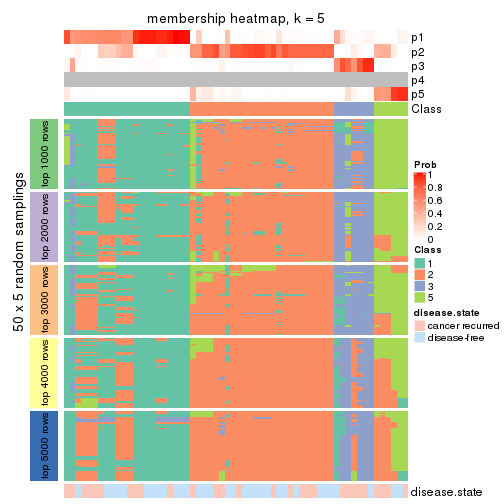</p>

</div>
<div id='tab-MAD-hclust-membership-heatmap-5'>
<pre><code class="r">membership_heatmap(res, k = 6)
</code></pre>

<p>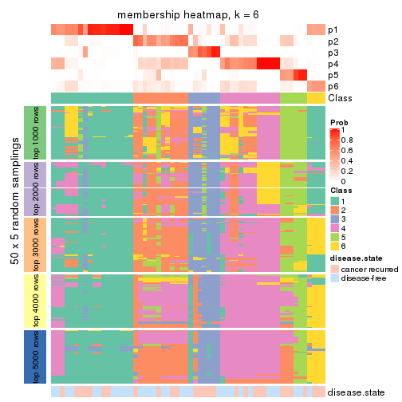</p>

</div>
</div>

As soon as we have had the classes for columns, we can look for signatures
which are significantly different between classes which can be candidate marks
for certain classes. Following are the heatmaps for signatures.


Signature heatmaps where rows are scaled:


<script>
$( function() {
	$( '#tabs-MAD-hclust-get-signatures' ).tabs();
} );
</script>
<div id='tabs-MAD-hclust-get-signatures'>
<ul>
<li><a href='#tab-MAD-hclust-get-signatures-1'>k = 2</a></li>
<li><a href='#tab-MAD-hclust-get-signatures-2'>k = 3</a></li>
<li><a href='#tab-MAD-hclust-get-signatures-3'>k = 4</a></li>
<li><a href='#tab-MAD-hclust-get-signatures-4'>k = 5</a></li>
<li><a href='#tab-MAD-hclust-get-signatures-5'>k = 6</a></li>
</ul>
<div id='tab-MAD-hclust-get-signatures-1'>
<pre><code class="r">get_signatures(res, k = 2)
</code></pre>

<p></p>

</div>
<div id='tab-MAD-hclust-get-signatures-2'>
<pre><code class="r">get_signatures(res, k = 3)
</code></pre>

<p></p>

</div>
<div id='tab-MAD-hclust-get-signatures-3'>
<pre><code class="r">get_signatures(res, k = 4)
</code></pre>

<p></p>

</div>
<div id='tab-MAD-hclust-get-signatures-4'>
<pre><code class="r">get_signatures(res, k = 5)
</code></pre>

<p></p>

</div>
<div id='tab-MAD-hclust-get-signatures-5'>
<pre><code class="r">get_signatures(res, k = 6)
</code></pre>

<p></p>

</div>
</div>


Signature heatmaps where rows are not scaled:


<script>
$( function() {
	$( '#tabs-MAD-hclust-get-signatures-no-scale' ).tabs();
} );
</script>
<div id='tabs-MAD-hclust-get-signatures-no-scale'>
<ul>
<li><a href='#tab-MAD-hclust-get-signatures-no-scale-1'>k = 2</a></li>
<li><a href='#tab-MAD-hclust-get-signatures-no-scale-2'>k = 3</a></li>
<li><a href='#tab-MAD-hclust-get-signatures-no-scale-3'>k = 4</a></li>
<li><a href='#tab-MAD-hclust-get-signatures-no-scale-4'>k = 5</a></li>
<li><a href='#tab-MAD-hclust-get-signatures-no-scale-5'>k = 6</a></li>
</ul>
<div id='tab-MAD-hclust-get-signatures-no-scale-1'>
<pre><code class="r">get_signatures(res, k = 2, scale_rows = FALSE)
</code></pre>

<p></p>

</div>
<div id='tab-MAD-hclust-get-signatures-no-scale-2'>
<pre><code class="r">get_signatures(res, k = 3, scale_rows = FALSE)
</code></pre>

<p></p>

</div>
<div id='tab-MAD-hclust-get-signatures-no-scale-3'>
<pre><code class="r">get_signatures(res, k = 4, scale_rows = FALSE)
</code></pre>

<p></p>

</div>
<div id='tab-MAD-hclust-get-signatures-no-scale-4'>
<pre><code class="r">get_signatures(res, k = 5, scale_rows = FALSE)
</code></pre>

<p></p>

</div>
<div id='tab-MAD-hclust-get-signatures-no-scale-5'>
<pre><code class="r">get_signatures(res, k = 6, scale_rows = FALSE)
</code></pre>

<p></p>

</div>
</div>


Compare the overlap of signatures from different k:

```r
compare_signatures(res)
```


`get_signature()` returns a data frame invisibly. TO get the list of signatures, the function
call should be assigned to a variable explicitly. In following code, if `plot` argument is set
to `FALSE`, no heatmap is plotted while only the differential analysis is performed.

```r
# code only for demonstration
tb = get_signature(res, k = ..., plot = FALSE)
```

An example of the output of `tb` is:

```
#>   which_row         fdr    mean_1    mean_2 scaled_mean_1 scaled_mean_2 km
#> 1        38 0.042760348  8.373488  9.131774    -0.5533452     0.5164555  1
#> 2        40 0.018707592  7.106213  8.469186    -0.6173731     0.5762149  1
#> 3        55 0.019134737 10.221463 11.207825    -0.6159697     0.5749050  1
#> 4        59 0.006059896  5.921854  7.869574    -0.6899429     0.6439467  1
#> 5        60 0.018055526  8.928898 10.211722    -0.6204761     0.5791110  1
#> 6        98 0.009384629 15.714769 14.887706     0.6635654    -0.6193277  2
...
```

The columns in `tb` are:

1. `which_row`: row indices corresponding to the input matrix.
2. `fdr`: FDR for the differential test. 
3. `mean_x`: The mean value in group x.
4. `scaled_mean_x`: The mean value in group x after rows are scaled.
5. `km`: Row groups if k-means clustering is applied to rows.


UMAP plot which shows how samples are separated.


<script>
$( function() {
	$( '#tabs-MAD-hclust-dimension-reduction' ).tabs();
} );
</script>
<div id='tabs-MAD-hclust-dimension-reduction'>
<ul>
<li><a href='#tab-MAD-hclust-dimension-reduction-1'>k = 2</a></li>
<li><a href='#tab-MAD-hclust-dimension-reduction-2'>k = 3</a></li>
<li><a href='#tab-MAD-hclust-dimension-reduction-3'>k = 4</a></li>
<li><a href='#tab-MAD-hclust-dimension-reduction-4'>k = 5</a></li>
<li><a href='#tab-MAD-hclust-dimension-reduction-5'>k = 6</a></li>
</ul>
<div id='tab-MAD-hclust-dimension-reduction-1'>
<pre><code class="r">dimension_reduction(res, k = 2, method = &quot;UMAP&quot;)
</code></pre>

<p>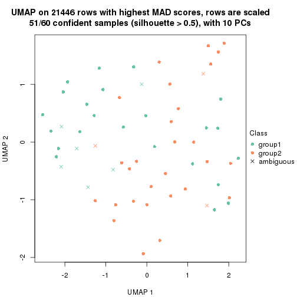</p>

</div>
<div id='tab-MAD-hclust-dimension-reduction-2'>
<pre><code class="r">dimension_reduction(res, k = 3, method = &quot;UMAP&quot;)
</code></pre>

<p></p>

</div>
<div id='tab-MAD-hclust-dimension-reduction-3'>
<pre><code class="r">dimension_reduction(res, k = 4, method = &quot;UMAP&quot;)
</code></pre>

<p></p>

</div>
<div id='tab-MAD-hclust-dimension-reduction-4'>
<pre><code class="r">dimension_reduction(res, k = 5, method = &quot;UMAP&quot;)
</code></pre>

<p></p>

</div>
<div id='tab-MAD-hclust-dimension-reduction-5'>
<pre><code class="r">dimension_reduction(res, k = 6, method = &quot;UMAP&quot;)
</code></pre>

<p></p>

</div>
</div>


Following heatmap shows how subgroups are split when increasing `k`:

```r
collect_classes(res)
```


Test correlation between subgroups and known annotations. If the known
annotation is numeric, one-way ANOVA test is applied, and if the known
annotation is discrete, chi-squared contingency table test is applied.

```r
test_to_known_factors(res)
```

```
#>             n disease.state(p) k
#> MAD:hclust 51            0.490 2
#> MAD:hclust 41            0.556 3
#> MAD:hclust 40            0.170 4
#> MAD:hclust 39            0.125 5
#> MAD:hclust 39            0.235 6
```


If matrix rows can be associated to genes, consider to use `GO_Enrichment(res,
...)` to perform function enrichment for the signature genes.


 

---------------------------------------------------


### MAD:kmeans


The object with results only for a single top-value method and a single partition method 
can be extracted as:

```r
res = res_list["MAD", "kmeans"]
# you can also extract it by
# res = res_list["MAD:kmeans"]
```

A summary of `res` and all the functions that can be applied to it:

```r
res
```

```
#> A 'ConsensusPartition' object with k = 2, 3, 4, 5, 6.
#>   On a matrix with 21446 rows and 60 columns.
#>   Top rows (1000, 2000, 3000, 4000, 5000) are extracted by 'MAD' method.
#>   Subgroups are detected by 'kmeans' method.
#>   Performed in total 1250 partitions by row resampling.
#>   Best k for subgroups seems to be 2.
#> 
#> Following methods can be applied to this 'ConsensusPartition' object:
#>  [1] "cola_report"             "collect_classes"         "collect_plots"          
#>  [4] "collect_stats"           "colnames"                "compare_signatures"     
#>  [7] "consensus_heatmap"       "dimension_reduction"     "functional_enrichment"  
#> [10] "get_anno_col"            "get_anno"                "get_classes"            
#> [13] "get_consensus"           "get_matrix"              "get_membership"         
#> [16] "get_param"               "get_signatures"          "get_stats"              
#> [19] "is_best_k"               "is_stable_k"             "membership_heatmap"     
#> [22] "ncol"                    "nrow"                    "plot_ecdf"              
#> [25] "rownames"                "select_partition_number" "show"                   
#> [28] "suggest_best_k"          "test_to_known_factors"
```

`collect_plots()` function collects all the plots made from `res` for all `k` (number of partitions)
into one single page to provide an easy and fast comparison between different `k`.

```r
collect_plots(res)
```


The plots are:

- The first row: a plot of the ECDF (Empirical cumulative distribution
  function) curves of the consensus matrix for each `k` and the heatmap of
  predicted classes for each `k`.
- The second row: heatmaps of the consensus matrix for each `k`.
- The third row: heatmaps of the membership matrix for each `k`.
- The fouth row: heatmaps of the signatures for each `k`.

All the plots in panels can be made by individual functions and they are
plotted later in this section.

`select_partition_number()` produces several plots showing different
statistics for choosing "optimized" `k`. There are following statistics:

- ECDF curves of the consensus matrix for each `k`;
- 1-PAC. [The PAC
  score](https://en.wikipedia.org/wiki/Consensus_clustering#Over-interpretation_potential_of_consensus_clustering)
  measures the proportion of the ambiguous subgrouping.
- Mean silhouette score.
- Concordance. The mean probability of fiting the consensus class ids in all
  partitions.
- Area increased. Denote $A_k$ as the area under the ECDF curve for current
  `k`, the area increased is defined as $A_k - A_{k-1}$.
- Rand index. The percent of pairs of samples that are both in a same cluster
  or both are not in a same cluster in the partition of k and k-1.
- Jaccard index. The ratio of pairs of samples are both in a same cluster in
  the partition of k and k-1 and the pairs of samples are both in a same
  cluster in the partition k or k-1.

The detailed explanations of these statistics can be found in [the cola
vignette](http://bioconductor.org/packages/devel/bioc/vignettes/cola/inst/doc/cola.html#toc_13).

Generally speaking, lower PAC score, higher mean silhouette score or higher
concordance corresponds to better partition. Rand index and Jaccard index
measure how similar the current partition is compared to partition with `k-1`.
If they are too similar, we won't accept `k` is better than `k-1`.

```r
select_partition_number(res)
```


The numeric values for all these statistics can be obtained by `get_stats()`.

```r
get_stats(res)
```

```
#>   k 1-PAC mean_silhouette concordance area_increased  Rand Jaccard
#> 2 2 0.471           0.886       0.914         0.4936 0.494   0.494
#> 3 3 0.647           0.806       0.878         0.3125 0.773   0.572
#> 4 4 0.630           0.684       0.747         0.1108 0.906   0.727
#> 5 5 0.692           0.708       0.826         0.0703 0.919   0.723
#> 6 6 0.723           0.604       0.792         0.0525 0.959   0.838
```

`suggest_best_k()` suggests the best $k$ based on these statistics. The rules are as follows:

- All $k$ with Jaccard index larger than 0.95 are removed because the increase of
  the partition number does not provides enough extra information. If all $k$ are removed,
  the best $k$ is assigned by `NA`.
- For $k$ with 1-PAC larger than 0.9, the maximal $k$ is taken as the "best k". Other $k$ is called "optional k".
- If it does not fit the second rule. The $k$ with the highest vote of highest
  1-PAC, mean silhouette and concordance is taken as the "best k".

```r
suggest_best_k(res)
```

```
#> [1] 2
```


Following shows the table of the partitions (You need to click the **show/hide
code output** link to see it). The membership matrix (columns with name `p*`)
is inferred by
[`clue::cl_consensus()`](https://www.rdocumentation.org/link/cl_consensus?package=clue)
function with the `SE` method. Basically the value in the membership matrix
represents the probability to belong to a certain group. The finall class
label for an item is determined with the group with highest probability it
belongs to.

In `get_classes()` function, the entropy is calculated from the membership
matrix and the silhouette score is calculated from the consensus matrix.


<script>
$( function() {
	$( '#tabs-MAD-kmeans-get-classes' ).tabs();
} );
</script>
<div id='tabs-MAD-kmeans-get-classes'>
<ul>
<li><a href='#tab-MAD-kmeans-get-classes-1'>k = 2</a></li>
<li><a href='#tab-MAD-kmeans-get-classes-2'>k = 3</a></li>
<li><a href='#tab-MAD-kmeans-get-classes-3'>k = 4</a></li>
<li><a href='#tab-MAD-kmeans-get-classes-4'>k = 5</a></li>
<li><a href='#tab-MAD-kmeans-get-classes-5'>k = 6</a></li>
</ul>

<div id='tab-MAD-kmeans-get-classes-1'>
<p><a id='tab-MAD-kmeans-get-classes-1-a' style='color:#0366d6' href='#'>show/hide code output</a></p>
<pre><code class="r">cbind(get_classes(res, k = 2), get_membership(res, k = 2))
</code></pre>

<pre><code>#&gt;          class entropy silhouette    p1    p2
#&gt; GSM22453     1  0.0672      0.940 0.992 0.008
#&gt; GSM22458     2  0.5294      0.924 0.120 0.880
#&gt; GSM22465     1  0.0672      0.940 0.992 0.008
#&gt; GSM22466     1  0.0672      0.940 0.992 0.008
#&gt; GSM22468     2  0.5294      0.924 0.120 0.880
#&gt; GSM22469     1  0.2043      0.920 0.968 0.032
#&gt; GSM22471     2  0.5294      0.924 0.120 0.880
#&gt; GSM22472     2  0.5294      0.924 0.120 0.880
#&gt; GSM22474     2  0.5178      0.924 0.116 0.884
#&gt; GSM22476     2  0.0000      0.864 0.000 1.000
#&gt; GSM22477     2  0.5178      0.924 0.116 0.884
#&gt; GSM22478     2  0.6623      0.891 0.172 0.828
#&gt; GSM22481     2  0.5294      0.924 0.120 0.880
#&gt; GSM22484     1  0.0672      0.940 0.992 0.008
#&gt; GSM22485     1  0.0672      0.940 0.992 0.008
#&gt; GSM22487     1  0.0672      0.940 0.992 0.008
#&gt; GSM22488     1  0.0672      0.940 0.992 0.008
#&gt; GSM22489     2  0.8608      0.551 0.284 0.716
#&gt; GSM22490     2  0.5178      0.924 0.116 0.884
#&gt; GSM22492     2  0.5178      0.924 0.116 0.884
#&gt; GSM22493     1  0.0672      0.940 0.992 0.008
#&gt; GSM22494     1  0.0672      0.940 0.992 0.008
#&gt; GSM22497     1  0.0672      0.940 0.992 0.008
#&gt; GSM22498     1  0.0672      0.940 0.992 0.008
#&gt; GSM22501     2  0.3114      0.839 0.056 0.944
#&gt; GSM22502     2  0.5059      0.923 0.112 0.888
#&gt; GSM22503     2  0.5294      0.924 0.120 0.880
#&gt; GSM22504     2  0.5294      0.924 0.120 0.880
#&gt; GSM22505     1  0.5178      0.873 0.884 0.116
#&gt; GSM22506     1  0.3274      0.908 0.940 0.060
#&gt; GSM22507     1  0.8386      0.564 0.732 0.268
#&gt; GSM22508     2  0.5294      0.924 0.120 0.880
#&gt; GSM22449     1  0.5178      0.873 0.884 0.116
#&gt; GSM22450     1  0.0672      0.940 0.992 0.008
#&gt; GSM22451     1  0.3274      0.908 0.940 0.060
#&gt; GSM22452     1  0.5178      0.872 0.884 0.116
#&gt; GSM22454     1  0.0672      0.940 0.992 0.008
#&gt; GSM22455     2  0.7299      0.697 0.204 0.796
#&gt; GSM22456     2  0.5946      0.910 0.144 0.856
#&gt; GSM22457     2  0.6623      0.891 0.172 0.828
#&gt; GSM22459     2  0.0000      0.864 0.000 1.000
#&gt; GSM22460     1  0.0672      0.940 0.992 0.008
#&gt; GSM22461     2  0.5178      0.924 0.116 0.884
#&gt; GSM22462     1  0.5059      0.875 0.888 0.112
#&gt; GSM22463     1  0.5294      0.869 0.880 0.120
#&gt; GSM22464     2  0.6623      0.891 0.172 0.828
#&gt; GSM22467     1  0.0672      0.940 0.992 0.008
#&gt; GSM22470     2  0.8608      0.551 0.284 0.716
#&gt; GSM22473     2  0.0000      0.864 0.000 1.000
#&gt; GSM22475     2  0.0000      0.864 0.000 1.000
#&gt; GSM22479     2  0.5178      0.924 0.116 0.884
#&gt; GSM22480     1  0.7056      0.712 0.808 0.192
#&gt; GSM22482     2  0.5519      0.780 0.128 0.872
#&gt; GSM22483     2  0.5294      0.924 0.120 0.880
#&gt; GSM22486     1  0.5178      0.873 0.884 0.116
#&gt; GSM22491     1  0.0672      0.940 0.992 0.008
#&gt; GSM22495     2  0.0000      0.864 0.000 1.000
#&gt; GSM22496     1  0.0672      0.940 0.992 0.008
#&gt; GSM22499     2  0.5178      0.924 0.116 0.884
#&gt; GSM22500     2  0.5294      0.924 0.120 0.880
</code></pre>

<script>
$('#tab-MAD-kmeans-get-classes-1-a').parent().next().next().hide();
$('#tab-MAD-kmeans-get-classes-1-a').click(function(){
  $('#tab-MAD-kmeans-get-classes-1-a').parent().next().next().toggle();
  return(false);
});
</script>
</div>

<div id='tab-MAD-kmeans-get-classes-2'>
<p><a id='tab-MAD-kmeans-get-classes-2-a' style='color:#0366d6' href='#'>show/hide code output</a></p>
<pre><code class="r">cbind(get_classes(res, k = 3), get_membership(res, k = 3))
</code></pre>

<pre><code>#&gt;          class entropy silhouette    p1    p2    p3
#&gt; GSM22453     1  0.0000      0.949 1.000 0.000 0.000
#&gt; GSM22458     2  0.2945      0.844 0.004 0.908 0.088
#&gt; GSM22465     1  0.0661      0.946 0.988 0.004 0.008
#&gt; GSM22466     1  0.0661      0.946 0.988 0.004 0.008
#&gt; GSM22468     2  0.3038      0.857 0.000 0.896 0.104
#&gt; GSM22469     1  0.1751      0.930 0.960 0.028 0.012
#&gt; GSM22471     2  0.1753      0.862 0.000 0.952 0.048
#&gt; GSM22472     2  0.2945      0.844 0.004 0.908 0.088
#&gt; GSM22474     2  0.3267      0.848 0.000 0.884 0.116
#&gt; GSM22476     3  0.5098      0.678 0.000 0.248 0.752
#&gt; GSM22477     2  0.2584      0.864 0.008 0.928 0.064
#&gt; GSM22478     2  0.5402      0.794 0.028 0.792 0.180
#&gt; GSM22481     2  0.2448      0.867 0.000 0.924 0.076
#&gt; GSM22484     1  0.2496      0.915 0.928 0.004 0.068
#&gt; GSM22485     1  0.0237      0.949 0.996 0.000 0.004
#&gt; GSM22487     1  0.2446      0.912 0.936 0.052 0.012
#&gt; GSM22488     1  0.0000      0.949 1.000 0.000 0.000
#&gt; GSM22489     3  0.3263      0.704 0.040 0.048 0.912
#&gt; GSM22490     2  0.1964      0.864 0.000 0.944 0.056
#&gt; GSM22492     2  0.3752      0.844 0.000 0.856 0.144
#&gt; GSM22493     1  0.0237      0.949 0.996 0.000 0.004
#&gt; GSM22494     1  0.0000      0.949 1.000 0.000 0.000
#&gt; GSM22497     1  0.0000      0.949 1.000 0.000 0.000
#&gt; GSM22498     1  0.3356      0.900 0.908 0.036 0.056
#&gt; GSM22501     3  0.5115      0.689 0.004 0.228 0.768
#&gt; GSM22502     2  0.2066      0.864 0.000 0.940 0.060
#&gt; GSM22503     2  0.2537      0.867 0.000 0.920 0.080
#&gt; GSM22504     2  0.2945      0.844 0.004 0.908 0.088
#&gt; GSM22505     3  0.5760      0.469 0.328 0.000 0.672
#&gt; GSM22506     1  0.3116      0.885 0.892 0.000 0.108
#&gt; GSM22507     2  0.8645      0.381 0.300 0.568 0.132
#&gt; GSM22508     2  0.0661      0.871 0.004 0.988 0.008
#&gt; GSM22449     3  0.6260      0.169 0.448 0.000 0.552
#&gt; GSM22450     1  0.0000      0.949 1.000 0.000 0.000
#&gt; GSM22451     1  0.3193      0.891 0.896 0.004 0.100
#&gt; GSM22452     1  0.2066      0.914 0.940 0.000 0.060
#&gt; GSM22454     1  0.0475      0.947 0.992 0.004 0.004
#&gt; GSM22455     3  0.4805      0.646 0.012 0.176 0.812
#&gt; GSM22456     2  0.5061      0.779 0.008 0.784 0.208
#&gt; GSM22457     2  0.5402      0.794 0.028 0.792 0.180
#&gt; GSM22459     3  0.5254      0.665 0.000 0.264 0.736
#&gt; GSM22460     1  0.1129      0.942 0.976 0.004 0.020
#&gt; GSM22461     2  0.2711      0.845 0.000 0.912 0.088
#&gt; GSM22462     1  0.2959      0.881 0.900 0.000 0.100
#&gt; GSM22463     3  0.5882      0.425 0.348 0.000 0.652
#&gt; GSM22464     2  0.5402      0.794 0.028 0.792 0.180
#&gt; GSM22467     1  0.0661      0.946 0.988 0.004 0.008
#&gt; GSM22470     3  0.3134      0.703 0.032 0.052 0.916
#&gt; GSM22473     3  0.5216      0.665 0.000 0.260 0.740
#&gt; GSM22475     3  0.5254      0.665 0.000 0.264 0.736
#&gt; GSM22479     2  0.3267      0.848 0.000 0.884 0.116
#&gt; GSM22480     1  0.7396      0.567 0.704 0.144 0.152
#&gt; GSM22482     3  0.6806      0.683 0.060 0.228 0.712
#&gt; GSM22483     2  0.2945      0.844 0.004 0.908 0.088
#&gt; GSM22486     3  0.6653      0.514 0.288 0.032 0.680
#&gt; GSM22491     1  0.0000      0.949 1.000 0.000 0.000
#&gt; GSM22495     3  0.5216      0.665 0.000 0.260 0.740
#&gt; GSM22496     1  0.0475      0.947 0.992 0.004 0.004
#&gt; GSM22499     2  0.2959      0.865 0.000 0.900 0.100
#&gt; GSM22500     2  0.1129      0.869 0.004 0.976 0.020
</code></pre>

<script>
$('#tab-MAD-kmeans-get-classes-2-a').parent().next().next().hide();
$('#tab-MAD-kmeans-get-classes-2-a').click(function(){
  $('#tab-MAD-kmeans-get-classes-2-a').parent().next().next().toggle();
  return(false);
});
</script>
</div>

<div id='tab-MAD-kmeans-get-classes-3'>
<p><a id='tab-MAD-kmeans-get-classes-3-a' style='color:#0366d6' href='#'>show/hide code output</a></p>
<pre><code class="r">cbind(get_classes(res, k = 4), get_membership(res, k = 4))
</code></pre>

<pre><code>#&gt;          class entropy silhouette    p1    p2    p3    p4
#&gt; GSM22453     1  0.0000      0.914 1.000 0.000 0.000 0.000
#&gt; GSM22458     4  0.0000      0.722 0.000 0.000 0.000 1.000
#&gt; GSM22465     1  0.0376      0.913 0.992 0.004 0.004 0.000
#&gt; GSM22466     1  0.0524      0.912 0.988 0.008 0.004 0.000
#&gt; GSM22468     2  0.4905      0.684 0.000 0.632 0.004 0.364
#&gt; GSM22469     1  0.0967      0.909 0.976 0.016 0.004 0.004
#&gt; GSM22471     4  0.4283      0.573 0.000 0.256 0.004 0.740
#&gt; GSM22472     4  0.0000      0.722 0.000 0.000 0.000 1.000
#&gt; GSM22474     2  0.4605      0.701 0.000 0.664 0.000 0.336
#&gt; GSM22476     3  0.5799      0.630 0.000 0.264 0.668 0.068
#&gt; GSM22477     4  0.5024      0.624 0.008 0.248 0.020 0.724
#&gt; GSM22478     2  0.5691      0.702 0.016 0.684 0.032 0.268
#&gt; GSM22481     2  0.5152      0.664 0.004 0.608 0.004 0.384
#&gt; GSM22484     1  0.4307      0.807 0.808 0.144 0.048 0.000
#&gt; GSM22485     1  0.1109      0.909 0.968 0.028 0.004 0.000
#&gt; GSM22487     1  0.3205      0.817 0.872 0.104 0.000 0.024
#&gt; GSM22488     1  0.0336      0.913 0.992 0.008 0.000 0.000
#&gt; GSM22489     3  0.1118      0.614 0.000 0.036 0.964 0.000
#&gt; GSM22490     4  0.4797      0.584 0.000 0.260 0.020 0.720
#&gt; GSM22492     2  0.5172      0.578 0.000 0.588 0.008 0.404
#&gt; GSM22493     1  0.1305      0.906 0.960 0.036 0.004 0.000
#&gt; GSM22494     1  0.0188      0.913 0.996 0.000 0.004 0.000
#&gt; GSM22497     1  0.0000      0.914 1.000 0.000 0.000 0.000
#&gt; GSM22498     1  0.5701      0.563 0.652 0.308 0.032 0.008
#&gt; GSM22501     3  0.5799      0.630 0.000 0.264 0.668 0.068
#&gt; GSM22502     4  0.5130      0.488 0.000 0.312 0.020 0.668
#&gt; GSM22503     2  0.4964      0.677 0.000 0.616 0.004 0.380
#&gt; GSM22504     4  0.0000      0.722 0.000 0.000 0.000 1.000
#&gt; GSM22505     3  0.6931      0.419 0.228 0.184 0.588 0.000
#&gt; GSM22506     1  0.4568      0.791 0.800 0.124 0.076 0.000
#&gt; GSM22507     2  0.6947      0.585 0.112 0.648 0.032 0.208
#&gt; GSM22508     4  0.4624      0.392 0.000 0.340 0.000 0.660
#&gt; GSM22449     3  0.7158      0.192 0.340 0.148 0.512 0.000
#&gt; GSM22450     1  0.0376      0.913 0.992 0.004 0.004 0.000
#&gt; GSM22451     1  0.5160      0.761 0.760 0.136 0.104 0.000
#&gt; GSM22452     1  0.1824      0.882 0.936 0.004 0.060 0.000
#&gt; GSM22454     1  0.0376      0.914 0.992 0.004 0.004 0.000
#&gt; GSM22455     3  0.4998      0.199 0.000 0.488 0.512 0.000
#&gt; GSM22456     2  0.5279      0.623 0.008 0.744 0.052 0.196
#&gt; GSM22457     2  0.5744      0.700 0.016 0.676 0.032 0.276
#&gt; GSM22459     3  0.6238      0.609 0.000 0.296 0.620 0.084
#&gt; GSM22460     1  0.2300      0.889 0.920 0.064 0.016 0.000
#&gt; GSM22461     4  0.0000      0.722 0.000 0.000 0.000 1.000
#&gt; GSM22462     1  0.4728      0.673 0.752 0.032 0.216 0.000
#&gt; GSM22463     3  0.6552      0.424 0.228 0.144 0.628 0.000
#&gt; GSM22464     2  0.5744      0.700 0.016 0.676 0.032 0.276
#&gt; GSM22467     1  0.0376      0.913 0.992 0.004 0.004 0.000
#&gt; GSM22470     3  0.0469      0.618 0.000 0.012 0.988 0.000
#&gt; GSM22473     3  0.5936      0.608 0.000 0.324 0.620 0.056
#&gt; GSM22475     3  0.6217      0.612 0.000 0.292 0.624 0.084
#&gt; GSM22479     2  0.4905      0.684 0.000 0.632 0.004 0.364
#&gt; GSM22480     2  0.5755      0.332 0.296 0.660 0.032 0.012
#&gt; GSM22482     3  0.6502      0.627 0.028 0.244 0.660 0.068
#&gt; GSM22483     4  0.0000      0.722 0.000 0.000 0.000 1.000
#&gt; GSM22486     3  0.7176      0.421 0.196 0.252 0.552 0.000
#&gt; GSM22491     1  0.0592      0.913 0.984 0.016 0.000 0.000
#&gt; GSM22495     3  0.6033      0.609 0.000 0.316 0.620 0.064
#&gt; GSM22496     1  0.1722      0.899 0.944 0.048 0.008 0.000
#&gt; GSM22499     2  0.4933      0.565 0.000 0.568 0.000 0.432
#&gt; GSM22500     4  0.4781      0.407 0.000 0.336 0.004 0.660
</code></pre>

<script>
$('#tab-MAD-kmeans-get-classes-3-a').parent().next().next().hide();
$('#tab-MAD-kmeans-get-classes-3-a').click(function(){
  $('#tab-MAD-kmeans-get-classes-3-a').parent().next().next().toggle();
  return(false);
});
</script>
</div>

<div id='tab-MAD-kmeans-get-classes-4'>
<p><a id='tab-MAD-kmeans-get-classes-4-a' style='color:#0366d6' href='#'>show/hide code output</a></p>
<pre><code class="r">cbind(get_classes(res, k = 5), get_membership(res, k = 5))
</code></pre>

<pre><code>#&gt;          class entropy silhouette    p1    p2    p3    p4    p5
#&gt; GSM22453     1  0.0000     0.8538 1.000 0.000 0.000 0.000 0.000
#&gt; GSM22458     4  0.2077     0.8750 0.000 0.084 0.000 0.908 0.008
#&gt; GSM22465     1  0.0727     0.8524 0.980 0.004 0.004 0.012 0.000
#&gt; GSM22466     1  0.0727     0.8524 0.980 0.004 0.004 0.012 0.000
#&gt; GSM22468     2  0.1560     0.7215 0.000 0.948 0.004 0.020 0.028
#&gt; GSM22469     1  0.3050     0.7903 0.876 0.024 0.076 0.024 0.000
#&gt; GSM22471     2  0.5886     0.2935 0.000 0.540 0.084 0.368 0.008
#&gt; GSM22472     4  0.2077     0.8750 0.000 0.084 0.000 0.908 0.008
#&gt; GSM22474     2  0.1026     0.7224 0.000 0.968 0.004 0.004 0.024
#&gt; GSM22476     5  0.1518     0.9586 0.000 0.016 0.020 0.012 0.952
#&gt; GSM22477     4  0.7956    -0.0432 0.032 0.388 0.108 0.396 0.076
#&gt; GSM22478     2  0.2408     0.7082 0.008 0.892 0.096 0.004 0.000
#&gt; GSM22481     2  0.2011     0.7230 0.012 0.936 0.012 0.024 0.016
#&gt; GSM22484     1  0.5776     0.6910 0.700 0.032 0.184 0.060 0.024
#&gt; GSM22485     1  0.2120     0.8381 0.924 0.004 0.048 0.020 0.004
#&gt; GSM22487     1  0.4863     0.6820 0.764 0.124 0.072 0.040 0.000
#&gt; GSM22488     1  0.1173     0.8501 0.964 0.000 0.012 0.020 0.004
#&gt; GSM22489     3  0.4114     0.5128 0.000 0.000 0.624 0.000 0.376
#&gt; GSM22490     2  0.6593     0.1324 0.000 0.504 0.024 0.348 0.124
#&gt; GSM22492     2  0.3384     0.6722 0.000 0.852 0.008 0.056 0.084
#&gt; GSM22493     1  0.1806     0.8452 0.940 0.004 0.032 0.020 0.004
#&gt; GSM22494     1  0.0000     0.8538 1.000 0.000 0.000 0.000 0.000
#&gt; GSM22497     1  0.0000     0.8538 1.000 0.000 0.000 0.000 0.000
#&gt; GSM22498     1  0.6163     0.5286 0.620 0.236 0.120 0.020 0.004
#&gt; GSM22501     5  0.1904     0.9529 0.000 0.016 0.028 0.020 0.936
#&gt; GSM22502     2  0.6516     0.2135 0.000 0.532 0.024 0.320 0.124
#&gt; GSM22503     2  0.3338     0.6997 0.000 0.852 0.076 0.068 0.004
#&gt; GSM22504     4  0.2077     0.8750 0.000 0.084 0.000 0.908 0.008
#&gt; GSM22505     3  0.4381     0.7880 0.136 0.008 0.788 0.008 0.060
#&gt; GSM22506     1  0.4964     0.5915 0.668 0.008 0.292 0.020 0.012
#&gt; GSM22507     2  0.4770     0.6484 0.048 0.772 0.136 0.040 0.004
#&gt; GSM22508     2  0.5061     0.4078 0.000 0.644 0.024 0.312 0.020
#&gt; GSM22449     3  0.4012     0.7688 0.160 0.004 0.796 0.008 0.032
#&gt; GSM22450     1  0.0290     0.8532 0.992 0.000 0.000 0.008 0.000
#&gt; GSM22451     1  0.5948     0.5786 0.632 0.016 0.272 0.060 0.020
#&gt; GSM22452     1  0.1405     0.8447 0.956 0.000 0.016 0.020 0.008
#&gt; GSM22454     1  0.0579     0.8533 0.984 0.000 0.008 0.008 0.000
#&gt; GSM22455     3  0.3390     0.7124 0.000 0.100 0.840 0.000 0.060
#&gt; GSM22456     2  0.5201     0.5534 0.000 0.716 0.192 0.056 0.036
#&gt; GSM22457     2  0.3187     0.6966 0.008 0.860 0.096 0.036 0.000
#&gt; GSM22459     5  0.1153     0.9650 0.000 0.024 0.004 0.008 0.964
#&gt; GSM22460     1  0.4612     0.7590 0.788 0.012 0.120 0.060 0.020
#&gt; GSM22461     4  0.2237     0.8722 0.000 0.084 0.004 0.904 0.008
#&gt; GSM22462     1  0.4860     0.0504 0.540 0.000 0.440 0.016 0.004
#&gt; GSM22463     3  0.4119     0.7901 0.116 0.000 0.800 0.008 0.076
#&gt; GSM22464     2  0.3834     0.6753 0.012 0.812 0.140 0.036 0.000
#&gt; GSM22467     1  0.0727     0.8524 0.980 0.004 0.004 0.012 0.000
#&gt; GSM22470     3  0.4262     0.3846 0.000 0.000 0.560 0.000 0.440
#&gt; GSM22473     5  0.1041     0.9628 0.000 0.032 0.004 0.000 0.964
#&gt; GSM22475     5  0.1059     0.9659 0.000 0.020 0.004 0.008 0.968
#&gt; GSM22479     2  0.1646     0.7210 0.000 0.944 0.004 0.020 0.032
#&gt; GSM22480     2  0.5894     0.5047 0.176 0.672 0.124 0.020 0.008
#&gt; GSM22482     5  0.2288     0.9361 0.020 0.008 0.028 0.020 0.924
#&gt; GSM22483     4  0.2077     0.8750 0.000 0.084 0.000 0.908 0.008
#&gt; GSM22486     3  0.3613     0.7826 0.076 0.028 0.848 0.000 0.048
#&gt; GSM22491     1  0.1471     0.8480 0.952 0.000 0.024 0.020 0.004
#&gt; GSM22495     5  0.1041     0.9628 0.000 0.032 0.004 0.000 0.964
#&gt; GSM22496     1  0.3981     0.7882 0.832 0.008 0.080 0.060 0.020
#&gt; GSM22499     2  0.2778     0.7027 0.000 0.892 0.016 0.060 0.032
#&gt; GSM22500     2  0.5538     0.4012 0.000 0.588 0.088 0.324 0.000
</code></pre>

<script>
$('#tab-MAD-kmeans-get-classes-4-a').parent().next().next().hide();
$('#tab-MAD-kmeans-get-classes-4-a').click(function(){
  $('#tab-MAD-kmeans-get-classes-4-a').parent().next().next().toggle();
  return(false);
});
</script>
</div>

<div id='tab-MAD-kmeans-get-classes-5'>
<p><a id='tab-MAD-kmeans-get-classes-5-a' style='color:#0366d6' href='#'>show/hide code output</a></p>
<pre><code class="r">cbind(get_classes(res, k = 6), get_membership(res, k = 6))
</code></pre>

<pre><code>#&gt;          class entropy silhouette    p1    p2    p3    p4    p5    p6
#&gt; GSM22453     1  0.0146     0.7613 0.996 0.000 0.000 0.000 0.000 0.004
#&gt; GSM22458     4  0.0291     0.9969 0.000 0.004 0.000 0.992 0.004 0.000
#&gt; GSM22465     1  0.0951     0.7587 0.968 0.004 0.008 0.000 0.000 0.020
#&gt; GSM22466     1  0.1053     0.7572 0.964 0.004 0.012 0.000 0.000 0.020
#&gt; GSM22468     2  0.4030     0.5984 0.000 0.764 0.008 0.016 0.028 0.184
#&gt; GSM22469     1  0.3994     0.5556 0.752 0.196 0.012 0.000 0.000 0.040
#&gt; GSM22471     2  0.4886     0.4323 0.000 0.648 0.004 0.252 0.000 0.096
#&gt; GSM22472     4  0.0291     0.9969 0.000 0.004 0.000 0.992 0.004 0.000
#&gt; GSM22474     2  0.4133     0.5739 0.000 0.716 0.008 0.008 0.020 0.248
#&gt; GSM22476     5  0.1793     0.9196 0.000 0.004 0.032 0.000 0.928 0.036
#&gt; GSM22477     6  0.6424     0.1556 0.024 0.124 0.044 0.172 0.016 0.620
#&gt; GSM22478     2  0.2622     0.5341 0.000 0.868 0.024 0.004 0.000 0.104
#&gt; GSM22481     2  0.4052     0.5968 0.000 0.752 0.004 0.024 0.020 0.200
#&gt; GSM22484     6  0.6023    -0.0945 0.368 0.044 0.096 0.000 0.000 0.492
#&gt; GSM22485     1  0.3048     0.7082 0.840 0.004 0.016 0.004 0.004 0.132
#&gt; GSM22487     1  0.5061     0.3718 0.636 0.292 0.012 0.008 0.004 0.048
#&gt; GSM22488     1  0.2288     0.7280 0.876 0.000 0.000 0.004 0.004 0.116
#&gt; GSM22489     3  0.3490     0.5878 0.000 0.000 0.724 0.000 0.268 0.008
#&gt; GSM22490     2  0.7391     0.3505 0.000 0.388 0.004 0.200 0.120 0.288
#&gt; GSM22492     2  0.5557     0.5447 0.000 0.664 0.012 0.048 0.084 0.192
#&gt; GSM22493     1  0.2618     0.7228 0.864 0.004 0.004 0.004 0.004 0.120
#&gt; GSM22494     1  0.0458     0.7615 0.984 0.000 0.000 0.000 0.000 0.016
#&gt; GSM22497     1  0.0260     0.7615 0.992 0.000 0.000 0.000 0.000 0.008
#&gt; GSM22498     1  0.7103    -0.1041 0.412 0.264 0.056 0.004 0.004 0.260
#&gt; GSM22501     5  0.2547     0.9046 0.000 0.004 0.036 0.000 0.880 0.080
#&gt; GSM22502     2  0.7324     0.3702 0.000 0.408 0.004 0.172 0.128 0.288
#&gt; GSM22503     2  0.2384     0.5840 0.000 0.900 0.008 0.032 0.004 0.056
#&gt; GSM22504     4  0.0291     0.9969 0.000 0.004 0.000 0.992 0.004 0.000
#&gt; GSM22505     3  0.1942     0.7489 0.064 0.000 0.916 0.000 0.008 0.012
#&gt; GSM22506     1  0.5864     0.2832 0.512 0.004 0.336 0.004 0.004 0.140
#&gt; GSM22507     2  0.3964     0.4654 0.008 0.792 0.036 0.016 0.004 0.144
#&gt; GSM22508     2  0.6118     0.4736 0.000 0.512 0.004 0.176 0.016 0.292
#&gt; GSM22449     3  0.1841     0.7492 0.064 0.000 0.920 0.000 0.008 0.008
#&gt; GSM22450     1  0.0806     0.7590 0.972 0.000 0.008 0.000 0.000 0.020
#&gt; GSM22451     1  0.5564     0.2275 0.500 0.000 0.148 0.000 0.000 0.352
#&gt; GSM22452     1  0.2265     0.7285 0.896 0.000 0.024 0.000 0.004 0.076
#&gt; GSM22454     1  0.1003     0.7593 0.964 0.004 0.000 0.000 0.004 0.028
#&gt; GSM22455     3  0.3564     0.6164 0.000 0.036 0.804 0.004 0.008 0.148
#&gt; GSM22456     6  0.5733    -0.0638 0.000 0.380 0.116 0.004 0.008 0.492
#&gt; GSM22457     2  0.2737     0.5296 0.000 0.868 0.024 0.012 0.000 0.096
#&gt; GSM22459     5  0.0909     0.9388 0.000 0.012 0.000 0.000 0.968 0.020
#&gt; GSM22460     1  0.4606     0.4102 0.604 0.000 0.052 0.000 0.000 0.344
#&gt; GSM22461     4  0.0653     0.9875 0.000 0.004 0.000 0.980 0.004 0.012
#&gt; GSM22462     3  0.4640     0.1907 0.436 0.000 0.528 0.000 0.004 0.032
#&gt; GSM22463     3  0.1524     0.7474 0.060 0.000 0.932 0.000 0.008 0.000
#&gt; GSM22464     2  0.3664     0.4831 0.000 0.808 0.040 0.016 0.004 0.132
#&gt; GSM22467     1  0.1218     0.7563 0.956 0.004 0.012 0.000 0.000 0.028
#&gt; GSM22470     3  0.3861     0.4560 0.000 0.000 0.640 0.000 0.352 0.008
#&gt; GSM22473     5  0.0909     0.9388 0.000 0.012 0.000 0.000 0.968 0.020
#&gt; GSM22475     5  0.0622     0.9394 0.000 0.012 0.000 0.000 0.980 0.008
#&gt; GSM22479     2  0.4263     0.5997 0.000 0.764 0.012 0.016 0.048 0.160
#&gt; GSM22480     2  0.6602    -0.0559 0.140 0.496 0.052 0.004 0.004 0.304
#&gt; GSM22482     5  0.2739     0.8943 0.012 0.000 0.032 0.000 0.872 0.084
#&gt; GSM22483     4  0.0291     0.9969 0.000 0.004 0.000 0.992 0.004 0.000
#&gt; GSM22486     3  0.1793     0.7266 0.016 0.008 0.932 0.000 0.004 0.040
#&gt; GSM22491     1  0.2333     0.7283 0.872 0.000 0.000 0.004 0.004 0.120
#&gt; GSM22495     5  0.1003     0.9364 0.000 0.016 0.000 0.000 0.964 0.020
#&gt; GSM22496     1  0.4167     0.4591 0.632 0.000 0.024 0.000 0.000 0.344
#&gt; GSM22499     2  0.4913     0.5714 0.000 0.676 0.004 0.056 0.024 0.240
#&gt; GSM22500     2  0.5306     0.4287 0.000 0.632 0.004 0.192 0.004 0.168
</code></pre>

<script>
$('#tab-MAD-kmeans-get-classes-5-a').parent().next().next().hide();
$('#tab-MAD-kmeans-get-classes-5-a').click(function(){
  $('#tab-MAD-kmeans-get-classes-5-a').parent().next().next().toggle();
  return(false);
});
</script>
</div>
</div>

Heatmaps for the consensus matrix. It visualizes the probability of two
samples to be in a same group.


<script>
$( function() {
	$( '#tabs-MAD-kmeans-consensus-heatmap' ).tabs();
} );
</script>
<div id='tabs-MAD-kmeans-consensus-heatmap'>
<ul>
<li><a href='#tab-MAD-kmeans-consensus-heatmap-1'>k = 2</a></li>
<li><a href='#tab-MAD-kmeans-consensus-heatmap-2'>k = 3</a></li>
<li><a href='#tab-MAD-kmeans-consensus-heatmap-3'>k = 4</a></li>
<li><a href='#tab-MAD-kmeans-consensus-heatmap-4'>k = 5</a></li>
<li><a href='#tab-MAD-kmeans-consensus-heatmap-5'>k = 6</a></li>
</ul>
<div id='tab-MAD-kmeans-consensus-heatmap-1'>
<pre><code class="r">consensus_heatmap(res, k = 2)
</code></pre>

<p></p>

</div>
<div id='tab-MAD-kmeans-consensus-heatmap-2'>
<pre><code class="r">consensus_heatmap(res, k = 3)
</code></pre>

<p></p>

</div>
<div id='tab-MAD-kmeans-consensus-heatmap-3'>
<pre><code class="r">consensus_heatmap(res, k = 4)
</code></pre>

<p></p>

</div>
<div id='tab-MAD-kmeans-consensus-heatmap-4'>
<pre><code class="r">consensus_heatmap(res, k = 5)
</code></pre>

<p></p>

</div>
<div id='tab-MAD-kmeans-consensus-heatmap-5'>
<pre><code class="r">consensus_heatmap(res, k = 6)
</code></pre>

<p></p>

</div>
</div>

Heatmaps for the membership of samples in all partitions to see how consistent they are:


<script>
$( function() {
	$( '#tabs-MAD-kmeans-membership-heatmap' ).tabs();
} );
</script>
<div id='tabs-MAD-kmeans-membership-heatmap'>
<ul>
<li><a href='#tab-MAD-kmeans-membership-heatmap-1'>k = 2</a></li>
<li><a href='#tab-MAD-kmeans-membership-heatmap-2'>k = 3</a></li>
<li><a href='#tab-MAD-kmeans-membership-heatmap-3'>k = 4</a></li>
<li><a href='#tab-MAD-kmeans-membership-heatmap-4'>k = 5</a></li>
<li><a href='#tab-MAD-kmeans-membership-heatmap-5'>k = 6</a></li>
</ul>
<div id='tab-MAD-kmeans-membership-heatmap-1'>
<pre><code class="r">membership_heatmap(res, k = 2)
</code></pre>

<p></p>

</div>
<div id='tab-MAD-kmeans-membership-heatmap-2'>
<pre><code class="r">membership_heatmap(res, k = 3)
</code></pre>

<p></p>

</div>
<div id='tab-MAD-kmeans-membership-heatmap-3'>
<pre><code class="r">membership_heatmap(res, k = 4)
</code></pre>

<p></p>

</div>
<div id='tab-MAD-kmeans-membership-heatmap-4'>
<pre><code class="r">membership_heatmap(res, k = 5)
</code></pre>

<p></p>

</div>
<div id='tab-MAD-kmeans-membership-heatmap-5'>
<pre><code class="r">membership_heatmap(res, k = 6)
</code></pre>

<p></p>

</div>
</div>

As soon as we have had the classes for columns, we can look for signatures
which are significantly different between classes which can be candidate marks
for certain classes. Following are the heatmaps for signatures.


Signature heatmaps where rows are scaled:


<script>
$( function() {
	$( '#tabs-MAD-kmeans-get-signatures' ).tabs();
} );
</script>
<div id='tabs-MAD-kmeans-get-signatures'>
<ul>
<li><a href='#tab-MAD-kmeans-get-signatures-1'>k = 2</a></li>
<li><a href='#tab-MAD-kmeans-get-signatures-2'>k = 3</a></li>
<li><a href='#tab-MAD-kmeans-get-signatures-3'>k = 4</a></li>
<li><a href='#tab-MAD-kmeans-get-signatures-4'>k = 5</a></li>
<li><a href='#tab-MAD-kmeans-get-signatures-5'>k = 6</a></li>
</ul>
<div id='tab-MAD-kmeans-get-signatures-1'>
<pre><code class="r">get_signatures(res, k = 2)
</code></pre>

<p></p>

</div>
<div id='tab-MAD-kmeans-get-signatures-2'>
<pre><code class="r">get_signatures(res, k = 3)
</code></pre>

<p></p>

</div>
<div id='tab-MAD-kmeans-get-signatures-3'>
<pre><code class="r">get_signatures(res, k = 4)
</code></pre>

<p></p>

</div>
<div id='tab-MAD-kmeans-get-signatures-4'>
<pre><code class="r">get_signatures(res, k = 5)
</code></pre>

<p></p>

</div>
<div id='tab-MAD-kmeans-get-signatures-5'>
<pre><code class="r">get_signatures(res, k = 6)
</code></pre>

<p></p>

</div>
</div>


Signature heatmaps where rows are not scaled:


<script>
$( function() {
	$( '#tabs-MAD-kmeans-get-signatures-no-scale' ).tabs();
} );
</script>
<div id='tabs-MAD-kmeans-get-signatures-no-scale'>
<ul>
<li><a href='#tab-MAD-kmeans-get-signatures-no-scale-1'>k = 2</a></li>
<li><a href='#tab-MAD-kmeans-get-signatures-no-scale-2'>k = 3</a></li>
<li><a href='#tab-MAD-kmeans-get-signatures-no-scale-3'>k = 4</a></li>
<li><a href='#tab-MAD-kmeans-get-signatures-no-scale-4'>k = 5</a></li>
<li><a href='#tab-MAD-kmeans-get-signatures-no-scale-5'>k = 6</a></li>
</ul>
<div id='tab-MAD-kmeans-get-signatures-no-scale-1'>
<pre><code class="r">get_signatures(res, k = 2, scale_rows = FALSE)
</code></pre>

<p></p>

</div>
<div id='tab-MAD-kmeans-get-signatures-no-scale-2'>
<pre><code class="r">get_signatures(res, k = 3, scale_rows = FALSE)
</code></pre>

<p></p>

</div>
<div id='tab-MAD-kmeans-get-signatures-no-scale-3'>
<pre><code class="r">get_signatures(res, k = 4, scale_rows = FALSE)
</code></pre>

<p></p>

</div>
<div id='tab-MAD-kmeans-get-signatures-no-scale-4'>
<pre><code class="r">get_signatures(res, k = 5, scale_rows = FALSE)
</code></pre>

<p></p>

</div>
<div id='tab-MAD-kmeans-get-signatures-no-scale-5'>
<pre><code class="r">get_signatures(res, k = 6, scale_rows = FALSE)
</code></pre>

<p></p>

</div>
</div>


Compare the overlap of signatures from different k:

```r
compare_signatures(res)
```


`get_signature()` returns a data frame invisibly. TO get the list of signatures, the function
call should be assigned to a variable explicitly. In following code, if `plot` argument is set
to `FALSE`, no heatmap is plotted while only the differential analysis is performed.

```r
# code only for demonstration
tb = get_signature(res, k = ..., plot = FALSE)
```

An example of the output of `tb` is:

```
#>   which_row         fdr    mean_1    mean_2 scaled_mean_1 scaled_mean_2 km
#> 1        38 0.042760348  8.373488  9.131774    -0.5533452     0.5164555  1
#> 2        40 0.018707592  7.106213  8.469186    -0.6173731     0.5762149  1
#> 3        55 0.019134737 10.221463 11.207825    -0.6159697     0.5749050  1
#> 4        59 0.006059896  5.921854  7.869574    -0.6899429     0.6439467  1
#> 5        60 0.018055526  8.928898 10.211722    -0.6204761     0.5791110  1
#> 6        98 0.009384629 15.714769 14.887706     0.6635654    -0.6193277  2
...
```

The columns in `tb` are:

1. `which_row`: row indices corresponding to the input matrix.
2. `fdr`: FDR for the differential test. 
3. `mean_x`: The mean value in group x.
4. `scaled_mean_x`: The mean value in group x after rows are scaled.
5. `km`: Row groups if k-means clustering is applied to rows.


UMAP plot which shows how samples are separated.


<script>
$( function() {
	$( '#tabs-MAD-kmeans-dimension-reduction' ).tabs();
} );
</script>
<div id='tabs-MAD-kmeans-dimension-reduction'>
<ul>
<li><a href='#tab-MAD-kmeans-dimension-reduction-1'>k = 2</a></li>
<li><a href='#tab-MAD-kmeans-dimension-reduction-2'>k = 3</a></li>
<li><a href='#tab-MAD-kmeans-dimension-reduction-3'>k = 4</a></li>
<li><a href='#tab-MAD-kmeans-dimension-reduction-4'>k = 5</a></li>
<li><a href='#tab-MAD-kmeans-dimension-reduction-5'>k = 6</a></li>
</ul>
<div id='tab-MAD-kmeans-dimension-reduction-1'>
<pre><code class="r">dimension_reduction(res, k = 2, method = &quot;UMAP&quot;)
</code></pre>

<p></p>

</div>
<div id='tab-MAD-kmeans-dimension-reduction-2'>
<pre><code class="r">dimension_reduction(res, k = 3, method = &quot;UMAP&quot;)
</code></pre>

<p></p>

</div>
<div id='tab-MAD-kmeans-dimension-reduction-3'>
<pre><code class="r">dimension_reduction(res, k = 4, method = &quot;UMAP&quot;)
</code></pre>

<p></p>

</div>
<div id='tab-MAD-kmeans-dimension-reduction-4'>
<pre><code class="r">dimension_reduction(res, k = 5, method = &quot;UMAP&quot;)
</code></pre>

<p></p>

</div>
<div id='tab-MAD-kmeans-dimension-reduction-5'>
<pre><code class="r">dimension_reduction(res, k = 6, method = &quot;UMAP&quot;)
</code></pre>

<p></p>

</div>
</div>


Following heatmap shows how subgroups are split when increasing `k`:

```r
collect_classes(res)
```


Test correlation between subgroups and known annotations. If the known
annotation is numeric, one-way ANOVA test is applied, and if the known
annotation is discrete, chi-squared contingency table test is applied.

```r
test_to_known_factors(res)
```

```
#>             n disease.state(p) k
#> MAD:kmeans 60            1.000 2
#> MAD:kmeans 56            0.133 3
#> MAD:kmeans 51            0.368 4
#> MAD:kmeans 52            0.501 5
#> MAD:kmeans 41            0.393 6
```


If matrix rows can be associated to genes, consider to use `GO_Enrichment(res,
...)` to perform function enrichment for the signature genes.


 

---------------------------------------------------


### MAD:skmeans**


The object with results only for a single top-value method and a single partition method 
can be extracted as:

```r
res = res_list["MAD", "skmeans"]
# you can also extract it by
# res = res_list["MAD:skmeans"]
```

A summary of `res` and all the functions that can be applied to it:

```r
res
```

```
#> A 'ConsensusPartition' object with k = 2, 3, 4, 5, 6.
#>   On a matrix with 21446 rows and 60 columns.
#>   Top rows (1000, 2000, 3000, 4000, 5000) are extracted by 'MAD' method.
#>   Subgroups are detected by 'skmeans' method.
#>   Performed in total 1250 partitions by row resampling.
#>   Best k for subgroups seems to be 3.
#> 
#> Following methods can be applied to this 'ConsensusPartition' object:
#>  [1] "cola_report"             "collect_classes"         "collect_plots"          
#>  [4] "collect_stats"           "colnames"                "compare_signatures"     
#>  [7] "consensus_heatmap"       "dimension_reduction"     "functional_enrichment"  
#> [10] "get_anno_col"            "get_anno"                "get_classes"            
#> [13] "get_consensus"           "get_matrix"              "get_membership"         
#> [16] "get_param"               "get_signatures"          "get_stats"              
#> [19] "is_best_k"               "is_stable_k"             "membership_heatmap"     
#> [22] "ncol"                    "nrow"                    "plot_ecdf"              
#> [25] "rownames"                "select_partition_number" "show"                   
#> [28] "suggest_best_k"          "test_to_known_factors"
```

`collect_plots()` function collects all the plots made from `res` for all `k` (number of partitions)
into one single page to provide an easy and fast comparison between different `k`.

```r
collect_plots(res)
```


The plots are:

- The first row: a plot of the ECDF (Empirical cumulative distribution
  function) curves of the consensus matrix for each `k` and the heatmap of
  predicted classes for each `k`.
- The second row: heatmaps of the consensus matrix for each `k`.
- The third row: heatmaps of the membership matrix for each `k`.
- The fouth row: heatmaps of the signatures for each `k`.

All the plots in panels can be made by individual functions and they are
plotted later in this section.

`select_partition_number()` produces several plots showing different
statistics for choosing "optimized" `k`. There are following statistics:

- ECDF curves of the consensus matrix for each `k`;
- 1-PAC. [The PAC
  score](https://en.wikipedia.org/wiki/Consensus_clustering#Over-interpretation_potential_of_consensus_clustering)
  measures the proportion of the ambiguous subgrouping.
- Mean silhouette score.
- Concordance. The mean probability of fiting the consensus class ids in all
  partitions.
- Area increased. Denote $A_k$ as the area under the ECDF curve for current
  `k`, the area increased is defined as $A_k - A_{k-1}$.
- Rand index. The percent of pairs of samples that are both in a same cluster
  or both are not in a same cluster in the partition of k and k-1.
- Jaccard index. The ratio of pairs of samples are both in a same cluster in
  the partition of k and k-1 and the pairs of samples are both in a same
  cluster in the partition k or k-1.

The detailed explanations of these statistics can be found in [the cola
vignette](http://bioconductor.org/packages/devel/bioc/vignettes/cola/inst/doc/cola.html#toc_13).

Generally speaking, lower PAC score, higher mean silhouette score or higher
concordance corresponds to better partition. Rand index and Jaccard index
measure how similar the current partition is compared to partition with `k-1`.
If they are too similar, we won't accept `k` is better than `k-1`.

```r
select_partition_number(res)
```


The numeric values for all these statistics can be obtained by `get_stats()`.

```r
get_stats(res)
```

```
#>   k 1-PAC mean_silhouette concordance area_increased  Rand Jaccard
#> 2 2 0.898           0.958       0.980         0.5075 0.494   0.494
#> 3 3 0.951           0.935       0.963         0.3118 0.773   0.572
#> 4 4 0.648           0.676       0.832         0.1221 0.899   0.710
#> 5 5 0.662           0.628       0.793         0.0696 0.890   0.613
#> 6 6 0.674           0.530       0.738         0.0423 0.963   0.822
```

`suggest_best_k()` suggests the best $k$ based on these statistics. The rules are as follows:

- All $k$ with Jaccard index larger than 0.95 are removed because the increase of
  the partition number does not provides enough extra information. If all $k$ are removed,
  the best $k$ is assigned by `NA`.
- For $k$ with 1-PAC larger than 0.9, the maximal $k$ is taken as the "best k". Other $k$ is called "optional k".
- If it does not fit the second rule. The $k$ with the highest vote of highest
  1-PAC, mean silhouette and concordance is taken as the "best k".

```r
suggest_best_k(res)
```

```
#> [1] 3
```


Following shows the table of the partitions (You need to click the **show/hide
code output** link to see it). The membership matrix (columns with name `p*`)
is inferred by
[`clue::cl_consensus()`](https://www.rdocumentation.org/link/cl_consensus?package=clue)
function with the `SE` method. Basically the value in the membership matrix
represents the probability to belong to a certain group. The finall class
label for an item is determined with the group with highest probability it
belongs to.

In `get_classes()` function, the entropy is calculated from the membership
matrix and the silhouette score is calculated from the consensus matrix.


<script>
$( function() {
	$( '#tabs-MAD-skmeans-get-classes' ).tabs();
} );
</script>
<div id='tabs-MAD-skmeans-get-classes'>
<ul>
<li><a href='#tab-MAD-skmeans-get-classes-1'>k = 2</a></li>
<li><a href='#tab-MAD-skmeans-get-classes-2'>k = 3</a></li>
<li><a href='#tab-MAD-skmeans-get-classes-3'>k = 4</a></li>
<li><a href='#tab-MAD-skmeans-get-classes-4'>k = 5</a></li>
<li><a href='#tab-MAD-skmeans-get-classes-5'>k = 6</a></li>
</ul>

<div id='tab-MAD-skmeans-get-classes-1'>
<p><a id='tab-MAD-skmeans-get-classes-1-a' style='color:#0366d6' href='#'>show/hide code output</a></p>
<pre><code class="r">cbind(get_classes(res, k = 2), get_membership(res, k = 2))
</code></pre>

<pre><code>#&gt;          class entropy silhouette    p1    p2
#&gt; GSM22453     1  0.0000      0.988 1.000 0.000
#&gt; GSM22458     2  0.0000      0.972 0.000 1.000
#&gt; GSM22465     1  0.0000      0.988 1.000 0.000
#&gt; GSM22466     1  0.0000      0.988 1.000 0.000
#&gt; GSM22468     2  0.0000      0.972 0.000 1.000
#&gt; GSM22469     1  0.0000      0.988 1.000 0.000
#&gt; GSM22471     2  0.0000      0.972 0.000 1.000
#&gt; GSM22472     2  0.0000      0.972 0.000 1.000
#&gt; GSM22474     2  0.0000      0.972 0.000 1.000
#&gt; GSM22476     2  0.0000      0.972 0.000 1.000
#&gt; GSM22477     2  0.0000      0.972 0.000 1.000
#&gt; GSM22478     2  0.0000      0.972 0.000 1.000
#&gt; GSM22481     2  0.0000      0.972 0.000 1.000
#&gt; GSM22484     1  0.0000      0.988 1.000 0.000
#&gt; GSM22485     1  0.0000      0.988 1.000 0.000
#&gt; GSM22487     1  0.0000      0.988 1.000 0.000
#&gt; GSM22488     1  0.0000      0.988 1.000 0.000
#&gt; GSM22489     2  0.7815      0.720 0.232 0.768
#&gt; GSM22490     2  0.0000      0.972 0.000 1.000
#&gt; GSM22492     2  0.0000      0.972 0.000 1.000
#&gt; GSM22493     1  0.0000      0.988 1.000 0.000
#&gt; GSM22494     1  0.0000      0.988 1.000 0.000
#&gt; GSM22497     1  0.0000      0.988 1.000 0.000
#&gt; GSM22498     1  0.0000      0.988 1.000 0.000
#&gt; GSM22501     2  0.0938      0.963 0.012 0.988
#&gt; GSM22502     2  0.0000      0.972 0.000 1.000
#&gt; GSM22503     2  0.0000      0.972 0.000 1.000
#&gt; GSM22504     2  0.0000      0.972 0.000 1.000
#&gt; GSM22505     1  0.0000      0.988 1.000 0.000
#&gt; GSM22506     1  0.0000      0.988 1.000 0.000
#&gt; GSM22507     1  0.7528      0.726 0.784 0.216
#&gt; GSM22508     2  0.0000      0.972 0.000 1.000
#&gt; GSM22449     1  0.0000      0.988 1.000 0.000
#&gt; GSM22450     1  0.0000      0.988 1.000 0.000
#&gt; GSM22451     1  0.0000      0.988 1.000 0.000
#&gt; GSM22452     1  0.0000      0.988 1.000 0.000
#&gt; GSM22454     1  0.0000      0.988 1.000 0.000
#&gt; GSM22455     2  0.5294      0.860 0.120 0.880
#&gt; GSM22456     2  0.0000      0.972 0.000 1.000
#&gt; GSM22457     2  0.0000      0.972 0.000 1.000
#&gt; GSM22459     2  0.0000      0.972 0.000 1.000
#&gt; GSM22460     1  0.0000      0.988 1.000 0.000
#&gt; GSM22461     2  0.0000      0.972 0.000 1.000
#&gt; GSM22462     1  0.0000      0.988 1.000 0.000
#&gt; GSM22463     1  0.0000      0.988 1.000 0.000
#&gt; GSM22464     2  0.0376      0.969 0.004 0.996
#&gt; GSM22467     1  0.0000      0.988 1.000 0.000
#&gt; GSM22470     2  0.7883      0.714 0.236 0.764
#&gt; GSM22473     2  0.0000      0.972 0.000 1.000
#&gt; GSM22475     2  0.0000      0.972 0.000 1.000
#&gt; GSM22479     2  0.0000      0.972 0.000 1.000
#&gt; GSM22480     1  0.4815      0.880 0.896 0.104
#&gt; GSM22482     2  0.8144      0.675 0.252 0.748
#&gt; GSM22483     2  0.0000      0.972 0.000 1.000
#&gt; GSM22486     1  0.0000      0.988 1.000 0.000
#&gt; GSM22491     1  0.0000      0.988 1.000 0.000
#&gt; GSM22495     2  0.0000      0.972 0.000 1.000
#&gt; GSM22496     1  0.0000      0.988 1.000 0.000
#&gt; GSM22499     2  0.0000      0.972 0.000 1.000
#&gt; GSM22500     2  0.0000      0.972 0.000 1.000
</code></pre>

<script>
$('#tab-MAD-skmeans-get-classes-1-a').parent().next().next().hide();
$('#tab-MAD-skmeans-get-classes-1-a').click(function(){
  $('#tab-MAD-skmeans-get-classes-1-a').parent().next().next().toggle();
  return(false);
});
</script>
</div>

<div id='tab-MAD-skmeans-get-classes-2'>
<p><a id='tab-MAD-skmeans-get-classes-2-a' style='color:#0366d6' href='#'>show/hide code output</a></p>
<pre><code class="r">cbind(get_classes(res, k = 3), get_membership(res, k = 3))
</code></pre>

<pre><code>#&gt;          class entropy silhouette    p1    p2    p3
#&gt; GSM22453     1  0.0000      0.965 1.000 0.000 0.000
#&gt; GSM22458     2  0.0000      0.957 0.000 1.000 0.000
#&gt; GSM22465     1  0.0000      0.965 1.000 0.000 0.000
#&gt; GSM22466     1  0.0000      0.965 1.000 0.000 0.000
#&gt; GSM22468     2  0.0424      0.956 0.000 0.992 0.008
#&gt; GSM22469     1  0.1411      0.944 0.964 0.036 0.000
#&gt; GSM22471     2  0.0000      0.957 0.000 1.000 0.000
#&gt; GSM22472     2  0.0000      0.957 0.000 1.000 0.000
#&gt; GSM22474     2  0.1529      0.941 0.000 0.960 0.040
#&gt; GSM22476     3  0.1643      0.963 0.000 0.044 0.956
#&gt; GSM22477     2  0.2866      0.902 0.008 0.916 0.076
#&gt; GSM22478     2  0.1753      0.929 0.000 0.952 0.048
#&gt; GSM22481     2  0.0237      0.957 0.000 0.996 0.004
#&gt; GSM22484     1  0.1529      0.949 0.960 0.000 0.040
#&gt; GSM22485     1  0.0237      0.963 0.996 0.000 0.004
#&gt; GSM22487     1  0.2165      0.920 0.936 0.064 0.000
#&gt; GSM22488     1  0.0000      0.965 1.000 0.000 0.000
#&gt; GSM22489     3  0.0000      0.961 0.000 0.000 1.000
#&gt; GSM22490     2  0.0424      0.956 0.000 0.992 0.008
#&gt; GSM22492     2  0.0592      0.955 0.000 0.988 0.012
#&gt; GSM22493     1  0.0000      0.965 1.000 0.000 0.000
#&gt; GSM22494     1  0.0000      0.965 1.000 0.000 0.000
#&gt; GSM22497     1  0.0000      0.965 1.000 0.000 0.000
#&gt; GSM22498     1  0.1411      0.949 0.964 0.000 0.036
#&gt; GSM22501     3  0.1643      0.963 0.000 0.044 0.956
#&gt; GSM22502     2  0.0424      0.956 0.000 0.992 0.008
#&gt; GSM22503     2  0.0000      0.957 0.000 1.000 0.000
#&gt; GSM22504     2  0.0000      0.957 0.000 1.000 0.000
#&gt; GSM22505     3  0.1289      0.950 0.032 0.000 0.968
#&gt; GSM22506     1  0.1643      0.946 0.956 0.000 0.044
#&gt; GSM22507     2  0.6684      0.549 0.292 0.676 0.032
#&gt; GSM22508     2  0.0237      0.957 0.000 0.996 0.004
#&gt; GSM22449     3  0.2537      0.907 0.080 0.000 0.920
#&gt; GSM22450     1  0.0000      0.965 1.000 0.000 0.000
#&gt; GSM22451     1  0.4121      0.822 0.832 0.000 0.168
#&gt; GSM22452     1  0.4750      0.737 0.784 0.000 0.216
#&gt; GSM22454     1  0.0000      0.965 1.000 0.000 0.000
#&gt; GSM22455     3  0.0000      0.961 0.000 0.000 1.000
#&gt; GSM22456     2  0.5327      0.680 0.000 0.728 0.272
#&gt; GSM22457     2  0.1860      0.928 0.000 0.948 0.052
#&gt; GSM22459     3  0.1643      0.963 0.000 0.044 0.956
#&gt; GSM22460     1  0.0424      0.962 0.992 0.000 0.008
#&gt; GSM22461     2  0.0000      0.957 0.000 1.000 0.000
#&gt; GSM22462     1  0.1964      0.930 0.944 0.000 0.056
#&gt; GSM22463     3  0.1031      0.953 0.024 0.000 0.976
#&gt; GSM22464     2  0.2066      0.925 0.000 0.940 0.060
#&gt; GSM22467     1  0.0000      0.965 1.000 0.000 0.000
#&gt; GSM22470     3  0.0000      0.961 0.000 0.000 1.000
#&gt; GSM22473     3  0.1753      0.961 0.000 0.048 0.952
#&gt; GSM22475     3  0.1643      0.963 0.000 0.044 0.956
#&gt; GSM22479     2  0.0747      0.953 0.000 0.984 0.016
#&gt; GSM22480     1  0.3780      0.897 0.892 0.044 0.064
#&gt; GSM22482     3  0.2926      0.951 0.036 0.040 0.924
#&gt; GSM22483     2  0.0000      0.957 0.000 1.000 0.000
#&gt; GSM22486     3  0.0424      0.959 0.008 0.000 0.992
#&gt; GSM22491     1  0.0000      0.965 1.000 0.000 0.000
#&gt; GSM22495     3  0.1753      0.961 0.000 0.048 0.952
#&gt; GSM22496     1  0.0000      0.965 1.000 0.000 0.000
#&gt; GSM22499     2  0.0592      0.955 0.000 0.988 0.012
#&gt; GSM22500     2  0.0000      0.957 0.000 1.000 0.000
</code></pre>

<script>
$('#tab-MAD-skmeans-get-classes-2-a').parent().next().next().hide();
$('#tab-MAD-skmeans-get-classes-2-a').click(function(){
  $('#tab-MAD-skmeans-get-classes-2-a').parent().next().next().toggle();
  return(false);
});
</script>
</div>

<div id='tab-MAD-skmeans-get-classes-3'>
<p><a id='tab-MAD-skmeans-get-classes-3-a' style='color:#0366d6' href='#'>show/hide code output</a></p>
<pre><code class="r">cbind(get_classes(res, k = 4), get_membership(res, k = 4))
</code></pre>

<pre><code>#&gt;          class entropy silhouette    p1    p2    p3    p4
#&gt; GSM22453     1  0.0188     0.8914 0.996 0.004 0.000 0.000
#&gt; GSM22458     4  0.0000     0.7517 0.000 0.000 0.000 1.000
#&gt; GSM22465     1  0.0336     0.8912 0.992 0.008 0.000 0.000
#&gt; GSM22466     1  0.0336     0.8912 0.992 0.008 0.000 0.000
#&gt; GSM22468     4  0.5510     0.0302 0.000 0.480 0.016 0.504
#&gt; GSM22469     1  0.4336     0.7566 0.812 0.128 0.000 0.060
#&gt; GSM22471     4  0.3486     0.6291 0.000 0.188 0.000 0.812
#&gt; GSM22472     4  0.0000     0.7517 0.000 0.000 0.000 1.000
#&gt; GSM22474     2  0.5781     0.2273 0.000 0.584 0.036 0.380
#&gt; GSM22476     3  0.1520     0.8287 0.000 0.020 0.956 0.024
#&gt; GSM22477     4  0.2797     0.7000 0.000 0.032 0.068 0.900
#&gt; GSM22478     2  0.2973     0.6215 0.000 0.856 0.000 0.144
#&gt; GSM22481     4  0.5277     0.1271 0.000 0.460 0.008 0.532
#&gt; GSM22484     1  0.7397     0.5317 0.604 0.204 0.028 0.164
#&gt; GSM22485     1  0.2149     0.8609 0.912 0.088 0.000 0.000
#&gt; GSM22487     1  0.5994     0.5886 0.692 0.156 0.000 0.152
#&gt; GSM22488     1  0.0707     0.8907 0.980 0.020 0.000 0.000
#&gt; GSM22489     3  0.1637     0.8212 0.000 0.060 0.940 0.000
#&gt; GSM22490     4  0.2892     0.7288 0.000 0.068 0.036 0.896
#&gt; GSM22492     4  0.6277    -0.0152 0.000 0.468 0.056 0.476
#&gt; GSM22493     1  0.1302     0.8837 0.956 0.044 0.000 0.000
#&gt; GSM22494     1  0.0000     0.8916 1.000 0.000 0.000 0.000
#&gt; GSM22497     1  0.0000     0.8916 1.000 0.000 0.000 0.000
#&gt; GSM22498     2  0.4790     0.2021 0.380 0.620 0.000 0.000
#&gt; GSM22501     3  0.1284     0.8289 0.000 0.012 0.964 0.024
#&gt; GSM22502     4  0.3587     0.7136 0.000 0.104 0.040 0.856
#&gt; GSM22503     2  0.4972     0.0668 0.000 0.544 0.000 0.456
#&gt; GSM22504     4  0.0000     0.7517 0.000 0.000 0.000 1.000
#&gt; GSM22505     3  0.5221     0.7333 0.060 0.208 0.732 0.000
#&gt; GSM22506     1  0.5397     0.7090 0.720 0.212 0.068 0.000
#&gt; GSM22507     2  0.4093     0.6223 0.072 0.832 0.000 0.096
#&gt; GSM22508     4  0.1302     0.7480 0.000 0.044 0.000 0.956
#&gt; GSM22449     3  0.6640     0.6027 0.128 0.268 0.604 0.000
#&gt; GSM22450     1  0.0000     0.8916 1.000 0.000 0.000 0.000
#&gt; GSM22451     1  0.6086     0.7071 0.716 0.128 0.140 0.016
#&gt; GSM22452     1  0.3991     0.7603 0.808 0.020 0.172 0.000
#&gt; GSM22454     1  0.0336     0.8913 0.992 0.008 0.000 0.000
#&gt; GSM22455     3  0.4981     0.4723 0.000 0.464 0.536 0.000
#&gt; GSM22456     2  0.4700     0.5353 0.000 0.792 0.084 0.124
#&gt; GSM22457     2  0.3591     0.6114 0.000 0.824 0.008 0.168
#&gt; GSM22459     3  0.2131     0.8236 0.000 0.036 0.932 0.032
#&gt; GSM22460     1  0.2786     0.8672 0.912 0.048 0.020 0.020
#&gt; GSM22461     4  0.0336     0.7515 0.000 0.008 0.000 0.992
#&gt; GSM22462     1  0.3542     0.8260 0.864 0.060 0.076 0.000
#&gt; GSM22463     3  0.4417     0.7670 0.044 0.160 0.796 0.000
#&gt; GSM22464     2  0.2831     0.6263 0.000 0.876 0.004 0.120
#&gt; GSM22467     1  0.0592     0.8891 0.984 0.016 0.000 0.000
#&gt; GSM22470     3  0.1022     0.8257 0.000 0.032 0.968 0.000
#&gt; GSM22473     3  0.2385     0.8182 0.000 0.052 0.920 0.028
#&gt; GSM22475     3  0.2124     0.8237 0.000 0.040 0.932 0.028
#&gt; GSM22479     2  0.5839     0.2524 0.000 0.604 0.044 0.352
#&gt; GSM22480     2  0.4993     0.5191 0.244 0.728 0.020 0.008
#&gt; GSM22482     3  0.2667     0.8072 0.060 0.008 0.912 0.020
#&gt; GSM22483     4  0.0000     0.7517 0.000 0.000 0.000 1.000
#&gt; GSM22486     3  0.4855     0.6336 0.004 0.352 0.644 0.000
#&gt; GSM22491     1  0.0592     0.8899 0.984 0.016 0.000 0.000
#&gt; GSM22495     3  0.2722     0.8066 0.000 0.064 0.904 0.032
#&gt; GSM22496     1  0.1484     0.8854 0.960 0.016 0.004 0.020
#&gt; GSM22499     4  0.5639     0.3992 0.000 0.324 0.040 0.636
#&gt; GSM22500     4  0.4008     0.5620 0.000 0.244 0.000 0.756
</code></pre>

<script>
$('#tab-MAD-skmeans-get-classes-3-a').parent().next().next().hide();
$('#tab-MAD-skmeans-get-classes-3-a').click(function(){
  $('#tab-MAD-skmeans-get-classes-3-a').parent().next().next().toggle();
  return(false);
});
</script>
</div>

<div id='tab-MAD-skmeans-get-classes-4'>
<p><a id='tab-MAD-skmeans-get-classes-4-a' style='color:#0366d6' href='#'>show/hide code output</a></p>
<pre><code class="r">cbind(get_classes(res, k = 5), get_membership(res, k = 5))
</code></pre>

<pre><code>#&gt;          class entropy silhouette    p1    p2    p3    p4    p5
#&gt; GSM22453     1  0.0510      0.817 0.984 0.000 0.016 0.000 0.000
#&gt; GSM22458     4  0.0162      0.771 0.000 0.000 0.004 0.996 0.000
#&gt; GSM22465     1  0.1124      0.813 0.960 0.004 0.036 0.000 0.000
#&gt; GSM22466     1  0.1124      0.814 0.960 0.004 0.036 0.000 0.000
#&gt; GSM22468     2  0.6165      0.484 0.000 0.604 0.036 0.272 0.088
#&gt; GSM22469     1  0.5097      0.597 0.708 0.212 0.060 0.020 0.000
#&gt; GSM22471     4  0.4926      0.471 0.000 0.296 0.036 0.660 0.008
#&gt; GSM22472     4  0.0290      0.771 0.000 0.000 0.008 0.992 0.000
#&gt; GSM22474     2  0.5388      0.629 0.000 0.728 0.060 0.136 0.076
#&gt; GSM22476     5  0.0671      0.848 0.000 0.000 0.016 0.004 0.980
#&gt; GSM22477     4  0.3529      0.726 0.000 0.036 0.056 0.856 0.052
#&gt; GSM22478     2  0.1717      0.673 0.000 0.936 0.052 0.008 0.004
#&gt; GSM22481     2  0.6011      0.419 0.000 0.588 0.052 0.316 0.044
#&gt; GSM22484     1  0.7665      0.113 0.416 0.072 0.324 0.188 0.000
#&gt; GSM22485     1  0.3852      0.660 0.760 0.020 0.220 0.000 0.000
#&gt; GSM22487     1  0.6621      0.437 0.588 0.236 0.052 0.124 0.000
#&gt; GSM22488     1  0.2233      0.793 0.892 0.004 0.104 0.000 0.000
#&gt; GSM22489     5  0.4249      0.239 0.000 0.000 0.432 0.000 0.568
#&gt; GSM22490     4  0.4644      0.660 0.000 0.068 0.016 0.760 0.156
#&gt; GSM22492     2  0.7111      0.351 0.000 0.476 0.028 0.260 0.236
#&gt; GSM22493     1  0.3039      0.747 0.836 0.012 0.152 0.000 0.000
#&gt; GSM22494     1  0.0162      0.816 0.996 0.000 0.004 0.000 0.000
#&gt; GSM22497     1  0.0290      0.816 0.992 0.000 0.008 0.000 0.000
#&gt; GSM22498     3  0.6802      0.102 0.300 0.328 0.372 0.000 0.000
#&gt; GSM22501     5  0.1043      0.839 0.000 0.000 0.040 0.000 0.960
#&gt; GSM22502     4  0.6008      0.544 0.000 0.144 0.020 0.636 0.200
#&gt; GSM22503     2  0.5270      0.518 0.000 0.704 0.040 0.208 0.048
#&gt; GSM22504     4  0.0290      0.771 0.000 0.000 0.008 0.992 0.000
#&gt; GSM22505     3  0.4961      0.607 0.072 0.012 0.720 0.000 0.196
#&gt; GSM22506     3  0.3914      0.624 0.220 0.016 0.760 0.000 0.004
#&gt; GSM22507     2  0.3386      0.645 0.020 0.856 0.088 0.036 0.000
#&gt; GSM22508     4  0.3004      0.723 0.000 0.108 0.020 0.864 0.008
#&gt; GSM22449     3  0.4440      0.648 0.072 0.012 0.776 0.000 0.140
#&gt; GSM22450     1  0.0404      0.815 0.988 0.000 0.012 0.000 0.000
#&gt; GSM22451     3  0.4667      0.475 0.312 0.008 0.664 0.008 0.008
#&gt; GSM22452     1  0.4164      0.631 0.784 0.000 0.120 0.000 0.096
#&gt; GSM22454     1  0.1444      0.815 0.948 0.012 0.040 0.000 0.000
#&gt; GSM22455     3  0.4634      0.572 0.000 0.136 0.744 0.000 0.120
#&gt; GSM22456     2  0.5680      0.510 0.000 0.612 0.308 0.056 0.024
#&gt; GSM22457     2  0.2227      0.662 0.000 0.916 0.048 0.032 0.004
#&gt; GSM22459     5  0.0162      0.848 0.000 0.000 0.000 0.004 0.996
#&gt; GSM22460     1  0.3967      0.694 0.772 0.008 0.200 0.020 0.000
#&gt; GSM22461     4  0.0807      0.770 0.000 0.000 0.012 0.976 0.012
#&gt; GSM22462     3  0.4542      0.312 0.456 0.000 0.536 0.000 0.008
#&gt; GSM22463     3  0.4180      0.578 0.036 0.000 0.744 0.000 0.220
#&gt; GSM22464     2  0.2769      0.652 0.000 0.876 0.092 0.032 0.000
#&gt; GSM22467     1  0.1818      0.806 0.932 0.024 0.044 0.000 0.000
#&gt; GSM22470     5  0.3999      0.445 0.000 0.000 0.344 0.000 0.656
#&gt; GSM22473     5  0.0324      0.846 0.000 0.004 0.004 0.000 0.992
#&gt; GSM22475     5  0.0566      0.848 0.000 0.000 0.004 0.012 0.984
#&gt; GSM22479     2  0.5456      0.617 0.000 0.712 0.036 0.100 0.152
#&gt; GSM22480     2  0.7061      0.294 0.176 0.524 0.260 0.004 0.036
#&gt; GSM22482     5  0.2804      0.800 0.044 0.000 0.048 0.016 0.892
#&gt; GSM22483     4  0.0609      0.767 0.000 0.000 0.020 0.980 0.000
#&gt; GSM22486     3  0.4181      0.610 0.008 0.052 0.784 0.000 0.156
#&gt; GSM22491     1  0.2011      0.798 0.908 0.004 0.088 0.000 0.000
#&gt; GSM22495     5  0.0867      0.836 0.000 0.008 0.008 0.008 0.976
#&gt; GSM22496     1  0.3127      0.768 0.848 0.004 0.128 0.020 0.000
#&gt; GSM22499     4  0.6501      0.146 0.000 0.336 0.044 0.536 0.084
#&gt; GSM22500     4  0.5271      0.300 0.004 0.384 0.044 0.568 0.000
</code></pre>

<script>
$('#tab-MAD-skmeans-get-classes-4-a').parent().next().next().hide();
$('#tab-MAD-skmeans-get-classes-4-a').click(function(){
  $('#tab-MAD-skmeans-get-classes-4-a').parent().next().next().toggle();
  return(false);
});
</script>
</div>

<div id='tab-MAD-skmeans-get-classes-5'>
<p><a id='tab-MAD-skmeans-get-classes-5-a' style='color:#0366d6' href='#'>show/hide code output</a></p>
<pre><code class="r">cbind(get_classes(res, k = 6), get_membership(res, k = 6))
</code></pre>

<pre><code>#&gt;          class entropy silhouette    p1    p2    p3    p4    p5    p6
#&gt; GSM22453     1  0.1196     0.7440 0.952 0.000 0.008 0.000 0.000 0.040
#&gt; GSM22458     4  0.0146     0.6752 0.000 0.004 0.000 0.996 0.000 0.000
#&gt; GSM22465     1  0.1462     0.7362 0.936 0.000 0.008 0.000 0.000 0.056
#&gt; GSM22466     1  0.1398     0.7413 0.940 0.000 0.008 0.000 0.000 0.052
#&gt; GSM22468     2  0.5209     0.4629 0.000 0.700 0.004 0.152 0.088 0.056
#&gt; GSM22469     1  0.5285     0.4413 0.628 0.116 0.004 0.008 0.000 0.244
#&gt; GSM22471     4  0.5483     0.3510 0.000 0.280 0.000 0.584 0.012 0.124
#&gt; GSM22472     4  0.0146     0.6752 0.000 0.004 0.000 0.996 0.000 0.000
#&gt; GSM22474     2  0.5212     0.4515 0.000 0.724 0.024 0.060 0.068 0.124
#&gt; GSM22476     5  0.0692     0.8878 0.000 0.000 0.020 0.000 0.976 0.004
#&gt; GSM22477     4  0.6052     0.4809 0.000 0.064 0.024 0.620 0.072 0.220
#&gt; GSM22478     2  0.3864     0.4499 0.000 0.744 0.048 0.000 0.000 0.208
#&gt; GSM22481     2  0.6111     0.2877 0.004 0.572 0.004 0.248 0.032 0.140
#&gt; GSM22484     6  0.6929     0.2904 0.232 0.040 0.076 0.112 0.000 0.540
#&gt; GSM22485     1  0.5876     0.2929 0.532 0.012 0.180 0.000 0.000 0.276
#&gt; GSM22487     1  0.6719     0.2403 0.512 0.120 0.008 0.088 0.000 0.272
#&gt; GSM22488     1  0.3823     0.6614 0.764 0.004 0.048 0.000 0.000 0.184
#&gt; GSM22489     3  0.4229     0.1177 0.000 0.000 0.548 0.000 0.436 0.016
#&gt; GSM22490     4  0.6257     0.4287 0.000 0.212 0.000 0.548 0.192 0.048
#&gt; GSM22492     2  0.5410     0.3717 0.000 0.616 0.000 0.148 0.224 0.012
#&gt; GSM22493     1  0.4294     0.6242 0.728 0.004 0.080 0.000 0.000 0.188
#&gt; GSM22494     1  0.0858     0.7443 0.968 0.000 0.004 0.000 0.000 0.028
#&gt; GSM22497     1  0.1367     0.7439 0.944 0.000 0.012 0.000 0.000 0.044
#&gt; GSM22498     6  0.7179     0.3389 0.220 0.100 0.280 0.000 0.000 0.400
#&gt; GSM22501     5  0.1082     0.8782 0.000 0.000 0.040 0.000 0.956 0.004
#&gt; GSM22502     4  0.6786     0.1599 0.000 0.348 0.000 0.380 0.224 0.048
#&gt; GSM22503     2  0.4857     0.4779 0.000 0.700 0.000 0.092 0.024 0.184
#&gt; GSM22504     4  0.0146     0.6752 0.000 0.004 0.000 0.996 0.000 0.000
#&gt; GSM22505     3  0.2123     0.6847 0.020 0.000 0.908 0.000 0.064 0.008
#&gt; GSM22506     3  0.4427     0.5019 0.148 0.000 0.716 0.000 0.000 0.136
#&gt; GSM22507     2  0.6017     0.2590 0.048 0.528 0.072 0.008 0.000 0.344
#&gt; GSM22508     4  0.4283     0.5738 0.000 0.180 0.000 0.724 0.000 0.096
#&gt; GSM22449     3  0.1693     0.6810 0.044 0.004 0.932 0.000 0.020 0.000
#&gt; GSM22450     1  0.0717     0.7424 0.976 0.000 0.008 0.000 0.000 0.016
#&gt; GSM22451     3  0.6432     0.1886 0.244 0.000 0.476 0.012 0.012 0.256
#&gt; GSM22452     1  0.5190     0.5305 0.692 0.000 0.164 0.000 0.068 0.076
#&gt; GSM22454     1  0.2544     0.7199 0.864 0.004 0.012 0.000 0.000 0.120
#&gt; GSM22455     3  0.4497     0.4849 0.000 0.084 0.760 0.000 0.052 0.104
#&gt; GSM22456     6  0.6334    -0.0155 0.000 0.416 0.128 0.024 0.012 0.420
#&gt; GSM22457     2  0.4889     0.4432 0.004 0.664 0.040 0.020 0.004 0.268
#&gt; GSM22459     5  0.0260     0.8890 0.000 0.008 0.000 0.000 0.992 0.000
#&gt; GSM22460     1  0.4862     0.4728 0.632 0.000 0.052 0.016 0.000 0.300
#&gt; GSM22461     4  0.1364     0.6682 0.000 0.048 0.000 0.944 0.004 0.004
#&gt; GSM22462     3  0.3827     0.4664 0.308 0.000 0.680 0.000 0.004 0.008
#&gt; GSM22463     3  0.2422     0.6851 0.024 0.000 0.892 0.000 0.072 0.012
#&gt; GSM22464     2  0.5141     0.3782 0.004 0.608 0.076 0.008 0.000 0.304
#&gt; GSM22467     1  0.2473     0.7130 0.876 0.012 0.008 0.000 0.000 0.104
#&gt; GSM22470     5  0.3789     0.1725 0.000 0.000 0.416 0.000 0.584 0.000
#&gt; GSM22473     5  0.0790     0.8789 0.000 0.032 0.000 0.000 0.968 0.000
#&gt; GSM22475     5  0.0146     0.8901 0.000 0.000 0.004 0.000 0.996 0.000
#&gt; GSM22479     2  0.3497     0.5112 0.000 0.800 0.000 0.036 0.156 0.008
#&gt; GSM22480     6  0.7071     0.3922 0.104 0.232 0.172 0.000 0.008 0.484
#&gt; GSM22482     5  0.2740     0.8342 0.044 0.000 0.040 0.012 0.888 0.016
#&gt; GSM22483     4  0.0363     0.6694 0.000 0.000 0.000 0.988 0.000 0.012
#&gt; GSM22486     3  0.1526     0.6658 0.004 0.008 0.944 0.000 0.036 0.008
#&gt; GSM22491     1  0.3858     0.6389 0.740 0.000 0.044 0.000 0.000 0.216
#&gt; GSM22495     5  0.0790     0.8784 0.000 0.032 0.000 0.000 0.968 0.000
#&gt; GSM22496     1  0.4197     0.5337 0.680 0.000 0.012 0.020 0.000 0.288
#&gt; GSM22499     4  0.6868     0.0818 0.000 0.376 0.020 0.432 0.084 0.088
#&gt; GSM22500     4  0.6101     0.1441 0.000 0.312 0.004 0.436 0.000 0.248
</code></pre>

<script>
$('#tab-MAD-skmeans-get-classes-5-a').parent().next().next().hide();
$('#tab-MAD-skmeans-get-classes-5-a').click(function(){
  $('#tab-MAD-skmeans-get-classes-5-a').parent().next().next().toggle();
  return(false);
});
</script>
</div>
</div>

Heatmaps for the consensus matrix. It visualizes the probability of two
samples to be in a same group.


<script>
$( function() {
	$( '#tabs-MAD-skmeans-consensus-heatmap' ).tabs();
} );
</script>
<div id='tabs-MAD-skmeans-consensus-heatmap'>
<ul>
<li><a href='#tab-MAD-skmeans-consensus-heatmap-1'>k = 2</a></li>
<li><a href='#tab-MAD-skmeans-consensus-heatmap-2'>k = 3</a></li>
<li><a href='#tab-MAD-skmeans-consensus-heatmap-3'>k = 4</a></li>
<li><a href='#tab-MAD-skmeans-consensus-heatmap-4'>k = 5</a></li>
<li><a href='#tab-MAD-skmeans-consensus-heatmap-5'>k = 6</a></li>
</ul>
<div id='tab-MAD-skmeans-consensus-heatmap-1'>
<pre><code class="r">consensus_heatmap(res, k = 2)
</code></pre>

<p></p>

</div>
<div id='tab-MAD-skmeans-consensus-heatmap-2'>
<pre><code class="r">consensus_heatmap(res, k = 3)
</code></pre>

<p></p>

</div>
<div id='tab-MAD-skmeans-consensus-heatmap-3'>
<pre><code class="r">consensus_heatmap(res, k = 4)
</code></pre>

<p></p>

</div>
<div id='tab-MAD-skmeans-consensus-heatmap-4'>
<pre><code class="r">consensus_heatmap(res, k = 5)
</code></pre>

<p></p>

</div>
<div id='tab-MAD-skmeans-consensus-heatmap-5'>
<pre><code class="r">consensus_heatmap(res, k = 6)
</code></pre>

<p></p>

</div>
</div>

Heatmaps for the membership of samples in all partitions to see how consistent they are:


<script>
$( function() {
	$( '#tabs-MAD-skmeans-membership-heatmap' ).tabs();
} );
</script>
<div id='tabs-MAD-skmeans-membership-heatmap'>
<ul>
<li><a href='#tab-MAD-skmeans-membership-heatmap-1'>k = 2</a></li>
<li><a href='#tab-MAD-skmeans-membership-heatmap-2'>k = 3</a></li>
<li><a href='#tab-MAD-skmeans-membership-heatmap-3'>k = 4</a></li>
<li><a href='#tab-MAD-skmeans-membership-heatmap-4'>k = 5</a></li>
<li><a href='#tab-MAD-skmeans-membership-heatmap-5'>k = 6</a></li>
</ul>
<div id='tab-MAD-skmeans-membership-heatmap-1'>
<pre><code class="r">membership_heatmap(res, k = 2)
</code></pre>

<p></p>

</div>
<div id='tab-MAD-skmeans-membership-heatmap-2'>
<pre><code class="r">membership_heatmap(res, k = 3)
</code></pre>

<p></p>

</div>
<div id='tab-MAD-skmeans-membership-heatmap-3'>
<pre><code class="r">membership_heatmap(res, k = 4)
</code></pre>

<p></p>

</div>
<div id='tab-MAD-skmeans-membership-heatmap-4'>
<pre><code class="r">membership_heatmap(res, k = 5)
</code></pre>

<p></p>

</div>
<div id='tab-MAD-skmeans-membership-heatmap-5'>
<pre><code class="r">membership_heatmap(res, k = 6)
</code></pre>

<p></p>

</div>
</div>

As soon as we have had the classes for columns, we can look for signatures
which are significantly different between classes which can be candidate marks
for certain classes. Following are the heatmaps for signatures.


Signature heatmaps where rows are scaled:


<script>
$( function() {
	$( '#tabs-MAD-skmeans-get-signatures' ).tabs();
} );
</script>
<div id='tabs-MAD-skmeans-get-signatures'>
<ul>
<li><a href='#tab-MAD-skmeans-get-signatures-1'>k = 2</a></li>
<li><a href='#tab-MAD-skmeans-get-signatures-2'>k = 3</a></li>
<li><a href='#tab-MAD-skmeans-get-signatures-3'>k = 4</a></li>
<li><a href='#tab-MAD-skmeans-get-signatures-4'>k = 5</a></li>
<li><a href='#tab-MAD-skmeans-get-signatures-5'>k = 6</a></li>
</ul>
<div id='tab-MAD-skmeans-get-signatures-1'>
<pre><code class="r">get_signatures(res, k = 2)
</code></pre>

<p></p>

</div>
<div id='tab-MAD-skmeans-get-signatures-2'>
<pre><code class="r">get_signatures(res, k = 3)
</code></pre>

<p></p>

</div>
<div id='tab-MAD-skmeans-get-signatures-3'>
<pre><code class="r">get_signatures(res, k = 4)
</code></pre>

<p></p>

</div>
<div id='tab-MAD-skmeans-get-signatures-4'>
<pre><code class="r">get_signatures(res, k = 5)
</code></pre>

<p></p>

</div>
<div id='tab-MAD-skmeans-get-signatures-5'>
<pre><code class="r">get_signatures(res, k = 6)
</code></pre>

<p></p>

</div>
</div>


Signature heatmaps where rows are not scaled:


<script>
$( function() {
	$( '#tabs-MAD-skmeans-get-signatures-no-scale' ).tabs();
} );
</script>
<div id='tabs-MAD-skmeans-get-signatures-no-scale'>
<ul>
<li><a href='#tab-MAD-skmeans-get-signatures-no-scale-1'>k = 2</a></li>
<li><a href='#tab-MAD-skmeans-get-signatures-no-scale-2'>k = 3</a></li>
<li><a href='#tab-MAD-skmeans-get-signatures-no-scale-3'>k = 4</a></li>
<li><a href='#tab-MAD-skmeans-get-signatures-no-scale-4'>k = 5</a></li>
<li><a href='#tab-MAD-skmeans-get-signatures-no-scale-5'>k = 6</a></li>
</ul>
<div id='tab-MAD-skmeans-get-signatures-no-scale-1'>
<pre><code class="r">get_signatures(res, k = 2, scale_rows = FALSE)
</code></pre>

<p></p>

</div>
<div id='tab-MAD-skmeans-get-signatures-no-scale-2'>
<pre><code class="r">get_signatures(res, k = 3, scale_rows = FALSE)
</code></pre>

<p></p>

</div>
<div id='tab-MAD-skmeans-get-signatures-no-scale-3'>
<pre><code class="r">get_signatures(res, k = 4, scale_rows = FALSE)
</code></pre>

<p></p>

</div>
<div id='tab-MAD-skmeans-get-signatures-no-scale-4'>
<pre><code class="r">get_signatures(res, k = 5, scale_rows = FALSE)
</code></pre>

<p></p>

</div>
<div id='tab-MAD-skmeans-get-signatures-no-scale-5'>
<pre><code class="r">get_signatures(res, k = 6, scale_rows = FALSE)
</code></pre>

<p></p>

</div>
</div>


Compare the overlap of signatures from different k:

```r
compare_signatures(res)
```


`get_signature()` returns a data frame invisibly. TO get the list of signatures, the function
call should be assigned to a variable explicitly. In following code, if `plot` argument is set
to `FALSE`, no heatmap is plotted while only the differential analysis is performed.

```r
# code only for demonstration
tb = get_signature(res, k = ..., plot = FALSE)
```

An example of the output of `tb` is:

```
#>   which_row         fdr    mean_1    mean_2 scaled_mean_1 scaled_mean_2 km
#> 1        38 0.042760348  8.373488  9.131774    -0.5533452     0.5164555  1
#> 2        40 0.018707592  7.106213  8.469186    -0.6173731     0.5762149  1
#> 3        55 0.019134737 10.221463 11.207825    -0.6159697     0.5749050  1
#> 4        59 0.006059896  5.921854  7.869574    -0.6899429     0.6439467  1
#> 5        60 0.018055526  8.928898 10.211722    -0.6204761     0.5791110  1
#> 6        98 0.009384629 15.714769 14.887706     0.6635654    -0.6193277  2
...
```

The columns in `tb` are:

1. `which_row`: row indices corresponding to the input matrix.
2. `fdr`: FDR for the differential test. 
3. `mean_x`: The mean value in group x.
4. `scaled_mean_x`: The mean value in group x after rows are scaled.
5. `km`: Row groups if k-means clustering is applied to rows.


UMAP plot which shows how samples are separated.


<script>
$( function() {
	$( '#tabs-MAD-skmeans-dimension-reduction' ).tabs();
} );
</script>
<div id='tabs-MAD-skmeans-dimension-reduction'>
<ul>
<li><a href='#tab-MAD-skmeans-dimension-reduction-1'>k = 2</a></li>
<li><a href='#tab-MAD-skmeans-dimension-reduction-2'>k = 3</a></li>
<li><a href='#tab-MAD-skmeans-dimension-reduction-3'>k = 4</a></li>
<li><a href='#tab-MAD-skmeans-dimension-reduction-4'>k = 5</a></li>
<li><a href='#tab-MAD-skmeans-dimension-reduction-5'>k = 6</a></li>
</ul>
<div id='tab-MAD-skmeans-dimension-reduction-1'>
<pre><code class="r">dimension_reduction(res, k = 2, method = &quot;UMAP&quot;)
</code></pre>

<p></p>

</div>
<div id='tab-MAD-skmeans-dimension-reduction-2'>
<pre><code class="r">dimension_reduction(res, k = 3, method = &quot;UMAP&quot;)
</code></pre>

<p></p>

</div>
<div id='tab-MAD-skmeans-dimension-reduction-3'>
<pre><code class="r">dimension_reduction(res, k = 4, method = &quot;UMAP&quot;)
</code></pre>

<p></p>

</div>
<div id='tab-MAD-skmeans-dimension-reduction-4'>
<pre><code class="r">dimension_reduction(res, k = 5, method = &quot;UMAP&quot;)
</code></pre>

<p></p>

</div>
<div id='tab-MAD-skmeans-dimension-reduction-5'>
<pre><code class="r">dimension_reduction(res, k = 6, method = &quot;UMAP&quot;)
</code></pre>

<p></p>

</div>
</div>


Following heatmap shows how subgroups are split when increasing `k`:

```r
collect_classes(res)
```


Test correlation between subgroups and known annotations. If the known
annotation is numeric, one-way ANOVA test is applied, and if the known
annotation is discrete, chi-squared contingency table test is applied.

```r
test_to_known_factors(res)
```

```
#>              n disease.state(p) k
#> MAD:skmeans 60           1.0000 2
#> MAD:skmeans 60           0.0886 3
#> MAD:skmeans 51           0.1528 4
#> MAD:skmeans 46           0.2975 5
#> MAD:skmeans 32           0.5385 6
```


If matrix rows can be associated to genes, consider to use `GO_Enrichment(res,
...)` to perform function enrichment for the signature genes.


 

---------------------------------------------------


### MAD:pam


The object with results only for a single top-value method and a single partition method 
can be extracted as:

```r
res = res_list["MAD", "pam"]
# you can also extract it by
# res = res_list["MAD:pam"]
```

A summary of `res` and all the functions that can be applied to it:

```r
res
```

```
#> A 'ConsensusPartition' object with k = 2, 3, 4, 5, 6.
#>   On a matrix with 21446 rows and 60 columns.
#>   Top rows (1000, 2000, 3000, 4000, 5000) are extracted by 'MAD' method.
#>   Subgroups are detected by 'pam' method.
#>   Performed in total 1250 partitions by row resampling.
#>   Best k for subgroups seems to be 4.
#> 
#> Following methods can be applied to this 'ConsensusPartition' object:
#>  [1] "cola_report"             "collect_classes"         "collect_plots"          
#>  [4] "collect_stats"           "colnames"                "compare_signatures"     
#>  [7] "consensus_heatmap"       "dimension_reduction"     "functional_enrichment"  
#> [10] "get_anno_col"            "get_anno"                "get_classes"            
#> [13] "get_consensus"           "get_matrix"              "get_membership"         
#> [16] "get_param"               "get_signatures"          "get_stats"              
#> [19] "is_best_k"               "is_stable_k"             "membership_heatmap"     
#> [22] "ncol"                    "nrow"                    "plot_ecdf"              
#> [25] "rownames"                "select_partition_number" "show"                   
#> [28] "suggest_best_k"          "test_to_known_factors"
```

`collect_plots()` function collects all the plots made from `res` for all `k` (number of partitions)
into one single page to provide an easy and fast comparison between different `k`.

```r
collect_plots(res)
```


The plots are:

- The first row: a plot of the ECDF (Empirical cumulative distribution
  function) curves of the consensus matrix for each `k` and the heatmap of
  predicted classes for each `k`.
- The second row: heatmaps of the consensus matrix for each `k`.
- The third row: heatmaps of the membership matrix for each `k`.
- The fouth row: heatmaps of the signatures for each `k`.

All the plots in panels can be made by individual functions and they are
plotted later in this section.

`select_partition_number()` produces several plots showing different
statistics for choosing "optimized" `k`. There are following statistics:

- ECDF curves of the consensus matrix for each `k`;
- 1-PAC. [The PAC
  score](https://en.wikipedia.org/wiki/Consensus_clustering#Over-interpretation_potential_of_consensus_clustering)
  measures the proportion of the ambiguous subgrouping.
- Mean silhouette score.
- Concordance. The mean probability of fiting the consensus class ids in all
  partitions.
- Area increased. Denote $A_k$ as the area under the ECDF curve for current
  `k`, the area increased is defined as $A_k - A_{k-1}$.
- Rand index. The percent of pairs of samples that are both in a same cluster
  or both are not in a same cluster in the partition of k and k-1.
- Jaccard index. The ratio of pairs of samples are both in a same cluster in
  the partition of k and k-1 and the pairs of samples are both in a same
  cluster in the partition k or k-1.

The detailed explanations of these statistics can be found in [the cola
vignette](http://bioconductor.org/packages/devel/bioc/vignettes/cola/inst/doc/cola.html#toc_13).

Generally speaking, lower PAC score, higher mean silhouette score or higher
concordance corresponds to better partition. Rand index and Jaccard index
measure how similar the current partition is compared to partition with `k-1`.
If they are too similar, we won't accept `k` is better than `k-1`.

```r
select_partition_number(res)
```


The numeric values for all these statistics can be obtained by `get_stats()`.

```r
get_stats(res)
```

```
#>   k 1-PAC mean_silhouette concordance area_increased  Rand Jaccard
#> 2 2 0.528           0.880       0.912         0.4594 0.501   0.501
#> 3 3 0.544           0.676       0.825         0.2990 0.860   0.728
#> 4 4 0.818           0.855       0.927         0.1769 0.759   0.484
#> 5 5 0.689           0.718       0.843         0.0919 0.884   0.647
#> 6 6 0.774           0.765       0.878         0.0547 0.951   0.792
```

`suggest_best_k()` suggests the best $k$ based on these statistics. The rules are as follows:

- All $k$ with Jaccard index larger than 0.95 are removed because the increase of
  the partition number does not provides enough extra information. If all $k$ are removed,
  the best $k$ is assigned by `NA`.
- For $k$ with 1-PAC larger than 0.9, the maximal $k$ is taken as the "best k". Other $k$ is called "optional k".
- If it does not fit the second rule. The $k$ with the highest vote of highest
  1-PAC, mean silhouette and concordance is taken as the "best k".

```r
suggest_best_k(res)
```

```
#> [1] 4
```


Following shows the table of the partitions (You need to click the **show/hide
code output** link to see it). The membership matrix (columns with name `p*`)
is inferred by
[`clue::cl_consensus()`](https://www.rdocumentation.org/link/cl_consensus?package=clue)
function with the `SE` method. Basically the value in the membership matrix
represents the probability to belong to a certain group. The finall class
label for an item is determined with the group with highest probability it
belongs to.

In `get_classes()` function, the entropy is calculated from the membership
matrix and the silhouette score is calculated from the consensus matrix.


<script>
$( function() {
	$( '#tabs-MAD-pam-get-classes' ).tabs();
} );
</script>
<div id='tabs-MAD-pam-get-classes'>
<ul>
<li><a href='#tab-MAD-pam-get-classes-1'>k = 2</a></li>
<li><a href='#tab-MAD-pam-get-classes-2'>k = 3</a></li>
<li><a href='#tab-MAD-pam-get-classes-3'>k = 4</a></li>
<li><a href='#tab-MAD-pam-get-classes-4'>k = 5</a></li>
<li><a href='#tab-MAD-pam-get-classes-5'>k = 6</a></li>
</ul>

<div id='tab-MAD-pam-get-classes-1'>
<p><a id='tab-MAD-pam-get-classes-1-a' style='color:#0366d6' href='#'>show/hide code output</a></p>
<pre><code class="r">cbind(get_classes(res, k = 2), get_membership(res, k = 2))
</code></pre>

<pre><code>#&gt;          class entropy silhouette    p1    p2
#&gt; GSM22453     1  0.0000      0.961 1.000 0.000
#&gt; GSM22458     2  0.0672      0.820 0.008 0.992
#&gt; GSM22465     2  0.7674      0.864 0.224 0.776
#&gt; GSM22466     2  0.7674      0.864 0.224 0.776
#&gt; GSM22468     1  0.0000      0.961 1.000 0.000
#&gt; GSM22469     2  0.7674      0.864 0.224 0.776
#&gt; GSM22471     2  0.0672      0.820 0.008 0.992
#&gt; GSM22472     2  0.0672      0.820 0.008 0.992
#&gt; GSM22474     2  0.7883      0.854 0.236 0.764
#&gt; GSM22476     1  0.2948      0.926 0.948 0.052
#&gt; GSM22477     1  0.7528      0.722 0.784 0.216
#&gt; GSM22478     2  0.7674      0.864 0.224 0.776
#&gt; GSM22481     2  0.7528      0.864 0.216 0.784
#&gt; GSM22484     1  0.5059      0.842 0.888 0.112
#&gt; GSM22485     1  0.3879      0.890 0.924 0.076
#&gt; GSM22487     2  0.7674      0.864 0.224 0.776
#&gt; GSM22488     1  0.0000      0.961 1.000 0.000
#&gt; GSM22489     1  0.0672      0.957 0.992 0.008
#&gt; GSM22490     2  0.0000      0.817 0.000 1.000
#&gt; GSM22492     2  0.9522      0.454 0.372 0.628
#&gt; GSM22493     1  0.0000      0.961 1.000 0.000
#&gt; GSM22494     1  0.0000      0.961 1.000 0.000
#&gt; GSM22497     1  0.0376      0.959 0.996 0.004
#&gt; GSM22498     2  0.7745      0.861 0.228 0.772
#&gt; GSM22501     1  0.0672      0.957 0.992 0.008
#&gt; GSM22502     2  0.0000      0.817 0.000 1.000
#&gt; GSM22503     2  0.6343      0.858 0.160 0.840
#&gt; GSM22504     2  0.0672      0.820 0.008 0.992
#&gt; GSM22505     1  0.0000      0.961 1.000 0.000
#&gt; GSM22506     1  0.0000      0.961 1.000 0.000
#&gt; GSM22507     2  0.7674      0.864 0.224 0.776
#&gt; GSM22508     2  0.2948      0.828 0.052 0.948
#&gt; GSM22449     1  0.0000      0.961 1.000 0.000
#&gt; GSM22450     1  0.0000      0.961 1.000 0.000
#&gt; GSM22451     1  0.0000      0.961 1.000 0.000
#&gt; GSM22452     2  0.9881      0.524 0.436 0.564
#&gt; GSM22454     2  0.7674      0.864 0.224 0.776
#&gt; GSM22455     1  0.0000      0.961 1.000 0.000
#&gt; GSM22456     1  0.0000      0.961 1.000 0.000
#&gt; GSM22457     2  0.8813      0.780 0.300 0.700
#&gt; GSM22459     1  0.2778      0.929 0.952 0.048
#&gt; GSM22460     1  0.0000      0.961 1.000 0.000
#&gt; GSM22461     2  0.0000      0.817 0.000 1.000
#&gt; GSM22462     1  0.0000      0.961 1.000 0.000
#&gt; GSM22463     1  0.0000      0.961 1.000 0.000
#&gt; GSM22464     1  0.4939      0.839 0.892 0.108
#&gt; GSM22467     2  0.7674      0.864 0.224 0.776
#&gt; GSM22470     1  0.0000      0.961 1.000 0.000
#&gt; GSM22473     1  0.2778      0.929 0.952 0.048
#&gt; GSM22475     1  0.1633      0.948 0.976 0.024
#&gt; GSM22479     2  0.7602      0.863 0.220 0.780
#&gt; GSM22480     1  0.0000      0.961 1.000 0.000
#&gt; GSM22482     1  0.2778      0.929 0.952 0.048
#&gt; GSM22483     2  0.0938      0.820 0.012 0.988
#&gt; GSM22486     1  0.0000      0.961 1.000 0.000
#&gt; GSM22491     1  0.0000      0.961 1.000 0.000
#&gt; GSM22495     1  0.1184      0.953 0.984 0.016
#&gt; GSM22496     1  0.1843      0.941 0.972 0.028
#&gt; GSM22499     1  0.8443      0.584 0.728 0.272
#&gt; GSM22500     2  0.6887      0.859 0.184 0.816
</code></pre>

<script>
$('#tab-MAD-pam-get-classes-1-a').parent().next().next().hide();
$('#tab-MAD-pam-get-classes-1-a').click(function(){
  $('#tab-MAD-pam-get-classes-1-a').parent().next().next().toggle();
  return(false);
});
</script>
</div>

<div id='tab-MAD-pam-get-classes-2'>
<p><a id='tab-MAD-pam-get-classes-2-a' style='color:#0366d6' href='#'>show/hide code output</a></p>
<pre><code class="r">cbind(get_classes(res, k = 3), get_membership(res, k = 3))
</code></pre>

<pre><code>#&gt;          class entropy silhouette    p1    p2    p3
#&gt; GSM22453     1  0.0237    0.92061 0.996 0.004 0.000
#&gt; GSM22458     2  0.6026    0.49762 0.000 0.624 0.376
#&gt; GSM22465     2  0.2878    0.69693 0.096 0.904 0.000
#&gt; GSM22466     2  0.2878    0.69693 0.096 0.904 0.000
#&gt; GSM22468     1  0.6307   -0.20489 0.512 0.000 0.488
#&gt; GSM22469     2  0.2878    0.69693 0.096 0.904 0.000
#&gt; GSM22471     2  0.2261    0.60845 0.000 0.932 0.068
#&gt; GSM22472     2  0.6026    0.49762 0.000 0.624 0.376
#&gt; GSM22474     3  0.7420    0.45106 0.036 0.420 0.544
#&gt; GSM22476     1  0.4605    0.74388 0.796 0.000 0.204
#&gt; GSM22477     1  0.3551    0.82129 0.868 0.132 0.000
#&gt; GSM22478     2  0.7498   -0.26433 0.040 0.548 0.412
#&gt; GSM22481     3  0.7841    0.34943 0.052 0.468 0.480
#&gt; GSM22484     1  0.3482    0.80972 0.872 0.128 0.000
#&gt; GSM22485     1  0.2796    0.85302 0.908 0.092 0.000
#&gt; GSM22487     2  0.2878    0.69693 0.096 0.904 0.000
#&gt; GSM22488     1  0.0000    0.92127 1.000 0.000 0.000
#&gt; GSM22489     1  0.2066    0.89098 0.940 0.000 0.060
#&gt; GSM22490     3  0.5254    0.00329 0.000 0.264 0.736
#&gt; GSM22492     3  0.7746    0.52704 0.244 0.100 0.656
#&gt; GSM22493     1  0.0000    0.92127 1.000 0.000 0.000
#&gt; GSM22494     1  0.0592    0.91791 0.988 0.012 0.000
#&gt; GSM22497     1  0.0747    0.91618 0.984 0.016 0.000
#&gt; GSM22498     2  0.3192    0.68512 0.112 0.888 0.000
#&gt; GSM22501     1  0.2711    0.87023 0.912 0.000 0.088
#&gt; GSM22502     3  0.6235    0.44050 0.000 0.436 0.564
#&gt; GSM22503     3  0.6936    0.40636 0.016 0.460 0.524
#&gt; GSM22504     2  0.6026    0.49762 0.000 0.624 0.376
#&gt; GSM22505     1  0.0000    0.92127 1.000 0.000 0.000
#&gt; GSM22506     1  0.0000    0.92127 1.000 0.000 0.000
#&gt; GSM22507     2  0.2959    0.69423 0.100 0.900 0.000
#&gt; GSM22508     2  0.6129    0.54660 0.016 0.700 0.284
#&gt; GSM22449     1  0.0000    0.92127 1.000 0.000 0.000
#&gt; GSM22450     1  0.0592    0.91791 0.988 0.012 0.000
#&gt; GSM22451     1  0.0000    0.92127 1.000 0.000 0.000
#&gt; GSM22452     2  0.5859    0.32181 0.344 0.656 0.000
#&gt; GSM22454     2  0.2878    0.69693 0.096 0.904 0.000
#&gt; GSM22455     1  0.0592    0.91631 0.988 0.000 0.012
#&gt; GSM22456     1  0.0000    0.92127 1.000 0.000 0.000
#&gt; GSM22457     2  0.4861    0.57871 0.192 0.800 0.008
#&gt; GSM22459     3  0.6026    0.39046 0.376 0.000 0.624
#&gt; GSM22460     1  0.0237    0.92061 0.996 0.004 0.000
#&gt; GSM22461     2  0.6192    0.45683 0.000 0.580 0.420
#&gt; GSM22462     1  0.0424    0.91901 0.992 0.008 0.000
#&gt; GSM22463     1  0.0000    0.92127 1.000 0.000 0.000
#&gt; GSM22464     1  0.3267    0.79453 0.884 0.116 0.000
#&gt; GSM22467     2  0.2878    0.69693 0.096 0.904 0.000
#&gt; GSM22470     1  0.0747    0.91416 0.984 0.000 0.016
#&gt; GSM22473     3  0.6026    0.39046 0.376 0.000 0.624
#&gt; GSM22475     1  0.3412    0.83904 0.876 0.000 0.124
#&gt; GSM22479     3  0.7069    0.46584 0.024 0.408 0.568
#&gt; GSM22480     1  0.0000    0.92127 1.000 0.000 0.000
#&gt; GSM22482     1  0.3618    0.85392 0.884 0.012 0.104
#&gt; GSM22483     2  0.6026    0.49762 0.000 0.624 0.376
#&gt; GSM22486     1  0.0000    0.92127 1.000 0.000 0.000
#&gt; GSM22491     1  0.0000    0.92127 1.000 0.000 0.000
#&gt; GSM22495     3  0.6026    0.39046 0.376 0.000 0.624
#&gt; GSM22496     1  0.1411    0.90478 0.964 0.036 0.000
#&gt; GSM22499     1  0.6918    0.61379 0.736 0.136 0.128
#&gt; GSM22500     2  0.2878    0.69693 0.096 0.904 0.000
</code></pre>

<script>
$('#tab-MAD-pam-get-classes-2-a').parent().next().next().hide();
$('#tab-MAD-pam-get-classes-2-a').click(function(){
  $('#tab-MAD-pam-get-classes-2-a').parent().next().next().toggle();
  return(false);
});
</script>
</div>

<div id='tab-MAD-pam-get-classes-3'>
<p><a id='tab-MAD-pam-get-classes-3-a' style='color:#0366d6' href='#'>show/hide code output</a></p>
<pre><code class="r">cbind(get_classes(res, k = 4), get_membership(res, k = 4))
</code></pre>

<pre><code>#&gt;          class entropy silhouette    p1    p2    p3    p4
#&gt; GSM22453     3  0.2053    0.86058 0.072 0.004 0.924 0.000
#&gt; GSM22458     4  0.0707    0.97352 0.020 0.000 0.000 0.980
#&gt; GSM22465     1  0.0000    0.91223 1.000 0.000 0.000 0.000
#&gt; GSM22466     1  0.0000    0.91223 1.000 0.000 0.000 0.000
#&gt; GSM22468     2  0.2345    0.88606 0.000 0.900 0.100 0.000
#&gt; GSM22469     1  0.0000    0.91223 1.000 0.000 0.000 0.000
#&gt; GSM22471     1  0.0188    0.91020 0.996 0.004 0.000 0.000
#&gt; GSM22472     4  0.0707    0.97352 0.020 0.000 0.000 0.980
#&gt; GSM22474     2  0.2032    0.94595 0.036 0.936 0.028 0.000
#&gt; GSM22476     3  0.3806    0.79952 0.000 0.156 0.824 0.020
#&gt; GSM22477     3  0.1888    0.88292 0.044 0.000 0.940 0.016
#&gt; GSM22478     2  0.2546    0.93573 0.060 0.912 0.028 0.000
#&gt; GSM22481     2  0.2300    0.94106 0.048 0.924 0.028 0.000
#&gt; GSM22484     3  0.1792    0.87266 0.068 0.000 0.932 0.000
#&gt; GSM22485     3  0.1661    0.88054 0.052 0.004 0.944 0.000
#&gt; GSM22487     1  0.0000    0.91223 1.000 0.000 0.000 0.000
#&gt; GSM22488     3  0.0188    0.89726 0.000 0.004 0.996 0.000
#&gt; GSM22489     3  0.2174    0.87306 0.000 0.052 0.928 0.020
#&gt; GSM22490     4  0.1743    0.91916 0.004 0.056 0.000 0.940
#&gt; GSM22492     2  0.1247    0.95003 0.016 0.968 0.012 0.004
#&gt; GSM22493     3  0.0000    0.89758 0.000 0.000 1.000 0.000
#&gt; GSM22494     1  0.3870    0.77121 0.788 0.004 0.208 0.000
#&gt; GSM22497     1  0.2654    0.86523 0.888 0.004 0.108 0.000
#&gt; GSM22498     3  0.2408    0.84745 0.104 0.000 0.896 0.000
#&gt; GSM22501     3  0.2174    0.87334 0.000 0.052 0.928 0.020
#&gt; GSM22502     2  0.1545    0.94793 0.040 0.952 0.000 0.008
#&gt; GSM22503     2  0.1792    0.93773 0.068 0.932 0.000 0.000
#&gt; GSM22504     4  0.0707    0.97352 0.020 0.000 0.000 0.980
#&gt; GSM22505     3  0.0000    0.89758 0.000 0.000 1.000 0.000
#&gt; GSM22506     3  0.0000    0.89758 0.000 0.000 1.000 0.000
#&gt; GSM22507     3  0.5080    0.34673 0.420 0.004 0.576 0.000
#&gt; GSM22508     4  0.2466    0.90721 0.096 0.000 0.004 0.900
#&gt; GSM22449     3  0.0000    0.89758 0.000 0.000 1.000 0.000
#&gt; GSM22450     1  0.2530    0.86815 0.896 0.004 0.100 0.000
#&gt; GSM22451     3  0.0000    0.89758 0.000 0.000 1.000 0.000
#&gt; GSM22452     1  0.1743    0.89437 0.940 0.004 0.056 0.000
#&gt; GSM22454     1  0.0000    0.91223 1.000 0.000 0.000 0.000
#&gt; GSM22455     3  0.0188    0.89705 0.000 0.004 0.996 0.000
#&gt; GSM22456     3  0.0000    0.89758 0.000 0.000 1.000 0.000
#&gt; GSM22457     3  0.3975    0.69929 0.240 0.000 0.760 0.000
#&gt; GSM22459     2  0.0707    0.93097 0.000 0.980 0.000 0.020
#&gt; GSM22460     3  0.4992   -0.00806 0.476 0.000 0.524 0.000
#&gt; GSM22461     4  0.0707    0.97352 0.020 0.000 0.000 0.980
#&gt; GSM22462     3  0.4994    0.01898 0.480 0.000 0.520 0.000
#&gt; GSM22463     3  0.0000    0.89758 0.000 0.000 1.000 0.000
#&gt; GSM22464     3  0.0188    0.89726 0.000 0.004 0.996 0.000
#&gt; GSM22467     1  0.0188    0.91112 0.996 0.004 0.000 0.000
#&gt; GSM22470     3  0.0592    0.89368 0.000 0.016 0.984 0.000
#&gt; GSM22473     2  0.0000    0.93878 0.000 1.000 0.000 0.000
#&gt; GSM22475     3  0.2635    0.85990 0.000 0.076 0.904 0.020
#&gt; GSM22479     2  0.1488    0.95147 0.032 0.956 0.012 0.000
#&gt; GSM22480     3  0.0188    0.89726 0.000 0.004 0.996 0.000
#&gt; GSM22482     1  0.3699    0.86111 0.872 0.052 0.056 0.020
#&gt; GSM22483     4  0.0707    0.97352 0.020 0.000 0.000 0.980
#&gt; GSM22486     3  0.0000    0.89758 0.000 0.000 1.000 0.000
#&gt; GSM22491     3  0.0188    0.89726 0.000 0.004 0.996 0.000
#&gt; GSM22495     2  0.0707    0.93097 0.000 0.980 0.000 0.020
#&gt; GSM22496     1  0.4584    0.60055 0.696 0.004 0.300 0.000
#&gt; GSM22499     3  0.4597    0.75741 0.044 0.148 0.800 0.008
#&gt; GSM22500     1  0.0000    0.91223 1.000 0.000 0.000 0.000
</code></pre>

<script>
$('#tab-MAD-pam-get-classes-3-a').parent().next().next().hide();
$('#tab-MAD-pam-get-classes-3-a').click(function(){
  $('#tab-MAD-pam-get-classes-3-a').parent().next().next().toggle();
  return(false);
});
</script>
</div>

<div id='tab-MAD-pam-get-classes-4'>
<p><a id='tab-MAD-pam-get-classes-4-a' style='color:#0366d6' href='#'>show/hide code output</a></p>
<pre><code class="r">cbind(get_classes(res, k = 5), get_membership(res, k = 5))
</code></pre>

<pre><code>#&gt;          class entropy silhouette    p1    p2    p3    p4    p5
#&gt; GSM22453     3  0.1331      0.839 0.008 0.000 0.952 0.000 0.040
#&gt; GSM22458     4  0.0000      0.917 0.000 0.000 0.000 1.000 0.000
#&gt; GSM22465     5  0.0000      0.837 0.000 0.000 0.000 0.000 1.000
#&gt; GSM22466     1  0.4192      0.575 0.596 0.000 0.000 0.000 0.404
#&gt; GSM22468     2  0.3684      0.557 0.000 0.720 0.280 0.000 0.000
#&gt; GSM22469     5  0.3039      0.557 0.192 0.000 0.000 0.000 0.808
#&gt; GSM22471     5  0.0000      0.837 0.000 0.000 0.000 0.000 1.000
#&gt; GSM22472     4  0.0000      0.917 0.000 0.000 0.000 1.000 0.000
#&gt; GSM22474     2  0.2583      0.736 0.004 0.864 0.000 0.000 0.132
#&gt; GSM22476     3  0.6678      0.221 0.312 0.256 0.432 0.000 0.000
#&gt; GSM22477     3  0.0992      0.849 0.000 0.000 0.968 0.008 0.024
#&gt; GSM22478     2  0.4341      0.463 0.000 0.628 0.008 0.000 0.364
#&gt; GSM22481     2  0.4235      0.227 0.424 0.576 0.000 0.000 0.000
#&gt; GSM22484     3  0.1478      0.827 0.000 0.000 0.936 0.000 0.064
#&gt; GSM22485     3  0.4728      0.370 0.296 0.000 0.664 0.000 0.040
#&gt; GSM22487     5  0.0000      0.837 0.000 0.000 0.000 0.000 1.000
#&gt; GSM22488     3  0.0162      0.856 0.004 0.000 0.996 0.000 0.000
#&gt; GSM22489     3  0.3109      0.738 0.200 0.000 0.800 0.000 0.000
#&gt; GSM22490     4  0.2783      0.826 0.116 0.012 0.000 0.868 0.004
#&gt; GSM22492     2  0.0324      0.766 0.000 0.992 0.004 0.004 0.000
#&gt; GSM22493     3  0.0000      0.857 0.000 0.000 1.000 0.000 0.000
#&gt; GSM22494     1  0.5169      0.728 0.688 0.000 0.184 0.000 0.128
#&gt; GSM22497     1  0.4904      0.750 0.688 0.000 0.072 0.000 0.240
#&gt; GSM22498     5  0.3452      0.609 0.000 0.000 0.244 0.000 0.756
#&gt; GSM22501     3  0.4865      0.628 0.252 0.064 0.684 0.000 0.000
#&gt; GSM22502     2  0.1851      0.759 0.000 0.912 0.000 0.000 0.088
#&gt; GSM22503     2  0.3452      0.642 0.000 0.756 0.000 0.000 0.244
#&gt; GSM22504     4  0.0000      0.917 0.000 0.000 0.000 1.000 0.000
#&gt; GSM22505     3  0.0000      0.857 0.000 0.000 1.000 0.000 0.000
#&gt; GSM22506     3  0.0000      0.857 0.000 0.000 1.000 0.000 0.000
#&gt; GSM22507     1  0.5153      0.672 0.684 0.000 0.204 0.000 0.112
#&gt; GSM22508     4  0.4151      0.462 0.000 0.000 0.004 0.652 0.344
#&gt; GSM22449     3  0.0000      0.857 0.000 0.000 1.000 0.000 0.000
#&gt; GSM22450     1  0.4873      0.748 0.688 0.000 0.068 0.000 0.244
#&gt; GSM22451     1  0.4283      0.372 0.544 0.000 0.456 0.000 0.000
#&gt; GSM22452     1  0.4498      0.725 0.688 0.000 0.032 0.000 0.280
#&gt; GSM22454     5  0.0000      0.837 0.000 0.000 0.000 0.000 1.000
#&gt; GSM22455     3  0.0000      0.857 0.000 0.000 1.000 0.000 0.000
#&gt; GSM22456     3  0.0000      0.857 0.000 0.000 1.000 0.000 0.000
#&gt; GSM22457     5  0.3508      0.603 0.000 0.000 0.252 0.000 0.748
#&gt; GSM22459     2  0.3661      0.614 0.276 0.724 0.000 0.000 0.000
#&gt; GSM22460     3  0.3039      0.687 0.000 0.000 0.808 0.000 0.192
#&gt; GSM22461     4  0.0000      0.917 0.000 0.000 0.000 1.000 0.000
#&gt; GSM22462     3  0.1478      0.825 0.000 0.000 0.936 0.000 0.064
#&gt; GSM22463     3  0.0000      0.857 0.000 0.000 1.000 0.000 0.000
#&gt; GSM22464     3  0.2389      0.778 0.004 0.000 0.880 0.000 0.116
#&gt; GSM22467     1  0.3876      0.685 0.684 0.000 0.000 0.000 0.316
#&gt; GSM22470     3  0.0290      0.855 0.008 0.000 0.992 0.000 0.000
#&gt; GSM22473     2  0.0404      0.765 0.012 0.988 0.000 0.000 0.000
#&gt; GSM22475     3  0.6636      0.251 0.312 0.244 0.444 0.000 0.000
#&gt; GSM22479     2  0.0000      0.766 0.000 1.000 0.000 0.000 0.000
#&gt; GSM22480     3  0.0290      0.855 0.008 0.000 0.992 0.000 0.000
#&gt; GSM22482     1  0.0693      0.588 0.980 0.000 0.008 0.000 0.012
#&gt; GSM22483     4  0.0000      0.917 0.000 0.000 0.000 1.000 0.000
#&gt; GSM22486     3  0.0000      0.857 0.000 0.000 1.000 0.000 0.000
#&gt; GSM22491     1  0.3857      0.628 0.688 0.000 0.312 0.000 0.000
#&gt; GSM22495     2  0.3109      0.672 0.200 0.800 0.000 0.000 0.000
#&gt; GSM22496     1  0.5053      0.752 0.688 0.000 0.096 0.000 0.216
#&gt; GSM22499     3  0.4571      0.654 0.000 0.188 0.736 0.000 0.076
#&gt; GSM22500     5  0.0000      0.837 0.000 0.000 0.000 0.000 1.000
</code></pre>

<script>
$('#tab-MAD-pam-get-classes-4-a').parent().next().next().hide();
$('#tab-MAD-pam-get-classes-4-a').click(function(){
  $('#tab-MAD-pam-get-classes-4-a').parent().next().next().toggle();
  return(false);
});
</script>
</div>

<div id='tab-MAD-pam-get-classes-5'>
<p><a id='tab-MAD-pam-get-classes-5-a' style='color:#0366d6' href='#'>show/hide code output</a></p>
<pre><code class="r">cbind(get_classes(res, k = 6), get_membership(res, k = 6))
</code></pre>

<pre><code>#&gt;          class entropy silhouette    p1    p2    p3    p4    p5    p6
#&gt; GSM22453     3  0.1644      0.881 0.040 0.000 0.932 0.000 0.000 0.028
#&gt; GSM22458     4  0.0000      0.885 0.000 0.000 0.000 1.000 0.000 0.000
#&gt; GSM22465     6  0.1663      0.885 0.088 0.000 0.000 0.000 0.000 0.912
#&gt; GSM22466     1  0.3309      0.556 0.720 0.000 0.000 0.000 0.000 0.280
#&gt; GSM22468     2  0.1633      0.766 0.000 0.932 0.044 0.000 0.000 0.024
#&gt; GSM22469     6  0.3371      0.630 0.292 0.000 0.000 0.000 0.000 0.708
#&gt; GSM22471     6  0.1663      0.885 0.088 0.000 0.000 0.000 0.000 0.912
#&gt; GSM22472     4  0.0000      0.885 0.000 0.000 0.000 1.000 0.000 0.000
#&gt; GSM22474     2  0.0260      0.790 0.000 0.992 0.000 0.000 0.000 0.008
#&gt; GSM22476     5  0.0146      0.773 0.000 0.004 0.000 0.000 0.996 0.000
#&gt; GSM22477     3  0.1594      0.876 0.000 0.000 0.932 0.016 0.000 0.052
#&gt; GSM22478     2  0.3284      0.650 0.020 0.784 0.000 0.000 0.000 0.196
#&gt; GSM22481     2  0.3592      0.447 0.344 0.656 0.000 0.000 0.000 0.000
#&gt; GSM22484     3  0.2680      0.835 0.032 0.000 0.860 0.000 0.000 0.108
#&gt; GSM22485     3  0.4838      0.270 0.396 0.000 0.544 0.000 0.000 0.060
#&gt; GSM22487     6  0.1663      0.885 0.088 0.000 0.000 0.000 0.000 0.912
#&gt; GSM22488     3  0.1967      0.868 0.084 0.000 0.904 0.000 0.000 0.012
#&gt; GSM22489     3  0.3023      0.692 0.000 0.000 0.768 0.000 0.232 0.000
#&gt; GSM22490     4  0.3524      0.755 0.004 0.012 0.000 0.824 0.104 0.056
#&gt; GSM22492     2  0.1141      0.797 0.000 0.948 0.000 0.000 0.052 0.000
#&gt; GSM22493     3  0.0547      0.888 0.020 0.000 0.980 0.000 0.000 0.000
#&gt; GSM22494     1  0.1367      0.829 0.944 0.000 0.044 0.000 0.000 0.012
#&gt; GSM22497     1  0.0935      0.834 0.964 0.000 0.004 0.000 0.000 0.032
#&gt; GSM22498     6  0.2331      0.789 0.032 0.000 0.080 0.000 0.000 0.888
#&gt; GSM22501     5  0.2562      0.673 0.000 0.000 0.172 0.000 0.828 0.000
#&gt; GSM22502     2  0.3782      0.752 0.004 0.784 0.000 0.000 0.072 0.140
#&gt; GSM22503     2  0.2135      0.770 0.000 0.872 0.000 0.000 0.000 0.128
#&gt; GSM22504     4  0.0000      0.885 0.000 0.000 0.000 1.000 0.000 0.000
#&gt; GSM22505     3  0.0000      0.890 0.000 0.000 1.000 0.000 0.000 0.000
#&gt; GSM22506     3  0.0458      0.889 0.016 0.000 0.984 0.000 0.000 0.000
#&gt; GSM22507     1  0.2971      0.795 0.844 0.000 0.052 0.000 0.000 0.104
#&gt; GSM22508     4  0.4051      0.207 0.008 0.000 0.000 0.560 0.000 0.432
#&gt; GSM22449     3  0.0000      0.890 0.000 0.000 1.000 0.000 0.000 0.000
#&gt; GSM22450     1  0.0935      0.834 0.964 0.000 0.004 0.000 0.000 0.032
#&gt; GSM22451     1  0.3782      0.336 0.588 0.000 0.412 0.000 0.000 0.000
#&gt; GSM22452     1  0.0865      0.833 0.964 0.000 0.000 0.000 0.000 0.036
#&gt; GSM22454     6  0.1663      0.885 0.088 0.000 0.000 0.000 0.000 0.912
#&gt; GSM22455     3  0.2527      0.816 0.000 0.108 0.868 0.000 0.000 0.024
#&gt; GSM22456     3  0.0458      0.889 0.016 0.000 0.984 0.000 0.000 0.000
#&gt; GSM22457     6  0.4744      0.623 0.020 0.116 0.148 0.000 0.000 0.716
#&gt; GSM22459     5  0.3023      0.521 0.000 0.232 0.000 0.000 0.768 0.000
#&gt; GSM22460     3  0.1926      0.857 0.068 0.000 0.912 0.000 0.000 0.020
#&gt; GSM22461     4  0.0000      0.885 0.000 0.000 0.000 1.000 0.000 0.000
#&gt; GSM22462     3  0.1421      0.879 0.028 0.000 0.944 0.000 0.000 0.028
#&gt; GSM22463     3  0.0000      0.890 0.000 0.000 1.000 0.000 0.000 0.000
#&gt; GSM22464     3  0.4579      0.726 0.032 0.116 0.744 0.000 0.000 0.108
#&gt; GSM22467     1  0.1765      0.801 0.904 0.000 0.000 0.000 0.000 0.096
#&gt; GSM22470     3  0.0000      0.890 0.000 0.000 1.000 0.000 0.000 0.000
#&gt; GSM22473     2  0.2340      0.767 0.000 0.852 0.000 0.000 0.148 0.000
#&gt; GSM22475     5  0.0146      0.773 0.000 0.004 0.000 0.000 0.996 0.000
#&gt; GSM22479     2  0.1444      0.794 0.000 0.928 0.000 0.000 0.072 0.000
#&gt; GSM22480     3  0.2170      0.858 0.100 0.000 0.888 0.000 0.000 0.012
#&gt; GSM22482     5  0.3360      0.562 0.264 0.000 0.004 0.000 0.732 0.000
#&gt; GSM22483     4  0.0000      0.885 0.000 0.000 0.000 1.000 0.000 0.000
#&gt; GSM22486     3  0.0000      0.890 0.000 0.000 1.000 0.000 0.000 0.000
#&gt; GSM22491     1  0.1913      0.784 0.908 0.000 0.080 0.000 0.000 0.012
#&gt; GSM22495     2  0.3727      0.439 0.000 0.612 0.000 0.000 0.388 0.000
#&gt; GSM22496     1  0.0806      0.835 0.972 0.000 0.020 0.000 0.000 0.008
#&gt; GSM22499     3  0.4604      0.676 0.016 0.184 0.716 0.000 0.000 0.084
#&gt; GSM22500     6  0.1501      0.880 0.076 0.000 0.000 0.000 0.000 0.924
</code></pre>

<script>
$('#tab-MAD-pam-get-classes-5-a').parent().next().next().hide();
$('#tab-MAD-pam-get-classes-5-a').click(function(){
  $('#tab-MAD-pam-get-classes-5-a').parent().next().next().toggle();
  return(false);
});
</script>
</div>
</div>

Heatmaps for the consensus matrix. It visualizes the probability of two
samples to be in a same group.


<script>
$( function() {
	$( '#tabs-MAD-pam-consensus-heatmap' ).tabs();
} );
</script>
<div id='tabs-MAD-pam-consensus-heatmap'>
<ul>
<li><a href='#tab-MAD-pam-consensus-heatmap-1'>k = 2</a></li>
<li><a href='#tab-MAD-pam-consensus-heatmap-2'>k = 3</a></li>
<li><a href='#tab-MAD-pam-consensus-heatmap-3'>k = 4</a></li>
<li><a href='#tab-MAD-pam-consensus-heatmap-4'>k = 5</a></li>
<li><a href='#tab-MAD-pam-consensus-heatmap-5'>k = 6</a></li>
</ul>
<div id='tab-MAD-pam-consensus-heatmap-1'>
<pre><code class="r">consensus_heatmap(res, k = 2)
</code></pre>

<p></p>

</div>
<div id='tab-MAD-pam-consensus-heatmap-2'>
<pre><code class="r">consensus_heatmap(res, k = 3)
</code></pre>

<p></p>

</div>
<div id='tab-MAD-pam-consensus-heatmap-3'>
<pre><code class="r">consensus_heatmap(res, k = 4)
</code></pre>

<p></p>

</div>
<div id='tab-MAD-pam-consensus-heatmap-4'>
<pre><code class="r">consensus_heatmap(res, k = 5)
</code></pre>

<p></p>

</div>
<div id='tab-MAD-pam-consensus-heatmap-5'>
<pre><code class="r">consensus_heatmap(res, k = 6)
</code></pre>

<p></p>

</div>
</div>

Heatmaps for the membership of samples in all partitions to see how consistent they are:


<script>
$( function() {
	$( '#tabs-MAD-pam-membership-heatmap' ).tabs();
} );
</script>
<div id='tabs-MAD-pam-membership-heatmap'>
<ul>
<li><a href='#tab-MAD-pam-membership-heatmap-1'>k = 2</a></li>
<li><a href='#tab-MAD-pam-membership-heatmap-2'>k = 3</a></li>
<li><a href='#tab-MAD-pam-membership-heatmap-3'>k = 4</a></li>
<li><a href='#tab-MAD-pam-membership-heatmap-4'>k = 5</a></li>
<li><a href='#tab-MAD-pam-membership-heatmap-5'>k = 6</a></li>
</ul>
<div id='tab-MAD-pam-membership-heatmap-1'>
<pre><code class="r">membership_heatmap(res, k = 2)
</code></pre>

<p></p>

</div>
<div id='tab-MAD-pam-membership-heatmap-2'>
<pre><code class="r">membership_heatmap(res, k = 3)
</code></pre>

<p></p>

</div>
<div id='tab-MAD-pam-membership-heatmap-3'>
<pre><code class="r">membership_heatmap(res, k = 4)
</code></pre>

<p></p>

</div>
<div id='tab-MAD-pam-membership-heatmap-4'>
<pre><code class="r">membership_heatmap(res, k = 5)
</code></pre>

<p></p>

</div>
<div id='tab-MAD-pam-membership-heatmap-5'>
<pre><code class="r">membership_heatmap(res, k = 6)
</code></pre>

<p></p>

</div>
</div>

As soon as we have had the classes for columns, we can look for signatures
which are significantly different between classes which can be candidate marks
for certain classes. Following are the heatmaps for signatures.


Signature heatmaps where rows are scaled:


<script>
$( function() {
	$( '#tabs-MAD-pam-get-signatures' ).tabs();
} );
</script>
<div id='tabs-MAD-pam-get-signatures'>
<ul>
<li><a href='#tab-MAD-pam-get-signatures-1'>k = 2</a></li>
<li><a href='#tab-MAD-pam-get-signatures-2'>k = 3</a></li>
<li><a href='#tab-MAD-pam-get-signatures-3'>k = 4</a></li>
<li><a href='#tab-MAD-pam-get-signatures-4'>k = 5</a></li>
<li><a href='#tab-MAD-pam-get-signatures-5'>k = 6</a></li>
</ul>
<div id='tab-MAD-pam-get-signatures-1'>
<pre><code class="r">get_signatures(res, k = 2)
</code></pre>

<p></p>

</div>
<div id='tab-MAD-pam-get-signatures-2'>
<pre><code class="r">get_signatures(res, k = 3)
</code></pre>

<p></p>

</div>
<div id='tab-MAD-pam-get-signatures-3'>
<pre><code class="r">get_signatures(res, k = 4)
</code></pre>

<p></p>

</div>
<div id='tab-MAD-pam-get-signatures-4'>
<pre><code class="r">get_signatures(res, k = 5)
</code></pre>

<p></p>

</div>
<div id='tab-MAD-pam-get-signatures-5'>
<pre><code class="r">get_signatures(res, k = 6)
</code></pre>

<p></p>

</div>
</div>


Signature heatmaps where rows are not scaled:


<script>
$( function() {
	$( '#tabs-MAD-pam-get-signatures-no-scale' ).tabs();
} );
</script>
<div id='tabs-MAD-pam-get-signatures-no-scale'>
<ul>
<li><a href='#tab-MAD-pam-get-signatures-no-scale-1'>k = 2</a></li>
<li><a href='#tab-MAD-pam-get-signatures-no-scale-2'>k = 3</a></li>
<li><a href='#tab-MAD-pam-get-signatures-no-scale-3'>k = 4</a></li>
<li><a href='#tab-MAD-pam-get-signatures-no-scale-4'>k = 5</a></li>
<li><a href='#tab-MAD-pam-get-signatures-no-scale-5'>k = 6</a></li>
</ul>
<div id='tab-MAD-pam-get-signatures-no-scale-1'>
<pre><code class="r">get_signatures(res, k = 2, scale_rows = FALSE)
</code></pre>

<p></p>

</div>
<div id='tab-MAD-pam-get-signatures-no-scale-2'>
<pre><code class="r">get_signatures(res, k = 3, scale_rows = FALSE)
</code></pre>

<p></p>

</div>
<div id='tab-MAD-pam-get-signatures-no-scale-3'>
<pre><code class="r">get_signatures(res, k = 4, scale_rows = FALSE)
</code></pre>

<p></p>

</div>
<div id='tab-MAD-pam-get-signatures-no-scale-4'>
<pre><code class="r">get_signatures(res, k = 5, scale_rows = FALSE)
</code></pre>

<p></p>

</div>
<div id='tab-MAD-pam-get-signatures-no-scale-5'>
<pre><code class="r">get_signatures(res, k = 6, scale_rows = FALSE)
</code></pre>

<p></p>

</div>
</div>


Compare the overlap of signatures from different k:

```r
compare_signatures(res)
```


`get_signature()` returns a data frame invisibly. TO get the list of signatures, the function
call should be assigned to a variable explicitly. In following code, if `plot` argument is set
to `FALSE`, no heatmap is plotted while only the differential analysis is performed.

```r
# code only for demonstration
tb = get_signature(res, k = ..., plot = FALSE)
```

An example of the output of `tb` is:

```
#>   which_row         fdr    mean_1    mean_2 scaled_mean_1 scaled_mean_2 km
#> 1        38 0.042760348  8.373488  9.131774    -0.5533452     0.5164555  1
#> 2        40 0.018707592  7.106213  8.469186    -0.6173731     0.5762149  1
#> 3        55 0.019134737 10.221463 11.207825    -0.6159697     0.5749050  1
#> 4        59 0.006059896  5.921854  7.869574    -0.6899429     0.6439467  1
#> 5        60 0.018055526  8.928898 10.211722    -0.6204761     0.5791110  1
#> 6        98 0.009384629 15.714769 14.887706     0.6635654    -0.6193277  2
...
```

The columns in `tb` are:

1. `which_row`: row indices corresponding to the input matrix.
2. `fdr`: FDR for the differential test. 
3. `mean_x`: The mean value in group x.
4. `scaled_mean_x`: The mean value in group x after rows are scaled.
5. `km`: Row groups if k-means clustering is applied to rows.


UMAP plot which shows how samples are separated.


<script>
$( function() {
	$( '#tabs-MAD-pam-dimension-reduction' ).tabs();
} );
</script>
<div id='tabs-MAD-pam-dimension-reduction'>
<ul>
<li><a href='#tab-MAD-pam-dimension-reduction-1'>k = 2</a></li>
<li><a href='#tab-MAD-pam-dimension-reduction-2'>k = 3</a></li>
<li><a href='#tab-MAD-pam-dimension-reduction-3'>k = 4</a></li>
<li><a href='#tab-MAD-pam-dimension-reduction-4'>k = 5</a></li>
<li><a href='#tab-MAD-pam-dimension-reduction-5'>k = 6</a></li>
</ul>
<div id='tab-MAD-pam-dimension-reduction-1'>
<pre><code class="r">dimension_reduction(res, k = 2, method = &quot;UMAP&quot;)
</code></pre>

<p></p>

</div>
<div id='tab-MAD-pam-dimension-reduction-2'>
<pre><code class="r">dimension_reduction(res, k = 3, method = &quot;UMAP&quot;)
</code></pre>

<p></p>

</div>
<div id='tab-MAD-pam-dimension-reduction-3'>
<pre><code class="r">dimension_reduction(res, k = 4, method = &quot;UMAP&quot;)
</code></pre>

<p></p>

</div>
<div id='tab-MAD-pam-dimension-reduction-4'>
<pre><code class="r">dimension_reduction(res, k = 5, method = &quot;UMAP&quot;)
</code></pre>

<p></p>

</div>
<div id='tab-MAD-pam-dimension-reduction-5'>
<pre><code class="r">dimension_reduction(res, k = 6, method = &quot;UMAP&quot;)
</code></pre>

<p></p>

</div>
</div>


Following heatmap shows how subgroups are split when increasing `k`:

```r
collect_classes(res)
```


Test correlation between subgroups and known annotations. If the known
annotation is numeric, one-way ANOVA test is applied, and if the known
annotation is discrete, chi-squared contingency table test is applied.

```r
test_to_known_factors(res)
```

```
#>          n disease.state(p) k
#> MAD:pam 59           0.0759 2
#> MAD:pam 43           0.2411 3
#> MAD:pam 57           0.6328 4
#> MAD:pam 53           0.7616 5
#> MAD:pam 55           0.5787 6
```


If matrix rows can be associated to genes, consider to use `GO_Enrichment(res,
...)` to perform function enrichment for the signature genes.


 

---------------------------------------------------


### MAD:mclust


The object with results only for a single top-value method and a single partition method 
can be extracted as:

```r
res = res_list["MAD", "mclust"]
# you can also extract it by
# res = res_list["MAD:mclust"]
```

A summary of `res` and all the functions that can be applied to it:

```r
res
```

```
#> A 'ConsensusPartition' object with k = 2, 3, 4, 5, 6.
#>   On a matrix with 21446 rows and 60 columns.
#>   Top rows (1000, 2000, 3000, 4000, 5000) are extracted by 'MAD' method.
#>   Subgroups are detected by 'mclust' method.
#>   Performed in total 1250 partitions by row resampling.
#>   Best k for subgroups seems to be 3.
#> 
#> Following methods can be applied to this 'ConsensusPartition' object:
#>  [1] "cola_report"             "collect_classes"         "collect_plots"          
#>  [4] "collect_stats"           "colnames"                "compare_signatures"     
#>  [7] "consensus_heatmap"       "dimension_reduction"     "functional_enrichment"  
#> [10] "get_anno_col"            "get_anno"                "get_classes"            
#> [13] "get_consensus"           "get_matrix"              "get_membership"         
#> [16] "get_param"               "get_signatures"          "get_stats"              
#> [19] "is_best_k"               "is_stable_k"             "membership_heatmap"     
#> [22] "ncol"                    "nrow"                    "plot_ecdf"              
#> [25] "rownames"                "select_partition_number" "show"                   
#> [28] "suggest_best_k"          "test_to_known_factors"
```

`collect_plots()` function collects all the plots made from `res` for all `k` (number of partitions)
into one single page to provide an easy and fast comparison between different `k`.

```r
collect_plots(res)
```


The plots are:

- The first row: a plot of the ECDF (Empirical cumulative distribution
  function) curves of the consensus matrix for each `k` and the heatmap of
  predicted classes for each `k`.
- The second row: heatmaps of the consensus matrix for each `k`.
- The third row: heatmaps of the membership matrix for each `k`.
- The fouth row: heatmaps of the signatures for each `k`.

All the plots in panels can be made by individual functions and they are
plotted later in this section.

`select_partition_number()` produces several plots showing different
statistics for choosing "optimized" `k`. There are following statistics:

- ECDF curves of the consensus matrix for each `k`;
- 1-PAC. [The PAC
  score](https://en.wikipedia.org/wiki/Consensus_clustering#Over-interpretation_potential_of_consensus_clustering)
  measures the proportion of the ambiguous subgrouping.
- Mean silhouette score.
- Concordance. The mean probability of fiting the consensus class ids in all
  partitions.
- Area increased. Denote $A_k$ as the area under the ECDF curve for current
  `k`, the area increased is defined as $A_k - A_{k-1}$.
- Rand index. The percent of pairs of samples that are both in a same cluster
  or both are not in a same cluster in the partition of k and k-1.
- Jaccard index. The ratio of pairs of samples are both in a same cluster in
  the partition of k and k-1 and the pairs of samples are both in a same
  cluster in the partition k or k-1.

The detailed explanations of these statistics can be found in [the cola
vignette](http://bioconductor.org/packages/devel/bioc/vignettes/cola/inst/doc/cola.html#toc_13).

Generally speaking, lower PAC score, higher mean silhouette score or higher
concordance corresponds to better partition. Rand index and Jaccard index
measure how similar the current partition is compared to partition with `k-1`.
If they are too similar, we won't accept `k` is better than `k-1`.

```r
select_partition_number(res)
```


The numeric values for all these statistics can be obtained by `get_stats()`.

```r
get_stats(res)
```

```
#>   k 1-PAC mean_silhouette concordance area_increased  Rand Jaccard
#> 2 2 0.425           0.788       0.877         0.3677 0.636   0.636
#> 3 3 0.832           0.849       0.929         0.6954 0.580   0.413
#> 4 4 0.694           0.770       0.845         0.1542 0.802   0.538
#> 5 5 0.710           0.759       0.864         0.0699 0.910   0.703
#> 6 6 0.683           0.680       0.798         0.0361 0.952   0.811
```

`suggest_best_k()` suggests the best $k$ based on these statistics. The rules are as follows:

- All $k$ with Jaccard index larger than 0.95 are removed because the increase of
  the partition number does not provides enough extra information. If all $k$ are removed,
  the best $k$ is assigned by `NA`.
- For $k$ with 1-PAC larger than 0.9, the maximal $k$ is taken as the "best k". Other $k$ is called "optional k".
- If it does not fit the second rule. The $k$ with the highest vote of highest
  1-PAC, mean silhouette and concordance is taken as the "best k".

```r
suggest_best_k(res)
```

```
#> [1] 3
```


Following shows the table of the partitions (You need to click the **show/hide
code output** link to see it). The membership matrix (columns with name `p*`)
is inferred by
[`clue::cl_consensus()`](https://www.rdocumentation.org/link/cl_consensus?package=clue)
function with the `SE` method. Basically the value in the membership matrix
represents the probability to belong to a certain group. The finall class
label for an item is determined with the group with highest probability it
belongs to.

In `get_classes()` function, the entropy is calculated from the membership
matrix and the silhouette score is calculated from the consensus matrix.


<script>
$( function() {
	$( '#tabs-MAD-mclust-get-classes' ).tabs();
} );
</script>
<div id='tabs-MAD-mclust-get-classes'>
<ul>
<li><a href='#tab-MAD-mclust-get-classes-1'>k = 2</a></li>
<li><a href='#tab-MAD-mclust-get-classes-2'>k = 3</a></li>
<li><a href='#tab-MAD-mclust-get-classes-3'>k = 4</a></li>
<li><a href='#tab-MAD-mclust-get-classes-4'>k = 5</a></li>
<li><a href='#tab-MAD-mclust-get-classes-5'>k = 6</a></li>
</ul>

<div id='tab-MAD-mclust-get-classes-1'>
<p><a id='tab-MAD-mclust-get-classes-1-a' style='color:#0366d6' href='#'>show/hide code output</a></p>
<pre><code class="r">cbind(get_classes(res, k = 2), get_membership(res, k = 2))
</code></pre>

<pre><code>#&gt;          class entropy silhouette    p1    p2
#&gt; GSM22453     1  0.3879      0.867 0.924 0.076
#&gt; GSM22458     2  0.3274      0.829 0.060 0.940
#&gt; GSM22465     1  0.3879      0.867 0.924 0.076
#&gt; GSM22466     1  0.3879      0.867 0.924 0.076
#&gt; GSM22468     2  0.2236      0.848 0.036 0.964
#&gt; GSM22469     2  0.7602      0.739 0.220 0.780
#&gt; GSM22471     2  0.3274      0.829 0.060 0.940
#&gt; GSM22472     2  0.3114      0.832 0.056 0.944
#&gt; GSM22474     2  0.0376      0.859 0.004 0.996
#&gt; GSM22476     2  0.2778      0.862 0.048 0.952
#&gt; GSM22477     2  0.2236      0.862 0.036 0.964
#&gt; GSM22478     2  0.0938      0.861 0.012 0.988
#&gt; GSM22481     2  0.0938      0.857 0.012 0.988
#&gt; GSM22484     2  0.7674      0.735 0.224 0.776
#&gt; GSM22485     2  0.9686      0.340 0.396 0.604
#&gt; GSM22487     2  0.7602      0.739 0.220 0.780
#&gt; GSM22488     1  0.8016      0.746 0.756 0.244
#&gt; GSM22489     2  0.4562      0.843 0.096 0.904
#&gt; GSM22490     2  0.2236      0.847 0.036 0.964
#&gt; GSM22492     2  0.2236      0.848 0.036 0.964
#&gt; GSM22493     1  0.9323      0.594 0.652 0.348
#&gt; GSM22494     1  0.3879      0.867 0.924 0.076
#&gt; GSM22497     1  0.3879      0.867 0.924 0.076
#&gt; GSM22498     2  0.7745      0.731 0.228 0.772
#&gt; GSM22501     2  0.2778      0.862 0.048 0.952
#&gt; GSM22502     2  0.2236      0.847 0.036 0.964
#&gt; GSM22503     2  0.2236      0.848 0.036 0.964
#&gt; GSM22504     2  0.3274      0.829 0.060 0.940
#&gt; GSM22505     2  0.7674      0.739 0.224 0.776
#&gt; GSM22506     2  0.7815      0.725 0.232 0.768
#&gt; GSM22507     2  0.7139      0.767 0.196 0.804
#&gt; GSM22508     2  0.2236      0.848 0.036 0.964
#&gt; GSM22449     2  0.7745      0.739 0.228 0.772
#&gt; GSM22450     1  0.3879      0.867 0.924 0.076
#&gt; GSM22451     2  0.8608      0.638 0.284 0.716
#&gt; GSM22452     2  0.9944      0.140 0.456 0.544
#&gt; GSM22454     1  0.3879      0.867 0.924 0.076
#&gt; GSM22455     2  0.2423      0.861 0.040 0.960
#&gt; GSM22456     2  0.2423      0.862 0.040 0.960
#&gt; GSM22457     2  0.2423      0.862 0.040 0.960
#&gt; GSM22459     2  0.2778      0.862 0.048 0.952
#&gt; GSM22460     1  0.4161      0.863 0.916 0.084
#&gt; GSM22461     2  0.2236      0.847 0.036 0.964
#&gt; GSM22462     1  0.9710      0.435 0.600 0.400
#&gt; GSM22463     2  0.7815      0.738 0.232 0.768
#&gt; GSM22464     2  0.2423      0.862 0.040 0.960
#&gt; GSM22467     1  0.9000      0.654 0.684 0.316
#&gt; GSM22470     2  0.3431      0.858 0.064 0.936
#&gt; GSM22473     2  0.2778      0.862 0.048 0.952
#&gt; GSM22475     2  0.2778      0.862 0.048 0.952
#&gt; GSM22479     2  0.2236      0.848 0.036 0.964
#&gt; GSM22480     2  0.7376      0.752 0.208 0.792
#&gt; GSM22482     2  0.7453      0.758 0.212 0.788
#&gt; GSM22483     2  0.0000      0.860 0.000 1.000
#&gt; GSM22486     2  0.7602      0.739 0.220 0.780
#&gt; GSM22491     1  0.3879      0.867 0.924 0.076
#&gt; GSM22495     2  0.2778      0.862 0.048 0.952
#&gt; GSM22496     1  0.9248      0.613 0.660 0.340
#&gt; GSM22499     2  0.0376      0.859 0.004 0.996
#&gt; GSM22500     2  0.2043      0.849 0.032 0.968
</code></pre>

<script>
$('#tab-MAD-mclust-get-classes-1-a').parent().next().next().hide();
$('#tab-MAD-mclust-get-classes-1-a').click(function(){
  $('#tab-MAD-mclust-get-classes-1-a').parent().next().next().toggle();
  return(false);
});
</script>
</div>

<div id='tab-MAD-mclust-get-classes-2'>
<p><a id='tab-MAD-mclust-get-classes-2-a' style='color:#0366d6' href='#'>show/hide code output</a></p>
<pre><code class="r">cbind(get_classes(res, k = 3), get_membership(res, k = 3))
</code></pre>

<pre><code>#&gt;          class entropy silhouette    p1    p2    p3
#&gt; GSM22453     1  0.0000     0.9237 1.000 0.000 0.000
#&gt; GSM22458     2  0.1525     0.8831 0.004 0.964 0.032
#&gt; GSM22465     1  0.0000     0.9237 1.000 0.000 0.000
#&gt; GSM22466     1  0.0000     0.9237 1.000 0.000 0.000
#&gt; GSM22468     2  0.0424     0.9030 0.000 0.992 0.008
#&gt; GSM22469     2  0.5733     0.5381 0.324 0.676 0.000
#&gt; GSM22471     2  0.1525     0.8831 0.004 0.964 0.032
#&gt; GSM22472     2  0.1525     0.8831 0.004 0.964 0.032
#&gt; GSM22474     2  0.0424     0.9030 0.000 0.992 0.008
#&gt; GSM22476     3  0.1289     0.9737 0.000 0.032 0.968
#&gt; GSM22477     2  0.0829     0.9020 0.004 0.984 0.012
#&gt; GSM22478     2  0.0592     0.9013 0.000 0.988 0.012
#&gt; GSM22481     2  0.0237     0.9031 0.000 0.996 0.004
#&gt; GSM22484     1  0.5929     0.5033 0.676 0.320 0.004
#&gt; GSM22485     1  0.1585     0.9173 0.964 0.028 0.008
#&gt; GSM22487     2  0.6148     0.4682 0.356 0.640 0.004
#&gt; GSM22488     1  0.0000     0.9237 1.000 0.000 0.000
#&gt; GSM22489     3  0.1289     0.9737 0.000 0.032 0.968
#&gt; GSM22490     2  0.0237     0.9021 0.004 0.996 0.000
#&gt; GSM22492     2  0.0424     0.9030 0.000 0.992 0.008
#&gt; GSM22493     1  0.0983     0.9221 0.980 0.016 0.004
#&gt; GSM22494     1  0.0000     0.9237 1.000 0.000 0.000
#&gt; GSM22497     1  0.0000     0.9237 1.000 0.000 0.000
#&gt; GSM22498     2  0.6678     0.0813 0.480 0.512 0.008
#&gt; GSM22501     3  0.1289     0.9737 0.000 0.032 0.968
#&gt; GSM22502     2  0.0237     0.9021 0.004 0.996 0.000
#&gt; GSM22503     2  0.0237     0.9030 0.000 0.996 0.004
#&gt; GSM22504     2  0.1525     0.8831 0.004 0.964 0.032
#&gt; GSM22505     1  0.2564     0.9069 0.936 0.036 0.028
#&gt; GSM22506     1  0.2434     0.9088 0.940 0.036 0.024
#&gt; GSM22507     2  0.4228     0.7682 0.148 0.844 0.008
#&gt; GSM22508     2  0.0475     0.9028 0.004 0.992 0.004
#&gt; GSM22449     1  0.2564     0.9069 0.936 0.036 0.028
#&gt; GSM22450     1  0.0747     0.9217 0.984 0.000 0.016
#&gt; GSM22451     1  0.2434     0.9088 0.940 0.036 0.024
#&gt; GSM22452     1  0.2527     0.9091 0.936 0.020 0.044
#&gt; GSM22454     1  0.0892     0.9184 0.980 0.020 0.000
#&gt; GSM22455     1  0.8779     0.4231 0.576 0.164 0.260
#&gt; GSM22456     2  0.0747     0.8995 0.000 0.984 0.016
#&gt; GSM22457     2  0.0424     0.9030 0.000 0.992 0.008
#&gt; GSM22459     3  0.1289     0.9737 0.000 0.032 0.968
#&gt; GSM22460     1  0.0000     0.9237 1.000 0.000 0.000
#&gt; GSM22461     2  0.0237     0.9021 0.004 0.996 0.000
#&gt; GSM22462     1  0.1877     0.9174 0.956 0.012 0.032
#&gt; GSM22463     1  0.6684     0.5855 0.676 0.032 0.292
#&gt; GSM22464     2  0.0424     0.9030 0.000 0.992 0.008
#&gt; GSM22467     1  0.0000     0.9237 1.000 0.000 0.000
#&gt; GSM22470     3  0.1289     0.9737 0.000 0.032 0.968
#&gt; GSM22473     3  0.1529     0.9670 0.000 0.040 0.960
#&gt; GSM22475     3  0.1289     0.9737 0.000 0.032 0.968
#&gt; GSM22479     2  0.0424     0.9030 0.000 0.992 0.008
#&gt; GSM22480     2  0.6822     0.0644 0.480 0.508 0.012
#&gt; GSM22482     3  0.5412     0.7562 0.172 0.032 0.796
#&gt; GSM22483     2  0.0829     0.8958 0.004 0.984 0.012
#&gt; GSM22486     1  0.4335     0.8494 0.864 0.036 0.100
#&gt; GSM22491     1  0.0000     0.9237 1.000 0.000 0.000
#&gt; GSM22495     3  0.1289     0.9737 0.000 0.032 0.968
#&gt; GSM22496     1  0.0000     0.9237 1.000 0.000 0.000
#&gt; GSM22499     2  0.0424     0.9030 0.000 0.992 0.008
#&gt; GSM22500     2  0.0237     0.9021 0.004 0.996 0.000
</code></pre>

<script>
$('#tab-MAD-mclust-get-classes-2-a').parent().next().next().hide();
$('#tab-MAD-mclust-get-classes-2-a').click(function(){
  $('#tab-MAD-mclust-get-classes-2-a').parent().next().next().toggle();
  return(false);
});
</script>
</div>

<div id='tab-MAD-mclust-get-classes-3'>
<p><a id='tab-MAD-mclust-get-classes-3-a' style='color:#0366d6' href='#'>show/hide code output</a></p>
<pre><code class="r">cbind(get_classes(res, k = 4), get_membership(res, k = 4))
</code></pre>

<pre><code>#&gt;          class entropy silhouette    p1    p2    p3    p4
#&gt; GSM22453     1  0.0188     0.8734 0.996 0.004 0.000 0.000
#&gt; GSM22458     4  0.0000     0.9114 0.000 0.000 0.000 1.000
#&gt; GSM22465     1  0.0188     0.8743 0.996 0.004 0.000 0.000
#&gt; GSM22466     1  0.0707     0.8718 0.980 0.020 0.000 0.000
#&gt; GSM22468     2  0.4382     0.7427 0.000 0.704 0.000 0.296
#&gt; GSM22469     1  0.2408     0.8489 0.920 0.036 0.000 0.044
#&gt; GSM22471     4  0.0336     0.9148 0.000 0.008 0.000 0.992
#&gt; GSM22472     4  0.0188     0.9144 0.000 0.004 0.000 0.996
#&gt; GSM22474     2  0.4250     0.7508 0.000 0.724 0.000 0.276
#&gt; GSM22476     3  0.1637     0.9434 0.000 0.060 0.940 0.000
#&gt; GSM22477     2  0.5842     0.3986 0.032 0.520 0.000 0.448
#&gt; GSM22478     2  0.4635     0.7394 0.028 0.756 0.000 0.216
#&gt; GSM22481     2  0.5040     0.6776 0.008 0.628 0.000 0.364
#&gt; GSM22484     1  0.5467     0.6131 0.612 0.364 0.000 0.024
#&gt; GSM22485     1  0.0707     0.8751 0.980 0.020 0.000 0.000
#&gt; GSM22487     1  0.2227     0.8542 0.928 0.036 0.000 0.036
#&gt; GSM22488     1  0.0188     0.8743 0.996 0.004 0.000 0.000
#&gt; GSM22489     3  0.1792     0.9423 0.000 0.068 0.932 0.000
#&gt; GSM22490     4  0.0592     0.9138 0.000 0.016 0.000 0.984
#&gt; GSM22492     2  0.4907     0.5658 0.000 0.580 0.000 0.420
#&gt; GSM22493     1  0.0672     0.8746 0.984 0.008 0.000 0.008
#&gt; GSM22494     1  0.0000     0.8739 1.000 0.000 0.000 0.000
#&gt; GSM22497     1  0.0188     0.8743 0.996 0.004 0.000 0.000
#&gt; GSM22498     1  0.6022    -0.0205 0.504 0.460 0.004 0.032
#&gt; GSM22501     3  0.1637     0.9434 0.000 0.060 0.940 0.000
#&gt; GSM22502     4  0.0592     0.9138 0.000 0.016 0.000 0.984
#&gt; GSM22503     4  0.4855    -0.0677 0.000 0.400 0.000 0.600
#&gt; GSM22504     4  0.0000     0.9114 0.000 0.000 0.000 1.000
#&gt; GSM22505     1  0.4898     0.7839 0.780 0.104 0.116 0.000
#&gt; GSM22506     1  0.3443     0.8380 0.848 0.136 0.016 0.000
#&gt; GSM22507     2  0.4903     0.7506 0.028 0.724 0.000 0.248
#&gt; GSM22508     2  0.4961     0.5502 0.000 0.552 0.000 0.448
#&gt; GSM22449     1  0.4894     0.7814 0.780 0.100 0.120 0.000
#&gt; GSM22450     1  0.0672     0.8744 0.984 0.008 0.008 0.000
#&gt; GSM22451     1  0.5321     0.7593 0.716 0.228 0.056 0.000
#&gt; GSM22452     1  0.3634     0.8282 0.856 0.048 0.096 0.000
#&gt; GSM22454     1  0.0804     0.8741 0.980 0.012 0.000 0.008
#&gt; GSM22455     2  0.5109     0.4347 0.052 0.736 0.212 0.000
#&gt; GSM22456     2  0.1722     0.6322 0.008 0.944 0.000 0.048
#&gt; GSM22457     2  0.4804     0.7530 0.016 0.708 0.000 0.276
#&gt; GSM22459     3  0.0000     0.9412 0.000 0.000 1.000 0.000
#&gt; GSM22460     1  0.3610     0.7994 0.800 0.200 0.000 0.000
#&gt; GSM22461     4  0.0707     0.9110 0.000 0.020 0.000 0.980
#&gt; GSM22462     1  0.3149     0.8367 0.880 0.032 0.088 0.000
#&gt; GSM22463     1  0.6612     0.5904 0.612 0.132 0.256 0.000
#&gt; GSM22464     2  0.4452     0.7530 0.008 0.732 0.000 0.260
#&gt; GSM22467     1  0.1398     0.8679 0.956 0.040 0.000 0.004
#&gt; GSM22470     3  0.1792     0.9423 0.000 0.068 0.932 0.000
#&gt; GSM22473     3  0.0336     0.9394 0.000 0.008 0.992 0.000
#&gt; GSM22475     3  0.0000     0.9412 0.000 0.000 1.000 0.000
#&gt; GSM22479     2  0.4406     0.7404 0.000 0.700 0.000 0.300
#&gt; GSM22480     2  0.3626     0.5955 0.136 0.844 0.004 0.016
#&gt; GSM22482     3  0.4695     0.8134 0.120 0.076 0.800 0.004
#&gt; GSM22483     4  0.0188     0.9144 0.000 0.004 0.000 0.996
#&gt; GSM22486     2  0.7250     0.1944 0.236 0.544 0.220 0.000
#&gt; GSM22491     1  0.1792     0.8625 0.932 0.068 0.000 0.000
#&gt; GSM22495     3  0.0188     0.9404 0.000 0.004 0.996 0.000
#&gt; GSM22496     1  0.4122     0.7867 0.760 0.236 0.000 0.004
#&gt; GSM22499     2  0.4304     0.7483 0.000 0.716 0.000 0.284
#&gt; GSM22500     4  0.2149     0.8277 0.000 0.088 0.000 0.912
</code></pre>

<script>
$('#tab-MAD-mclust-get-classes-3-a').parent().next().next().hide();
$('#tab-MAD-mclust-get-classes-3-a').click(function(){
  $('#tab-MAD-mclust-get-classes-3-a').parent().next().next().toggle();
  return(false);
});
</script>
</div>

<div id='tab-MAD-mclust-get-classes-4'>
<p><a id='tab-MAD-mclust-get-classes-4-a' style='color:#0366d6' href='#'>show/hide code output</a></p>
<pre><code class="r">cbind(get_classes(res, k = 5), get_membership(res, k = 5))
</code></pre>

<pre><code>#&gt;          class entropy silhouette    p1    p2    p3    p4    p5
#&gt; GSM22453     1  0.0162      0.881 0.996 0.000 0.000 0.004 0.000
#&gt; GSM22458     4  0.2074      0.924 0.000 0.104 0.000 0.896 0.000
#&gt; GSM22465     1  0.0162      0.881 0.996 0.000 0.000 0.004 0.000
#&gt; GSM22466     1  0.0162      0.881 0.996 0.000 0.000 0.004 0.000
#&gt; GSM22468     2  0.1430      0.826 0.000 0.944 0.004 0.052 0.000
#&gt; GSM22469     1  0.1638      0.854 0.932 0.064 0.000 0.004 0.000
#&gt; GSM22471     4  0.2773      0.890 0.000 0.164 0.000 0.836 0.000
#&gt; GSM22472     4  0.2329      0.918 0.000 0.124 0.000 0.876 0.000
#&gt; GSM22474     2  0.0880      0.829 0.000 0.968 0.000 0.032 0.000
#&gt; GSM22476     5  0.1661      0.821 0.000 0.000 0.024 0.036 0.940
#&gt; GSM22477     2  0.5727      0.601 0.028 0.644 0.072 0.256 0.000
#&gt; GSM22478     2  0.1329      0.831 0.004 0.956 0.008 0.032 0.000
#&gt; GSM22481     2  0.0865      0.827 0.000 0.972 0.004 0.024 0.000
#&gt; GSM22484     1  0.6836      0.324 0.512 0.280 0.184 0.024 0.000
#&gt; GSM22485     1  0.0671      0.881 0.980 0.000 0.016 0.004 0.000
#&gt; GSM22487     1  0.2068      0.838 0.904 0.092 0.000 0.004 0.000
#&gt; GSM22488     1  0.0324      0.881 0.992 0.000 0.004 0.004 0.000
#&gt; GSM22489     5  0.4238      0.418 0.000 0.000 0.368 0.004 0.628
#&gt; GSM22490     4  0.2068      0.920 0.000 0.092 0.004 0.904 0.000
#&gt; GSM22492     2  0.3143      0.689 0.000 0.796 0.000 0.204 0.000
#&gt; GSM22493     1  0.0566      0.881 0.984 0.000 0.012 0.004 0.000
#&gt; GSM22494     1  0.0162      0.881 0.996 0.000 0.000 0.004 0.000
#&gt; GSM22497     1  0.0162      0.881 0.996 0.000 0.000 0.004 0.000
#&gt; GSM22498     2  0.4726      0.337 0.400 0.580 0.020 0.000 0.000
#&gt; GSM22501     5  0.1661      0.821 0.000 0.000 0.024 0.036 0.940
#&gt; GSM22502     4  0.2674      0.905 0.000 0.140 0.004 0.856 0.000
#&gt; GSM22503     2  0.3861      0.525 0.000 0.712 0.004 0.284 0.000
#&gt; GSM22504     4  0.2074      0.923 0.000 0.104 0.000 0.896 0.000
#&gt; GSM22505     3  0.3132      0.712 0.172 0.000 0.820 0.000 0.008
#&gt; GSM22506     1  0.4278      0.289 0.548 0.000 0.452 0.000 0.000
#&gt; GSM22507     2  0.1285      0.819 0.036 0.956 0.004 0.004 0.000
#&gt; GSM22508     2  0.3177      0.691 0.000 0.792 0.000 0.208 0.000
#&gt; GSM22449     3  0.3310      0.736 0.136 0.000 0.836 0.004 0.024
#&gt; GSM22450     1  0.0404      0.879 0.988 0.000 0.000 0.000 0.012
#&gt; GSM22451     1  0.4663      0.522 0.604 0.000 0.376 0.020 0.000
#&gt; GSM22452     1  0.2519      0.821 0.884 0.000 0.100 0.000 0.016
#&gt; GSM22454     1  0.0671      0.878 0.980 0.016 0.000 0.004 0.000
#&gt; GSM22455     3  0.6187      0.482 0.008 0.276 0.596 0.012 0.108
#&gt; GSM22456     2  0.3602      0.699 0.000 0.796 0.180 0.024 0.000
#&gt; GSM22457     2  0.0854      0.831 0.008 0.976 0.004 0.012 0.000
#&gt; GSM22459     5  0.0000      0.831 0.000 0.000 0.000 0.000 1.000
#&gt; GSM22460     1  0.3565      0.753 0.800 0.000 0.176 0.024 0.000
#&gt; GSM22461     4  0.1965      0.922 0.000 0.096 0.000 0.904 0.000
#&gt; GSM22462     1  0.2248      0.838 0.900 0.000 0.088 0.000 0.012
#&gt; GSM22463     3  0.2286      0.723 0.000 0.000 0.888 0.004 0.108
#&gt; GSM22464     2  0.0451      0.829 0.004 0.988 0.008 0.000 0.000
#&gt; GSM22467     1  0.0162      0.881 0.996 0.000 0.000 0.004 0.000
#&gt; GSM22470     5  0.4446      0.137 0.000 0.000 0.476 0.004 0.520
#&gt; GSM22473     5  0.0000      0.831 0.000 0.000 0.000 0.000 1.000
#&gt; GSM22475     5  0.0000      0.831 0.000 0.000 0.000 0.000 1.000
#&gt; GSM22479     2  0.1908      0.807 0.000 0.908 0.000 0.092 0.000
#&gt; GSM22480     2  0.4366      0.664 0.124 0.776 0.096 0.004 0.000
#&gt; GSM22482     5  0.3812      0.663 0.136 0.000 0.032 0.016 0.816
#&gt; GSM22483     4  0.2516      0.908 0.000 0.140 0.000 0.860 0.000
#&gt; GSM22486     3  0.2464      0.734 0.016 0.000 0.888 0.000 0.096
#&gt; GSM22491     1  0.1197      0.863 0.952 0.000 0.048 0.000 0.000
#&gt; GSM22495     5  0.0000      0.831 0.000 0.000 0.000 0.000 1.000
#&gt; GSM22496     1  0.3513      0.754 0.800 0.000 0.180 0.020 0.000
#&gt; GSM22499     2  0.1041      0.830 0.000 0.964 0.004 0.032 0.000
#&gt; GSM22500     4  0.4210      0.474 0.000 0.412 0.000 0.588 0.000
</code></pre>

<script>
$('#tab-MAD-mclust-get-classes-4-a').parent().next().next().hide();
$('#tab-MAD-mclust-get-classes-4-a').click(function(){
  $('#tab-MAD-mclust-get-classes-4-a').parent().next().next().toggle();
  return(false);
});
</script>
</div>

<div id='tab-MAD-mclust-get-classes-5'>
<p><a id='tab-MAD-mclust-get-classes-5-a' style='color:#0366d6' href='#'>show/hide code output</a></p>
<pre><code class="r">cbind(get_classes(res, k = 6), get_membership(res, k = 6))
</code></pre>

<pre><code>#&gt;          class entropy silhouette    p1    p2    p3    p4    p5 p6
#&gt; GSM22453     1  0.0436     0.8199 0.988 0.004 0.004 0.000 0.000 NA
#&gt; GSM22458     4  0.1075     0.9160 0.000 0.048 0.000 0.952 0.000 NA
#&gt; GSM22465     1  0.1936     0.8169 0.928 0.028 0.008 0.008 0.000 NA
#&gt; GSM22466     1  0.1338     0.8220 0.952 0.004 0.004 0.008 0.000 NA
#&gt; GSM22468     2  0.2420     0.7284 0.000 0.884 0.000 0.076 0.000 NA
#&gt; GSM22469     1  0.5633     0.5253 0.596 0.260 0.008 0.012 0.000 NA
#&gt; GSM22471     4  0.2146     0.8657 0.000 0.116 0.000 0.880 0.000 NA
#&gt; GSM22472     4  0.2003     0.8992 0.000 0.116 0.000 0.884 0.000 NA
#&gt; GSM22474     2  0.3162     0.7292 0.008 0.844 0.000 0.068 0.000 NA
#&gt; GSM22476     5  0.2110     0.7975 0.000 0.000 0.012 0.004 0.900 NA
#&gt; GSM22477     2  0.5524     0.6333 0.032 0.672 0.032 0.208 0.004 NA
#&gt; GSM22478     2  0.1820     0.7439 0.008 0.924 0.000 0.012 0.000 NA
#&gt; GSM22481     2  0.1867     0.7301 0.000 0.916 0.000 0.020 0.000 NA
#&gt; GSM22484     2  0.7146     0.0935 0.328 0.380 0.100 0.000 0.000 NA
#&gt; GSM22485     1  0.1923     0.8110 0.916 0.000 0.016 0.004 0.000 NA
#&gt; GSM22487     1  0.5759     0.4854 0.564 0.280 0.008 0.008 0.000 NA
#&gt; GSM22488     1  0.1059     0.8182 0.964 0.000 0.016 0.004 0.000 NA
#&gt; GSM22489     5  0.5243     0.2801 0.004 0.000 0.400 0.000 0.512 NA
#&gt; GSM22490     4  0.2852     0.8989 0.000 0.064 0.000 0.856 0.000 NA
#&gt; GSM22492     2  0.5335     0.5680 0.004 0.628 0.000 0.192 0.004 NA
#&gt; GSM22493     1  0.1881     0.8146 0.924 0.004 0.016 0.004 0.000 NA
#&gt; GSM22494     1  0.0146     0.8194 0.996 0.000 0.004 0.000 0.000 NA
#&gt; GSM22497     1  0.0436     0.8199 0.988 0.004 0.004 0.000 0.000 NA
#&gt; GSM22498     2  0.6046     0.2009 0.396 0.432 0.008 0.004 0.000 NA
#&gt; GSM22501     5  0.2505     0.7924 0.000 0.000 0.020 0.008 0.880 NA
#&gt; GSM22502     4  0.3508     0.8652 0.000 0.068 0.000 0.800 0.000 NA
#&gt; GSM22503     2  0.4443     0.5250 0.000 0.664 0.000 0.276 0.000 NA
#&gt; GSM22504     4  0.1387     0.9157 0.000 0.068 0.000 0.932 0.000 NA
#&gt; GSM22505     3  0.3214     0.6933 0.164 0.000 0.812 0.004 0.016 NA
#&gt; GSM22506     3  0.4967     0.2306 0.408 0.000 0.536 0.004 0.004 NA
#&gt; GSM22507     2  0.2009     0.7355 0.024 0.908 0.000 0.000 0.000 NA
#&gt; GSM22508     2  0.3772     0.6746 0.000 0.772 0.000 0.160 0.000 NA
#&gt; GSM22449     3  0.2776     0.7012 0.112 0.000 0.860 0.004 0.020 NA
#&gt; GSM22450     1  0.1010     0.8159 0.960 0.000 0.036 0.000 0.004 NA
#&gt; GSM22451     1  0.5196     0.2229 0.520 0.000 0.396 0.004 0.000 NA
#&gt; GSM22452     1  0.4546     0.5404 0.688 0.000 0.244 0.004 0.004 NA
#&gt; GSM22454     1  0.2874     0.7980 0.872 0.040 0.008 0.008 0.000 NA
#&gt; GSM22455     3  0.7181     0.3728 0.028 0.080 0.392 0.000 0.116 NA
#&gt; GSM22456     2  0.5495     0.5891 0.028 0.608 0.100 0.000 0.000 NA
#&gt; GSM22457     2  0.1124     0.7419 0.008 0.956 0.000 0.000 0.000 NA
#&gt; GSM22459     5  0.0000     0.8146 0.000 0.000 0.000 0.000 1.000 NA
#&gt; GSM22460     1  0.3842     0.7097 0.784 0.004 0.112 0.000 0.000 NA
#&gt; GSM22461     4  0.2384     0.9140 0.000 0.064 0.000 0.888 0.000 NA
#&gt; GSM22462     1  0.4286     0.5793 0.712 0.000 0.224 0.000 0.004 NA
#&gt; GSM22463     3  0.3162     0.6094 0.008 0.000 0.844 0.000 0.080 NA
#&gt; GSM22464     2  0.1686     0.7420 0.012 0.924 0.000 0.000 0.000 NA
#&gt; GSM22467     1  0.1707     0.8144 0.928 0.056 0.000 0.004 0.000 NA
#&gt; GSM22470     5  0.5274     0.2004 0.004 0.000 0.432 0.000 0.480 NA
#&gt; GSM22473     5  0.0000     0.8146 0.000 0.000 0.000 0.000 1.000 NA
#&gt; GSM22475     5  0.0000     0.8146 0.000 0.000 0.000 0.000 1.000 NA
#&gt; GSM22479     2  0.4196     0.6773 0.000 0.740 0.000 0.116 0.000 NA
#&gt; GSM22480     2  0.5247     0.5887 0.184 0.672 0.024 0.004 0.000 NA
#&gt; GSM22482     5  0.4446     0.7030 0.084 0.012 0.036 0.008 0.788 NA
#&gt; GSM22483     4  0.2234     0.8932 0.000 0.124 0.000 0.872 0.000 NA
#&gt; GSM22486     3  0.3154     0.6771 0.072 0.000 0.848 0.000 0.068 NA
#&gt; GSM22491     1  0.2067     0.8066 0.916 0.004 0.048 0.004 0.000 NA
#&gt; GSM22495     5  0.0000     0.8146 0.000 0.000 0.000 0.000 1.000 NA
#&gt; GSM22496     1  0.4017     0.7304 0.800 0.032 0.092 0.004 0.000 NA
#&gt; GSM22499     2  0.2119     0.7415 0.008 0.912 0.000 0.044 0.000 NA
#&gt; GSM22500     2  0.4419     0.2750 0.000 0.584 0.000 0.384 0.000 NA
</code></pre>

<script>
$('#tab-MAD-mclust-get-classes-5-a').parent().next().next().hide();
$('#tab-MAD-mclust-get-classes-5-a').click(function(){
  $('#tab-MAD-mclust-get-classes-5-a').parent().next().next().toggle();
  return(false);
});
</script>
</div>
</div>

Heatmaps for the consensus matrix. It visualizes the probability of two
samples to be in a same group.


<script>
$( function() {
	$( '#tabs-MAD-mclust-consensus-heatmap' ).tabs();
} );
</script>
<div id='tabs-MAD-mclust-consensus-heatmap'>
<ul>
<li><a href='#tab-MAD-mclust-consensus-heatmap-1'>k = 2</a></li>
<li><a href='#tab-MAD-mclust-consensus-heatmap-2'>k = 3</a></li>
<li><a href='#tab-MAD-mclust-consensus-heatmap-3'>k = 4</a></li>
<li><a href='#tab-MAD-mclust-consensus-heatmap-4'>k = 5</a></li>
<li><a href='#tab-MAD-mclust-consensus-heatmap-5'>k = 6</a></li>
</ul>
<div id='tab-MAD-mclust-consensus-heatmap-1'>
<pre><code class="r">consensus_heatmap(res, k = 2)
</code></pre>

<p></p>

</div>
<div id='tab-MAD-mclust-consensus-heatmap-2'>
<pre><code class="r">consensus_heatmap(res, k = 3)
</code></pre>

<p></p>

</div>
<div id='tab-MAD-mclust-consensus-heatmap-3'>
<pre><code class="r">consensus_heatmap(res, k = 4)
</code></pre>

<p></p>

</div>
<div id='tab-MAD-mclust-consensus-heatmap-4'>
<pre><code class="r">consensus_heatmap(res, k = 5)
</code></pre>

<p></p>

</div>
<div id='tab-MAD-mclust-consensus-heatmap-5'>
<pre><code class="r">consensus_heatmap(res, k = 6)
</code></pre>

<p></p>

</div>
</div>

Heatmaps for the membership of samples in all partitions to see how consistent they are:


<script>
$( function() {
	$( '#tabs-MAD-mclust-membership-heatmap' ).tabs();
} );
</script>
<div id='tabs-MAD-mclust-membership-heatmap'>
<ul>
<li><a href='#tab-MAD-mclust-membership-heatmap-1'>k = 2</a></li>
<li><a href='#tab-MAD-mclust-membership-heatmap-2'>k = 3</a></li>
<li><a href='#tab-MAD-mclust-membership-heatmap-3'>k = 4</a></li>
<li><a href='#tab-MAD-mclust-membership-heatmap-4'>k = 5</a></li>
<li><a href='#tab-MAD-mclust-membership-heatmap-5'>k = 6</a></li>
</ul>
<div id='tab-MAD-mclust-membership-heatmap-1'>
<pre><code class="r">membership_heatmap(res, k = 2)
</code></pre>

<p></p>

</div>
<div id='tab-MAD-mclust-membership-heatmap-2'>
<pre><code class="r">membership_heatmap(res, k = 3)
</code></pre>

<p></p>

</div>
<div id='tab-MAD-mclust-membership-heatmap-3'>
<pre><code class="r">membership_heatmap(res, k = 4)
</code></pre>

<p></p>

</div>
<div id='tab-MAD-mclust-membership-heatmap-4'>
<pre><code class="r">membership_heatmap(res, k = 5)
</code></pre>

<p></p>

</div>
<div id='tab-MAD-mclust-membership-heatmap-5'>
<pre><code class="r">membership_heatmap(res, k = 6)
</code></pre>

<p></p>

</div>
</div>

As soon as we have had the classes for columns, we can look for signatures
which are significantly different between classes which can be candidate marks
for certain classes. Following are the heatmaps for signatures.


Signature heatmaps where rows are scaled:


<script>
$( function() {
	$( '#tabs-MAD-mclust-get-signatures' ).tabs();
} );
</script>
<div id='tabs-MAD-mclust-get-signatures'>
<ul>
<li><a href='#tab-MAD-mclust-get-signatures-1'>k = 2</a></li>
<li><a href='#tab-MAD-mclust-get-signatures-2'>k = 3</a></li>
<li><a href='#tab-MAD-mclust-get-signatures-3'>k = 4</a></li>
<li><a href='#tab-MAD-mclust-get-signatures-4'>k = 5</a></li>
<li><a href='#tab-MAD-mclust-get-signatures-5'>k = 6</a></li>
</ul>
<div id='tab-MAD-mclust-get-signatures-1'>
<pre><code class="r">get_signatures(res, k = 2)
</code></pre>

<p></p>

</div>
<div id='tab-MAD-mclust-get-signatures-2'>
<pre><code class="r">get_signatures(res, k = 3)
</code></pre>

<p></p>

</div>
<div id='tab-MAD-mclust-get-signatures-3'>
<pre><code class="r">get_signatures(res, k = 4)
</code></pre>

<p></p>

</div>
<div id='tab-MAD-mclust-get-signatures-4'>
<pre><code class="r">get_signatures(res, k = 5)
</code></pre>

<p></p>

</div>
<div id='tab-MAD-mclust-get-signatures-5'>
<pre><code class="r">get_signatures(res, k = 6)
</code></pre>

<p></p>

</div>
</div>


Signature heatmaps where rows are not scaled:


<script>
$( function() {
	$( '#tabs-MAD-mclust-get-signatures-no-scale' ).tabs();
} );
</script>
<div id='tabs-MAD-mclust-get-signatures-no-scale'>
<ul>
<li><a href='#tab-MAD-mclust-get-signatures-no-scale-1'>k = 2</a></li>
<li><a href='#tab-MAD-mclust-get-signatures-no-scale-2'>k = 3</a></li>
<li><a href='#tab-MAD-mclust-get-signatures-no-scale-3'>k = 4</a></li>
<li><a href='#tab-MAD-mclust-get-signatures-no-scale-4'>k = 5</a></li>
<li><a href='#tab-MAD-mclust-get-signatures-no-scale-5'>k = 6</a></li>
</ul>
<div id='tab-MAD-mclust-get-signatures-no-scale-1'>
<pre><code class="r">get_signatures(res, k = 2, scale_rows = FALSE)
</code></pre>

<p></p>

</div>
<div id='tab-MAD-mclust-get-signatures-no-scale-2'>
<pre><code class="r">get_signatures(res, k = 3, scale_rows = FALSE)
</code></pre>

<p></p>

</div>
<div id='tab-MAD-mclust-get-signatures-no-scale-3'>
<pre><code class="r">get_signatures(res, k = 4, scale_rows = FALSE)
</code></pre>

<p></p>

</div>
<div id='tab-MAD-mclust-get-signatures-no-scale-4'>
<pre><code class="r">get_signatures(res, k = 5, scale_rows = FALSE)
</code></pre>

<p></p>

</div>
<div id='tab-MAD-mclust-get-signatures-no-scale-5'>
<pre><code class="r">get_signatures(res, k = 6, scale_rows = FALSE)
</code></pre>

<p></p>

</div>
</div>


Compare the overlap of signatures from different k:

```r
compare_signatures(res)
```


`get_signature()` returns a data frame invisibly. TO get the list of signatures, the function
call should be assigned to a variable explicitly. In following code, if `plot` argument is set
to `FALSE`, no heatmap is plotted while only the differential analysis is performed.

```r
# code only for demonstration
tb = get_signature(res, k = ..., plot = FALSE)
```

An example of the output of `tb` is:

```
#>   which_row         fdr    mean_1    mean_2 scaled_mean_1 scaled_mean_2 km
#> 1        38 0.042760348  8.373488  9.131774    -0.5533452     0.5164555  1
#> 2        40 0.018707592  7.106213  8.469186    -0.6173731     0.5762149  1
#> 3        55 0.019134737 10.221463 11.207825    -0.6159697     0.5749050  1
#> 4        59 0.006059896  5.921854  7.869574    -0.6899429     0.6439467  1
#> 5        60 0.018055526  8.928898 10.211722    -0.6204761     0.5791110  1
#> 6        98 0.009384629 15.714769 14.887706     0.6635654    -0.6193277  2
...
```

The columns in `tb` are:

1. `which_row`: row indices corresponding to the input matrix.
2. `fdr`: FDR for the differential test. 
3. `mean_x`: The mean value in group x.
4. `scaled_mean_x`: The mean value in group x after rows are scaled.
5. `km`: Row groups if k-means clustering is applied to rows.


UMAP plot which shows how samples are separated.


<script>
$( function() {
	$( '#tabs-MAD-mclust-dimension-reduction' ).tabs();
} );
</script>
<div id='tabs-MAD-mclust-dimension-reduction'>
<ul>
<li><a href='#tab-MAD-mclust-dimension-reduction-1'>k = 2</a></li>
<li><a href='#tab-MAD-mclust-dimension-reduction-2'>k = 3</a></li>
<li><a href='#tab-MAD-mclust-dimension-reduction-3'>k = 4</a></li>
<li><a href='#tab-MAD-mclust-dimension-reduction-4'>k = 5</a></li>
<li><a href='#tab-MAD-mclust-dimension-reduction-5'>k = 6</a></li>
</ul>
<div id='tab-MAD-mclust-dimension-reduction-1'>
<pre><code class="r">dimension_reduction(res, k = 2, method = &quot;UMAP&quot;)
</code></pre>

<p></p>

</div>
<div id='tab-MAD-mclust-dimension-reduction-2'>
<pre><code class="r">dimension_reduction(res, k = 3, method = &quot;UMAP&quot;)
</code></pre>

<p></p>

</div>
<div id='tab-MAD-mclust-dimension-reduction-3'>
<pre><code class="r">dimension_reduction(res, k = 4, method = &quot;UMAP&quot;)
</code></pre>

<p></p>

</div>
<div id='tab-MAD-mclust-dimension-reduction-4'>
<pre><code class="r">dimension_reduction(res, k = 5, method = &quot;UMAP&quot;)
</code></pre>

<p></p>

</div>
<div id='tab-MAD-mclust-dimension-reduction-5'>
<pre><code class="r">dimension_reduction(res, k = 6, method = &quot;UMAP&quot;)
</code></pre>

<p></p>

</div>
</div>


Following heatmap shows how subgroups are split when increasing `k`:

```r
collect_classes(res)
```


Test correlation between subgroups and known annotations. If the known
annotation is numeric, one-way ANOVA test is applied, and if the known
annotation is discrete, chi-squared contingency table test is applied.

```r
test_to_known_factors(res)
```

```
#>             n disease.state(p) k
#> MAD:mclust 57            1.000 2
#> MAD:mclust 56            0.179 3
#> MAD:mclust 55            0.555 4
#> MAD:mclust 53            0.310 5
#> MAD:mclust 51            0.310 6
```


If matrix rows can be associated to genes, consider to use `GO_Enrichment(res,
...)` to perform function enrichment for the signature genes.


 

---------------------------------------------------


### MAD:NMF


The object with results only for a single top-value method and a single partition method 
can be extracted as:

```r
res = res_list["MAD", "NMF"]
# you can also extract it by
# res = res_list["MAD:NMF"]
```

A summary of `res` and all the functions that can be applied to it:

```r
res
```

```
#> A 'ConsensusPartition' object with k = 2, 3, 4, 5, 6.
#>   On a matrix with 21446 rows and 60 columns.
#>   Top rows (1000, 2000, 3000, 4000, 5000) are extracted by 'MAD' method.
#>   Subgroups are detected by 'NMF' method.
#>   Performed in total 1250 partitions by row resampling.
#>   Best k for subgroups seems to be 2.
#> 
#> Following methods can be applied to this 'ConsensusPartition' object:
#>  [1] "cola_report"             "collect_classes"         "collect_plots"          
#>  [4] "collect_stats"           "colnames"                "compare_signatures"     
#>  [7] "consensus_heatmap"       "dimension_reduction"     "functional_enrichment"  
#> [10] "get_anno_col"            "get_anno"                "get_classes"            
#> [13] "get_consensus"           "get_matrix"              "get_membership"         
#> [16] "get_param"               "get_signatures"          "get_stats"              
#> [19] "is_best_k"               "is_stable_k"             "membership_heatmap"     
#> [22] "ncol"                    "nrow"                    "plot_ecdf"              
#> [25] "rownames"                "select_partition_number" "show"                   
#> [28] "suggest_best_k"          "test_to_known_factors"
```

`collect_plots()` function collects all the plots made from `res` for all `k` (number of partitions)
into one single page to provide an easy and fast comparison between different `k`.

```r
collect_plots(res)
```


The plots are:

- The first row: a plot of the ECDF (Empirical cumulative distribution
  function) curves of the consensus matrix for each `k` and the heatmap of
  predicted classes for each `k`.
- The second row: heatmaps of the consensus matrix for each `k`.
- The third row: heatmaps of the membership matrix for each `k`.
- The fouth row: heatmaps of the signatures for each `k`.

All the plots in panels can be made by individual functions and they are
plotted later in this section.

`select_partition_number()` produces several plots showing different
statistics for choosing "optimized" `k`. There are following statistics:

- ECDF curves of the consensus matrix for each `k`;
- 1-PAC. [The PAC
  score](https://en.wikipedia.org/wiki/Consensus_clustering#Over-interpretation_potential_of_consensus_clustering)
  measures the proportion of the ambiguous subgrouping.
- Mean silhouette score.
- Concordance. The mean probability of fiting the consensus class ids in all
  partitions.
- Area increased. Denote $A_k$ as the area under the ECDF curve for current
  `k`, the area increased is defined as $A_k - A_{k-1}$.
- Rand index. The percent of pairs of samples that are both in a same cluster
  or both are not in a same cluster in the partition of k and k-1.
- Jaccard index. The ratio of pairs of samples are both in a same cluster in
  the partition of k and k-1 and the pairs of samples are both in a same
  cluster in the partition k or k-1.

The detailed explanations of these statistics can be found in [the cola
vignette](http://bioconductor.org/packages/devel/bioc/vignettes/cola/inst/doc/cola.html#toc_13).

Generally speaking, lower PAC score, higher mean silhouette score or higher
concordance corresponds to better partition. Rand index and Jaccard index
measure how similar the current partition is compared to partition with `k-1`.
If they are too similar, we won't accept `k` is better than `k-1`.

```r
select_partition_number(res)
```


The numeric values for all these statistics can be obtained by `get_stats()`.

```r
get_stats(res)
```

```
#>   k 1-PAC mean_silhouette concordance area_increased  Rand Jaccard
#> 2 2 0.854           0.859       0.943         0.5075 0.492   0.492
#> 3 3 0.585           0.764       0.858         0.3126 0.797   0.608
#> 4 4 0.472           0.520       0.718         0.1095 0.828   0.551
#> 5 5 0.539           0.472       0.685         0.0679 0.864   0.551
#> 6 6 0.650           0.583       0.761         0.0461 0.801   0.318
```

`suggest_best_k()` suggests the best $k$ based on these statistics. The rules are as follows:

- All $k$ with Jaccard index larger than 0.95 are removed because the increase of
  the partition number does not provides enough extra information. If all $k$ are removed,
  the best $k$ is assigned by `NA`.
- For $k$ with 1-PAC larger than 0.9, the maximal $k$ is taken as the "best k". Other $k$ is called "optional k".
- If it does not fit the second rule. The $k$ with the highest vote of highest
  1-PAC, mean silhouette and concordance is taken as the "best k".

```r
suggest_best_k(res)
```

```
#> [1] 2
```


Following shows the table of the partitions (You need to click the **show/hide
code output** link to see it). The membership matrix (columns with name `p*`)
is inferred by
[`clue::cl_consensus()`](https://www.rdocumentation.org/link/cl_consensus?package=clue)
function with the `SE` method. Basically the value in the membership matrix
represents the probability to belong to a certain group. The finall class
label for an item is determined with the group with highest probability it
belongs to.

In `get_classes()` function, the entropy is calculated from the membership
matrix and the silhouette score is calculated from the consensus matrix.


<script>
$( function() {
	$( '#tabs-MAD-NMF-get-classes' ).tabs();
} );
</script>
<div id='tabs-MAD-NMF-get-classes'>
<ul>
<li><a href='#tab-MAD-NMF-get-classes-1'>k = 2</a></li>
<li><a href='#tab-MAD-NMF-get-classes-2'>k = 3</a></li>
<li><a href='#tab-MAD-NMF-get-classes-3'>k = 4</a></li>
<li><a href='#tab-MAD-NMF-get-classes-4'>k = 5</a></li>
<li><a href='#tab-MAD-NMF-get-classes-5'>k = 6</a></li>
</ul>

<div id='tab-MAD-NMF-get-classes-1'>
<p><a id='tab-MAD-NMF-get-classes-1-a' style='color:#0366d6' href='#'>show/hide code output</a></p>
<pre><code class="r">cbind(get_classes(res, k = 2), get_membership(res, k = 2))
</code></pre>

<pre><code>#&gt;          class entropy silhouette    p1    p2
#&gt; GSM22453     1  0.0000      0.935 1.000 0.000
#&gt; GSM22458     2  0.0000      0.937 0.000 1.000
#&gt; GSM22465     1  0.2236      0.915 0.964 0.036
#&gt; GSM22466     1  0.0000      0.935 1.000 0.000
#&gt; GSM22468     2  0.0000      0.937 0.000 1.000
#&gt; GSM22469     1  0.9580      0.424 0.620 0.380
#&gt; GSM22471     2  0.0000      0.937 0.000 1.000
#&gt; GSM22472     2  0.0000      0.937 0.000 1.000
#&gt; GSM22474     2  0.0000      0.937 0.000 1.000
#&gt; GSM22476     2  0.4161      0.873 0.084 0.916
#&gt; GSM22477     2  0.0000      0.937 0.000 1.000
#&gt; GSM22478     2  0.0000      0.937 0.000 1.000
#&gt; GSM22481     2  0.0376      0.935 0.004 0.996
#&gt; GSM22484     1  0.3733      0.887 0.928 0.072
#&gt; GSM22485     1  0.0000      0.935 1.000 0.000
#&gt; GSM22487     1  0.9552      0.434 0.624 0.376
#&gt; GSM22488     1  0.0000      0.935 1.000 0.000
#&gt; GSM22489     1  0.2423      0.907 0.960 0.040
#&gt; GSM22490     2  0.0000      0.937 0.000 1.000
#&gt; GSM22492     2  0.0000      0.937 0.000 1.000
#&gt; GSM22493     1  0.0000      0.935 1.000 0.000
#&gt; GSM22494     1  0.0000      0.935 1.000 0.000
#&gt; GSM22497     1  0.0000      0.935 1.000 0.000
#&gt; GSM22498     1  0.0376      0.934 0.996 0.004
#&gt; GSM22501     2  0.9866      0.286 0.432 0.568
#&gt; GSM22502     2  0.0000      0.937 0.000 1.000
#&gt; GSM22503     2  0.0000      0.937 0.000 1.000
#&gt; GSM22504     2  0.0000      0.937 0.000 1.000
#&gt; GSM22505     1  0.0000      0.935 1.000 0.000
#&gt; GSM22506     1  0.0000      0.935 1.000 0.000
#&gt; GSM22507     1  0.9993      0.126 0.516 0.484
#&gt; GSM22508     2  0.0000      0.937 0.000 1.000
#&gt; GSM22449     1  0.0000      0.935 1.000 0.000
#&gt; GSM22450     1  0.0000      0.935 1.000 0.000
#&gt; GSM22451     1  0.0000      0.935 1.000 0.000
#&gt; GSM22452     1  0.0000      0.935 1.000 0.000
#&gt; GSM22454     1  0.3431      0.894 0.936 0.064
#&gt; GSM22455     2  0.9954      0.208 0.460 0.540
#&gt; GSM22456     2  0.0000      0.937 0.000 1.000
#&gt; GSM22457     2  0.0938      0.930 0.012 0.988
#&gt; GSM22459     2  0.2423      0.911 0.040 0.960
#&gt; GSM22460     1  0.0000      0.935 1.000 0.000
#&gt; GSM22461     2  0.0000      0.937 0.000 1.000
#&gt; GSM22462     1  0.0000      0.935 1.000 0.000
#&gt; GSM22463     1  0.0000      0.935 1.000 0.000
#&gt; GSM22464     2  0.4298      0.863 0.088 0.912
#&gt; GSM22467     1  0.2778      0.906 0.952 0.048
#&gt; GSM22470     2  0.9977      0.170 0.472 0.528
#&gt; GSM22473     2  0.0376      0.935 0.004 0.996
#&gt; GSM22475     2  0.3431      0.891 0.064 0.936
#&gt; GSM22479     2  0.0000      0.937 0.000 1.000
#&gt; GSM22480     1  0.7528      0.720 0.784 0.216
#&gt; GSM22482     1  0.0000      0.935 1.000 0.000
#&gt; GSM22483     2  0.2043      0.915 0.032 0.968
#&gt; GSM22486     1  0.0000      0.935 1.000 0.000
#&gt; GSM22491     1  0.0000      0.935 1.000 0.000
#&gt; GSM22495     2  0.0672      0.933 0.008 0.992
#&gt; GSM22496     1  0.0376      0.934 0.996 0.004
#&gt; GSM22499     2  0.0000      0.937 0.000 1.000
#&gt; GSM22500     2  0.0000      0.937 0.000 1.000
</code></pre>

<script>
$('#tab-MAD-NMF-get-classes-1-a').parent().next().next().hide();
$('#tab-MAD-NMF-get-classes-1-a').click(function(){
  $('#tab-MAD-NMF-get-classes-1-a').parent().next().next().toggle();
  return(false);
});
</script>
</div>

<div id='tab-MAD-NMF-get-classes-2'>
<p><a id='tab-MAD-NMF-get-classes-2-a' style='color:#0366d6' href='#'>show/hide code output</a></p>
<pre><code class="r">cbind(get_classes(res, k = 3), get_membership(res, k = 3))
</code></pre>

<pre><code>#&gt;          class entropy silhouette    p1    p2    p3
#&gt; GSM22453     1  0.1399     0.8453 0.968 0.028 0.004
#&gt; GSM22458     2  0.1529     0.8425 0.040 0.960 0.000
#&gt; GSM22465     1  0.2878     0.8165 0.904 0.096 0.000
#&gt; GSM22466     1  0.1267     0.8460 0.972 0.024 0.004
#&gt; GSM22468     2  0.2878     0.8598 0.000 0.904 0.096
#&gt; GSM22469     1  0.6244     0.3189 0.560 0.440 0.000
#&gt; GSM22471     2  0.1289     0.8460 0.032 0.968 0.000
#&gt; GSM22472     2  0.2165     0.8292 0.064 0.936 0.000
#&gt; GSM22474     2  0.6280     0.3204 0.000 0.540 0.460
#&gt; GSM22476     3  0.2165     0.8239 0.000 0.064 0.936
#&gt; GSM22477     2  0.4636     0.8060 0.036 0.848 0.116
#&gt; GSM22478     2  0.3551     0.8442 0.000 0.868 0.132
#&gt; GSM22481     2  0.2998     0.8645 0.016 0.916 0.068
#&gt; GSM22484     1  0.4443     0.8121 0.864 0.084 0.052
#&gt; GSM22485     1  0.1289     0.8386 0.968 0.000 0.032
#&gt; GSM22487     1  0.6192     0.3675 0.580 0.420 0.000
#&gt; GSM22488     1  0.1289     0.8386 0.968 0.000 0.032
#&gt; GSM22489     3  0.2878     0.8254 0.096 0.000 0.904
#&gt; GSM22490     2  0.2878     0.8590 0.000 0.904 0.096
#&gt; GSM22492     2  0.5363     0.7050 0.000 0.724 0.276
#&gt; GSM22493     1  0.1289     0.8386 0.968 0.000 0.032
#&gt; GSM22494     1  0.0829     0.8443 0.984 0.004 0.012
#&gt; GSM22497     1  0.1289     0.8441 0.968 0.032 0.000
#&gt; GSM22498     1  0.1482     0.8466 0.968 0.020 0.012
#&gt; GSM22501     3  0.1163     0.8432 0.028 0.000 0.972
#&gt; GSM22502     2  0.3116     0.8558 0.000 0.892 0.108
#&gt; GSM22503     2  0.2537     0.8625 0.000 0.920 0.080
#&gt; GSM22504     2  0.1860     0.8362 0.052 0.948 0.000
#&gt; GSM22505     3  0.5363     0.6463 0.276 0.000 0.724
#&gt; GSM22506     1  0.5397     0.5717 0.720 0.000 0.280
#&gt; GSM22507     1  0.7758     0.0779 0.484 0.468 0.048
#&gt; GSM22508     2  0.1636     0.8542 0.020 0.964 0.016
#&gt; GSM22449     3  0.5138     0.6830 0.252 0.000 0.748
#&gt; GSM22450     1  0.0747     0.8430 0.984 0.000 0.016
#&gt; GSM22451     1  0.5465     0.5593 0.712 0.000 0.288
#&gt; GSM22452     1  0.2261     0.8195 0.932 0.000 0.068
#&gt; GSM22454     1  0.3116     0.8101 0.892 0.108 0.000
#&gt; GSM22455     3  0.1031     0.8428 0.024 0.000 0.976
#&gt; GSM22456     3  0.2537     0.8177 0.000 0.080 0.920
#&gt; GSM22457     2  0.2680     0.8653 0.008 0.924 0.068
#&gt; GSM22459     3  0.3038     0.8041 0.000 0.104 0.896
#&gt; GSM22460     1  0.2269     0.8427 0.944 0.040 0.016
#&gt; GSM22461     2  0.1529     0.8637 0.000 0.960 0.040
#&gt; GSM22462     1  0.3038     0.7963 0.896 0.000 0.104
#&gt; GSM22463     3  0.5138     0.6823 0.252 0.000 0.748
#&gt; GSM22464     2  0.6372     0.7693 0.068 0.756 0.176
#&gt; GSM22467     1  0.1753     0.8404 0.952 0.048 0.000
#&gt; GSM22470     3  0.2356     0.8367 0.072 0.000 0.928
#&gt; GSM22473     3  0.3116     0.8005 0.000 0.108 0.892
#&gt; GSM22475     3  0.3412     0.7823 0.000 0.124 0.876
#&gt; GSM22479     2  0.5591     0.6626 0.000 0.696 0.304
#&gt; GSM22480     1  0.8007     0.5259 0.640 0.116 0.244
#&gt; GSM22482     1  0.3752     0.7689 0.856 0.000 0.144
#&gt; GSM22483     2  0.4842     0.6333 0.224 0.776 0.000
#&gt; GSM22486     3  0.3619     0.8011 0.136 0.000 0.864
#&gt; GSM22491     1  0.1289     0.8386 0.968 0.000 0.032
#&gt; GSM22495     3  0.3038     0.8043 0.000 0.104 0.896
#&gt; GSM22496     1  0.1964     0.8369 0.944 0.056 0.000
#&gt; GSM22499     2  0.3340     0.8513 0.000 0.880 0.120
#&gt; GSM22500     2  0.2625     0.8156 0.084 0.916 0.000
</code></pre>

<script>
$('#tab-MAD-NMF-get-classes-2-a').parent().next().next().hide();
$('#tab-MAD-NMF-get-classes-2-a').click(function(){
  $('#tab-MAD-NMF-get-classes-2-a').parent().next().next().toggle();
  return(false);
});
</script>
</div>

<div id='tab-MAD-NMF-get-classes-3'>
<p><a id='tab-MAD-NMF-get-classes-3-a' style='color:#0366d6' href='#'>show/hide code output</a></p>
<pre><code class="r">cbind(get_classes(res, k = 4), get_membership(res, k = 4))
</code></pre>

<pre><code>#&gt;          class entropy silhouette    p1    p2    p3    p4
#&gt; GSM22453     1  0.2216     0.7357 0.908 0.000 0.000 0.092
#&gt; GSM22458     2  0.4995     0.6445 0.248 0.720 0.000 0.032
#&gt; GSM22465     1  0.1256     0.7162 0.964 0.028 0.000 0.008
#&gt; GSM22466     1  0.3569     0.6897 0.804 0.000 0.000 0.196
#&gt; GSM22468     2  0.2408     0.6951 0.004 0.920 0.016 0.060
#&gt; GSM22469     1  0.4833     0.4756 0.740 0.228 0.000 0.032
#&gt; GSM22471     2  0.5022     0.6435 0.264 0.708 0.000 0.028
#&gt; GSM22472     2  0.5535     0.5786 0.304 0.656 0.000 0.040
#&gt; GSM22474     2  0.5760     0.0539 0.000 0.524 0.028 0.448
#&gt; GSM22476     3  0.0895     0.6179 0.004 0.020 0.976 0.000
#&gt; GSM22477     2  0.6428     0.6382 0.144 0.692 0.020 0.144
#&gt; GSM22478     4  0.5427     0.1611 0.016 0.416 0.000 0.568
#&gt; GSM22481     2  0.2844     0.7095 0.048 0.900 0.000 0.052
#&gt; GSM22484     1  0.6295     0.5048 0.568 0.056 0.004 0.372
#&gt; GSM22485     1  0.4972     0.3354 0.544 0.000 0.000 0.456
#&gt; GSM22487     1  0.4638     0.5665 0.776 0.180 0.000 0.044
#&gt; GSM22488     1  0.4605     0.5474 0.664 0.000 0.000 0.336
#&gt; GSM22489     3  0.4365     0.5843 0.028 0.000 0.784 0.188
#&gt; GSM22490     2  0.2256     0.6912 0.000 0.924 0.056 0.020
#&gt; GSM22492     2  0.4605     0.5871 0.000 0.796 0.072 0.132
#&gt; GSM22493     1  0.4916     0.4212 0.576 0.000 0.000 0.424
#&gt; GSM22494     1  0.1940     0.7360 0.924 0.000 0.000 0.076
#&gt; GSM22497     1  0.1211     0.7360 0.960 0.000 0.000 0.040
#&gt; GSM22498     4  0.4401     0.3329 0.272 0.004 0.000 0.724
#&gt; GSM22501     3  0.0524     0.6092 0.008 0.004 0.988 0.000
#&gt; GSM22502     2  0.1970     0.6885 0.000 0.932 0.060 0.008
#&gt; GSM22503     2  0.2670     0.7127 0.052 0.908 0.000 0.040
#&gt; GSM22504     2  0.5256     0.6290 0.260 0.700 0.000 0.040
#&gt; GSM22505     4  0.5434     0.5518 0.132 0.000 0.128 0.740
#&gt; GSM22506     4  0.5778     0.1260 0.356 0.000 0.040 0.604
#&gt; GSM22507     2  0.7902    -0.0970 0.304 0.368 0.000 0.328
#&gt; GSM22508     2  0.2335     0.7172 0.060 0.920 0.000 0.020
#&gt; GSM22449     4  0.5720     0.4260 0.052 0.000 0.296 0.652
#&gt; GSM22450     1  0.2282     0.7355 0.924 0.000 0.024 0.052
#&gt; GSM22451     4  0.6070    -0.0677 0.404 0.000 0.048 0.548
#&gt; GSM22452     3  0.5409    -0.2032 0.492 0.000 0.496 0.012
#&gt; GSM22454     1  0.2759     0.7170 0.904 0.044 0.000 0.052
#&gt; GSM22455     4  0.4931     0.4678 0.000 0.092 0.132 0.776
#&gt; GSM22456     4  0.5879     0.3492 0.000 0.248 0.080 0.672
#&gt; GSM22457     2  0.2987     0.6812 0.016 0.880 0.000 0.104
#&gt; GSM22459     3  0.5722     0.6109 0.000 0.148 0.716 0.136
#&gt; GSM22460     1  0.4482     0.6580 0.728 0.000 0.008 0.264
#&gt; GSM22461     2  0.2483     0.7147 0.052 0.916 0.000 0.032
#&gt; GSM22462     1  0.6248     0.4833 0.644 0.000 0.252 0.104
#&gt; GSM22463     4  0.6954     0.2580 0.116 0.000 0.384 0.500
#&gt; GSM22464     4  0.6453     0.2994 0.080 0.360 0.000 0.560
#&gt; GSM22467     1  0.3471     0.6738 0.880 0.036 0.068 0.016
#&gt; GSM22470     3  0.4290     0.5945 0.000 0.016 0.772 0.212
#&gt; GSM22473     3  0.7321     0.4153 0.000 0.328 0.500 0.172
#&gt; GSM22475     3  0.5849     0.6044 0.000 0.164 0.704 0.132
#&gt; GSM22479     2  0.5052     0.5114 0.000 0.720 0.036 0.244
#&gt; GSM22480     4  0.4804     0.5551 0.148 0.072 0.000 0.780
#&gt; GSM22482     3  0.4082     0.4915 0.164 0.004 0.812 0.020
#&gt; GSM22483     2  0.6114     0.3428 0.428 0.524 0.000 0.048
#&gt; GSM22486     4  0.3743     0.5195 0.016 0.000 0.160 0.824
#&gt; GSM22491     1  0.4769     0.6080 0.684 0.000 0.008 0.308
#&gt; GSM22495     3  0.7137     0.4643 0.000 0.288 0.544 0.168
#&gt; GSM22496     1  0.4181     0.6922 0.824 0.032 0.008 0.136
#&gt; GSM22499     2  0.2775     0.6765 0.000 0.896 0.020 0.084
#&gt; GSM22500     2  0.5389     0.6090 0.308 0.660 0.000 0.032
</code></pre>

<script>
$('#tab-MAD-NMF-get-classes-3-a').parent().next().next().hide();
$('#tab-MAD-NMF-get-classes-3-a').click(function(){
  $('#tab-MAD-NMF-get-classes-3-a').parent().next().next().toggle();
  return(false);
});
</script>
</div>

<div id='tab-MAD-NMF-get-classes-4'>
<p><a id='tab-MAD-NMF-get-classes-4-a' style='color:#0366d6' href='#'>show/hide code output</a></p>
<pre><code class="r">cbind(get_classes(res, k = 5), get_membership(res, k = 5))
</code></pre>

<pre><code>#&gt;          class entropy silhouette    p1    p2    p3    p4    p5
#&gt; GSM22453     1  0.1741     0.6726 0.936 0.000 0.024 0.040 0.000
#&gt; GSM22458     4  0.1768     0.7629 0.004 0.072 0.000 0.924 0.000
#&gt; GSM22465     1  0.2825     0.6770 0.860 0.124 0.000 0.016 0.000
#&gt; GSM22466     1  0.3700     0.6297 0.752 0.240 0.008 0.000 0.000
#&gt; GSM22468     2  0.4870     0.5555 0.020 0.748 0.080 0.152 0.000
#&gt; GSM22469     1  0.4497     0.4978 0.632 0.352 0.000 0.016 0.000
#&gt; GSM22471     2  0.6144     0.1440 0.104 0.516 0.004 0.372 0.004
#&gt; GSM22472     4  0.1725     0.7667 0.020 0.044 0.000 0.936 0.000
#&gt; GSM22474     2  0.4403     0.3676 0.000 0.608 0.384 0.008 0.000
#&gt; GSM22476     5  0.0880     0.6254 0.000 0.032 0.000 0.000 0.968
#&gt; GSM22477     4  0.2122     0.7326 0.036 0.032 0.008 0.924 0.000
#&gt; GSM22478     2  0.4830     0.4553 0.060 0.684 0.256 0.000 0.000
#&gt; GSM22481     2  0.3338     0.6044 0.068 0.852 0.004 0.076 0.000
#&gt; GSM22484     4  0.6461     0.0567 0.344 0.008 0.152 0.496 0.000
#&gt; GSM22485     1  0.4968     0.6145 0.712 0.136 0.152 0.000 0.000
#&gt; GSM22487     1  0.4873     0.5309 0.644 0.312 0.000 0.044 0.000
#&gt; GSM22488     1  0.3242     0.6808 0.852 0.076 0.072 0.000 0.000
#&gt; GSM22489     5  0.4359     0.3690 0.004 0.000 0.412 0.000 0.584
#&gt; GSM22490     2  0.5024     0.0845 0.000 0.528 0.000 0.440 0.032
#&gt; GSM22492     2  0.5339     0.5129 0.000 0.724 0.088 0.148 0.040
#&gt; GSM22493     1  0.4528     0.6118 0.756 0.064 0.172 0.008 0.000
#&gt; GSM22494     1  0.1012     0.6894 0.968 0.020 0.012 0.000 0.000
#&gt; GSM22497     1  0.1461     0.6798 0.952 0.004 0.016 0.028 0.000
#&gt; GSM22498     1  0.6569     0.2185 0.448 0.216 0.336 0.000 0.000
#&gt; GSM22501     5  0.0510     0.6188 0.000 0.016 0.000 0.000 0.984
#&gt; GSM22502     2  0.4941     0.4506 0.000 0.692 0.004 0.240 0.064
#&gt; GSM22503     2  0.2376     0.5997 0.044 0.904 0.000 0.052 0.000
#&gt; GSM22504     4  0.1557     0.7681 0.008 0.052 0.000 0.940 0.000
#&gt; GSM22505     3  0.4490     0.5414 0.168 0.072 0.756 0.000 0.004
#&gt; GSM22506     3  0.5352     0.1462 0.428 0.004 0.524 0.044 0.000
#&gt; GSM22507     2  0.5547     0.0131 0.372 0.568 0.044 0.016 0.000
#&gt; GSM22508     4  0.2732     0.6896 0.000 0.160 0.000 0.840 0.000
#&gt; GSM22449     3  0.3904     0.4796 0.052 0.000 0.792 0.000 0.156
#&gt; GSM22450     1  0.1082     0.6884 0.964 0.028 0.000 0.000 0.008
#&gt; GSM22451     3  0.6467     0.1488 0.400 0.008 0.480 0.100 0.012
#&gt; GSM22452     1  0.5771     0.3189 0.500 0.076 0.004 0.000 0.420
#&gt; GSM22454     1  0.3589     0.6279 0.824 0.004 0.040 0.132 0.000
#&gt; GSM22455     3  0.1341     0.5464 0.000 0.056 0.944 0.000 0.000
#&gt; GSM22456     3  0.2964     0.4926 0.000 0.120 0.856 0.024 0.000
#&gt; GSM22457     2  0.2701     0.5790 0.092 0.884 0.012 0.012 0.000
#&gt; GSM22459     5  0.5922     0.5687 0.000 0.236 0.140 0.008 0.616
#&gt; GSM22460     1  0.5891     0.4462 0.644 0.008 0.120 0.220 0.008
#&gt; GSM22461     4  0.2020     0.7494 0.000 0.100 0.000 0.900 0.000
#&gt; GSM22462     1  0.5480     0.3722 0.616 0.004 0.064 0.004 0.312
#&gt; GSM22463     3  0.4906     0.4169 0.076 0.000 0.692 0.000 0.232
#&gt; GSM22464     2  0.5987     0.1899 0.132 0.544 0.324 0.000 0.000
#&gt; GSM22467     1  0.4198     0.6160 0.728 0.252 0.004 0.004 0.012
#&gt; GSM22470     5  0.4546     0.3532 0.000 0.008 0.460 0.000 0.532
#&gt; GSM22473     2  0.6496    -0.0372 0.000 0.504 0.192 0.004 0.300
#&gt; GSM22475     5  0.5798     0.5655 0.000 0.248 0.120 0.008 0.624
#&gt; GSM22479     2  0.3257     0.5860 0.000 0.860 0.080 0.052 0.008
#&gt; GSM22480     3  0.6757     0.0609 0.280 0.320 0.400 0.000 0.000
#&gt; GSM22482     5  0.1731     0.5747 0.060 0.004 0.004 0.000 0.932
#&gt; GSM22483     4  0.1877     0.7307 0.064 0.012 0.000 0.924 0.000
#&gt; GSM22486     3  0.0579     0.5599 0.000 0.008 0.984 0.000 0.008
#&gt; GSM22491     1  0.4565     0.5528 0.752 0.008 0.176 0.064 0.000
#&gt; GSM22495     5  0.6577     0.2593 0.000 0.396 0.176 0.004 0.424
#&gt; GSM22496     1  0.5695     0.2792 0.540 0.008 0.024 0.404 0.024
#&gt; GSM22499     4  0.6105    -0.0367 0.000 0.392 0.128 0.480 0.000
#&gt; GSM22500     2  0.6287     0.2807 0.196 0.528 0.000 0.276 0.000
</code></pre>

<script>
$('#tab-MAD-NMF-get-classes-4-a').parent().next().next().hide();
$('#tab-MAD-NMF-get-classes-4-a').click(function(){
  $('#tab-MAD-NMF-get-classes-4-a').parent().next().next().toggle();
  return(false);
});
</script>
</div>

<div id='tab-MAD-NMF-get-classes-5'>
<p><a id='tab-MAD-NMF-get-classes-5-a' style='color:#0366d6' href='#'>show/hide code output</a></p>
<pre><code class="r">cbind(get_classes(res, k = 6), get_membership(res, k = 6))
</code></pre>

<pre><code>#&gt;          class entropy silhouette    p1    p2    p3    p4    p5    p6
#&gt; GSM22453     1  0.0972    0.77361 0.964 0.028 0.000 0.000 0.008 0.000
#&gt; GSM22458     4  0.0405    0.84943 0.000 0.008 0.000 0.988 0.000 0.004
#&gt; GSM22465     1  0.4089    0.35374 0.632 0.352 0.000 0.004 0.012 0.000
#&gt; GSM22466     2  0.3464    0.43010 0.312 0.688 0.000 0.000 0.000 0.000
#&gt; GSM22468     6  0.2264    0.70677 0.004 0.096 0.000 0.012 0.000 0.888
#&gt; GSM22469     2  0.3710    0.55537 0.240 0.740 0.000 0.008 0.004 0.008
#&gt; GSM22471     4  0.4992    0.03658 0.000 0.464 0.000 0.468 0.000 0.068
#&gt; GSM22472     4  0.0436    0.84820 0.004 0.004 0.000 0.988 0.000 0.004
#&gt; GSM22474     6  0.3742    0.66747 0.000 0.056 0.160 0.000 0.004 0.780
#&gt; GSM22476     5  0.1168    0.62147 0.000 0.000 0.016 0.000 0.956 0.028
#&gt; GSM22477     6  0.7544    0.16920 0.184 0.108 0.012 0.288 0.004 0.404
#&gt; GSM22478     2  0.6334   -0.00659 0.008 0.356 0.324 0.000 0.000 0.312
#&gt; GSM22481     6  0.4694    0.36139 0.008 0.360 0.008 0.024 0.000 0.600
#&gt; GSM22484     1  0.6471    0.50259 0.640 0.060 0.116 0.096 0.004 0.084
#&gt; GSM22485     1  0.5528    0.20428 0.524 0.380 0.076 0.000 0.004 0.016
#&gt; GSM22487     2  0.4068    0.54728 0.236 0.724 0.000 0.032 0.004 0.004
#&gt; GSM22488     1  0.2884    0.72761 0.824 0.164 0.000 0.000 0.008 0.004
#&gt; GSM22489     3  0.4006    0.45062 0.000 0.004 0.600 0.000 0.392 0.004
#&gt; GSM22490     6  0.3716    0.67822 0.000 0.128 0.000 0.076 0.004 0.792
#&gt; GSM22492     6  0.3126    0.71510 0.000 0.080 0.024 0.028 0.008 0.860
#&gt; GSM22493     1  0.2773    0.75662 0.852 0.128 0.012 0.000 0.004 0.004
#&gt; GSM22494     1  0.3003    0.72232 0.812 0.172 0.000 0.000 0.016 0.000
#&gt; GSM22497     1  0.1779    0.77081 0.920 0.064 0.000 0.000 0.016 0.000
#&gt; GSM22498     2  0.5832    0.34770 0.116 0.492 0.372 0.000 0.000 0.020
#&gt; GSM22501     5  0.0909    0.62681 0.000 0.000 0.020 0.000 0.968 0.012
#&gt; GSM22502     6  0.3436    0.70463 0.000 0.136 0.000 0.028 0.020 0.816
#&gt; GSM22503     2  0.3549    0.49202 0.000 0.776 0.004 0.028 0.000 0.192
#&gt; GSM22504     4  0.0146    0.84932 0.000 0.000 0.000 0.996 0.000 0.004
#&gt; GSM22505     3  0.2658    0.71482 0.008 0.112 0.864 0.000 0.000 0.016
#&gt; GSM22506     1  0.3721    0.53127 0.684 0.004 0.308 0.000 0.000 0.004
#&gt; GSM22507     2  0.2485    0.62214 0.032 0.900 0.024 0.000 0.004 0.040
#&gt; GSM22508     4  0.1500    0.82915 0.000 0.012 0.000 0.936 0.000 0.052
#&gt; GSM22449     3  0.1536    0.77087 0.004 0.016 0.940 0.000 0.040 0.000
#&gt; GSM22450     1  0.3027    0.72489 0.824 0.148 0.000 0.000 0.028 0.000
#&gt; GSM22451     1  0.4527    0.59828 0.736 0.016 0.200 0.012 0.016 0.020
#&gt; GSM22452     5  0.5316    0.34685 0.168 0.240 0.000 0.000 0.592 0.000
#&gt; GSM22454     1  0.1586    0.77578 0.940 0.040 0.000 0.012 0.004 0.004
#&gt; GSM22455     3  0.1718    0.75487 0.008 0.016 0.932 0.000 0.000 0.044
#&gt; GSM22456     3  0.4635    0.61146 0.028 0.036 0.700 0.000 0.004 0.232
#&gt; GSM22457     2  0.3480    0.52287 0.008 0.784 0.008 0.008 0.000 0.192
#&gt; GSM22459     6  0.3833    0.54950 0.000 0.000 0.008 0.000 0.344 0.648
#&gt; GSM22460     1  0.2781    0.73172 0.892 0.020 0.032 0.036 0.004 0.016
#&gt; GSM22461     4  0.0820    0.84701 0.000 0.012 0.000 0.972 0.000 0.016
#&gt; GSM22462     5  0.6205    0.02214 0.420 0.068 0.080 0.000 0.432 0.000
#&gt; GSM22463     3  0.2006    0.76422 0.016 0.000 0.904 0.000 0.080 0.000
#&gt; GSM22464     2  0.4438    0.44279 0.012 0.636 0.332 0.004 0.000 0.016
#&gt; GSM22467     2  0.4602    0.29458 0.384 0.572 0.000 0.000 0.044 0.000
#&gt; GSM22470     3  0.4550    0.32299 0.000 0.008 0.524 0.000 0.448 0.020
#&gt; GSM22473     6  0.3833    0.69633 0.000 0.016 0.052 0.000 0.144 0.788
#&gt; GSM22475     6  0.5328    0.56891 0.000 0.060 0.044 0.000 0.272 0.624
#&gt; GSM22479     6  0.3716    0.65812 0.000 0.176 0.028 0.016 0.000 0.780
#&gt; GSM22480     6  0.7157    0.30211 0.188 0.216 0.112 0.000 0.008 0.476
#&gt; GSM22482     5  0.1245    0.64078 0.032 0.016 0.000 0.000 0.952 0.000
#&gt; GSM22483     4  0.0508    0.84406 0.012 0.004 0.000 0.984 0.000 0.000
#&gt; GSM22486     3  0.0622    0.77165 0.000 0.000 0.980 0.000 0.012 0.008
#&gt; GSM22491     1  0.1338    0.77585 0.952 0.032 0.008 0.000 0.004 0.004
#&gt; GSM22495     6  0.3771    0.65968 0.000 0.000 0.056 0.000 0.180 0.764
#&gt; GSM22496     1  0.1963    0.74870 0.928 0.012 0.000 0.032 0.016 0.012
#&gt; GSM22499     4  0.5054    0.54610 0.000 0.032 0.068 0.664 0.000 0.236
#&gt; GSM22500     2  0.4132    0.54525 0.028 0.772 0.000 0.144 0.000 0.056
</code></pre>

<script>
$('#tab-MAD-NMF-get-classes-5-a').parent().next().next().hide();
$('#tab-MAD-NMF-get-classes-5-a').click(function(){
  $('#tab-MAD-NMF-get-classes-5-a').parent().next().next().toggle();
  return(false);
});
</script>
</div>
</div>

Heatmaps for the consensus matrix. It visualizes the probability of two
samples to be in a same group.


<script>
$( function() {
	$( '#tabs-MAD-NMF-consensus-heatmap' ).tabs();
} );
</script>
<div id='tabs-MAD-NMF-consensus-heatmap'>
<ul>
<li><a href='#tab-MAD-NMF-consensus-heatmap-1'>k = 2</a></li>
<li><a href='#tab-MAD-NMF-consensus-heatmap-2'>k = 3</a></li>
<li><a href='#tab-MAD-NMF-consensus-heatmap-3'>k = 4</a></li>
<li><a href='#tab-MAD-NMF-consensus-heatmap-4'>k = 5</a></li>
<li><a href='#tab-MAD-NMF-consensus-heatmap-5'>k = 6</a></li>
</ul>
<div id='tab-MAD-NMF-consensus-heatmap-1'>
<pre><code class="r">consensus_heatmap(res, k = 2)
</code></pre>

<p></p>

</div>
<div id='tab-MAD-NMF-consensus-heatmap-2'>
<pre><code class="r">consensus_heatmap(res, k = 3)
</code></pre>

<p></p>

</div>
<div id='tab-MAD-NMF-consensus-heatmap-3'>
<pre><code class="r">consensus_heatmap(res, k = 4)
</code></pre>

<p></p>

</div>
<div id='tab-MAD-NMF-consensus-heatmap-4'>
<pre><code class="r">consensus_heatmap(res, k = 5)
</code></pre>

<p></p>

</div>
<div id='tab-MAD-NMF-consensus-heatmap-5'>
<pre><code class="r">consensus_heatmap(res, k = 6)
</code></pre>

<p></p>

</div>
</div>

Heatmaps for the membership of samples in all partitions to see how consistent they are:


<script>
$( function() {
	$( '#tabs-MAD-NMF-membership-heatmap' ).tabs();
} );
</script>
<div id='tabs-MAD-NMF-membership-heatmap'>
<ul>
<li><a href='#tab-MAD-NMF-membership-heatmap-1'>k = 2</a></li>
<li><a href='#tab-MAD-NMF-membership-heatmap-2'>k = 3</a></li>
<li><a href='#tab-MAD-NMF-membership-heatmap-3'>k = 4</a></li>
<li><a href='#tab-MAD-NMF-membership-heatmap-4'>k = 5</a></li>
<li><a href='#tab-MAD-NMF-membership-heatmap-5'>k = 6</a></li>
</ul>
<div id='tab-MAD-NMF-membership-heatmap-1'>
<pre><code class="r">membership_heatmap(res, k = 2)
</code></pre>

<p></p>

</div>
<div id='tab-MAD-NMF-membership-heatmap-2'>
<pre><code class="r">membership_heatmap(res, k = 3)
</code></pre>

<p></p>

</div>
<div id='tab-MAD-NMF-membership-heatmap-3'>
<pre><code class="r">membership_heatmap(res, k = 4)
</code></pre>

<p></p>

</div>
<div id='tab-MAD-NMF-membership-heatmap-4'>
<pre><code class="r">membership_heatmap(res, k = 5)
</code></pre>

<p></p>

</div>
<div id='tab-MAD-NMF-membership-heatmap-5'>
<pre><code class="r">membership_heatmap(res, k = 6)
</code></pre>

<p></p>

</div>
</div>

As soon as we have had the classes for columns, we can look for signatures
which are significantly different between classes which can be candidate marks
for certain classes. Following are the heatmaps for signatures.


Signature heatmaps where rows are scaled:


<script>
$( function() {
	$( '#tabs-MAD-NMF-get-signatures' ).tabs();
} );
</script>
<div id='tabs-MAD-NMF-get-signatures'>
<ul>
<li><a href='#tab-MAD-NMF-get-signatures-1'>k = 2</a></li>
<li><a href='#tab-MAD-NMF-get-signatures-2'>k = 3</a></li>
<li><a href='#tab-MAD-NMF-get-signatures-3'>k = 4</a></li>
<li><a href='#tab-MAD-NMF-get-signatures-4'>k = 5</a></li>
<li><a href='#tab-MAD-NMF-get-signatures-5'>k = 6</a></li>
</ul>
<div id='tab-MAD-NMF-get-signatures-1'>
<pre><code class="r">get_signatures(res, k = 2)
</code></pre>

<p></p>

</div>
<div id='tab-MAD-NMF-get-signatures-2'>
<pre><code class="r">get_signatures(res, k = 3)
</code></pre>

<p></p>

</div>
<div id='tab-MAD-NMF-get-signatures-3'>
<pre><code class="r">get_signatures(res, k = 4)
</code></pre>

<p></p>

</div>
<div id='tab-MAD-NMF-get-signatures-4'>
<pre><code class="r">get_signatures(res, k = 5)
</code></pre>

<p></p>

</div>
<div id='tab-MAD-NMF-get-signatures-5'>
<pre><code class="r">get_signatures(res, k = 6)
</code></pre>

<p></p>

</div>
</div>


Signature heatmaps where rows are not scaled:


<script>
$( function() {
	$( '#tabs-MAD-NMF-get-signatures-no-scale' ).tabs();
} );
</script>
<div id='tabs-MAD-NMF-get-signatures-no-scale'>
<ul>
<li><a href='#tab-MAD-NMF-get-signatures-no-scale-1'>k = 2</a></li>
<li><a href='#tab-MAD-NMF-get-signatures-no-scale-2'>k = 3</a></li>
<li><a href='#tab-MAD-NMF-get-signatures-no-scale-3'>k = 4</a></li>
<li><a href='#tab-MAD-NMF-get-signatures-no-scale-4'>k = 5</a></li>
<li><a href='#tab-MAD-NMF-get-signatures-no-scale-5'>k = 6</a></li>
</ul>
<div id='tab-MAD-NMF-get-signatures-no-scale-1'>
<pre><code class="r">get_signatures(res, k = 2, scale_rows = FALSE)
</code></pre>

<p></p>

</div>
<div id='tab-MAD-NMF-get-signatures-no-scale-2'>
<pre><code class="r">get_signatures(res, k = 3, scale_rows = FALSE)
</code></pre>

<p></p>

</div>
<div id='tab-MAD-NMF-get-signatures-no-scale-3'>
<pre><code class="r">get_signatures(res, k = 4, scale_rows = FALSE)
</code></pre>

<p></p>

</div>
<div id='tab-MAD-NMF-get-signatures-no-scale-4'>
<pre><code class="r">get_signatures(res, k = 5, scale_rows = FALSE)
</code></pre>

<p></p>

</div>
<div id='tab-MAD-NMF-get-signatures-no-scale-5'>
<pre><code class="r">get_signatures(res, k = 6, scale_rows = FALSE)
</code></pre>

<p>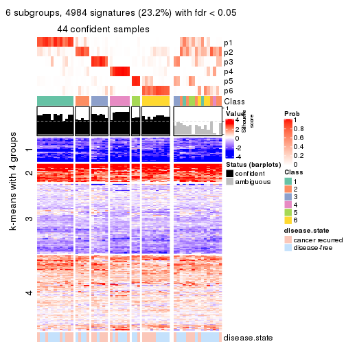</p>

</div>
</div>


Compare the overlap of signatures from different k:

```r
compare_signatures(res)
```


`get_signature()` returns a data frame invisibly. TO get the list of signatures, the function
call should be assigned to a variable explicitly. In following code, if `plot` argument is set
to `FALSE`, no heatmap is plotted while only the differential analysis is performed.

```r
# code only for demonstration
tb = get_signature(res, k = ..., plot = FALSE)
```

An example of the output of `tb` is:

```
#>   which_row         fdr    mean_1    mean_2 scaled_mean_1 scaled_mean_2 km
#> 1        38 0.042760348  8.373488  9.131774    -0.5533452     0.5164555  1
#> 2        40 0.018707592  7.106213  8.469186    -0.6173731     0.5762149  1
#> 3        55 0.019134737 10.221463 11.207825    -0.6159697     0.5749050  1
#> 4        59 0.006059896  5.921854  7.869574    -0.6899429     0.6439467  1
#> 5        60 0.018055526  8.928898 10.211722    -0.6204761     0.5791110  1
#> 6        98 0.009384629 15.714769 14.887706     0.6635654    -0.6193277  2
...
```

The columns in `tb` are:

1. `which_row`: row indices corresponding to the input matrix.
2. `fdr`: FDR for the differential test. 
3. `mean_x`: The mean value in group x.
4. `scaled_mean_x`: The mean value in group x after rows are scaled.
5. `km`: Row groups if k-means clustering is applied to rows.


UMAP plot which shows how samples are separated.


<script>
$( function() {
	$( '#tabs-MAD-NMF-dimension-reduction' ).tabs();
} );
</script>
<div id='tabs-MAD-NMF-dimension-reduction'>
<ul>
<li><a href='#tab-MAD-NMF-dimension-reduction-1'>k = 2</a></li>
<li><a href='#tab-MAD-NMF-dimension-reduction-2'>k = 3</a></li>
<li><a href='#tab-MAD-NMF-dimension-reduction-3'>k = 4</a></li>
<li><a href='#tab-MAD-NMF-dimension-reduction-4'>k = 5</a></li>
<li><a href='#tab-MAD-NMF-dimension-reduction-5'>k = 6</a></li>
</ul>
<div id='tab-MAD-NMF-dimension-reduction-1'>
<pre><code class="r">dimension_reduction(res, k = 2, method = &quot;UMAP&quot;)
</code></pre>

<p></p>

</div>
<div id='tab-MAD-NMF-dimension-reduction-2'>
<pre><code class="r">dimension_reduction(res, k = 3, method = &quot;UMAP&quot;)
</code></pre>

<p></p>

</div>
<div id='tab-MAD-NMF-dimension-reduction-3'>
<pre><code class="r">dimension_reduction(res, k = 4, method = &quot;UMAP&quot;)
</code></pre>

<p></p>

</div>
<div id='tab-MAD-NMF-dimension-reduction-4'>
<pre><code class="r">dimension_reduction(res, k = 5, method = &quot;UMAP&quot;)
</code></pre>

<p></p>

</div>
<div id='tab-MAD-NMF-dimension-reduction-5'>
<pre><code class="r">dimension_reduction(res, k = 6, method = &quot;UMAP&quot;)
</code></pre>

<p>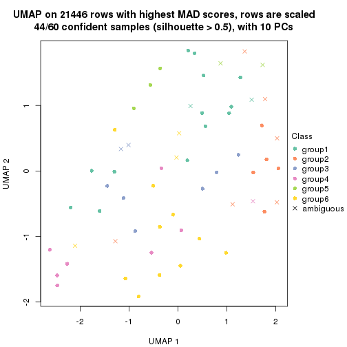</p>

</div>
</div>


Following heatmap shows how subgroups are split when increasing `k`:

```r
collect_classes(res)
```


Test correlation between subgroups and known annotations. If the known
annotation is numeric, one-way ANOVA test is applied, and if the known
annotation is discrete, chi-squared contingency table test is applied.

```r
test_to_known_factors(res)
```

```
#>          n disease.state(p) k
#> MAD:NMF 54            0.785 2
#> MAD:NMF 56            0.112 3
#> MAD:NMF 40            0.576 4
#> MAD:NMF 34            0.614 5
#> MAD:NMF 44            0.636 6
```


If matrix rows can be associated to genes, consider to use `GO_Enrichment(res,
...)` to perform function enrichment for the signature genes.


 

---------------------------------------------------


### ATC:hclust


The object with results only for a single top-value method and a single partition method 
can be extracted as:

```r
res = res_list["ATC", "hclust"]
# you can also extract it by
# res = res_list["ATC:hclust"]
```

A summary of `res` and all the functions that can be applied to it:

```r
res
```

```
#> A 'ConsensusPartition' object with k = 2, 3, 4, 5, 6.
#>   On a matrix with 21446 rows and 60 columns.
#>   Top rows (1000, 2000, 3000, 4000, 5000) are extracted by 'ATC' method.
#>   Subgroups are detected by 'hclust' method.
#>   Performed in total 1250 partitions by row resampling.
#>   Best k for subgroups seems to be 2.
#> 
#> Following methods can be applied to this 'ConsensusPartition' object:
#>  [1] "cola_report"             "collect_classes"         "collect_plots"          
#>  [4] "collect_stats"           "colnames"                "compare_signatures"     
#>  [7] "consensus_heatmap"       "dimension_reduction"     "functional_enrichment"  
#> [10] "get_anno_col"            "get_anno"                "get_classes"            
#> [13] "get_consensus"           "get_matrix"              "get_membership"         
#> [16] "get_param"               "get_signatures"          "get_stats"              
#> [19] "is_best_k"               "is_stable_k"             "membership_heatmap"     
#> [22] "ncol"                    "nrow"                    "plot_ecdf"              
#> [25] "rownames"                "select_partition_number" "show"                   
#> [28] "suggest_best_k"          "test_to_known_factors"
```

`collect_plots()` function collects all the plots made from `res` for all `k` (number of partitions)
into one single page to provide an easy and fast comparison between different `k`.

```r
collect_plots(res)
```


The plots are:

- The first row: a plot of the ECDF (Empirical cumulative distribution
  function) curves of the consensus matrix for each `k` and the heatmap of
  predicted classes for each `k`.
- The second row: heatmaps of the consensus matrix for each `k`.
- The third row: heatmaps of the membership matrix for each `k`.
- The fouth row: heatmaps of the signatures for each `k`.

All the plots in panels can be made by individual functions and they are
plotted later in this section.

`select_partition_number()` produces several plots showing different
statistics for choosing "optimized" `k`. There are following statistics:

- ECDF curves of the consensus matrix for each `k`;
- 1-PAC. [The PAC
  score](https://en.wikipedia.org/wiki/Consensus_clustering#Over-interpretation_potential_of_consensus_clustering)
  measures the proportion of the ambiguous subgrouping.
- Mean silhouette score.
- Concordance. The mean probability of fiting the consensus class ids in all
  partitions.
- Area increased. Denote $A_k$ as the area under the ECDF curve for current
  `k`, the area increased is defined as $A_k - A_{k-1}$.
- Rand index. The percent of pairs of samples that are both in a same cluster
  or both are not in a same cluster in the partition of k and k-1.
- Jaccard index. The ratio of pairs of samples are both in a same cluster in
  the partition of k and k-1 and the pairs of samples are both in a same
  cluster in the partition k or k-1.

The detailed explanations of these statistics can be found in [the cola
vignette](http://bioconductor.org/packages/devel/bioc/vignettes/cola/inst/doc/cola.html#toc_13).

Generally speaking, lower PAC score, higher mean silhouette score or higher
concordance corresponds to better partition. Rand index and Jaccard index
measure how similar the current partition is compared to partition with `k-1`.
If they are too similar, we won't accept `k` is better than `k-1`.

```r
select_partition_number(res)
```


The numeric values for all these statistics can be obtained by `get_stats()`.

```r
get_stats(res)
```

```
#>   k 1-PAC mean_silhouette concordance area_increased  Rand Jaccard
#> 2 2 0.535           0.873       0.930         0.4846 0.492   0.492
#> 3 3 0.485           0.751       0.828         0.2497 0.832   0.669
#> 4 4 0.575           0.571       0.771         0.1793 0.898   0.736
#> 5 5 0.616           0.492       0.709         0.0579 0.944   0.825
#> 6 6 0.613           0.466       0.693         0.0356 0.951   0.839
```

`suggest_best_k()` suggests the best $k$ based on these statistics. The rules are as follows:

- All $k$ with Jaccard index larger than 0.95 are removed because the increase of
  the partition number does not provides enough extra information. If all $k$ are removed,
  the best $k$ is assigned by `NA`.
- For $k$ with 1-PAC larger than 0.9, the maximal $k$ is taken as the "best k". Other $k$ is called "optional k".
- If it does not fit the second rule. The $k$ with the highest vote of highest
  1-PAC, mean silhouette and concordance is taken as the "best k".

```r
suggest_best_k(res)
```

```
#> [1] 2
```


Following shows the table of the partitions (You need to click the **show/hide
code output** link to see it). The membership matrix (columns with name `p*`)
is inferred by
[`clue::cl_consensus()`](https://www.rdocumentation.org/link/cl_consensus?package=clue)
function with the `SE` method. Basically the value in the membership matrix
represents the probability to belong to a certain group. The finall class
label for an item is determined with the group with highest probability it
belongs to.

In `get_classes()` function, the entropy is calculated from the membership
matrix and the silhouette score is calculated from the consensus matrix.


<script>
$( function() {
	$( '#tabs-ATC-hclust-get-classes' ).tabs();
} );
</script>
<div id='tabs-ATC-hclust-get-classes'>
<ul>
<li><a href='#tab-ATC-hclust-get-classes-1'>k = 2</a></li>
<li><a href='#tab-ATC-hclust-get-classes-2'>k = 3</a></li>
<li><a href='#tab-ATC-hclust-get-classes-3'>k = 4</a></li>
<li><a href='#tab-ATC-hclust-get-classes-4'>k = 5</a></li>
<li><a href='#tab-ATC-hclust-get-classes-5'>k = 6</a></li>
</ul>

<div id='tab-ATC-hclust-get-classes-1'>
<p><a id='tab-ATC-hclust-get-classes-1-a' style='color:#0366d6' href='#'>show/hide code output</a></p>
<pre><code class="r">cbind(get_classes(res, k = 2), get_membership(res, k = 2))
</code></pre>

<pre><code>#&gt;          class entropy silhouette    p1    p2
#&gt; GSM22453     1  0.5178      0.846 0.884 0.116
#&gt; GSM22458     2  0.5519      0.911 0.128 0.872
#&gt; GSM22465     1  0.0000      0.919 1.000 0.000
#&gt; GSM22466     1  0.0000      0.919 1.000 0.000
#&gt; GSM22468     2  0.5059      0.915 0.112 0.888
#&gt; GSM22469     1  0.0000      0.919 1.000 0.000
#&gt; GSM22471     1  0.0376      0.921 0.996 0.004
#&gt; GSM22472     2  0.5294      0.914 0.120 0.880
#&gt; GSM22474     2  0.7299      0.818 0.204 0.796
#&gt; GSM22476     2  0.5842      0.900 0.140 0.860
#&gt; GSM22477     2  0.0000      0.917 0.000 1.000
#&gt; GSM22478     2  0.0672      0.918 0.008 0.992
#&gt; GSM22481     1  0.1633      0.918 0.976 0.024
#&gt; GSM22484     2  0.0000      0.917 0.000 1.000
#&gt; GSM22485     1  0.1414      0.920 0.980 0.020
#&gt; GSM22487     1  0.0376      0.921 0.996 0.004
#&gt; GSM22488     1  0.1414      0.920 0.980 0.020
#&gt; GSM22489     2  0.0000      0.917 0.000 1.000
#&gt; GSM22490     2  0.5408      0.913 0.124 0.876
#&gt; GSM22492     2  0.5519      0.911 0.128 0.872
#&gt; GSM22493     1  0.1414      0.920 0.980 0.020
#&gt; GSM22494     1  0.1414      0.920 0.980 0.020
#&gt; GSM22497     1  0.1184      0.921 0.984 0.016
#&gt; GSM22498     1  0.3733      0.887 0.928 0.072
#&gt; GSM22501     1  0.0672      0.921 0.992 0.008
#&gt; GSM22502     2  0.5408      0.913 0.124 0.876
#&gt; GSM22503     1  0.0376      0.921 0.996 0.004
#&gt; GSM22504     2  0.5294      0.914 0.120 0.880
#&gt; GSM22505     1  0.0000      0.919 1.000 0.000
#&gt; GSM22506     1  0.9248      0.497 0.660 0.340
#&gt; GSM22507     1  0.3733      0.886 0.928 0.072
#&gt; GSM22508     2  0.5519      0.911 0.128 0.872
#&gt; GSM22449     2  0.5629      0.908 0.132 0.868
#&gt; GSM22450     1  0.0938      0.921 0.988 0.012
#&gt; GSM22451     2  0.0000      0.917 0.000 1.000
#&gt; GSM22452     1  0.0000      0.919 1.000 0.000
#&gt; GSM22454     1  0.1184      0.921 0.984 0.016
#&gt; GSM22455     2  0.0000      0.917 0.000 1.000
#&gt; GSM22456     2  0.0000      0.917 0.000 1.000
#&gt; GSM22457     1  0.4431      0.869 0.908 0.092
#&gt; GSM22459     2  0.0000      0.917 0.000 1.000
#&gt; GSM22460     2  0.0000      0.917 0.000 1.000
#&gt; GSM22461     2  0.0000      0.917 0.000 1.000
#&gt; GSM22462     1  0.4562      0.866 0.904 0.096
#&gt; GSM22463     2  0.0000      0.917 0.000 1.000
#&gt; GSM22464     1  0.0000      0.919 1.000 0.000
#&gt; GSM22467     1  0.0938      0.921 0.988 0.012
#&gt; GSM22470     2  0.0000      0.917 0.000 1.000
#&gt; GSM22473     2  0.5519      0.911 0.128 0.872
#&gt; GSM22475     2  0.0000      0.917 0.000 1.000
#&gt; GSM22479     1  0.0376      0.921 0.996 0.004
#&gt; GSM22480     1  0.9977      0.101 0.528 0.472
#&gt; GSM22482     1  0.0376      0.921 0.996 0.004
#&gt; GSM22483     2  0.5294      0.914 0.120 0.880
#&gt; GSM22486     1  0.9815      0.283 0.580 0.420
#&gt; GSM22491     1  0.9248      0.497 0.660 0.340
#&gt; GSM22495     2  0.5519      0.911 0.128 0.872
#&gt; GSM22496     2  0.0000      0.917 0.000 1.000
#&gt; GSM22499     2  0.5519      0.911 0.128 0.872
#&gt; GSM22500     1  0.0376      0.921 0.996 0.004
</code></pre>

<script>
$('#tab-ATC-hclust-get-classes-1-a').parent().next().next().hide();
$('#tab-ATC-hclust-get-classes-1-a').click(function(){
  $('#tab-ATC-hclust-get-classes-1-a').parent().next().next().toggle();
  return(false);
});
</script>
</div>

<div id='tab-ATC-hclust-get-classes-2'>
<p><a id='tab-ATC-hclust-get-classes-2-a' style='color:#0366d6' href='#'>show/hide code output</a></p>
<pre><code class="r">cbind(get_classes(res, k = 3), get_membership(res, k = 3))
</code></pre>

<pre><code>#&gt;          class entropy silhouette    p1    p2    p3
#&gt; GSM22453     1  0.5058     0.8270 0.756 0.244 0.000
#&gt; GSM22458     2  0.0475     0.8099 0.004 0.992 0.004
#&gt; GSM22465     1  0.0237     0.8230 0.996 0.004 0.000
#&gt; GSM22466     1  0.0237     0.8230 0.996 0.004 0.000
#&gt; GSM22468     2  0.6468    -0.0935 0.004 0.552 0.444
#&gt; GSM22469     1  0.3038     0.9085 0.896 0.104 0.000
#&gt; GSM22471     1  0.3482     0.9176 0.872 0.128 0.000
#&gt; GSM22472     2  0.3941     0.6666 0.000 0.844 0.156
#&gt; GSM22474     2  0.2448     0.7432 0.076 0.924 0.000
#&gt; GSM22476     2  0.1170     0.8033 0.016 0.976 0.008
#&gt; GSM22477     3  0.3879     0.7332 0.000 0.152 0.848
#&gt; GSM22478     3  0.6111     0.5507 0.000 0.396 0.604
#&gt; GSM22481     1  0.3879     0.9134 0.848 0.152 0.000
#&gt; GSM22484     3  0.4931     0.7258 0.000 0.232 0.768
#&gt; GSM22485     1  0.3816     0.9148 0.852 0.148 0.000
#&gt; GSM22487     1  0.3267     0.9154 0.884 0.116 0.000
#&gt; GSM22488     1  0.3752     0.9158 0.856 0.144 0.000
#&gt; GSM22489     3  0.0892     0.7448 0.000 0.020 0.980
#&gt; GSM22490     2  0.0424     0.8080 0.000 0.992 0.008
#&gt; GSM22492     2  0.0661     0.8088 0.004 0.988 0.008
#&gt; GSM22493     1  0.3816     0.9148 0.852 0.148 0.000
#&gt; GSM22494     1  0.3816     0.9148 0.852 0.148 0.000
#&gt; GSM22497     1  0.3686     0.9167 0.860 0.140 0.000
#&gt; GSM22498     1  0.4555     0.8790 0.800 0.200 0.000
#&gt; GSM22501     1  0.3551     0.9174 0.868 0.132 0.000
#&gt; GSM22502     2  0.0424     0.8080 0.000 0.992 0.008
#&gt; GSM22503     1  0.3482     0.9176 0.872 0.128 0.000
#&gt; GSM22504     2  0.3941     0.6666 0.000 0.844 0.156
#&gt; GSM22505     1  0.0237     0.8230 0.996 0.004 0.000
#&gt; GSM22506     1  0.7922     0.3919 0.532 0.408 0.060
#&gt; GSM22507     1  0.4504     0.8804 0.804 0.196 0.000
#&gt; GSM22508     2  0.0475     0.8099 0.004 0.992 0.004
#&gt; GSM22449     2  0.0237     0.8078 0.004 0.996 0.000
#&gt; GSM22450     1  0.3267     0.9135 0.884 0.116 0.000
#&gt; GSM22451     3  0.5733     0.6703 0.000 0.324 0.676
#&gt; GSM22452     1  0.0237     0.8230 0.996 0.004 0.000
#&gt; GSM22454     1  0.3340     0.9143 0.880 0.120 0.000
#&gt; GSM22455     3  0.4555     0.7546 0.000 0.200 0.800
#&gt; GSM22456     3  0.1643     0.7593 0.000 0.044 0.956
#&gt; GSM22457     1  0.4750     0.8620 0.784 0.216 0.000
#&gt; GSM22459     3  0.2878     0.7720 0.000 0.096 0.904
#&gt; GSM22460     3  0.0000     0.7376 0.000 0.000 1.000
#&gt; GSM22461     3  0.2959     0.7722 0.000 0.100 0.900
#&gt; GSM22462     1  0.4842     0.8511 0.776 0.224 0.000
#&gt; GSM22463     3  0.5905     0.6407 0.000 0.352 0.648
#&gt; GSM22464     1  0.3267     0.9155 0.884 0.116 0.000
#&gt; GSM22467     1  0.3267     0.9135 0.884 0.116 0.000
#&gt; GSM22470     3  0.5810     0.5502 0.000 0.336 0.664
#&gt; GSM22473     2  0.0475     0.8099 0.004 0.992 0.004
#&gt; GSM22475     3  0.5810     0.5502 0.000 0.336 0.664
#&gt; GSM22479     1  0.3482     0.9176 0.872 0.128 0.000
#&gt; GSM22480     2  0.8288     0.0215 0.408 0.512 0.080
#&gt; GSM22482     1  0.3482     0.9176 0.872 0.128 0.000
#&gt; GSM22483     2  0.3941     0.6666 0.000 0.844 0.156
#&gt; GSM22486     2  0.6647    -0.1672 0.452 0.540 0.008
#&gt; GSM22491     1  0.7922     0.3919 0.532 0.408 0.060
#&gt; GSM22495     2  0.0475     0.8099 0.004 0.992 0.004
#&gt; GSM22496     3  0.5733     0.6703 0.000 0.324 0.676
#&gt; GSM22499     2  0.0661     0.8088 0.004 0.988 0.008
#&gt; GSM22500     1  0.3482     0.9176 0.872 0.128 0.000
</code></pre>

<script>
$('#tab-ATC-hclust-get-classes-2-a').parent().next().next().hide();
$('#tab-ATC-hclust-get-classes-2-a').click(function(){
  $('#tab-ATC-hclust-get-classes-2-a').parent().next().next().toggle();
  return(false);
});
</script>
</div>

<div id='tab-ATC-hclust-get-classes-3'>
<p><a id='tab-ATC-hclust-get-classes-3-a' style='color:#0366d6' href='#'>show/hide code output</a></p>
<pre><code class="r">cbind(get_classes(res, k = 4), get_membership(res, k = 4))
</code></pre>

<pre><code>#&gt;          class entropy silhouette    p1    p2    p3    p4
#&gt; GSM22453     1  0.2699     0.5483 0.904 0.028 0.000 0.068
#&gt; GSM22458     2  0.0336     0.8484 0.008 0.992 0.000 0.000
#&gt; GSM22465     4  0.4585     0.9367 0.332 0.000 0.000 0.668
#&gt; GSM22466     4  0.4406     0.9673 0.300 0.000 0.000 0.700
#&gt; GSM22468     2  0.6152    -0.2019 0.008 0.496 0.464 0.032
#&gt; GSM22469     1  0.4134     0.3389 0.740 0.000 0.000 0.260
#&gt; GSM22471     1  0.4605     0.2207 0.664 0.000 0.000 0.336
#&gt; GSM22472     2  0.4375     0.6860 0.000 0.788 0.180 0.032
#&gt; GSM22474     2  0.4057     0.6600 0.160 0.812 0.000 0.028
#&gt; GSM22476     2  0.2473     0.8145 0.012 0.908 0.000 0.080
#&gt; GSM22477     3  0.3166     0.7157 0.000 0.116 0.868 0.016
#&gt; GSM22478     3  0.6272     0.5666 0.004 0.316 0.612 0.068
#&gt; GSM22481     1  0.0188     0.5873 0.996 0.004 0.000 0.000
#&gt; GSM22484     3  0.6147     0.6993 0.000 0.200 0.672 0.128
#&gt; GSM22485     1  0.0000     0.5871 1.000 0.000 0.000 0.000
#&gt; GSM22487     1  0.4866     0.0213 0.596 0.000 0.000 0.404
#&gt; GSM22488     1  0.0817     0.5809 0.976 0.000 0.000 0.024
#&gt; GSM22489     3  0.2662     0.7295 0.000 0.016 0.900 0.084
#&gt; GSM22490     2  0.0376     0.8487 0.004 0.992 0.004 0.000
#&gt; GSM22492     2  0.1474     0.8385 0.000 0.948 0.000 0.052
#&gt; GSM22493     1  0.0000     0.5871 1.000 0.000 0.000 0.000
#&gt; GSM22494     1  0.0000     0.5871 1.000 0.000 0.000 0.000
#&gt; GSM22497     1  0.1557     0.5732 0.944 0.000 0.000 0.056
#&gt; GSM22498     1  0.1733     0.5731 0.948 0.024 0.000 0.028
#&gt; GSM22501     1  0.4624     0.2200 0.660 0.000 0.000 0.340
#&gt; GSM22502     2  0.0376     0.8487 0.004 0.992 0.004 0.000
#&gt; GSM22503     1  0.4605     0.2207 0.664 0.000 0.000 0.336
#&gt; GSM22504     2  0.4375     0.6860 0.000 0.788 0.180 0.032
#&gt; GSM22505     4  0.4500     0.9555 0.316 0.000 0.000 0.684
#&gt; GSM22506     1  0.6932     0.3669 0.680 0.072 0.092 0.156
#&gt; GSM22507     1  0.6135     0.1473 0.608 0.068 0.000 0.324
#&gt; GSM22508     2  0.0188     0.8492 0.004 0.996 0.000 0.000
#&gt; GSM22449     2  0.2610     0.8110 0.012 0.900 0.000 0.088
#&gt; GSM22450     1  0.2149     0.5422 0.912 0.000 0.000 0.088
#&gt; GSM22451     3  0.5550     0.6753 0.000 0.248 0.692 0.060
#&gt; GSM22452     4  0.4406     0.9673 0.300 0.000 0.000 0.700
#&gt; GSM22454     1  0.2345     0.5361 0.900 0.000 0.000 0.100
#&gt; GSM22455     3  0.4088     0.7475 0.000 0.140 0.820 0.040
#&gt; GSM22456     3  0.0376     0.7485 0.000 0.004 0.992 0.004
#&gt; GSM22457     1  0.6407     0.1199 0.584 0.084 0.000 0.332
#&gt; GSM22459     3  0.1902     0.7615 0.000 0.064 0.932 0.004
#&gt; GSM22460     3  0.2345     0.7210 0.000 0.000 0.900 0.100
#&gt; GSM22461     3  0.2124     0.7614 0.000 0.068 0.924 0.008
#&gt; GSM22462     1  0.2256     0.5599 0.924 0.020 0.000 0.056
#&gt; GSM22463     3  0.6231     0.6616 0.004 0.240 0.660 0.096
#&gt; GSM22464     1  0.4730     0.1532 0.636 0.000 0.000 0.364
#&gt; GSM22467     1  0.2149     0.5422 0.912 0.000 0.000 0.088
#&gt; GSM22470     3  0.4560     0.4949 0.000 0.296 0.700 0.004
#&gt; GSM22473     2  0.0188     0.8492 0.004 0.996 0.000 0.000
#&gt; GSM22475     3  0.4560     0.4949 0.000 0.296 0.700 0.004
#&gt; GSM22479     1  0.4605     0.2207 0.664 0.000 0.000 0.336
#&gt; GSM22480     1  0.8319     0.2182 0.548 0.232 0.100 0.120
#&gt; GSM22482     1  0.4605     0.2207 0.664 0.000 0.000 0.336
#&gt; GSM22483     2  0.4375     0.6860 0.000 0.788 0.180 0.032
#&gt; GSM22486     1  0.8226     0.2087 0.512 0.276 0.048 0.164
#&gt; GSM22491     1  0.6932     0.3669 0.680 0.072 0.092 0.156
#&gt; GSM22495     2  0.0188     0.8492 0.004 0.996 0.000 0.000
#&gt; GSM22496     3  0.5550     0.6753 0.000 0.248 0.692 0.060
#&gt; GSM22499     2  0.1637     0.8350 0.000 0.940 0.000 0.060
#&gt; GSM22500     1  0.4605     0.2207 0.664 0.000 0.000 0.336
</code></pre>

<script>
$('#tab-ATC-hclust-get-classes-3-a').parent().next().next().hide();
$('#tab-ATC-hclust-get-classes-3-a').click(function(){
  $('#tab-ATC-hclust-get-classes-3-a').parent().next().next().toggle();
  return(false);
});
</script>
</div>

<div id='tab-ATC-hclust-get-classes-4'>
<p><a id='tab-ATC-hclust-get-classes-4-a' style='color:#0366d6' href='#'>show/hide code output</a></p>
<pre><code class="r">cbind(get_classes(res, k = 5), get_membership(res, k = 5))
</code></pre>

<pre><code>#&gt;          class entropy silhouette    p1    p2    p3    p4    p5
#&gt; GSM22453     1  0.2491      0.604 0.904 0.004 0.004 0.064 0.024
#&gt; GSM22458     2  0.0162      0.768 0.000 0.996 0.000 0.004 0.000
#&gt; GSM22465     5  0.3491      0.924 0.228 0.000 0.000 0.004 0.768
#&gt; GSM22466     5  0.3048      0.959 0.176 0.000 0.000 0.004 0.820
#&gt; GSM22468     3  0.6530      0.203 0.004 0.380 0.464 0.148 0.004
#&gt; GSM22469     1  0.3774      0.423 0.704 0.000 0.000 0.000 0.296
#&gt; GSM22471     1  0.3999      0.393 0.656 0.000 0.000 0.000 0.344
#&gt; GSM22472     4  0.5764      0.219 0.000 0.404 0.068 0.520 0.008
#&gt; GSM22474     2  0.4104      0.554 0.152 0.800 0.012 0.012 0.024
#&gt; GSM22476     2  0.5380      0.314 0.012 0.520 0.004 0.440 0.024
#&gt; GSM22477     4  0.4249     -0.330 0.000 0.000 0.432 0.568 0.000
#&gt; GSM22478     3  0.5679      0.490 0.004 0.136 0.656 0.200 0.004
#&gt; GSM22481     1  0.0162      0.641 0.996 0.004 0.000 0.000 0.000
#&gt; GSM22484     3  0.3915      0.502 0.000 0.096 0.812 0.088 0.004
#&gt; GSM22485     1  0.0000      0.641 1.000 0.000 0.000 0.000 0.000
#&gt; GSM22487     1  0.4235      0.247 0.576 0.000 0.000 0.000 0.424
#&gt; GSM22488     1  0.0794      0.636 0.972 0.000 0.000 0.000 0.028
#&gt; GSM22489     3  0.4264      0.380 0.000 0.000 0.620 0.376 0.004
#&gt; GSM22490     2  0.0771      0.765 0.000 0.976 0.004 0.020 0.000
#&gt; GSM22492     2  0.5021      0.333 0.000 0.556 0.008 0.416 0.020
#&gt; GSM22493     1  0.0000      0.641 1.000 0.000 0.000 0.000 0.000
#&gt; GSM22494     1  0.0000      0.641 1.000 0.000 0.000 0.000 0.000
#&gt; GSM22497     1  0.1478      0.633 0.936 0.000 0.000 0.000 0.064
#&gt; GSM22498     1  0.1794      0.628 0.944 0.008 0.012 0.012 0.024
#&gt; GSM22501     1  0.4268      0.387 0.648 0.000 0.000 0.008 0.344
#&gt; GSM22502     2  0.0771      0.765 0.000 0.976 0.004 0.020 0.000
#&gt; GSM22503     1  0.4151      0.388 0.652 0.000 0.000 0.004 0.344
#&gt; GSM22504     4  0.5764      0.219 0.000 0.404 0.068 0.520 0.008
#&gt; GSM22505     5  0.3266      0.948 0.200 0.000 0.000 0.004 0.796
#&gt; GSM22506     1  0.6293      0.413 0.680 0.028 0.056 0.076 0.160
#&gt; GSM22507     1  0.5564      0.324 0.596 0.068 0.000 0.008 0.328
#&gt; GSM22508     2  0.0162      0.768 0.000 0.996 0.004 0.000 0.000
#&gt; GSM22449     2  0.2583      0.704 0.000 0.864 0.000 0.132 0.004
#&gt; GSM22450     1  0.1908      0.606 0.908 0.000 0.000 0.000 0.092
#&gt; GSM22451     3  0.4597      0.554 0.000 0.080 0.764 0.144 0.012
#&gt; GSM22452     5  0.3048      0.959 0.176 0.000 0.000 0.004 0.820
#&gt; GSM22454     1  0.2127      0.603 0.892 0.000 0.000 0.000 0.108
#&gt; GSM22455     3  0.4134      0.565 0.000 0.044 0.760 0.196 0.000
#&gt; GSM22456     3  0.4397      0.423 0.000 0.004 0.564 0.432 0.000
#&gt; GSM22457     1  0.5925      0.300 0.572 0.072 0.000 0.020 0.336
#&gt; GSM22459     3  0.5096      0.444 0.000 0.036 0.520 0.444 0.000
#&gt; GSM22460     3  0.4551      0.384 0.000 0.000 0.616 0.368 0.016
#&gt; GSM22461     3  0.5106      0.441 0.000 0.036 0.508 0.456 0.000
#&gt; GSM22462     1  0.2053      0.615 0.924 0.004 0.000 0.048 0.024
#&gt; GSM22463     3  0.5068      0.512 0.004 0.072 0.760 0.048 0.116
#&gt; GSM22464     1  0.4251      0.347 0.624 0.000 0.000 0.004 0.372
#&gt; GSM22467     1  0.1908      0.606 0.908 0.000 0.000 0.000 0.092
#&gt; GSM22470     4  0.3424      0.156 0.000 0.000 0.240 0.760 0.000
#&gt; GSM22473     2  0.0162      0.768 0.000 0.996 0.004 0.000 0.000
#&gt; GSM22475     4  0.3424      0.156 0.000 0.000 0.240 0.760 0.000
#&gt; GSM22479     1  0.4151      0.388 0.652 0.000 0.000 0.004 0.344
#&gt; GSM22480     1  0.7937      0.244 0.548 0.100 0.164 0.048 0.140
#&gt; GSM22482     1  0.3999      0.393 0.656 0.000 0.000 0.000 0.344
#&gt; GSM22483     4  0.5764      0.219 0.000 0.404 0.068 0.520 0.008
#&gt; GSM22486     1  0.8165      0.235 0.512 0.192 0.040 0.120 0.136
#&gt; GSM22491     1  0.6293      0.413 0.680 0.028 0.056 0.076 0.160
#&gt; GSM22495     2  0.0162      0.768 0.000 0.996 0.004 0.000 0.000
#&gt; GSM22496     3  0.4597      0.554 0.000 0.080 0.764 0.144 0.012
#&gt; GSM22499     2  0.5035      0.332 0.000 0.548 0.008 0.424 0.020
#&gt; GSM22500     1  0.3999      0.393 0.656 0.000 0.000 0.000 0.344
</code></pre>

<script>
$('#tab-ATC-hclust-get-classes-4-a').parent().next().next().hide();
$('#tab-ATC-hclust-get-classes-4-a').click(function(){
  $('#tab-ATC-hclust-get-classes-4-a').parent().next().next().toggle();
  return(false);
});
</script>
</div>

<div id='tab-ATC-hclust-get-classes-5'>
<p><a id='tab-ATC-hclust-get-classes-5-a' style='color:#0366d6' href='#'>show/hide code output</a></p>
<pre><code class="r">cbind(get_classes(res, k = 6), get_membership(res, k = 6))
</code></pre>

<pre><code>#&gt;          class entropy silhouette    p1    p2    p3    p4    p5    p6
#&gt; GSM22453     1  0.2290     0.5877 0.892 0.000 0.000 0.084 0.004 0.020
#&gt; GSM22458     5  0.3101     0.8312 0.000 0.000 0.000 0.244 0.756 0.000
#&gt; GSM22465     2  0.3873     0.9264 0.168 0.780 0.000 0.004 0.020 0.028
#&gt; GSM22466     2  0.3367     0.9567 0.116 0.832 0.000 0.004 0.020 0.028
#&gt; GSM22468     3  0.7306     0.0785 0.004 0.000 0.448 0.208 0.152 0.188
#&gt; GSM22469     1  0.3563     0.4193 0.664 0.336 0.000 0.000 0.000 0.000
#&gt; GSM22471     1  0.4333     0.3860 0.596 0.376 0.000 0.000 0.000 0.028
#&gt; GSM22472     4  0.4495     0.7707 0.000 0.000 0.164 0.740 0.064 0.032
#&gt; GSM22474     5  0.5656     0.5860 0.116 0.028 0.000 0.144 0.676 0.036
#&gt; GSM22476     4  0.1442     0.7197 0.004 0.000 0.000 0.944 0.040 0.012
#&gt; GSM22477     3  0.4881    -0.0550 0.000 0.000 0.648 0.120 0.000 0.232
#&gt; GSM22478     3  0.6229     0.1757 0.004 0.000 0.488 0.100 0.048 0.360
#&gt; GSM22481     1  0.0291     0.6277 0.992 0.000 0.000 0.004 0.004 0.000
#&gt; GSM22484     6  0.4840     0.0000 0.000 0.000 0.200 0.064 0.036 0.700
#&gt; GSM22485     1  0.0146     0.6277 0.996 0.000 0.000 0.000 0.000 0.004
#&gt; GSM22487     1  0.4403     0.2463 0.508 0.468 0.000 0.000 0.000 0.024
#&gt; GSM22488     1  0.0935     0.6220 0.964 0.032 0.000 0.000 0.000 0.004
#&gt; GSM22489     3  0.4305    -0.2928 0.000 0.000 0.544 0.020 0.000 0.436
#&gt; GSM22490     5  0.3428     0.7934 0.000 0.000 0.000 0.304 0.696 0.000
#&gt; GSM22492     4  0.1327     0.7437 0.000 0.000 0.000 0.936 0.064 0.000
#&gt; GSM22493     1  0.0146     0.6277 0.996 0.000 0.000 0.000 0.000 0.004
#&gt; GSM22494     1  0.0146     0.6277 0.996 0.000 0.000 0.000 0.000 0.004
#&gt; GSM22497     1  0.1866     0.6182 0.908 0.084 0.000 0.000 0.000 0.008
#&gt; GSM22498     1  0.2381     0.6150 0.908 0.028 0.000 0.016 0.012 0.036
#&gt; GSM22501     1  0.4531     0.3842 0.592 0.376 0.000 0.004 0.004 0.024
#&gt; GSM22502     5  0.3428     0.7934 0.000 0.000 0.000 0.304 0.696 0.000
#&gt; GSM22503     1  0.4467     0.3815 0.592 0.376 0.000 0.000 0.004 0.028
#&gt; GSM22504     4  0.4495     0.7707 0.000 0.000 0.164 0.740 0.064 0.032
#&gt; GSM22505     2  0.3693     0.9409 0.148 0.800 0.000 0.004 0.020 0.028
#&gt; GSM22506     1  0.5917     0.3961 0.660 0.108 0.000 0.096 0.016 0.120
#&gt; GSM22507     1  0.5902     0.3235 0.540 0.352 0.000 0.036 0.044 0.028
#&gt; GSM22508     5  0.3240     0.8328 0.000 0.000 0.000 0.244 0.752 0.004
#&gt; GSM22449     5  0.4222     0.3663 0.000 0.004 0.000 0.252 0.700 0.044
#&gt; GSM22450     1  0.1863     0.5925 0.896 0.104 0.000 0.000 0.000 0.000
#&gt; GSM22451     3  0.5245     0.1944 0.000 0.004 0.552 0.060 0.012 0.372
#&gt; GSM22452     2  0.3367     0.9567 0.116 0.832 0.000 0.004 0.020 0.028
#&gt; GSM22454     1  0.2178     0.5903 0.868 0.132 0.000 0.000 0.000 0.000
#&gt; GSM22455     3  0.3888     0.1578 0.000 0.000 0.672 0.000 0.016 0.312
#&gt; GSM22456     3  0.1080     0.2561 0.000 0.000 0.960 0.004 0.004 0.032
#&gt; GSM22457     1  0.6239     0.2996 0.516 0.352 0.000 0.056 0.044 0.032
#&gt; GSM22459     3  0.1594     0.3157 0.000 0.000 0.932 0.052 0.016 0.000
#&gt; GSM22460     3  0.4262    -0.3164 0.000 0.000 0.508 0.016 0.000 0.476
#&gt; GSM22461     3  0.1952     0.3162 0.000 0.000 0.920 0.052 0.016 0.012
#&gt; GSM22462     1  0.1982     0.5986 0.912 0.000 0.000 0.068 0.004 0.016
#&gt; GSM22463     3  0.6419     0.0509 0.004 0.096 0.448 0.064 0.000 0.388
#&gt; GSM22464     1  0.4394     0.3515 0.568 0.408 0.000 0.000 0.004 0.020
#&gt; GSM22467     1  0.1863     0.5925 0.896 0.104 0.000 0.000 0.000 0.000
#&gt; GSM22470     3  0.4282     0.1096 0.000 0.000 0.656 0.304 0.000 0.040
#&gt; GSM22473     5  0.3240     0.8328 0.000 0.000 0.000 0.244 0.752 0.004
#&gt; GSM22475     3  0.4282     0.1096 0.000 0.000 0.656 0.304 0.000 0.040
#&gt; GSM22479     1  0.4467     0.3815 0.592 0.376 0.000 0.000 0.004 0.028
#&gt; GSM22480     1  0.6643     0.1848 0.536 0.108 0.000 0.056 0.028 0.272
#&gt; GSM22482     1  0.4263     0.3891 0.600 0.376 0.000 0.000 0.000 0.024
#&gt; GSM22483     4  0.4495     0.7707 0.000 0.000 0.164 0.740 0.064 0.032
#&gt; GSM22486     1  0.7490     0.2256 0.476 0.112 0.008 0.276 0.052 0.076
#&gt; GSM22491     1  0.5917     0.3961 0.660 0.108 0.000 0.096 0.016 0.120
#&gt; GSM22495     5  0.3240     0.8328 0.000 0.000 0.000 0.244 0.752 0.004
#&gt; GSM22496     3  0.5245     0.1944 0.000 0.004 0.552 0.060 0.012 0.372
#&gt; GSM22499     4  0.1204     0.7437 0.000 0.000 0.000 0.944 0.056 0.000
#&gt; GSM22500     1  0.4263     0.3891 0.600 0.376 0.000 0.000 0.000 0.024
</code></pre>

<script>
$('#tab-ATC-hclust-get-classes-5-a').parent().next().next().hide();
$('#tab-ATC-hclust-get-classes-5-a').click(function(){
  $('#tab-ATC-hclust-get-classes-5-a').parent().next().next().toggle();
  return(false);
});
</script>
</div>
</div>

Heatmaps for the consensus matrix. It visualizes the probability of two
samples to be in a same group.


<script>
$( function() {
	$( '#tabs-ATC-hclust-consensus-heatmap' ).tabs();
} );
</script>
<div id='tabs-ATC-hclust-consensus-heatmap'>
<ul>
<li><a href='#tab-ATC-hclust-consensus-heatmap-1'>k = 2</a></li>
<li><a href='#tab-ATC-hclust-consensus-heatmap-2'>k = 3</a></li>
<li><a href='#tab-ATC-hclust-consensus-heatmap-3'>k = 4</a></li>
<li><a href='#tab-ATC-hclust-consensus-heatmap-4'>k = 5</a></li>
<li><a href='#tab-ATC-hclust-consensus-heatmap-5'>k = 6</a></li>
</ul>
<div id='tab-ATC-hclust-consensus-heatmap-1'>
<pre><code class="r">consensus_heatmap(res, k = 2)
</code></pre>

<p></p>

</div>
<div id='tab-ATC-hclust-consensus-heatmap-2'>
<pre><code class="r">consensus_heatmap(res, k = 3)
</code></pre>

<p></p>

</div>
<div id='tab-ATC-hclust-consensus-heatmap-3'>
<pre><code class="r">consensus_heatmap(res, k = 4)
</code></pre>

<p></p>

</div>
<div id='tab-ATC-hclust-consensus-heatmap-4'>
<pre><code class="r">consensus_heatmap(res, k = 5)
</code></pre>

<p></p>

</div>
<div id='tab-ATC-hclust-consensus-heatmap-5'>
<pre><code class="r">consensus_heatmap(res, k = 6)
</code></pre>

<p>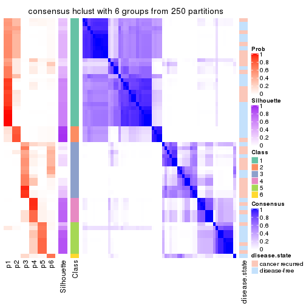</p>

</div>
</div>

Heatmaps for the membership of samples in all partitions to see how consistent they are:


<script>
$( function() {
	$( '#tabs-ATC-hclust-membership-heatmap' ).tabs();
} );
</script>
<div id='tabs-ATC-hclust-membership-heatmap'>
<ul>
<li><a href='#tab-ATC-hclust-membership-heatmap-1'>k = 2</a></li>
<li><a href='#tab-ATC-hclust-membership-heatmap-2'>k = 3</a></li>
<li><a href='#tab-ATC-hclust-membership-heatmap-3'>k = 4</a></li>
<li><a href='#tab-ATC-hclust-membership-heatmap-4'>k = 5</a></li>
<li><a href='#tab-ATC-hclust-membership-heatmap-5'>k = 6</a></li>
</ul>
<div id='tab-ATC-hclust-membership-heatmap-1'>
<pre><code class="r">membership_heatmap(res, k = 2)
</code></pre>

<p></p>

</div>
<div id='tab-ATC-hclust-membership-heatmap-2'>
<pre><code class="r">membership_heatmap(res, k = 3)
</code></pre>

<p></p>

</div>
<div id='tab-ATC-hclust-membership-heatmap-3'>
<pre><code class="r">membership_heatmap(res, k = 4)
</code></pre>

<p></p>

</div>
<div id='tab-ATC-hclust-membership-heatmap-4'>
<pre><code class="r">membership_heatmap(res, k = 5)
</code></pre>

<p></p>

</div>
<div id='tab-ATC-hclust-membership-heatmap-5'>
<pre><code class="r">membership_heatmap(res, k = 6)
</code></pre>

<p></p>

</div>
</div>

As soon as we have had the classes for columns, we can look for signatures
which are significantly different between classes which can be candidate marks
for certain classes. Following are the heatmaps for signatures.


Signature heatmaps where rows are scaled:


<script>
$( function() {
	$( '#tabs-ATC-hclust-get-signatures' ).tabs();
} );
</script>
<div id='tabs-ATC-hclust-get-signatures'>
<ul>
<li><a href='#tab-ATC-hclust-get-signatures-1'>k = 2</a></li>
<li><a href='#tab-ATC-hclust-get-signatures-2'>k = 3</a></li>
<li><a href='#tab-ATC-hclust-get-signatures-3'>k = 4</a></li>
<li><a href='#tab-ATC-hclust-get-signatures-4'>k = 5</a></li>
<li><a href='#tab-ATC-hclust-get-signatures-5'>k = 6</a></li>
</ul>
<div id='tab-ATC-hclust-get-signatures-1'>
<pre><code class="r">get_signatures(res, k = 2)
</code></pre>

<p></p>

</div>
<div id='tab-ATC-hclust-get-signatures-2'>
<pre><code class="r">get_signatures(res, k = 3)
</code></pre>

<p></p>

</div>
<div id='tab-ATC-hclust-get-signatures-3'>
<pre><code class="r">get_signatures(res, k = 4)
</code></pre>

<p></p>

</div>
<div id='tab-ATC-hclust-get-signatures-4'>
<pre><code class="r">get_signatures(res, k = 5)
</code></pre>

<p></p>

</div>
<div id='tab-ATC-hclust-get-signatures-5'>
<pre><code class="r">get_signatures(res, k = 6)
</code></pre>

<p></p>

</div>
</div>


Signature heatmaps where rows are not scaled:


<script>
$( function() {
	$( '#tabs-ATC-hclust-get-signatures-no-scale' ).tabs();
} );
</script>
<div id='tabs-ATC-hclust-get-signatures-no-scale'>
<ul>
<li><a href='#tab-ATC-hclust-get-signatures-no-scale-1'>k = 2</a></li>
<li><a href='#tab-ATC-hclust-get-signatures-no-scale-2'>k = 3</a></li>
<li><a href='#tab-ATC-hclust-get-signatures-no-scale-3'>k = 4</a></li>
<li><a href='#tab-ATC-hclust-get-signatures-no-scale-4'>k = 5</a></li>
<li><a href='#tab-ATC-hclust-get-signatures-no-scale-5'>k = 6</a></li>
</ul>
<div id='tab-ATC-hclust-get-signatures-no-scale-1'>
<pre><code class="r">get_signatures(res, k = 2, scale_rows = FALSE)
</code></pre>

<p></p>

</div>
<div id='tab-ATC-hclust-get-signatures-no-scale-2'>
<pre><code class="r">get_signatures(res, k = 3, scale_rows = FALSE)
</code></pre>

<p></p>

</div>
<div id='tab-ATC-hclust-get-signatures-no-scale-3'>
<pre><code class="r">get_signatures(res, k = 4, scale_rows = FALSE)
</code></pre>

<p></p>

</div>
<div id='tab-ATC-hclust-get-signatures-no-scale-4'>
<pre><code class="r">get_signatures(res, k = 5, scale_rows = FALSE)
</code></pre>

<p></p>

</div>
<div id='tab-ATC-hclust-get-signatures-no-scale-5'>
<pre><code class="r">get_signatures(res, k = 6, scale_rows = FALSE)
</code></pre>

<p></p>

</div>
</div>


Compare the overlap of signatures from different k:

```r
compare_signatures(res)
```


`get_signature()` returns a data frame invisibly. TO get the list of signatures, the function
call should be assigned to a variable explicitly. In following code, if `plot` argument is set
to `FALSE`, no heatmap is plotted while only the differential analysis is performed.

```r
# code only for demonstration
tb = get_signature(res, k = ..., plot = FALSE)
```

An example of the output of `tb` is:

```
#>   which_row         fdr    mean_1    mean_2 scaled_mean_1 scaled_mean_2 km
#> 1        38 0.042760348  8.373488  9.131774    -0.5533452     0.5164555  1
#> 2        40 0.018707592  7.106213  8.469186    -0.6173731     0.5762149  1
#> 3        55 0.019134737 10.221463 11.207825    -0.6159697     0.5749050  1
#> 4        59 0.006059896  5.921854  7.869574    -0.6899429     0.6439467  1
#> 5        60 0.018055526  8.928898 10.211722    -0.6204761     0.5791110  1
#> 6        98 0.009384629 15.714769 14.887706     0.6635654    -0.6193277  2
...
```

The columns in `tb` are:

1. `which_row`: row indices corresponding to the input matrix.
2. `fdr`: FDR for the differential test. 
3. `mean_x`: The mean value in group x.
4. `scaled_mean_x`: The mean value in group x after rows are scaled.
5. `km`: Row groups if k-means clustering is applied to rows.


UMAP plot which shows how samples are separated.


<script>
$( function() {
	$( '#tabs-ATC-hclust-dimension-reduction' ).tabs();
} );
</script>
<div id='tabs-ATC-hclust-dimension-reduction'>
<ul>
<li><a href='#tab-ATC-hclust-dimension-reduction-1'>k = 2</a></li>
<li><a href='#tab-ATC-hclust-dimension-reduction-2'>k = 3</a></li>
<li><a href='#tab-ATC-hclust-dimension-reduction-3'>k = 4</a></li>
<li><a href='#tab-ATC-hclust-dimension-reduction-4'>k = 5</a></li>
<li><a href='#tab-ATC-hclust-dimension-reduction-5'>k = 6</a></li>
</ul>
<div id='tab-ATC-hclust-dimension-reduction-1'>
<pre><code class="r">dimension_reduction(res, k = 2, method = &quot;UMAP&quot;)
</code></pre>

<p></p>

</div>
<div id='tab-ATC-hclust-dimension-reduction-2'>
<pre><code class="r">dimension_reduction(res, k = 3, method = &quot;UMAP&quot;)
</code></pre>

<p></p>

</div>
<div id='tab-ATC-hclust-dimension-reduction-3'>
<pre><code class="r">dimension_reduction(res, k = 4, method = &quot;UMAP&quot;)
</code></pre>

<p></p>

</div>
<div id='tab-ATC-hclust-dimension-reduction-4'>
<pre><code class="r">dimension_reduction(res, k = 5, method = &quot;UMAP&quot;)
</code></pre>

<p></p>

</div>
<div id='tab-ATC-hclust-dimension-reduction-5'>
<pre><code class="r">dimension_reduction(res, k = 6, method = &quot;UMAP&quot;)
</code></pre>

<p></p>

</div>
</div>


Following heatmap shows how subgroups are split when increasing `k`:

```r
collect_classes(res)
```

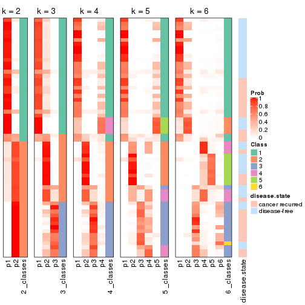


Test correlation between subgroups and known annotations. If the known
annotation is numeric, one-way ANOVA test is applied, and if the known
annotation is discrete, chi-squared contingency table test is applied.

```r
test_to_known_factors(res)
```

```
#>             n disease.state(p) k
#> ATC:hclust 56           0.4033 2
#> ATC:hclust 55           0.0774 3
#> ATC:hclust 42           0.2577 4
#> ATC:hclust 29           0.2739 5
#> ATC:hclust 29           0.9877 6
```


If matrix rows can be associated to genes, consider to use `GO_Enrichment(res,
...)` to perform function enrichment for the signature genes.


 

---------------------------------------------------


### ATC:kmeans**


The object with results only for a single top-value method and a single partition method 
can be extracted as:

```r
res = res_list["ATC", "kmeans"]
# you can also extract it by
# res = res_list["ATC:kmeans"]
```

A summary of `res` and all the functions that can be applied to it:

```r
res
```

```
#> A 'ConsensusPartition' object with k = 2, 3, 4, 5, 6.
#>   On a matrix with 21446 rows and 60 columns.
#>   Top rows (1000, 2000, 3000, 4000, 5000) are extracted by 'ATC' method.
#>   Subgroups are detected by 'kmeans' method.
#>   Performed in total 1250 partitions by row resampling.
#>   Best k for subgroups seems to be 2.
#> 
#> Following methods can be applied to this 'ConsensusPartition' object:
#>  [1] "cola_report"             "collect_classes"         "collect_plots"          
#>  [4] "collect_stats"           "colnames"                "compare_signatures"     
#>  [7] "consensus_heatmap"       "dimension_reduction"     "functional_enrichment"  
#> [10] "get_anno_col"            "get_anno"                "get_classes"            
#> [13] "get_consensus"           "get_matrix"              "get_membership"         
#> [16] "get_param"               "get_signatures"          "get_stats"              
#> [19] "is_best_k"               "is_stable_k"             "membership_heatmap"     
#> [22] "ncol"                    "nrow"                    "plot_ecdf"              
#> [25] "rownames"                "select_partition_number" "show"                   
#> [28] "suggest_best_k"          "test_to_known_factors"
```

`collect_plots()` function collects all the plots made from `res` for all `k` (number of partitions)
into one single page to provide an easy and fast comparison between different `k`.

```r
collect_plots(res)
```


The plots are:

- The first row: a plot of the ECDF (Empirical cumulative distribution
  function) curves of the consensus matrix for each `k` and the heatmap of
  predicted classes for each `k`.
- The second row: heatmaps of the consensus matrix for each `k`.
- The third row: heatmaps of the membership matrix for each `k`.
- The fouth row: heatmaps of the signatures for each `k`.

All the plots in panels can be made by individual functions and they are
plotted later in this section.

`select_partition_number()` produces several plots showing different
statistics for choosing "optimized" `k`. There are following statistics:

- ECDF curves of the consensus matrix for each `k`;
- 1-PAC. [The PAC
  score](https://en.wikipedia.org/wiki/Consensus_clustering#Over-interpretation_potential_of_consensus_clustering)
  measures the proportion of the ambiguous subgrouping.
- Mean silhouette score.
- Concordance. The mean probability of fiting the consensus class ids in all
  partitions.
- Area increased. Denote $A_k$ as the area under the ECDF curve for current
  `k`, the area increased is defined as $A_k - A_{k-1}$.
- Rand index. The percent of pairs of samples that are both in a same cluster
  or both are not in a same cluster in the partition of k and k-1.
- Jaccard index. The ratio of pairs of samples are both in a same cluster in
  the partition of k and k-1 and the pairs of samples are both in a same
  cluster in the partition k or k-1.

The detailed explanations of these statistics can be found in [the cola
vignette](http://bioconductor.org/packages/devel/bioc/vignettes/cola/inst/doc/cola.html#toc_13).

Generally speaking, lower PAC score, higher mean silhouette score or higher
concordance corresponds to better partition. Rand index and Jaccard index
measure how similar the current partition is compared to partition with `k-1`.
If they are too similar, we won't accept `k` is better than `k-1`.

```r
select_partition_number(res)
```


The numeric values for all these statistics can be obtained by `get_stats()`.

```r
get_stats(res)
```

```
#>   k 1-PAC mean_silhouette concordance area_increased  Rand Jaccard
#> 2 2 1.000           0.995       0.998         0.5089 0.492   0.492
#> 3 3 0.747           0.844       0.866         0.2928 0.801   0.617
#> 4 4 0.656           0.712       0.829         0.1305 0.869   0.641
#> 5 5 0.665           0.553       0.734         0.0673 0.956   0.829
#> 6 6 0.701           0.582       0.713         0.0428 0.892   0.553
```

`suggest_best_k()` suggests the best $k$ based on these statistics. The rules are as follows:

- All $k$ with Jaccard index larger than 0.95 are removed because the increase of
  the partition number does not provides enough extra information. If all $k$ are removed,
  the best $k$ is assigned by `NA`.
- For $k$ with 1-PAC larger than 0.9, the maximal $k$ is taken as the "best k". Other $k$ is called "optional k".
- If it does not fit the second rule. The $k$ with the highest vote of highest
  1-PAC, mean silhouette and concordance is taken as the "best k".

```r
suggest_best_k(res)
```

```
#> [1] 2
```


Following shows the table of the partitions (You need to click the **show/hide
code output** link to see it). The membership matrix (columns with name `p*`)
is inferred by
[`clue::cl_consensus()`](https://www.rdocumentation.org/link/cl_consensus?package=clue)
function with the `SE` method. Basically the value in the membership matrix
represents the probability to belong to a certain group. The finall class
label for an item is determined with the group with highest probability it
belongs to.

In `get_classes()` function, the entropy is calculated from the membership
matrix and the silhouette score is calculated from the consensus matrix.


<script>
$( function() {
	$( '#tabs-ATC-kmeans-get-classes' ).tabs();
} );
</script>
<div id='tabs-ATC-kmeans-get-classes'>
<ul>
<li><a href='#tab-ATC-kmeans-get-classes-1'>k = 2</a></li>
<li><a href='#tab-ATC-kmeans-get-classes-2'>k = 3</a></li>
<li><a href='#tab-ATC-kmeans-get-classes-3'>k = 4</a></li>
<li><a href='#tab-ATC-kmeans-get-classes-4'>k = 5</a></li>
<li><a href='#tab-ATC-kmeans-get-classes-5'>k = 6</a></li>
</ul>

<div id='tab-ATC-kmeans-get-classes-1'>
<p><a id='tab-ATC-kmeans-get-classes-1-a' style='color:#0366d6' href='#'>show/hide code output</a></p>
<pre><code class="r">cbind(get_classes(res, k = 2), get_membership(res, k = 2))
</code></pre>

<pre><code>#&gt;          class entropy silhouette    p1    p2
#&gt; GSM22453     1  0.0000      1.000 1.000 0.000
#&gt; GSM22458     2  0.0000      0.995 0.000 1.000
#&gt; GSM22465     1  0.0000      1.000 1.000 0.000
#&gt; GSM22466     1  0.0000      1.000 1.000 0.000
#&gt; GSM22468     2  0.0000      0.995 0.000 1.000
#&gt; GSM22469     1  0.0000      1.000 1.000 0.000
#&gt; GSM22471     1  0.0000      1.000 1.000 0.000
#&gt; GSM22472     2  0.0000      0.995 0.000 1.000
#&gt; GSM22474     1  0.0000      1.000 1.000 0.000
#&gt; GSM22476     2  0.0000      0.995 0.000 1.000
#&gt; GSM22477     2  0.0000      0.995 0.000 1.000
#&gt; GSM22478     2  0.0000      0.995 0.000 1.000
#&gt; GSM22481     1  0.0000      1.000 1.000 0.000
#&gt; GSM22484     2  0.0000      0.995 0.000 1.000
#&gt; GSM22485     1  0.0000      1.000 1.000 0.000
#&gt; GSM22487     1  0.0000      1.000 1.000 0.000
#&gt; GSM22488     1  0.0000      1.000 1.000 0.000
#&gt; GSM22489     2  0.0000      0.995 0.000 1.000
#&gt; GSM22490     2  0.0000      0.995 0.000 1.000
#&gt; GSM22492     2  0.0000      0.995 0.000 1.000
#&gt; GSM22493     1  0.0000      1.000 1.000 0.000
#&gt; GSM22494     1  0.0000      1.000 1.000 0.000
#&gt; GSM22497     1  0.0000      1.000 1.000 0.000
#&gt; GSM22498     1  0.0000      1.000 1.000 0.000
#&gt; GSM22501     1  0.0000      1.000 1.000 0.000
#&gt; GSM22502     2  0.0000      0.995 0.000 1.000
#&gt; GSM22503     1  0.0000      1.000 1.000 0.000
#&gt; GSM22504     2  0.0000      0.995 0.000 1.000
#&gt; GSM22505     1  0.0000      1.000 1.000 0.000
#&gt; GSM22506     2  0.5629      0.848 0.132 0.868
#&gt; GSM22507     1  0.0000      1.000 1.000 0.000
#&gt; GSM22508     2  0.0000      0.995 0.000 1.000
#&gt; GSM22449     2  0.0376      0.992 0.004 0.996
#&gt; GSM22450     1  0.0000      1.000 1.000 0.000
#&gt; GSM22451     2  0.0000      0.995 0.000 1.000
#&gt; GSM22452     1  0.0000      1.000 1.000 0.000
#&gt; GSM22454     1  0.0000      1.000 1.000 0.000
#&gt; GSM22455     2  0.0000      0.995 0.000 1.000
#&gt; GSM22456     2  0.0000      0.995 0.000 1.000
#&gt; GSM22457     1  0.0000      1.000 1.000 0.000
#&gt; GSM22459     2  0.0000      0.995 0.000 1.000
#&gt; GSM22460     2  0.0000      0.995 0.000 1.000
#&gt; GSM22461     2  0.0000      0.995 0.000 1.000
#&gt; GSM22462     1  0.0000      1.000 1.000 0.000
#&gt; GSM22463     2  0.0000      0.995 0.000 1.000
#&gt; GSM22464     1  0.0000      1.000 1.000 0.000
#&gt; GSM22467     1  0.0000      1.000 1.000 0.000
#&gt; GSM22470     2  0.0000      0.995 0.000 1.000
#&gt; GSM22473     2  0.0000      0.995 0.000 1.000
#&gt; GSM22475     2  0.0000      0.995 0.000 1.000
#&gt; GSM22479     1  0.0000      1.000 1.000 0.000
#&gt; GSM22480     2  0.0000      0.995 0.000 1.000
#&gt; GSM22482     1  0.0000      1.000 1.000 0.000
#&gt; GSM22483     2  0.0000      0.995 0.000 1.000
#&gt; GSM22486     1  0.0000      1.000 1.000 0.000
#&gt; GSM22491     1  0.0000      1.000 1.000 0.000
#&gt; GSM22495     2  0.0000      0.995 0.000 1.000
#&gt; GSM22496     2  0.0000      0.995 0.000 1.000
#&gt; GSM22499     2  0.0000      0.995 0.000 1.000
#&gt; GSM22500     1  0.0000      1.000 1.000 0.000
</code></pre>

<script>
$('#tab-ATC-kmeans-get-classes-1-a').parent().next().next().hide();
$('#tab-ATC-kmeans-get-classes-1-a').click(function(){
  $('#tab-ATC-kmeans-get-classes-1-a').parent().next().next().toggle();
  return(false);
});
</script>
</div>

<div id='tab-ATC-kmeans-get-classes-2'>
<p><a id='tab-ATC-kmeans-get-classes-2-a' style='color:#0366d6' href='#'>show/hide code output</a></p>
<pre><code class="r">cbind(get_classes(res, k = 3), get_membership(res, k = 3))
</code></pre>

<pre><code>#&gt;          class entropy silhouette    p1    p2    p3
#&gt; GSM22453     1  0.0424      0.901 0.992 0.008 0.000
#&gt; GSM22458     2  0.0747      0.861 0.000 0.984 0.016
#&gt; GSM22465     1  0.0000      0.902 1.000 0.000 0.000
#&gt; GSM22466     1  0.0000      0.902 1.000 0.000 0.000
#&gt; GSM22468     2  0.2448      0.865 0.000 0.924 0.076
#&gt; GSM22469     1  0.0000      0.902 1.000 0.000 0.000
#&gt; GSM22471     1  0.5810      0.628 0.664 0.336 0.000
#&gt; GSM22472     2  0.5905      0.575 0.000 0.648 0.352
#&gt; GSM22474     2  0.0592      0.855 0.012 0.988 0.000
#&gt; GSM22476     2  0.0237      0.858 0.000 0.996 0.004
#&gt; GSM22477     3  0.0000      0.994 0.000 0.000 1.000
#&gt; GSM22478     2  0.5178      0.726 0.000 0.744 0.256
#&gt; GSM22481     1  0.0892      0.897 0.980 0.020 0.000
#&gt; GSM22484     3  0.1753      0.938 0.000 0.048 0.952
#&gt; GSM22485     1  0.0424      0.901 0.992 0.008 0.000
#&gt; GSM22487     1  0.0000      0.902 1.000 0.000 0.000
#&gt; GSM22488     1  0.0237      0.902 0.996 0.004 0.000
#&gt; GSM22489     3  0.0000      0.994 0.000 0.000 1.000
#&gt; GSM22490     2  0.3686      0.831 0.000 0.860 0.140
#&gt; GSM22492     2  0.2537      0.864 0.000 0.920 0.080
#&gt; GSM22493     1  0.0592      0.899 0.988 0.012 0.000
#&gt; GSM22494     1  0.0424      0.901 0.992 0.008 0.000
#&gt; GSM22497     1  0.0000      0.902 1.000 0.000 0.000
#&gt; GSM22498     1  0.1529      0.890 0.960 0.040 0.000
#&gt; GSM22501     1  0.5706      0.645 0.680 0.320 0.000
#&gt; GSM22502     2  0.2537      0.864 0.000 0.920 0.080
#&gt; GSM22503     1  0.5291      0.711 0.732 0.268 0.000
#&gt; GSM22504     2  0.5905      0.575 0.000 0.648 0.352
#&gt; GSM22505     1  0.0000      0.902 1.000 0.000 0.000
#&gt; GSM22506     2  0.3267      0.837 0.000 0.884 0.116
#&gt; GSM22507     1  0.5859      0.619 0.656 0.344 0.000
#&gt; GSM22508     2  0.0592      0.860 0.000 0.988 0.012
#&gt; GSM22449     2  0.0237      0.858 0.000 0.996 0.004
#&gt; GSM22450     1  0.0237      0.901 0.996 0.004 0.000
#&gt; GSM22451     3  0.0237      0.991 0.000 0.004 0.996
#&gt; GSM22452     1  0.0000      0.902 1.000 0.000 0.000
#&gt; GSM22454     1  0.0000      0.902 1.000 0.000 0.000
#&gt; GSM22455     3  0.0000      0.994 0.000 0.000 1.000
#&gt; GSM22456     3  0.0000      0.994 0.000 0.000 1.000
#&gt; GSM22457     2  0.5968      0.214 0.364 0.636 0.000
#&gt; GSM22459     3  0.0000      0.994 0.000 0.000 1.000
#&gt; GSM22460     3  0.0000      0.994 0.000 0.000 1.000
#&gt; GSM22461     3  0.0000      0.994 0.000 0.000 1.000
#&gt; GSM22462     1  0.2959      0.852 0.900 0.100 0.000
#&gt; GSM22463     3  0.0424      0.988 0.000 0.008 0.992
#&gt; GSM22464     1  0.1643      0.885 0.956 0.044 0.000
#&gt; GSM22467     1  0.0000      0.902 1.000 0.000 0.000
#&gt; GSM22470     3  0.0000      0.994 0.000 0.000 1.000
#&gt; GSM22473     2  0.1643      0.865 0.000 0.956 0.044
#&gt; GSM22475     3  0.0000      0.994 0.000 0.000 1.000
#&gt; GSM22479     1  0.5363      0.702 0.724 0.276 0.000
#&gt; GSM22480     2  0.3340      0.835 0.000 0.880 0.120
#&gt; GSM22482     1  0.0000      0.902 1.000 0.000 0.000
#&gt; GSM22483     2  0.5882      0.575 0.000 0.652 0.348
#&gt; GSM22486     2  0.0747      0.850 0.016 0.984 0.000
#&gt; GSM22491     1  0.6180      0.302 0.584 0.416 0.000
#&gt; GSM22495     2  0.2066      0.867 0.000 0.940 0.060
#&gt; GSM22496     3  0.0237      0.991 0.000 0.004 0.996
#&gt; GSM22499     2  0.1529      0.865 0.000 0.960 0.040
#&gt; GSM22500     1  0.5291      0.711 0.732 0.268 0.000
</code></pre>

<script>
$('#tab-ATC-kmeans-get-classes-2-a').parent().next().next().hide();
$('#tab-ATC-kmeans-get-classes-2-a').click(function(){
  $('#tab-ATC-kmeans-get-classes-2-a').parent().next().next().toggle();
  return(false);
});
</script>
</div>

<div id='tab-ATC-kmeans-get-classes-3'>
<p><a id='tab-ATC-kmeans-get-classes-3-a' style='color:#0366d6' href='#'>show/hide code output</a></p>
<pre><code class="r">cbind(get_classes(res, k = 4), get_membership(res, k = 4))
</code></pre>

<pre><code>#&gt;          class entropy silhouette    p1    p2    p3    p4
#&gt; GSM22453     1  0.1767      0.833 0.944 0.044 0.000 0.012
#&gt; GSM22458     4  0.5132     -0.290 0.000 0.448 0.004 0.548
#&gt; GSM22465     1  0.1557      0.848 0.944 0.000 0.000 0.056
#&gt; GSM22466     1  0.1940      0.842 0.924 0.000 0.000 0.076
#&gt; GSM22468     2  0.4422      0.707 0.000 0.736 0.008 0.256
#&gt; GSM22469     1  0.1940      0.842 0.924 0.000 0.000 0.076
#&gt; GSM22471     4  0.4095      0.749 0.192 0.016 0.000 0.792
#&gt; GSM22472     2  0.2888      0.718 0.000 0.872 0.124 0.004
#&gt; GSM22474     4  0.3945      0.449 0.004 0.216 0.000 0.780
#&gt; GSM22476     2  0.2593      0.750 0.000 0.892 0.004 0.104
#&gt; GSM22477     3  0.0188      0.929 0.000 0.000 0.996 0.004
#&gt; GSM22478     2  0.7082      0.398 0.000 0.448 0.124 0.428
#&gt; GSM22481     1  0.5200      0.513 0.700 0.036 0.000 0.264
#&gt; GSM22484     3  0.2861      0.865 0.000 0.096 0.888 0.016
#&gt; GSM22485     1  0.1545      0.837 0.952 0.040 0.000 0.008
#&gt; GSM22487     1  0.2149      0.839 0.912 0.000 0.000 0.088
#&gt; GSM22488     1  0.1004      0.844 0.972 0.024 0.000 0.004
#&gt; GSM22489     3  0.0336      0.928 0.000 0.000 0.992 0.008
#&gt; GSM22490     2  0.3335      0.750 0.000 0.856 0.016 0.128
#&gt; GSM22492     2  0.2676      0.753 0.000 0.896 0.012 0.092
#&gt; GSM22493     1  0.2002      0.829 0.936 0.044 0.000 0.020
#&gt; GSM22494     1  0.1151      0.843 0.968 0.024 0.000 0.008
#&gt; GSM22497     1  0.0469      0.851 0.988 0.000 0.000 0.012
#&gt; GSM22498     4  0.5881      0.330 0.420 0.036 0.000 0.544
#&gt; GSM22501     4  0.4499      0.747 0.160 0.048 0.000 0.792
#&gt; GSM22502     2  0.3217      0.750 0.000 0.860 0.012 0.128
#&gt; GSM22503     4  0.4542      0.724 0.228 0.020 0.000 0.752
#&gt; GSM22504     2  0.2888      0.718 0.000 0.872 0.124 0.004
#&gt; GSM22505     1  0.2011      0.840 0.920 0.000 0.000 0.080
#&gt; GSM22506     2  0.3304      0.688 0.052 0.888 0.012 0.048
#&gt; GSM22507     4  0.4922      0.720 0.228 0.036 0.000 0.736
#&gt; GSM22508     2  0.5137      0.438 0.000 0.544 0.004 0.452
#&gt; GSM22449     2  0.4999      0.403 0.000 0.508 0.000 0.492
#&gt; GSM22450     1  0.0672      0.847 0.984 0.008 0.000 0.008
#&gt; GSM22451     3  0.2124      0.922 0.000 0.008 0.924 0.068
#&gt; GSM22452     1  0.1940      0.842 0.924 0.000 0.000 0.076
#&gt; GSM22454     1  0.0592      0.851 0.984 0.000 0.000 0.016
#&gt; GSM22455     3  0.1743      0.925 0.000 0.004 0.940 0.056
#&gt; GSM22456     3  0.0469      0.929 0.000 0.000 0.988 0.012
#&gt; GSM22457     4  0.3548      0.677 0.068 0.068 0.000 0.864
#&gt; GSM22459     3  0.1302      0.927 0.000 0.000 0.956 0.044
#&gt; GSM22460     3  0.0336      0.928 0.000 0.000 0.992 0.008
#&gt; GSM22461     3  0.4423      0.795 0.000 0.168 0.792 0.040
#&gt; GSM22462     1  0.6219      0.448 0.640 0.096 0.000 0.264
#&gt; GSM22463     3  0.3128      0.904 0.000 0.040 0.884 0.076
#&gt; GSM22464     1  0.4907      0.130 0.580 0.000 0.000 0.420
#&gt; GSM22467     1  0.1398      0.852 0.956 0.004 0.000 0.040
#&gt; GSM22470     3  0.0000      0.929 0.000 0.000 1.000 0.000
#&gt; GSM22473     2  0.5292      0.438 0.000 0.512 0.008 0.480
#&gt; GSM22475     3  0.3610      0.758 0.000 0.200 0.800 0.000
#&gt; GSM22479     4  0.4323      0.744 0.204 0.020 0.000 0.776
#&gt; GSM22480     2  0.3024      0.713 0.020 0.896 0.012 0.072
#&gt; GSM22482     1  0.1940      0.842 0.924 0.000 0.000 0.076
#&gt; GSM22483     2  0.3404      0.710 0.000 0.864 0.104 0.032
#&gt; GSM22486     4  0.5519      0.498 0.052 0.264 0.000 0.684
#&gt; GSM22491     1  0.7429      0.165 0.496 0.196 0.000 0.308
#&gt; GSM22495     2  0.5007      0.581 0.000 0.636 0.008 0.356
#&gt; GSM22496     3  0.2489      0.918 0.000 0.020 0.912 0.068
#&gt; GSM22499     2  0.1389      0.732 0.000 0.952 0.000 0.048
#&gt; GSM22500     4  0.4284      0.726 0.224 0.012 0.000 0.764
</code></pre>

<script>
$('#tab-ATC-kmeans-get-classes-3-a').parent().next().next().hide();
$('#tab-ATC-kmeans-get-classes-3-a').click(function(){
  $('#tab-ATC-kmeans-get-classes-3-a').parent().next().next().toggle();
  return(false);
});
</script>
</div>

<div id='tab-ATC-kmeans-get-classes-4'>
<p><a id='tab-ATC-kmeans-get-classes-4-a' style='color:#0366d6' href='#'>show/hide code output</a></p>
<pre><code class="r">cbind(get_classes(res, k = 5), get_membership(res, k = 5))
</code></pre>

<pre><code>#&gt;          class entropy silhouette    p1    p2    p3    p4    p5
#&gt; GSM22453     1  0.4181    0.69481 0.732 0.020 0.000 0.004 0.244
#&gt; GSM22458     2  0.6701   -0.25878 0.000 0.428 0.000 0.300 0.272
#&gt; GSM22465     1  0.2535    0.77164 0.892 0.076 0.000 0.000 0.032
#&gt; GSM22466     1  0.2654    0.76896 0.884 0.084 0.000 0.000 0.032
#&gt; GSM22468     4  0.6719    0.02388 0.000 0.184 0.008 0.424 0.384
#&gt; GSM22469     1  0.2654    0.76896 0.884 0.084 0.000 0.000 0.032
#&gt; GSM22471     2  0.1764    0.68754 0.064 0.928 0.000 0.000 0.008
#&gt; GSM22472     4  0.1082    0.58451 0.000 0.000 0.028 0.964 0.008
#&gt; GSM22474     2  0.4866    0.28661 0.000 0.664 0.000 0.052 0.284
#&gt; GSM22476     4  0.2798    0.56583 0.000 0.008 0.000 0.852 0.140
#&gt; GSM22477     3  0.0290    0.85737 0.000 0.000 0.992 0.000 0.008
#&gt; GSM22478     5  0.7785    0.01049 0.000 0.216 0.096 0.232 0.456
#&gt; GSM22481     1  0.6287    0.37222 0.512 0.312 0.000 0.000 0.176
#&gt; GSM22484     3  0.3291    0.79039 0.000 0.000 0.840 0.120 0.040
#&gt; GSM22485     1  0.4000    0.70910 0.748 0.024 0.000 0.000 0.228
#&gt; GSM22487     1  0.3146    0.75040 0.844 0.128 0.000 0.000 0.028
#&gt; GSM22488     1  0.3779    0.72646 0.776 0.024 0.000 0.000 0.200
#&gt; GSM22489     3  0.0290    0.85656 0.000 0.000 0.992 0.000 0.008
#&gt; GSM22490     4  0.4001    0.49921 0.000 0.024 0.004 0.764 0.208
#&gt; GSM22492     4  0.1329    0.58540 0.000 0.008 0.004 0.956 0.032
#&gt; GSM22493     1  0.4347    0.68325 0.716 0.024 0.000 0.004 0.256
#&gt; GSM22494     1  0.3596    0.72805 0.784 0.016 0.000 0.000 0.200
#&gt; GSM22497     1  0.3112    0.77498 0.856 0.044 0.000 0.000 0.100
#&gt; GSM22498     2  0.5537    0.42491 0.192 0.648 0.000 0.000 0.160
#&gt; GSM22501     2  0.3143    0.66071 0.044 0.872 0.000 0.016 0.068
#&gt; GSM22502     4  0.4268    0.47474 0.000 0.024 0.004 0.728 0.244
#&gt; GSM22503     2  0.1608    0.68577 0.072 0.928 0.000 0.000 0.000
#&gt; GSM22504     4  0.1082    0.58451 0.000 0.000 0.028 0.964 0.008
#&gt; GSM22505     1  0.2712    0.76692 0.880 0.088 0.000 0.000 0.032
#&gt; GSM22506     4  0.5006    0.34303 0.044 0.004 0.000 0.644 0.308
#&gt; GSM22507     2  0.2824    0.66680 0.096 0.872 0.000 0.000 0.032
#&gt; GSM22508     4  0.6806   -0.11748 0.000 0.348 0.000 0.356 0.296
#&gt; GSM22449     4  0.6784    0.01968 0.000 0.280 0.000 0.368 0.352
#&gt; GSM22450     1  0.0898    0.77742 0.972 0.008 0.000 0.000 0.020
#&gt; GSM22451     3  0.2929    0.83590 0.000 0.000 0.820 0.000 0.180
#&gt; GSM22452     1  0.2654    0.76896 0.884 0.084 0.000 0.000 0.032
#&gt; GSM22454     1  0.3255    0.77267 0.848 0.052 0.000 0.000 0.100
#&gt; GSM22455     3  0.3231    0.83088 0.000 0.004 0.800 0.000 0.196
#&gt; GSM22456     3  0.0510    0.85736 0.000 0.000 0.984 0.000 0.016
#&gt; GSM22457     2  0.2312    0.63720 0.016 0.912 0.000 0.012 0.060
#&gt; GSM22459     3  0.2536    0.84582 0.000 0.004 0.868 0.000 0.128
#&gt; GSM22460     3  0.0404    0.85722 0.000 0.000 0.988 0.000 0.012
#&gt; GSM22461     3  0.5416    0.68734 0.000 0.004 0.672 0.196 0.128
#&gt; GSM22462     1  0.7057    0.18381 0.436 0.152 0.000 0.036 0.376
#&gt; GSM22463     3  0.4141    0.78289 0.000 0.000 0.736 0.028 0.236
#&gt; GSM22464     2  0.4774    0.27735 0.360 0.612 0.000 0.000 0.028
#&gt; GSM22467     1  0.1043    0.78281 0.960 0.040 0.000 0.000 0.000
#&gt; GSM22470     3  0.0162    0.85843 0.000 0.004 0.996 0.000 0.000
#&gt; GSM22473     5  0.6882   -0.15000 0.000 0.292 0.004 0.296 0.408
#&gt; GSM22475     3  0.4462    0.55572 0.000 0.004 0.672 0.308 0.016
#&gt; GSM22479     2  0.1270    0.68710 0.052 0.948 0.000 0.000 0.000
#&gt; GSM22480     4  0.5079    0.33885 0.032 0.004 0.004 0.620 0.340
#&gt; GSM22482     1  0.3012    0.77056 0.860 0.104 0.000 0.000 0.036
#&gt; GSM22483     4  0.1943    0.56949 0.000 0.000 0.020 0.924 0.056
#&gt; GSM22486     2  0.7076    0.15648 0.036 0.488 0.000 0.180 0.296
#&gt; GSM22491     5  0.7270   -0.30869 0.364 0.108 0.000 0.080 0.448
#&gt; GSM22495     4  0.6825   -0.00268 0.000 0.244 0.004 0.412 0.340
#&gt; GSM22496     3  0.3381    0.83226 0.000 0.000 0.808 0.016 0.176
#&gt; GSM22499     4  0.2536    0.54187 0.000 0.004 0.000 0.868 0.128
#&gt; GSM22500     2  0.1956    0.68416 0.076 0.916 0.000 0.000 0.008
</code></pre>

<script>
$('#tab-ATC-kmeans-get-classes-4-a').parent().next().next().hide();
$('#tab-ATC-kmeans-get-classes-4-a').click(function(){
  $('#tab-ATC-kmeans-get-classes-4-a').parent().next().next().toggle();
  return(false);
});
</script>
</div>

<div id='tab-ATC-kmeans-get-classes-5'>
<p><a id='tab-ATC-kmeans-get-classes-5-a' style='color:#0366d6' href='#'>show/hide code output</a></p>
<pre><code class="r">cbind(get_classes(res, k = 6), get_membership(res, k = 6))
</code></pre>

<pre><code>#&gt;          class entropy silhouette    p1    p2    p3    p4    p5    p6
#&gt; GSM22453     3  0.4033     0.4268 0.404 0.004 0.588 0.000 0.004 0.000
#&gt; GSM22458     5  0.5070     0.6261 0.000 0.288 0.016 0.072 0.624 0.000
#&gt; GSM22465     1  0.0692     0.8087 0.976 0.000 0.020 0.000 0.004 0.000
#&gt; GSM22466     1  0.0260     0.8096 0.992 0.000 0.000 0.000 0.008 0.000
#&gt; GSM22468     5  0.4357     0.5915 0.000 0.088 0.040 0.104 0.768 0.000
#&gt; GSM22469     1  0.0291     0.8105 0.992 0.004 0.004 0.000 0.000 0.000
#&gt; GSM22471     2  0.1411     0.8342 0.060 0.936 0.004 0.000 0.000 0.000
#&gt; GSM22472     4  0.3181     0.6178 0.000 0.000 0.020 0.824 0.144 0.012
#&gt; GSM22474     5  0.4634     0.2546 0.000 0.472 0.024 0.008 0.496 0.000
#&gt; GSM22476     4  0.3892     0.5791 0.000 0.012 0.080 0.788 0.120 0.000
#&gt; GSM22477     6  0.1841     0.7967 0.000 0.000 0.008 0.064 0.008 0.920
#&gt; GSM22478     5  0.7002     0.3342 0.000 0.104 0.200 0.080 0.556 0.060
#&gt; GSM22481     3  0.6029     0.3589 0.304 0.232 0.460 0.000 0.004 0.000
#&gt; GSM22484     6  0.4155     0.7620 0.000 0.004 0.040 0.092 0.072 0.792
#&gt; GSM22485     3  0.3950     0.3883 0.432 0.004 0.564 0.000 0.000 0.000
#&gt; GSM22487     1  0.2615     0.7480 0.876 0.088 0.028 0.000 0.008 0.000
#&gt; GSM22488     3  0.3867     0.2610 0.488 0.000 0.512 0.000 0.000 0.000
#&gt; GSM22489     6  0.1198     0.8086 0.000 0.004 0.012 0.020 0.004 0.960
#&gt; GSM22490     4  0.3979     0.0598 0.000 0.000 0.004 0.540 0.456 0.000
#&gt; GSM22492     4  0.3370     0.5697 0.000 0.004 0.012 0.772 0.212 0.000
#&gt; GSM22493     3  0.3905     0.4582 0.356 0.004 0.636 0.004 0.000 0.000
#&gt; GSM22494     3  0.3867     0.2669 0.488 0.000 0.512 0.000 0.000 0.000
#&gt; GSM22497     1  0.3954     0.2737 0.636 0.000 0.352 0.000 0.012 0.000
#&gt; GSM22498     2  0.4694     0.2954 0.052 0.572 0.376 0.000 0.000 0.000
#&gt; GSM22501     2  0.4112     0.7228 0.044 0.800 0.044 0.012 0.100 0.000
#&gt; GSM22502     5  0.4120    -0.0468 0.000 0.004 0.004 0.468 0.524 0.000
#&gt; GSM22503     2  0.1444     0.8335 0.072 0.928 0.000 0.000 0.000 0.000
#&gt; GSM22504     4  0.3181     0.6178 0.000 0.000 0.020 0.824 0.144 0.012
#&gt; GSM22505     1  0.0260     0.8096 0.992 0.000 0.000 0.000 0.008 0.000
#&gt; GSM22506     4  0.4751     0.3589 0.000 0.004 0.428 0.528 0.040 0.000
#&gt; GSM22507     2  0.2038     0.8110 0.020 0.920 0.028 0.000 0.032 0.000
#&gt; GSM22508     5  0.5084     0.6350 0.000 0.252 0.012 0.096 0.640 0.000
#&gt; GSM22449     5  0.6576     0.3831 0.000 0.140 0.096 0.236 0.528 0.000
#&gt; GSM22450     1  0.3017     0.7332 0.840 0.008 0.132 0.004 0.016 0.000
#&gt; GSM22451     6  0.4652     0.7795 0.000 0.016 0.104 0.012 0.124 0.744
#&gt; GSM22452     1  0.0260     0.8096 0.992 0.000 0.000 0.000 0.008 0.000
#&gt; GSM22454     1  0.3737     0.1311 0.608 0.000 0.392 0.000 0.000 0.000
#&gt; GSM22455     6  0.4857     0.7558 0.000 0.016 0.096 0.000 0.200 0.688
#&gt; GSM22456     6  0.0984     0.8132 0.000 0.012 0.012 0.000 0.008 0.968
#&gt; GSM22457     2  0.1881     0.7976 0.020 0.928 0.008 0.004 0.040 0.000
#&gt; GSM22459     6  0.3511     0.7864 0.000 0.004 0.048 0.000 0.148 0.800
#&gt; GSM22460     6  0.0870     0.8135 0.000 0.012 0.012 0.000 0.004 0.972
#&gt; GSM22461     6  0.6117     0.6182 0.000 0.004 0.052 0.212 0.144 0.588
#&gt; GSM22462     3  0.6222     0.3939 0.104 0.068 0.632 0.164 0.032 0.000
#&gt; GSM22463     6  0.5842     0.7130 0.000 0.016 0.160 0.040 0.140 0.644
#&gt; GSM22464     2  0.4086     0.6030 0.300 0.676 0.012 0.000 0.012 0.000
#&gt; GSM22467     1  0.2800     0.7561 0.860 0.008 0.112 0.004 0.016 0.000
#&gt; GSM22470     6  0.0692     0.8111 0.000 0.000 0.000 0.020 0.004 0.976
#&gt; GSM22473     5  0.3377     0.6390 0.000 0.136 0.000 0.056 0.808 0.000
#&gt; GSM22475     6  0.4365     0.4870 0.000 0.000 0.008 0.332 0.024 0.636
#&gt; GSM22479     2  0.1668     0.8337 0.060 0.928 0.004 0.000 0.008 0.000
#&gt; GSM22480     4  0.5568     0.3640 0.000 0.000 0.392 0.468 0.140 0.000
#&gt; GSM22482     1  0.2479     0.7810 0.892 0.016 0.064 0.000 0.028 0.000
#&gt; GSM22483     4  0.3474     0.6239 0.000 0.000 0.056 0.820 0.112 0.012
#&gt; GSM22486     3  0.6846    -0.1881 0.000 0.252 0.404 0.292 0.052 0.000
#&gt; GSM22491     3  0.5837     0.3771 0.088 0.028 0.668 0.152 0.064 0.000
#&gt; GSM22495     5  0.4196     0.6148 0.000 0.116 0.000 0.144 0.740 0.000
#&gt; GSM22496     6  0.4823     0.7766 0.000 0.016 0.104 0.020 0.124 0.736
#&gt; GSM22499     4  0.3306     0.5961 0.000 0.008 0.136 0.820 0.036 0.000
#&gt; GSM22500     2  0.1845     0.8309 0.072 0.916 0.004 0.000 0.008 0.000
</code></pre>

<script>
$('#tab-ATC-kmeans-get-classes-5-a').parent().next().next().hide();
$('#tab-ATC-kmeans-get-classes-5-a').click(function(){
  $('#tab-ATC-kmeans-get-classes-5-a').parent().next().next().toggle();
  return(false);
});
</script>
</div>
</div>

Heatmaps for the consensus matrix. It visualizes the probability of two
samples to be in a same group.


<script>
$( function() {
	$( '#tabs-ATC-kmeans-consensus-heatmap' ).tabs();
} );
</script>
<div id='tabs-ATC-kmeans-consensus-heatmap'>
<ul>
<li><a href='#tab-ATC-kmeans-consensus-heatmap-1'>k = 2</a></li>
<li><a href='#tab-ATC-kmeans-consensus-heatmap-2'>k = 3</a></li>
<li><a href='#tab-ATC-kmeans-consensus-heatmap-3'>k = 4</a></li>
<li><a href='#tab-ATC-kmeans-consensus-heatmap-4'>k = 5</a></li>
<li><a href='#tab-ATC-kmeans-consensus-heatmap-5'>k = 6</a></li>
</ul>
<div id='tab-ATC-kmeans-consensus-heatmap-1'>
<pre><code class="r">consensus_heatmap(res, k = 2)
</code></pre>

<p></p>

</div>
<div id='tab-ATC-kmeans-consensus-heatmap-2'>
<pre><code class="r">consensus_heatmap(res, k = 3)
</code></pre>

<p></p>

</div>
<div id='tab-ATC-kmeans-consensus-heatmap-3'>
<pre><code class="r">consensus_heatmap(res, k = 4)
</code></pre>

<p></p>

</div>
<div id='tab-ATC-kmeans-consensus-heatmap-4'>
<pre><code class="r">consensus_heatmap(res, k = 5)
</code></pre>

<p></p>

</div>
<div id='tab-ATC-kmeans-consensus-heatmap-5'>
<pre><code class="r">consensus_heatmap(res, k = 6)
</code></pre>

<p></p>

</div>
</div>

Heatmaps for the membership of samples in all partitions to see how consistent they are:


<script>
$( function() {
	$( '#tabs-ATC-kmeans-membership-heatmap' ).tabs();
} );
</script>
<div id='tabs-ATC-kmeans-membership-heatmap'>
<ul>
<li><a href='#tab-ATC-kmeans-membership-heatmap-1'>k = 2</a></li>
<li><a href='#tab-ATC-kmeans-membership-heatmap-2'>k = 3</a></li>
<li><a href='#tab-ATC-kmeans-membership-heatmap-3'>k = 4</a></li>
<li><a href='#tab-ATC-kmeans-membership-heatmap-4'>k = 5</a></li>
<li><a href='#tab-ATC-kmeans-membership-heatmap-5'>k = 6</a></li>
</ul>
<div id='tab-ATC-kmeans-membership-heatmap-1'>
<pre><code class="r">membership_heatmap(res, k = 2)
</code></pre>

<p></p>

</div>
<div id='tab-ATC-kmeans-membership-heatmap-2'>
<pre><code class="r">membership_heatmap(res, k = 3)
</code></pre>

<p></p>

</div>
<div id='tab-ATC-kmeans-membership-heatmap-3'>
<pre><code class="r">membership_heatmap(res, k = 4)
</code></pre>

<p></p>

</div>
<div id='tab-ATC-kmeans-membership-heatmap-4'>
<pre><code class="r">membership_heatmap(res, k = 5)
</code></pre>

<p></p>

</div>
<div id='tab-ATC-kmeans-membership-heatmap-5'>
<pre><code class="r">membership_heatmap(res, k = 6)
</code></pre>

<p></p>

</div>
</div>

As soon as we have had the classes for columns, we can look for signatures
which are significantly different between classes which can be candidate marks
for certain classes. Following are the heatmaps for signatures.


Signature heatmaps where rows are scaled:


<script>
$( function() {
	$( '#tabs-ATC-kmeans-get-signatures' ).tabs();
} );
</script>
<div id='tabs-ATC-kmeans-get-signatures'>
<ul>
<li><a href='#tab-ATC-kmeans-get-signatures-1'>k = 2</a></li>
<li><a href='#tab-ATC-kmeans-get-signatures-2'>k = 3</a></li>
<li><a href='#tab-ATC-kmeans-get-signatures-3'>k = 4</a></li>
<li><a href='#tab-ATC-kmeans-get-signatures-4'>k = 5</a></li>
<li><a href='#tab-ATC-kmeans-get-signatures-5'>k = 6</a></li>
</ul>
<div id='tab-ATC-kmeans-get-signatures-1'>
<pre><code class="r">get_signatures(res, k = 2)
</code></pre>

<p></p>

</div>
<div id='tab-ATC-kmeans-get-signatures-2'>
<pre><code class="r">get_signatures(res, k = 3)
</code></pre>

<p></p>

</div>
<div id='tab-ATC-kmeans-get-signatures-3'>
<pre><code class="r">get_signatures(res, k = 4)
</code></pre>

<p></p>

</div>
<div id='tab-ATC-kmeans-get-signatures-4'>
<pre><code class="r">get_signatures(res, k = 5)
</code></pre>

<p></p>

</div>
<div id='tab-ATC-kmeans-get-signatures-5'>
<pre><code class="r">get_signatures(res, k = 6)
</code></pre>

<p></p>

</div>
</div>


Signature heatmaps where rows are not scaled:


<script>
$( function() {
	$( '#tabs-ATC-kmeans-get-signatures-no-scale' ).tabs();
} );
</script>
<div id='tabs-ATC-kmeans-get-signatures-no-scale'>
<ul>
<li><a href='#tab-ATC-kmeans-get-signatures-no-scale-1'>k = 2</a></li>
<li><a href='#tab-ATC-kmeans-get-signatures-no-scale-2'>k = 3</a></li>
<li><a href='#tab-ATC-kmeans-get-signatures-no-scale-3'>k = 4</a></li>
<li><a href='#tab-ATC-kmeans-get-signatures-no-scale-4'>k = 5</a></li>
<li><a href='#tab-ATC-kmeans-get-signatures-no-scale-5'>k = 6</a></li>
</ul>
<div id='tab-ATC-kmeans-get-signatures-no-scale-1'>
<pre><code class="r">get_signatures(res, k = 2, scale_rows = FALSE)
</code></pre>

<p></p>

</div>
<div id='tab-ATC-kmeans-get-signatures-no-scale-2'>
<pre><code class="r">get_signatures(res, k = 3, scale_rows = FALSE)
</code></pre>

<p></p>

</div>
<div id='tab-ATC-kmeans-get-signatures-no-scale-3'>
<pre><code class="r">get_signatures(res, k = 4, scale_rows = FALSE)
</code></pre>

<p>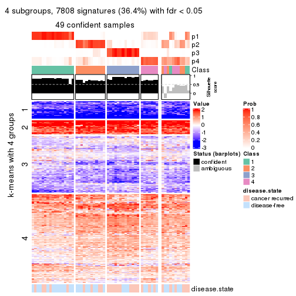</p>

</div>
<div id='tab-ATC-kmeans-get-signatures-no-scale-4'>
<pre><code class="r">get_signatures(res, k = 5, scale_rows = FALSE)
</code></pre>

<p></p>

</div>
<div id='tab-ATC-kmeans-get-signatures-no-scale-5'>
<pre><code class="r">get_signatures(res, k = 6, scale_rows = FALSE)
</code></pre>

<p></p>

</div>
</div>


Compare the overlap of signatures from different k:

```r
compare_signatures(res)
```


`get_signature()` returns a data frame invisibly. TO get the list of signatures, the function
call should be assigned to a variable explicitly. In following code, if `plot` argument is set
to `FALSE`, no heatmap is plotted while only the differential analysis is performed.

```r
# code only for demonstration
tb = get_signature(res, k = ..., plot = FALSE)
```

An example of the output of `tb` is:

```
#>   which_row         fdr    mean_1    mean_2 scaled_mean_1 scaled_mean_2 km
#> 1        38 0.042760348  8.373488  9.131774    -0.5533452     0.5164555  1
#> 2        40 0.018707592  7.106213  8.469186    -0.6173731     0.5762149  1
#> 3        55 0.019134737 10.221463 11.207825    -0.6159697     0.5749050  1
#> 4        59 0.006059896  5.921854  7.869574    -0.6899429     0.6439467  1
#> 5        60 0.018055526  8.928898 10.211722    -0.6204761     0.5791110  1
#> 6        98 0.009384629 15.714769 14.887706     0.6635654    -0.6193277  2
...
```

The columns in `tb` are:

1. `which_row`: row indices corresponding to the input matrix.
2. `fdr`: FDR for the differential test. 
3. `mean_x`: The mean value in group x.
4. `scaled_mean_x`: The mean value in group x after rows are scaled.
5. `km`: Row groups if k-means clustering is applied to rows.


UMAP plot which shows how samples are separated.


<script>
$( function() {
	$( '#tabs-ATC-kmeans-dimension-reduction' ).tabs();
} );
</script>
<div id='tabs-ATC-kmeans-dimension-reduction'>
<ul>
<li><a href='#tab-ATC-kmeans-dimension-reduction-1'>k = 2</a></li>
<li><a href='#tab-ATC-kmeans-dimension-reduction-2'>k = 3</a></li>
<li><a href='#tab-ATC-kmeans-dimension-reduction-3'>k = 4</a></li>
<li><a href='#tab-ATC-kmeans-dimension-reduction-4'>k = 5</a></li>
<li><a href='#tab-ATC-kmeans-dimension-reduction-5'>k = 6</a></li>
</ul>
<div id='tab-ATC-kmeans-dimension-reduction-1'>
<pre><code class="r">dimension_reduction(res, k = 2, method = &quot;UMAP&quot;)
</code></pre>

<p></p>

</div>
<div id='tab-ATC-kmeans-dimension-reduction-2'>
<pre><code class="r">dimension_reduction(res, k = 3, method = &quot;UMAP&quot;)
</code></pre>

<p></p>

</div>
<div id='tab-ATC-kmeans-dimension-reduction-3'>
<pre><code class="r">dimension_reduction(res, k = 4, method = &quot;UMAP&quot;)
</code></pre>

<p></p>

</div>
<div id='tab-ATC-kmeans-dimension-reduction-4'>
<pre><code class="r">dimension_reduction(res, k = 5, method = &quot;UMAP&quot;)
</code></pre>

<p></p>

</div>
<div id='tab-ATC-kmeans-dimension-reduction-5'>
<pre><code class="r">dimension_reduction(res, k = 6, method = &quot;UMAP&quot;)
</code></pre>

<p></p>

</div>
</div>


Following heatmap shows how subgroups are split when increasing `k`:

```r
collect_classes(res)
```


Test correlation between subgroups and known annotations. If the known
annotation is numeric, one-way ANOVA test is applied, and if the known
annotation is discrete, chi-squared contingency table test is applied.

```r
test_to_known_factors(res)
```

```
#>             n disease.state(p) k
#> ATC:kmeans 60           0.4376 2
#> ATC:kmeans 58           0.0302 3
#> ATC:kmeans 49           0.0527 4
#> ATC:kmeans 42           0.0803 5
#> ATC:kmeans 40           0.4214 6
```


If matrix rows can be associated to genes, consider to use `GO_Enrichment(res,
...)` to perform function enrichment for the signature genes.


 

---------------------------------------------------


### ATC:skmeans**


The object with results only for a single top-value method and a single partition method 
can be extracted as:

```r
res = res_list["ATC", "skmeans"]
# you can also extract it by
# res = res_list["ATC:skmeans"]
```

A summary of `res` and all the functions that can be applied to it:

```r
res
```

```
#> A 'ConsensusPartition' object with k = 2, 3, 4, 5, 6.
#>   On a matrix with 21446 rows and 60 columns.
#>   Top rows (1000, 2000, 3000, 4000, 5000) are extracted by 'ATC' method.
#>   Subgroups are detected by 'skmeans' method.
#>   Performed in total 1250 partitions by row resampling.
#>   Best k for subgroups seems to be 2.
#> 
#> Following methods can be applied to this 'ConsensusPartition' object:
#>  [1] "cola_report"             "collect_classes"         "collect_plots"          
#>  [4] "collect_stats"           "colnames"                "compare_signatures"     
#>  [7] "consensus_heatmap"       "dimension_reduction"     "functional_enrichment"  
#> [10] "get_anno_col"            "get_anno"                "get_classes"            
#> [13] "get_consensus"           "get_matrix"              "get_membership"         
#> [16] "get_param"               "get_signatures"          "get_stats"              
#> [19] "is_best_k"               "is_stable_k"             "membership_heatmap"     
#> [22] "ncol"                    "nrow"                    "plot_ecdf"              
#> [25] "rownames"                "select_partition_number" "show"                   
#> [28] "suggest_best_k"          "test_to_known_factors"
```

`collect_plots()` function collects all the plots made from `res` for all `k` (number of partitions)
into one single page to provide an easy and fast comparison between different `k`.

```r
collect_plots(res)
```


The plots are:

- The first row: a plot of the ECDF (Empirical cumulative distribution
  function) curves of the consensus matrix for each `k` and the heatmap of
  predicted classes for each `k`.
- The second row: heatmaps of the consensus matrix for each `k`.
- The third row: heatmaps of the membership matrix for each `k`.
- The fouth row: heatmaps of the signatures for each `k`.

All the plots in panels can be made by individual functions and they are
plotted later in this section.

`select_partition_number()` produces several plots showing different
statistics for choosing "optimized" `k`. There are following statistics:

- ECDF curves of the consensus matrix for each `k`;
- 1-PAC. [The PAC
  score](https://en.wikipedia.org/wiki/Consensus_clustering#Over-interpretation_potential_of_consensus_clustering)
  measures the proportion of the ambiguous subgrouping.
- Mean silhouette score.
- Concordance. The mean probability of fiting the consensus class ids in all
  partitions.
- Area increased. Denote $A_k$ as the area under the ECDF curve for current
  `k`, the area increased is defined as $A_k - A_{k-1}$.
- Rand index. The percent of pairs of samples that are both in a same cluster
  or both are not in a same cluster in the partition of k and k-1.
- Jaccard index. The ratio of pairs of samples are both in a same cluster in
  the partition of k and k-1 and the pairs of samples are both in a same
  cluster in the partition k or k-1.

The detailed explanations of these statistics can be found in [the cola
vignette](http://bioconductor.org/packages/devel/bioc/vignettes/cola/inst/doc/cola.html#toc_13).

Generally speaking, lower PAC score, higher mean silhouette score or higher
concordance corresponds to better partition. Rand index and Jaccard index
measure how similar the current partition is compared to partition with `k-1`.
If they are too similar, we won't accept `k` is better than `k-1`.

```r
select_partition_number(res)
```


The numeric values for all these statistics can be obtained by `get_stats()`.

```r
get_stats(res)
```

```
#>   k 1-PAC mean_silhouette concordance area_increased  Rand Jaccard
#> 2 2 1.000           0.998       0.999         0.5089 0.492   0.492
#> 3 3 0.647           0.681       0.866         0.2539 0.859   0.720
#> 4 4 0.702           0.713       0.853         0.1253 0.824   0.569
#> 5 5 0.692           0.698       0.835         0.0664 0.931   0.754
#> 6 6 0.680           0.565       0.765         0.0403 0.949   0.795
```

`suggest_best_k()` suggests the best $k$ based on these statistics. The rules are as follows:

- All $k$ with Jaccard index larger than 0.95 are removed because the increase of
  the partition number does not provides enough extra information. If all $k$ are removed,
  the best $k$ is assigned by `NA`.
- For $k$ with 1-PAC larger than 0.9, the maximal $k$ is taken as the "best k". Other $k$ is called "optional k".
- If it does not fit the second rule. The $k$ with the highest vote of highest
  1-PAC, mean silhouette and concordance is taken as the "best k".

```r
suggest_best_k(res)
```

```
#> [1] 2
```


Following shows the table of the partitions (You need to click the **show/hide
code output** link to see it). The membership matrix (columns with name `p*`)
is inferred by
[`clue::cl_consensus()`](https://www.rdocumentation.org/link/cl_consensus?package=clue)
function with the `SE` method. Basically the value in the membership matrix
represents the probability to belong to a certain group. The finall class
label for an item is determined with the group with highest probability it
belongs to.

In `get_classes()` function, the entropy is calculated from the membership
matrix and the silhouette score is calculated from the consensus matrix.


<script>
$( function() {
	$( '#tabs-ATC-skmeans-get-classes' ).tabs();
} );
</script>
<div id='tabs-ATC-skmeans-get-classes'>
<ul>
<li><a href='#tab-ATC-skmeans-get-classes-1'>k = 2</a></li>
<li><a href='#tab-ATC-skmeans-get-classes-2'>k = 3</a></li>
<li><a href='#tab-ATC-skmeans-get-classes-3'>k = 4</a></li>
<li><a href='#tab-ATC-skmeans-get-classes-4'>k = 5</a></li>
<li><a href='#tab-ATC-skmeans-get-classes-5'>k = 6</a></li>
</ul>

<div id='tab-ATC-skmeans-get-classes-1'>
<p><a id='tab-ATC-skmeans-get-classes-1-a' style='color:#0366d6' href='#'>show/hide code output</a></p>
<pre><code class="r">cbind(get_classes(res, k = 2), get_membership(res, k = 2))
</code></pre>

<pre><code>#&gt;          class entropy silhouette   p1   p2
#&gt; GSM22453     1   0.000      1.000 1.00 0.00
#&gt; GSM22458     2   0.000      0.998 0.00 1.00
#&gt; GSM22465     1   0.000      1.000 1.00 0.00
#&gt; GSM22466     1   0.000      1.000 1.00 0.00
#&gt; GSM22468     2   0.000      0.998 0.00 1.00
#&gt; GSM22469     1   0.000      1.000 1.00 0.00
#&gt; GSM22471     1   0.000      1.000 1.00 0.00
#&gt; GSM22472     2   0.000      0.998 0.00 1.00
#&gt; GSM22474     1   0.000      1.000 1.00 0.00
#&gt; GSM22476     2   0.000      0.998 0.00 1.00
#&gt; GSM22477     2   0.000      0.998 0.00 1.00
#&gt; GSM22478     2   0.000      0.998 0.00 1.00
#&gt; GSM22481     1   0.000      1.000 1.00 0.00
#&gt; GSM22484     2   0.000      0.998 0.00 1.00
#&gt; GSM22485     1   0.000      1.000 1.00 0.00
#&gt; GSM22487     1   0.000      1.000 1.00 0.00
#&gt; GSM22488     1   0.000      1.000 1.00 0.00
#&gt; GSM22489     2   0.000      0.998 0.00 1.00
#&gt; GSM22490     2   0.000      0.998 0.00 1.00
#&gt; GSM22492     2   0.000      0.998 0.00 1.00
#&gt; GSM22493     1   0.000      1.000 1.00 0.00
#&gt; GSM22494     1   0.000      1.000 1.00 0.00
#&gt; GSM22497     1   0.000      1.000 1.00 0.00
#&gt; GSM22498     1   0.000      1.000 1.00 0.00
#&gt; GSM22501     1   0.000      1.000 1.00 0.00
#&gt; GSM22502     2   0.000      0.998 0.00 1.00
#&gt; GSM22503     1   0.000      1.000 1.00 0.00
#&gt; GSM22504     2   0.000      0.998 0.00 1.00
#&gt; GSM22505     1   0.000      1.000 1.00 0.00
#&gt; GSM22506     2   0.327      0.936 0.06 0.94
#&gt; GSM22507     1   0.000      1.000 1.00 0.00
#&gt; GSM22508     2   0.000      0.998 0.00 1.00
#&gt; GSM22449     2   0.000      0.998 0.00 1.00
#&gt; GSM22450     1   0.000      1.000 1.00 0.00
#&gt; GSM22451     2   0.000      0.998 0.00 1.00
#&gt; GSM22452     1   0.000      1.000 1.00 0.00
#&gt; GSM22454     1   0.000      1.000 1.00 0.00
#&gt; GSM22455     2   0.000      0.998 0.00 1.00
#&gt; GSM22456     2   0.000      0.998 0.00 1.00
#&gt; GSM22457     1   0.000      1.000 1.00 0.00
#&gt; GSM22459     2   0.000      0.998 0.00 1.00
#&gt; GSM22460     2   0.000      0.998 0.00 1.00
#&gt; GSM22461     2   0.000      0.998 0.00 1.00
#&gt; GSM22462     1   0.000      1.000 1.00 0.00
#&gt; GSM22463     2   0.000      0.998 0.00 1.00
#&gt; GSM22464     1   0.000      1.000 1.00 0.00
#&gt; GSM22467     1   0.000      1.000 1.00 0.00
#&gt; GSM22470     2   0.000      0.998 0.00 1.00
#&gt; GSM22473     2   0.000      0.998 0.00 1.00
#&gt; GSM22475     2   0.000      0.998 0.00 1.00
#&gt; GSM22479     1   0.000      1.000 1.00 0.00
#&gt; GSM22480     2   0.000      0.998 0.00 1.00
#&gt; GSM22482     1   0.000      1.000 1.00 0.00
#&gt; GSM22483     2   0.000      0.998 0.00 1.00
#&gt; GSM22486     1   0.000      1.000 1.00 0.00
#&gt; GSM22491     1   0.000      1.000 1.00 0.00
#&gt; GSM22495     2   0.000      0.998 0.00 1.00
#&gt; GSM22496     2   0.000      0.998 0.00 1.00
#&gt; GSM22499     2   0.000      0.998 0.00 1.00
#&gt; GSM22500     1   0.000      1.000 1.00 0.00
</code></pre>

<script>
$('#tab-ATC-skmeans-get-classes-1-a').parent().next().next().hide();
$('#tab-ATC-skmeans-get-classes-1-a').click(function(){
  $('#tab-ATC-skmeans-get-classes-1-a').parent().next().next().toggle();
  return(false);
});
</script>
</div>

<div id='tab-ATC-skmeans-get-classes-2'>
<p><a id='tab-ATC-skmeans-get-classes-2-a' style='color:#0366d6' href='#'>show/hide code output</a></p>
<pre><code class="r">cbind(get_classes(res, k = 3), get_membership(res, k = 3))
</code></pre>

<pre><code>#&gt;          class entropy silhouette    p1    p2    p3
#&gt; GSM22453     1  0.0000     0.8710 1.000 0.000 0.000
#&gt; GSM22458     3  0.3816     0.5736 0.000 0.148 0.852
#&gt; GSM22465     1  0.0000     0.8710 1.000 0.000 0.000
#&gt; GSM22466     1  0.0000     0.8710 1.000 0.000 0.000
#&gt; GSM22468     2  0.3551     0.7729 0.000 0.868 0.132
#&gt; GSM22469     1  0.0000     0.8710 1.000 0.000 0.000
#&gt; GSM22471     1  0.6274     0.1250 0.544 0.000 0.456
#&gt; GSM22472     2  0.3267     0.8021 0.000 0.884 0.116
#&gt; GSM22474     3  0.4750     0.5201 0.216 0.000 0.784
#&gt; GSM22476     3  0.6095    -0.1317 0.000 0.392 0.608
#&gt; GSM22477     2  0.0000     0.8752 0.000 1.000 0.000
#&gt; GSM22478     2  0.0000     0.8752 0.000 1.000 0.000
#&gt; GSM22481     1  0.0000     0.8710 1.000 0.000 0.000
#&gt; GSM22484     2  0.0000     0.8752 0.000 1.000 0.000
#&gt; GSM22485     1  0.0000     0.8710 1.000 0.000 0.000
#&gt; GSM22487     1  0.0000     0.8710 1.000 0.000 0.000
#&gt; GSM22488     1  0.0000     0.8710 1.000 0.000 0.000
#&gt; GSM22489     2  0.0000     0.8752 0.000 1.000 0.000
#&gt; GSM22490     2  0.6260     0.3217 0.000 0.552 0.448
#&gt; GSM22492     2  0.6274     0.3184 0.000 0.544 0.456
#&gt; GSM22493     1  0.0000     0.8710 1.000 0.000 0.000
#&gt; GSM22494     1  0.0000     0.8710 1.000 0.000 0.000
#&gt; GSM22497     1  0.0000     0.8710 1.000 0.000 0.000
#&gt; GSM22498     1  0.0237     0.8684 0.996 0.000 0.004
#&gt; GSM22501     3  0.6204     0.2201 0.424 0.000 0.576
#&gt; GSM22502     2  0.6235     0.3430 0.000 0.564 0.436
#&gt; GSM22503     1  0.6309    -0.0546 0.500 0.000 0.500
#&gt; GSM22504     2  0.3267     0.8021 0.000 0.884 0.116
#&gt; GSM22505     1  0.0000     0.8710 1.000 0.000 0.000
#&gt; GSM22506     2  0.5728     0.6500 0.008 0.720 0.272
#&gt; GSM22507     1  0.5397     0.5597 0.720 0.000 0.280
#&gt; GSM22508     3  0.4121     0.5545 0.000 0.168 0.832
#&gt; GSM22449     3  0.3482     0.5784 0.000 0.128 0.872
#&gt; GSM22450     1  0.0000     0.8710 1.000 0.000 0.000
#&gt; GSM22451     2  0.0000     0.8752 0.000 1.000 0.000
#&gt; GSM22452     1  0.0000     0.8710 1.000 0.000 0.000
#&gt; GSM22454     1  0.0000     0.8710 1.000 0.000 0.000
#&gt; GSM22455     2  0.0000     0.8752 0.000 1.000 0.000
#&gt; GSM22456     2  0.0000     0.8752 0.000 1.000 0.000
#&gt; GSM22457     3  0.6168     0.2501 0.412 0.000 0.588
#&gt; GSM22459     2  0.0000     0.8752 0.000 1.000 0.000
#&gt; GSM22460     2  0.0000     0.8752 0.000 1.000 0.000
#&gt; GSM22461     2  0.0000     0.8752 0.000 1.000 0.000
#&gt; GSM22462     1  0.3038     0.7758 0.896 0.000 0.104
#&gt; GSM22463     2  0.0000     0.8752 0.000 1.000 0.000
#&gt; GSM22464     1  0.4842     0.6438 0.776 0.000 0.224
#&gt; GSM22467     1  0.0000     0.8710 1.000 0.000 0.000
#&gt; GSM22470     2  0.0000     0.8752 0.000 1.000 0.000
#&gt; GSM22473     3  0.6308    -0.0703 0.000 0.492 0.508
#&gt; GSM22475     2  0.0000     0.8752 0.000 1.000 0.000
#&gt; GSM22479     3  0.6204     0.2202 0.424 0.000 0.576
#&gt; GSM22480     2  0.0237     0.8733 0.000 0.996 0.004
#&gt; GSM22482     1  0.0000     0.8710 1.000 0.000 0.000
#&gt; GSM22483     2  0.0237     0.8733 0.000 0.996 0.004
#&gt; GSM22486     1  0.6095     0.4526 0.608 0.000 0.392
#&gt; GSM22491     1  0.6979     0.5517 0.732 0.140 0.128
#&gt; GSM22495     2  0.5905     0.4385 0.000 0.648 0.352
#&gt; GSM22496     2  0.0000     0.8752 0.000 1.000 0.000
#&gt; GSM22499     2  0.5254     0.6691 0.000 0.736 0.264
#&gt; GSM22500     1  0.6095     0.3265 0.608 0.000 0.392
</code></pre>

<script>
$('#tab-ATC-skmeans-get-classes-2-a').parent().next().next().hide();
$('#tab-ATC-skmeans-get-classes-2-a').click(function(){
  $('#tab-ATC-skmeans-get-classes-2-a').parent().next().next().toggle();
  return(false);
});
</script>
</div>

<div id='tab-ATC-skmeans-get-classes-3'>
<p><a id='tab-ATC-skmeans-get-classes-3-a' style='color:#0366d6' href='#'>show/hide code output</a></p>
<pre><code class="r">cbind(get_classes(res, k = 4), get_membership(res, k = 4))
</code></pre>

<pre><code>#&gt;          class entropy silhouette    p1    p2    p3    p4
#&gt; GSM22453     1  0.1388      0.899 0.960 0.012 0.000 0.028
#&gt; GSM22458     2  0.2704      0.459 0.000 0.876 0.000 0.124
#&gt; GSM22465     1  0.0000      0.910 1.000 0.000 0.000 0.000
#&gt; GSM22466     1  0.0707      0.907 0.980 0.020 0.000 0.000
#&gt; GSM22468     3  0.3778      0.748 0.000 0.100 0.848 0.052
#&gt; GSM22469     1  0.0817      0.905 0.976 0.024 0.000 0.000
#&gt; GSM22471     2  0.4331      0.721 0.288 0.712 0.000 0.000
#&gt; GSM22472     4  0.4950      0.523 0.000 0.004 0.376 0.620
#&gt; GSM22474     2  0.2593      0.503 0.016 0.904 0.000 0.080
#&gt; GSM22476     4  0.1545      0.592 0.000 0.040 0.008 0.952
#&gt; GSM22477     3  0.1637      0.853 0.000 0.000 0.940 0.060
#&gt; GSM22478     3  0.0376      0.882 0.000 0.004 0.992 0.004
#&gt; GSM22481     1  0.0592      0.908 0.984 0.016 0.000 0.000
#&gt; GSM22484     3  0.0707      0.880 0.000 0.000 0.980 0.020
#&gt; GSM22485     1  0.1284      0.902 0.964 0.012 0.000 0.024
#&gt; GSM22487     1  0.1302      0.892 0.956 0.044 0.000 0.000
#&gt; GSM22488     1  0.1284      0.902 0.964 0.012 0.000 0.024
#&gt; GSM22489     3  0.0707      0.880 0.000 0.000 0.980 0.020
#&gt; GSM22490     4  0.6571      0.572 0.000 0.124 0.264 0.612
#&gt; GSM22492     4  0.4789      0.671 0.000 0.056 0.172 0.772
#&gt; GSM22493     1  0.1388      0.899 0.960 0.012 0.000 0.028
#&gt; GSM22494     1  0.1284      0.902 0.964 0.012 0.000 0.024
#&gt; GSM22497     1  0.0336      0.910 0.992 0.008 0.000 0.000
#&gt; GSM22498     1  0.1940      0.859 0.924 0.076 0.000 0.000
#&gt; GSM22501     2  0.5182      0.715 0.288 0.684 0.000 0.028
#&gt; GSM22502     4  0.6685      0.544 0.000 0.124 0.284 0.592
#&gt; GSM22503     2  0.4331      0.721 0.288 0.712 0.000 0.000
#&gt; GSM22504     4  0.4790      0.516 0.000 0.000 0.380 0.620
#&gt; GSM22505     1  0.1302      0.892 0.956 0.044 0.000 0.000
#&gt; GSM22506     4  0.3421      0.625 0.020 0.016 0.088 0.876
#&gt; GSM22507     2  0.4933      0.468 0.432 0.568 0.000 0.000
#&gt; GSM22508     2  0.5387      0.217 0.000 0.696 0.048 0.256
#&gt; GSM22449     2  0.5406     -0.171 0.000 0.508 0.012 0.480
#&gt; GSM22450     1  0.1284      0.902 0.964 0.012 0.000 0.024
#&gt; GSM22451     3  0.0000      0.885 0.000 0.000 1.000 0.000
#&gt; GSM22452     1  0.0592      0.908 0.984 0.016 0.000 0.000
#&gt; GSM22454     1  0.0188      0.910 0.996 0.004 0.000 0.000
#&gt; GSM22455     3  0.0188      0.883 0.000 0.000 0.996 0.004
#&gt; GSM22456     3  0.0000      0.885 0.000 0.000 1.000 0.000
#&gt; GSM22457     2  0.4277      0.723 0.280 0.720 0.000 0.000
#&gt; GSM22459     3  0.0000      0.885 0.000 0.000 1.000 0.000
#&gt; GSM22460     3  0.0000      0.885 0.000 0.000 1.000 0.000
#&gt; GSM22461     3  0.0592      0.880 0.000 0.000 0.984 0.016
#&gt; GSM22462     1  0.3280      0.794 0.860 0.016 0.000 0.124
#&gt; GSM22463     3  0.0000      0.885 0.000 0.000 1.000 0.000
#&gt; GSM22464     1  0.4989     -0.264 0.528 0.472 0.000 0.000
#&gt; GSM22467     1  0.0000      0.910 1.000 0.000 0.000 0.000
#&gt; GSM22470     3  0.0707      0.880 0.000 0.000 0.980 0.020
#&gt; GSM22473     3  0.5968      0.489 0.000 0.236 0.672 0.092
#&gt; GSM22475     3  0.4040      0.575 0.000 0.000 0.752 0.248
#&gt; GSM22479     2  0.4331      0.721 0.288 0.712 0.000 0.000
#&gt; GSM22480     3  0.2999      0.773 0.000 0.004 0.864 0.132
#&gt; GSM22482     1  0.0817      0.906 0.976 0.024 0.000 0.000
#&gt; GSM22483     3  0.4406      0.461 0.000 0.000 0.700 0.300
#&gt; GSM22486     4  0.7690     -0.193 0.188 0.372 0.004 0.436
#&gt; GSM22491     1  0.5429      0.615 0.728 0.020 0.032 0.220
#&gt; GSM22495     3  0.5280      0.630 0.000 0.124 0.752 0.124
#&gt; GSM22496     3  0.0000      0.885 0.000 0.000 1.000 0.000
#&gt; GSM22499     4  0.2773      0.650 0.000 0.004 0.116 0.880
#&gt; GSM22500     2  0.4406      0.709 0.300 0.700 0.000 0.000
</code></pre>

<script>
$('#tab-ATC-skmeans-get-classes-3-a').parent().next().next().hide();
$('#tab-ATC-skmeans-get-classes-3-a').click(function(){
  $('#tab-ATC-skmeans-get-classes-3-a').parent().next().next().toggle();
  return(false);
});
</script>
</div>

<div id='tab-ATC-skmeans-get-classes-4'>
<p><a id='tab-ATC-skmeans-get-classes-4-a' style='color:#0366d6' href='#'>show/hide code output</a></p>
<pre><code class="r">cbind(get_classes(res, k = 5), get_membership(res, k = 5))
</code></pre>

<pre><code>#&gt;          class entropy silhouette    p1    p2    p3    p4    p5
#&gt; GSM22453     1  0.1087      0.856 0.968 0.016 0.000 0.008 0.008
#&gt; GSM22458     5  0.2280      0.591 0.000 0.120 0.000 0.000 0.880
#&gt; GSM22465     1  0.1197      0.871 0.952 0.048 0.000 0.000 0.000
#&gt; GSM22466     1  0.2230      0.841 0.884 0.116 0.000 0.000 0.000
#&gt; GSM22468     3  0.4809     -0.129 0.000 0.008 0.516 0.008 0.468
#&gt; GSM22469     1  0.2773      0.805 0.836 0.164 0.000 0.000 0.000
#&gt; GSM22471     2  0.1965      0.873 0.096 0.904 0.000 0.000 0.000
#&gt; GSM22472     4  0.5903      0.396 0.000 0.000 0.332 0.548 0.120
#&gt; GSM22474     5  0.3366      0.537 0.000 0.232 0.000 0.000 0.768
#&gt; GSM22476     4  0.3250      0.507 0.000 0.008 0.004 0.820 0.168
#&gt; GSM22477     3  0.2104      0.839 0.000 0.000 0.916 0.060 0.024
#&gt; GSM22478     3  0.1310      0.856 0.000 0.024 0.956 0.000 0.020
#&gt; GSM22481     1  0.2011      0.862 0.908 0.088 0.000 0.000 0.004
#&gt; GSM22484     3  0.1485      0.857 0.000 0.000 0.948 0.032 0.020
#&gt; GSM22485     1  0.0867      0.860 0.976 0.008 0.000 0.008 0.008
#&gt; GSM22487     1  0.3074      0.768 0.804 0.196 0.000 0.000 0.000
#&gt; GSM22488     1  0.0613      0.863 0.984 0.004 0.000 0.008 0.004
#&gt; GSM22489     3  0.1485      0.857 0.000 0.000 0.948 0.032 0.020
#&gt; GSM22490     5  0.6010      0.355 0.000 0.004 0.148 0.260 0.588
#&gt; GSM22492     4  0.5119      0.454 0.000 0.008 0.080 0.696 0.216
#&gt; GSM22493     1  0.1095      0.857 0.968 0.008 0.000 0.012 0.012
#&gt; GSM22494     1  0.0981      0.859 0.972 0.008 0.000 0.012 0.008
#&gt; GSM22497     1  0.0963      0.872 0.964 0.036 0.000 0.000 0.000
#&gt; GSM22498     1  0.3876      0.552 0.684 0.316 0.000 0.000 0.000
#&gt; GSM22501     2  0.5698      0.714 0.204 0.656 0.000 0.012 0.128
#&gt; GSM22502     5  0.5923      0.401 0.000 0.004 0.168 0.216 0.612
#&gt; GSM22503     2  0.1965      0.873 0.096 0.904 0.000 0.000 0.000
#&gt; GSM22504     4  0.5889      0.390 0.000 0.000 0.340 0.544 0.116
#&gt; GSM22505     1  0.3039      0.774 0.808 0.192 0.000 0.000 0.000
#&gt; GSM22506     4  0.3690      0.500 0.036 0.044 0.020 0.860 0.040
#&gt; GSM22507     2  0.3074      0.820 0.196 0.804 0.000 0.000 0.000
#&gt; GSM22508     5  0.1800      0.593 0.000 0.048 0.000 0.020 0.932
#&gt; GSM22449     5  0.5857      0.327 0.000 0.092 0.016 0.280 0.612
#&gt; GSM22450     1  0.0613      0.866 0.984 0.008 0.000 0.004 0.004
#&gt; GSM22451     3  0.0671      0.864 0.000 0.016 0.980 0.000 0.004
#&gt; GSM22452     1  0.1608      0.865 0.928 0.072 0.000 0.000 0.000
#&gt; GSM22454     1  0.1121      0.872 0.956 0.044 0.000 0.000 0.000
#&gt; GSM22455     3  0.1012      0.861 0.000 0.012 0.968 0.000 0.020
#&gt; GSM22456     3  0.0404      0.866 0.000 0.000 0.988 0.000 0.012
#&gt; GSM22457     2  0.2448      0.859 0.088 0.892 0.000 0.000 0.020
#&gt; GSM22459     3  0.0566      0.865 0.000 0.004 0.984 0.000 0.012
#&gt; GSM22460     3  0.0162      0.866 0.000 0.000 0.996 0.000 0.004
#&gt; GSM22461     3  0.1568      0.858 0.000 0.000 0.944 0.036 0.020
#&gt; GSM22462     1  0.4462      0.683 0.788 0.056 0.000 0.124 0.032
#&gt; GSM22463     3  0.0671      0.863 0.000 0.016 0.980 0.004 0.000
#&gt; GSM22464     2  0.4182      0.441 0.400 0.600 0.000 0.000 0.000
#&gt; GSM22467     1  0.1121      0.871 0.956 0.044 0.000 0.000 0.000
#&gt; GSM22470     3  0.1469      0.857 0.000 0.000 0.948 0.036 0.016
#&gt; GSM22473     5  0.3970      0.549 0.000 0.020 0.236 0.000 0.744
#&gt; GSM22475     3  0.4210      0.629 0.000 0.000 0.740 0.224 0.036
#&gt; GSM22479     2  0.2124      0.871 0.096 0.900 0.000 0.000 0.004
#&gt; GSM22480     3  0.4821      0.606 0.000 0.024 0.716 0.228 0.032
#&gt; GSM22482     1  0.2732      0.811 0.840 0.160 0.000 0.000 0.000
#&gt; GSM22483     3  0.4687      0.416 0.000 0.000 0.636 0.336 0.028
#&gt; GSM22486     4  0.6244      0.205 0.040 0.332 0.012 0.572 0.044
#&gt; GSM22491     1  0.6307      0.532 0.668 0.084 0.028 0.180 0.040
#&gt; GSM22495     5  0.5232      0.367 0.000 0.008 0.376 0.036 0.580
#&gt; GSM22496     3  0.0404      0.865 0.000 0.012 0.988 0.000 0.000
#&gt; GSM22499     4  0.1710      0.552 0.000 0.016 0.004 0.940 0.040
#&gt; GSM22500     2  0.2127      0.872 0.108 0.892 0.000 0.000 0.000
</code></pre>

<script>
$('#tab-ATC-skmeans-get-classes-4-a').parent().next().next().hide();
$('#tab-ATC-skmeans-get-classes-4-a').click(function(){
  $('#tab-ATC-skmeans-get-classes-4-a').parent().next().next().toggle();
  return(false);
});
</script>
</div>

<div id='tab-ATC-skmeans-get-classes-5'>
<p><a id='tab-ATC-skmeans-get-classes-5-a' style='color:#0366d6' href='#'>show/hide code output</a></p>
<pre><code class="r">cbind(get_classes(res, k = 6), get_membership(res, k = 6))
</code></pre>

<pre><code>#&gt;          class entropy silhouette    p1    p2    p3    p4    p5    p6
#&gt; GSM22453     1  0.2106      0.794 0.904 0.000 0.032 0.000 0.064 0.000
#&gt; GSM22458     4  0.4756      0.081 0.000 0.052 0.000 0.540 0.408 0.000
#&gt; GSM22465     1  0.1082      0.825 0.956 0.040 0.000 0.000 0.004 0.000
#&gt; GSM22466     1  0.2165      0.811 0.884 0.108 0.000 0.000 0.008 0.000
#&gt; GSM22468     4  0.5996      0.249 0.000 0.004 0.000 0.408 0.196 0.392
#&gt; GSM22469     1  0.2553      0.796 0.848 0.144 0.000 0.000 0.008 0.000
#&gt; GSM22471     2  0.0891      0.848 0.024 0.968 0.000 0.000 0.008 0.000
#&gt; GSM22472     3  0.6772      0.269 0.000 0.000 0.332 0.328 0.036 0.304
#&gt; GSM22474     5  0.5765     -0.440 0.000 0.172 0.000 0.408 0.420 0.000
#&gt; GSM22476     3  0.4933      0.320 0.000 0.000 0.588 0.340 0.068 0.004
#&gt; GSM22477     6  0.2415      0.799 0.000 0.000 0.016 0.084 0.012 0.888
#&gt; GSM22478     6  0.3314      0.760 0.000 0.008 0.000 0.052 0.112 0.828
#&gt; GSM22481     1  0.2094      0.825 0.900 0.080 0.000 0.000 0.020 0.000
#&gt; GSM22484     6  0.1477      0.824 0.000 0.000 0.008 0.048 0.004 0.940
#&gt; GSM22485     1  0.2333      0.782 0.884 0.000 0.024 0.000 0.092 0.000
#&gt; GSM22487     1  0.3078      0.765 0.796 0.192 0.000 0.000 0.012 0.000
#&gt; GSM22488     1  0.1657      0.802 0.928 0.000 0.016 0.000 0.056 0.000
#&gt; GSM22489     6  0.1410      0.825 0.000 0.000 0.008 0.044 0.004 0.944
#&gt; GSM22490     4  0.3649      0.268 0.000 0.000 0.068 0.796 0.004 0.132
#&gt; GSM22492     4  0.5070     -0.361 0.000 0.000 0.460 0.480 0.012 0.048
#&gt; GSM22493     1  0.2908      0.753 0.848 0.000 0.048 0.000 0.104 0.000
#&gt; GSM22494     1  0.2147      0.789 0.896 0.000 0.020 0.000 0.084 0.000
#&gt; GSM22497     1  0.0972      0.823 0.964 0.008 0.000 0.000 0.028 0.000
#&gt; GSM22498     1  0.4649      0.353 0.572 0.380 0.000 0.000 0.048 0.000
#&gt; GSM22501     2  0.6748      0.294 0.252 0.468 0.008 0.040 0.232 0.000
#&gt; GSM22502     4  0.3578      0.309 0.000 0.000 0.044 0.804 0.012 0.140
#&gt; GSM22503     2  0.0692      0.848 0.020 0.976 0.000 0.000 0.004 0.000
#&gt; GSM22504     3  0.6773      0.269 0.000 0.000 0.332 0.324 0.036 0.308
#&gt; GSM22505     1  0.3017      0.776 0.816 0.164 0.000 0.000 0.020 0.000
#&gt; GSM22506     3  0.3155      0.295 0.004 0.000 0.828 0.004 0.140 0.024
#&gt; GSM22507     2  0.3023      0.723 0.140 0.828 0.000 0.000 0.032 0.000
#&gt; GSM22508     4  0.4400      0.122 0.000 0.012 0.004 0.552 0.428 0.004
#&gt; GSM22449     4  0.7119      0.137 0.000 0.056 0.180 0.428 0.316 0.020
#&gt; GSM22450     1  0.1829      0.816 0.928 0.028 0.008 0.000 0.036 0.000
#&gt; GSM22451     6  0.1429      0.819 0.000 0.004 0.004 0.000 0.052 0.940
#&gt; GSM22452     1  0.1531      0.823 0.928 0.068 0.000 0.000 0.004 0.000
#&gt; GSM22454     1  0.1245      0.821 0.952 0.016 0.000 0.000 0.032 0.000
#&gt; GSM22455     6  0.2619      0.790 0.000 0.008 0.000 0.040 0.072 0.880
#&gt; GSM22456     6  0.0806      0.827 0.000 0.000 0.000 0.008 0.020 0.972
#&gt; GSM22457     2  0.1838      0.824 0.016 0.916 0.000 0.000 0.068 0.000
#&gt; GSM22459     6  0.1713      0.818 0.000 0.000 0.000 0.028 0.044 0.928
#&gt; GSM22460     6  0.0146      0.830 0.000 0.000 0.004 0.000 0.000 0.996
#&gt; GSM22461     6  0.3245      0.776 0.000 0.000 0.024 0.104 0.032 0.840
#&gt; GSM22462     1  0.5637      0.354 0.612 0.024 0.176 0.000 0.188 0.000
#&gt; GSM22463     6  0.2069      0.805 0.000 0.004 0.020 0.000 0.068 0.908
#&gt; GSM22464     1  0.4532      0.122 0.500 0.468 0.000 0.000 0.032 0.000
#&gt; GSM22467     1  0.1682      0.825 0.928 0.052 0.000 0.000 0.020 0.000
#&gt; GSM22470     6  0.1340      0.826 0.000 0.000 0.008 0.040 0.004 0.948
#&gt; GSM22473     4  0.5856      0.328 0.000 0.004 0.000 0.492 0.316 0.188
#&gt; GSM22475     6  0.4856      0.550 0.000 0.000 0.104 0.200 0.012 0.684
#&gt; GSM22479     2  0.0914      0.844 0.016 0.968 0.000 0.000 0.016 0.000
#&gt; GSM22480     6  0.6208      0.190 0.000 0.004 0.340 0.024 0.148 0.484
#&gt; GSM22482     1  0.2704      0.797 0.844 0.140 0.000 0.000 0.016 0.000
#&gt; GSM22483     6  0.6054      0.285 0.000 0.000 0.236 0.168 0.036 0.560
#&gt; GSM22486     3  0.5447      0.123 0.016 0.108 0.632 0.000 0.236 0.008
#&gt; GSM22491     5  0.6841     -0.121 0.304 0.004 0.324 0.000 0.336 0.032
#&gt; GSM22495     4  0.5866      0.390 0.000 0.000 0.012 0.516 0.160 0.312
#&gt; GSM22496     6  0.1010      0.825 0.000 0.000 0.004 0.000 0.036 0.960
#&gt; GSM22499     3  0.3221      0.414 0.000 0.000 0.772 0.220 0.004 0.004
#&gt; GSM22500     2  0.0858      0.847 0.028 0.968 0.000 0.000 0.004 0.000
</code></pre>

<script>
$('#tab-ATC-skmeans-get-classes-5-a').parent().next().next().hide();
$('#tab-ATC-skmeans-get-classes-5-a').click(function(){
  $('#tab-ATC-skmeans-get-classes-5-a').parent().next().next().toggle();
  return(false);
});
</script>
</div>
</div>

Heatmaps for the consensus matrix. It visualizes the probability of two
samples to be in a same group.


<script>
$( function() {
	$( '#tabs-ATC-skmeans-consensus-heatmap' ).tabs();
} );
</script>
<div id='tabs-ATC-skmeans-consensus-heatmap'>
<ul>
<li><a href='#tab-ATC-skmeans-consensus-heatmap-1'>k = 2</a></li>
<li><a href='#tab-ATC-skmeans-consensus-heatmap-2'>k = 3</a></li>
<li><a href='#tab-ATC-skmeans-consensus-heatmap-3'>k = 4</a></li>
<li><a href='#tab-ATC-skmeans-consensus-heatmap-4'>k = 5</a></li>
<li><a href='#tab-ATC-skmeans-consensus-heatmap-5'>k = 6</a></li>
</ul>
<div id='tab-ATC-skmeans-consensus-heatmap-1'>
<pre><code class="r">consensus_heatmap(res, k = 2)
</code></pre>

<p></p>

</div>
<div id='tab-ATC-skmeans-consensus-heatmap-2'>
<pre><code class="r">consensus_heatmap(res, k = 3)
</code></pre>

<p></p>

</div>
<div id='tab-ATC-skmeans-consensus-heatmap-3'>
<pre><code class="r">consensus_heatmap(res, k = 4)
</code></pre>

<p></p>

</div>
<div id='tab-ATC-skmeans-consensus-heatmap-4'>
<pre><code class="r">consensus_heatmap(res, k = 5)
</code></pre>

<p></p>

</div>
<div id='tab-ATC-skmeans-consensus-heatmap-5'>
<pre><code class="r">consensus_heatmap(res, k = 6)
</code></pre>

<p></p>

</div>
</div>

Heatmaps for the membership of samples in all partitions to see how consistent they are:


<script>
$( function() {
	$( '#tabs-ATC-skmeans-membership-heatmap' ).tabs();
} );
</script>
<div id='tabs-ATC-skmeans-membership-heatmap'>
<ul>
<li><a href='#tab-ATC-skmeans-membership-heatmap-1'>k = 2</a></li>
<li><a href='#tab-ATC-skmeans-membership-heatmap-2'>k = 3</a></li>
<li><a href='#tab-ATC-skmeans-membership-heatmap-3'>k = 4</a></li>
<li><a href='#tab-ATC-skmeans-membership-heatmap-4'>k = 5</a></li>
<li><a href='#tab-ATC-skmeans-membership-heatmap-5'>k = 6</a></li>
</ul>
<div id='tab-ATC-skmeans-membership-heatmap-1'>
<pre><code class="r">membership_heatmap(res, k = 2)
</code></pre>

<p></p>

</div>
<div id='tab-ATC-skmeans-membership-heatmap-2'>
<pre><code class="r">membership_heatmap(res, k = 3)
</code></pre>

<p></p>

</div>
<div id='tab-ATC-skmeans-membership-heatmap-3'>
<pre><code class="r">membership_heatmap(res, k = 4)
</code></pre>

<p></p>

</div>
<div id='tab-ATC-skmeans-membership-heatmap-4'>
<pre><code class="r">membership_heatmap(res, k = 5)
</code></pre>

<p></p>

</div>
<div id='tab-ATC-skmeans-membership-heatmap-5'>
<pre><code class="r">membership_heatmap(res, k = 6)
</code></pre>

<p></p>

</div>
</div>

As soon as we have had the classes for columns, we can look for signatures
which are significantly different between classes which can be candidate marks
for certain classes. Following are the heatmaps for signatures.


Signature heatmaps where rows are scaled:


<script>
$( function() {
	$( '#tabs-ATC-skmeans-get-signatures' ).tabs();
} );
</script>
<div id='tabs-ATC-skmeans-get-signatures'>
<ul>
<li><a href='#tab-ATC-skmeans-get-signatures-1'>k = 2</a></li>
<li><a href='#tab-ATC-skmeans-get-signatures-2'>k = 3</a></li>
<li><a href='#tab-ATC-skmeans-get-signatures-3'>k = 4</a></li>
<li><a href='#tab-ATC-skmeans-get-signatures-4'>k = 5</a></li>
<li><a href='#tab-ATC-skmeans-get-signatures-5'>k = 6</a></li>
</ul>
<div id='tab-ATC-skmeans-get-signatures-1'>
<pre><code class="r">get_signatures(res, k = 2)
</code></pre>

<p></p>

</div>
<div id='tab-ATC-skmeans-get-signatures-2'>
<pre><code class="r">get_signatures(res, k = 3)
</code></pre>

<p></p>

</div>
<div id='tab-ATC-skmeans-get-signatures-3'>
<pre><code class="r">get_signatures(res, k = 4)
</code></pre>

<p></p>

</div>
<div id='tab-ATC-skmeans-get-signatures-4'>
<pre><code class="r">get_signatures(res, k = 5)
</code></pre>

<p>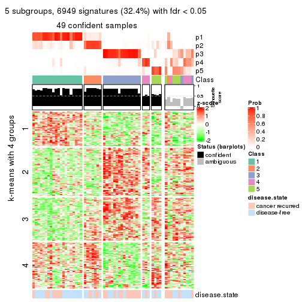</p>

</div>
<div id='tab-ATC-skmeans-get-signatures-5'>
<pre><code class="r">get_signatures(res, k = 6)
</code></pre>

<p></p>

</div>
</div>


Signature heatmaps where rows are not scaled:


<script>
$( function() {
	$( '#tabs-ATC-skmeans-get-signatures-no-scale' ).tabs();
} );
</script>
<div id='tabs-ATC-skmeans-get-signatures-no-scale'>
<ul>
<li><a href='#tab-ATC-skmeans-get-signatures-no-scale-1'>k = 2</a></li>
<li><a href='#tab-ATC-skmeans-get-signatures-no-scale-2'>k = 3</a></li>
<li><a href='#tab-ATC-skmeans-get-signatures-no-scale-3'>k = 4</a></li>
<li><a href='#tab-ATC-skmeans-get-signatures-no-scale-4'>k = 5</a></li>
<li><a href='#tab-ATC-skmeans-get-signatures-no-scale-5'>k = 6</a></li>
</ul>
<div id='tab-ATC-skmeans-get-signatures-no-scale-1'>
<pre><code class="r">get_signatures(res, k = 2, scale_rows = FALSE)
</code></pre>

<p></p>

</div>
<div id='tab-ATC-skmeans-get-signatures-no-scale-2'>
<pre><code class="r">get_signatures(res, k = 3, scale_rows = FALSE)
</code></pre>

<p></p>

</div>
<div id='tab-ATC-skmeans-get-signatures-no-scale-3'>
<pre><code class="r">get_signatures(res, k = 4, scale_rows = FALSE)
</code></pre>

<p></p>

</div>
<div id='tab-ATC-skmeans-get-signatures-no-scale-4'>
<pre><code class="r">get_signatures(res, k = 5, scale_rows = FALSE)
</code></pre>

<p></p>

</div>
<div id='tab-ATC-skmeans-get-signatures-no-scale-5'>
<pre><code class="r">get_signatures(res, k = 6, scale_rows = FALSE)
</code></pre>

<p></p>

</div>
</div>


Compare the overlap of signatures from different k:

```r
compare_signatures(res)
```


`get_signature()` returns a data frame invisibly. TO get the list of signatures, the function
call should be assigned to a variable explicitly. In following code, if `plot` argument is set
to `FALSE`, no heatmap is plotted while only the differential analysis is performed.

```r
# code only for demonstration
tb = get_signature(res, k = ..., plot = FALSE)
```

An example of the output of `tb` is:

```
#>   which_row         fdr    mean_1    mean_2 scaled_mean_1 scaled_mean_2 km
#> 1        38 0.042760348  8.373488  9.131774    -0.5533452     0.5164555  1
#> 2        40 0.018707592  7.106213  8.469186    -0.6173731     0.5762149  1
#> 3        55 0.019134737 10.221463 11.207825    -0.6159697     0.5749050  1
#> 4        59 0.006059896  5.921854  7.869574    -0.6899429     0.6439467  1
#> 5        60 0.018055526  8.928898 10.211722    -0.6204761     0.5791110  1
#> 6        98 0.009384629 15.714769 14.887706     0.6635654    -0.6193277  2
...
```

The columns in `tb` are:

1. `which_row`: row indices corresponding to the input matrix.
2. `fdr`: FDR for the differential test. 
3. `mean_x`: The mean value in group x.
4. `scaled_mean_x`: The mean value in group x after rows are scaled.
5. `km`: Row groups if k-means clustering is applied to rows.


UMAP plot which shows how samples are separated.


<script>
$( function() {
	$( '#tabs-ATC-skmeans-dimension-reduction' ).tabs();
} );
</script>
<div id='tabs-ATC-skmeans-dimension-reduction'>
<ul>
<li><a href='#tab-ATC-skmeans-dimension-reduction-1'>k = 2</a></li>
<li><a href='#tab-ATC-skmeans-dimension-reduction-2'>k = 3</a></li>
<li><a href='#tab-ATC-skmeans-dimension-reduction-3'>k = 4</a></li>
<li><a href='#tab-ATC-skmeans-dimension-reduction-4'>k = 5</a></li>
<li><a href='#tab-ATC-skmeans-dimension-reduction-5'>k = 6</a></li>
</ul>
<div id='tab-ATC-skmeans-dimension-reduction-1'>
<pre><code class="r">dimension_reduction(res, k = 2, method = &quot;UMAP&quot;)
</code></pre>

<p></p>

</div>
<div id='tab-ATC-skmeans-dimension-reduction-2'>
<pre><code class="r">dimension_reduction(res, k = 3, method = &quot;UMAP&quot;)
</code></pre>

<p></p>

</div>
<div id='tab-ATC-skmeans-dimension-reduction-3'>
<pre><code class="r">dimension_reduction(res, k = 4, method = &quot;UMAP&quot;)
</code></pre>

<p></p>

</div>
<div id='tab-ATC-skmeans-dimension-reduction-4'>
<pre><code class="r">dimension_reduction(res, k = 5, method = &quot;UMAP&quot;)
</code></pre>

<p></p>

</div>
<div id='tab-ATC-skmeans-dimension-reduction-5'>
<pre><code class="r">dimension_reduction(res, k = 6, method = &quot;UMAP&quot;)
</code></pre>

<p></p>

</div>
</div>


Following heatmap shows how subgroups are split when increasing `k`:

```r
collect_classes(res)
```


Test correlation between subgroups and known annotations. If the known
annotation is numeric, one-way ANOVA test is applied, and if the known
annotation is discrete, chi-squared contingency table test is applied.

```r
test_to_known_factors(res)
```

```
#>              n disease.state(p) k
#> ATC:skmeans 60           0.4376 2
#> ATC:skmeans 47           0.1612 3
#> ATC:skmeans 52           0.0328 4
#> ATC:skmeans 49           0.1723 5
#> ATC:skmeans 37           0.0662 6
```


If matrix rows can be associated to genes, consider to use `GO_Enrichment(res,
...)` to perform function enrichment for the signature genes.


 

---------------------------------------------------


### ATC:pam


The object with results only for a single top-value method and a single partition method 
can be extracted as:

```r
res = res_list["ATC", "pam"]
# you can also extract it by
# res = res_list["ATC:pam"]
```

A summary of `res` and all the functions that can be applied to it:

```r
res
```

```
#> A 'ConsensusPartition' object with k = 2, 3, 4, 5, 6.
#>   On a matrix with 21446 rows and 60 columns.
#>   Top rows (1000, 2000, 3000, 4000, 5000) are extracted by 'ATC' method.
#>   Subgroups are detected by 'pam' method.
#>   Performed in total 1250 partitions by row resampling.
#>   Best k for subgroups seems to be 2.
#> 
#> Following methods can be applied to this 'ConsensusPartition' object:
#>  [1] "cola_report"             "collect_classes"         "collect_plots"          
#>  [4] "collect_stats"           "colnames"                "compare_signatures"     
#>  [7] "consensus_heatmap"       "dimension_reduction"     "functional_enrichment"  
#> [10] "get_anno_col"            "get_anno"                "get_classes"            
#> [13] "get_consensus"           "get_matrix"              "get_membership"         
#> [16] "get_param"               "get_signatures"          "get_stats"              
#> [19] "is_best_k"               "is_stable_k"             "membership_heatmap"     
#> [22] "ncol"                    "nrow"                    "plot_ecdf"              
#> [25] "rownames"                "select_partition_number" "show"                   
#> [28] "suggest_best_k"          "test_to_known_factors"
```

`collect_plots()` function collects all the plots made from `res` for all `k` (number of partitions)
into one single page to provide an easy and fast comparison between different `k`.

```r
collect_plots(res)
```

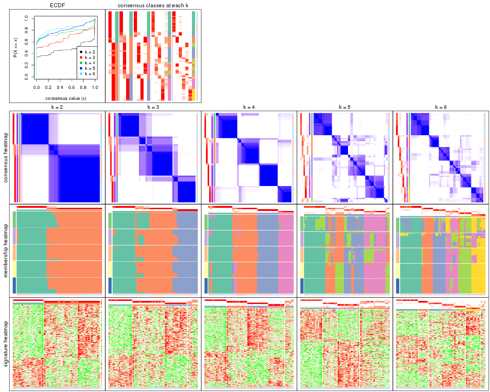

The plots are:

- The first row: a plot of the ECDF (Empirical cumulative distribution
  function) curves of the consensus matrix for each `k` and the heatmap of
  predicted classes for each `k`.
- The second row: heatmaps of the consensus matrix for each `k`.
- The third row: heatmaps of the membership matrix for each `k`.
- The fouth row: heatmaps of the signatures for each `k`.

All the plots in panels can be made by individual functions and they are
plotted later in this section.

`select_partition_number()` produces several plots showing different
statistics for choosing "optimized" `k`. There are following statistics:

- ECDF curves of the consensus matrix for each `k`;
- 1-PAC. [The PAC
  score](https://en.wikipedia.org/wiki/Consensus_clustering#Over-interpretation_potential_of_consensus_clustering)
  measures the proportion of the ambiguous subgrouping.
- Mean silhouette score.
- Concordance. The mean probability of fiting the consensus class ids in all
  partitions.
- Area increased. Denote $A_k$ as the area under the ECDF curve for current
  `k`, the area increased is defined as $A_k - A_{k-1}$.
- Rand index. The percent of pairs of samples that are both in a same cluster
  or both are not in a same cluster in the partition of k and k-1.
- Jaccard index. The ratio of pairs of samples are both in a same cluster in
  the partition of k and k-1 and the pairs of samples are both in a same
  cluster in the partition k or k-1.

The detailed explanations of these statistics can be found in [the cola
vignette](http://bioconductor.org/packages/devel/bioc/vignettes/cola/inst/doc/cola.html#toc_13).

Generally speaking, lower PAC score, higher mean silhouette score or higher
concordance corresponds to better partition. Rand index and Jaccard index
measure how similar the current partition is compared to partition with `k-1`.
If they are too similar, we won't accept `k` is better than `k-1`.

```r
select_partition_number(res)
```


The numeric values for all these statistics can be obtained by `get_stats()`.

```r
get_stats(res)
```

```
#>   k 1-PAC mean_silhouette concordance area_increased  Rand Jaccard
#> 2 2 0.784           0.918       0.962         0.4745 0.537   0.537
#> 3 3 0.684           0.815       0.916         0.3961 0.682   0.467
#> 4 4 0.890           0.870       0.945         0.1432 0.841   0.570
#> 5 5 0.725           0.530       0.765         0.0609 0.902   0.648
#> 6 6 0.773           0.764       0.842         0.0410 0.881   0.522
```

`suggest_best_k()` suggests the best $k$ based on these statistics. The rules are as follows:

- All $k$ with Jaccard index larger than 0.95 are removed because the increase of
  the partition number does not provides enough extra information. If all $k$ are removed,
  the best $k$ is assigned by `NA`.
- For $k$ with 1-PAC larger than 0.9, the maximal $k$ is taken as the "best k". Other $k$ is called "optional k".
- If it does not fit the second rule. The $k$ with the highest vote of highest
  1-PAC, mean silhouette and concordance is taken as the "best k".

```r
suggest_best_k(res)
```

```
#> [1] 2
```


Following shows the table of the partitions (You need to click the **show/hide
code output** link to see it). The membership matrix (columns with name `p*`)
is inferred by
[`clue::cl_consensus()`](https://www.rdocumentation.org/link/cl_consensus?package=clue)
function with the `SE` method. Basically the value in the membership matrix
represents the probability to belong to a certain group. The finall class
label for an item is determined with the group with highest probability it
belongs to.

In `get_classes()` function, the entropy is calculated from the membership
matrix and the silhouette score is calculated from the consensus matrix.


<script>
$( function() {
	$( '#tabs-ATC-pam-get-classes' ).tabs();
} );
</script>
<div id='tabs-ATC-pam-get-classes'>
<ul>
<li><a href='#tab-ATC-pam-get-classes-1'>k = 2</a></li>
<li><a href='#tab-ATC-pam-get-classes-2'>k = 3</a></li>
<li><a href='#tab-ATC-pam-get-classes-3'>k = 4</a></li>
<li><a href='#tab-ATC-pam-get-classes-4'>k = 5</a></li>
<li><a href='#tab-ATC-pam-get-classes-5'>k = 6</a></li>
</ul>

<div id='tab-ATC-pam-get-classes-1'>
<p><a id='tab-ATC-pam-get-classes-1-a' style='color:#0366d6' href='#'>show/hide code output</a></p>
<pre><code class="r">cbind(get_classes(res, k = 2), get_membership(res, k = 2))
</code></pre>

<pre><code>#&gt;          class entropy silhouette    p1    p2
#&gt; GSM22453     1   0.000      0.989 1.000 0.000
#&gt; GSM22458     2   0.000      0.942 0.000 1.000
#&gt; GSM22465     1   0.000      0.989 1.000 0.000
#&gt; GSM22466     1   0.000      0.989 1.000 0.000
#&gt; GSM22468     2   0.000      0.942 0.000 1.000
#&gt; GSM22469     1   0.000      0.989 1.000 0.000
#&gt; GSM22471     2   0.808      0.710 0.248 0.752
#&gt; GSM22472     2   0.000      0.942 0.000 1.000
#&gt; GSM22474     2   0.204      0.920 0.032 0.968
#&gt; GSM22476     2   0.000      0.942 0.000 1.000
#&gt; GSM22477     2   0.000      0.942 0.000 1.000
#&gt; GSM22478     2   0.000      0.942 0.000 1.000
#&gt; GSM22481     2   0.871      0.646 0.292 0.708
#&gt; GSM22484     2   0.000      0.942 0.000 1.000
#&gt; GSM22485     1   0.000      0.989 1.000 0.000
#&gt; GSM22487     1   0.000      0.989 1.000 0.000
#&gt; GSM22488     1   0.000      0.989 1.000 0.000
#&gt; GSM22489     2   0.000      0.942 0.000 1.000
#&gt; GSM22490     2   0.000      0.942 0.000 1.000
#&gt; GSM22492     2   0.000      0.942 0.000 1.000
#&gt; GSM22493     1   0.000      0.989 1.000 0.000
#&gt; GSM22494     1   0.000      0.989 1.000 0.000
#&gt; GSM22497     1   0.000      0.989 1.000 0.000
#&gt; GSM22498     2   0.871      0.646 0.292 0.708
#&gt; GSM22501     2   0.871      0.646 0.292 0.708
#&gt; GSM22502     2   0.000      0.942 0.000 1.000
#&gt; GSM22503     1   0.000      0.989 1.000 0.000
#&gt; GSM22504     2   0.000      0.942 0.000 1.000
#&gt; GSM22505     1   0.000      0.989 1.000 0.000
#&gt; GSM22506     2   0.000      0.942 0.000 1.000
#&gt; GSM22507     2   0.973      0.415 0.404 0.596
#&gt; GSM22508     2   0.000      0.942 0.000 1.000
#&gt; GSM22449     2   0.000      0.942 0.000 1.000
#&gt; GSM22450     1   0.000      0.989 1.000 0.000
#&gt; GSM22451     2   0.000      0.942 0.000 1.000
#&gt; GSM22452     1   0.000      0.989 1.000 0.000
#&gt; GSM22454     1   0.000      0.989 1.000 0.000
#&gt; GSM22455     2   0.000      0.942 0.000 1.000
#&gt; GSM22456     2   0.000      0.942 0.000 1.000
#&gt; GSM22457     1   0.706      0.731 0.808 0.192
#&gt; GSM22459     2   0.000      0.942 0.000 1.000
#&gt; GSM22460     2   0.000      0.942 0.000 1.000
#&gt; GSM22461     2   0.000      0.942 0.000 1.000
#&gt; GSM22462     2   0.808      0.710 0.248 0.752
#&gt; GSM22463     2   0.000      0.942 0.000 1.000
#&gt; GSM22464     1   0.000      0.989 1.000 0.000
#&gt; GSM22467     1   0.000      0.989 1.000 0.000
#&gt; GSM22470     2   0.000      0.942 0.000 1.000
#&gt; GSM22473     2   0.000      0.942 0.000 1.000
#&gt; GSM22475     2   0.000      0.942 0.000 1.000
#&gt; GSM22479     1   0.000      0.989 1.000 0.000
#&gt; GSM22480     2   0.000      0.942 0.000 1.000
#&gt; GSM22482     1   0.000      0.989 1.000 0.000
#&gt; GSM22483     2   0.000      0.942 0.000 1.000
#&gt; GSM22486     2   0.358      0.893 0.068 0.932
#&gt; GSM22491     2   0.795      0.720 0.240 0.760
#&gt; GSM22495     2   0.000      0.942 0.000 1.000
#&gt; GSM22496     2   0.000      0.942 0.000 1.000
#&gt; GSM22499     2   0.000      0.942 0.000 1.000
#&gt; GSM22500     1   0.000      0.989 1.000 0.000
</code></pre>

<script>
$('#tab-ATC-pam-get-classes-1-a').parent().next().next().hide();
$('#tab-ATC-pam-get-classes-1-a').click(function(){
  $('#tab-ATC-pam-get-classes-1-a').parent().next().next().toggle();
  return(false);
});
</script>
</div>

<div id='tab-ATC-pam-get-classes-2'>
<p><a id='tab-ATC-pam-get-classes-2-a' style='color:#0366d6' href='#'>show/hide code output</a></p>
<pre><code class="r">cbind(get_classes(res, k = 3), get_membership(res, k = 3))
</code></pre>

<pre><code>#&gt;          class entropy silhouette    p1    p2    p3
#&gt; GSM22453     1  0.2959      0.867 0.900 0.100 0.000
#&gt; GSM22458     2  0.0000      0.845 0.000 1.000 0.000
#&gt; GSM22465     1  0.0000      0.982 1.000 0.000 0.000
#&gt; GSM22466     1  0.0000      0.982 1.000 0.000 0.000
#&gt; GSM22468     2  0.0000      0.845 0.000 1.000 0.000
#&gt; GSM22469     1  0.0000      0.982 1.000 0.000 0.000
#&gt; GSM22471     2  0.0237      0.844 0.004 0.996 0.000
#&gt; GSM22472     3  0.0237      0.900 0.000 0.004 0.996
#&gt; GSM22474     2  0.0000      0.845 0.000 1.000 0.000
#&gt; GSM22476     2  0.0000      0.845 0.000 1.000 0.000
#&gt; GSM22477     3  0.0000      0.903 0.000 0.000 1.000
#&gt; GSM22478     2  0.0000      0.845 0.000 1.000 0.000
#&gt; GSM22481     2  0.4605      0.738 0.204 0.796 0.000
#&gt; GSM22484     3  0.0000      0.903 0.000 0.000 1.000
#&gt; GSM22485     1  0.0000      0.982 1.000 0.000 0.000
#&gt; GSM22487     1  0.0000      0.982 1.000 0.000 0.000
#&gt; GSM22488     1  0.0000      0.982 1.000 0.000 0.000
#&gt; GSM22489     3  0.0000      0.903 0.000 0.000 1.000
#&gt; GSM22490     3  0.0000      0.903 0.000 0.000 1.000
#&gt; GSM22492     2  0.0892      0.829 0.000 0.980 0.020
#&gt; GSM22493     1  0.3267      0.844 0.884 0.116 0.000
#&gt; GSM22494     1  0.0000      0.982 1.000 0.000 0.000
#&gt; GSM22497     1  0.0000      0.982 1.000 0.000 0.000
#&gt; GSM22498     2  0.4605      0.738 0.204 0.796 0.000
#&gt; GSM22501     2  0.4605      0.738 0.204 0.796 0.000
#&gt; GSM22502     3  0.6260      0.389 0.000 0.448 0.552
#&gt; GSM22503     2  0.6260      0.353 0.448 0.552 0.000
#&gt; GSM22504     3  0.0000      0.903 0.000 0.000 1.000
#&gt; GSM22505     1  0.0000      0.982 1.000 0.000 0.000
#&gt; GSM22506     2  0.0000      0.845 0.000 1.000 0.000
#&gt; GSM22507     2  0.4702      0.730 0.212 0.788 0.000
#&gt; GSM22508     2  0.0000      0.845 0.000 1.000 0.000
#&gt; GSM22449     2  0.0000      0.845 0.000 1.000 0.000
#&gt; GSM22450     1  0.0000      0.982 1.000 0.000 0.000
#&gt; GSM22451     3  0.0000      0.903 0.000 0.000 1.000
#&gt; GSM22452     1  0.0000      0.982 1.000 0.000 0.000
#&gt; GSM22454     1  0.0000      0.982 1.000 0.000 0.000
#&gt; GSM22455     3  0.0000      0.903 0.000 0.000 1.000
#&gt; GSM22456     3  0.0000      0.903 0.000 0.000 1.000
#&gt; GSM22457     2  0.5760      0.584 0.328 0.672 0.000
#&gt; GSM22459     3  0.0000      0.903 0.000 0.000 1.000
#&gt; GSM22460     3  0.0000      0.903 0.000 0.000 1.000
#&gt; GSM22461     3  0.0000      0.903 0.000 0.000 1.000
#&gt; GSM22462     2  0.5591      0.512 0.304 0.696 0.000
#&gt; GSM22463     3  0.6260      0.389 0.000 0.448 0.552
#&gt; GSM22464     2  0.6260      0.353 0.448 0.552 0.000
#&gt; GSM22467     1  0.0000      0.982 1.000 0.000 0.000
#&gt; GSM22470     3  0.0000      0.903 0.000 0.000 1.000
#&gt; GSM22473     2  0.0000      0.845 0.000 1.000 0.000
#&gt; GSM22475     3  0.0000      0.903 0.000 0.000 1.000
#&gt; GSM22479     2  0.6260      0.353 0.448 0.552 0.000
#&gt; GSM22480     2  0.0000      0.845 0.000 1.000 0.000
#&gt; GSM22482     1  0.0000      0.982 1.000 0.000 0.000
#&gt; GSM22483     3  0.6260      0.389 0.000 0.448 0.552
#&gt; GSM22486     2  0.0000      0.845 0.000 1.000 0.000
#&gt; GSM22491     2  0.0000      0.845 0.000 1.000 0.000
#&gt; GSM22495     2  0.0000      0.845 0.000 1.000 0.000
#&gt; GSM22496     3  0.4842      0.707 0.000 0.224 0.776
#&gt; GSM22499     2  0.0000      0.845 0.000 1.000 0.000
#&gt; GSM22500     2  0.6260      0.353 0.448 0.552 0.000
</code></pre>

<script>
$('#tab-ATC-pam-get-classes-2-a').parent().next().next().hide();
$('#tab-ATC-pam-get-classes-2-a').click(function(){
  $('#tab-ATC-pam-get-classes-2-a').parent().next().next().toggle();
  return(false);
});
</script>
</div>

<div id='tab-ATC-pam-get-classes-3'>
<p><a id='tab-ATC-pam-get-classes-3-a' style='color:#0366d6' href='#'>show/hide code output</a></p>
<pre><code class="r">cbind(get_classes(res, k = 4), get_membership(res, k = 4))
</code></pre>

<pre><code>#&gt;          class entropy silhouette    p1    p2    p3    p4
#&gt; GSM22453     1  0.6928      0.307 0.512 0.372 0.000 0.116
#&gt; GSM22458     4  0.1118      0.938 0.000 0.036 0.000 0.964
#&gt; GSM22465     1  0.0000      0.927 1.000 0.000 0.000 0.000
#&gt; GSM22466     1  0.0000      0.927 1.000 0.000 0.000 0.000
#&gt; GSM22468     2  0.0000      0.897 0.000 1.000 0.000 0.000
#&gt; GSM22469     1  0.0000      0.927 1.000 0.000 0.000 0.000
#&gt; GSM22471     4  0.0000      0.963 0.000 0.000 0.000 1.000
#&gt; GSM22472     3  0.0188      0.967 0.000 0.004 0.996 0.000
#&gt; GSM22474     4  0.2814      0.836 0.000 0.132 0.000 0.868
#&gt; GSM22476     2  0.0000      0.897 0.000 1.000 0.000 0.000
#&gt; GSM22477     3  0.0000      0.971 0.000 0.000 1.000 0.000
#&gt; GSM22478     2  0.4761      0.407 0.000 0.628 0.000 0.372
#&gt; GSM22481     4  0.0000      0.963 0.000 0.000 0.000 1.000
#&gt; GSM22484     3  0.0000      0.971 0.000 0.000 1.000 0.000
#&gt; GSM22485     1  0.1118      0.905 0.964 0.000 0.000 0.036
#&gt; GSM22487     1  0.0000      0.927 1.000 0.000 0.000 0.000
#&gt; GSM22488     1  0.0000      0.927 1.000 0.000 0.000 0.000
#&gt; GSM22489     3  0.0000      0.971 0.000 0.000 1.000 0.000
#&gt; GSM22490     3  0.0000      0.971 0.000 0.000 1.000 0.000
#&gt; GSM22492     2  0.0000      0.897 0.000 1.000 0.000 0.000
#&gt; GSM22493     1  0.6928      0.307 0.512 0.372 0.000 0.116
#&gt; GSM22494     1  0.0000      0.927 1.000 0.000 0.000 0.000
#&gt; GSM22497     1  0.0000      0.927 1.000 0.000 0.000 0.000
#&gt; GSM22498     4  0.2021      0.929 0.024 0.040 0.000 0.936
#&gt; GSM22501     4  0.0000      0.963 0.000 0.000 0.000 1.000
#&gt; GSM22502     2  0.4761      0.374 0.000 0.628 0.372 0.000
#&gt; GSM22503     4  0.0000      0.963 0.000 0.000 0.000 1.000
#&gt; GSM22504     3  0.0000      0.971 0.000 0.000 1.000 0.000
#&gt; GSM22505     1  0.0000      0.927 1.000 0.000 0.000 0.000
#&gt; GSM22506     2  0.0000      0.897 0.000 1.000 0.000 0.000
#&gt; GSM22507     4  0.2469      0.870 0.108 0.000 0.000 0.892
#&gt; GSM22508     2  0.2408      0.829 0.000 0.896 0.000 0.104
#&gt; GSM22449     2  0.0000      0.897 0.000 1.000 0.000 0.000
#&gt; GSM22450     1  0.0000      0.927 1.000 0.000 0.000 0.000
#&gt; GSM22451     3  0.0000      0.971 0.000 0.000 1.000 0.000
#&gt; GSM22452     1  0.0000      0.927 1.000 0.000 0.000 0.000
#&gt; GSM22454     1  0.0000      0.927 1.000 0.000 0.000 0.000
#&gt; GSM22455     3  0.0000      0.971 0.000 0.000 1.000 0.000
#&gt; GSM22456     3  0.0000      0.971 0.000 0.000 1.000 0.000
#&gt; GSM22457     4  0.0000      0.963 0.000 0.000 0.000 1.000
#&gt; GSM22459     3  0.0000      0.971 0.000 0.000 1.000 0.000
#&gt; GSM22460     3  0.0000      0.971 0.000 0.000 1.000 0.000
#&gt; GSM22461     3  0.0000      0.971 0.000 0.000 1.000 0.000
#&gt; GSM22462     2  0.1022      0.882 0.000 0.968 0.000 0.032
#&gt; GSM22463     2  0.0000      0.897 0.000 1.000 0.000 0.000
#&gt; GSM22464     1  0.2081      0.860 0.916 0.000 0.000 0.084
#&gt; GSM22467     1  0.0000      0.927 1.000 0.000 0.000 0.000
#&gt; GSM22470     3  0.0000      0.971 0.000 0.000 1.000 0.000
#&gt; GSM22473     2  0.4761      0.407 0.000 0.628 0.000 0.372
#&gt; GSM22475     3  0.0000      0.971 0.000 0.000 1.000 0.000
#&gt; GSM22479     4  0.0000      0.963 0.000 0.000 0.000 1.000
#&gt; GSM22480     2  0.0000      0.897 0.000 1.000 0.000 0.000
#&gt; GSM22482     1  0.1474      0.893 0.948 0.000 0.000 0.052
#&gt; GSM22483     2  0.0000      0.897 0.000 1.000 0.000 0.000
#&gt; GSM22486     2  0.3123      0.777 0.000 0.844 0.000 0.156
#&gt; GSM22491     2  0.0000      0.897 0.000 1.000 0.000 0.000
#&gt; GSM22495     2  0.1557      0.866 0.000 0.944 0.000 0.056
#&gt; GSM22496     3  0.4730      0.380 0.000 0.364 0.636 0.000
#&gt; GSM22499     2  0.0000      0.897 0.000 1.000 0.000 0.000
#&gt; GSM22500     4  0.0000      0.963 0.000 0.000 0.000 1.000
</code></pre>

<script>
$('#tab-ATC-pam-get-classes-3-a').parent().next().next().hide();
$('#tab-ATC-pam-get-classes-3-a').click(function(){
  $('#tab-ATC-pam-get-classes-3-a').parent().next().next().toggle();
  return(false);
});
</script>
</div>

<div id='tab-ATC-pam-get-classes-4'>
<p><a id='tab-ATC-pam-get-classes-4-a' style='color:#0366d6' href='#'>show/hide code output</a></p>
<pre><code class="r">cbind(get_classes(res, k = 5), get_membership(res, k = 5))
</code></pre>

<pre><code>#&gt;          class entropy silhouette    p1    p2    p3    p4    p5
#&gt; GSM22453     3  0.5824    0.43904 0.288 0.040 0.620 0.000 0.052
#&gt; GSM22458     2  0.3196    0.14171 0.000 0.804 0.004 0.000 0.192
#&gt; GSM22465     1  0.2377    0.91555 0.872 0.000 0.000 0.000 0.128
#&gt; GSM22466     1  0.2377    0.91555 0.872 0.000 0.000 0.000 0.128
#&gt; GSM22468     3  0.4650    0.16845 0.000 0.468 0.520 0.000 0.012
#&gt; GSM22469     1  0.2377    0.91555 0.872 0.000 0.000 0.000 0.128
#&gt; GSM22471     2  0.4294   -0.26796 0.000 0.532 0.000 0.000 0.468
#&gt; GSM22472     4  0.4654    0.71470 0.000 0.000 0.024 0.628 0.348
#&gt; GSM22474     2  0.2329    0.12155 0.000 0.876 0.124 0.000 0.000
#&gt; GSM22476     3  0.2929    0.64960 0.000 0.000 0.820 0.000 0.180
#&gt; GSM22477     4  0.2970    0.81684 0.000 0.000 0.004 0.828 0.168
#&gt; GSM22478     5  0.7915   -0.02926 0.000 0.104 0.360 0.172 0.364
#&gt; GSM22481     2  0.4300   -0.28473 0.000 0.524 0.000 0.000 0.476
#&gt; GSM22484     4  0.5223    0.75244 0.000 0.108 0.012 0.708 0.172
#&gt; GSM22485     1  0.1270    0.90203 0.948 0.000 0.000 0.000 0.052
#&gt; GSM22487     1  0.2377    0.91555 0.872 0.000 0.000 0.000 0.128
#&gt; GSM22488     1  0.0703    0.91269 0.976 0.000 0.000 0.000 0.024
#&gt; GSM22489     4  0.0000    0.83274 0.000 0.000 0.000 1.000 0.000
#&gt; GSM22490     4  0.5600    0.67675 0.000 0.052 0.016 0.584 0.348
#&gt; GSM22492     3  0.4283    0.53801 0.000 0.008 0.644 0.000 0.348
#&gt; GSM22493     3  0.5824    0.43904 0.288 0.040 0.620 0.000 0.052
#&gt; GSM22494     1  0.0703    0.91269 0.976 0.000 0.000 0.000 0.024
#&gt; GSM22497     1  0.1197    0.90745 0.952 0.000 0.000 0.000 0.048
#&gt; GSM22498     5  0.4905    0.02410 0.024 0.476 0.000 0.000 0.500
#&gt; GSM22501     2  0.2074    0.01449 0.000 0.896 0.000 0.000 0.104
#&gt; GSM22502     2  0.6426   -0.00859 0.000 0.468 0.184 0.000 0.348
#&gt; GSM22503     2  0.4294   -0.26796 0.000 0.532 0.000 0.000 0.468
#&gt; GSM22504     4  0.4482    0.71971 0.000 0.000 0.016 0.636 0.348
#&gt; GSM22505     1  0.2377    0.91555 0.872 0.000 0.000 0.000 0.128
#&gt; GSM22506     3  0.0794    0.69616 0.000 0.000 0.972 0.000 0.028
#&gt; GSM22507     5  0.6700    0.19097 0.128 0.396 0.024 0.000 0.452
#&gt; GSM22508     2  0.6314    0.03191 0.000 0.508 0.180 0.000 0.312
#&gt; GSM22449     3  0.5616    0.25820 0.000 0.364 0.552 0.000 0.084
#&gt; GSM22450     1  0.1270    0.90203 0.948 0.000 0.000 0.000 0.052
#&gt; GSM22451     4  0.0324    0.83087 0.000 0.000 0.004 0.992 0.004
#&gt; GSM22452     1  0.2377    0.91555 0.872 0.000 0.000 0.000 0.128
#&gt; GSM22454     1  0.0703    0.91269 0.976 0.000 0.000 0.000 0.024
#&gt; GSM22455     4  0.1831    0.79350 0.000 0.076 0.000 0.920 0.004
#&gt; GSM22456     4  0.0000    0.83274 0.000 0.000 0.000 1.000 0.000
#&gt; GSM22457     2  0.4294   -0.26796 0.000 0.532 0.000 0.000 0.468
#&gt; GSM22459     4  0.0162    0.83140 0.000 0.000 0.000 0.996 0.004
#&gt; GSM22460     4  0.0000    0.83274 0.000 0.000 0.000 1.000 0.000
#&gt; GSM22461     4  0.3280    0.81321 0.000 0.000 0.012 0.812 0.176
#&gt; GSM22462     3  0.2067    0.67731 0.000 0.032 0.920 0.000 0.048
#&gt; GSM22463     3  0.3575    0.58608 0.000 0.016 0.800 0.180 0.004
#&gt; GSM22464     1  0.2077    0.88204 0.920 0.040 0.000 0.000 0.040
#&gt; GSM22467     1  0.1478    0.92112 0.936 0.000 0.000 0.000 0.064
#&gt; GSM22470     4  0.0000    0.83274 0.000 0.000 0.000 1.000 0.000
#&gt; GSM22473     2  0.4074    0.04486 0.000 0.636 0.364 0.000 0.000
#&gt; GSM22475     4  0.2970    0.81684 0.000 0.000 0.004 0.828 0.168
#&gt; GSM22479     2  0.4294   -0.26796 0.000 0.532 0.000 0.000 0.468
#&gt; GSM22480     3  0.0880    0.69449 0.000 0.032 0.968 0.000 0.000
#&gt; GSM22482     1  0.2771    0.91120 0.860 0.012 0.000 0.000 0.128
#&gt; GSM22483     3  0.4482    0.53418 0.000 0.016 0.636 0.000 0.348
#&gt; GSM22486     3  0.2777    0.62869 0.000 0.120 0.864 0.000 0.016
#&gt; GSM22491     3  0.0566    0.69680 0.000 0.012 0.984 0.004 0.000
#&gt; GSM22495     2  0.4829   -0.23554 0.000 0.500 0.480 0.000 0.020
#&gt; GSM22496     4  0.3398    0.66416 0.000 0.000 0.216 0.780 0.004
#&gt; GSM22499     3  0.0000    0.69787 0.000 0.000 1.000 0.000 0.000
#&gt; GSM22500     2  0.4294   -0.26796 0.000 0.532 0.000 0.000 0.468
</code></pre>

<script>
$('#tab-ATC-pam-get-classes-4-a').parent().next().next().hide();
$('#tab-ATC-pam-get-classes-4-a').click(function(){
  $('#tab-ATC-pam-get-classes-4-a').parent().next().next().toggle();
  return(false);
});
</script>
</div>

<div id='tab-ATC-pam-get-classes-5'>
<p><a id='tab-ATC-pam-get-classes-5-a' style='color:#0366d6' href='#'>show/hide code output</a></p>
<pre><code class="r">cbind(get_classes(res, k = 6), get_membership(res, k = 6))
</code></pre>

<pre><code>#&gt;          class entropy silhouette    p1    p2    p3    p4    p5    p6
#&gt; GSM22453     3  0.0547      0.810 0.020 0.000 0.980 0.000 0.000 0.000
#&gt; GSM22458     5  0.2389      0.806 0.000 0.060 0.000 0.052 0.888 0.000
#&gt; GSM22465     1  0.0000      0.919 1.000 0.000 0.000 0.000 0.000 0.000
#&gt; GSM22466     1  0.0000      0.919 1.000 0.000 0.000 0.000 0.000 0.000
#&gt; GSM22468     5  0.1257      0.826 0.000 0.028 0.020 0.000 0.952 0.000
#&gt; GSM22469     1  0.0000      0.919 1.000 0.000 0.000 0.000 0.000 0.000
#&gt; GSM22471     2  0.0000      0.898 0.000 1.000 0.000 0.000 0.000 0.000
#&gt; GSM22472     4  0.1950      0.702 0.000 0.000 0.024 0.912 0.064 0.000
#&gt; GSM22474     5  0.2219      0.803 0.000 0.136 0.000 0.000 0.864 0.000
#&gt; GSM22476     3  0.3168      0.748 0.000 0.000 0.792 0.192 0.016 0.000
#&gt; GSM22477     4  0.3539      0.514 0.000 0.000 0.000 0.756 0.024 0.220
#&gt; GSM22478     6  0.3244      0.584 0.000 0.000 0.000 0.000 0.268 0.732
#&gt; GSM22481     2  0.0790      0.883 0.000 0.968 0.032 0.000 0.000 0.000
#&gt; GSM22484     4  0.5674      0.377 0.000 0.000 0.044 0.548 0.340 0.068
#&gt; GSM22485     1  0.2854      0.869 0.792 0.000 0.208 0.000 0.000 0.000
#&gt; GSM22487     1  0.0000      0.919 1.000 0.000 0.000 0.000 0.000 0.000
#&gt; GSM22488     1  0.1814      0.915 0.900 0.000 0.100 0.000 0.000 0.000
#&gt; GSM22489     6  0.3834      0.673 0.000 0.000 0.000 0.268 0.024 0.708
#&gt; GSM22490     4  0.3916      0.513 0.000 0.000 0.020 0.680 0.300 0.000
#&gt; GSM22492     4  0.4136      0.577 0.000 0.000 0.192 0.732 0.076 0.000
#&gt; GSM22493     3  0.0547      0.810 0.020 0.000 0.980 0.000 0.000 0.000
#&gt; GSM22494     1  0.1814      0.915 0.900 0.000 0.100 0.000 0.000 0.000
#&gt; GSM22497     1  0.2823      0.871 0.796 0.000 0.204 0.000 0.000 0.000
#&gt; GSM22498     2  0.2362      0.794 0.004 0.860 0.136 0.000 0.000 0.000
#&gt; GSM22501     5  0.3991      0.241 0.000 0.472 0.004 0.000 0.524 0.000
#&gt; GSM22502     5  0.1501      0.790 0.000 0.000 0.000 0.076 0.924 0.000
#&gt; GSM22503     2  0.0000      0.898 0.000 1.000 0.000 0.000 0.000 0.000
#&gt; GSM22504     4  0.1950      0.702 0.000 0.000 0.024 0.912 0.064 0.000
#&gt; GSM22505     1  0.0000      0.919 1.000 0.000 0.000 0.000 0.000 0.000
#&gt; GSM22506     3  0.2094      0.859 0.000 0.000 0.900 0.020 0.080 0.000
#&gt; GSM22507     2  0.6128      0.304 0.012 0.484 0.268 0.000 0.236 0.000
#&gt; GSM22508     5  0.1788      0.821 0.000 0.028 0.004 0.040 0.928 0.000
#&gt; GSM22449     5  0.4737      0.585 0.000 0.008 0.160 0.132 0.700 0.000
#&gt; GSM22450     1  0.2730      0.877 0.808 0.000 0.192 0.000 0.000 0.000
#&gt; GSM22451     6  0.0603      0.758 0.000 0.000 0.000 0.004 0.016 0.980
#&gt; GSM22452     1  0.0000      0.919 1.000 0.000 0.000 0.000 0.000 0.000
#&gt; GSM22454     1  0.1814      0.915 0.900 0.000 0.100 0.000 0.000 0.000
#&gt; GSM22455     6  0.0632      0.757 0.000 0.000 0.000 0.000 0.024 0.976
#&gt; GSM22456     6  0.3719      0.688 0.000 0.000 0.000 0.248 0.024 0.728
#&gt; GSM22457     2  0.0000      0.898 0.000 1.000 0.000 0.000 0.000 0.000
#&gt; GSM22459     6  0.0713      0.757 0.000 0.000 0.000 0.028 0.000 0.972
#&gt; GSM22460     6  0.3789      0.680 0.000 0.000 0.000 0.260 0.024 0.716
#&gt; GSM22461     4  0.4142      0.579 0.000 0.000 0.000 0.712 0.056 0.232
#&gt; GSM22462     3  0.2542      0.856 0.000 0.044 0.876 0.000 0.080 0.000
#&gt; GSM22463     6  0.4118      0.631 0.000 0.000 0.028 0.072 0.120 0.780
#&gt; GSM22464     1  0.3175      0.874 0.808 0.028 0.164 0.000 0.000 0.000
#&gt; GSM22467     1  0.0790      0.921 0.968 0.000 0.032 0.000 0.000 0.000
#&gt; GSM22470     6  0.3834      0.673 0.000 0.000 0.000 0.268 0.024 0.708
#&gt; GSM22473     5  0.1838      0.824 0.000 0.068 0.000 0.000 0.916 0.016
#&gt; GSM22475     4  0.3539      0.514 0.000 0.000 0.000 0.756 0.024 0.220
#&gt; GSM22479     2  0.0000      0.898 0.000 1.000 0.000 0.000 0.000 0.000
#&gt; GSM22480     3  0.3050      0.767 0.000 0.000 0.764 0.000 0.236 0.000
#&gt; GSM22482     1  0.2494      0.886 0.864 0.016 0.120 0.000 0.000 0.000
#&gt; GSM22483     4  0.4174      0.583 0.000 0.000 0.184 0.732 0.084 0.000
#&gt; GSM22486     3  0.3681      0.796 0.000 0.156 0.780 0.000 0.064 0.000
#&gt; GSM22491     3  0.2048      0.855 0.000 0.000 0.880 0.000 0.120 0.000
#&gt; GSM22495     5  0.1780      0.816 0.000 0.028 0.048 0.000 0.924 0.000
#&gt; GSM22496     6  0.2258      0.722 0.000 0.000 0.000 0.044 0.060 0.896
#&gt; GSM22499     3  0.3637      0.796 0.000 0.000 0.792 0.124 0.084 0.000
#&gt; GSM22500     2  0.0000      0.898 0.000 1.000 0.000 0.000 0.000 0.000
</code></pre>

<script>
$('#tab-ATC-pam-get-classes-5-a').parent().next().next().hide();
$('#tab-ATC-pam-get-classes-5-a').click(function(){
  $('#tab-ATC-pam-get-classes-5-a').parent().next().next().toggle();
  return(false);
});
</script>
</div>
</div>

Heatmaps for the consensus matrix. It visualizes the probability of two
samples to be in a same group.


<script>
$( function() {
	$( '#tabs-ATC-pam-consensus-heatmap' ).tabs();
} );
</script>
<div id='tabs-ATC-pam-consensus-heatmap'>
<ul>
<li><a href='#tab-ATC-pam-consensus-heatmap-1'>k = 2</a></li>
<li><a href='#tab-ATC-pam-consensus-heatmap-2'>k = 3</a></li>
<li><a href='#tab-ATC-pam-consensus-heatmap-3'>k = 4</a></li>
<li><a href='#tab-ATC-pam-consensus-heatmap-4'>k = 5</a></li>
<li><a href='#tab-ATC-pam-consensus-heatmap-5'>k = 6</a></li>
</ul>
<div id='tab-ATC-pam-consensus-heatmap-1'>
<pre><code class="r">consensus_heatmap(res, k = 2)
</code></pre>

<p>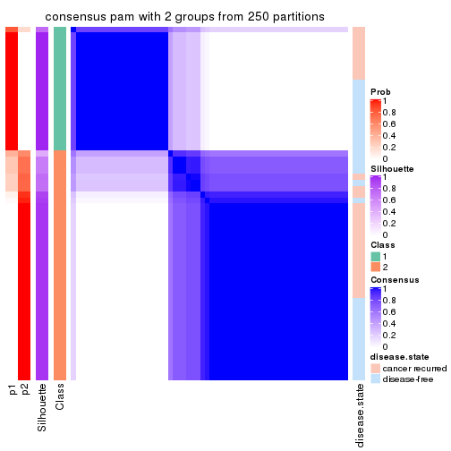</p>

</div>
<div id='tab-ATC-pam-consensus-heatmap-2'>
<pre><code class="r">consensus_heatmap(res, k = 3)
</code></pre>

<p></p>

</div>
<div id='tab-ATC-pam-consensus-heatmap-3'>
<pre><code class="r">consensus_heatmap(res, k = 4)
</code></pre>

<p></p>

</div>
<div id='tab-ATC-pam-consensus-heatmap-4'>
<pre><code class="r">consensus_heatmap(res, k = 5)
</code></pre>

<p></p>

</div>
<div id='tab-ATC-pam-consensus-heatmap-5'>
<pre><code class="r">consensus_heatmap(res, k = 6)
</code></pre>

<p></p>

</div>
</div>

Heatmaps for the membership of samples in all partitions to see how consistent they are:


<script>
$( function() {
	$( '#tabs-ATC-pam-membership-heatmap' ).tabs();
} );
</script>
<div id='tabs-ATC-pam-membership-heatmap'>
<ul>
<li><a href='#tab-ATC-pam-membership-heatmap-1'>k = 2</a></li>
<li><a href='#tab-ATC-pam-membership-heatmap-2'>k = 3</a></li>
<li><a href='#tab-ATC-pam-membership-heatmap-3'>k = 4</a></li>
<li><a href='#tab-ATC-pam-membership-heatmap-4'>k = 5</a></li>
<li><a href='#tab-ATC-pam-membership-heatmap-5'>k = 6</a></li>
</ul>
<div id='tab-ATC-pam-membership-heatmap-1'>
<pre><code class="r">membership_heatmap(res, k = 2)
</code></pre>

<p></p>

</div>
<div id='tab-ATC-pam-membership-heatmap-2'>
<pre><code class="r">membership_heatmap(res, k = 3)
</code></pre>

<p></p>

</div>
<div id='tab-ATC-pam-membership-heatmap-3'>
<pre><code class="r">membership_heatmap(res, k = 4)
</code></pre>

<p></p>

</div>
<div id='tab-ATC-pam-membership-heatmap-4'>
<pre><code class="r">membership_heatmap(res, k = 5)
</code></pre>

<p></p>

</div>
<div id='tab-ATC-pam-membership-heatmap-5'>
<pre><code class="r">membership_heatmap(res, k = 6)
</code></pre>

<p></p>

</div>
</div>

As soon as we have had the classes for columns, we can look for signatures
which are significantly different between classes which can be candidate marks
for certain classes. Following are the heatmaps for signatures.


Signature heatmaps where rows are scaled:


<script>
$( function() {
	$( '#tabs-ATC-pam-get-signatures' ).tabs();
} );
</script>
<div id='tabs-ATC-pam-get-signatures'>
<ul>
<li><a href='#tab-ATC-pam-get-signatures-1'>k = 2</a></li>
<li><a href='#tab-ATC-pam-get-signatures-2'>k = 3</a></li>
<li><a href='#tab-ATC-pam-get-signatures-3'>k = 4</a></li>
<li><a href='#tab-ATC-pam-get-signatures-4'>k = 5</a></li>
<li><a href='#tab-ATC-pam-get-signatures-5'>k = 6</a></li>
</ul>
<div id='tab-ATC-pam-get-signatures-1'>
<pre><code class="r">get_signatures(res, k = 2)
</code></pre>

<p></p>

</div>
<div id='tab-ATC-pam-get-signatures-2'>
<pre><code class="r">get_signatures(res, k = 3)
</code></pre>

<p></p>

</div>
<div id='tab-ATC-pam-get-signatures-3'>
<pre><code class="r">get_signatures(res, k = 4)
</code></pre>

<p></p>

</div>
<div id='tab-ATC-pam-get-signatures-4'>
<pre><code class="r">get_signatures(res, k = 5)
</code></pre>

<p></p>

</div>
<div id='tab-ATC-pam-get-signatures-5'>
<pre><code class="r">get_signatures(res, k = 6)
</code></pre>

<p></p>

</div>
</div>


Signature heatmaps where rows are not scaled:


<script>
$( function() {
	$( '#tabs-ATC-pam-get-signatures-no-scale' ).tabs();
} );
</script>
<div id='tabs-ATC-pam-get-signatures-no-scale'>
<ul>
<li><a href='#tab-ATC-pam-get-signatures-no-scale-1'>k = 2</a></li>
<li><a href='#tab-ATC-pam-get-signatures-no-scale-2'>k = 3</a></li>
<li><a href='#tab-ATC-pam-get-signatures-no-scale-3'>k = 4</a></li>
<li><a href='#tab-ATC-pam-get-signatures-no-scale-4'>k = 5</a></li>
<li><a href='#tab-ATC-pam-get-signatures-no-scale-5'>k = 6</a></li>
</ul>
<div id='tab-ATC-pam-get-signatures-no-scale-1'>
<pre><code class="r">get_signatures(res, k = 2, scale_rows = FALSE)
</code></pre>

<p></p>

</div>
<div id='tab-ATC-pam-get-signatures-no-scale-2'>
<pre><code class="r">get_signatures(res, k = 3, scale_rows = FALSE)
</code></pre>

<p></p>

</div>
<div id='tab-ATC-pam-get-signatures-no-scale-3'>
<pre><code class="r">get_signatures(res, k = 4, scale_rows = FALSE)
</code></pre>

<p></p>

</div>
<div id='tab-ATC-pam-get-signatures-no-scale-4'>
<pre><code class="r">get_signatures(res, k = 5, scale_rows = FALSE)
</code></pre>

<p></p>

</div>
<div id='tab-ATC-pam-get-signatures-no-scale-5'>
<pre><code class="r">get_signatures(res, k = 6, scale_rows = FALSE)
</code></pre>

<p></p>

</div>
</div>


Compare the overlap of signatures from different k:

```r
compare_signatures(res)
```


`get_signature()` returns a data frame invisibly. TO get the list of signatures, the function
call should be assigned to a variable explicitly. In following code, if `plot` argument is set
to `FALSE`, no heatmap is plotted while only the differential analysis is performed.

```r
# code only for demonstration
tb = get_signature(res, k = ..., plot = FALSE)
```

An example of the output of `tb` is:

```
#>   which_row         fdr    mean_1    mean_2 scaled_mean_1 scaled_mean_2 km
#> 1        38 0.042760348  8.373488  9.131774    -0.5533452     0.5164555  1
#> 2        40 0.018707592  7.106213  8.469186    -0.6173731     0.5762149  1
#> 3        55 0.019134737 10.221463 11.207825    -0.6159697     0.5749050  1
#> 4        59 0.006059896  5.921854  7.869574    -0.6899429     0.6439467  1
#> 5        60 0.018055526  8.928898 10.211722    -0.6204761     0.5791110  1
#> 6        98 0.009384629 15.714769 14.887706     0.6635654    -0.6193277  2
...
```

The columns in `tb` are:

1. `which_row`: row indices corresponding to the input matrix.
2. `fdr`: FDR for the differential test. 
3. `mean_x`: The mean value in group x.
4. `scaled_mean_x`: The mean value in group x after rows are scaled.
5. `km`: Row groups if k-means clustering is applied to rows.


UMAP plot which shows how samples are separated.


<script>
$( function() {
	$( '#tabs-ATC-pam-dimension-reduction' ).tabs();
} );
</script>
<div id='tabs-ATC-pam-dimension-reduction'>
<ul>
<li><a href='#tab-ATC-pam-dimension-reduction-1'>k = 2</a></li>
<li><a href='#tab-ATC-pam-dimension-reduction-2'>k = 3</a></li>
<li><a href='#tab-ATC-pam-dimension-reduction-3'>k = 4</a></li>
<li><a href='#tab-ATC-pam-dimension-reduction-4'>k = 5</a></li>
<li><a href='#tab-ATC-pam-dimension-reduction-5'>k = 6</a></li>
</ul>
<div id='tab-ATC-pam-dimension-reduction-1'>
<pre><code class="r">dimension_reduction(res, k = 2, method = &quot;UMAP&quot;)
</code></pre>

<p></p>

</div>
<div id='tab-ATC-pam-dimension-reduction-2'>
<pre><code class="r">dimension_reduction(res, k = 3, method = &quot;UMAP&quot;)
</code></pre>

<p></p>

</div>
<div id='tab-ATC-pam-dimension-reduction-3'>
<pre><code class="r">dimension_reduction(res, k = 4, method = &quot;UMAP&quot;)
</code></pre>

<p></p>

</div>
<div id='tab-ATC-pam-dimension-reduction-4'>
<pre><code class="r">dimension_reduction(res, k = 5, method = &quot;UMAP&quot;)
</code></pre>

<p></p>

</div>
<div id='tab-ATC-pam-dimension-reduction-5'>
<pre><code class="r">dimension_reduction(res, k = 6, method = &quot;UMAP&quot;)
</code></pre>

<p></p>

</div>
</div>


Following heatmap shows how subgroups are split when increasing `k`:

```r
collect_classes(res)
```


Test correlation between subgroups and known annotations. If the known
annotation is numeric, one-way ANOVA test is applied, and if the known
annotation is discrete, chi-squared contingency table test is applied.

```r
test_to_known_factors(res)
```

```
#>          n disease.state(p) k
#> ATC:pam 59            0.800 2
#> ATC:pam 53            0.259 3
#> ATC:pam 54            0.237 4
#> ATC:pam 40            0.298 5
#> ATC:pam 57            0.365 6
```


If matrix rows can be associated to genes, consider to use `GO_Enrichment(res,
...)` to perform function enrichment for the signature genes.


 

---------------------------------------------------


### ATC:mclust


The object with results only for a single top-value method and a single partition method 
can be extracted as:

```r
res = res_list["ATC", "mclust"]
# you can also extract it by
# res = res_list["ATC:mclust"]
```

A summary of `res` and all the functions that can be applied to it:

```r
res
```

```
#> A 'ConsensusPartition' object with k = 2, 3, 4, 5, 6.
#>   On a matrix with 21446 rows and 60 columns.
#>   Top rows (1000, 2000, 3000, 4000, 5000) are extracted by 'ATC' method.
#>   Subgroups are detected by 'mclust' method.
#>   Performed in total 1250 partitions by row resampling.
#>   Best k for subgroups seems to be 4.
#> 
#> Following methods can be applied to this 'ConsensusPartition' object:
#>  [1] "cola_report"             "collect_classes"         "collect_plots"          
#>  [4] "collect_stats"           "colnames"                "compare_signatures"     
#>  [7] "consensus_heatmap"       "dimension_reduction"     "functional_enrichment"  
#> [10] "get_anno_col"            "get_anno"                "get_classes"            
#> [13] "get_consensus"           "get_matrix"              "get_membership"         
#> [16] "get_param"               "get_signatures"          "get_stats"              
#> [19] "is_best_k"               "is_stable_k"             "membership_heatmap"     
#> [22] "ncol"                    "nrow"                    "plot_ecdf"              
#> [25] "rownames"                "select_partition_number" "show"                   
#> [28] "suggest_best_k"          "test_to_known_factors"
```

`collect_plots()` function collects all the plots made from `res` for all `k` (number of partitions)
into one single page to provide an easy and fast comparison between different `k`.

```r
collect_plots(res)
```


The plots are:

- The first row: a plot of the ECDF (Empirical cumulative distribution
  function) curves of the consensus matrix for each `k` and the heatmap of
  predicted classes for each `k`.
- The second row: heatmaps of the consensus matrix for each `k`.
- The third row: heatmaps of the membership matrix for each `k`.
- The fouth row: heatmaps of the signatures for each `k`.

All the plots in panels can be made by individual functions and they are
plotted later in this section.

`select_partition_number()` produces several plots showing different
statistics for choosing "optimized" `k`. There are following statistics:

- ECDF curves of the consensus matrix for each `k`;
- 1-PAC. [The PAC
  score](https://en.wikipedia.org/wiki/Consensus_clustering#Over-interpretation_potential_of_consensus_clustering)
  measures the proportion of the ambiguous subgrouping.
- Mean silhouette score.
- Concordance. The mean probability of fiting the consensus class ids in all
  partitions.
- Area increased. Denote $A_k$ as the area under the ECDF curve for current
  `k`, the area increased is defined as $A_k - A_{k-1}$.
- Rand index. The percent of pairs of samples that are both in a same cluster
  or both are not in a same cluster in the partition of k and k-1.
- Jaccard index. The ratio of pairs of samples are both in a same cluster in
  the partition of k and k-1 and the pairs of samples are both in a same
  cluster in the partition k or k-1.

The detailed explanations of these statistics can be found in [the cola
vignette](http://bioconductor.org/packages/devel/bioc/vignettes/cola/inst/doc/cola.html#toc_13).

Generally speaking, lower PAC score, higher mean silhouette score or higher
concordance corresponds to better partition. Rand index and Jaccard index
measure how similar the current partition is compared to partition with `k-1`.
If they are too similar, we won't accept `k` is better than `k-1`.

```r
select_partition_number(res)
```


The numeric values for all these statistics can be obtained by `get_stats()`.

```r
get_stats(res)
```

```
#>   k 1-PAC mean_silhouette concordance area_increased  Rand Jaccard
#> 2 2 0.652           0.839       0.920         0.4421 0.573   0.573
#> 3 3 0.596           0.873       0.888         0.3680 0.777   0.626
#> 4 4 0.885           0.868       0.948         0.2209 0.725   0.412
#> 5 5 0.742           0.541       0.809         0.0593 0.945   0.799
#> 6 6 0.717           0.623       0.786         0.0468 0.895   0.587
```

`suggest_best_k()` suggests the best $k$ based on these statistics. The rules are as follows:

- All $k$ with Jaccard index larger than 0.95 are removed because the increase of
  the partition number does not provides enough extra information. If all $k$ are removed,
  the best $k$ is assigned by `NA`.
- For $k$ with 1-PAC larger than 0.9, the maximal $k$ is taken as the "best k". Other $k$ is called "optional k".
- If it does not fit the second rule. The $k$ with the highest vote of highest
  1-PAC, mean silhouette and concordance is taken as the "best k".

```r
suggest_best_k(res)
```

```
#> [1] 4
```


Following shows the table of the partitions (You need to click the **show/hide
code output** link to see it). The membership matrix (columns with name `p*`)
is inferred by
[`clue::cl_consensus()`](https://www.rdocumentation.org/link/cl_consensus?package=clue)
function with the `SE` method. Basically the value in the membership matrix
represents the probability to belong to a certain group. The finall class
label for an item is determined with the group with highest probability it
belongs to.

In `get_classes()` function, the entropy is calculated from the membership
matrix and the silhouette score is calculated from the consensus matrix.


<script>
$( function() {
	$( '#tabs-ATC-mclust-get-classes' ).tabs();
} );
</script>
<div id='tabs-ATC-mclust-get-classes'>
<ul>
<li><a href='#tab-ATC-mclust-get-classes-1'>k = 2</a></li>
<li><a href='#tab-ATC-mclust-get-classes-2'>k = 3</a></li>
<li><a href='#tab-ATC-mclust-get-classes-3'>k = 4</a></li>
<li><a href='#tab-ATC-mclust-get-classes-4'>k = 5</a></li>
<li><a href='#tab-ATC-mclust-get-classes-5'>k = 6</a></li>
</ul>

<div id='tab-ATC-mclust-get-classes-1'>
<p><a id='tab-ATC-mclust-get-classes-1-a' style='color:#0366d6' href='#'>show/hide code output</a></p>
<pre><code class="r">cbind(get_classes(res, k = 2), get_membership(res, k = 2))
</code></pre>

<pre><code>#&gt;          class entropy silhouette    p1    p2
#&gt; GSM22453     1  0.2603      0.919 0.956 0.044
#&gt; GSM22458     2  0.1184      0.887 0.016 0.984
#&gt; GSM22465     1  0.0376      0.948 0.996 0.004
#&gt; GSM22466     1  0.0376      0.948 0.996 0.004
#&gt; GSM22468     2  0.0672      0.895 0.008 0.992
#&gt; GSM22469     1  0.0376      0.948 0.996 0.004
#&gt; GSM22471     2  0.8608      0.690 0.284 0.716
#&gt; GSM22472     2  0.0672      0.895 0.008 0.992
#&gt; GSM22474     2  0.8499      0.691 0.276 0.724
#&gt; GSM22476     2  0.0672      0.895 0.008 0.992
#&gt; GSM22477     2  0.0672      0.895 0.008 0.992
#&gt; GSM22478     2  0.0672      0.895 0.008 0.992
#&gt; GSM22481     1  0.6343      0.777 0.840 0.160
#&gt; GSM22484     2  0.0672      0.895 0.008 0.992
#&gt; GSM22485     1  0.0376      0.948 0.996 0.004
#&gt; GSM22487     1  0.0376      0.948 0.996 0.004
#&gt; GSM22488     1  0.0376      0.948 0.996 0.004
#&gt; GSM22489     2  0.0672      0.895 0.008 0.992
#&gt; GSM22490     2  0.0000      0.892 0.000 1.000
#&gt; GSM22492     2  0.0000      0.892 0.000 1.000
#&gt; GSM22493     1  0.0672      0.946 0.992 0.008
#&gt; GSM22494     1  0.0376      0.948 0.996 0.004
#&gt; GSM22497     1  0.0376      0.948 0.996 0.004
#&gt; GSM22498     2  0.9954      0.301 0.460 0.540
#&gt; GSM22501     2  0.8499      0.691 0.276 0.724
#&gt; GSM22502     2  0.0376      0.889 0.004 0.996
#&gt; GSM22503     2  0.8499      0.691 0.276 0.724
#&gt; GSM22504     2  0.0672      0.895 0.008 0.992
#&gt; GSM22505     1  0.0376      0.948 0.996 0.004
#&gt; GSM22506     2  0.0672      0.895 0.008 0.992
#&gt; GSM22507     2  0.9393      0.565 0.356 0.644
#&gt; GSM22508     2  0.0376      0.889 0.004 0.996
#&gt; GSM22449     2  0.6973      0.776 0.188 0.812
#&gt; GSM22450     1  0.1414      0.938 0.980 0.020
#&gt; GSM22451     2  0.0672      0.895 0.008 0.992
#&gt; GSM22452     1  0.0376      0.948 0.996 0.004
#&gt; GSM22454     1  0.0376      0.948 0.996 0.004
#&gt; GSM22455     2  0.0672      0.895 0.008 0.992
#&gt; GSM22456     2  0.0672      0.895 0.008 0.992
#&gt; GSM22457     2  0.8499      0.691 0.276 0.724
#&gt; GSM22459     2  0.0672      0.895 0.008 0.992
#&gt; GSM22460     2  0.0672      0.895 0.008 0.992
#&gt; GSM22461     2  0.0672      0.895 0.008 0.992
#&gt; GSM22462     2  0.9286      0.591 0.344 0.656
#&gt; GSM22463     2  0.0672      0.895 0.008 0.992
#&gt; GSM22464     1  0.9881      0.030 0.564 0.436
#&gt; GSM22467     1  0.0376      0.948 0.996 0.004
#&gt; GSM22470     2  0.0672      0.895 0.008 0.992
#&gt; GSM22473     2  0.0376      0.889 0.004 0.996
#&gt; GSM22475     2  0.0672      0.895 0.008 0.992
#&gt; GSM22479     2  0.8499      0.691 0.276 0.724
#&gt; GSM22480     2  0.0672      0.895 0.008 0.992
#&gt; GSM22482     1  0.4562      0.869 0.904 0.096
#&gt; GSM22483     2  0.0672      0.895 0.008 0.992
#&gt; GSM22486     2  0.7674      0.748 0.224 0.776
#&gt; GSM22491     2  0.7745      0.745 0.228 0.772
#&gt; GSM22495     2  0.0376      0.889 0.004 0.996
#&gt; GSM22496     2  0.0672      0.895 0.008 0.992
#&gt; GSM22499     2  0.0672      0.895 0.008 0.992
#&gt; GSM22500     2  0.8813      0.662 0.300 0.700
</code></pre>

<script>
$('#tab-ATC-mclust-get-classes-1-a').parent().next().next().hide();
$('#tab-ATC-mclust-get-classes-1-a').click(function(){
  $('#tab-ATC-mclust-get-classes-1-a').parent().next().next().toggle();
  return(false);
});
</script>
</div>

<div id='tab-ATC-mclust-get-classes-2'>
<p><a id='tab-ATC-mclust-get-classes-2-a' style='color:#0366d6' href='#'>show/hide code output</a></p>
<pre><code class="r">cbind(get_classes(res, k = 3), get_membership(res, k = 3))
</code></pre>

<pre><code>#&gt;          class entropy silhouette    p1    p2    p3
#&gt; GSM22453     1  0.0237      0.924 0.996 0.000 0.004
#&gt; GSM22458     3  0.5223      0.790 0.176 0.024 0.800
#&gt; GSM22465     1  0.0000      0.926 1.000 0.000 0.000
#&gt; GSM22466     1  0.0000      0.926 1.000 0.000 0.000
#&gt; GSM22468     3  0.4504      0.877 0.000 0.196 0.804
#&gt; GSM22469     1  0.0000      0.926 1.000 0.000 0.000
#&gt; GSM22471     2  0.4605      0.968 0.204 0.796 0.000
#&gt; GSM22472     3  0.0000      0.891 0.000 0.000 1.000
#&gt; GSM22474     2  0.5348      0.928 0.176 0.796 0.028
#&gt; GSM22476     3  0.0592      0.890 0.000 0.012 0.988
#&gt; GSM22477     3  0.1163      0.890 0.000 0.028 0.972
#&gt; GSM22478     3  0.4452      0.878 0.000 0.192 0.808
#&gt; GSM22481     1  0.4682      0.687 0.804 0.192 0.004
#&gt; GSM22484     3  0.2356      0.894 0.000 0.072 0.928
#&gt; GSM22485     1  0.0000      0.926 1.000 0.000 0.000
#&gt; GSM22487     1  0.0000      0.926 1.000 0.000 0.000
#&gt; GSM22488     1  0.0000      0.926 1.000 0.000 0.000
#&gt; GSM22489     3  0.2261      0.894 0.000 0.068 0.932
#&gt; GSM22490     3  0.0747      0.890 0.000 0.016 0.984
#&gt; GSM22492     3  0.0747      0.890 0.000 0.016 0.984
#&gt; GSM22493     1  0.0237      0.924 0.996 0.000 0.004
#&gt; GSM22494     1  0.0237      0.924 0.996 0.000 0.004
#&gt; GSM22497     1  0.0000      0.926 1.000 0.000 0.000
#&gt; GSM22498     1  0.5835      0.308 0.660 0.340 0.000
#&gt; GSM22501     2  0.4605      0.968 0.204 0.796 0.000
#&gt; GSM22502     3  0.1129      0.890 0.004 0.020 0.976
#&gt; GSM22503     2  0.4605      0.968 0.204 0.796 0.000
#&gt; GSM22504     3  0.0000      0.891 0.000 0.000 1.000
#&gt; GSM22505     1  0.0000      0.926 1.000 0.000 0.000
#&gt; GSM22506     3  0.0424      0.891 0.008 0.000 0.992
#&gt; GSM22507     2  0.5956      0.800 0.324 0.672 0.004
#&gt; GSM22508     3  0.5223      0.789 0.176 0.024 0.800
#&gt; GSM22449     3  0.3042      0.874 0.040 0.040 0.920
#&gt; GSM22450     1  0.0237      0.924 0.996 0.000 0.004
#&gt; GSM22451     3  0.4834      0.875 0.004 0.204 0.792
#&gt; GSM22452     1  0.0000      0.926 1.000 0.000 0.000
#&gt; GSM22454     1  0.0000      0.926 1.000 0.000 0.000
#&gt; GSM22455     3  0.4654      0.875 0.000 0.208 0.792
#&gt; GSM22456     3  0.4654      0.875 0.000 0.208 0.792
#&gt; GSM22457     2  0.4605      0.968 0.204 0.796 0.000
#&gt; GSM22459     3  0.4654      0.875 0.000 0.208 0.792
#&gt; GSM22460     3  0.4605      0.875 0.000 0.204 0.796
#&gt; GSM22461     3  0.4002      0.883 0.000 0.160 0.840
#&gt; GSM22462     1  0.4504      0.615 0.804 0.000 0.196
#&gt; GSM22463     3  0.4834      0.875 0.004 0.204 0.792
#&gt; GSM22464     2  0.4750      0.958 0.216 0.784 0.000
#&gt; GSM22467     1  0.0237      0.924 0.996 0.000 0.004
#&gt; GSM22470     3  0.1163      0.890 0.000 0.028 0.972
#&gt; GSM22473     3  0.4504      0.877 0.000 0.196 0.804
#&gt; GSM22475     3  0.1031      0.891 0.000 0.024 0.976
#&gt; GSM22479     2  0.4605      0.968 0.204 0.796 0.000
#&gt; GSM22480     3  0.4861      0.793 0.180 0.012 0.808
#&gt; GSM22482     1  0.4452      0.690 0.808 0.192 0.000
#&gt; GSM22483     3  0.0000      0.891 0.000 0.000 1.000
#&gt; GSM22486     3  0.4749      0.801 0.172 0.012 0.816
#&gt; GSM22491     3  0.4796      0.757 0.220 0.000 0.780
#&gt; GSM22495     3  0.5631      0.829 0.132 0.064 0.804
#&gt; GSM22496     3  0.4834      0.875 0.004 0.204 0.792
#&gt; GSM22499     3  0.0592      0.890 0.000 0.012 0.988
#&gt; GSM22500     2  0.4931      0.960 0.212 0.784 0.004
</code></pre>

<script>
$('#tab-ATC-mclust-get-classes-2-a').parent().next().next().hide();
$('#tab-ATC-mclust-get-classes-2-a').click(function(){
  $('#tab-ATC-mclust-get-classes-2-a').parent().next().next().toggle();
  return(false);
});
</script>
</div>

<div id='tab-ATC-mclust-get-classes-3'>
<p><a id='tab-ATC-mclust-get-classes-3-a' style='color:#0366d6' href='#'>show/hide code output</a></p>
<pre><code class="r">cbind(get_classes(res, k = 4), get_membership(res, k = 4))
</code></pre>

<pre><code>#&gt;          class entropy silhouette    p1    p2    p3    p4
#&gt; GSM22453     1  0.0000     0.9791 1.000 0.000 0.000 0.000
#&gt; GSM22458     2  0.0000     0.8988 0.000 1.000 0.000 0.000
#&gt; GSM22465     1  0.0000     0.9791 1.000 0.000 0.000 0.000
#&gt; GSM22466     1  0.0000     0.9791 1.000 0.000 0.000 0.000
#&gt; GSM22468     2  0.0000     0.8988 0.000 1.000 0.000 0.000
#&gt; GSM22469     1  0.0000     0.9791 1.000 0.000 0.000 0.000
#&gt; GSM22471     2  0.0000     0.8988 0.000 1.000 0.000 0.000
#&gt; GSM22472     4  0.0000     0.8853 0.000 0.000 0.000 1.000
#&gt; GSM22474     2  0.0000     0.8988 0.000 1.000 0.000 0.000
#&gt; GSM22476     4  0.0000     0.8853 0.000 0.000 0.000 1.000
#&gt; GSM22477     4  0.0000     0.8853 0.000 0.000 0.000 1.000
#&gt; GSM22478     3  0.0188     0.9950 0.000 0.004 0.996 0.000
#&gt; GSM22481     1  0.2647     0.8546 0.880 0.120 0.000 0.000
#&gt; GSM22484     4  0.4817     0.4117 0.000 0.000 0.388 0.612
#&gt; GSM22485     1  0.0000     0.9791 1.000 0.000 0.000 0.000
#&gt; GSM22487     1  0.0000     0.9791 1.000 0.000 0.000 0.000
#&gt; GSM22488     1  0.0000     0.9791 1.000 0.000 0.000 0.000
#&gt; GSM22489     4  0.4134     0.6391 0.000 0.000 0.260 0.740
#&gt; GSM22490     4  0.0000     0.8853 0.000 0.000 0.000 1.000
#&gt; GSM22492     4  0.0000     0.8853 0.000 0.000 0.000 1.000
#&gt; GSM22493     1  0.0000     0.9791 1.000 0.000 0.000 0.000
#&gt; GSM22494     1  0.0000     0.9791 1.000 0.000 0.000 0.000
#&gt; GSM22497     1  0.0000     0.9791 1.000 0.000 0.000 0.000
#&gt; GSM22498     2  0.5000     0.0393 0.496 0.504 0.000 0.000
#&gt; GSM22501     2  0.0000     0.8988 0.000 1.000 0.000 0.000
#&gt; GSM22502     2  0.0000     0.8988 0.000 1.000 0.000 0.000
#&gt; GSM22503     2  0.0000     0.8988 0.000 1.000 0.000 0.000
#&gt; GSM22504     4  0.0000     0.8853 0.000 0.000 0.000 1.000
#&gt; GSM22505     1  0.0000     0.9791 1.000 0.000 0.000 0.000
#&gt; GSM22506     4  0.0336     0.8794 0.008 0.000 0.000 0.992
#&gt; GSM22507     2  0.4985     0.1401 0.468 0.532 0.000 0.000
#&gt; GSM22508     2  0.0000     0.8988 0.000 1.000 0.000 0.000
#&gt; GSM22449     4  0.4817     0.3835 0.000 0.388 0.000 0.612
#&gt; GSM22450     1  0.0000     0.9791 1.000 0.000 0.000 0.000
#&gt; GSM22451     3  0.0000     0.9993 0.000 0.000 1.000 0.000
#&gt; GSM22452     1  0.0000     0.9791 1.000 0.000 0.000 0.000
#&gt; GSM22454     1  0.0000     0.9791 1.000 0.000 0.000 0.000
#&gt; GSM22455     3  0.0000     0.9993 0.000 0.000 1.000 0.000
#&gt; GSM22456     3  0.0000     0.9993 0.000 0.000 1.000 0.000
#&gt; GSM22457     2  0.0000     0.8988 0.000 1.000 0.000 0.000
#&gt; GSM22459     3  0.0000     0.9993 0.000 0.000 1.000 0.000
#&gt; GSM22460     3  0.0000     0.9993 0.000 0.000 1.000 0.000
#&gt; GSM22461     4  0.4933     0.2446 0.000 0.000 0.432 0.568
#&gt; GSM22462     1  0.0000     0.9791 1.000 0.000 0.000 0.000
#&gt; GSM22463     3  0.0000     0.9993 0.000 0.000 1.000 0.000
#&gt; GSM22464     2  0.3907     0.6645 0.232 0.768 0.000 0.000
#&gt; GSM22467     1  0.0000     0.9791 1.000 0.000 0.000 0.000
#&gt; GSM22470     4  0.0336     0.8811 0.000 0.000 0.008 0.992
#&gt; GSM22473     2  0.0000     0.8988 0.000 1.000 0.000 0.000
#&gt; GSM22475     4  0.0000     0.8853 0.000 0.000 0.000 1.000
#&gt; GSM22479     2  0.0000     0.8988 0.000 1.000 0.000 0.000
#&gt; GSM22480     1  0.3436     0.8772 0.876 0.036 0.080 0.008
#&gt; GSM22482     1  0.0817     0.9605 0.976 0.024 0.000 0.000
#&gt; GSM22483     4  0.0000     0.8853 0.000 0.000 0.000 1.000
#&gt; GSM22486     1  0.2760     0.8559 0.872 0.000 0.000 0.128
#&gt; GSM22491     1  0.0336     0.9739 0.992 0.000 0.008 0.000
#&gt; GSM22495     2  0.0000     0.8988 0.000 1.000 0.000 0.000
#&gt; GSM22496     3  0.0000     0.9993 0.000 0.000 1.000 0.000
#&gt; GSM22499     4  0.0000     0.8853 0.000 0.000 0.000 1.000
#&gt; GSM22500     2  0.0188     0.8956 0.004 0.996 0.000 0.000
</code></pre>

<script>
$('#tab-ATC-mclust-get-classes-3-a').parent().next().next().hide();
$('#tab-ATC-mclust-get-classes-3-a').click(function(){
  $('#tab-ATC-mclust-get-classes-3-a').parent().next().next().toggle();
  return(false);
});
</script>
</div>

<div id='tab-ATC-mclust-get-classes-4'>
<p><a id='tab-ATC-mclust-get-classes-4-a' style='color:#0366d6' href='#'>show/hide code output</a></p>
<pre><code class="r">cbind(get_classes(res, k = 5), get_membership(res, k = 5))
</code></pre>

<pre><code>#&gt;          class entropy silhouette    p1    p2    p3    p4    p5
#&gt; GSM22453     1  0.4182    -0.1295 0.600 0.000 0.000 0.000 0.400
#&gt; GSM22458     2  0.0162     0.8972 0.000 0.996 0.000 0.000 0.004
#&gt; GSM22465     1  0.0000     0.6064 1.000 0.000 0.000 0.000 0.000
#&gt; GSM22466     1  0.0000     0.6064 1.000 0.000 0.000 0.000 0.000
#&gt; GSM22468     2  0.2349     0.8423 0.004 0.900 0.012 0.000 0.084
#&gt; GSM22469     1  0.0510     0.6015 0.984 0.016 0.000 0.000 0.000
#&gt; GSM22471     2  0.0000     0.8977 0.000 1.000 0.000 0.000 0.000
#&gt; GSM22472     4  0.0000     0.8048 0.000 0.000 0.000 1.000 0.000
#&gt; GSM22474     2  0.0162     0.8972 0.000 0.996 0.000 0.000 0.004
#&gt; GSM22476     4  0.0404     0.8019 0.000 0.000 0.000 0.988 0.012
#&gt; GSM22477     4  0.5751     0.2919 0.000 0.000 0.364 0.540 0.096
#&gt; GSM22478     3  0.5635     0.5667 0.000 0.076 0.496 0.000 0.428
#&gt; GSM22481     1  0.4302     0.2157 0.720 0.248 0.000 0.000 0.032
#&gt; GSM22484     3  0.5513    -0.0923 0.000 0.000 0.524 0.408 0.068
#&gt; GSM22485     1  0.3857     0.1798 0.688 0.000 0.000 0.000 0.312
#&gt; GSM22487     1  0.0510     0.6015 0.984 0.016 0.000 0.000 0.000
#&gt; GSM22488     1  0.1965     0.5693 0.904 0.000 0.000 0.000 0.096
#&gt; GSM22489     3  0.5854    -0.1944 0.000 0.000 0.468 0.436 0.096
#&gt; GSM22490     4  0.0162     0.8044 0.000 0.004 0.000 0.996 0.000
#&gt; GSM22492     4  0.0000     0.8048 0.000 0.000 0.000 1.000 0.000
#&gt; GSM22493     1  0.4161    -0.1031 0.608 0.000 0.000 0.000 0.392
#&gt; GSM22494     1  0.4201    -0.1611 0.592 0.000 0.000 0.000 0.408
#&gt; GSM22497     1  0.0510     0.6059 0.984 0.000 0.000 0.000 0.016
#&gt; GSM22498     2  0.4086     0.6199 0.240 0.736 0.000 0.000 0.024
#&gt; GSM22501     2  0.0000     0.8977 0.000 1.000 0.000 0.000 0.000
#&gt; GSM22502     2  0.2228     0.8329 0.000 0.900 0.004 0.092 0.004
#&gt; GSM22503     2  0.0000     0.8977 0.000 1.000 0.000 0.000 0.000
#&gt; GSM22504     4  0.0162     0.8045 0.000 0.000 0.000 0.996 0.004
#&gt; GSM22505     1  0.0510     0.6015 0.984 0.016 0.000 0.000 0.000
#&gt; GSM22506     4  0.3224     0.6862 0.016 0.000 0.000 0.824 0.160
#&gt; GSM22507     2  0.3612     0.5588 0.268 0.732 0.000 0.000 0.000
#&gt; GSM22508     2  0.0162     0.8972 0.000 0.996 0.000 0.000 0.004
#&gt; GSM22449     4  0.4350     0.2623 0.000 0.408 0.000 0.588 0.004
#&gt; GSM22450     1  0.4278    -0.3273 0.548 0.000 0.000 0.000 0.452
#&gt; GSM22451     3  0.2648     0.6639 0.000 0.000 0.848 0.000 0.152
#&gt; GSM22452     1  0.0000     0.6064 1.000 0.000 0.000 0.000 0.000
#&gt; GSM22454     1  0.1732     0.5799 0.920 0.000 0.000 0.000 0.080
#&gt; GSM22455     3  0.4235     0.6278 0.000 0.000 0.576 0.000 0.424
#&gt; GSM22456     3  0.4235     0.6278 0.000 0.000 0.576 0.000 0.424
#&gt; GSM22457     2  0.0000     0.8977 0.000 1.000 0.000 0.000 0.000
#&gt; GSM22459     3  0.4182     0.6404 0.000 0.000 0.600 0.000 0.400
#&gt; GSM22460     3  0.0000     0.6586 0.000 0.000 1.000 0.000 0.000
#&gt; GSM22461     3  0.5465     0.3880 0.000 0.012 0.660 0.244 0.084
#&gt; GSM22462     1  0.4287    -0.3550 0.540 0.000 0.000 0.000 0.460
#&gt; GSM22463     3  0.0162     0.6596 0.000 0.000 0.996 0.000 0.004
#&gt; GSM22464     2  0.3003     0.7305 0.188 0.812 0.000 0.000 0.000
#&gt; GSM22467     1  0.3003     0.4604 0.812 0.000 0.000 0.000 0.188
#&gt; GSM22470     4  0.5836     0.1919 0.000 0.000 0.412 0.492 0.096
#&gt; GSM22473     2  0.4682     0.4101 0.000 0.564 0.016 0.000 0.420
#&gt; GSM22475     4  0.0404     0.8029 0.000 0.000 0.000 0.988 0.012
#&gt; GSM22479     2  0.0000     0.8977 0.000 1.000 0.000 0.000 0.000
#&gt; GSM22480     5  0.7257     0.6106 0.356 0.028 0.188 0.004 0.424
#&gt; GSM22482     1  0.1043     0.5814 0.960 0.040 0.000 0.000 0.000
#&gt; GSM22483     4  0.3754     0.6897 0.000 0.000 0.100 0.816 0.084
#&gt; GSM22486     1  0.6779    -0.3275 0.504 0.016 0.000 0.204 0.276
#&gt; GSM22491     5  0.6068     0.5356 0.428 0.000 0.120 0.000 0.452
#&gt; GSM22495     2  0.0324     0.8955 0.000 0.992 0.004 0.000 0.004
#&gt; GSM22496     3  0.0000     0.6586 0.000 0.000 1.000 0.000 0.000
#&gt; GSM22499     4  0.0404     0.8019 0.000 0.000 0.000 0.988 0.012
#&gt; GSM22500     2  0.0000     0.8977 0.000 1.000 0.000 0.000 0.000
</code></pre>

<script>
$('#tab-ATC-mclust-get-classes-4-a').parent().next().next().hide();
$('#tab-ATC-mclust-get-classes-4-a').click(function(){
  $('#tab-ATC-mclust-get-classes-4-a').parent().next().next().toggle();
  return(false);
});
</script>
</div>

<div id='tab-ATC-mclust-get-classes-5'>
<p><a id='tab-ATC-mclust-get-classes-5-a' style='color:#0366d6' href='#'>show/hide code output</a></p>
<pre><code class="r">cbind(get_classes(res, k = 6), get_membership(res, k = 6))
</code></pre>

<pre><code>#&gt;          class entropy silhouette    p1    p2    p3    p4    p5    p6
#&gt; GSM22453     3  0.3558     0.7567 0.248 0.000 0.736 0.000 0.000 0.016
#&gt; GSM22458     2  0.1299     0.8866 0.000 0.952 0.004 0.004 0.036 0.004
#&gt; GSM22465     1  0.0458     0.7899 0.984 0.000 0.016 0.000 0.000 0.000
#&gt; GSM22466     1  0.0146     0.7901 0.996 0.000 0.004 0.000 0.000 0.000
#&gt; GSM22468     2  0.4627     0.4601 0.004 0.612 0.008 0.004 0.352 0.020
#&gt; GSM22469     1  0.0725     0.7910 0.976 0.012 0.012 0.000 0.000 0.000
#&gt; GSM22471     2  0.0632     0.8887 0.000 0.976 0.000 0.000 0.000 0.024
#&gt; GSM22472     4  0.0000     0.7739 0.000 0.000 0.000 1.000 0.000 0.000
#&gt; GSM22474     2  0.1080     0.8880 0.000 0.960 0.004 0.004 0.032 0.000
#&gt; GSM22476     4  0.0520     0.7731 0.000 0.000 0.008 0.984 0.000 0.008
#&gt; GSM22477     6  0.3652     0.4682 0.000 0.000 0.000 0.324 0.004 0.672
#&gt; GSM22478     5  0.0291     0.7406 0.000 0.000 0.000 0.004 0.992 0.004
#&gt; GSM22481     1  0.4930     0.4035 0.616 0.320 0.032 0.000 0.000 0.032
#&gt; GSM22484     6  0.5122     0.4747 0.000 0.000 0.000 0.320 0.104 0.576
#&gt; GSM22485     1  0.3993    -0.1180 0.520 0.000 0.476 0.000 0.000 0.004
#&gt; GSM22487     1  0.0993     0.7846 0.964 0.024 0.012 0.000 0.000 0.000
#&gt; GSM22488     1  0.2178     0.7068 0.868 0.000 0.132 0.000 0.000 0.000
#&gt; GSM22489     6  0.3555     0.5011 0.000 0.000 0.000 0.280 0.008 0.712
#&gt; GSM22490     4  0.2290     0.7071 0.000 0.084 0.004 0.892 0.000 0.020
#&gt; GSM22492     4  0.0405     0.7734 0.000 0.004 0.000 0.988 0.000 0.008
#&gt; GSM22493     3  0.3853     0.7157 0.304 0.000 0.680 0.000 0.000 0.016
#&gt; GSM22494     3  0.3244     0.7365 0.268 0.000 0.732 0.000 0.000 0.000
#&gt; GSM22497     1  0.0363     0.7891 0.988 0.000 0.012 0.000 0.000 0.000
#&gt; GSM22498     2  0.4303     0.5570 0.284 0.676 0.008 0.000 0.000 0.032
#&gt; GSM22501     2  0.0748     0.8881 0.016 0.976 0.004 0.004 0.000 0.000
#&gt; GSM22502     2  0.2327     0.8604 0.000 0.908 0.008 0.044 0.028 0.012
#&gt; GSM22503     2  0.0458     0.8905 0.000 0.984 0.000 0.000 0.000 0.016
#&gt; GSM22504     4  0.0000     0.7739 0.000 0.000 0.000 1.000 0.000 0.000
#&gt; GSM22505     1  0.0725     0.7910 0.976 0.012 0.012 0.000 0.000 0.000
#&gt; GSM22506     4  0.5928     0.1400 0.012 0.000 0.388 0.452 0.000 0.148
#&gt; GSM22507     2  0.3217     0.6673 0.224 0.768 0.000 0.000 0.000 0.008
#&gt; GSM22508     2  0.1155     0.8872 0.000 0.956 0.004 0.004 0.036 0.000
#&gt; GSM22449     4  0.5207     0.2296 0.008 0.408 0.008 0.536 0.024 0.016
#&gt; GSM22450     3  0.2762     0.7732 0.196 0.000 0.804 0.000 0.000 0.000
#&gt; GSM22451     5  0.5595     0.0532 0.000 0.000 0.144 0.000 0.464 0.392
#&gt; GSM22452     1  0.0363     0.7890 0.988 0.000 0.000 0.000 0.000 0.012
#&gt; GSM22454     1  0.1765     0.7414 0.904 0.000 0.096 0.000 0.000 0.000
#&gt; GSM22455     5  0.0865     0.7554 0.000 0.000 0.000 0.000 0.964 0.036
#&gt; GSM22456     5  0.0865     0.7554 0.000 0.000 0.000 0.000 0.964 0.036
#&gt; GSM22457     2  0.0000     0.8899 0.000 1.000 0.000 0.000 0.000 0.000
#&gt; GSM22459     5  0.1411     0.7457 0.000 0.000 0.004 0.000 0.936 0.060
#&gt; GSM22460     6  0.5612     0.0414 0.000 0.000 0.140 0.004 0.340 0.516
#&gt; GSM22461     6  0.5617     0.4780 0.000 0.004 0.000 0.204 0.228 0.564
#&gt; GSM22462     3  0.2979     0.7758 0.188 0.004 0.804 0.004 0.000 0.000
#&gt; GSM22463     6  0.5736     0.0428 0.000 0.000 0.164 0.004 0.324 0.508
#&gt; GSM22464     2  0.1957     0.8207 0.112 0.888 0.000 0.000 0.000 0.000
#&gt; GSM22467     1  0.4089    -0.0838 0.524 0.000 0.468 0.000 0.000 0.008
#&gt; GSM22470     6  0.3601     0.4811 0.000 0.000 0.000 0.312 0.004 0.684
#&gt; GSM22473     5  0.4129     0.4675 0.000 0.240 0.008 0.004 0.720 0.028
#&gt; GSM22475     4  0.1908     0.6935 0.000 0.000 0.000 0.900 0.004 0.096
#&gt; GSM22479     2  0.0458     0.8905 0.000 0.984 0.000 0.000 0.000 0.016
#&gt; GSM22480     3  0.5791     0.6874 0.100 0.020 0.684 0.004 0.112 0.080
#&gt; GSM22482     1  0.3078     0.6427 0.796 0.192 0.012 0.000 0.000 0.000
#&gt; GSM22483     6  0.4315     0.1740 0.000 0.004 0.012 0.488 0.000 0.496
#&gt; GSM22486     3  0.6131     0.5960 0.220 0.024 0.548 0.204 0.000 0.004
#&gt; GSM22491     3  0.4752     0.4279 0.020 0.004 0.736 0.004 0.108 0.128
#&gt; GSM22495     2  0.1155     0.8872 0.000 0.956 0.004 0.004 0.036 0.000
#&gt; GSM22496     6  0.5715     0.0585 0.000 0.000 0.164 0.004 0.316 0.516
#&gt; GSM22499     4  0.0665     0.7719 0.004 0.000 0.008 0.980 0.000 0.008
#&gt; GSM22500     2  0.0858     0.8871 0.000 0.968 0.004 0.000 0.000 0.028
</code></pre>

<script>
$('#tab-ATC-mclust-get-classes-5-a').parent().next().next().hide();
$('#tab-ATC-mclust-get-classes-5-a').click(function(){
  $('#tab-ATC-mclust-get-classes-5-a').parent().next().next().toggle();
  return(false);
});
</script>
</div>
</div>

Heatmaps for the consensus matrix. It visualizes the probability of two
samples to be in a same group.


<script>
$( function() {
	$( '#tabs-ATC-mclust-consensus-heatmap' ).tabs();
} );
</script>
<div id='tabs-ATC-mclust-consensus-heatmap'>
<ul>
<li><a href='#tab-ATC-mclust-consensus-heatmap-1'>k = 2</a></li>
<li><a href='#tab-ATC-mclust-consensus-heatmap-2'>k = 3</a></li>
<li><a href='#tab-ATC-mclust-consensus-heatmap-3'>k = 4</a></li>
<li><a href='#tab-ATC-mclust-consensus-heatmap-4'>k = 5</a></li>
<li><a href='#tab-ATC-mclust-consensus-heatmap-5'>k = 6</a></li>
</ul>
<div id='tab-ATC-mclust-consensus-heatmap-1'>
<pre><code class="r">consensus_heatmap(res, k = 2)
</code></pre>

<p></p>

</div>
<div id='tab-ATC-mclust-consensus-heatmap-2'>
<pre><code class="r">consensus_heatmap(res, k = 3)
</code></pre>

<p></p>

</div>
<div id='tab-ATC-mclust-consensus-heatmap-3'>
<pre><code class="r">consensus_heatmap(res, k = 4)
</code></pre>

<p></p>

</div>
<div id='tab-ATC-mclust-consensus-heatmap-4'>
<pre><code class="r">consensus_heatmap(res, k = 5)
</code></pre>

<p>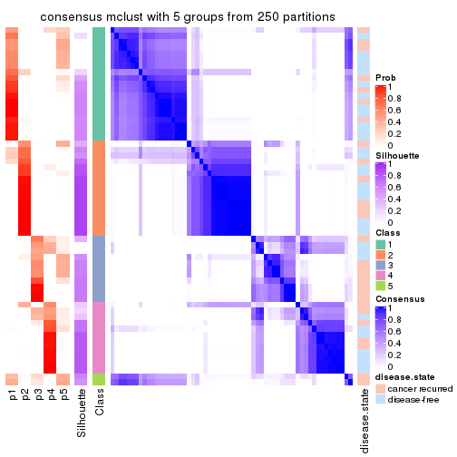</p>

</div>
<div id='tab-ATC-mclust-consensus-heatmap-5'>
<pre><code class="r">consensus_heatmap(res, k = 6)
</code></pre>

<p></p>

</div>
</div>

Heatmaps for the membership of samples in all partitions to see how consistent they are:


<script>
$( function() {
	$( '#tabs-ATC-mclust-membership-heatmap' ).tabs();
} );
</script>
<div id='tabs-ATC-mclust-membership-heatmap'>
<ul>
<li><a href='#tab-ATC-mclust-membership-heatmap-1'>k = 2</a></li>
<li><a href='#tab-ATC-mclust-membership-heatmap-2'>k = 3</a></li>
<li><a href='#tab-ATC-mclust-membership-heatmap-3'>k = 4</a></li>
<li><a href='#tab-ATC-mclust-membership-heatmap-4'>k = 5</a></li>
<li><a href='#tab-ATC-mclust-membership-heatmap-5'>k = 6</a></li>
</ul>
<div id='tab-ATC-mclust-membership-heatmap-1'>
<pre><code class="r">membership_heatmap(res, k = 2)
</code></pre>

<p></p>

</div>
<div id='tab-ATC-mclust-membership-heatmap-2'>
<pre><code class="r">membership_heatmap(res, k = 3)
</code></pre>

<p></p>

</div>
<div id='tab-ATC-mclust-membership-heatmap-3'>
<pre><code class="r">membership_heatmap(res, k = 4)
</code></pre>

<p></p>

</div>
<div id='tab-ATC-mclust-membership-heatmap-4'>
<pre><code class="r">membership_heatmap(res, k = 5)
</code></pre>

<p></p>

</div>
<div id='tab-ATC-mclust-membership-heatmap-5'>
<pre><code class="r">membership_heatmap(res, k = 6)
</code></pre>

<p></p>

</div>
</div>

As soon as we have had the classes for columns, we can look for signatures
which are significantly different between classes which can be candidate marks
for certain classes. Following are the heatmaps for signatures.


Signature heatmaps where rows are scaled:


<script>
$( function() {
	$( '#tabs-ATC-mclust-get-signatures' ).tabs();
} );
</script>
<div id='tabs-ATC-mclust-get-signatures'>
<ul>
<li><a href='#tab-ATC-mclust-get-signatures-1'>k = 2</a></li>
<li><a href='#tab-ATC-mclust-get-signatures-2'>k = 3</a></li>
<li><a href='#tab-ATC-mclust-get-signatures-3'>k = 4</a></li>
<li><a href='#tab-ATC-mclust-get-signatures-4'>k = 5</a></li>
<li><a href='#tab-ATC-mclust-get-signatures-5'>k = 6</a></li>
</ul>
<div id='tab-ATC-mclust-get-signatures-1'>
<pre><code class="r">get_signatures(res, k = 2)
</code></pre>

<p></p>

</div>
<div id='tab-ATC-mclust-get-signatures-2'>
<pre><code class="r">get_signatures(res, k = 3)
</code></pre>

<p></p>

</div>
<div id='tab-ATC-mclust-get-signatures-3'>
<pre><code class="r">get_signatures(res, k = 4)
</code></pre>

<p></p>

</div>
<div id='tab-ATC-mclust-get-signatures-4'>
<pre><code class="r">get_signatures(res, k = 5)
</code></pre>

<p></p>

</div>
<div id='tab-ATC-mclust-get-signatures-5'>
<pre><code class="r">get_signatures(res, k = 6)
</code></pre>

<p></p>

</div>
</div>


Signature heatmaps where rows are not scaled:


<script>
$( function() {
	$( '#tabs-ATC-mclust-get-signatures-no-scale' ).tabs();
} );
</script>
<div id='tabs-ATC-mclust-get-signatures-no-scale'>
<ul>
<li><a href='#tab-ATC-mclust-get-signatures-no-scale-1'>k = 2</a></li>
<li><a href='#tab-ATC-mclust-get-signatures-no-scale-2'>k = 3</a></li>
<li><a href='#tab-ATC-mclust-get-signatures-no-scale-3'>k = 4</a></li>
<li><a href='#tab-ATC-mclust-get-signatures-no-scale-4'>k = 5</a></li>
<li><a href='#tab-ATC-mclust-get-signatures-no-scale-5'>k = 6</a></li>
</ul>
<div id='tab-ATC-mclust-get-signatures-no-scale-1'>
<pre><code class="r">get_signatures(res, k = 2, scale_rows = FALSE)
</code></pre>

<p></p>

</div>
<div id='tab-ATC-mclust-get-signatures-no-scale-2'>
<pre><code class="r">get_signatures(res, k = 3, scale_rows = FALSE)
</code></pre>

<p></p>

</div>
<div id='tab-ATC-mclust-get-signatures-no-scale-3'>
<pre><code class="r">get_signatures(res, k = 4, scale_rows = FALSE)
</code></pre>

<p></p>

</div>
<div id='tab-ATC-mclust-get-signatures-no-scale-4'>
<pre><code class="r">get_signatures(res, k = 5, scale_rows = FALSE)
</code></pre>

<p></p>

</div>
<div id='tab-ATC-mclust-get-signatures-no-scale-5'>
<pre><code class="r">get_signatures(res, k = 6, scale_rows = FALSE)
</code></pre>

<p></p>

</div>
</div>


Compare the overlap of signatures from different k:

```r
compare_signatures(res)
```


`get_signature()` returns a data frame invisibly. TO get the list of signatures, the function
call should be assigned to a variable explicitly. In following code, if `plot` argument is set
to `FALSE`, no heatmap is plotted while only the differential analysis is performed.

```r
# code only for demonstration
tb = get_signature(res, k = ..., plot = FALSE)
```

An example of the output of `tb` is:

```
#>   which_row         fdr    mean_1    mean_2 scaled_mean_1 scaled_mean_2 km
#> 1        38 0.042760348  8.373488  9.131774    -0.5533452     0.5164555  1
#> 2        40 0.018707592  7.106213  8.469186    -0.6173731     0.5762149  1
#> 3        55 0.019134737 10.221463 11.207825    -0.6159697     0.5749050  1
#> 4        59 0.006059896  5.921854  7.869574    -0.6899429     0.6439467  1
#> 5        60 0.018055526  8.928898 10.211722    -0.6204761     0.5791110  1
#> 6        98 0.009384629 15.714769 14.887706     0.6635654    -0.6193277  2
...
```

The columns in `tb` are:

1. `which_row`: row indices corresponding to the input matrix.
2. `fdr`: FDR for the differential test. 
3. `mean_x`: The mean value in group x.
4. `scaled_mean_x`: The mean value in group x after rows are scaled.
5. `km`: Row groups if k-means clustering is applied to rows.


UMAP plot which shows how samples are separated.


<script>
$( function() {
	$( '#tabs-ATC-mclust-dimension-reduction' ).tabs();
} );
</script>
<div id='tabs-ATC-mclust-dimension-reduction'>
<ul>
<li><a href='#tab-ATC-mclust-dimension-reduction-1'>k = 2</a></li>
<li><a href='#tab-ATC-mclust-dimension-reduction-2'>k = 3</a></li>
<li><a href='#tab-ATC-mclust-dimension-reduction-3'>k = 4</a></li>
<li><a href='#tab-ATC-mclust-dimension-reduction-4'>k = 5</a></li>
<li><a href='#tab-ATC-mclust-dimension-reduction-5'>k = 6</a></li>
</ul>
<div id='tab-ATC-mclust-dimension-reduction-1'>
<pre><code class="r">dimension_reduction(res, k = 2, method = &quot;UMAP&quot;)
</code></pre>

<p>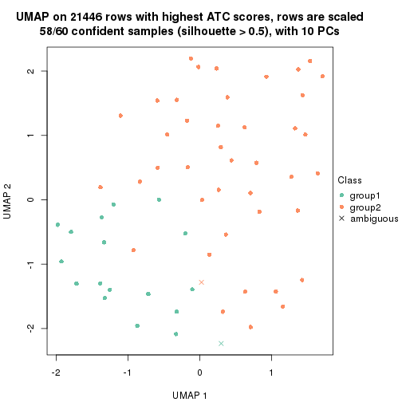</p>

</div>
<div id='tab-ATC-mclust-dimension-reduction-2'>
<pre><code class="r">dimension_reduction(res, k = 3, method = &quot;UMAP&quot;)
</code></pre>

<p></p>

</div>
<div id='tab-ATC-mclust-dimension-reduction-3'>
<pre><code class="r">dimension_reduction(res, k = 4, method = &quot;UMAP&quot;)
</code></pre>

<p></p>

</div>
<div id='tab-ATC-mclust-dimension-reduction-4'>
<pre><code class="r">dimension_reduction(res, k = 5, method = &quot;UMAP&quot;)
</code></pre>

<p></p>

</div>
<div id='tab-ATC-mclust-dimension-reduction-5'>
<pre><code class="r">dimension_reduction(res, k = 6, method = &quot;UMAP&quot;)
</code></pre>

<p></p>

</div>
</div>


Following heatmap shows how subgroups are split when increasing `k`:

```r
collect_classes(res)
```


Test correlation between subgroups and known annotations. If the known
annotation is numeric, one-way ANOVA test is applied, and if the known
annotation is discrete, chi-squared contingency table test is applied.

```r
test_to_known_factors(res)
```

```
#>             n disease.state(p) k
#> ATC:mclust 58           0.1627 2
#> ATC:mclust 59           0.2916 3
#> ATC:mclust 55           0.0936 4
#> ATC:mclust 44           0.0329 5
#> ATC:mclust 43           0.4820 6
```


If matrix rows can be associated to genes, consider to use `GO_Enrichment(res,
...)` to perform function enrichment for the signature genes.


 

---------------------------------------------------


### ATC:NMF


The object with results only for a single top-value method and a single partition method 
can be extracted as:

```r
res = res_list["ATC", "NMF"]
# you can also extract it by
# res = res_list["ATC:NMF"]
```

A summary of `res` and all the functions that can be applied to it:

```r
res
```

```
#> A 'ConsensusPartition' object with k = 2, 3, 4, 5, 6.
#>   On a matrix with 21446 rows and 60 columns.
#>   Top rows (1000, 2000, 3000, 4000, 5000) are extracted by 'ATC' method.
#>   Subgroups are detected by 'NMF' method.
#>   Performed in total 1250 partitions by row resampling.
#>   Best k for subgroups seems to be 2.
#> 
#> Following methods can be applied to this 'ConsensusPartition' object:
#>  [1] "cola_report"             "collect_classes"         "collect_plots"          
#>  [4] "collect_stats"           "colnames"                "compare_signatures"     
#>  [7] "consensus_heatmap"       "dimension_reduction"     "functional_enrichment"  
#> [10] "get_anno_col"            "get_anno"                "get_classes"            
#> [13] "get_consensus"           "get_matrix"              "get_membership"         
#> [16] "get_param"               "get_signatures"          "get_stats"              
#> [19] "is_best_k"               "is_stable_k"             "membership_heatmap"     
#> [22] "ncol"                    "nrow"                    "plot_ecdf"              
#> [25] "rownames"                "select_partition_number" "show"                   
#> [28] "suggest_best_k"          "test_to_known_factors"
```

`collect_plots()` function collects all the plots made from `res` for all `k` (number of partitions)
into one single page to provide an easy and fast comparison between different `k`.

```r
collect_plots(res)
```


The plots are:

- The first row: a plot of the ECDF (Empirical cumulative distribution
  function) curves of the consensus matrix for each `k` and the heatmap of
  predicted classes for each `k`.
- The second row: heatmaps of the consensus matrix for each `k`.
- The third row: heatmaps of the membership matrix for each `k`.
- The fouth row: heatmaps of the signatures for each `k`.

All the plots in panels can be made by individual functions and they are
plotted later in this section.

`select_partition_number()` produces several plots showing different
statistics for choosing "optimized" `k`. There are following statistics:

- ECDF curves of the consensus matrix for each `k`;
- 1-PAC. [The PAC
  score](https://en.wikipedia.org/wiki/Consensus_clustering#Over-interpretation_potential_of_consensus_clustering)
  measures the proportion of the ambiguous subgrouping.
- Mean silhouette score.
- Concordance. The mean probability of fiting the consensus class ids in all
  partitions.
- Area increased. Denote $A_k$ as the area under the ECDF curve for current
  `k`, the area increased is defined as $A_k - A_{k-1}$.
- Rand index. The percent of pairs of samples that are both in a same cluster
  or both are not in a same cluster in the partition of k and k-1.
- Jaccard index. The ratio of pairs of samples are both in a same cluster in
  the partition of k and k-1 and the pairs of samples are both in a same
  cluster in the partition k or k-1.

The detailed explanations of these statistics can be found in [the cola
vignette](http://bioconductor.org/packages/devel/bioc/vignettes/cola/inst/doc/cola.html#toc_13).

Generally speaking, lower PAC score, higher mean silhouette score or higher
concordance corresponds to better partition. Rand index and Jaccard index
measure how similar the current partition is compared to partition with `k-1`.
If they are too similar, we won't accept `k` is better than `k-1`.

```r
select_partition_number(res)
```


The numeric values for all these statistics can be obtained by `get_stats()`.

```r
get_stats(res)
```

```
#>   k 1-PAC mean_silhouette concordance area_increased  Rand Jaccard
#> 2 2 0.774           0.908       0.960         0.4895 0.501   0.501
#> 3 3 0.755           0.854       0.916         0.3713 0.726   0.502
#> 4 4 0.637           0.748       0.841         0.1183 0.851   0.586
#> 5 5 0.660           0.621       0.796         0.0567 0.924   0.714
#> 6 6 0.634           0.507       0.730         0.0468 0.907   0.607
```

`suggest_best_k()` suggests the best $k$ based on these statistics. The rules are as follows:

- All $k$ with Jaccard index larger than 0.95 are removed because the increase of
  the partition number does not provides enough extra information. If all $k$ are removed,
  the best $k$ is assigned by `NA`.
- For $k$ with 1-PAC larger than 0.9, the maximal $k$ is taken as the "best k". Other $k$ is called "optional k".
- If it does not fit the second rule. The $k$ with the highest vote of highest
  1-PAC, mean silhouette and concordance is taken as the "best k".

```r
suggest_best_k(res)
```

```
#> [1] 2
```


Following shows the table of the partitions (You need to click the **show/hide
code output** link to see it). The membership matrix (columns with name `p*`)
is inferred by
[`clue::cl_consensus()`](https://www.rdocumentation.org/link/cl_consensus?package=clue)
function with the `SE` method. Basically the value in the membership matrix
represents the probability to belong to a certain group. The finall class
label for an item is determined with the group with highest probability it
belongs to.

In `get_classes()` function, the entropy is calculated from the membership
matrix and the silhouette score is calculated from the consensus matrix.


<script>
$( function() {
	$( '#tabs-ATC-NMF-get-classes' ).tabs();
} );
</script>
<div id='tabs-ATC-NMF-get-classes'>
<ul>
<li><a href='#tab-ATC-NMF-get-classes-1'>k = 2</a></li>
<li><a href='#tab-ATC-NMF-get-classes-2'>k = 3</a></li>
<li><a href='#tab-ATC-NMF-get-classes-3'>k = 4</a></li>
<li><a href='#tab-ATC-NMF-get-classes-4'>k = 5</a></li>
<li><a href='#tab-ATC-NMF-get-classes-5'>k = 6</a></li>
</ul>

<div id='tab-ATC-NMF-get-classes-1'>
<p><a id='tab-ATC-NMF-get-classes-1-a' style='color:#0366d6' href='#'>show/hide code output</a></p>
<pre><code class="r">cbind(get_classes(res, k = 2), get_membership(res, k = 2))
</code></pre>

<pre><code>#&gt;          class entropy silhouette    p1    p2
#&gt; GSM22453     1  0.2043      0.913 0.968 0.032
#&gt; GSM22458     2  0.0000      0.977 0.000 1.000
#&gt; GSM22465     1  0.0000      0.929 1.000 0.000
#&gt; GSM22466     1  0.0000      0.929 1.000 0.000
#&gt; GSM22468     2  0.0000      0.977 0.000 1.000
#&gt; GSM22469     1  0.0000      0.929 1.000 0.000
#&gt; GSM22471     1  0.7299      0.767 0.796 0.204
#&gt; GSM22472     2  0.0000      0.977 0.000 1.000
#&gt; GSM22474     2  0.4939      0.858 0.108 0.892
#&gt; GSM22476     2  0.0000      0.977 0.000 1.000
#&gt; GSM22477     2  0.0000      0.977 0.000 1.000
#&gt; GSM22478     2  0.0000      0.977 0.000 1.000
#&gt; GSM22481     1  0.4815      0.865 0.896 0.104
#&gt; GSM22484     2  0.0000      0.977 0.000 1.000
#&gt; GSM22485     1  0.0000      0.929 1.000 0.000
#&gt; GSM22487     1  0.0000      0.929 1.000 0.000
#&gt; GSM22488     1  0.0000      0.929 1.000 0.000
#&gt; GSM22489     2  0.0000      0.977 0.000 1.000
#&gt; GSM22490     2  0.0000      0.977 0.000 1.000
#&gt; GSM22492     2  0.0000      0.977 0.000 1.000
#&gt; GSM22493     1  0.7883      0.724 0.764 0.236
#&gt; GSM22494     1  0.0000      0.929 1.000 0.000
#&gt; GSM22497     1  0.0000      0.929 1.000 0.000
#&gt; GSM22498     1  0.5946      0.832 0.856 0.144
#&gt; GSM22501     1  0.6148      0.825 0.848 0.152
#&gt; GSM22502     2  0.0000      0.977 0.000 1.000
#&gt; GSM22503     1  0.0000      0.929 1.000 0.000
#&gt; GSM22504     2  0.0000      0.977 0.000 1.000
#&gt; GSM22505     1  0.0000      0.929 1.000 0.000
#&gt; GSM22506     2  0.0000      0.977 0.000 1.000
#&gt; GSM22507     1  0.9833      0.345 0.576 0.424
#&gt; GSM22508     2  0.0000      0.977 0.000 1.000
#&gt; GSM22449     2  0.5842      0.815 0.140 0.860
#&gt; GSM22450     1  0.0000      0.929 1.000 0.000
#&gt; GSM22451     2  0.0000      0.977 0.000 1.000
#&gt; GSM22452     1  0.0000      0.929 1.000 0.000
#&gt; GSM22454     1  0.0000      0.929 1.000 0.000
#&gt; GSM22455     2  0.0000      0.977 0.000 1.000
#&gt; GSM22456     2  0.0000      0.977 0.000 1.000
#&gt; GSM22457     1  0.9686      0.420 0.604 0.396
#&gt; GSM22459     2  0.0000      0.977 0.000 1.000
#&gt; GSM22460     2  0.0000      0.977 0.000 1.000
#&gt; GSM22461     2  0.0000      0.977 0.000 1.000
#&gt; GSM22462     2  0.9866      0.128 0.432 0.568
#&gt; GSM22463     2  0.0000      0.977 0.000 1.000
#&gt; GSM22464     1  0.0000      0.929 1.000 0.000
#&gt; GSM22467     1  0.0000      0.929 1.000 0.000
#&gt; GSM22470     2  0.0000      0.977 0.000 1.000
#&gt; GSM22473     2  0.0000      0.977 0.000 1.000
#&gt; GSM22475     2  0.0000      0.977 0.000 1.000
#&gt; GSM22479     1  0.0376      0.927 0.996 0.004
#&gt; GSM22480     2  0.0000      0.977 0.000 1.000
#&gt; GSM22482     1  0.0000      0.929 1.000 0.000
#&gt; GSM22483     2  0.0000      0.977 0.000 1.000
#&gt; GSM22486     2  0.0000      0.977 0.000 1.000
#&gt; GSM22491     2  0.0376      0.973 0.004 0.996
#&gt; GSM22495     2  0.0000      0.977 0.000 1.000
#&gt; GSM22496     2  0.0000      0.977 0.000 1.000
#&gt; GSM22499     2  0.0000      0.977 0.000 1.000
#&gt; GSM22500     1  0.0376      0.927 0.996 0.004
</code></pre>

<script>
$('#tab-ATC-NMF-get-classes-1-a').parent().next().next().hide();
$('#tab-ATC-NMF-get-classes-1-a').click(function(){
  $('#tab-ATC-NMF-get-classes-1-a').parent().next().next().toggle();
  return(false);
});
</script>
</div>

<div id='tab-ATC-NMF-get-classes-2'>
<p><a id='tab-ATC-NMF-get-classes-2-a' style='color:#0366d6' href='#'>show/hide code output</a></p>
<pre><code class="r">cbind(get_classes(res, k = 3), get_membership(res, k = 3))
</code></pre>

<pre><code>#&gt;          class entropy silhouette    p1    p2    p3
#&gt; GSM22453     1  0.3267     0.8630 0.884 0.000 0.116
#&gt; GSM22458     2  0.0424     0.9190 0.000 0.992 0.008
#&gt; GSM22465     1  0.0424     0.9237 0.992 0.008 0.000
#&gt; GSM22466     1  0.1163     0.9217 0.972 0.028 0.000
#&gt; GSM22468     2  0.3941     0.7840 0.000 0.844 0.156
#&gt; GSM22469     1  0.1163     0.9217 0.972 0.028 0.000
#&gt; GSM22471     2  0.2878     0.8725 0.096 0.904 0.000
#&gt; GSM22472     3  0.4452     0.8194 0.000 0.192 0.808
#&gt; GSM22474     2  0.0237     0.9190 0.000 0.996 0.004
#&gt; GSM22476     2  0.3267     0.8475 0.000 0.884 0.116
#&gt; GSM22477     3  0.2537     0.9067 0.000 0.080 0.920
#&gt; GSM22478     3  0.1163     0.9069 0.000 0.028 0.972
#&gt; GSM22481     1  0.1964     0.9079 0.944 0.056 0.000
#&gt; GSM22484     3  0.1964     0.9100 0.000 0.056 0.944
#&gt; GSM22485     1  0.1529     0.9111 0.960 0.000 0.040
#&gt; GSM22487     1  0.1163     0.9217 0.972 0.028 0.000
#&gt; GSM22488     1  0.0424     0.9237 0.992 0.008 0.000
#&gt; GSM22489     3  0.2261     0.9090 0.000 0.068 0.932
#&gt; GSM22490     2  0.1163     0.9173 0.000 0.972 0.028
#&gt; GSM22492     2  0.1753     0.9096 0.000 0.952 0.048
#&gt; GSM22493     1  0.3349     0.8641 0.888 0.004 0.108
#&gt; GSM22494     1  0.1289     0.9135 0.968 0.000 0.032
#&gt; GSM22497     1  0.0747     0.9240 0.984 0.016 0.000
#&gt; GSM22498     1  0.6267     0.2185 0.548 0.452 0.000
#&gt; GSM22501     2  0.1163     0.9095 0.028 0.972 0.000
#&gt; GSM22502     2  0.1163     0.9173 0.000 0.972 0.028
#&gt; GSM22503     2  0.2261     0.8866 0.068 0.932 0.000
#&gt; GSM22504     3  0.4062     0.8497 0.000 0.164 0.836
#&gt; GSM22505     1  0.1163     0.9217 0.972 0.028 0.000
#&gt; GSM22506     3  0.1905     0.8928 0.028 0.016 0.956
#&gt; GSM22507     2  0.2537     0.8817 0.080 0.920 0.000
#&gt; GSM22508     2  0.1163     0.9173 0.000 0.972 0.028
#&gt; GSM22449     2  0.0475     0.9186 0.004 0.992 0.004
#&gt; GSM22450     1  0.2066     0.9030 0.940 0.000 0.060
#&gt; GSM22451     3  0.0475     0.8971 0.004 0.004 0.992
#&gt; GSM22452     1  0.0592     0.9241 0.988 0.012 0.000
#&gt; GSM22454     1  0.0747     0.9240 0.984 0.016 0.000
#&gt; GSM22455     3  0.3412     0.8888 0.000 0.124 0.876
#&gt; GSM22456     3  0.2537     0.9071 0.000 0.080 0.920
#&gt; GSM22457     2  0.0983     0.9155 0.016 0.980 0.004
#&gt; GSM22459     3  0.3116     0.8975 0.000 0.108 0.892
#&gt; GSM22460     3  0.1411     0.9089 0.000 0.036 0.964
#&gt; GSM22461     3  0.3686     0.8712 0.000 0.140 0.860
#&gt; GSM22462     3  0.6308    -0.0929 0.492 0.000 0.508
#&gt; GSM22463     3  0.0983     0.8909 0.016 0.004 0.980
#&gt; GSM22464     2  0.3879     0.8169 0.152 0.848 0.000
#&gt; GSM22467     1  0.1860     0.9071 0.948 0.000 0.052
#&gt; GSM22470     3  0.2066     0.9097 0.000 0.060 0.940
#&gt; GSM22473     2  0.1163     0.9173 0.000 0.972 0.028
#&gt; GSM22475     3  0.5678     0.6266 0.000 0.316 0.684
#&gt; GSM22479     2  0.2066     0.8926 0.060 0.940 0.000
#&gt; GSM22480     3  0.0983     0.9024 0.004 0.016 0.980
#&gt; GSM22482     1  0.5058     0.6831 0.756 0.244 0.000
#&gt; GSM22483     3  0.1529     0.9096 0.000 0.040 0.960
#&gt; GSM22486     3  0.3141     0.9067 0.020 0.068 0.912
#&gt; GSM22491     3  0.1878     0.8749 0.044 0.004 0.952
#&gt; GSM22495     2  0.1163     0.9173 0.000 0.972 0.028
#&gt; GSM22496     3  0.0661     0.8950 0.008 0.004 0.988
#&gt; GSM22499     3  0.3267     0.8874 0.000 0.116 0.884
#&gt; GSM22500     2  0.6008     0.4343 0.372 0.628 0.000
</code></pre>

<script>
$('#tab-ATC-NMF-get-classes-2-a').parent().next().next().hide();
$('#tab-ATC-NMF-get-classes-2-a').click(function(){
  $('#tab-ATC-NMF-get-classes-2-a').parent().next().next().toggle();
  return(false);
});
</script>
</div>

<div id='tab-ATC-NMF-get-classes-3'>
<p><a id='tab-ATC-NMF-get-classes-3-a' style='color:#0366d6' href='#'>show/hide code output</a></p>
<pre><code class="r">cbind(get_classes(res, k = 4), get_membership(res, k = 4))
</code></pre>

<pre><code>#&gt;          class entropy silhouette    p1    p2    p3    p4
#&gt; GSM22453     1   0.320     0.8235 0.892 0.016 0.064 0.028
#&gt; GSM22458     2   0.276     0.7564 0.000 0.904 0.048 0.048
#&gt; GSM22465     1   0.172     0.8785 0.936 0.064 0.000 0.000
#&gt; GSM22466     1   0.201     0.8744 0.920 0.080 0.000 0.000
#&gt; GSM22468     2   0.389     0.6638 0.000 0.796 0.196 0.008
#&gt; GSM22469     1   0.201     0.8744 0.920 0.080 0.000 0.000
#&gt; GSM22471     2   0.326     0.7656 0.108 0.872 0.012 0.008
#&gt; GSM22472     4   0.238     0.8501 0.000 0.028 0.052 0.920
#&gt; GSM22474     2   0.300     0.7591 0.000 0.892 0.060 0.048
#&gt; GSM22476     4   0.185     0.8432 0.000 0.048 0.012 0.940
#&gt; GSM22477     3   0.554     0.5769 0.000 0.036 0.644 0.320
#&gt; GSM22478     3   0.321     0.8507 0.000 0.092 0.876 0.032
#&gt; GSM22481     1   0.302     0.8317 0.852 0.148 0.000 0.000
#&gt; GSM22484     3   0.482     0.7300 0.000 0.036 0.748 0.216
#&gt; GSM22485     1   0.363     0.8196 0.872 0.012 0.060 0.056
#&gt; GSM22487     1   0.227     0.8712 0.912 0.084 0.000 0.004
#&gt; GSM22488     1   0.261     0.8518 0.920 0.020 0.020 0.040
#&gt; GSM22489     3   0.344     0.8501 0.000 0.048 0.868 0.084
#&gt; GSM22490     4   0.265     0.7942 0.000 0.120 0.000 0.880
#&gt; GSM22492     4   0.241     0.8090 0.000 0.104 0.000 0.896
#&gt; GSM22493     1   0.580     0.6808 0.724 0.012 0.084 0.180
#&gt; GSM22494     1   0.293     0.8292 0.904 0.012 0.056 0.028
#&gt; GSM22497     1   0.172     0.8785 0.936 0.064 0.000 0.000
#&gt; GSM22498     2   0.437     0.7415 0.156 0.808 0.020 0.016
#&gt; GSM22501     2   0.547     0.5872 0.048 0.684 0.000 0.268
#&gt; GSM22502     2   0.456     0.5342 0.000 0.700 0.004 0.296
#&gt; GSM22503     2   0.317     0.7604 0.116 0.868 0.000 0.016
#&gt; GSM22504     4   0.252     0.8488 0.000 0.016 0.076 0.908
#&gt; GSM22505     1   0.208     0.8724 0.916 0.084 0.000 0.000
#&gt; GSM22506     4   0.279     0.8155 0.004 0.012 0.088 0.896
#&gt; GSM22507     2   0.470     0.5424 0.296 0.696 0.000 0.008
#&gt; GSM22508     2   0.365     0.7454 0.000 0.856 0.052 0.092
#&gt; GSM22449     4   0.605     0.2836 0.040 0.348 0.008 0.604
#&gt; GSM22450     1   0.305     0.8221 0.892 0.016 0.080 0.012
#&gt; GSM22451     3   0.184     0.8557 0.000 0.028 0.944 0.028
#&gt; GSM22452     1   0.172     0.8785 0.936 0.064 0.000 0.000
#&gt; GSM22454     1   0.172     0.8785 0.936 0.064 0.000 0.000
#&gt; GSM22455     3   0.420     0.7725 0.000 0.192 0.788 0.020
#&gt; GSM22456     3   0.364     0.8255 0.000 0.120 0.848 0.032
#&gt; GSM22457     2   0.322     0.7623 0.044 0.880 0.000 0.076
#&gt; GSM22459     3   0.352     0.8453 0.000 0.112 0.856 0.032
#&gt; GSM22460     3   0.230     0.8581 0.000 0.048 0.924 0.028
#&gt; GSM22461     3   0.582     0.5897 0.000 0.060 0.652 0.288
#&gt; GSM22462     1   0.601     0.0672 0.504 0.012 0.464 0.020
#&gt; GSM22463     3   0.130     0.8402 0.016 0.000 0.964 0.020
#&gt; GSM22464     2   0.548     0.2313 0.444 0.540 0.000 0.016
#&gt; GSM22467     1   0.198     0.8733 0.940 0.040 0.016 0.004
#&gt; GSM22470     3   0.364     0.8371 0.000 0.032 0.848 0.120
#&gt; GSM22473     2   0.292     0.7414 0.000 0.876 0.116 0.008
#&gt; GSM22475     4   0.278     0.8454 0.000 0.020 0.084 0.896
#&gt; GSM22479     2   0.230     0.7743 0.060 0.924 0.008 0.008
#&gt; GSM22480     3   0.298     0.8426 0.012 0.016 0.896 0.076
#&gt; GSM22482     1   0.259     0.8531 0.884 0.116 0.000 0.000
#&gt; GSM22483     4   0.495     0.1247 0.000 0.000 0.444 0.556
#&gt; GSM22486     4   0.238     0.8382 0.004 0.004 0.080 0.912
#&gt; GSM22491     3   0.398     0.7500 0.100 0.012 0.848 0.040
#&gt; GSM22495     2   0.331     0.7465 0.000 0.872 0.092 0.036
#&gt; GSM22496     3   0.189     0.8426 0.016 0.000 0.940 0.044
#&gt; GSM22499     4   0.233     0.8481 0.000 0.012 0.072 0.916
#&gt; GSM22500     2   0.494     0.5513 0.316 0.672 0.000 0.012
</code></pre>

<script>
$('#tab-ATC-NMF-get-classes-3-a').parent().next().next().hide();
$('#tab-ATC-NMF-get-classes-3-a').click(function(){
  $('#tab-ATC-NMF-get-classes-3-a').parent().next().next().toggle();
  return(false);
});
</script>
</div>

<div id='tab-ATC-NMF-get-classes-4'>
<p><a id='tab-ATC-NMF-get-classes-4-a' style='color:#0366d6' href='#'>show/hide code output</a></p>
<pre><code class="r">cbind(get_classes(res, k = 5), get_membership(res, k = 5))
</code></pre>

<pre><code>#&gt;          class entropy silhouette    p1    p2    p3    p4    p5
#&gt; GSM22453     1  0.3837    0.59355 0.692 0.000 0.000 0.000 0.308
#&gt; GSM22458     2  0.1603    0.68690 0.004 0.948 0.012 0.004 0.032
#&gt; GSM22465     1  0.1965    0.78014 0.904 0.000 0.000 0.000 0.096
#&gt; GSM22466     1  0.0000    0.77904 1.000 0.000 0.000 0.000 0.000
#&gt; GSM22468     2  0.4655    0.48082 0.000 0.644 0.328 0.000 0.028
#&gt; GSM22469     1  0.0000    0.77904 1.000 0.000 0.000 0.000 0.000
#&gt; GSM22471     2  0.5679    0.68697 0.216 0.680 0.072 0.012 0.020
#&gt; GSM22472     4  0.0960    0.84608 0.000 0.008 0.004 0.972 0.016
#&gt; GSM22474     2  0.3236    0.64524 0.016 0.844 0.004 0.004 0.132
#&gt; GSM22476     4  0.2006    0.83186 0.000 0.012 0.000 0.916 0.072
#&gt; GSM22477     3  0.6224    0.29983 0.000 0.032 0.536 0.360 0.072
#&gt; GSM22478     3  0.0807    0.79861 0.000 0.012 0.976 0.000 0.012
#&gt; GSM22481     1  0.2775    0.70584 0.876 0.100 0.020 0.000 0.004
#&gt; GSM22484     5  0.5980    0.30075 0.000 0.188 0.068 0.076 0.668
#&gt; GSM22485     5  0.4201   -0.11563 0.408 0.000 0.000 0.000 0.592
#&gt; GSM22487     1  0.2518    0.72491 0.896 0.008 0.000 0.080 0.016
#&gt; GSM22488     1  0.4359    0.41817 0.584 0.004 0.000 0.000 0.412
#&gt; GSM22489     3  0.6263    0.55635 0.000 0.068 0.644 0.096 0.192
#&gt; GSM22490     4  0.5422    0.57239 0.000 0.132 0.000 0.656 0.212
#&gt; GSM22492     4  0.0798    0.84377 0.000 0.016 0.000 0.976 0.008
#&gt; GSM22493     5  0.3928    0.17148 0.296 0.000 0.004 0.000 0.700
#&gt; GSM22494     1  0.3816    0.59924 0.696 0.000 0.000 0.000 0.304
#&gt; GSM22497     1  0.2561    0.76542 0.856 0.000 0.000 0.000 0.144
#&gt; GSM22498     2  0.3914    0.71612 0.192 0.780 0.012 0.000 0.016
#&gt; GSM22501     2  0.6639    0.51622 0.092 0.620 0.000 0.116 0.172
#&gt; GSM22502     2  0.4380    0.53361 0.000 0.692 0.012 0.288 0.008
#&gt; GSM22503     2  0.4145    0.68583 0.280 0.708 0.004 0.004 0.004
#&gt; GSM22504     4  0.1267    0.83712 0.000 0.012 0.004 0.960 0.024
#&gt; GSM22505     1  0.0510    0.77340 0.984 0.016 0.000 0.000 0.000
#&gt; GSM22506     4  0.3402    0.79801 0.000 0.012 0.016 0.832 0.140
#&gt; GSM22507     2  0.4064    0.69338 0.272 0.716 0.008 0.004 0.000
#&gt; GSM22508     2  0.4961    0.30440 0.000 0.596 0.004 0.028 0.372
#&gt; GSM22449     5  0.6540    0.05332 0.000 0.300 0.000 0.228 0.472
#&gt; GSM22450     1  0.4115    0.72880 0.800 0.016 0.020 0.012 0.152
#&gt; GSM22451     3  0.0290    0.80199 0.000 0.000 0.992 0.008 0.000
#&gt; GSM22452     1  0.1341    0.78620 0.944 0.000 0.000 0.000 0.056
#&gt; GSM22454     1  0.2648    0.75866 0.848 0.000 0.000 0.000 0.152
#&gt; GSM22455     3  0.2654    0.76596 0.000 0.084 0.884 0.000 0.032
#&gt; GSM22456     3  0.3796    0.73666 0.000 0.076 0.820 0.004 0.100
#&gt; GSM22457     2  0.4111    0.71619 0.216 0.756 0.000 0.012 0.016
#&gt; GSM22459     3  0.1281    0.79885 0.000 0.032 0.956 0.000 0.012
#&gt; GSM22460     3  0.2199    0.79368 0.000 0.016 0.916 0.008 0.060
#&gt; GSM22461     3  0.2844    0.76113 0.000 0.012 0.880 0.088 0.020
#&gt; GSM22462     3  0.7464    0.00906 0.324 0.016 0.484 0.060 0.116
#&gt; GSM22463     3  0.1282    0.79758 0.000 0.000 0.952 0.004 0.044
#&gt; GSM22464     1  0.4591    0.19182 0.648 0.332 0.000 0.008 0.012
#&gt; GSM22467     1  0.3585    0.75514 0.844 0.016 0.000 0.052 0.088
#&gt; GSM22470     3  0.4211    0.69749 0.000 0.016 0.788 0.152 0.044
#&gt; GSM22473     2  0.2574    0.67821 0.000 0.876 0.112 0.000 0.012
#&gt; GSM22475     4  0.1686    0.83846 0.000 0.008 0.028 0.944 0.020
#&gt; GSM22479     2  0.3437    0.72454 0.176 0.808 0.012 0.004 0.000
#&gt; GSM22480     3  0.2100    0.78810 0.000 0.012 0.924 0.048 0.016
#&gt; GSM22482     1  0.1956    0.73535 0.916 0.076 0.000 0.000 0.008
#&gt; GSM22483     4  0.5283    0.31110 0.000 0.016 0.352 0.600 0.032
#&gt; GSM22486     4  0.3383    0.82187 0.024 0.012 0.024 0.868 0.072
#&gt; GSM22491     5  0.4829   -0.21480 0.020 0.000 0.480 0.000 0.500
#&gt; GSM22495     2  0.3629    0.62860 0.000 0.824 0.028 0.012 0.136
#&gt; GSM22496     3  0.0898    0.80286 0.000 0.000 0.972 0.008 0.020
#&gt; GSM22499     4  0.1461    0.83133 0.000 0.016 0.004 0.952 0.028
#&gt; GSM22500     2  0.5965    0.55095 0.364 0.560 0.008 0.040 0.028
</code></pre>

<script>
$('#tab-ATC-NMF-get-classes-4-a').parent().next().next().hide();
$('#tab-ATC-NMF-get-classes-4-a').click(function(){
  $('#tab-ATC-NMF-get-classes-4-a').parent().next().next().toggle();
  return(false);
});
</script>
</div>

<div id='tab-ATC-NMF-get-classes-5'>
<p><a id='tab-ATC-NMF-get-classes-5-a' style='color:#0366d6' href='#'>show/hide code output</a></p>
<pre><code class="r">cbind(get_classes(res, k = 6), get_membership(res, k = 6))
</code></pre>

<pre><code>#&gt;          class entropy silhouette    p1    p2    p3    p4    p5    p6
#&gt; GSM22453     6  0.3961      0.453 0.440 0.000 0.000 0.004 0.000 0.556
#&gt; GSM22458     2  0.3695      0.638 0.000 0.776 0.000 0.004 0.176 0.044
#&gt; GSM22465     1  0.2219      0.563 0.864 0.000 0.000 0.000 0.000 0.136
#&gt; GSM22466     1  0.0000      0.648 1.000 0.000 0.000 0.000 0.000 0.000
#&gt; GSM22468     2  0.4117      0.640 0.000 0.788 0.120 0.004 0.036 0.052
#&gt; GSM22469     1  0.0551      0.649 0.984 0.008 0.000 0.000 0.004 0.004
#&gt; GSM22471     2  0.4370      0.655 0.060 0.760 0.016 0.152 0.012 0.000
#&gt; GSM22472     4  0.2706      0.635 0.000 0.000 0.000 0.832 0.160 0.008
#&gt; GSM22474     2  0.3525      0.658 0.000 0.808 0.000 0.004 0.120 0.068
#&gt; GSM22476     5  0.3742      0.113 0.000 0.004 0.000 0.348 0.648 0.000
#&gt; GSM22477     3  0.6078      0.369 0.000 0.000 0.560 0.184 0.220 0.036
#&gt; GSM22478     3  0.2149      0.743 0.000 0.080 0.900 0.000 0.016 0.004
#&gt; GSM22481     2  0.5624      0.207 0.356 0.516 0.004 0.000 0.004 0.120
#&gt; GSM22484     5  0.5207      0.399 0.000 0.012 0.072 0.000 0.564 0.352
#&gt; GSM22485     6  0.2163      0.626 0.096 0.004 0.000 0.000 0.008 0.892
#&gt; GSM22487     1  0.4981      0.239 0.520 0.024 0.000 0.432 0.004 0.020
#&gt; GSM22488     6  0.4032      0.483 0.420 0.000 0.000 0.000 0.008 0.572
#&gt; GSM22489     3  0.4963      0.301 0.000 0.000 0.536 0.028 0.412 0.024
#&gt; GSM22490     5  0.5412      0.348 0.000 0.060 0.000 0.244 0.636 0.060
#&gt; GSM22492     4  0.3266      0.569 0.000 0.000 0.000 0.728 0.272 0.000
#&gt; GSM22493     6  0.1956      0.622 0.080 0.000 0.004 0.000 0.008 0.908
#&gt; GSM22494     6  0.3911      0.556 0.368 0.000 0.000 0.000 0.008 0.624
#&gt; GSM22497     1  0.4601      0.322 0.680 0.020 0.000 0.004 0.032 0.264
#&gt; GSM22498     2  0.3579      0.698 0.092 0.832 0.012 0.000 0.044 0.020
#&gt; GSM22501     5  0.6746      0.293 0.184 0.232 0.000 0.024 0.520 0.040
#&gt; GSM22502     2  0.3274      0.638 0.000 0.780 0.004 0.208 0.004 0.004
#&gt; GSM22503     2  0.3542      0.667 0.168 0.796 0.000 0.012 0.020 0.004
#&gt; GSM22504     4  0.0790      0.646 0.000 0.000 0.000 0.968 0.032 0.000
#&gt; GSM22505     1  0.1633      0.637 0.932 0.024 0.000 0.000 0.044 0.000
#&gt; GSM22506     4  0.6205      0.193 0.000 0.000 0.004 0.392 0.288 0.316
#&gt; GSM22507     2  0.4761      0.417 0.392 0.568 0.012 0.000 0.024 0.004
#&gt; GSM22508     2  0.5258      0.510 0.000 0.624 0.000 0.004 0.188 0.184
#&gt; GSM22449     5  0.4631      0.512 0.020 0.076 0.004 0.040 0.776 0.084
#&gt; GSM22450     1  0.3240      0.509 0.804 0.000 0.008 0.004 0.008 0.176
#&gt; GSM22451     3  0.0603      0.760 0.000 0.000 0.980 0.000 0.016 0.004
#&gt; GSM22452     1  0.0632      0.644 0.976 0.000 0.000 0.000 0.000 0.024
#&gt; GSM22454     1  0.4336     -0.397 0.504 0.020 0.000 0.000 0.000 0.476
#&gt; GSM22455     3  0.2535      0.748 0.000 0.064 0.888 0.000 0.036 0.012
#&gt; GSM22456     3  0.2414      0.750 0.000 0.028 0.900 0.000 0.044 0.028
#&gt; GSM22457     1  0.6596     -0.200 0.388 0.264 0.012 0.004 0.328 0.004
#&gt; GSM22459     3  0.1845      0.748 0.000 0.072 0.916 0.000 0.008 0.004
#&gt; GSM22460     3  0.2375      0.749 0.000 0.004 0.896 0.004 0.068 0.028
#&gt; GSM22461     3  0.4593      0.632 0.000 0.072 0.724 0.184 0.016 0.004
#&gt; GSM22462     3  0.6179      0.342 0.272 0.004 0.580 0.040 0.020 0.084
#&gt; GSM22463     3  0.1552      0.759 0.000 0.004 0.940 0.000 0.036 0.020
#&gt; GSM22464     1  0.3623      0.565 0.808 0.084 0.000 0.000 0.100 0.008
#&gt; GSM22467     1  0.4092      0.543 0.776 0.000 0.004 0.108 0.008 0.104
#&gt; GSM22470     3  0.4456      0.541 0.000 0.004 0.660 0.036 0.296 0.004
#&gt; GSM22473     2  0.2860      0.681 0.000 0.868 0.068 0.000 0.052 0.012
#&gt; GSM22475     4  0.4852      0.163 0.000 0.000 0.056 0.492 0.452 0.000
#&gt; GSM22479     2  0.2213      0.697 0.100 0.888 0.000 0.000 0.008 0.004
#&gt; GSM22480     3  0.6016      0.384 0.000 0.012 0.532 0.260 0.004 0.192
#&gt; GSM22482     1  0.4015      0.582 0.804 0.108 0.000 0.016 0.044 0.028
#&gt; GSM22483     4  0.2501      0.555 0.000 0.000 0.108 0.872 0.016 0.004
#&gt; GSM22486     5  0.5912      0.359 0.132 0.004 0.076 0.124 0.656 0.008
#&gt; GSM22491     6  0.3799      0.397 0.020 0.000 0.276 0.000 0.000 0.704
#&gt; GSM22495     5  0.5121      0.419 0.012 0.268 0.092 0.000 0.628 0.000
#&gt; GSM22496     3  0.1340      0.758 0.000 0.000 0.948 0.004 0.008 0.040
#&gt; GSM22499     4  0.1556      0.659 0.000 0.000 0.000 0.920 0.080 0.000
#&gt; GSM22500     2  0.5392      0.456 0.088 0.560 0.004 0.340 0.008 0.000
</code></pre>

<script>
$('#tab-ATC-NMF-get-classes-5-a').parent().next().next().hide();
$('#tab-ATC-NMF-get-classes-5-a').click(function(){
  $('#tab-ATC-NMF-get-classes-5-a').parent().next().next().toggle();
  return(false);
});
</script>
</div>
</div>

Heatmaps for the consensus matrix. It visualizes the probability of two
samples to be in a same group.


<script>
$( function() {
	$( '#tabs-ATC-NMF-consensus-heatmap' ).tabs();
} );
</script>
<div id='tabs-ATC-NMF-consensus-heatmap'>
<ul>
<li><a href='#tab-ATC-NMF-consensus-heatmap-1'>k = 2</a></li>
<li><a href='#tab-ATC-NMF-consensus-heatmap-2'>k = 3</a></li>
<li><a href='#tab-ATC-NMF-consensus-heatmap-3'>k = 4</a></li>
<li><a href='#tab-ATC-NMF-consensus-heatmap-4'>k = 5</a></li>
<li><a href='#tab-ATC-NMF-consensus-heatmap-5'>k = 6</a></li>
</ul>
<div id='tab-ATC-NMF-consensus-heatmap-1'>
<pre><code class="r">consensus_heatmap(res, k = 2)
</code></pre>

<p></p>

</div>
<div id='tab-ATC-NMF-consensus-heatmap-2'>
<pre><code class="r">consensus_heatmap(res, k = 3)
</code></pre>

<p></p>

</div>
<div id='tab-ATC-NMF-consensus-heatmap-3'>
<pre><code class="r">consensus_heatmap(res, k = 4)
</code></pre>

<p>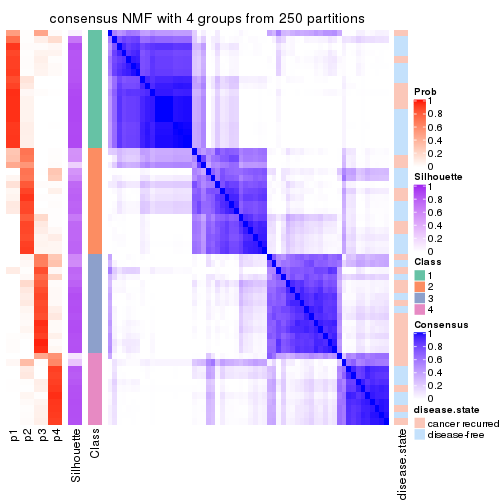</p>

</div>
<div id='tab-ATC-NMF-consensus-heatmap-4'>
<pre><code class="r">consensus_heatmap(res, k = 5)
</code></pre>

<p></p>

</div>
<div id='tab-ATC-NMF-consensus-heatmap-5'>
<pre><code class="r">consensus_heatmap(res, k = 6)
</code></pre>

<p></p>

</div>
</div>

Heatmaps for the membership of samples in all partitions to see how consistent they are:


<script>
$( function() {
	$( '#tabs-ATC-NMF-membership-heatmap' ).tabs();
} );
</script>
<div id='tabs-ATC-NMF-membership-heatmap'>
<ul>
<li><a href='#tab-ATC-NMF-membership-heatmap-1'>k = 2</a></li>
<li><a href='#tab-ATC-NMF-membership-heatmap-2'>k = 3</a></li>
<li><a href='#tab-ATC-NMF-membership-heatmap-3'>k = 4</a></li>
<li><a href='#tab-ATC-NMF-membership-heatmap-4'>k = 5</a></li>
<li><a href='#tab-ATC-NMF-membership-heatmap-5'>k = 6</a></li>
</ul>
<div id='tab-ATC-NMF-membership-heatmap-1'>
<pre><code class="r">membership_heatmap(res, k = 2)
</code></pre>

<p></p>

</div>
<div id='tab-ATC-NMF-membership-heatmap-2'>
<pre><code class="r">membership_heatmap(res, k = 3)
</code></pre>

<p></p>

</div>
<div id='tab-ATC-NMF-membership-heatmap-3'>
<pre><code class="r">membership_heatmap(res, k = 4)
</code></pre>

<p></p>

</div>
<div id='tab-ATC-NMF-membership-heatmap-4'>
<pre><code class="r">membership_heatmap(res, k = 5)
</code></pre>

<p></p>

</div>
<div id='tab-ATC-NMF-membership-heatmap-5'>
<pre><code class="r">membership_heatmap(res, k = 6)
</code></pre>

<p></p>

</div>
</div>

As soon as we have had the classes for columns, we can look for signatures
which are significantly different between classes which can be candidate marks
for certain classes. Following are the heatmaps for signatures.


Signature heatmaps where rows are scaled:


<script>
$( function() {
	$( '#tabs-ATC-NMF-get-signatures' ).tabs();
} );
</script>
<div id='tabs-ATC-NMF-get-signatures'>
<ul>
<li><a href='#tab-ATC-NMF-get-signatures-1'>k = 2</a></li>
<li><a href='#tab-ATC-NMF-get-signatures-2'>k = 3</a></li>
<li><a href='#tab-ATC-NMF-get-signatures-3'>k = 4</a></li>
<li><a href='#tab-ATC-NMF-get-signatures-4'>k = 5</a></li>
<li><a href='#tab-ATC-NMF-get-signatures-5'>k = 6</a></li>
</ul>
<div id='tab-ATC-NMF-get-signatures-1'>
<pre><code class="r">get_signatures(res, k = 2)
</code></pre>

<p></p>

</div>
<div id='tab-ATC-NMF-get-signatures-2'>
<pre><code class="r">get_signatures(res, k = 3)
</code></pre>

<p></p>

</div>
<div id='tab-ATC-NMF-get-signatures-3'>
<pre><code class="r">get_signatures(res, k = 4)
</code></pre>

<p></p>

</div>
<div id='tab-ATC-NMF-get-signatures-4'>
<pre><code class="r">get_signatures(res, k = 5)
</code></pre>

<p></p>

</div>
<div id='tab-ATC-NMF-get-signatures-5'>
<pre><code class="r">get_signatures(res, k = 6)
</code></pre>

<p></p>

</div>
</div>


Signature heatmaps where rows are not scaled:


<script>
$( function() {
	$( '#tabs-ATC-NMF-get-signatures-no-scale' ).tabs();
} );
</script>
<div id='tabs-ATC-NMF-get-signatures-no-scale'>
<ul>
<li><a href='#tab-ATC-NMF-get-signatures-no-scale-1'>k = 2</a></li>
<li><a href='#tab-ATC-NMF-get-signatures-no-scale-2'>k = 3</a></li>
<li><a href='#tab-ATC-NMF-get-signatures-no-scale-3'>k = 4</a></li>
<li><a href='#tab-ATC-NMF-get-signatures-no-scale-4'>k = 5</a></li>
<li><a href='#tab-ATC-NMF-get-signatures-no-scale-5'>k = 6</a></li>
</ul>
<div id='tab-ATC-NMF-get-signatures-no-scale-1'>
<pre><code class="r">get_signatures(res, k = 2, scale_rows = FALSE)
</code></pre>

<p></p>

</div>
<div id='tab-ATC-NMF-get-signatures-no-scale-2'>
<pre><code class="r">get_signatures(res, k = 3, scale_rows = FALSE)
</code></pre>

<p></p>

</div>
<div id='tab-ATC-NMF-get-signatures-no-scale-3'>
<pre><code class="r">get_signatures(res, k = 4, scale_rows = FALSE)
</code></pre>

<p></p>

</div>
<div id='tab-ATC-NMF-get-signatures-no-scale-4'>
<pre><code class="r">get_signatures(res, k = 5, scale_rows = FALSE)
</code></pre>

<p></p>

</div>
<div id='tab-ATC-NMF-get-signatures-no-scale-5'>
<pre><code class="r">get_signatures(res, k = 6, scale_rows = FALSE)
</code></pre>

<p>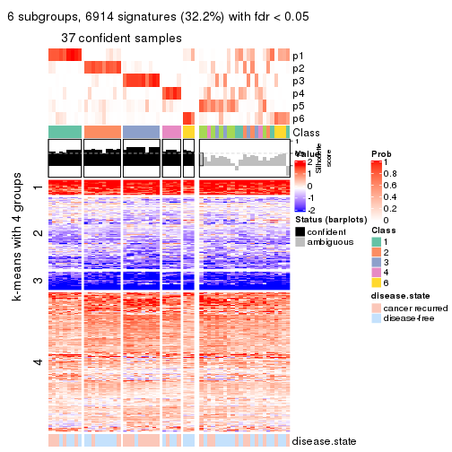</p>

</div>
</div>


Compare the overlap of signatures from different k:

```r
compare_signatures(res)
```


`get_signature()` returns a data frame invisibly. TO get the list of signatures, the function
call should be assigned to a variable explicitly. In following code, if `plot` argument is set
to `FALSE`, no heatmap is plotted while only the differential analysis is performed.

```r
# code only for demonstration
tb = get_signature(res, k = ..., plot = FALSE)
```

An example of the output of `tb` is:

```
#>   which_row         fdr    mean_1    mean_2 scaled_mean_1 scaled_mean_2 km
#> 1        38 0.042760348  8.373488  9.131774    -0.5533452     0.5164555  1
#> 2        40 0.018707592  7.106213  8.469186    -0.6173731     0.5762149  1
#> 3        55 0.019134737 10.221463 11.207825    -0.6159697     0.5749050  1
#> 4        59 0.006059896  5.921854  7.869574    -0.6899429     0.6439467  1
#> 5        60 0.018055526  8.928898 10.211722    -0.6204761     0.5791110  1
#> 6        98 0.009384629 15.714769 14.887706     0.6635654    -0.6193277  2
...
```

The columns in `tb` are:

1. `which_row`: row indices corresponding to the input matrix.
2. `fdr`: FDR for the differential test. 
3. `mean_x`: The mean value in group x.
4. `scaled_mean_x`: The mean value in group x after rows are scaled.
5. `km`: Row groups if k-means clustering is applied to rows.


UMAP plot which shows how samples are separated.


<script>
$( function() {
	$( '#tabs-ATC-NMF-dimension-reduction' ).tabs();
} );
</script>
<div id='tabs-ATC-NMF-dimension-reduction'>
<ul>
<li><a href='#tab-ATC-NMF-dimension-reduction-1'>k = 2</a></li>
<li><a href='#tab-ATC-NMF-dimension-reduction-2'>k = 3</a></li>
<li><a href='#tab-ATC-NMF-dimension-reduction-3'>k = 4</a></li>
<li><a href='#tab-ATC-NMF-dimension-reduction-4'>k = 5</a></li>
<li><a href='#tab-ATC-NMF-dimension-reduction-5'>k = 6</a></li>
</ul>
<div id='tab-ATC-NMF-dimension-reduction-1'>
<pre><code class="r">dimension_reduction(res, k = 2, method = &quot;UMAP&quot;)
</code></pre>

<p>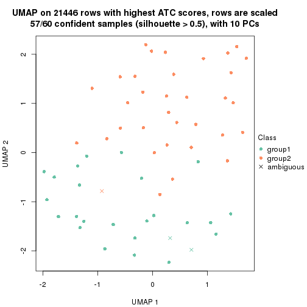</p>

</div>
<div id='tab-ATC-NMF-dimension-reduction-2'>
<pre><code class="r">dimension_reduction(res, k = 3, method = &quot;UMAP&quot;)
</code></pre>

<p></p>

</div>
<div id='tab-ATC-NMF-dimension-reduction-3'>
<pre><code class="r">dimension_reduction(res, k = 4, method = &quot;UMAP&quot;)
</code></pre>

<p></p>

</div>
<div id='tab-ATC-NMF-dimension-reduction-4'>
<pre><code class="r">dimension_reduction(res, k = 5, method = &quot;UMAP&quot;)
</code></pre>

<p></p>

</div>
<div id='tab-ATC-NMF-dimension-reduction-5'>
<pre><code class="r">dimension_reduction(res, k = 6, method = &quot;UMAP&quot;)
</code></pre>

<p></p>

</div>
</div>


Following heatmap shows how subgroups are split when increasing `k`:

```r
collect_classes(res)
```


Test correlation between subgroups and known annotations. If the known
annotation is numeric, one-way ANOVA test is applied, and if the known
annotation is discrete, chi-squared contingency table test is applied.

```r
test_to_known_factors(res)
```

```
#>          n disease.state(p) k
#> ATC:NMF 57           0.1874 2
#> ATC:NMF 57           0.0246 3
#> ATC:NMF 56           0.0496 4
#> ATC:NMF 48           0.0440 5
#> ATC:NMF 38           0.0137 6
```


If matrix rows can be associated to genes, consider to use `GO_Enrichment(res,
...)` to perform function enrichment for the signature genes.


 

## Session info


```r
sessionInfo()
```

```
#> R version 3.6.0 (2019-04-26)
#> Platform: x86_64-pc-linux-gnu (64-bit)
#> Running under: CentOS Linux 7 (Core)
#> 
#> Matrix products: default
#> BLAS:   /usr/lib64/libblas.so.3.4.2
#> LAPACK: /usr/lib64/liblapack.so.3.4.2
#> 
#> locale:
#>  [1] LC_CTYPE=en_GB.UTF-8       LC_NUMERIC=C               LC_TIME=en_GB.UTF-8       
#>  [4] LC_COLLATE=en_GB.UTF-8     LC_MONETARY=en_GB.UTF-8    LC_MESSAGES=en_GB.UTF-8   
#>  [7] LC_PAPER=en_GB.UTF-8       LC_NAME=C                  LC_ADDRESS=C              
#> [10] LC_TELEPHONE=C             LC_MEASUREMENT=en_GB.UTF-8 LC_IDENTIFICATION=C       
#> 
#> attached base packages:
#> [1] grid      parallel  stats     graphics  grDevices utils     datasets  methods   base     
#> 
#> other attached packages:
#> [1] genefilter_1.66.0    ComplexHeatmap_2.1.1 markdown_1.1         knitr_1.26          
#> [5] cola_1.3.2           GEOquery_2.52.0      Biobase_2.44.0       BiocGenerics_0.30.0 
#> [9] GetoptLong_0.1.7    
#> 
#> loaded via a namespace (and not attached):
#>  [1] bitops_1.0-6         matrixStats_0.55.0   bit64_0.9-7          doParallel_1.0.15   
#>  [5] RColorBrewer_1.1-2   httr_1.4.1           tools_3.6.0          backports_1.1.5     
#>  [9] R6_2.4.1             DBI_1.0.0            lazyeval_0.2.2       colorspace_1.4-1    
#> [13] withr_2.1.2          tidyselect_0.2.5     gridExtra_2.3        bit_1.1-14          
#> [17] compiler_3.6.0       xml2_1.2.2           microbenchmark_1.4-7 pkgmaker_0.28       
#> [21] slam_0.1-46          scales_1.1.0         readr_1.3.1          NMF_0.23.6          
#> [25] stringr_1.4.0        digest_0.6.23        pkgconfig_2.0.3      bibtex_0.4.2        
#> [29] highr_0.8            limma_3.40.6         rlang_0.4.2          GlobalOptions_0.1.1 
#> [33] RSQLite_2.1.2        impute_1.58.0        shape_1.4.4          mclust_5.4.5        
#> [37] dendextend_1.12.0    dplyr_0.8.3          RCurl_1.95-4.12      magrittr_1.5        
#> [41] Matrix_1.2-17        Rcpp_1.0.3           munsell_0.5.0        S4Vectors_0.22.1    
#> [45] viridis_0.5.1        lifecycle_0.1.0      stringi_1.4.3        plyr_1.8.4          
#> [49] blob_1.2.0           crayon_1.3.4         lattice_0.20-38      splines_3.6.0       
#> [53] annotate_1.62.0      circlize_0.4.9       hms_0.5.2            zeallot_0.1.0       
#> [57] pillar_1.4.2         rjson_0.2.20         rngtools_1.4         reshape2_1.4.3      
#> [61] codetools_0.2-16     stats4_3.6.0         XML_3.98-1.20        glue_1.3.1          
#> [65] evaluate_0.14        png_0.1-7            vctrs_0.2.0          foreach_1.4.7       
#> [69] polyclip_1.10-0      gtable_0.3.0         purrr_0.3.3          tidyr_1.0.0         
#> [73] clue_0.3-57          assertthat_0.2.1     ggplot2_3.2.1        xfun_0.11           
#> [77] gridBase_0.4-7       eulerr_6.0.0         xtable_1.8-4         skmeans_0.2-11      
#> [81] survival_2.44-1.1    viridisLite_0.3.0    tibble_2.1.3         iterators_1.0.12    
#> [85] AnnotationDbi_1.46.1 registry_0.5-1       memoise_1.1.0        IRanges_2.18.3      
#> [89] cluster_2.1.0        brew_1.0-6
```


